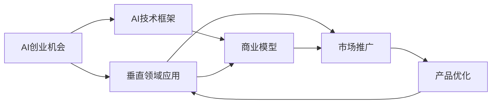

                 

## 1. 背景介绍

### 1.1 问题由来

人工智能(AI)技术在近年来取得了飞速发展，其中机器学习和深度学习技术的突破性应用已经渗透到各个行业，为各行各业带来了翻天覆地的变化。AI技术的迅速普及和应用，使得越来越多的创业者有机会进入这一充满潜力的市场。但同时，技术门槛、市场竞争等挑战也在不断加剧。因此，本文将深入探讨AI创业者在垂直领域的无限机会，帮助有志于此领域的创业者把握市场机遇，实现技术价值和商业价值的最大化。

### 1.2 问题核心关键点

本文将重点讨论以下几个关键问题：

- AI创业机会的识别：如何挖掘AI在特定垂直领域的潜在应用价值，以及在这些领域取得成功的关键因素。
- AI创业项目的技术实现：如何选择和应用适当的AI技术和框架，确保技术实现的效率和准确性。
- AI创业项目的商业模式：如何构建可持续发展的商业模型，实现技术与市场的有效结合。
- AI创业项目的市场推广：如何通过营销策略和用户反馈，扩大AI解决方案的市场影响力。
- AI创业项目的持续优化：如何根据市场反馈和行业发展趋势，不断迭代和优化产品，保持竞争力。

通过回答以上问题，本文将为AI创业者提供全方位的指导和建议，助力其在垂直领域的无限可能性。

## 2. 核心概念与联系

### 2.1 核心概念概述

为深入理解AI创业者在垂直领域的机会，本文将介绍几个关键概念及其相互关系：

- **AI创业机会**：指AI技术在特定垂直领域的应用价值，通常包括市场规模、技术需求、竞争环境等因素。
- **垂直领域应用**：指AI技术针对某一特定行业的深入应用，如医疗、金融、教育、制造等，这些领域具有相对明确的业务需求和技术挑战。
- **AI技术框架**：包括机器学习、深度学习、自然语言处理(NLP)、计算机视觉(CV)等技术框架，提供AI项目开发的技术基础。
- **商业模型**：包括产品销售、订阅服务、定制化解决方案等多种商业模型，为AI项目提供可持续发展的财务支撑。
- **市场推广**：通过营销活动、品牌建设、用户教育等方式，提高AI解决方案的市场知名度和接受度。
- **产品优化**：通过用户反馈和数据分析，持续改进AI产品的功能、性能和用户体验。

这些概念之间的联系可以通过以下Mermaid流程图来展示：



此流程图展示了AI创业机会如何通过选择垂直领域应用、构建技术框架、设计商业模型、进行市场推广和不断优化产品来实现其商业价值和技术价值。

## 3. 核心算法原理 & 具体操作步骤

### 3.1 算法原理概述

AI创业者在垂直领域的成功，离不开对特定领域需求的深入理解和对AI技术的精准应用。本文将详细探讨几种常见的AI技术框架及其在垂直领域的应用原理。

- **机器学习**：通过对大量数据进行学习，构建预测模型。在垂直领域，机器学习常用于需求预测、用户行为分析等任务。
- **深度学习**：通过构建多层神经网络，学习复杂特征。深度学习在图像识别、语音识别、自然语言处理等领域表现出色。
- **自然语言处理**：利用语言学和计算技术，解析和生成文本数据。NLP在智能客服、智能推荐、情感分析等任务中得到广泛应用。
- **计算机视觉**：通过图像识别、目标检测等技术，解析视觉数据。CV在自动驾驶、智能监控、医疗影像等领域有重要应用。

### 3.2 算法步骤详解

AI创业者在垂直领域的具体操作步骤可以分为以下几个步骤：

1. **市场调研**：通过市场调研和用户访谈，了解目标行业的需求和痛点。
2. **技术评估**：根据行业需求，选择适合的AI技术和框架，进行技术评估和可行性分析。
3. **原型开发**：构建原型系统，验证技术方案的可行性和用户接受度。
4. **产品迭代**：根据用户反馈和市场需求，不断优化和改进产品功能。
5. **市场推广**：通过营销活动和品牌建设，提高产品知名度和市场接受度。
6. **商业模型设计**：根据市场反馈和行业特性，设计可持续的商业模型。

### 3.3 算法优缺点

AI技术在垂直领域应用的优势包括：

- **定制化优势**：AI技术能够根据不同行业的特性进行定制化开发，提供量身定做的解决方案。
- **高附加值**：AI技术的深度学习、自然语言处理等能力，能够显著提升企业的运营效率和决策质量。
- **市场潜力大**：垂直领域通常具有相对明确的市场需求和应用场景，易于验证商业模型。

然而，AI技术在垂直领域应用也存在一些挑战：

- **技术门槛高**：AI技术的实现通常需要高水平的专业知识和丰富的数据资源。
- **高成本**：AI技术的开发和维护成本较高，对中小企业可能构成较大压力。
- **法规合规**：AI技术的开发和应用需遵守相关法规和标准，如隐私保护、数据安全等。

### 3.4 算法应用领域

AI技术在垂直领域的广泛应用，包括以下几个典型领域：

- **医疗健康**：包括智能诊断、个性化治疗、健康管理等。AI在医疗影像分析、疾病预测等方面表现突出。
- **金融服务**：涵盖智能风控、智能投顾、金融分析等。AI在信用评估、欺诈检测、智能投顾等方面有广泛应用。
- **教育培训**：包括智能教育、个性化学习、教育管理等。AI在智能答疑、学生评估、课程推荐等方面有显著优势。
- **智能制造**：涉及智能质检、供应链优化、设备维护等。AI在质量检测、设备预测性维护、生产调度等方面有重要应用。
- **智能交通**：包括智能导航、自动驾驶、交通管理等。AI在交通预测、事故预警、驾驶辅助等方面有显著效果。

## 4. 数学模型和公式 & 详细讲解 & 举例说明

### 4.1 数学模型构建

在AI技术的具体应用中，数学模型是核心。本文将以自然语言处理(NLP)中的文本分类任务为例，介绍数学模型的构建过程。

假设我们有一组文本数据 $D=\{(x_i, y_i)\}_{i=1}^N$，其中 $x_i$ 为文本样本， $y_i$ 为标签。我们的目标是构建一个文本分类器 $f(x)$，使得 $f(x)$ 能够准确预测文本的类别 $y$。

### 4.2 公式推导过程

文本分类任务常用的模型包括朴素贝叶斯、支持向量机(SVM)、逻辑回归等。这里，我们将以逻辑回归为例，介绍数学模型的推导过程。

逻辑回归的模型形式为：

$$
P(y=1|x;\theta) = \sigma(\theta^T x)
$$

其中，$\sigma(\cdot)$ 为sigmoid函数，$\theta^T x$ 为线性预测函数。

根据最大似然估计，损失函数可以表示为：

$$
\mathcal{L}(\theta) = -\frac{1}{N}\sum_{i=1}^N [y_i \log P(y=1|x_i;\theta) + (1-y_i) \log P(y=0|x_i;\theta)]
$$

利用梯度下降等优化算法，我们可以最小化损失函数，求解出最优参数 $\theta$。

### 4.3 案例分析与讲解

在实际应用中，我们可以使用Python的scikit-learn库来实现逻辑回归模型。以下是一个简单的代码示例：

```python
from sklearn.linear_model import LogisticRegression
from sklearn.metrics import accuracy_score
from sklearn.model_selection import train_test_split

# 准备数据
X, y = load_data()

# 分割数据集
X_train, X_test, y_train, y_test = train_test_split(X, y, test_size=0.2, random_state=42)

# 训练模型
clf = LogisticRegression()
clf.fit(X_train, y_train)

# 测试模型
y_pred = clf.predict(X_test)
accuracy = accuracy_score(y_test, y_pred)
print("Accuracy:", accuracy)
```

通过这个简单的示例，我们可以看到如何使用scikit-learn库实现逻辑回归模型，并对模型进行评估。

## 5. 项目实践：代码实例和详细解释说明

### 5.1 开发环境搭建

为了进行AI项目开发，我们需要搭建一个开发环境。以下是一些常见的开发环境和工具：

1. **Python 环境**：可以使用Anaconda、Virtualenv等工具搭建虚拟环境，安装所需的Python库和依赖。
2. **机器学习框架**：常用的框架包括scikit-learn、TensorFlow、PyTorch等，具体选择取决于项目需求。
3. **数据库和存储**：根据数据量和存储需求，选择合适的数据库和存储方案，如MySQL、MongoDB等。
4. **云计算平台**：可以使用AWS、Google Cloud、阿里云等云平台，提供计算、存储和网络资源。

### 5.2 源代码详细实现

以医疗影像分类项目为例，我们可以使用TensorFlow框架实现深度学习模型。以下是实现过程的代码示例：

```python
import tensorflow as tf
from tensorflow.keras import layers, models

# 定义模型
model = models.Sequential()
model.add(layers.Conv2D(32, (3, 3), activation='relu', input_shape=(32, 32, 3)))
model.add(layers.MaxPooling2D((2, 2)))
model.add(layers.Conv2D(64, (3, 3), activation='relu'))
model.add(layers.MaxPooling2D((2, 2)))
model.add(layers.Conv2D(64, (3, 3), activation='relu'))
model.add(layers.Flatten())
model.add(layers.Dense(64, activation='relu'))
model.add(layers.Dense(1, activation='sigmoid'))

# 编译模型
model.compile(optimizer='adam',
              loss='binary_crossentropy',
              metrics=['accuracy'])

# 训练模型
model.fit(train_images, train_labels, epochs=10, validation_data=(val_images, val_labels))

# 评估模型
test_loss, test_acc = model.evaluate(test_images, test_labels)
print('Test accuracy:', test_acc)
```

通过这段代码，我们可以看到如何使用TensorFlow实现一个简单的卷积神经网络(CNN)模型，并在医疗影像分类任务中进行训练和评估。

### 5.3 代码解读与分析

在实际开发中，上述代码示例只是一个基础框架。为了满足具体的业务需求，我们需要进行以下方面的优化：

1. **数据预处理**：包括数据清洗、归一化、增强等步骤，提升数据质量。
2. **模型调整**：根据具体任务，选择合适的模型结构、超参数和优化器，进行模型调优。
3. **模型评估**：使用多种指标（如精度、召回率、F1分数等）评估模型性能，确保模型在不同数据集上的泛化能力。

## 6. 实际应用场景

### 6.1 医疗健康

AI技术在医疗健康领域的应用非常广泛，涵盖智能诊断、个性化治疗、健康管理等。例如，在智能诊断方面，AI可以通过分析医学影像、电子病历等数据，辅助医生进行疾病诊断和治疗方案选择。在个性化治疗方面，AI可以根据患者的基因数据、生活习惯等信息，制定个性化的治疗方案。在健康管理方面，AI可以通过分析用户的生活习惯、运动数据等，提供健康管理建议。

### 6.2 金融服务

金融领域是AI技术的重要应用场景之一，涵盖智能风控、智能投顾、金融分析等。例如，在智能风控方面，AI可以通过分析用户的信用记录、行为数据等，评估用户的信用风险。在智能投顾方面，AI可以根据市场数据和用户偏好，提供个性化的投资建议。在金融分析方面，AI可以处理大量的交易数据，发现市场趋势和异常情况。

### 6.3 教育培训

AI技术在教育培训领域的应用包括智能教育、个性化学习、教育管理等。例如，在智能教育方面，AI可以分析学生的学习行为，提供个性化的学习建议。在个性化学习方面，AI可以根据学生的学习数据，推荐适合的学习内容和路径。在教育管理方面，AI可以分析学生的成绩、出勤情况等数据，提供教育管理建议。

### 6.4 未来应用展望

随着AI技术的不断发展，其在垂直领域的应用前景非常广阔。未来，AI技术有望在以下几个方面取得更大的突破：

1. **跨领域应用**：AI技术可以跨越不同领域，实现多领域协同，提高系统的综合能力。
2. **实时性增强**：AI技术的实时处理能力将进一步提升，能够实时响应用户需求，提供即时服务。
3. **智能交互**：AI技术将实现更智能的交互，通过自然语言处理和语音识别，提升用户体验。
4. **个性化服务**：AI技术将实现更加个性化的服务，根据用户需求和行为，提供定制化的解决方案。
5. **伦理和法规**：AI技术的应用需遵守相关伦理和法规，保障用户隐私和数据安全。

## 7. 工具和资源推荐

### 7.1 学习资源推荐

为了帮助AI创业者快速掌握垂直领域的机会和应用，以下是一些推荐的资源：

1. **在线课程**：Coursera、Udacity等在线平台提供了丰富的AI课程，涵盖机器学习、深度学习、自然语言处理等领域。
2. **书籍和论文**：阅读《深度学习》、《Python机器学习》等经典书籍，以及最新的AI论文，了解前沿技术。
3. **开源项目**：Github、Gitlab等平台上，有许多优秀的开源项目，可以作为学习和参考的资源。
4. **社区和论坛**：参加Kaggle、Stack Overflow等社区和论坛，交流经验和获取资源。

### 7.2 开发工具推荐

AI创业项目通常需要多种开发工具的支持，以下是一些推荐的工具：

1. **Python环境**：Anaconda、Virtualenv、Jupyter Notebook等工具，方便Python编程和数据处理。
2. **机器学习框架**：TensorFlow、PyTorch、Scikit-learn等框架，提供丰富的机器学习和深度学习算法。
3. **数据库和存储**：MySQL、MongoDB、Hadoop等数据库和存储方案，满足不同数据量的需求。
4. **云计算平台**：AWS、Google Cloud、阿里云等平台，提供计算、存储和网络资源。

### 7.3 相关论文推荐

AI技术在垂直领域的应用涉及众多领域，以下是一些相关的学术论文推荐：

1. **机器学习**：《Machine Learning Yearning》、《Hands-On Machine Learning with Scikit-Learn》等书籍，以及《Machine Learning》、《Pattern Recognition and Machine Learning》等经典论文。
2. **深度学习**：《Deep Learning》、《Programming Deep Learning》等书籍，以及《Deep Neural Networks for Machine Learning》、《Convolutional Neural Networks for Visual Recognition》等经典论文。
3. **自然语言处理**：《Speech and Language Processing》、《Natural Language Processing with Python》等书籍，以及《Attention Is All You Need》、《Bert: Pre-training of Deep Bidirectional Transformers for Language Understanding》等经典论文。

## 8. 总结：未来发展趋势与挑战

### 8.1 总结

本文对AI创业者在垂直领域的机会进行了全面系统的探讨。首先，通过识别AI创业机会、选择垂直领域应用、构建技术框架、设计商业模型、进行市场推广和不断优化产品，帮助AI创业者理解在垂直领域无限的潜力。其次，详细讲解了AI技术在各个垂直领域的应用原理和操作步骤，提供了具体的代码示例和详细解读。最后，讨论了AI技术在垂直领域的应用前景和挑战，为AI创业者的未来发展提供了指导。

### 8.2 未来发展趋势

未来，AI技术在垂直领域的发展将呈现以下几个趋势：

1. **跨领域融合**：AI技术将跨越不同领域，实现多领域协同，提升系统的综合能力。
2. **实时性和智能交互**：AI技术的实时处理能力和智能交互能力将进一步提升，提供更高效的用户体验。
3. **个性化服务**：AI技术将实现更加个性化的服务，根据用户需求和行为，提供定制化的解决方案。
4. **伦理和法规**：AI技术的应用需遵守相关伦理和法规，保障用户隐私和数据安全。

### 8.3 面临的挑战

尽管AI技术在垂直领域的应用前景广阔，但仍面临一些挑战：

1. **技术门槛高**：AI技术的实现通常需要高水平的专业知识和丰富的数据资源。
2. **高成本**：AI技术的开发和维护成本较高，对中小企业可能构成较大压力。
3. **法规合规**：AI技术的开发和应用需遵守相关法规和标准，如隐私保护、数据安全等。
4. **数据获取难**：获取高质量的数据集通常需要投入大量的时间和资源，增加了AI项目的开发难度。
5. **模型解释性差**：许多AI模型如深度学习等，缺乏可解释性，难以满足某些领域对模型透明度的要求。

### 8.4 研究展望

为了克服以上挑战，未来的AI技术发展需要在以下几个方面进行深入研究：

1. **数据获取和处理**：开发高效的数据采集和处理技术，降低数据获取成本，提升数据质量。
2. **模型解释性**：研究如何提升AI模型的解释性，满足不同领域对模型透明度的需求。
3. **跨领域融合**：探索跨领域知识融合的方法，提升AI系统在不同领域中的适应性。
4. **实时性和智能交互**：研究提升AI系统实时处理能力和智能交互技术，提升用户体验。
5. **法规合规**：研究AI技术在不同领域中的应用规范，保障用户隐私和数据安全。

## 9. 附录：常见问题与解答

**Q1：如何选择合适的垂直领域进行AI创业？**

A: 选择垂直领域进行AI创业，需要考虑以下几个方面：

1. **市场需求**：选择有较大市场需求的垂直领域，确保项目的商业价值。
2. **技术可行性**：评估自身技术实力，确保在垂直领域有足够的技术支持。
3. **资源获取**：考虑获取高质量数据、技术和人才的可行性，确保项目的顺利实施。
4. **法规合规**：评估垂直领域的相关法规和标准，确保合规性。

**Q2：如何进行AI项目的商业模型设计？**

A: 商业模型设计是AI项目成功的关键，以下是一些建议：

1. **产品定价策略**：根据目标客户和市场需求，制定合理的定价策略，如按服务收费、按订阅收费等。
2. **服务模式选择**：根据客户需求和自身技术实力，选择合适的服务模式，如API接口服务、定制化解决方案等。
3. **收入来源多样化**：考虑多元化的收入来源，如广告、数据销售、增值服务等。
4. **盈利模式优化**：不断优化盈利模式，提升项目的可持续性。

**Q3：AI技术在垂直领域应用时，如何保障数据安全？**

A: 保障数据安全是AI技术在垂直领域应用的重要前提，以下是一些建议：

1. **数据加密**：使用加密技术保护数据的机密性，防止数据泄露。
2. **访问控制**：使用访问控制技术限制数据的访问权限，防止未经授权的访问。
3. **数据匿名化**：对敏感数据进行匿名化处理，保护用户隐私。
4. **安全审计**：定期进行安全审计，发现和修复潜在的安全漏洞。

**Q4：AI技术在垂直领域应用时，如何提升模型的解释性？**

A: 提升AI模型的解释性是确保模型可信度的重要手段，以下是一些建议：

1. **可解释模型**：使用可解释性较强的模型，如决策树、线性回归等。
2. **特征重要性分析**：分析模型中各个特征的重要性，帮助理解模型的决策过程。
3. **可视化工具**：使用可视化工具展示模型内部结构和参数变化，提升模型的透明度。

**Q5：AI技术在垂直领域应用时，如何处理数据偏差问题？**

A: 数据偏差是AI模型常见的问题，以下是一些处理建议：

1. **数据预处理**：对数据进行清洗和归一化，减少数据偏差的影响。
2. **数据增强**：使用数据增强技术，增加数据多样性，减少数据偏差。
3. **模型校准**：通过模型校准技术，调整模型预测结果，减少偏差。
4. **公平性评估**：使用公平性评估指标，评估模型在不同群体中的表现，发现和解决偏差问题。

---

作者：禅与计算机程序设计艺术 / Zen and the Art of Computer Programming

