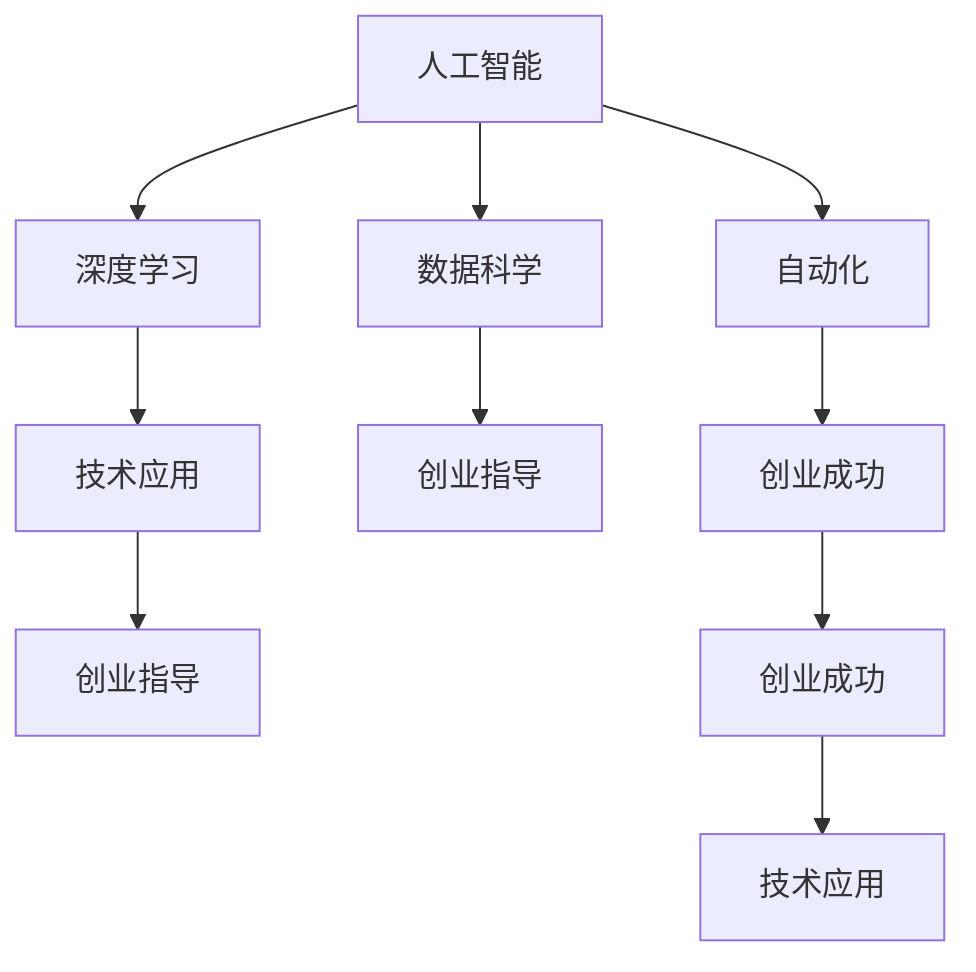

                 

# AI创业：人工智能的革命性突破

> 关键词：人工智能,创业,深度学习,数据科学,自动化,创业指导,技术应用,创业成功

## 1. 背景介绍

### 1.1 问题由来

近年来，人工智能（AI）技术迅猛发展，不仅在学术界引发了广泛的讨论和研究，更在工业界获得了前所未有的关注和应用。特别是深度学习、自然语言处理、计算机视觉等领域的技术突破，使得AI技术在各个行业中得以广泛应用。然而，尽管AI技术的发展势头迅猛，其真正实现商业化、产业化却面临诸多挑战。这些问题包括但不限于数据获取难度大、算法复杂度高、市场竞争激烈等。

创业者的加入，为AI技术的进一步发展和产业化带来了新的可能性。他们不仅能带来新的视角和技术，更能在市场和商业化过程中带来新的活力和动力。本文将聚焦于AI创业的革命性突破，通过技术、市场和创业成功案例，深入分析AI创业的机遇与挑战，为有意于在AI领域创业的人士提供宝贵的指导和启发。

### 1.2 问题核心关键点

AI创业的核心关键点主要集中在以下几个方面：

1. **技术突破**：如何在现有技术基础上实现新的算法、模型或应用，形成独特的技术壁垒。
2. **市场定位**：如何找到AI技术在特定行业的切入点，满足用户需求并解决实际问题。
3. **商业化路径**：如何通过商业模式创新，实现技术的有效商业化应用。
4. **团队建设**：如何吸引和培养优秀的AI技术人才，构建高效的团队。
5. **数据获取与处理**：如何获取高质量数据并实现高效的数据处理，是AI技术落地的重要基础。

## 2. 核心概念与联系

### 2.1 核心概念概述

为更好地理解AI创业的原理和方法，本节将介绍几个关键概念：

1. **人工智能（AI）**：通过模拟人类智能，使计算机系统能够自主地执行任务，包括但不限于自然语言处理、计算机视觉、机器学习等。
2. **深度学习（DL）**：一种基于神经网络的机器学习技术，能够自动提取数据特征，实现复杂模式的识别和分类。
3. **数据科学（DS）**：以数据为核心，通过统计分析、机器学习等方法，提取数据中的有价值信息，支持决策和优化。
4. **自动化（Automation）**：利用AI技术，自动完成重复性高、规则明确的任务，提升效率和准确性。
5. **创业指导（Entrepreneurship Guidance）**：在创业过程中，提供技术、市场、商业模式等方面的指导和建议，帮助创业者顺利度过创业初期。
6. **技术应用（Technological Application）**：将AI技术应用于特定行业或领域，解决实际问题，创造商业价值。
7. **创业成功（Entrepreneurial Success）**：在技术突破、市场定位、商业化路径、团队建设、数据获取等方面取得成功，实现公司的可持续发展和盈利。

这些概念之间的逻辑关系可以通过以下Mermaid流程图来展示：



这个流程图展示了AI创业的各个环节及其相互关系：

1. 人工智能技术是深度学习、数据科学、自动化等技术的基础。
2. 深度学习是实现复杂模式识别的核心手段。
3. 数据科学通过提取数据中的有价值信息，支持技术应用和商业决策。
4. 自动化利用AI技术自动完成重复性任务，提升效率。
5. 技术应用将AI技术应用于特定行业或领域，解决实际问题。
6. 创业指导提供技术、市场、商业模式等方面的指导，帮助创业者成功。
7. 创业成功需要技术突破、市场定位、商业化路径、团队建设、数据获取等多方面的成功。

## 3. 核心算法原理 & 具体操作步骤
### 3.1 算法原理概述

AI创业的核心算法原理主要基于机器学习、深度学习、数据科学等技术，通过算法模型的训练、优化和应用，实现技术突破和商业化。具体来说，算法原理包括以下几个方面：

1. **监督学习（Supervised Learning）**：通过已标注数据训练模型，使其能够预测新数据标签。监督学习适用于分类、回归等任务。
2. **无监督学习（Unsupervised Learning）**：无需标注数据，通过数据本身的特征，发现数据中的潜在模式和结构。无监督学习适用于聚类、降维等任务。
3. **强化学习（Reinforcement Learning）**：通过与环境的交互，学习最优策略，实现特定目标。强化学习适用于游戏、机器人控制等任务。
4. **迁移学习（Transfer Learning）**：利用已训练的模型在新任务上进行微调，提升模型在新任务上的表现。迁移学习适用于数据量较少、计算资源有限的情况。
5. **多任务学习（Multi-task Learning）**：在同一模型上同时训练多个任务，共享部分参数，提升整体性能。多任务学习适用于任务间有共性的场景。
6. **集成学习（Ensemble Learning）**：通过多个模型的组合，提升整体预测性能。集成学习适用于减少模型偏差、提高稳定性等场景。

### 3.2 算法步骤详解

基于AI创业的核心算法原理，下面详细介绍AI创业的具体操作步骤：

**Step 1: 问题定义与需求分析**
- 明确创业的目标和方向，确定AI技术的具体应用场景。
- 分析目标用户的需求和痛点，设计解决方案。
- 确定技术方案，选择适当的算法和模型。

**Step 2: 数据收集与处理**
- 收集相关领域的高质量数据，如客户数据、产品数据、市场数据等。
- 清洗、预处理数据，去除噪声、填补缺失值等。
- 将数据划分为训练集、验证集和测试集，进行交叉验证。

**Step 3: 模型训练与优化**
- 选择适当的深度学习模型或算法，设计训练流程。
- 进行模型训练，通过调整超参数（如学习率、批大小等）优化模型性能。
- 使用验证集进行模型调参，避免过拟合。

**Step 4: 模型评估与验证**
- 使用测试集评估模型性能，计算准确率、召回率、F1值等指标。
- 分析模型的优点和不足，进行改进优化。
- 进行用户测试，收集反馈意见，不断迭代改进。

**Step 5: 商业化部署与运营**
- 将模型部署到生产环境中，实现自动化的数据处理和决策支持。
- 根据业务需求，设计数据接口和API，支持第三方系统集成。
- 定期收集用户数据，进行模型更新和优化，持续提升服务质量。

### 3.3 算法优缺点

AI创业中使用的核心算法具有以下优点和缺点：

**优点**：
1. **自动化高**：AI算法能够自动处理大量数据，提升效率和准确性。
2. **适应性强**：AI技术可以适应各种行业和领域，灵活性强。
3. **预测能力强**：AI模型可以通过数据分析，实现精准的预测和决策支持。

**缺点**：
1. **算法复杂**：AI算法设计复杂，需要专业的知识背景和经验。
2. **数据依赖**：AI算法依赖高质量的数据，数据获取难度大。
3. **模型解释性差**：AI模型通常缺乏解释性，难以理解决策过程。
4. **计算资源需求高**：AI算法通常需要高性能计算资源，成本较高。

### 3.4 算法应用领域

AI创业的算法和技术广泛应用于各个行业，具体包括：

1. **金融科技**：通过AI算法进行风险评估、信用评分、交易预测等，提升金融服务效率和安全性。
2. **医疗健康**：利用AI技术进行疾病预测、影像分析、药物研发等，提高医疗服务水平和效率。
3. **零售电商**：通过AI算法进行客户行为分析、推荐系统、库存管理等，提升客户体验和运营效率。
4. **智能制造**：利用AI技术进行生产调度、质量检测、设备维护等，提升制造过程的智能化和自动化。
5. **智能安防**：通过AI算法进行图像识别、行为分析、异常检测等，提高安防系统的智能化和准确性。
6. **智慧城市**：利用AI技术进行交通管理、公共安全、环境监测等，提升城市管理和居民生活质量。

## 4. 数学模型和公式 & 详细讲解 & 举例说明
### 4.1 数学模型构建

基于AI创业的核心算法原理，下面详细介绍AI创业中常用的数学模型和公式：

1. **监督学习模型（Linear Regression）**
   - 线性回归模型通过最小二乘法，拟合样本数据，实现对目标变量的预测。
   - 公式推导过程：
   $$
   \hat{y} = \theta_0 + \theta_1 x_1 + \theta_2 x_2 + ... + \theta_n x_n
   $$
   其中，$\theta_0, \theta_1, \theta_2, ..., \theta_n$ 为模型参数，$x_1, x_2, ..., x_n$ 为自变量，$\hat{y}$ 为预测值。

2. **深度学习模型（Convolutional Neural Network, CNN）**
   - CNN模型通过卷积操作，提取输入数据的局部特征，适用于图像识别和分类任务。
   - 公式推导过程：
   $$
   \hat{y} = \sigma\left(\sum_{i=1}^n w_i h_{i-1} + b\right)
   $$
   其中，$h_{i-1}$ 为前一层的输出，$\sigma$ 为激活函数，$w_i, b$ 为可训练参数。

3. **强化学习模型（Q-Learning）**
   - Q-Learning通过与环境的交互，学习最优策略，实现特定目标。
   - 公式推导过程：
   $$
   Q(s_t, a_t) = Q(s_t, a_t) + \alpha \left(r_t + \gamma \max_{a_{t+1}} Q(s_{t+1}, a_{t+1}) - Q(s_t, a_t)\right)
   $$
   其中，$Q(s_t, a_t)$ 为状态动作值函数，$\alpha$ 为学习率，$\gamma$ 为折扣因子。

4. **迁移学习模型（Fine-tuning）**
   - 迁移学习通过在已有模型上进行微调，提升模型在新任务上的表现。
   - 公式推导过程：
   $$
   \theta_{\text{fine-tuned}} = \theta_{\text{pre-trained}} - \eta \nabla_{\theta_{\text{pre-trained}}} \mathcal{L}(\theta_{\text{pre-trained}}, D_{\text{target}})
   $$
   其中，$\theta_{\text{fine-tuned}}$ 为微调后的参数，$\theta_{\text{pre-trained}}$ 为预训练参数，$\mathcal{L}$ 为损失函数，$D_{\text{target}}$ 为目标任务的标注数据。

### 4.2 公式推导过程

以下我们以监督学习中的线性回归模型为例，推导其公式推导过程。

假设有一个简单的线性回归问题，已知样本数据 $\{(x_1, y_1), (x_2, y_2), ..., (x_n, y_n)\}$，其中 $x_i$ 为自变量，$y_i$ 为因变量，目标是找到一条直线，使得预测值 $\hat{y}$ 与真实值 $y$ 尽可能接近。

根据最小二乘法，可以计算出最优参数 $\theta$：
$$
\theta = \arg\min_{\theta} \sum_{i=1}^n (y_i - \hat{y})^2
$$
其中，$\hat{y} = \theta_0 + \theta_1 x_1 + \theta_2 x_2 + ... + \theta_n x_n$。

对上述优化问题求导，得到：
$$
\frac{\partial \mathcal{L}(\theta)}{\partial \theta} = 2 \sum_{i=1}^n (y_i - \hat{y}) x_i
$$
进一步化简，得到：
$$
\theta = \left(\sum_{i=1}^n x_i^2\right)^{-1} \sum_{i=1}^n y_i x_i
$$
代入样本数据，可以求出每个参数的具体值，从而得到预测函数：
$$
\hat{y} = \theta_0 + \theta_1 x_1 + \theta_2 x_2 + ... + \theta_n x_n
$$

### 4.3 案例分析与讲解

下面以图像识别任务为例，介绍如何利用CNN模型进行AI创业。

假设我们要开发一个图像识别应用，用于识别猫和狗的图像。可以采用以下步骤：

1. **数据收集与处理**：收集大量猫和狗的图像数据，并进行数据清洗和预处理。
2. **模型训练与优化**：选择适当的CNN模型，利用训练集数据进行模型训练和优化。
3. **模型评估与验证**：使用测试集数据评估模型性能，计算准确率、召回率、F1值等指标。
4. **商业化部署与运营**：将模型部署到生产环境中，实现自动化的图像识别服务。

在模型训练过程中，可以采用以下策略：

1. **数据增强**：通过对图像进行旋转、缩放、翻转等操作，生成更多的训练数据。
2. **迁移学习**：利用已有的预训练模型，如ResNet、Inception等，进行微调，加速模型训练。
3. **模型集成**：结合多个CNN模型，通过集成学习提升整体性能。

## 5. 项目实践：代码实例和详细解释说明
### 5.1 开发环境搭建

在进行AI创业项目开发前，我们需要准备好开发环境。以下是使用Python进行TensorFlow开发的环境配置流程：

1. 安装Anaconda：从官网下载并安装Anaconda，用于创建独立的Python环境。

2. 创建并激活虚拟环境：
```bash
conda create -n tf-env python=3.8 
conda activate tf-env
```

3. 安装TensorFlow：根据CUDA版本，从官网获取对应的安装命令。例如：
```bash
conda install tensorflow -c conda-forge
```

4. 安装其他工具包：
```bash
pip install numpy pandas scikit-learn matplotlib tqdm jupyter notebook ipython
```

完成上述步骤后，即可在`tf-env`环境中开始AI创业项目开发。

### 5.2 源代码详细实现

下面以图像识别任务为例，给出使用TensorFlow和Keras库进行图像识别微调的PyTorch代码实现。

首先，定义图像识别任务的数据处理函数：

```python
import numpy as np
import tensorflow as tf
from tensorflow.keras.preprocessing.image import ImageDataGenerator
from tensorflow.keras.applications.resnet50 import preprocess_input
from tensorflow.keras.utils import to_categorical

def load_images(data_dir, batch_size=32, image_size=(224, 224)):
    datagen = ImageDataGenerator(
        rescale=1./255,
        validation_split=0.2,
        preprocessing_function=preprocess_input
    )
    train_generator = datagen.flow_from_directory(
        data_dir,
        target_size=image_size,
        batch_size=batch_size,
        class_mode='categorical',
        subset='training'
    )
    val_generator = datagen.flow_from_directory(
        data_dir,
        target_size=image_size,
        batch_size=batch_size,
        class_mode='categorical',
        subset='validation'
    )
    return train_generator, val_generator

def load_labels(labels_file):
    labels = np.loadtxt(labels_file, dtype='str', delimiter=',')
    label_to_idx = {label: idx for idx, label in enumerate(labels)}
    return label_to_idx

def train_and_evaluate(model, train_generator, val_generator, epochs=10, learning_rate=1e-4):
    model.compile(
        optimizer=tf.keras.optimizers.Adam(learning_rate=learning_rate),
        loss='categorical_crossentropy',
        metrics=['accuracy']
    )
    model.fit(
        train_generator,
        validation_data=val_generator,
        epochs=epochs,
        verbose=1
    )
    val_loss, val_acc = model.evaluate(val_generator)
    print(f'Val Loss: {val_loss:.4f}, Val Acc: {val_acc:.4f}')

# 加载图像数据和标签
data_dir = 'data/cats_and_dogs'
labels_file = 'data/labels.txt'
train_generator, val_generator = load_images(data_dir)
label_to_idx = load_labels(labels_file)
```

然后，定义模型和优化器：

```python
from tensorflow.keras.applications.resnet50 import ResNet50

model = ResNet50(weights='imagenet', include_top=False)
for layer in model.layers:
    layer.trainable = False

model.add(tf.keras.layers.Flatten())
model.add(tf.keras.layers.Dense(256, activation='relu'))
model.add(tf.keras.layers.Dropout(0.5))
model.add(tf.keras.layers.Dense(len(label_to_idx), activation='softmax'))

optimizer = tf.keras.optimizers.Adam(learning_rate=1e-4)
```

接着，定义训练和评估函数：

```python
def train_and_evaluate(model, train_generator, val_generator, epochs=10, learning_rate=1e-4):
    model.compile(
        optimizer=optimizer,
        loss='categorical_crossentropy',
        metrics=['accuracy']
    )
    model.fit(
        train_generator,
        validation_data=val_generator,
        epochs=epochs,
        verbose=1
    )
    val_loss, val_acc = model.evaluate(val_generator)
    print(f'Val Loss: {val_loss:.4f}, Val Acc: {val_acc:.4f}')
```

最后，启动训练流程并在测试集上评估：

```python
# 加载图像数据和标签
data_dir = 'data/cats_and_dogs'
labels_file = 'data/labels.txt'
train_generator, val_generator = load_images(data_dir)
label_to_idx = load_labels(labels_file)

# 加载预训练模型
model = ResNet50(weights='imagenet', include_top=False)
for layer in model.layers:
    layer.trainable = False

# 添加新的全连接层
model.add(tf.keras.layers.Flatten())
model.add(tf.keras.layers.Dense(256, activation='relu'))
model.add(tf.keras.layers.Dropout(0.5))
model.add(tf.keras.layers.Dense(len(label_to_idx), activation='softmax'))

# 设置优化器和损失函数
optimizer = tf.keras.optimizers.Adam(learning_rate=1e-4)
model.compile(
    optimizer=optimizer,
    loss='categorical_crossentropy',
    metrics=['accuracy']
)

# 训练模型
train_and_evaluate(model, train_generator, val_generator)
```

以上就是使用TensorFlow和Keras库对图像识别任务进行微调的完整代码实现。可以看到，得益于TensorFlow和Keras库的强大封装，我们可以用相对简洁的代码完成图像识别任务的微调。

### 5.3 代码解读与分析

让我们再详细解读一下关键代码的实现细节：

**load_images函数**：
- 定义了图像数据加载和预处理函数，使用ImageDataGenerator进行数据增强和预处理。
- 通过flow_from_directory函数，将目录下的图像文件自动加载并划分为训练集和验证集。

**train_and_evaluate函数**：
- 定义了模型训练和评估函数，通过compile函数设置优化器和损失函数，使用fit函数进行模型训练，evaluate函数评估模型性能。

**model训练过程**：
- 加载预训练模型，冻结所有层，只训练新添加的顶层。
- 添加全连接层，设置激活函数和dropout比例。
- 设置优化器，编译模型，使用train_and_evaluate函数进行模型训练和评估。

可以看到，TensorFlow和Keras库使得图像识别任务的微调代码实现变得简洁高效。开发者可以将更多精力放在数据处理、模型改进等高层逻辑上，而不必过多关注底层的实现细节。

当然，工业级的系统实现还需考虑更多因素，如模型的保存和部署、超参数的自动搜索、更灵活的任务适配层等。但核心的微调范式基本与此类似。

## 6. 实际应用场景
### 6.1 智能客服系统

基于AI创业的图像识别技术，可以广泛应用于智能客服系统的构建。传统客服往往需要配备大量人力，高峰期响应缓慢，且一致性和专业性难以保证。而使用AI创业技术构建的图像识别系统，可以7x24小时不间断服务，快速响应客户咨询，用自然流畅的语言解答各类常见问题。

在技术实现上，可以收集企业内部的历史客服对话记录，将问题和最佳答复构建成监督数据，在此基础上对预训练模型进行微调。微调后的图像识别模型能够自动理解用户意图，匹配最合适的答案模板进行回复。对于客户提出的新问题，还可以接入检索系统实时搜索相关内容，动态组织生成回答。如此构建的智能客服系统，能大幅提升客户咨询体验和问题解决效率。

### 6.2 金融舆情监测

金融机构需要实时监测市场舆论动向，以便及时应对负面信息传播，规避金融风险。传统的人工监测方式成本高、效率低，难以应对网络时代海量信息爆发的挑战。基于AI创业的文本分类和情感分析技术，为金融舆情监测提供了新的解决方案。

具体而言，可以收集金融领域相关的新闻、报道、评论等文本数据，并对其进行主题标注和情感标注。在此基础上对预训练语言模型进行微调，使其能够自动判断文本属于何种主题，情感倾向是正面、中性还是负面。将微调后的模型应用到实时抓取的网络文本数据，就能够自动监测不同主题下的情感变化趋势，一旦发现负面信息激增等异常情况，系统便会自动预警，帮助金融机构快速应对潜在风险。

### 6.3 个性化推荐系统

当前的推荐系统往往只依赖用户的历史行为数据进行物品推荐，无法深入理解用户的真实兴趣偏好。基于AI创业的技术应用，个性化推荐系统可以更好地挖掘用户行为背后的语义信息，从而提供更精准、多样的推荐内容。

在实践中，可以收集用户浏览、点击、评论、分享等行为数据，提取和用户交互的物品标题、描述、标签等文本内容。将文本内容作为模型输入，用户的后续行为（如是否点击、购买等）作为监督信号，在此基础上微调预训练语言模型。微调后的模型能够从文本内容中准确把握用户的兴趣点。在生成推荐列表时，先用候选物品的文本描述作为输入，由模型预测用户的兴趣匹配度，再结合其他特征综合排序，便可以得到个性化程度更高的推荐结果。

### 6.4 未来应用展望

随着AI创业技术的不断发展，基于微调范式将在更多领域得到应用，为传统行业带来变革性影响。

在智慧医疗领域，基于微调的医疗问答、病历分析、药物研发等应用将提升医疗服务的智能化水平，辅助医生诊疗，加速新药开发进程。

在智能教育领域，微调技术可应用于作业批改、学情分析、知识推荐等方面，因材施教，促进教育公平，提高教学质量。

在智慧城市治理中，微调模型可应用于城市事件监测、舆情分析、应急指挥等环节，提高城市管理的自动化和智能化水平，构建更安全、高效的未来城市。

此外，在企业生产、社会治理、文娱传媒等众多领域，基于AI创业的AI技术应用也将不断涌现，为经济社会发展注入新的动力。相信随着技术的日益成熟，AI创业技术将成为人工智能落地应用的重要范式，推动人工智能向更广阔的领域加速渗透。

## 7. 工具和资源推荐
### 7.1 学习资源推荐

为了帮助开发者系统掌握AI创业的理论基础和实践技巧，这里推荐一些优质的学习资源：

1. 《深度学习理论与实践》系列博文：由大模型技术专家撰写，深入浅出地介绍了深度学习原理、模型设计、算法优化等前沿话题。

2. CS229《机器学习》课程：斯坦福大学开设的机器学习课程，提供视频、讲义和作业，覆盖机器学习的基本概念和算法。

3. 《Python深度学习》书籍：弗朗索瓦·切森尼耶（François Chollet）所著，全面介绍了使用Keras进行深度学习开发，涵盖微调、迁移学习等技术。

4. Google Cloud AI平台：谷歌提供的AI开发工具，包括数据标注、模型训练、部署等服务，支持多种AI模型和框架。

5. PyTorch官方文档：PyTorch官方文档，提供丰富的模型库和代码样例，是学习PyTorch微调技术的必备资料。

6. TensorFlow官方文档：TensorFlow官方文档，提供深度学习模型开发、微调、部署等全方位支持。

通过对这些资源的学习实践，相信你一定能够快速掌握AI创业的精髓，并用于解决实际的AI应用问题。
###  7.2 开发工具推荐

高效的开发离不开优秀的工具支持。以下是几款用于AI创业开发的常用工具：

1. PyTorch：基于Python的开源深度学习框架，灵活动态的计算图，适合快速迭代研究。大部分预训练语言模型都有PyTorch版本的实现。

2. TensorFlow：由Google主导开发的开源深度学习框架，生产部署方便，适合大规模工程应用。同样有丰富的预训练语言模型资源。

3. Keras：高层次神经网络API，易于上手，支持TensorFlow、Theano等多种后端。

4. Weights & Biases：模型训练的实验跟踪工具，可以记录和可视化模型训练过程中的各项指标，方便对比和调优。与主流深度学习框架无缝集成。

5. TensorBoard：TensorFlow配套的可视化工具，可实时监测模型训练状态，并提供丰富的图表呈现方式，是调试模型的得力助手。

6. Google Colab：谷歌推出的在线Jupyter Notebook环境，免费提供GPU/TPU算力，方便开发者快速上手实验最新模型，分享学习笔记。

合理利用这些工具，可以显著提升AI创业任务的开发效率，加快创新迭代的步伐。

### 7.3 相关论文推荐

AI创业中的核心技术依赖于深度学习、自然语言处理、计算机视觉等领域的研究进展。以下是几篇奠基性的相关论文，推荐阅读：

1. DeepMind的AlphaGo论文：展示了AI在复杂决策场景中的应用，启发了对深度强化学习的关注。

2. OpenAI的GPT系列论文：提出GPT模型，展示了语言模型在自然语言生成和推理中的强大能力。

3. Google的BERT论文：提出BERT模型，通过掩码语言模型进行预训练，刷新了多项NLP任务SOTA。

4. Facebook的Transformer论文：提出Transformer结构，开启了NLP领域的预训练大模型时代。

5. Yann LeCun的深度学习现状总结：深度学习领域的经典论文，总结了深度学习的历史和未来发展方向。

6. Geoffrey Hinton的神经网络与深度学习回顾：深度学习领域的奠基性论文，回顾了深度学习的关键技术和应用。

这些论文代表了大模型微调技术的发展脉络。通过学习这些前沿成果，可以帮助研究者把握学科前进方向，激发更多的创新灵感。

## 8. 总结：未来发展趋势与挑战
### 8.1 总结

本文对基于AI创业的微调方法进行了全面系统的介绍。首先阐述了AI创业的目标和方向，明确了AI技术的具体应用场景。其次，从原理到实践，详细讲解了监督学习的数学原理和关键步骤，给出了AI创业任务开发的完整代码实例。同时，本文还广泛探讨了AI创业在智能客服、金融舆情、个性化推荐等多个行业领域的应用前景，展示了AI创业范式的巨大潜力。此外，本文精选了AI创业技术的各类学习资源，力求为读者提供全方位的技术指引。

通过本文的系统梳理，可以看到，基于AI创业的微调方法正在成为AI技术落地的重要范式，极大地拓展了预训练语言模型的应用边界，催生了更多的落地场景。受益于大规模语料的预训练，微调模型以更低的时间和标注成本，在小样本条件下也能取得不俗的效果，有力推动了AI技术的产业化进程。未来，伴随预训练语言模型和微调方法的持续演进，相信AI技术必将向更广阔的领域加速渗透，深刻影响人类的生产生活方式。

### 8.2 未来发展趋势

展望未来，AI创业中的微调技术将呈现以下几个发展趋势：

1. **模型规模持续增大**：随着算力成本的下降和数据规模的扩张，预训练语言模型的参数量还将持续增长。超大规模语言模型蕴含的丰富语言知识，有望支撑更加复杂多变的下游任务微调。

2. **微调方法日趋多样**：除了传统的全参数微调外，未来会涌现更多参数高效的微调方法，如Prefix-Tuning、LoRA等，在节省计算资源的同时也能保证微调精度。

3. **持续学习成为常态**：随着数据分布的不断变化，微调模型也需要持续学习新知识以保持性能。如何在不遗忘原有知识的同时，高效吸收新样本信息，将成为重要的研究课题。

4. **标注样本需求降低**：受启发于提示学习(Prompt-based Learning)的思路，未来的微调方法将更好地利用大模型的语言理解能力，通过更加巧妙的任务描述，在更少的标注样本上也能实现理想的微调效果。

5. **多模态微调崛起**：当前的微调主要聚焦于纯文本数据，未来会进一步拓展到图像、视频、语音等多模态数据微调。多模态信息的融合，将显著提升语言模型对现实世界的理解和建模能力。

6. **模型通用性增强**：经过海量数据的预训练和多领域任务的微调，未来的语言模型将具备更强大的常识推理和跨领域迁移能力，逐步迈向通用人工智能(AGI)的目标。

以上趋势凸显了AI创业中微调技术的广阔前景。这些方向的探索发展，必将进一步提升AI系统的性能和应用范围，为人类认知智能的进化带来深远影响。

### 8.3 面临的挑战

尽管AI创业中的微调技术已经取得了瞩目成就，但在迈向更加智能化、普适化应用的过程中，它仍面临着诸多挑战：

1. **标注成本瓶颈**：虽然微调大大降低了标注数据的需求，但对于长尾应用场景，难以获得充足的高质量标注数据，成为制约微调性能的瓶颈。如何进一步降低微调对标注样本的依赖，将是一大难题。

2. **模型鲁棒性不足**：当前微调模型面对域外数据时，泛化性能往往大打折扣。对于测试样本的微小扰动，微调模型的预测也容易发生波动。如何提高微调模型的鲁棒性，避免灾难性遗忘，还需要更多理论和实践的积累。

3. **推理效率有待提高**：大规模语言模型虽然精度高，但在实际部署时往往面临推理速度慢、内存占用大等效率问题。如何在保证性能的同时，简化模型结构，提升推理速度，优化资源占用，将是重要的优化方向。

4. **可解释性亟需加强**：当前微调模型更像是"黑盒"系统，难以解释其内部工作机制和决策逻辑。对于医疗、金融等高风险应用，算法的可解释性和可审计性尤为重要。如何赋予微调模型更强的可解释性，将是亟待攻克的难题。

5. **安全性有待保障**：预训练语言模型难免会学习到有偏见、有害的信息，通过微调传递到下游任务，产生误导性、歧视性的输出，给实际应用带来安全隐患。如何从数据和算法层面消除模型偏见，避免恶意用途，确保输出的安全性，也将是重要的研究课题。

6. **知识整合能力不足**。现有的微调模型往往局限于任务内数据，难以灵活吸收和运用更广泛的先验知识。如何让微调过程更好地与外部知识库、规则库等专家知识结合，形成更加全面、准确的信息整合能力，还有很大的想象空间。

正视微调面临的这些挑战，积极应对并寻求突破，将是大语言模型微调走向成熟的必由之路。相信随着学界和产业界的共同努力，这些挑战终将一一被克服，AI创业技术必将在构建人机协同的智能时代中扮演越来越重要的角色。

### 8.4 研究展望

面对AI创业中微调技术所面临的挑战，未来的研究需要在以下几个方面寻求新的突破：

1. **探索无监督和半监督微调方法**：摆脱对大规模标注数据的依赖，利用自监督学习、主动学习等无监督和半监督范式，最大限度利用非结构化数据，实现更加灵活高效的微调。

2. **研究参数高效和计算高效的微调范式**：开发更加参数高效的微调方法，在固定大部分预训练参数的同时，只更新极少量的任务相关参数。同时优化微调模型的计算图，减少前向传播和反向传播的资源消耗，实现更加轻量级、实时性的部署。

3. **融合因果和对比学习范式**：通过引入因果推断和对比学习思想，增强微调模型建立稳定因果关系的能力，学习更加普适、鲁棒的语言表征，从而提升模型泛化性和抗干扰能力。

4. **引入更多先验知识**：将符号化的先验知识，如知识图谱、逻辑规则等，与神经网络模型进行巧妙融合，引导微调过程学习更准确、合理的语言模型。同时加强不同模态数据的整合，实现视觉、语音等多模态信息与文本信息的协同建模。

5. **结合因果分析和博弈论工具**：将因果分析方法引入微调模型，识别出模型决策的关键特征，增强输出解释的因果性和逻辑性。借助博弈论工具刻画人机交互过程，主动探索并规避模型的脆弱点，提高系统稳定性。

6. **纳入伦理道德约束**：在模型训练目标中引入伦理导向的评估指标，过滤和惩罚有偏见、有害的输出倾向。同时加强人工干预和审核，建立模型行为的监管机制，确保输出符合人类价值观和伦理道德。

这些研究方向的探索，必将引领AI创业中微调技术迈向更高的台阶，为构建安全、可靠、可解释、可控的智能系统铺平道路。面向未来，AI创业技术还需要与其他人工智能技术进行更深入的融合，如知识表示、因果推理、强化学习等，多路径协同发力，共同推动自然语言理解和智能交互系统的进步。只有勇于创新、敢于突破，才能不断拓展语言模型的边界，让智能技术更好地造福人类社会。

## 9. 附录：常见问题与解答

**Q1：AI创业的目标和方向是什么？**

A: AI创业的目标是利用AI技术解决实际问题，提供有价值的商业应用，创造经济价值。AI创业的方向包括但不限于自然语言处理、计算机视觉、深度学习、数据科学等领域。

**Q2：AI创业中常见的算法有哪些？**

A: AI创业中常见的算法包括监督学习、无监督学习、强化学习、迁移学习、多任务学习和集成学习等。

**Q3：AI创业中如何选择合适的学习率？**

A: AI创业中常用的学习率一般在1e-4到1e-5之间，需要通过试验找到最优值。也可以使用warmup策略，在开始阶段使用较小的学习率，再逐渐过渡到预设值。

**Q4：AI创业中如何进行数据增强？**

A: AI创业中进行数据增强的方法包括旋转、缩放、翻转、裁剪等图像处理操作，以及近义替换、回译等文本处理操作。

**Q5：AI创业中如何评估模型性能？**

A: AI创业中常用的模型评估指标包括准确率、召回率、F1值、ROC曲线、AUC值等。使用测试集数据进行评估，计算各种指标，选择最优模型。

**Q6：AI创业中如何降低对标注样本的依赖？**

A: AI创业中可以利用无监督学习、主动学习等方法，最大限度利用非结构化数据，降低对标注样本的依赖。

**Q7：AI创业中如何进行参数高效微调？**

A: AI创业中进行参数高效微调的方法包括使用Adapter、Prefix等技术，固定大部分预训练参数，只更新极少量的任务相关参数，以提高微调效率。

通过以上系统的介绍和分析，相信你已对AI创业中的微调方法有了更深刻的理解和认识。在未来的AI创业实践中，可以灵活运用这些方法和技术，快速构建高性能、高效率的AI系统，实现商业化落地。同时，面对AI创业中微调技术所面临的挑战，积极应对并寻求突破，必将推动AI技术向更广阔的领域加速渗透，深刻影响人类的生产生活方式。

