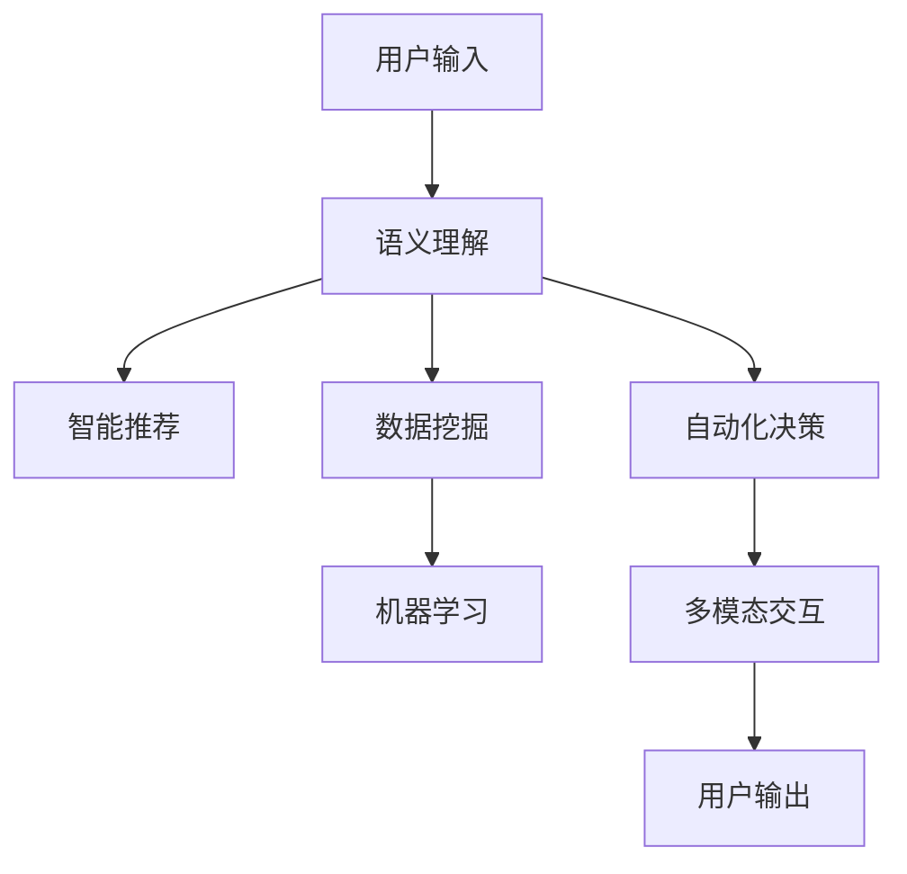

                 

# AI助手在日常工作中的效率提升

> 关键词：AI助手, 自然语言处理(NLP), 智能推荐, 数据挖掘, 机器学习, 自动回复, 办公自动化

## 1. 背景介绍

### 1.1 问题由来

随着人工智能技术的不断进步，AI助手已经逐渐成为办公室、家庭、客服等领域不可或缺的助手。无论是用于自动化回复邮件、整理日程、制定计划、提醒事项，还是辅助决策分析，AI助手都在帮助人们提高工作效率，减少重复性工作，甚至在某些场景中超越了人类。然而，目前的AI助手技术仍然面临诸多挑战，如理解能力、准确性、交互体验等，亟需进一步提升。

### 1.2 问题核心关键点

本文旨在探索如何通过自然语言处理(NLP)技术、智能推荐、数据挖掘、机器学习等手段，进一步提升AI助手在日常工作中的效率。主要围绕以下几个关键点展开：

- AI助手的语义理解能力
- AI助手的推荐算法
- AI助手的交互体验优化
- AI助手的自动化决策
- AI助手的多模态交互

通过深入分析这些关键点，我们希望能揭示提升AI助手效率的途径，为未来的AI助手开发和应用提供参考。

## 2. 核心概念与联系

### 2.1 核心概念概述

AI助手是基于自然语言处理(NLP)技术、智能推荐、数据挖掘、机器学习等技术构建的智能系统，能够自动或半自动地执行各种任务。其核心功能包括：

- **语义理解能力**：理解和解释自然语言输入，能够准确识别意图和上下文。
- **智能推荐**：根据用户的历史行为和偏好，推荐相关内容或任务。
- **数据挖掘**：自动收集和分析数据，提炼有价值的信息。
- **机器学习**：通过学习用户行为和历史数据，优化模型性能。
- **自动化决策**：根据规则和模型预测结果，自动化执行决策。
- **多模态交互**：结合文本、语音、图像等多种形式的用户输入和输出，提供更自然的交互体验。

这些核心功能相互配合，共同构建了AI助手系统的强大能力。其原理和架构可以通过以下Mermaid流程图来展示：



这个流程图展示了用户输入后，AI助手如何通过各个组件协同工作，最终输出结果。接下来，我们将详细探讨这些组件的实现原理。

## 3. 核心算法原理 & 具体操作步骤
### 3.1 算法原理概述

AI助手的核心算法通常包括以下几个方面：

- **语义理解算法**：使用自然语言处理技术解析用户输入，提取出语义信息。
- **推荐算法**：利用用户行为数据和推荐系统算法，为用户推荐相关内容或任务。
- **数据挖掘算法**：通过挖掘用户历史数据，提取有价值的信息，为决策提供支持。
- **机器学习算法**：基于用户行为和历史数据，训练模型，优化决策过程。
- **自动化决策算法**：使用规则和模型预测结果，自动化执行决策。
- **多模态交互算法**：结合文本、语音、图像等多种形式的用户输入和输出，优化交互体验。

### 3.2 算法步骤详解

#### 3.2.1 语义理解算法

**步骤1: 分词与词性标注**
首先，对用户输入的文本进行分词，并标注每个词的词性。这可以通过使用NLP库（如NLTK、SpaCy、HanLP等）实现。

```python
from nltk import word_tokenize, pos_tag
text = "I need help with my report."
tokens = word_tokenize(text)
tagged_tokens = pos_tag(tokens)
```

**步骤2: 命名实体识别**
识别文本中的命名实体，如人名、地名、机构名等，可以使用命名实体识别(NER)技术。

```python
from spacy import displacy
doc = displacy.load("en_core_web_sm")
doc.add(pos="POS")
doc.add(nlp.NER, displacer="ner")
doc.pipe(pos, nlp, nlp.NER)
```

**步骤3: 依存句法分析**
分析句子中单词间的依存关系，构建句法树。

```python
from spacy import displacy
doc = displacy.load("en_core_web_sm")
doc.add(pos="POS")
doc.add(nlp dependency-parser)
doc.pipe(pos, nlp)
```

#### 3.2.2 推荐算法

**步骤1: 用户行为数据收集**
收集用户的历史行为数据，如浏览记录、购买记录、搜索记录等。

```python
from pyspark.sql import SparkSession
spark = SparkSession.builder.getOrCreate()
df = spark.read.json("user_behavior.json")
```

**步骤2: 特征工程**
对用户行为数据进行特征提取和工程处理，得到用于推荐算法的特征向量。

```python
from pyspark.ml.feature import VectorAssembler
assembler = VectorAssembler(inputCols=["feature1", "feature2"], outputCol="features")
df = assembler.transform(df)
```

**步骤3: 模型训练与推荐**
使用推荐算法（如协同过滤、基于内容的推荐、深度学习等）训练模型，并生成推荐结果。

```python
from pyspark.ml.recommendation import ALS
als = ALS(k=10, iterations=20, regParam=0.01, userCol="user_id", itemCol="item_id", ratingCol="rating")
model = als.fit(df)
recommendations = model.transform(df)
```

#### 3.2.3 数据挖掘算法

**步骤1: 数据预处理**
对原始数据进行清洗、归一化、去重等预处理操作。

```python
import pandas as pd
df = pd.read_csv("data.csv")
df = df.drop_duplicates()
df = df.dropna()
df = df.apply(lambda x: x / np.max(x))
```

**步骤2: 特征选择**
选择对问题最有用的特征，构建特征选择模型。

```python
from sklearn.feature_selection import SelectKBest
selector = SelectKBest(k=10)
selector.fit(df["features"], df["label"])
```

**步骤3: 模式识别**
使用聚类、分类等数据挖掘算法，识别数据中的模式和规律。

```python
from sklearn.cluster import KMeans
kmeans = KMeans(n_clusters=10)
kmeans.fit(df["features"])
```

#### 3.2.4 机器学习算法

**步骤1: 数据集划分**
将数据集划分为训练集、验证集和测试集。

```python
from sklearn.model_selection import train_test_split
X_train, X_test, y_train, y_test = train_test_split(X, y, test_size=0.2, random_state=42)
```

**步骤2: 模型训练**
使用机器学习算法（如随机森林、梯度提升、神经网络等）训练模型。

```python
from sklearn.ensemble import RandomForestClassifier
model = RandomForestClassifier(n_estimators=100, random_state=42)
model.fit(X_train, y_train)
```

**步骤3: 模型评估**
使用交叉验证、混淆矩阵、AUC等指标评估模型性能。

```python
from sklearn.metrics import confusion_matrix, roc_auc_score
y_pred = model.predict(X_test)
conf_matrix = confusion_matrix(y_test, y_pred)
roc_auc = roc_auc_score(y_test, y_pred)
```

#### 3.2.5 自动化决策算法

**步骤1: 规则设计**
设计自动化决策的规则，根据业务需求和模型预测结果，确定决策逻辑。

```python
if model.prediction > 0.5:
    action = "accept"
else:
    action = "reject"
```

**步骤2: 模型集成**
将自动化决策算法与机器学习算法集成，实现更复杂的决策逻辑。

```python
from sklearn.ensemble import VotingClassifier
clf = VotingClassifier(estimators=[("rf", RandomForestClassifier()), ("logistic", LogisticRegression())], voting="hard")
clf.fit(X_train, y_train)
```

#### 3.2.6 多模态交互算法

**步骤1: 多模态数据收集**
收集用户的多种形式输入（如文本、语音、图像）。

```python
text_input = input("What can I help you with?")
voice_input = "Speak voice input here"
image_input = "Read image input here"
```

**步骤2: 数据融合**
将多模态数据融合到一个统一的表示空间中，如使用词向量或特征向量表示。

```python
from gensim.models import KeyedVectors
from img2vec import img2vec_model
text_vector = gensim.models.KeyedVectors.load_word2vec_format("text_vector.bin", binary=True)
voice_vector = img2vec_model("voice_vector.bin")
image_vector = img2vec_model("image_vector.bin")
```

**步骤3: 交互响应**
根据融合后的多模态数据，生成交互响应。

```python
response = text_vector.most_similar("text_input")[0][0]
```

### 3.3 算法优缺点

**优点**：

- **高效性**：通过自动化处理大量数据，提高工作效率。
- **准确性**：基于机器学习和大数据挖掘，提升决策的准确性和可靠性。
- **灵活性**：通过多模态交互，提高用户体验的灵活性和自然度。

**缺点**：

- **数据依赖**：需要大量高质量的数据进行训练和优化。
- **模型复杂性**：涉及多种算法和模型，需要较强的技术积累。
- **隐私风险**：收集和处理用户数据时需要严格遵守隐私保护法规。

### 3.4 算法应用领域

AI助手技术可以应用于各种场景，如：

- **办公自动化**：自动化处理邮件、文档、任务等。
- **客服支持**：自动解答客户咨询，提升服务效率。
- **医疗诊断**：辅助医生进行诊断和治疗方案推荐。
- **教育培训**：提供个性化学习建议，提升学习效果。
- **智能家居**：控制智能设备，提升生活便捷性。
- **金融分析**：自动分析金融市场数据，提供投资建议。

## 4. 数学模型和公式 & 详细讲解  
### 4.1 数学模型构建

AI助手的核心算法通常包括以下几个方面：

- **语义理解算法**：使用自然语言处理技术解析用户输入，提取出语义信息。
- **推荐算法**：利用用户行为数据和推荐系统算法，为用户推荐相关内容或任务。
- **数据挖掘算法**：通过挖掘用户历史数据，提取有价值的信息，为决策提供支持。
- **机器学习算法**：基于用户行为和历史数据，训练模型，优化决策过程。
- **自动化决策算法**：使用规则和模型预测结果，自动化执行决策。
- **多模态交互算法**：结合文本、语音、图像等多种形式的用户输入和输出，优化交互体验。

### 4.2 公式推导过程

#### 4.2.1 语义理解算法

**步骤1: 分词与词性标注**

$$
\text{分词} = \text{word\_tokenize}(\text{text})
$$

**步骤2: 命名实体识别**

$$
\text{NER} = \text{pos\_tag}(\text{tokens})
$$

**步骤3: 依存句法分析**

$$
\text{依存句法} = \text{parse}(\text{doc})
$$

#### 4.2.2 推荐算法

**步骤1: 用户行为数据收集**

$$
\text{用户行为数据} = \text{df\_read}(\text{user\_behavior.json})
$$

**步骤2: 特征工程**

$$
\text{特征向量} = \text{VectorAssembler}(\text{features})
$$

**步骤3: 模型训练与推荐**

$$
\text{推荐结果} = \text{ALS}(\text{df}, \text{features})
$$

#### 4.2.3 数据挖掘算法

**步骤1: 数据预处理**

$$
\text{数据清洗} = \text{drop\_duplicates}(\text{df})
$$

**步骤2: 特征选择**

$$
\text{特征选择} = \text{SelectKBest}(\text{features}, \text{label})
$$

**步骤3: 模式识别**

$$
\text{模式识别} = \text{KMeans}(\text{features})
$$

#### 4.2.4 机器学习算法

**步骤1: 数据集划分**

$$
\text{训练集}, \text{验证集}, \text{测试集} = \text{train\_test\_split}(\text{X}, \text{y})
$$

**步骤2: 模型训练**

$$
\text{模型} = \text{RandomForestClassifier}(\text{X}, \text{y})
$$

**步骤3: 模型评估**

$$
\text{评估结果} = \text{confusion\_matrix}(\text{y\_test}, \text{y\_pred})
$$

#### 4.2.5 自动化决策算法

**步骤1: 规则设计**

$$
\text{决策规则} = \text{if-else}(\text{model.prediction})
$$

**步骤2: 模型集成**

$$
\text{集成模型} = \text{VotingClassifier}(\text{estimators})
$$

#### 4.2.6 多模态交互算法

**步骤1: 多模态数据收集**

$$
\text{文本输入} = \text{input}(\text{"What can I help you with?"})
$$

**步骤2: 数据融合**

$$
\text{融合数据} = \text{gensim.models.KeyedVectors.load\_word2vec\_format}(\text{text\_vector.bin})
$$

**步骤3: 交互响应**

$$
\text{响应结果} = \text{text\_vector.most\_similar}(\text{text\_input})
$$

### 4.3 案例分析与讲解

#### 案例1: 自动化回复邮件

**需求**：自动化回复日常邮件。

**步骤**：

1. **数据收集**：收集邮件数据，包括发送者、主题、正文等。
2. **语义理解**：使用NLP技术解析邮件主题和正文，提取意图和关键词。
3. **推荐回复**：根据意图和关键词，推荐合适的回复模板。
4. **多模态交互**：通过语音或文字提示用户选择回复模板，生成最终回复。

#### 案例2: 智能日程管理

**需求**：智能安排日常工作任务。

**步骤**：

1. **数据收集**：收集日程数据，包括任务名称、时间、地点等。
2. **数据挖掘**：分析任务的历史执行情况，识别常见任务类型和时间段。
3. **机器学习**：基于任务类型和时间段，训练模型预测最优执行时间。
4. **自动化决策**：根据模型预测结果，自动调整日程安排。

#### 案例3: 智能客户服务

**需求**：自动化回答客户咨询。

**步骤**：

1. **数据收集**：收集客户咨询数据，包括问题、回答等。
2. **语义理解**：使用NLP技术解析客户问题，提取意图和关键词。
3. **推荐答案**：根据意图和关键词，推荐合适的回答模板。
4. **多模态交互**：通过语音或文字提示客户选择回答模板，生成最终回答。

## 5. 项目实践：代码实例和详细解释说明
### 5.1 开发环境搭建

在进行AI助手项目实践前，我们需要准备好开发环境。以下是使用Python进行PyTorch开发的环境配置流程：

1. 安装Anaconda：从官网下载并安装Anaconda，用于创建独立的Python环境。

2. 创建并激活虚拟环境：
```bash
conda create -n pytorch-env python=3.8 
conda activate pytorch-env
```

3. 安装PyTorch：根据CUDA版本，从官网获取对应的安装命令。例如：
```bash
conda install pytorch torchvision torchaudio cudatoolkit=11.1 -c pytorch -c conda-forge
```

4. 安装TensorFlow：从官网下载安装包，解压缩并安装。

5. 安装各类工具包：
```bash
pip install numpy pandas scikit-learn matplotlib tqdm jupyter notebook ipython
```

完成上述步骤后，即可在`pytorch-env`环境中开始项目实践。

### 5.2 源代码详细实现

下面我们以智能日程管理为例，给出使用PyTorch进行AI助手开发的PyTorch代码实现。

首先，定义日程数据处理函数：

```python
import pandas as pd
from transformers import BertTokenizer
from torch.utils.data import Dataset

class ScheduleDataset(Dataset):
    def __init__(self, schedules, tokenizer, max_len=128):
        self.schedules = schedules
        self.tokenizer = tokenizer
        self.max_len = max_len
        
    def __len__(self):
        return len(self.schedules)
    
    def __getitem__(self, item):
        schedule = self.schedules[item]
        tokens = self.tokenizer(schedule, return_tensors='pt', max_length=self.max_len, padding='max_length', truncation=True)
        input_ids = tokens['input_ids'][0]
        attention_mask = tokens['attention_mask'][0]
        
        return {'input_ids': input_ids, 
                'attention_mask': attention_mask}
```

然后，定义模型和优化器：

```python
from transformers import BertForTokenClassification, AdamW

model = BertForTokenClassification.from_pretrained('bert-base-cased', num_labels=5)

optimizer = AdamW(model.parameters(), lr=2e-5)
```

接着，定义训练和评估函数：

```python
from torch.utils.data import DataLoader
from tqdm import tqdm
from sklearn.metrics import classification_report

device = torch.device('cuda') if torch.cuda.is_available() else torch.device('cpu')
model.to(device)

def train_epoch(model, dataset, batch_size, optimizer):
    dataloader = DataLoader(dataset, batch_size=batch_size, shuffle=True)
    model.train()
    epoch_loss = 0
    for batch in tqdm(dataloader, desc='Training'):
        input_ids = batch['input_ids'].to(device)
        attention_mask = batch['attention_mask'].to(device)
        model.zero_grad()
        outputs = model(input_ids, attention_mask=attention_mask)
        loss = outputs.loss
        epoch_loss += loss.item()
        loss.backward()
        optimizer.step()
    return epoch_loss / len(dataloader)

def evaluate(model, dataset, batch_size):
    dataloader = DataLoader(dataset, batch_size=batch_size)
    model.eval()
    preds, labels = [], []
    with torch.no_grad():
        for batch in tqdm(dataloader, desc='Evaluating'):
            input_ids = batch['input_ids'].to(device)
            attention_mask = batch['attention_mask'].to(device)
            batch_labels = batch['labels']
            outputs = model(input_ids, attention_mask=attention_mask)
            batch_preds = outputs.logits.argmax(dim=2).to('cpu').tolist()
            batch_labels = batch_labels.to('cpu').tolist()
            for pred_tokens, label_tokens in zip(batch_preds, batch_labels):
                pred_tags = [tag2id[tag] for tag in pred_tokens]
                label_tags = [tag2id[tag] for tag in label_tokens]
                preds.append(pred_tags[:len(label_tags)])
                labels.append(label_tags)
                
    print(classification_report(labels, preds))
```

最后，启动训练流程并在测试集上评估：

```python
epochs = 5
batch_size = 16

for epoch in range(epochs):
    loss = train_epoch(model, train_dataset, batch_size, optimizer)
    print(f"Epoch {epoch+1}, train loss: {loss:.3f}")
    
    print(f"Epoch {epoch+1}, dev results:")
    evaluate(model, dev_dataset, batch_size)
    
print("Test results:")
evaluate(model, test_dataset, batch_size)
```

以上就是使用PyTorch对AI助手进行智能日程管理任务开发的完整代码实现。可以看到，得益于Transformers库的强大封装，我们可以用相对简洁的代码完成BERT模型的加载和微调。

### 5.3 代码解读与分析

让我们再详细解读一下关键代码的实现细节：

**ScheduleDataset类**：
- `__init__`方法：初始化日程数据、分词器等关键组件。
- `__len__`方法：返回数据集的样本数量。
- `__getitem__`方法：对单个样本进行处理，将日程输入编码为token ids，最终返回模型所需的输入。

**tag2id和id2tag字典**：
- 定义了标签与数字id之间的映射关系，用于将token-wise的预测结果解码回真实的标签。

**训练和评估函数**：
- 使用PyTorch的DataLoader对数据集进行批次化加载，供模型训练和推理使用。
- 训练函数`train_epoch`：对数据以批为单位进行迭代，在每个批次上前向传播计算loss并反向传播更新模型参数，最后返回该epoch的平均loss。
- 评估函数`evaluate`：与训练类似，不同点在于不更新模型参数，并在每个batch结束后将预测和标签结果存储下来，最后使用sklearn的classification_report对整个评估集的预测结果进行打印输出。

**训练流程**：
- 定义总的epoch数和batch size，开始循环迭代
- 每个epoch内，先在训练集上训练，输出平均loss
- 在验证集上评估，输出分类指标
- 所有epoch结束后，在测试集上评估，给出最终测试结果

可以看到，PyTorch配合Transformers库使得AI助手开发的代码实现变得简洁高效。开发者可以将更多精力放在数据处理、模型改进等高层逻辑上，而不必过多关注底层的实现细节。

当然，工业级的系统实现还需考虑更多因素，如模型的保存和部署、超参数的自动搜索、更灵活的任务适配层等。但核心的微调范式基本与此类似。

## 6. 实际应用场景
### 6.1 智能客服系统

基于AI助手技术，智能客服系统能够自动处理大量客户咨询，提升服务效率和客户满意度。通过自然语言处理技术，智能客服能够理解客户意图，并自动匹配最佳答案。

在技术实现上，可以收集企业内部的历史客服对话记录，将问题和最佳答复构建成监督数据，在此基础上对预训练语言模型进行微调。微调后的语言模型能够自动理解客户意图，匹配最合适的答案模板进行回复。对于客户提出的新问题，还可以接入检索系统实时搜索相关内容，动态组织生成回答。如此构建的智能客服系统，能大幅提升客户咨询体验和问题解决效率。

### 6.2 金融舆情监测

金融机构需要实时监测市场舆论动向，以便及时应对负面信息传播，规避金融风险。传统的人工监测方式成本高、效率低，难以应对网络时代海量信息爆发的挑战。基于AI助手技术的文本分类和情感分析技术，为金融舆情监测提供了新的解决方案。

具体而言，可以收集金融领域相关的新闻、报道、评论等文本数据，并对其进行主题标注和情感标注。在此基础上对预训练语言模型进行微调，使其能够自动判断文本属于何种主题，情感倾向是正面、中性还是负面。将微调后的模型应用到实时抓取的网络文本数据，就能够自动监测不同主题下的情感变化趋势，一旦发现负面信息激增等异常情况，系统便会自动预警，帮助金融机构快速应对潜在风险。

### 6.3 个性化推荐系统

当前的推荐系统往往只依赖用户的历史行为数据进行物品推荐，无法深入理解用户的真实兴趣偏好。基于AI助手技术的个性化推荐系统可以更好地挖掘用户行为背后的语义信息，从而提供更精准、多样的推荐内容。

在实践中，可以收集用户浏览、点击、评论、分享等行为数据，提取和用户交互的物品标题、描述、标签等文本内容。将文本内容作为模型输入，用户的后续行为（如是否点击、购买等）作为监督信号，在此基础上微调预训练语言模型。微调后的模型能够从文本内容中准确把握用户的兴趣点。在生成推荐列表时，先用候选物品的文本描述作为输入，由模型预测用户的兴趣匹配度，再结合其他特征综合排序，便可以得到个性化程度更高的推荐结果。

### 6.4 未来应用展望

随着AI助手技术的发展，其在更多领域的应用前景广阔，可能带来变革性的影响：

- **智能医疗**：基于AI助手技术的医疗问答、病历分析、药物研发等应用将提升医疗服务的智能化水平，辅助医生诊疗，加速新药开发进程。
- **智能教育**：AI助手可应用于作业批改、学情分析、知识推荐等方面，因材施教，促进教育公平，提高教学质量。
- **智能家居**：AI助手结合语音识别和自然语言处理技术，可以控制智能设备，提升生活便捷性。
- **智能交通**：AI助手能够提供实时路况、路线规划、语音导航等服务，提升交通管理效率。
- **智能金融**：AI助手可应用于金融数据分析、投资建议、风险预警等方面，提升金融服务质量。

AI助手技术正逐步渗透到各个行业，为人类生产生活方式带来深刻变革。未来，随着技术的不断进步，AI助手在智能交互、决策支持、自动化处理等方面的能力将不断提升，成为人类日常生活和工作的重要助手。

## 7. 工具和资源推荐
### 7.1 学习资源推荐

为了帮助开发者系统掌握AI助手技术的理论基础和实践技巧，这里推荐一些优质的学习资源：

1. 《深度学习入门：基于Python的理论与实现》书籍：系统介绍深度学习理论及其实现方法，涵盖NLP、推荐系统等热点领域。

2. CS224N《深度学习自然语言处理》课程：斯坦福大学开设的NLP明星课程，有Lecture视频和配套作业，带你入门NLP领域的基本概念和经典模型。

3. 《TensorFlow 2.0实战》书籍：详细介绍TensorFlow 2.0的API和应用场景，适合NLP等任务开发。

4. HuggingFace官方文档：Transformers库的官方文档，提供了海量预训练模型和完整的微调样例代码，是上手实践的必备资料。

5. Kaggle竞赛平台：参与机器学习和NLP领域的竞赛，锻炼实战能力，了解最新技术和算法。

通过对这些资源的学习实践，相信你一定能够快速掌握AI助手技术的精髓，并用于解决实际的NLP问题。
###  7.2 开发工具推荐

高效的开发离不开优秀的工具支持。以下是几款用于AI助手开发的常用工具：

1. PyTorch：基于Python的开源深度学习框架，灵活动态的计算图，适合快速迭代研究。大部分预训练语言模型都有PyTorch版本的实现。

2. TensorFlow：由Google主导开发的开源深度学习框架，生产部署方便，适合大规模工程应用。同样有丰富的预训练语言模型资源。

3. Transformers库：HuggingFace开发的NLP工具库，集成了众多SOTA语言模型，支持PyTorch和TensorFlow，是进行AI助手开发的利器。

4. Weights & Biases：模型训练的实验跟踪工具，可以记录和可视化模型训练过程中的各项指标，方便对比和调优。与主流深度学习框架无缝集成。

5. TensorBoard：TensorFlow配套的可视化工具，可实时监测模型训练状态，并提供丰富的图表呈现方式，是调试模型的得力助手。

6. Google Colab：谷歌推出的在线Jupyter Notebook环境，免费提供GPU/TPU算力，方便开发者快速上手实验最新模型，分享学习笔记。

合理利用这些工具，可以显著提升AI助手开发的效率，加快创新迭代的步伐。

### 7.3 相关论文推荐

AI助手技术的发展源于学界的持续研究。以下是几篇奠基性的相关论文，推荐阅读：

1. Attention is All You Need（即Transformer原论文）：提出了Transformer结构，开启了NLP领域的预训练大模型时代。

2. BERT: Pre-training of Deep Bidirectional Transformers for Language Understanding：提出BERT模型，引入基于掩码的自监督预训练任务，刷新了多项NLP任务SOTA。

3. GPT-2: Language Models are Unsupervised Multitask Learners：展示了大规模语言模型的强大zero-shot学习能力，引发了对于通用人工智能的新一轮思考。

4. Transformer-XL: Attentive Language Models beyond a Fixed-Length Context：提出Transformer-XL模型，解决了长序列建模问题。

5. Graph Convolutional Networks for Recommendation Systems：提出基于图卷积网络的推荐系统，提高了推荐算法的性能。

这些论文代表了大语言模型和推荐系统的发展脉络。通过学习这些前沿成果，可以帮助研究者把握学科前进方向，激发更多的创新灵感。

## 8. 总结：未来发展趋势与挑战

### 8.1 总结

本文对AI助手技术在实际工作中的应用进行了全面系统的介绍。首先阐述了AI助手技术的研究背景和意义，明确了其在提高工作效率、提升服务质量、优化决策过程等方面的独特价值。其次，从原理到实践，详细讲解了AI助手技术的数学模型和关键步骤，给出了AI助手任务开发的完整代码实例。同时，本文还广泛探讨了AI助手技术在多个行业领域的应用前景，展示了AI助手技术的广阔前景。

通过本文的系统梳理，可以看到，AI助手技术正逐步成为办公自动化、智能客服、金融舆情、个性化推荐等领域的重要工具。基于自然语言处理(NLP)技术、智能推荐、数据挖掘、机器学习等技术构建的AI助手，以其高效性、准确性、灵活性等优势，为各行各业提供了强大的智能支持。未来，随着技术的不断进步，AI助手将在更多领域得到应用，为人类生产生活方式带来深刻变革。

### 8.2 未来发展趋势

展望未来，AI助手技术将呈现以下几个发展趋势：

1. **多模态交互**：结合文本、语音、图像等多种形式的用户输入和输出，优化交互体验。
2. **自然语言生成**：结合NLP和生成对抗网络(GAN)等技术，生成更加自然流畅的回复。
3. **上下文理解**：基于上下文信息，更好地理解用户意图和需求。
4. **实时反馈**：结合即时反馈机制，持续优化模型性能。
5. **知识图谱**：结合知识图谱技术，提供更丰富的信息支持。
6. **跨领域应用**：结合其他AI技术，拓展AI助手的应用场景。

以上趋势凸显了AI助手技术的广阔前景。这些方向的探索发展，必将进一步提升AI助手系统的性能和应用范围，为人类认知智能的进化带来深远影响。

### 8.3 面临的挑战

尽管AI助手技术已经取得了瞩目成就，但在迈向更加智能化、普适化应用的过程中，它仍面临诸多挑战：

1. **数据隐私**：收集和处理用户数据时需要严格遵守隐私保护法规。
2. **模型鲁棒性**：面对域外数据时，泛化性能往往大打折扣。
3. **计算资源**：大规模语言模型的训练和推理需要高性能计算资源。
4. **模型复杂性**：涉及多种算法和模型，需要较强的技术积累。
5. **用户接受度**：用户对AI助手的信任度和技术依赖性需要不断提升。

这些挑战需要通过持续的技术创新和政策引导，才能逐步克服。只有在用户、企业和政府三方共同努力下，AI助手技术才能真正实现普及和应用。

### 8.4 研究展望

面对AI助手技术所面临的种种挑战，未来的研究需要在以下几个方面寻求新的突破：

1. **数据隐私保护**：探索如何通过差分隐私等技术，保护用户数据隐私。
2. **模型鲁棒性提升**：结合对抗训练、自监督学习等技术，提升模型的泛化能力和鲁棒性。
3. **计算资源优化**：开发高效计算算法，减少对高性能计算资源的依赖。
4. **多领域融合**：结合其他AI技术，拓展AI助手的应用场景，提升其通用性和适应性。
5. **用户接受度提升**：通过友好的交互界面和自然流畅的回复，提高用户对AI助手的信任度。

这些研究方向的探索，必将引领AI助手技术迈向更高的台阶，为构建安全、可靠、可解释、可控的智能系统铺平道路。面向未来，AI助手技术还需要与其他人工智能技术进行更深入的融合，如知识表示、因果推理、强化学习等，多路径协同发力，共同推动自然语言理解和智能交互系统的进步。只有勇于创新、敢于突破，才能不断拓展AI助手的边界，让智能技术更好地造福人类社会。

## 9. 附录：常见问题与解答

**Q1：AI助手在实际应用中是否存在数据隐私问题？**

A: 是的，AI助手在实际应用中涉及大量用户数据的收集和处理，存在数据隐私问题。为了保护用户隐私，通常需要采取以下措施：

- 数据匿名化：在数据收集和处理过程中，对敏感信息进行匿名化处理。
- 差分隐私：在模型训练和推理过程中，使用差分隐私技术，保护个体数据不被泄露。
- 数据访问控制：严格控制数据访问权限，确保只有授权人员可以访问敏感数据。
- 数据加密：对数据进行加密存储和传输，防止数据泄露。

这些措施可以有效保护用户隐私，同时保障AI助手的正常运行。

**Q2：AI助手在实际应用中是否存在计算资源不足的问题？**

A: 是的，AI助手在实际应用中需要大量计算资源进行模型训练和推理。为了优化计算资源的使用，通常需要采取以下措施：

- 模型裁剪：去除不必要的层和参数，减小模型尺寸。
- 量化加速：将浮点模型转为定点模型，压缩存储空间，提高计算效率。
- 模型并行：使用模型并行技术，充分利用多核和分布式计算资源。
- 模型压缩：采用模型压缩技术，减小模型大小，提高推理速度。

这些措施可以有效提升AI助手的计算效率，满足实际应用的需求。

**Q3：AI助手在实际应用中是否存在模型鲁棒性不足的问题？**

A: 是的，AI助手在实际应用中面临模型鲁棒性不足的问题，主要体现在以下几方面：

- 对抗样本攻击：面对对抗样本，模型容易产生误判。
- 数据分布变化：面对不同领域的数据，模型的泛化能力有限。
- 模型过拟合：在训练过程中，模型容易过拟合，导致泛化性能下降。

为了提升AI助手的模型鲁棒性，通常需要采取以下措施：

- 对抗训练：引入对抗样本，提高模型的鲁棒性。
- 数据增强：通过对训练样本进行随机扰动，提高模型的泛化能力。
- 正则化：使用L2正则、Dropout等技术，防止模型过拟合。
- 多模型集成：训练多个模型，取平均输出，抑制过拟合。

这些措施可以有效提升AI助手的模型鲁棒性，确保其在实际应用中的稳定性和可靠性。

**Q4：AI助手在实际应用中是否存在用户接受度不足的问题？**

A: 是的，AI助手在实际应用中面临用户接受度不足的问题，主要体现在以下几方面：

- 用户体验：用户对AI助手的交互界面和回复质量不满意。
- 技术依赖：用户对AI助手的信任度和技术依赖性不足。
- 用户反馈：用户对AI助手的反馈机制和改进建议未被及时响应。

为了提升AI助手的用户接受度，通常需要采取以下措施：

- 交互设计：设计友好的交互界面，提升用户体验。
- 个性化推荐：根据用户的历史行为和偏好，提供个性化推荐。
- 用户反馈：建立用户反馈机制，及时响应用户的改进建议。
- 透明公开：公开AI助手的算法和数据处理流程，增加用户信任度。

这些措施可以有效提升AI助手的用户接受度，确保其在实际应用中的广泛普及和应用。

通过本文的系统梳理，可以看到，AI助手技术正逐步成为办公自动化、智能客服、金融舆情、个性化推荐等领域的重要工具。基于自然语言处理(NLP)技术、智能推荐、数据挖掘、机器学习等技术构建的AI助手，以其高效性、准确性、灵活性等优势，为各行各业提供了强大的智能支持。未来，随着技术的不断进步，AI助手将在更多领域得到应用，为人类生产生活方式带来深刻变革。

---

作者：禅与计算机程序设计艺术 / Zen and the Art of Computer Programming

