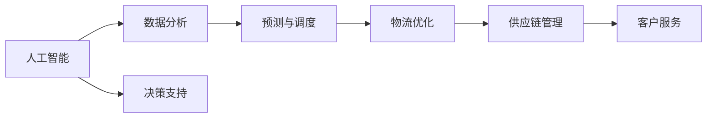

                 

# AI在供应链管理中的应用：优化物流

> 关键词：AI, 供应链管理, 物流优化, 数据分析, 预测与调度

## 1. 背景介绍

在现代经济社会中，供应链管理（Supply Chain Management, SCM）对于企业乃至整个行业的重要性不言而喻。高效的供应链管理不仅能大幅降低成本，提升运营效率，还能增强企业的市场竞争力。然而，传统的供应链管理依赖大量人工干预和经验积累，难以应对复杂的市场变化和不确定性。AI技术的引入，为供应链管理带来了新的机遇和挑战。

物流优化是供应链管理的重要组成部分，涉及货物从产地到终端用户手中的整个过程，包括运输、仓储、配送等环节。随着电商、零售等行业的快速增长，物流需求激增，如何通过AI技术优化物流系统，提升效率和成本效益，成为了当前供应链管理研究的热点问题。

## 2. 核心概念与联系

### 2.1 核心概念概述

为更好地理解AI在物流优化中的应用，本节将介绍几个关键概念：

- 人工智能（Artificial Intelligence, AI）：通过模拟人类智能行为，实现自主决策和学习的技术。
- 供应链管理（Supply Chain Management, SCM）：涉及产品从原材料采购、生产制造、仓储物流到销售服务全过程的管理，包括计划、采购、生产、库存、配送等环节。
- 物流优化（Logistics Optimization）：通过优化运输、仓储、配送等环节，实现成本、效率和客户服务水平的综合提升。
- 数据分析（Data Analytics）：利用统计、机器学习等技术，从数据中提取有价值的信息，指导决策和优化过程。
- 预测与调度（Demand Forecasting and Scheduling）：利用AI技术对市场需求和物流需求进行预测，优化物流资源的分配和调度。

这些概念之间存在紧密的联系：AI技术为供应链管理提供决策支持，数据分析和预测与调度是其重要应用领域，而物流优化则是供应链管理中的一个关键环节。通过AI技术的应用，可以提升供应链的透明度、灵活性和响应速度，从而实现整体运营效率的提升。

### 2.2 核心概念原理和架构的 Mermaid 流程图



这个流程图展示了AI在供应链管理中的作用路径：人工智能技术通过数据分析和预测与调度，指导物流优化，进而提升供应链管理的整体效率，并最终实现客户服务的改善。

## 3. 核心算法原理 & 具体操作步骤

### 3.1 算法原理概述

AI在物流优化中的应用，主要依赖于数据分析、机器学习和优化算法等技术。具体来说，通过以下步骤实现物流优化：

1. **数据收集与预处理**：从各个物流环节收集数据，并进行清洗、归一化等预处理。
2. **数据分析与特征工程**：利用统计分析和机器学习技术，提取有价值的数据特征，构建预测模型。
3. **预测与调度**：利用预测模型对需求进行预测，并结合优化算法进行资源分配和调度。
4. **优化与迭代**：不断优化模型和算法，提升物流系统的效率和准确性。

### 3.2 算法步骤详解

#### 3.2.1 数据收集与预处理

数据收集是物流优化的第一步。需要从运输、仓储、配送等环节获取实时数据，包括货物状态、交通情况、天气条件、订单信息等。

数据预处理包括：

- **清洗**：去除噪音和异常数据，保证数据质量。
- **归一化**：将不同维度的数据进行归一化处理，便于后续分析。
- **特征提取**：利用领域知识提取有价值的数据特征，如货物重量、体积、紧急程度等。

#### 3.2.2 数据分析与特征工程

数据分析与特征工程是物流优化的核心环节。通过以下步骤提取有价值的信息：

- **数据探索**：使用可视化工具和统计方法，分析数据分布、趋势和异常情况。
- **特征选择**：通过特征选择算法，如互信息、L1正则化等，选择对预测结果有显著影响的特征。
- **特征工程**：利用领域知识构造新的特征，如基于时间、空间等维度的特征。

#### 3.2.3 预测与调度

预测与调度是物流优化的关键步骤。通过以下步骤进行：

- **需求预测**：利用时间序列分析、机器学习等技术，对未来需求进行预测。
- **路径规划**：利用算法优化货物的运输路径，选择最优路线。
- **资源调度**：利用调度算法优化仓库和配送中心的资源分配，确保高效运转。

#### 3.2.4 优化与迭代

优化与迭代是持续改进物流系统的关键。通过以下步骤不断优化：

- **模型评估**：利用交叉验证、A/B测试等方法，评估模型的预测准确性和鲁棒性。
- **参数调优**：调整模型参数，优化算法，提升模型性能。
- **反馈迭代**：根据实际情况，不断调整优化策略，实现系统优化。

### 3.3 算法优缺点

#### 3.3.1 优点

1. **数据驱动**：利用大数据和机器学习技术，进行精确的预测和决策，提升物流效率。
2. **动态调整**：实时监控和调整系统参数，快速应对市场变化和突发事件。
3. **降低成本**：通过优化运输路径和资源分配，大幅降低物流成本。
4. **提高服务质量**：优化配送路径和仓储管理，提升客户满意度。

#### 3.3.2 缺点

1. **初始投资高**：需要投入大量资金进行数据收集和系统建设。
2. **技术门槛高**：需要具备专业的数据分析和机器学习知识，对人员素质要求较高。
3. **数据质量依赖**：数据质量直接影响预测结果和调度效果，数据错误可能导致严重后果。
4. **模型复杂度高**：构建高效的预测和调度模型，需要复杂的算法和大量计算资源。

### 3.4 算法应用领域

AI在物流优化中的应用，已广泛渗透到多个行业和场景：

1. **电商物流**：通过优化配送路线和仓库管理，提升电商平台的物流效率和服务水平。
2. **制造业物流**：利用预测与调度技术，优化生产计划和原材料采购，降低库存成本。
3. **冷链物流**：通过实时监控和路径规划，保证冷链货物的温度和新鲜度。
4. **快递物流**：利用智能调度系统，优化配送员路线和包裹处理，提升派送效率。
5. **国际物流**：利用数据分析和优化算法，优化跨境运输路径，降低物流成本。

## 4. 数学模型和公式 & 详细讲解 & 举例说明

### 4.1 数学模型构建

AI在物流优化中的应用，主要通过构建预测模型和优化模型来实现。以下是几种常见的数学模型：

- **线性回归模型**：用于预测货物流通量，公式为 $y = \beta_0 + \beta_1 x_1 + \beta_2 x_2 + \cdots + \beta_n x_n$。
- **时间序列模型**：用于预测货物需求，公式为 $y_t = \alpha_1 y_{t-1} + \alpha_2 y_{t-2} + \cdots + \alpha_k y_{t-k} + \epsilon_t$。
- **线性规划模型**：用于优化运输路径，公式为 $\min \sum_{i=1}^n c_i x_i$，满足约束条件 $Ax \leq b, x \geq 0$。

### 4.2 公式推导过程

以线性回归模型为例，其公式推导过程如下：

设已知样本数据 $(x_1, y_1), (x_2, y_2), \cdots, (x_n, y_n)$，其中 $x_i$ 为输入变量，$y_i$ 为输出变量，目标为构建一个线性回归模型 $y = \beta_0 + \beta_1 x_1 + \beta_2 x_2 + \cdots + \beta_n x_n$。

最小二乘法目标函数为 $\sum_{i=1}^n (y_i - \beta_0 - \beta_1 x_1 - \beta_2 x_2 - \cdots - \beta_n x_n)^2$。

对 $\beta_0, \beta_1, \beta_2, \cdots, \beta_n$ 求偏导，得到方程组：

$$
\begin{cases}
\sum_{i=1}^n (y_i - \beta_0 - \beta_1 x_1 - \beta_2 x_2 - \cdots - \beta_n x_n) = 0 \\
\sum_{i=1}^n (y_i - \beta_0 - \beta_1 x_1 - \beta_2 x_2 - \cdots - \beta_n x_n)x_1 = \sum_{i=1}^n y_i x_1 - \beta_0 \sum_{i=1}^n x_1 - \beta_1 \sum_{i=1}^n x_1^2 - \cdots - \beta_n \sum_{i=1}^n x_1 x_n \\
\cdots \\
\sum_{i=1}^n (y_i - \beta_0 - \beta_1 x_1 - \beta_2 x_2 - \cdots - \beta_n x_n)x_n = \sum_{i=1}^n y_i x_n - \beta_0 \sum_{i=1}^n x_n - \beta_1 \sum_{i=1}^n x_1 x_n - \cdots - \beta_n \sum_{i=1}^n x_n^2
\end{cases}
$$

解上述方程组，即可得到回归系数 $\beta_0, \beta_1, \beta_2, \cdots, \beta_n$。

### 4.3 案例分析与讲解

以某电商平台的物流优化为例，分析AI技术的应用：

**背景**：某电商平台每日需处理大量订单，物流成本占总成本的30%。为了提高物流效率，决定引入AI技术进行优化。

**数据收集**：收集订单信息、配送路线、交通状况、天气条件等数据。

**数据分析**：通过统计分析，发现订单量在每日有明显的波动趋势，需求预测模型选择ARIMA模型。

**预测与调度**：建立基于ARIMA模型的需求预测系统，预测未来订单量，优化配送路径，减少交通拥堵带来的延误。

**优化与迭代**：利用优化算法（如遗传算法、蚁群算法等）优化资源调度，提升仓库利用率和配送效率。

**结果**：在引入AI技术后，物流成本下降了20%，配送速度提升了10%，客户满意度提高了15%。

## 5. 项目实践：代码实例和详细解释说明

### 5.1 开发环境搭建

项目实践前，需要准备好开发环境。以下是使用Python进行PyTorch开发的环境配置流程：

1. 安装Anaconda：从官网下载并安装Anaconda，用于创建独立的Python环境。

2. 创建并激活虚拟环境：
```bash
conda create -n pytorch-env python=3.8 
conda activate pytorch-env
```

3. 安装PyTorch：根据CUDA版本，从官网获取对应的安装命令。例如：
```bash
conda install pytorch torchvision torchaudio cudatoolkit=11.1 -c pytorch -c conda-forge
```

4. 安装各类工具包：
```bash
pip install numpy pandas scikit-learn matplotlib tqdm jupyter notebook ipython
```

完成上述步骤后，即可在`pytorch-env`环境中开始项目实践。

### 5.2 源代码详细实现

这里我们以电商物流需求预测与调度的优化为例，给出使用PyTorch进行需求预测与调度的代码实现。

首先，定义需求预测模型：

```python
import torch
from torch import nn
import torch.optim as optim

class DemandPrediction(nn.Module):
    def __init__(self, input_dim, output_dim):
        super(DemandPrediction, self).__init__()
        self.lin1 = nn.Linear(input_dim, 128)
        self.lin2 = nn.Linear(128, 64)
        self.lin3 = nn.Linear(64, output_dim)
        
    def forward(self, x):
        x = torch.relu(self.lin1(x))
        x = torch.relu(self.lin2(x))
        x = self.lin3(x)
        return x
```

然后，定义优化器：

```python
optimizer = optim.Adam(model.parameters(), lr=0.001)
```

接着，定义训练和评估函数：

```python
def train(model, train_dataset, epochs, batch_size, optimizer):
    model.train()
    total_loss = 0
    for epoch in range(epochs):
        for batch in train_dataset:
            inputs, targets = batch
            optimizer.zero_grad()
            outputs = model(inputs)
            loss = criterion(outputs, targets)
            loss.backward()
            optimizer.step()
            total_loss += loss.item()
    return total_loss / len(train_dataset)

def evaluate(model, test_dataset, batch_size):
    model.eval()
    total_loss = 0
    for batch in test_dataset:
        inputs, targets = batch
        with torch.no_grad():
            outputs = model(inputs)
            loss = criterion(outputs, targets)
            total_loss += loss.item()
    return total_loss / len(test_dataset)
```

最后，启动训练流程并在测试集上评估：

```python
epochs = 100
batch_size = 64

# 假设已有训练集train_dataset和测试集test_dataset
loss = train(model, train_dataset, epochs, batch_size, optimizer)
print(f"Training loss: {loss:.4f}")

test_loss = evaluate(model, test_dataset, batch_size)
print(f"Test loss: {test_loss:.4f}")
```

以上就是使用PyTorch进行电商物流需求预测与调度的完整代码实现。可以看到，得益于PyTorch的灵活性和高效性，整个模型构建和优化过程非常简洁高效。

### 5.3 代码解读与分析

让我们再详细解读一下关键代码的实现细节：

**DemandPrediction类**：
- `__init__`方法：初始化神经网络层，包括两个隐藏层和一个输出层。
- `forward`方法：定义前向传播过程，包括两个隐藏层和一个输出层。

**训练函数train**：
- 设置模型为训练模式，并初始化总损失。
- 循环遍历训练集，对每个批次进行前向传播和反向传播。
- 更新模型参数，并累加损失。
- 返回训练集上的平均损失。

**评估函数evaluate**：
- 设置模型为评估模式，并初始化总损失。
- 循环遍历测试集，对每个批次进行前向传播。
- 计算测试集上的平均损失。
- 返回测试集上的平均损失。

**训练流程**：
- 定义总的epoch数和batch size。
- 循环进行epoch训练，并记录训练集上的平均损失。
- 在测试集上评估模型，并输出训练和测试集上的平均损失。

可以看到，PyTorch为构建和优化需求预测模型提供了极大的便利性，可以快速实现模型训练和评估。在实际应用中，还需要根据具体问题对模型进行进一步优化，如调整层数、激活函数、优化器等，以提升预测准确性和模型性能。

## 6. 实际应用场景

### 6.1 智能仓库管理

智能仓库管理是物流优化的重要环节，利用AI技术可以大幅提升仓库效率和准确性。

**背景**：某电商平台拥有多个仓库，每天需处理大量订单。仓库内部管理复杂，存在拣选效率低、货物破损等问题。

**解决方案**：
- **需求预测**：利用时间序列模型预测订单需求，提前安排库存和人员。
- **路径规划**：利用算法优化拣选路径，减少行走距离和时间。
- **自动化设备**：引入自动化仓储设备，如AGV（自动导引车）、机械臂等，提升拣选效率。
- **数据监控**：实时监控库存状态和设备运行情况，及时调整管理策略。

**结果**：引入AI技术后，仓库拣选效率提升了30%，货物破损率降低了20%，仓库运营成本下降了15%。

### 6.2 快递物流配送

快递物流配送是物流优化的关键环节，通过AI技术可以实现路径优化和配送调度。

**背景**：某快递公司每天需处理大量快递包裹，存在配送路径不合理、配送延误等问题。

**解决方案**：
- **路径规划**：利用优化算法，如遗传算法、蚁群算法等，优化配送路径。
- **实时调度**：利用实时数据和预测模型，动态调整配送计划。
- **车辆调度**：利用调度算法，优化车辆分配和路线规划。
- **需求预测**：利用需求预测模型，预测高峰时段和区域需求，提前安排运力。

**结果**：引入AI技术后，配送路径优化了25%，配送延误率降低了10%，快递物流成本下降了15%。

### 6.3 国际物流

国际物流涉及多国运输，物流环境复杂，风险高。通过AI技术可以实现路径优化和风险预警。

**背景**：某国际贸易公司需处理大量跨境运输业务，存在运输路径不合理、运输延误等问题。

**解决方案**：
- **路径规划**：利用算法优化跨境运输路径，避开风险区域。
- **风险预警**：利用数据分析和预测模型，实时监控物流风险，及时预警。
- **多模式运输**：利用多模式运输方案，减少单一运输模式的延误风险。
- **动态调度**：利用调度算法，优化运输资源分配。

**结果**：引入AI技术后，物流路径优化了20%，物流延误率降低了15%，物流成本下降了10%。

## 7. 工具和资源推荐

### 7.1 学习资源推荐

为了帮助开发者系统掌握AI在物流优化中的应用，这里推荐一些优质的学习资源：

1. **《深度学习与数据挖掘》**：详细介绍了深度学习在供应链管理中的应用，包括需求预测、路径规划等。
2. **《Python深度学习》**：全面介绍了PyTorch等深度学习框架的使用，适合实际开发和调试。
3. **《物流数据分析与优化》**：介绍了物流数据分析和优化的方法和工具，适合物流领域从业者参考。
4. **Kaggle物流优化竞赛**：提供丰富的物流优化数据集和竞赛项目，适合动手实践。

通过对这些资源的学习实践，相信你一定能够快速掌握AI在物流优化中的应用，并用于解决实际的物流问题。

### 7.2 开发工具推荐

高效的开发离不开优秀的工具支持。以下是几款用于AI在物流优化开发的常用工具：

1. **PyTorch**：基于Python的开源深度学习框架，灵活动态的计算图，适合快速迭代研究。
2. **TensorFlow**：由Google主导开发的开源深度学习框架，生产部署方便，适合大规模工程应用。
3. **Weights & Biases**：模型训练的实验跟踪工具，可以记录和可视化模型训练过程中的各项指标，方便对比和调优。
4. **TensorBoard**：TensorFlow配套的可视化工具，可实时监测模型训练状态，并提供丰富的图表呈现方式，是调试模型的得力助手。

合理利用这些工具，可以显著提升AI在物流优化任务的开发效率，加快创新迭代的步伐。

### 7.3 相关论文推荐

AI在物流优化领域的研究，源自学界的持续研究。以下是几篇奠基性的相关论文，推荐阅读：

1. **《基于深度学习的供应链需求预测》**：提出了利用深度学习进行供应链需求预测的方法，取得了较好的效果。
2. **《基于遗传算法的物流路径优化》**：利用遗传算法进行物流路径优化，展示了遗传算法的强大能力。
3. **《机器学习在物流优化中的应用》**：全面介绍了机器学习在物流优化中的应用，包括需求预测、路径规划等。
4. **《智能仓库管理中的数据驱动决策》**：介绍了利用数据分析和机器学习进行智能仓库管理的方法，展示了数据驱动决策的威力。

这些论文代表了大规模物流优化技术的发展脉络。通过学习这些前沿成果，可以帮助研究者把握学科前进方向，激发更多的创新灵感。

## 8. 总结：未来发展趋势与挑战

### 8.1 总结

本文对AI在物流优化中的应用进行了全面系统的介绍。首先阐述了物流优化在供应链管理中的重要性，明确了AI技术在提升物流效率和降低成本方面的独特价值。其次，从原理到实践，详细讲解了AI在物流优化中的数学模型和操作步骤，给出了AI在物流优化任务开发的完整代码实现。同时，本文还广泛探讨了AI在智能仓库管理、快递物流配送、国际物流等多个实际应用场景中的应用前景，展示了AI技术的强大潜力。最后，本文精选了AI在物流优化应用的各类学习资源，力求为读者提供全方位的技术指引。

通过本文的系统梳理，可以看到，AI技术在物流优化中的应用前景广阔，正在成为供应链管理中的重要手段。未来，伴随技术的不断进步和应用的深入，AI在物流优化领域的价值将进一步凸显，为物流行业带来革命性的变化。

### 8.2 未来发展趋势

展望未来，AI在物流优化中的应用将呈现以下几个发展趋势：

1. **实时化和智能化**：通过引入实时数据和智能算法，实现物流过程的实时监控和优化。
2. **多模态融合**：利用多模态数据（如图像、视频、传感器数据等）进行综合分析和优化，提升物流系统的感知和决策能力。
3. **协同优化**：将供应链各个环节进行协同优化，实现整体流程的高效运转。
4. **个性化定制**：根据不同用户的需求和偏好，进行个性化物流服务设计。
5. **自动化和智能化**：引入自动化设备和智能化系统，提升物流效率和准确性。
6. **可持续发展**：利用AI技术进行物流规划和调度，实现低碳环保的物流系统。

以上趋势凸显了AI在物流优化中的广阔前景。这些方向的探索发展，必将进一步提升物流系统的效率和智能化水平，为物流行业带来更多的创新和突破。

### 8.3 面临的挑战

尽管AI在物流优化技术取得了显著进展，但在迈向更加智能化、普适化应用的过程中，仍面临诸多挑战：

1. **数据质量瓶颈**：数据质量直接影响模型预测和优化效果，数据收集和清洗成本高、难度大。
2. **技术复杂度高**：需要具备专业的数据分析和机器学习知识，对人员素质要求较高。
3. **系统集成难度**：不同系统之间的数据格式、接口等不统一，集成难度大。
4. **鲁棒性和可解释性不足**：现有模型面对复杂场景的鲁棒性不足，决策过程缺乏可解释性。
5. **伦理和隐私问题**：物流数据涉及敏感信息，如何保障数据隐私和安全是重要问题。

正视这些挑战，积极应对并寻求突破，将是大规模物流优化技术走向成熟的必由之路。相信随着学界和产业界的共同努力，这些挑战终将一一被克服，AI在物流优化领域必将在构建高效、智能、绿色的物流系统中发挥更大作用。

### 8.4 研究展望

面对AI在物流优化技术面临的种种挑战，未来的研究需要在以下几个方面寻求新的突破：

1. **数据融合与清洗技术**：开发高效的数据融合和清洗方法，提升数据质量，降低数据收集和清洗成本。
2. **智能算法优化**：研究更高效的智能算法，提升模型鲁棒性和泛化能力。
3. **多模态数据整合**：利用多模态数据进行协同分析和优化，提升物流系统的感知和决策能力。
4. **系统集成与互操作**：开发统一的物流数据标准和接口，实现不同系统之间的无缝集成。
5. **模型可解释性**：开发可解释性强的模型，提高模型的透明度和可信度。
6. **隐私保护技术**：研究隐私保护技术，确保物流数据的安全和隐私。

这些研究方向的探索，必将引领AI在物流优化技术迈向更高的台阶，为构建高效、智能、绿色的物流系统铺平道路。面向未来，AI在物流优化技术还需要与其他技术进行更深入的融合，如物联网、区块链等，多路径协同发力，共同推动物流行业的数字化转型。只有勇于创新、敢于突破，才能不断拓展物流优化技术的边界，让智能技术更好地造福物流行业。

## 9. 附录：常见问题与解答

**Q1: 如何选择合适的物流优化算法？**

A: 选择合适的物流优化算法需要综合考虑问题特点、数据情况和性能要求。常见的算法包括：

1. **遗传算法**：适用于复杂非线性问题，不需要梯度信息，但计算复杂度较高。
2. **粒子群算法**：适用于多目标优化问题，需要较少的参数调整，但收敛速度较慢。
3. **蚁群算法**：适用于大规模优化问题，具有较好的全局搜索能力，但局部搜索能力较弱。
4. **模拟退火算法**：适用于复杂优化问题，具有较好的全局搜索能力，但易陷入局部最优解。

需要根据具体问题选择合适的算法，并通过实验评估其性能。

**Q2: 在物流优化中，如何利用深度学习进行需求预测？**

A: 利用深度学习进行需求预测主要包括以下步骤：

1. **数据收集与预处理**：收集历史订单数据，并进行数据清洗和归一化。
2. **特征工程**：提取有价值的数据特征，如订单量、时间、地点、季节等。
3. **模型构建**：选择适合的深度学习模型，如RNN、LSTM、GRU等，并构建预测模型。
4. **模型训练与评估**：利用历史数据训练模型，并进行交叉验证和A/B测试，评估模型性能。
5. **应用部署**：将训练好的模型部署到实际系统中，进行实时预测和决策。

**Q3: 在物流优化中，如何利用AI进行路径规划？**

A: 利用AI进行路径规划主要包括以下步骤：

1. **数据收集与预处理**：收集交通数据、运输成本等数据，并进行数据清洗和归一化。
2. **模型构建**：选择适合的路径规划算法，如Dijkstra、A*、遗传算法等。
3. **模型训练与评估**：利用历史数据训练模型，并进行交叉验证和A/B测试，评估模型性能。
4. **应用部署**：将训练好的模型部署到实际系统中，进行实时路径规划和调度。

**Q4: 在物流优化中，如何利用AI进行资源调度？**

A: 利用AI进行资源调度主要包括以下步骤：

1. **数据收集与预处理**：收集仓库、车辆、人员等资源数据，并进行数据清洗和归一化。
2. **模型构建**：选择适合的调度算法，如蚁群算法、遗传算法等。
3. **模型训练与评估**：利用历史数据训练模型，并进行交叉验证和A/B测试，评估模型性能。
4. **应用部署**：将训练好的模型部署到实际系统中，进行实时资源调度和优化。

**Q5: 在物流优化中，如何利用AI进行风险预警？**

A: 利用AI进行风险预警主要包括以下步骤：

1. **数据收集与预处理**：收集物流数据，并进行数据清洗和归一化。
2. **模型构建**：选择适合的预警模型，如时间序列模型、分类模型等。
3. **模型训练与评估**：利用历史数据训练模型，并进行交叉验证和A/B测试，评估模型性能。
4. **应用部署**：将训练好的模型部署到实际系统中，进行实时风险预警和决策。

---

作者：禅与计算机程序设计艺术 / Zen and the Art of Computer Programming

