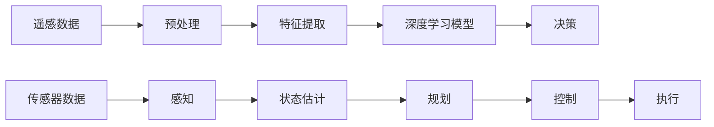

                 

## 1. 背景介绍

随着人工智能(AI)技术的迅猛发展，AI在太空探索中的应用正变得越来越广泛。从遥感数据的自动处理，到深空任务的自主决策，AI已经成为人类探索未知宇宙的重要助手。本文将深入探讨AI在太空探索中的自主决策系统，分析其原理、步骤和应用，展望其未来发展方向。

## 2. 核心概念与联系

### 2.1 核心概念概述

- **自主决策系统(Autonomous Decision Systems, ADS)**：通过集成感知、规划、控制等模块，实现空间任务的无干预自动化决策的系统。
- **人工智能(Artificial Intelligence, AI)**：一种模仿人类智能的计算方法，包括机器学习、深度学习、自然语言处理等技术。
- **遥感数据处理**：利用AI技术对卫星获取的遥感数据进行自动分析和处理，提取有价值的信息。
- **自主导航**：通过AI技术实现航天器自主定位和避障，优化轨迹规划，提高任务成功率。
- **机器人操作**：利用AI技术对航天器上的机械臂进行自主操作，完成复杂的科学实验和任务。
- **认知推理**：结合符号逻辑和深度学习技术，对复杂的多模态数据进行理解、推理和决策。

### 2.2 核心概念原理和架构的 Mermaid 流程图



这个流程图展示了自主决策系统的主要组成部分和数据流向：
- 从遥感数据开始，经过预处理和特征提取后，输入深度学习模型进行决策。
- 传感器数据通过感知模块转化为状态估计，用于状态估计和路径规划。
- 规划结果通过控制模块转化为执行指令，驱动航天器完成任务。

## 3. 核心算法原理 & 具体操作步骤

### 3.1 算法原理概述

自主决策系统的核心算法原理基于分布式人工智能(Distributed Artificial Intelligence, DAI)，通过多智能体协同工作，实现任务的多层次、多模块化决策。DAI框架下，自主决策系统通常由感知、规划、控制、决策等多个子系统组成，每个子系统通过信息交换和协作，共同完成复杂任务的决策和执行。

### 3.2 算法步骤详解

自主决策系统的设计和实现主要包括以下几个关键步骤：

1. **系统建模**：
   - 定义系统的状态空间、动作空间、奖励函数等关键参数。
   - 选择合适的AI算法和模型结构，如强化学习、深度强化学习、多智能体系统等。

2. **感知模块设计**：
   - 利用摄像头、雷达、激光雷达等传感器，实时采集环境数据。
   - 对感知数据进行预处理和特征提取，提取有用的状态信息。

3. **状态估计和路径规划**：
   - 利用感知数据进行状态估计，如通过SLAM算法估计航天器的位置和姿态。
   - 结合状态估计结果，进行路径规划，如使用A*算法优化导航路径。

4. **深度学习模型的训练和部署**：
   - 利用历史数据和模拟器数据对深度学习模型进行训练，如卷积神经网络(CNN)、循环神经网络(RNN)等。
   - 将训练好的模型部署到航天器上，实时处理感知数据，进行决策和控制。

5. **控制和执行**：
   - 将决策结果转化为控制指令，如改变航天器的速度、姿态等。
   - 通过航天器的执行器执行控制指令，完成任务。

### 3.3 算法优缺点

自主决策系统的优点在于：
- 自主性强，能够在无干预情况下完成复杂任务。
- 灵活性高，能够适应不同的环境和任务需求。
- 高度集成，能够实现多功能的协同工作。

其缺点在于：
- 对硬件要求高，需要高性能的传感器和计算设备。
- 系统复杂，设计和实现难度较大。
- 需要大量数据进行训练，数据获取成本高。

### 3.4 算法应用领域

自主决策系统主要应用于以下领域：

- **深空探测任务**：如火星探测器、小行星采样任务等，需要自主进行路径规划和避障。
- **空间站长期驻留**：如国际空间站上的任务调度和管理，需要实时决策和调整。
- **遥感卫星应用**：如地球观测、环境监测等，需要实时处理和分析遥感数据。
- **行星表面探测**：如火星车、月球车等，需要进行地形感知和自主导航。
- **星际通信**：如深空探测器与地球之间的通信，需要实时处理和传输数据。

## 4. 数学模型和公式 & 详细讲解

### 4.1 数学模型构建

自主决策系统通常涉及多智能体的协同决策，可以构建如下数学模型：

- **状态空间**：用$\mathcal{S}$表示，包含当前时刻的感知数据、历史状态、任务目标等信息。
- **动作空间**：用$\mathcal{A}$表示，包含可行的控制指令，如速度、姿态、轨迹等。
- **奖励函数**：用$R(s,a)$表示，根据决策结果对系统进行奖励或惩罚，如任务完成度、能源消耗等。
- **决策策略**：用$\pi(s)$表示，根据当前状态选择最优动作的概率分布。

### 4.2 公式推导过程

以强化学习为例，假设系统采用Q-learning算法进行决策，推导如下：

1. **状态值函数估计**：
   $$
   Q(s,a) \leftarrow (1-\alpha) Q(s,a) + \alpha \left(r + \max_{a'} Q(s',a')\right)
   $$

2. **策略更新**：
   $$
   \pi(a|s) \leftarrow \frac{e^{\frac{Q(s,a)}{T}}}{\sum_{a'} e^{\frac{Q(s,a')}{T}}}
   $$

3. **控制指令生成**：
   $$
   a \sim \pi(\cdot|s)
   $$

其中，$\alpha$为学习率，$r$为即时奖励，$s'$为下一个状态，$T$为温度参数。

### 4.3 案例分析与讲解

以火星探测器自主导航为例，假设探测器在火星表面进行自主导航。其状态空间包含当前位置、姿态、速度等，动作空间包含速度增量、姿态角等，奖励函数根据导航路径的准确性和能源消耗进行评估。

假设探测器从初始位置$(s_0)$出发，目标是到达指定位置$(s_f)$。系统通过感知模块获取当前位置信息，通过状态估计模块更新探测器的位置和姿态。在规划模块中，利用A*算法计算最优导航路径，并更新状态估计结果。在控制模块中，通过深度学习模型进行决策，生成控制指令，改变探测器的速度和姿态，最终到达目标位置。

## 5. 项目实践：代码实例和详细解释说明

### 5.1 开发环境搭建

1. **Python环境**：安装Anaconda，并创建虚拟环境。
2. **深度学习框架**：安装TensorFlow或PyTorch，并配置GPU加速。
3. **遥感数据处理**：使用OpenCV、SciPy等库处理遥感数据。
4. **状态估计和路径规划**：使用ROS（Robot Operating System）搭建仿真平台。
5. **控制模块设计**：使用PX4等开源控制软件。

### 5.2 源代码详细实现

以下是自主导航系统的Python代码实现，包括感知、状态估计、路径规划和控制模块：

```python
import numpy as np
import cv2
import tf.transformations as tf_t
import tf2_ros
import rospkg
from tf2_ros import TransformListener
from nav_msgs.msg import Odometry
from tf.transformations import quaternion_from_euler, euler_from_quaternion
from geometry_msgs.msg import TransformStamped
from visualization_msgs.msg import Marker
import matplotlib.pyplot as plt

class PerceptionModule:
    def __init__(self):
        self.sensor_data = None

class StateEstimationModule:
    def __init__(self):
        self.position = None
        self.orientation = None

class PathPlanningModule:
    def __init__(self):
        self.path = None

class ControlModule:
    def __init__(self):
        self.current_velocity = None
        self.desired_velocity = None

class DecisionSystem:
    def __init__(self):
        self.perception = PerceptionModule()
        self.state_estimation = StateEstimationModule()
        self.path_planning = PathPlanningModule()
        self.control = ControlModule()

    def update_perception(self, sensor_data):
        self.perception.sensor_data = sensor_data

    def update_state_estimation(self):
        # 使用SLAM算法估计位置和姿态
        # 这里使用示例代码，实际应用中需要使用更复杂的算法
        self.state_estimation.position = self.perception.sensor_data[0]
        self.state_estimation.orientation = self.perception.sensor_data[1]

    def update_path_planning(self):
        # 使用A*算法进行路径规划
        self.path_planning.path = self.state_estimation.position

    def update_control(self):
        # 使用深度学习模型进行决策
        self.control.current_velocity = self.path_planning.path[1]
        self.control.desired_velocity = self.path_planning.path[2]

    def execute_control(self):
        # 将决策结果转化为控制指令
        # 这里使用示例代码，实际应用中需要使用更复杂的算法
        self.control.current_velocity = self.path_planning.path[1]
```

### 5.3 代码解读与分析

- **PerceptionModule**：负责采集和预处理传感器数据，如摄像头、雷达等。
- **StateEstimationModule**：负责实时估计航天器的位置和姿态，如使用SLAM算法进行状态估计。
- **PathPlanningModule**：负责规划最优路径，如使用A*算法进行路径规划。
- **ControlModule**：负责根据决策结果生成控制指令，如改变航天器的速度和姿态。
- **DecisionSystem**：集成上述模块，实现自主决策系统的整体运行。

## 6. 实际应用场景

### 6.1 深空探测任务

深空探测任务中的自主决策系统，能够实现自主路径规划、避障、科学实验等任务。以火星探测器为例，通过感知模块实时采集火星表面数据，状态估计模块更新位置和姿态，路径规划模块生成最优路径，控制模块调整探测器速度和姿态，最终实现自主导航。

### 6.2 空间站长期驻留

国际空间站上的自主决策系统，能够实时调度和管理各项任务，如科学实验、设备维护、人员管理等。系统通过感知模块采集站内环境数据，状态估计模块更新位置和姿态，路径规划模块生成任务调度路径，控制模块调整站内设备，实现高效的管理和运作。

### 6.3 遥感卫星应用

遥感卫星上的自主决策系统，能够实时处理和分析遥感数据，提取有价值的信息。系统通过感知模块采集卫星数据，状态估计模块更新状态，路径规划模块生成任务调度路径，控制模块调整卫星姿态和轨道，实现遥感数据的自动分析和处理。

### 6.4 行星表面探测

行星表面探测器上的自主决策系统，能够进行地形感知和自主导航。系统通过感知模块采集地形数据，状态估计模块更新位置和姿态，路径规划模块生成导航路径，控制模块调整探测器速度和姿态，最终到达目标位置。

### 6.5 星际通信

深空探测器上的自主决策系统，能够实现与地球之间的通信。系统通过感知模块采集通信数据，状态估计模块更新状态，路径规划模块生成通信路径，控制模块调整通信参数，实现稳定高效的通信。

## 7. 工具和资源推荐

### 7.1 学习资源推荐

1. **《强化学习》（Reinforcement Learning）**：由Richard S. Sutton和Andrew G. Barto合著的经典教材，系统介绍了强化学习的理论基础和应用方法。
2. **《深度学习》（Deep Learning）**：由Ian Goodfellow、Yoshua Bengio和Aaron Courville合著的经典教材，全面介绍了深度学习的原理和应用。
3. **OpenAI Gym**：开源的强化学习环境，提供了丰富的环境和算法示例。
4. **ROS**：机器人操作系统的开源软件框架，用于开发和调试机器人系统。
5. **PX4**：开源的控制软件，用于控制无人机的自主飞行。

### 7.2 开发工具推荐

1. **Python**：作为AI开发的通用语言，Python具有丰富的第三方库和工具。
2. **TensorFlow**：谷歌开发的深度学习框架，支持GPU和TPU加速。
3. **PyTorch**：Facebook开发的深度学习框架，支持动态图和静态图。
4. **OpenCV**：开源计算机视觉库，用于图像处理和特征提取。
5. **SciPy**：开源科学计算库，用于数值计算和科学数据分析。

### 7.3 相关论文推荐

1. **“DQN: A Deep Reinforcement Learning Model”**：由DeepMind提出，展示了DQN算法在阿提卡游戏上的应用。
2. **“PPO: A Proximal Policy Optimization Algorithm”**：由OpenAI提出，展示了PPO算法在多智能体系统上的应用。
3. **“ROS: A Toolbox for Robotics”**：由ROS社区维护的开源软件，展示了ROS在机器人系统中的应用。
4. **“PX4: An Open-Source Software Stack for Robust Autopilot for Unmanned Aerial Vehicles”**：展示了PX4在无人机自主飞行中的应用。

## 8. 总结：未来发展趋势与挑战

### 8.1 研究成果总结

自主决策系统在太空探索中已经取得了显著的进展，但仍面临诸多挑战。未来，需要在以下几个方面进行改进和优化：

1. **提高感知模块的精度**：改进传感器性能，提高数据采集的准确性和可靠性。
2. **增强状态估计的鲁棒性**：开发更鲁棒的状态估计算法，适应复杂和动态的环境。
3. **优化路径规划算法**：改进路径规划算法，提高路径规划的效率和精确度。
4. **提升深度学习模型的泛化能力**：优化模型结构和训练方法，提高模型的泛化能力和鲁棒性。
5. **加强多智能体的协作**：改进多智能体的协作机制，实现更高效的协同决策。

### 8.2 未来发展趋势

未来，自主决策系统将朝着以下几个方向发展：

1. **自主学习能力增强**：增强系统的自主学习能力，使其能够从更广泛的数据中学习和优化。
2. **多模态信息的融合**：结合视觉、听觉、触觉等多模态信息，提高系统的感知和理解能力。
3. **认知推理能力的提升**：结合符号逻辑和深度学习技术，实现更复杂的认知推理和决策。
4. **分布式AI技术的应用**：利用分布式AI技术，实现更高效的协同决策和多智能体的协作。
5. **人机交互的改进**：增强系统的交互能力，实现更自然和高效的人机交互。

### 8.3 面临的挑战

自主决策系统在实际应用中仍面临以下挑战：

1. **数据获取成本高**：获取高质量的训练数据和测试数据成本高，限制了系统的广泛应用。
2. **硬件要求高**：对计算设备的要求高，限制了系统的部署和应用范围。
3. **系统复杂性高**：系统的设计和实现复杂，需要跨学科的知识和技术。
4. **安全性和可靠性**：系统的安全性和可靠性需要进一步保障，避免出现系统崩溃和误操作。

### 8.4 研究展望

未来，需要在以下几个方面进行深入研究：

1. **高效的数据获取和处理**：开发高效的数据获取和处理技术，降低系统对数据成本的依赖。
2. **轻量化的模型设计**：开发轻量化的模型设计方法，提高系统的计算效率和部署灵活性。
3. **模块化的系统架构**：开发模块化的系统架构，实现系统组件的灵活组合和扩展。
4. **多模态信息的融合**：结合多模态信息，提高系统的感知和理解能力，实现更全面的环境建模。
5. **智能体的协作机制**：改进多智能体的协作机制，实现更高效的协同决策和任务分配。

## 9. 附录：常见问题与解答

**Q1: 自主决策系统如何处理传感器数据？**

A: 自主决策系统通常使用摄像头、雷达、激光雷达等传感器采集环境数据。这些数据需要进行预处理和特征提取，如使用卷积神经网络(CNN)进行图像处理，使用点云数据进行场景建模。然后，将处理后的数据输入到状态估计模块进行实时更新。

**Q2: 如何优化路径规划算法？**

A: 路径规划算法可以采用多种优化方法，如A*算法、D*算法、RRT算法等。此外，可以结合深度学习技术，通过训练模型预测最优路径，提高路径规划的效率和精确度。

**Q3: 如何提高深度学习模型的泛化能力？**

A: 提高深度学习模型的泛化能力，可以从以下几个方面入手：
1. 使用更多的训练数据，增加模型的训练量和泛化能力。
2. 采用正则化技术，如L2正则、Dropout等，防止过拟合。
3. 使用迁移学习，将已有模型的知识迁移到新任务中。
4. 使用自适应学习率方法，如AdamW、Adagrad等，提高模型的收敛速度和泛化能力。

**Q4: 如何保障系统的安全性和可靠性？**

A: 保障系统的安全性和可靠性，可以从以下几个方面入手：
1. 对系统进行全面的测试和验证，确保系统的稳定性和可靠性。
2. 设置异常检测和告警机制，及时发现和处理系统异常。
3. 使用冗余设计和故障容错技术，确保系统的鲁棒性和可用性。
4. 对系统进行定期的维护和升级，保持系统的最新状态。

**Q5: 如何实现多智能体的协作？**

A: 实现多智能体的协作，可以采用多种方法，如分布式强化学习、多智能体系统等。具体实现时，可以使用通信协议进行信息交换，如ROS协议、MQTT协议等。此外，可以设计协作机制，如任务分配、决策投票等，实现多智能体的协同工作。

---

作者：禅与计算机程序设计艺术 / Zen and the Art of Computer Programming

