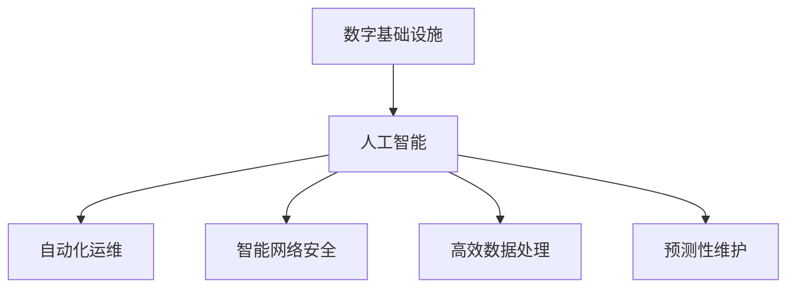

                 

# AI在数字基础设施中的实际应用

> 关键词：数字基础设施,人工智能,边缘计算,云计算,数据中心,自动化运维,网络安全

## 1. 背景介绍

### 1.1 问题由来

在数字化转型的大趋势下，全球各地的数字基础设施建设正在如火如荼地进行。从智能交通系统、智能制造工厂到智慧城市建设，数字基础设施正在改变我们的生产和生活方式。然而，数字基础设施的建设和管理面临着诸多挑战，如复杂的网络结构、海量数据处理、实时性要求高等，这些都对基础设施的管理和服务提出了更高的要求。

面对这些挑战，人工智能（AI）技术应运而生。AI技术通过数据驱动的自动化运维、智能网络安全、高效数据处理等手段，正在成为数字基础设施建设和管理中不可或缺的一部分。

### 1.2 问题核心关键点

AI在数字基础设施中的应用主要体现在以下几个方面：

- 自动化运维：通过AI技术，可以实现基础设施的自动化监控、故障预测和自动修复，提升运维效率。
- 智能网络安全：AI能够实时监测网络威胁，并自动响应，提升网络安全性。
- 高效数据处理：AI技术可以加速数据处理和分析，提升数据中心性能。
- 预测性维护：通过AI技术，可以实现设备预测性维护，减少故障发生率。

## 2. 核心概念与联系

### 2.1 核心概念概述

为更好地理解AI在数字基础设施中的应用，本节将介绍几个密切相关的核心概念：

- 数字基础设施：包括网络、数据中心、物联网设备等，是数字化转型中的关键基础设施。
- 人工智能：通过数据和算法，使机器能够模拟人类的思维和决策过程。
- 自动化运维：利用AI技术实现基础设施的自动化监控、故障预测和自动修复。
- 智能网络安全：通过AI技术实时监测和响应网络威胁，提升网络安全性。
- 高效数据处理：利用AI技术加速数据处理和分析，提升数据中心性能。
- 预测性维护：通过AI技术实现设备的预测性维护，减少故障发生率。

这些核心概念之间的逻辑关系可以通过以下Mermaid流程图来展示：



这个流程图展示了几大核心概念之间的关系：

1. 数字基础设施是AI技术的应用载体，AI通过多种手段提升其性能和效率。
2. 自动化运维、智能网络安全、高效数据处理、预测性维护等都是AI在数字基础设施中的具体应用场景。

## 3. 核心算法原理 & 具体操作步骤
### 3.1 算法原理概述

AI在数字基础设施中的应用，主要依赖于机器学习、深度学习等先进算法。这些算法通过数据驱动的方式，使机器能够学习基础设施的状态和行为模式，从而实现自动化运维、智能网络安全、高效数据处理、预测性维护等功能。

以自动化运维为例，AI技术通过以下几个关键步骤实现：

1. 数据采集：利用传感器和监控设备，采集基础设施的运行数据。
2. 数据预处理：对采集到的数据进行清洗、归一化等处理。
3. 特征提取：利用机器学习算法，从数据中提取关键特征。
4. 模型训练：使用机器学习或深度学习算法，训练预测模型。
5. 故障预测：利用训练好的模型，对基础设施进行故障预测。
6. 自动修复：根据预测结果，自动执行修复操作。

### 3.2 算法步骤详解

以下以自动化运维为例，详细讲解AI技术在数字基础设施中的应用流程：

**Step 1: 数据采集**

首先，需要在基础设施中安装传感器和监控设备，采集其运行数据。例如，在网络设备中安装流量监控设备，采集网络流量、丢包率等数据；在数据中心中安装温度传感器，采集设备温度、电源状态等数据。

**Step 2: 数据预处理**

采集到的数据往往需要预处理，以提高模型的训练效果。数据预处理包括数据清洗、缺失值处理、归一化等步骤。例如，对于温度传感器采集到的数据，可能需要去除异常值，将数据归一化到0-1之间。

**Step 3: 特征提取**

数据预处理后，需要提取关键特征，以供机器学习算法使用。特征提取的方式包括统计特征、时序特征、频域特征等。例如，对于网络流量数据，可以提取数据的时序特征、平均流量、峰值流量等。

**Step 4: 模型训练**

选择合适的机器学习算法，对提取到的特征进行训练。常见的算法包括线性回归、随机森林、深度神经网络等。例如，可以使用长短期记忆网络（LSTM）对网络流量数据进行训练，预测网络故障。

**Step 5: 故障预测**

利用训练好的模型，对基础设施进行故障预测。例如，在网络设备中，可以实时监测网络流量、丢包率等数据，预测网络故障。

**Step 6: 自动修复**

根据故障预测结果，自动执行修复操作。例如，当预测到网络故障时，可以自动重启故障设备，或者调整网络配置，恢复网络正常运行。

### 3.3 算法优缺点

AI技术在数字基础设施中的应用具有以下优点：

1. 提高运维效率：通过自动化运维，减少人工干预，提高基础设施的运维效率。
2. 降低故障率：通过故障预测和自动修复，减少故障发生率，提升基础设施的可靠性。
3. 降低人力成本：通过AI技术，减少人力投入，降低运维成本。
4. 提升用户体验：通过智能网络安全、高效数据处理等手段，提升用户体验。

同时，该技术也存在以下局限性：

1. 数据依赖性高：AI技术的有效应用依赖于高质量的数据，数据采集和预处理较为复杂。
2. 模型复杂度高：AI模型训练需要大量的计算资源，模型复杂度高，难以在小规模数据集上训练。
3. 实时性要求高：AI技术需要实时处理数据，对基础设施的网络和计算资源要求较高。
4. 可靠性问题：AI模型可能存在误差，需要人工干预和验证，以确保其可靠性。

尽管存在这些局限性，但AI技术在数字基础设施中的应用前景仍然广阔，未来需要进一步优化算法、提升数据质量、降低模型复杂度，以实现更加高效、可靠的应用。

### 3.4 算法应用领域

AI技术在数字基础设施中的应用广泛，覆盖了网络、数据中心、物联网设备等多个领域。

**网络领域**

AI技术在网络领域的应用主要体现在以下几个方面：

- 网络监控：利用AI技术实时监测网络流量、丢包率等数据，预测网络故障。
- 流量优化：通过AI技术自动调整网络流量配置，优化网络性能。
- 入侵检测：利用AI技术实时监测网络威胁，自动响应安全事件。

**数据中心领域**

AI技术在数据中心的应用主要体现在以下几个方面：

- 设备监控：利用AI技术实时监测数据中心的设备状态，预测设备故障。
- 能效管理：通过AI技术优化数据中心的能效，降低能耗。
- 数据存储：利用AI技术自动管理数据中心的存储资源，优化存储性能。

**物联网领域**

AI技术在物联网领域的应用主要体现在以下几个方面：

- 设备管理：利用AI技术实时监测物联网设备的运行状态，预测设备故障。
- 数据处理：通过AI技术加速物联网设备的数据处理和分析，提升设备性能。
- 故障诊断：利用AI技术对物联网设备进行故障诊断和自动修复。

## 4. 数学模型和公式 & 详细讲解 & 举例说明

### 4.1 数学模型构建

以下以自动化运维为例，使用数学语言对AI技术在数字基础设施中的应用进行更加严格的刻画。

假设基础设施的运行状态为 $x$，其故障概率为 $p(x)$。利用AI技术，对基础设施进行故障预测和自动修复。模型的目标是最大化基础设施的可用时间，即最大化：

$$
\maximize \sum_{i=1}^N t_i
$$

其中 $t_i$ 表示基础设施在第 $i$ 个时间窗口内的可用时间。

### 4.2 公式推导过程

以下以线性回归模型为例，推导模型的训练和预测过程。

假设网络流量数据为 $x_1, x_2, \dots, x_n$，对应的故障概率为 $y_1, y_2, \dots, y_n$。利用线性回归模型，训练预测公式：

$$
y = wx + b
$$

其中 $w$ 和 $b$ 为模型的参数。训练过程为：

$$
w, b = \arg\min_{w, b} \sum_{i=1}^N (y_i - wx_i - b)^2
$$

预测过程为：

$$
\hat{y} = wx + b
$$

### 4.3 案例分析与讲解

以下以智能网络安全为例，详细讲解AI技术在数字基础设施中的应用。

假设网络数据流量为 $x_1, x_2, \dots, x_n$，对应的安全事件为 $y_1, y_2, \dots, y_n$。利用深度神经网络模型，训练预测公式：

$$
y = \sigma(z)
$$

其中 $\sigma$ 为激活函数，$z$ 为神经网络的输出。训练过程为：

$$
z = \sum_{i=1}^N w_ix_i + b
$$

预测过程为：

$$
\hat{y} = \sigma(z)
$$

## 5. 项目实践：代码实例和详细解释说明
### 5.1 开发环境搭建

在进行AI技术在数字基础设施中的应用实践前，我们需要准备好开发环境。以下是使用Python进行TensorFlow开发的环境配置流程：

1. 安装Anaconda：从官网下载并安装Anaconda，用于创建独立的Python环境。

2. 创建并激活虚拟环境：
```bash
conda create -n tf-env python=3.8 
conda activate tf-env
```

3. 安装TensorFlow：根据CUDA版本，从官网获取对应的安装命令。例如：
```bash
conda install tensorflow -c conda-forge
```

4. 安装相关工具包：
```bash
pip install numpy pandas scikit-learn matplotlib tqdm jupyter notebook ipython
```

完成上述步骤后，即可在`tf-env`环境中开始AI技术在数字基础设施中的应用实践。

### 5.2 源代码详细实现

以下以网络流量监控为例，给出使用TensorFlow对线性回归模型进行训练的PyTorch代码实现。

首先，定义网络流量数据和对应的故障概率：

```python
import tensorflow as tf
import numpy as np

# 定义网络流量数据
x = np.array([[1.0, 2.0], [2.5, 3.0], [3.0, 2.5], [4.0, 2.0]])

# 定义对应的故障概率
y = np.array([[0.0, 1.0], [0.0, 1.0], [0.0, 1.0], [1.0, 0.0]])
```

然后，定义模型和优化器：

```python
# 定义线性回归模型
model = tf.keras.Sequential([
    tf.keras.layers.Dense(1, input_shape=(2,))
])

# 定义优化器
optimizer = tf.keras.optimizers.SGD(learning_rate=0.01)
```

接着，定义训练和评估函数：

```python
# 定义损失函数
loss_fn = tf.keras.losses.MeanSquaredError()

# 定义训练函数
def train_step(x, y):
    with tf.GradientTape() as tape:
        predictions = model(x)
        loss = loss_fn(y, predictions)
    gradients = tape.gradient(loss, model.trainable_variables)
    optimizer.apply_gradients(zip(gradients, model.trainable_variables))
    return loss

# 定义评估函数
def evaluate(x, y):
    predictions = model(x)
    loss = loss_fn(y, predictions)
    return loss.numpy()
```

最后，启动训练流程并在测试集上评估：

```python
# 训练模型
for i in range(100):
    loss = train_step(x, y)
    print(f"Step {i}, Loss: {loss}")

# 评估模型
print(f"Test Loss: {evaluate(x, y)}")
```

以上就是使用TensorFlow对线性回归模型进行训练的完整代码实现。可以看到，得益于TensorFlow的强大封装，我们可以用相对简洁的代码完成模型的训练和评估。

### 5.3 代码解读与分析

让我们再详细解读一下关键代码的实现细节：

**定义网络流量数据和故障概率**：
- `np.array`用于创建数组，表示网络流量数据和故障概率。

**定义模型和优化器**：
- `tf.keras.Sequential`用于定义线性回归模型，包含一个全连接层。
- `tf.keras.optimizers.SGD`用于定义优化器，设置学习率。

**训练函数**：
- `tf.GradientTape`用于计算梯度。
- `model.trainable_variables`获取可训练的模型参数。
- `optimizer.apply_gradients`用于更新模型参数。

**评估函数**：
- `model(x)`用于预测故障概率。
- `loss_fn(y, predictions)`用于计算损失。

**训练和评估流程**：
- 训练过程中，每个批次的数据作为输入，计算梯度并更新模型参数。
- 评估过程中，使用测试集数据计算模型损失。

可以看到，TensorFlow提供了高度自动化的模型训练和评估工具，开发者可以将更多精力放在模型设计和调参等关键环节上，而不必过多关注底层的实现细节。

当然，工业级的系统实现还需考虑更多因素，如模型的保存和部署、超参数的自动搜索、更灵活的任务适配层等。但核心的算法原理和训练流程基本与此类似。

## 6. 实际应用场景

### 6.1 智能交通系统

智能交通系统是数字基础设施中的重要应用场景。AI技术在智能交通系统中的应用主要体现在以下几个方面：

- 交通监控：利用AI技术实时监测交通流量、车辆位置等数据，预测交通拥堵。
- 智能导航：通过AI技术优化交通路线，提升行车效率。
- 事故预警：利用AI技术实时监测交通事件，自动响应事故。

### 6.2 智能制造工厂

智能制造工厂是数字基础设施中的另一个重要应用场景。AI技术在智能制造工厂中的应用主要体现在以下几个方面：

- 设备监控：利用AI技术实时监测设备状态，预测设备故障。
- 生产调度：通过AI技术优化生产流程，提升生产效率。
- 质量控制：利用AI技术实时监测产品质量，提升产品质量。

### 6.3 智慧城市建设

智慧城市建设是数字基础设施中的核心应用场景。AI技术在智慧城市建设中的应用主要体现在以下几个方面：

- 城市管理：利用AI技术实时监测城市运行数据，提升城市管理效率。
- 公共安全：通过AI技术实时监测公共安全事件，提升公共安全水平。
- 市民服务：利用AI技术提升市民服务水平，例如智能问答、智能推荐等。

## 7. 工具和资源推荐
### 7.1 学习资源推荐

为了帮助开发者系统掌握AI技术在数字基础设施中的应用理论基础和实践技巧，这里推荐一些优质的学习资源：

1. 《深度学习基础》系列博文：由大模型技术专家撰写，深入浅出地介绍了深度学习的基本原理和应用方法。

2. 《TensorFlow官方文档》：TensorFlow的官方文档，提供了丰富的API和样例，是入门和深入学习TensorFlow的必备资料。

3. 《机器学习实战》书籍：介绍机器学习的基本概念和实际应用，适合初学者入门。

4. 《深度学习入门》书籍：介绍深度学习的基本概念和实际应用，适合深度学习进阶者学习。

5. Coursera《深度学习专项课程》：由Coursera和深度学习专家Andrew Ng合作开设的深度学习课程，涵盖深度学习的基础和应用。

通过对这些资源的学习实践，相信你一定能够快速掌握AI技术在数字基础设施中的应用精髓，并用于解决实际的数字基础设施问题。

### 7.2 开发工具推荐

高效的开发离不开优秀的工具支持。以下是几款用于AI技术在数字基础设施中的应用开发的常用工具：

1. TensorFlow：由Google主导开发的开源深度学习框架，生产部署方便，适合大规模工程应用。

2. PyTorch：基于Python的开源深度学习框架，灵活动态的计算图，适合快速迭代研究。

3. Weights & Biases：模型训练的实验跟踪工具，可以记录和可视化模型训练过程中的各项指标，方便对比和调优。

4. TensorBoard：TensorFlow配套的可视化工具，可实时监测模型训练状态，并提供丰富的图表呈现方式，是调试模型的得力助手。

5. Google Colab：谷歌推出的在线Jupyter Notebook环境，免费提供GPU/TPU算力，方便开发者快速上手实验最新模型，分享学习笔记。

合理利用这些工具，可以显著提升AI技术在数字基础设施中的应用开发效率，加快创新迭代的步伐。

### 7.3 相关论文推荐

AI技术在数字基础设施中的应用源于学界的持续研究。以下是几篇奠基性的相关论文，推荐阅读：

1. 《深度学习在自动驾驶中的应用》：介绍深度学习在自动驾驶中的各种应用，例如交通监控、智能导航等。

2. 《AI在智能制造中的应用》：介绍AI技术在智能制造工厂中的应用，例如设备监控、生产调度等。

3. 《智能交通系统中的AI技术》：介绍AI技术在智能交通系统中的应用，例如交通监控、智能导航等。

4. 《AI在智慧城市中的应用》：介绍AI技术在智慧城市建设中的应用，例如城市管理、公共安全等。

这些论文代表了大模型技术在数字基础设施中的应用发展脉络。通过学习这些前沿成果，可以帮助研究者把握学科前进方向，激发更多的创新灵感。

## 8. 总结：未来发展趋势与挑战

### 8.1 总结

本文对AI技术在数字基础设施中的应用进行了全面系统的介绍。首先阐述了AI技术在数字基础设施中的应用背景和意义，明确了AI技术在自动化运维、智能网络安全、高效数据处理、预测性维护等领域的重要价值。其次，从原理到实践，详细讲解了AI技术在数字基础设施中的应用流程，给出了AI技术在数字基础设施中的完整代码实例。同时，本文还广泛探讨了AI技术在智能交通系统、智能制造工厂、智慧城市建设等领域的实际应用，展示了AI技术在数字基础设施中的巨大潜力。

通过本文的系统梳理，可以看到，AI技术在数字基础设施中的应用已经成为推动数字化转型进程的重要引擎。得益于大规模数据的积累和深度学习算法的进步，AI技术在基础设施中的应用前景将更加广阔，为数字基础设施的建设和管理提供了全新的解决方案。

### 8.2 未来发展趋势

展望未来，AI技术在数字基础设施中的应用将呈现以下几个发展趋势：

1. 数据驱动的决策：随着数据量的增加，AI技术将更多地依赖数据驱动的决策，提高基础设施管理的智能化水平。

2. 多模态融合：AI技术将更多地融合视觉、语音、文本等多种模态数据，提升基础设施的综合感知能力。

3. 联邦学习：随着数据隐私和安全性的要求增加，AI技术将更多地采用联邦学习等分布式算法，保护数据隐私。

4. 实时性要求提高：随着实时性要求的提高，AI技术将更多地采用模型压缩、边缘计算等技术，提升基础设施的实时性。

5. 自适应算法：随着环境变化的复杂性增加，AI技术将更多地采用自适应算法，提高基础设施的适应能力。

以上趋势凸显了AI技术在数字基础设施中的广阔前景。这些方向的探索发展，必将进一步提升数字基础设施的性能和效率，为数字化转型提供更强大的技术支持。

### 8.3 面临的挑战

尽管AI技术在数字基础设施中的应用前景广阔，但在迈向更加智能化、普适化应用的过程中，仍面临着诸多挑战：

1. 数据质量和多样性：AI技术的应用依赖于高质量、多样化的数据，数据采集和预处理较为复杂。

2. 计算资源要求高：AI技术需要大量的计算资源进行模型训练和推理，对基础设施的网络和计算资源要求较高。

3. 模型复杂度要求高：AI模型的复杂度高，难以在小规模数据集上训练，训练过程复杂。

4. 实时性要求高：AI技术需要实时处理数据，对基础设施的网络和计算资源要求较高。

5. 可靠性问题：AI模型可能存在误差，需要人工干预和验证，以确保其可靠性。

尽管存在这些挑战，但AI技术在数字基础设施中的应用前景仍然广阔，未来需要进一步优化算法、提升数据质量、降低模型复杂度，以实现更加高效、可靠的应用。

### 8.4 研究展望

面对AI技术在数字基础设施应用中面临的挑战，未来的研究需要在以下几个方面寻求新的突破：

1. 探索分布式训练技术：开发更加高效的分布式训练算法，降低对计算资源的依赖。

2. 研究模型压缩技术：开发更加高效的模型压缩算法，降低模型复杂度，提升推理速度。

3. 引入更多先验知识：将符号化的先验知识，如知识图谱、逻辑规则等，与神经网络模型进行巧妙融合，提高模型的泛化能力。

4. 引入多模态信息：将视觉、语音、文本等多种模态数据进行融合，提升基础设施的综合感知能力。

5. 研究自适应算法：开发更加自适应的AI算法，提高基础设施的适应能力。

6. 纳入伦理道德约束：在AI模型训练目标中引入伦理导向的评估指标，过滤和惩罚有偏见、有害的输出倾向。

这些研究方向的探索，必将引领AI技术在数字基础设施中的应用走向更高的台阶，为数字化转型提供更强大的技术支撑。

## 9. 附录：常见问题与解答

**Q1: AI技术在数字基础设施中的应用有哪些？**

A: AI技术在数字基础设施中的应用主要体现在以下几个方面：

1. 自动化运维：通过AI技术实现基础设施的自动化监控、故障预测和自动修复。

2. 智能网络安全：利用AI技术实时监测网络威胁，并自动响应安全事件。

3. 高效数据处理：利用AI技术加速数据处理和分析，提升数据中心性能。

4. 预测性维护：通过AI技术实现设备的预测性维护，减少故障发生率。

**Q2: 如何提高AI在数字基础设施中的应用效率？**

A: 提高AI在数字基础设施中的应用效率，需要从以下几个方面进行优化：

1. 数据采集和预处理：确保数据采集和预处理的高质量，提高模型的训练效果。

2. 模型压缩和加速：开发高效的模型压缩和加速算法，降低模型复杂度，提升推理速度。

3. 分布式训练：采用分布式训练技术，降低对计算资源的依赖。

4. 自适应算法：开发自适应的AI算法，提高基础设施的适应能力。

**Q3: 如何确保AI在数字基础设施中的应用安全性？**

A: 确保AI在数字基础设施中的应用安全性，需要从以下几个方面进行优化：

1. 数据隐私保护：采用联邦学习等分布式算法，保护数据隐私。

2. 模型可靠性验证：引入人工干预和验证，确保AI模型的可靠性。

3. 安全事件响应：建立安全事件响应机制，快速处理安全事件。

**Q4: 如何利用AI技术提升数字基础设施的性能？**

A: 利用AI技术提升数字基础设施的性能，需要从以下几个方面进行优化：

1. 数据驱动决策：通过数据驱动的决策，提高基础设施管理的智能化水平。

2. 多模态融合：将视觉、语音、文本等多种模态数据进行融合，提升基础设施的综合感知能力。

3. 实时性要求提高：采用模型压缩、边缘计算等技术，提升基础设施的实时性。

4. 自适应算法：开发自适应的AI算法，提高基础设施的适应能力。

这些优化措施可以显著提升AI在数字基础设施中的应用效果，推动数字化转型的进程。

---

作者：禅与计算机程序设计艺术 / Zen and the Art of Computer Programming

