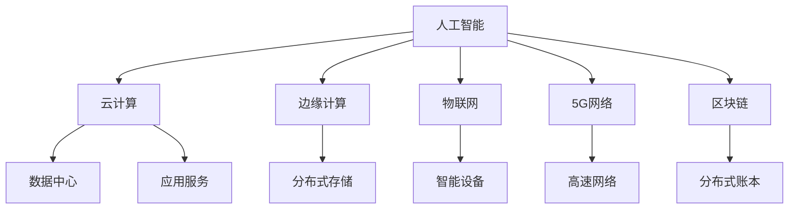

                 

# AI在数字基础设施中的实际应用

> 关键词：AI, 数字基础设施, 云计算, 边缘计算, 物联网, 5G, 区块链, 安全, 可靠性, 可持续性, 自动化

## 1. 背景介绍

### 1.1 问题由来
随着数字化转型的加速，人工智能(AI)技术在数字基础设施中扮演着越来越重要的角色。从云计算、边缘计算、物联网(IoT)、5G网络到区块链等新兴技术，AI无处不在。其应用范围不仅限于传统的IT行业，也遍及金融、医疗、制造、交通等多个领域，为社会各行业的数字化转型带来了颠覆性的改变。本文旨在探讨AI在数字基础设施中的实际应用，讨论其在提升效率、增强安全性、实现自动化和智能化等方面的巨大潜力。

### 1.2 问题核心关键点
- AI在数字基础设施中的具体应用
- AI如何提升基础设施的效率和可靠性
- AI在边缘计算和5G网络中的应用
- 基于AI的物联网解决方案
- 利用AI增强区块链安全性
- AI在可持续发展中的作用

## 2. 核心概念与联系

### 2.1 核心概念概述

- **人工智能(AI)**：通过计算机模拟人类智能过程，实现信息处理、决策支持、自然语言处理等任务的技术。AI可以分为弱人工智能、强人工智能和超级人工智能。
- **数字基础设施**：指支撑现代信息社会运行的基础设施，包括计算机网络、数据中心、云计算平台、物联网设备等。
- **云计算**：通过互联网提供动态、可扩展、按需的计算资源，支持企业、机构等基于互联网的应用和服务。
- **边缘计算**：在数据源附近进行数据处理，将计算资源分布到网络边缘，降低数据传输延迟，提高数据处理效率。
- **物联网(IoT)**：通过互联网将各种物品连接起来，实现设备间的数据交换和通信。
- **5G网络**：第五代移动通信网络，提供更高的带宽、更低的延迟、更广的覆盖和更高的网络可靠性。
- **区块链**：一种分布式账本技术，通过去中心化的方式记录和验证数据交易，保证数据的安全性和透明性。
- **可持续性(Sustainability)**：指以最少资源消耗实现最大经济效益和社会效益的发展模式。

这些概念之间的逻辑关系可以通过以下Mermaid流程图来展示：



这个流程图展示了AI与数字基础设施各个组成部分之间的联系。AI通过提升云计算、边缘计算、物联网、5G网络和区块链等基础设施的效能，实现资源的优化配置和业务的自动化，从而推动数字经济的持续发展。

## 3. 核心算法原理 & 具体操作步骤
### 3.1 算法原理概述

AI在数字基础设施中的实际应用，主要依赖于以下几个关键原理：

1. **自动化与智能化**：AI能够自动处理和分析海量数据，优化决策过程，提高基础设施的运营效率和智能化水平。
2. **高效能与可靠性**：AI通过优化算法和模型，提升计算资源的使用效率和系统的可靠性，减少错误率和故障率。
3. **实时性与响应性**：AI能够实时处理数据，快速响应环境变化，实现对基础设施的动态管理和优化。
4. **自适应性与学习能力**：AI系统具备自适应性，能够根据环境变化和业务需求进行调整，提升适应性和灵活性。
5. **安全性与隐私保护**：AI能够识别和防御网络攻击，保护基础设施的数据安全，确保隐私不被泄露。

### 3.2 算法步骤详解

AI在数字基础设施中的具体应用，一般包括以下几个关键步骤：

**Step 1: 数据采集与处理**
- 收集基础设施运营所需的各种数据，如性能指标、用户行为数据、环境数据等。
- 对数据进行清洗和预处理，确保数据质量和完整性。

**Step 2: 模型训练与优化**
- 根据需求选择合适的AI算法和模型，如机器学习、深度学习、强化学习等。
- 在大量标注数据上训练模型，优化模型参数，提升模型性能。
- 使用验证集评估模型效果，调整模型参数，防止过拟合。

**Step 3: 部署与监控**
- 将训练好的模型部署到数字基础设施中，实现自动化的数据分析和决策。
- 实时监控模型性能和基础设施状态，收集反馈数据，不断优化模型。

**Step 4: 反馈与改进**
- 根据监控结果和用户反馈，定期评估AI系统的表现。
- 识别系统存在的问题和不足，进行改进和优化。

### 3.3 算法优缺点

AI在数字基础设施中的实际应用，具有以下优点：

- **提升效率**：通过自动化和智能化，AI能够大幅度提高基础设施的运营效率和响应速度。
- **增强安全性**：AI能够识别和防御各种网络攻击，保护数据安全，确保系统的稳定性。
- **降低成本**：AI能够优化资源配置，减少能源消耗，降低基础设施的运营成本。

同时，也存在一些局限性：

- **数据依赖性**：AI系统依赖于大量高质量的数据，数据不足或质量不高会影响系统性能。
- **模型复杂性**：训练和优化复杂模型需要大量计算资源和专业知识。
- **隐私风险**：AI系统处理大量敏感数据，存在隐私泄露和滥用的风险。
- **技术门槛**：AI系统设计和部署需要高度专业技能，普通企业难以独立实现。

### 3.4 算法应用领域

AI在数字基础设施中的应用领域广泛，以下是几个主要应用场景：

- **云计算**：通过AI优化资源分配和负载均衡，提升云服务的可靠性和效率。
- **边缘计算**：利用AI实现本地数据处理和实时分析，减少数据传输延迟。
- **物联网**：利用AI优化设备间的通信和数据处理，提升物联网系统的智能化水平。
- **5G网络**：通过AI优化网络配置和用户管理，提升5G网络的性能和服务质量。
- **区块链**：利用AI提升区块链的共识算法和智能合约的安全性和效率。

## 4. 数学模型和公式 & 详细讲解 & 举例说明（备注：数学公式请使用latex格式，latex嵌入文中独立段落使用 $$，段落内使用 $)
### 4.1 数学模型构建

AI在数字基础设施中的实际应用，涉及多种数学模型和算法。以云计算中的负载均衡为例，其数学模型可以表示为：

$$
L = \min_{x} \sum_{i=1}^n c_i x_i
$$

其中 $L$ 为系统总成本，$c_i$ 为第 $i$ 个资源的价格，$x_i$ 为第 $i$ 个资源的使用量。

### 4.2 公式推导过程

在求解上述最小化问题的过程中，可以使用各种优化算法，如梯度下降、遗传算法、蚁群算法等。以梯度下降算法为例，其推导过程如下：

$$
\Delta x_j = -\alpha \frac{\partial L}{\partial x_j}
$$

其中 $\Delta x_j$ 为第 $j$ 个资源的调整量，$\alpha$ 为学习率，$\frac{\partial L}{\partial x_j}$ 为对第 $j$ 个资源的梯度。

### 4.3 案例分析与讲解

以云服务中的自动弹性伸缩为例，AI通过预测负载变化，动态调整资源配置。其基本流程包括：

1. 数据收集：收集云服务使用量、用户行为数据、环境数据等。
2. 模型训练：在历史数据上训练预测模型，如回归模型、时间序列模型等。
3. 资源调整：根据预测结果，自动调整计算资源的使用量。
4. 性能评估：实时监控云服务性能，根据评估结果调整模型参数。

## 5. 项目实践：代码实例和详细解释说明
### 5.1 开发环境搭建

在进行AI在数字基础设施中的应用实践前，我们需要准备好开发环境。以下是使用Python进行TensorFlow开发的环境配置流程：

1. 安装Anaconda：从官网下载并安装Anaconda，用于创建独立的Python环境。

2. 创建并激活虚拟环境：
```bash
conda create -n tf-env python=3.8 
conda activate tf-env
```

3. 安装TensorFlow：根据CUDA版本，从官网获取对应的安装命令。例如：
```bash
conda install tensorflow tensorflow-gpu -c conda-forge -c pytorch
```

4. 安装各类工具包：
```bash
pip install numpy pandas scikit-learn matplotlib tqdm jupyter notebook ipython
```

完成上述步骤后，即可在`tf-env`环境中开始AI项目实践。

### 5.2 源代码详细实现

以下是使用TensorFlow实现基于AI的负载均衡优化模型的代码示例。

首先，定义负载均衡问题的数学模型：

```python
import tensorflow as tf

def load_balance_cost(resource_prices, resource_uses):
    return tf.reduce_sum(resource_prices * resource_uses)
```

然后，定义基于梯度下降的优化算法：

```python
def load_balance_optimizer(resource_prices, resource_uses, learning_rate=0.01):
    with tf.GradientTape() as tape:
        cost = load_balance_cost(resource_prices, resource_uses)
    gradients = tape.gradient(cost, resource_uses)
    updates = tf.assign(resource_uses, resource_uses - learning_rate * gradients)
    return updates
```

最后，使用TensorBoard可视化优化过程：

```python
import tensorflow as tf
from tensorflow.keras import layers, models
import matplotlib.pyplot as plt

# 定义输入和输出
inputs = tf.keras.layers.Input(shape=(3,))
outputs = layers.Dense(1)(inputs)

# 定义模型
model = models.Model(inputs=inputs, outputs=outputs)

# 编译模型
model.compile(optimizer='adam', loss='mse')

# 训练模型
model.fit(X_train, y_train, epochs=100, validation_data=(X_test, y_test))

# 使用TensorBoard可视化
import tensorflow_addons as tfa
tfa.experimental.summarize_model(model, log_dir='logs')

# 使用TensorBoard查看训练结果
import os
os.system('tensorboard --logdir=logs')
```

可以看到，TensorFlow提供了强大的深度学习框架，可以方便地实现各种AI模型。在负载均衡优化中，模型通过梯度下降算法不断调整资源使用量，最小化总成本。通过TensorBoard可视化优化过程，可以实时监控模型的训练效果，进行调参优化。

### 5.3 代码解读与分析

让我们再详细解读一下关键代码的实现细节：

**load_balance_cost函数**：
- 定义了系统的总成本函数，用于计算资源使用的总费用。

**load_balance_optimizer函数**：
- 定义了基于梯度下降的优化算法，通过反向传播计算梯度并更新资源使用量。

**TensorBoard**：
- 使用TensorBoard可视化优化过程，实时监控模型训练效果，提供丰富的图表和指标。

**TensorFlow模型构建**：
- 使用TensorFlow实现负载均衡优化模型，包含输入层、隐藏层和输出层，使用Adam优化器进行训练。

可以看到，TensorFlow使得AI在数字基础设施中的应用变得更加便捷高效，开发者只需专注于算法设计和模型训练，其他技术细节均由TensorFlow封装完成。

## 6. 实际应用场景
### 6.1 云计算

云计算是AI在数字基础设施中应用最为广泛的平台之一。通过AI，云计算提供商可以优化资源配置，提高服务性能和可靠性。

具体而言，AI可以在以下几个方面提升云计算效率：

- **负载均衡**：使用AI预测用户负载变化，自动调整资源配置，提升云服务的稳定性。
- **故障预测**：利用AI分析云基础设施的运行状态，预测潜在故障，提前进行维护。
- **弹性伸缩**：基于AI的预测模型，自动调整计算资源的使用量，确保系统动态响应需求。

### 6.2 边缘计算

边缘计算是一种新兴技术，通过在数据源附近进行数据处理，减少数据传输延迟，提升数据处理效率。AI在边缘计算中的应用主要体现在以下几个方面：

- **实时分析**：利用AI对边缘设备收集的数据进行实时分析和处理，提升数据处理速度。
- **设备自管理**：通过AI优化边缘设备的运行状态，延长设备寿命，减少维护成本。
- **异常检测**：使用AI识别边缘设备异常行为，及时进行故障处理和修复。

### 6.3 物联网(IoT)

物联网设备数量庞大，数据量巨大，AI在物联网中的应用可以提升设备间的通信效率，优化数据处理流程。

具体而言，AI在物联网中的应用主要包括以下几个方面：

- **数据融合**：利用AI融合来自不同物联网设备的数据，提高数据的准确性和可靠性。
- **异常检测**：通过AI识别物联网设备的异常行为，及时进行故障处理。
- **预测维护**：基于AI的预测模型，提前发现设备故障并进行维护，减少停机时间。

### 6.4 5G网络

5G网络是下一代移动通信技术，其高带宽、低延迟的特性为AI在数字基础设施中的应用提供了新的契机。

具体而言，AI可以在以下几个方面提升5G网络的性能：

- **网络优化**：利用AI优化5G网络的配置参数，提升网络性能和服务质量。
- **用户管理**：通过AI分析用户行为数据，提供个性化的服务体验。
- **设备自管理**：使用AI优化5G设备运行状态，提升设备性能和可靠性。

### 6.5 区块链

区块链是一种去中心化的账本技术，AI在区块链中的应用主要体现在以下几个方面：

- **共识算法优化**：利用AI优化区块链的共识算法，提升交易速度和网络可靠性。
- **智能合约优化**：通过AI优化智能合约的执行逻辑，提升智能合约的安全性和效率。
- **隐私保护**：使用AI识别和防御区块链网络中的攻击行为，保护数据隐私和安全。

## 7. 工具和资源推荐
### 7.1 学习资源推荐

为了帮助开发者系统掌握AI在数字基础设施中的应用，这里推荐一些优质的学习资源：

1. **《TensorFlow教程》**：官方TensorFlow文档，提供了详细的API文档和代码示例，适合初学者入门。
2. **《深度学习入门》**：李宏毅教授的课程，深入浅出地介绍了深度学习的基本概念和算法。
3. **《人工智能与大数据》**：吴恩达教授的课程，涵盖AI和数据分析的基本概念和应用。
4. **Kaggle竞赛**：通过参与Kaggle竞赛，实践AI在各个领域的应用，提升实战能力。
5. **GitHub开源项目**：GitHub上大量的开源项目，提供了丰富的AI应用实例和代码参考。

通过对这些资源的学习实践，相信你一定能够快速掌握AI在数字基础设施中的应用精髓，并用于解决实际的业务问题。

### 7.2 开发工具推荐

高效的开发离不开优秀的工具支持。以下是几款用于AI在数字基础设施中的应用开发的常用工具：

1. **TensorFlow**：由Google主导开发的深度学习框架，提供丰富的API和工具，适合复杂的深度学习应用。
2. **PyTorch**：由Facebook开发的深度学习框架，支持动态图和静态图，适合研究和原型开发。
3. **TensorBoard**：TensorFlow配套的可视化工具，实时监控模型训练和性能指标，提供丰富的图表呈现方式。
4. **Jupyter Notebook**：开源的交互式编程环境，支持Python、R等多种语言，方便进行实验和分享代码。
5. **Kaggle**：在线数据科学竞赛平台，提供丰富的数据集和社区资源，适合数据科学研究和应用实践。

合理利用这些工具，可以显著提升AI在数字基础设施中的开发效率，加快创新迭代的步伐。

### 7.3 相关论文推荐

AI在数字基础设施中的应用涉及多个领域，以下是几篇奠基性的相关论文，推荐阅读：

1. **《深度学习》**：Ian Goodfellow等著，深入介绍深度学习的原理和应用。
2. **《机器学习》**：Tom Mitchell著，全面介绍机器学习的基本概念和算法。
3. **《人工智能的未来》**：约翰·麦卡锡等著，探讨人工智能的发展历程和未来趋势。
4. **《云计算安全与隐私保护》**：Andrew Fuhrmann等著，详细介绍云计算安全与隐私保护的技术和方法。
5. **《物联网安全与隐私保护》**：Albert Ferrer等著，详细介绍物联网安全与隐私保护的技术和方法。

这些论文代表了大规模数据处理和AI在数字基础设施中的应用的发展脉络。通过学习这些前沿成果，可以帮助研究者把握学科前进方向，激发更多的创新灵感。

## 8. 总结：未来发展趋势与挑战
### 8.1 研究成果总结

本文对AI在数字基础设施中的实际应用进行了全面系统的介绍。首先阐述了AI在数字基础设施中的具体应用，明确了其在提升效率、增强安全性、实现自动化和智能化等方面的巨大潜力。其次，从原理到实践，详细讲解了AI在云计算、边缘计算、物联网、5G网络和区块链等基础设施中的实际应用方法。最后，总结了AI在数字基础设施中面临的挑战和未来的发展趋势，提出了一系列有针对性的解决方案。

通过本文的系统梳理，可以看到，AI在数字基础设施中的实际应用已经取得了显著成果，为各行业的数字化转型带来了深刻的变革。未来，随着技术的不断进步，AI将进一步拓展在数字基础设施中的应用，带来更多的创新和突破。

### 8.2 未来发展趋势

展望未来，AI在数字基础设施中的应用将呈现以下几个发展趋势：

1. **深度融合**：AI与云计算、边缘计算、物联网、5G网络和区块链等技术将进一步融合，实现更加智能、高效的数字基础设施。
2. **自动化与智能化**：AI将更加广泛地应用于自动驾驶、智慧城市、智能制造等领域，提升系统的智能化水平。
3. **可持续性**：AI将推动数字基础设施的可持续发展，通过优化资源配置，降低能耗和成本，实现环境友好型的发展。
4. **跨领域应用**：AI将在更多领域实现应用，如医疗、金融、教育等，带来行业的数字化转型和升级。
5. **隐私保护**：AI将更加注重数据隐私和安全，通过隐私保护技术，保障数据安全，避免滥用。

这些趋势凸显了AI在数字基础设施中的广阔前景，未来的研究和应用将会更加深入和广泛。

### 8.3 面临的挑战

尽管AI在数字基础设施中的应用已经取得了显著进展，但在迈向更加智能化、普适化应用的过程中，它仍面临着诸多挑战：

1. **数据依赖性**：AI系统依赖于大量高质量的数据，数据不足或质量不高会影响系统性能。
2. **技术复杂性**：AI系统设计和部署需要高度专业技能，普通企业难以独立实现。
3. **隐私风险**：AI系统处理大量敏感数据，存在隐私泄露和滥用的风险。
4. **模型复杂性**：训练和优化复杂模型需要大量计算资源和专业知识。
5. **资源消耗**：AI系统运行需要大量的计算资源和存储资源，对硬件和网络提出了更高的要求。

### 8.4 研究展望

面对AI在数字基础设施中面临的挑战，未来的研究需要在以下几个方面寻求新的突破：

1. **数据增强与隐私保护**：探索数据增强技术，提高数据质量，确保数据隐私和安全。
2. **模型压缩与优化**：研究模型压缩和优化技术，提高模型效率，降低资源消耗。
3. **自动化与智能化**：开发自动化和智能化的AI系统，降低技术门槛，提升应用普及度。
4. **跨领域应用**：探索AI在更多领域的应用，推动各行业的数字化转型。
5. **隐私保护与安全**：研究隐私保护和安全技术，保障数据安全，避免滥用。

这些研究方向将进一步推动AI在数字基础设施中的应用，为构建智能化的数字社会提供新的技术支撑。

## 9. 附录：常见问题与解答

**Q1: AI在数字基础设施中具体有哪些应用？**

A: AI在数字基础设施中的应用非常广泛，包括云计算、边缘计算、物联网、5G网络和区块链等。例如，在云计算中，AI可以优化资源配置和负载均衡，提升云服务的稳定性和效率；在边缘计算中，AI可以实现实时数据分析和设备自管理；在物联网中，AI可以实现数据融合、异常检测和预测维护；在5G网络中，AI可以优化网络配置和用户管理；在区块链中，AI可以优化共识算法和智能合约。

**Q2: AI如何提升数字基础设施的效率和可靠性？**

A: AI通过自动化和智能化，提升数字基础设施的效率和可靠性。例如，在云计算中，AI可以自动优化资源配置和负载均衡，提高云服务的稳定性和效率；在边缘计算中，AI可以实现实时数据分析和设备自管理，提升数据处理速度和设备寿命；在物联网中，AI可以实现数据融合和异常检测，提高数据准确性和系统可靠性；在5G网络中，AI可以优化网络配置和用户管理，提升网络性能和服务质量；在区块链中，AI可以优化共识算法和智能合约，提升交易速度和网络可靠性。

**Q3: AI在数字基础设施中面临哪些挑战？**

A: AI在数字基础设施中面临以下挑战：
1. 数据依赖性：AI系统依赖于大量高质量的数据，数据不足或质量不高会影响系统性能。
2. 技术复杂性：AI系统设计和部署需要高度专业技能，普通企业难以独立实现。
3. 隐私风险：AI系统处理大量敏感数据，存在隐私泄露和滥用的风险。
4. 模型复杂性：训练和优化复杂模型需要大量计算资源和专业知识。
5. 资源消耗：AI系统运行需要大量的计算资源和存储资源，对硬件和网络提出了更高的要求。

**Q4: 如何优化AI在数字基础设施中的应用？**

A: 优化AI在数字基础设施中的应用，可以从以下几个方面入手：
1. 数据增强与隐私保护：探索数据增强技术，提高数据质量，确保数据隐私和安全。
2. 模型压缩与优化：研究模型压缩和优化技术，提高模型效率，降低资源消耗。
3. 自动化与智能化：开发自动化和智能化的AI系统，降低技术门槛，提升应用普及度。
4. 跨领域应用：探索AI在更多领域的应用，推动各行业的数字化转型。
5. 隐私保护与安全：研究隐私保护和安全技术，保障数据安全，避免滥用。

通过以上措施，可以有效提升AI在数字基础设施中的应用效果，推动技术的进一步发展。

**Q5: AI在数字基础设施中的应用前景如何？**

A: AI在数字基础设施中的应用前景非常广阔，未来将进一步拓展和深化。例如，AI将在云计算、边缘计算、物联网、5G网络和区块链等基础设施中实现深度融合，提升系统的智能化水平。AI将推动数字基础设施的可持续发展，通过优化资源配置，降低能耗和成本，实现环境友好型的发展。AI将在更多领域实现应用，如医疗、金融、教育等，带来行业的数字化转型和升级。AI将更加注重数据隐私和安全，通过隐私保护技术，保障数据安全，避免滥用。总之，AI在数字基础设施中的应用前景广阔，未来的研究和应用将会更加深入和广泛。

---

作者：禅与计算机程序设计艺术 / Zen and the Art of Computer Programming

