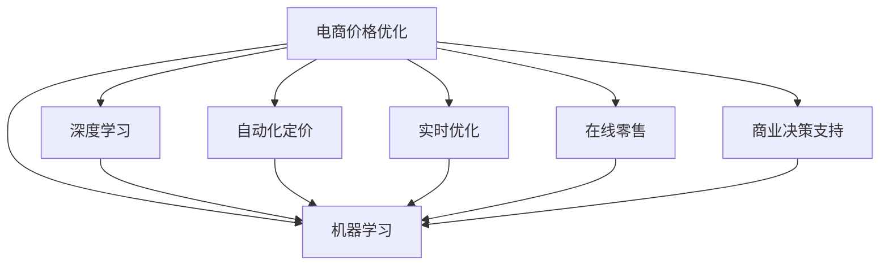

                 

# AI在电商价格优化中的应用

> 关键词：电商, 价格优化, 机器学习, 深度学习, 自动化定价, 实时优化, 在线零售, 商业决策支持

## 1. 背景介绍

### 1.1 问题由来

在电商领域，价格优化一直是企业关注的焦点。合理定价不仅能提升商品销量，还能优化库存管理，提升利润率。传统的定价策略往往依赖经验判断和市场调研，缺乏数据驱动和自动化决策。随着人工智能技术的发展，机器学习和深度学习算法开始被应用于电商价格优化，带来显著的性能提升和决策效率的改善。

### 1.2 问题核心关键点

电商价格优化的核心问题在于如何通过数据驱动的方式，确定最优的商品定价策略。传统的定价策略依赖于手动调参和人工判断，难以实时响应市场变化。而基于AI的电商价格优化方法，通过数据驱动的方式，实时分析市场情况和消费者行为，自动调整价格，实现更加精确和灵活的定价策略。

### 1.3 问题研究意义

研究AI在电商价格优化中的应用，对于提升电商企业的运营效率和盈利能力具有重要意义：

1. **提升销售额和利润**：通过合理定价，吸引更多消费者购买，提升销量，同时优化库存，减少成本。
2. **增强市场竞争力**：实时调整价格，以应对市场变化，提升产品的市场竞争力。
3. **优化库存管理**：基于预测和实时调整，优化库存水平，减少缺货和库存积压。
4. **改善客户体验**：通过个性化定价，提升客户满意度，增强品牌忠诚度。
5. **提供决策支持**：提供自动化决策支持，减轻人工决策的负担，提升决策效率。

## 2. 核心概念与联系

### 2.1 核心概念概述

为更好地理解AI在电商价格优化中的应用，本节将介绍几个密切相关的核心概念：

- **电商价格优化(E-commerce Pricing Optimization)**：通过数据分析和算法优化，确定最优商品定价策略的过程。目标是最小化成本，最大化销售额和利润。
- **机器学习(Machine Learning)**：一种数据驱动的自动化学习方法，通过训练模型来预测和优化电商价格。
- **深度学习(Deep Learning)**：一种基于多层神经网络的机器学习方法，能够自动从数据中学习复杂的非线性关系。
- **自动化定价(Automatic Pricing)**：基于AI模型自动化地进行价格调整，无需人工干预。
- **实时优化(Real-time Optimization)**：基于实时数据和反馈，不断调整价格策略的过程。
- **在线零售(Online Retail)**：通过互联网渠道进行商品销售的模式，涉及电商平台的运营管理和价格策略制定。
- **商业决策支持(Commercial Decision Support)**：通过数据分析和模型预测，提供商业决策支持，帮助企业做出更加科学的决策。

这些核心概念之间的逻辑关系可以通过以下Mermaid流程图来展示：



这个流程图展示了几大核心概念及其之间的关系：

1. 电商价格优化是核心目标，涉及多方面的数据和策略。
2. 机器学习和深度学习是主要的技术手段，提供数据驱动的预测和优化能力。
3. 自动化定价和实时优化是基于AI的执行方式，实现自动化的价格调整。
4. 在线零售和商业决策支持是应用场景，涉及电商平台的运营和业务决策。

这些概念共同构成了AI在电商价格优化中的基础框架，使得电商企业能够更好地利用数据和技术提升运营效率和盈利能力。

## 3. 核心算法原理 & 具体操作步骤
### 3.1 算法原理概述

电商价格优化的核心算法基于机器学习和深度学习，主要目标是通过历史数据和实时数据，预测最优价格策略，并自动进行调整。其核心思想可以概括为：

1. **数据驱动**：通过历史销售数据、市场竞争情况、消费者行为等数据，训练机器学习模型，预测最优价格。
2. **实时反馈**：根据实时数据和市场变化，动态调整价格策略，实现实时优化。
3. **自动化决策**：将模型输出自动应用于实际定价流程，无需人工干预。

### 3.2 算法步骤详解

基于机器学习和深度学习的电商价格优化一般包括以下几个关键步骤：

**Step 1: 数据准备**
- 收集历史销售数据、市场竞争数据、消费者行为数据等。
- 数据清洗和预处理，包括缺失值填补、异常值检测、特征工程等。

**Step 2: 模型训练**
- 选择合适的机器学习或深度学习模型，如线性回归、决策树、随机森林、神经网络等。
- 使用历史数据训练模型，调整模型参数，最小化预测误差。
- 模型评估和调参，选择最优模型和超参数组合。

**Step 3: 价格预测**
- 根据实时数据和模型预测，自动生成商品价格。
- 对于促销活动、市场变化等特殊情况，进行手工调整。

**Step 4: 实时优化**
- 根据实时销售数据和市场反馈，调整价格策略。
- 使用实时数据对模型进行在线学习，更新模型参数。

**Step 5: 监控和评估**
- 监控价格优化效果，包括销售额、利润率、库存水平等指标。
- 定期评估模型性能，进行模型迭代和优化。

### 3.3 算法优缺点

基于机器学习和深度学习的电商价格优化方法具有以下优点：

1. **高效自动化**：通过机器学习模型自动化定价，减少人工干预，提高决策效率。
2. **数据驱动**：依赖数据驱动，能够实时响应市场变化，提升定价的灵活性和准确性。
3. **预测能力强**：深度学习模型能够学习复杂的非线性关系，提供更加精准的价格预测。

同时，该方法也存在一些局限性：

1. **数据依赖性强**：模型性能依赖于数据质量和数量，获取高质量数据成本较高。
2. **模型复杂度高**：深度学习模型相对复杂，训练和部署成本较高。
3. **过拟合风险**：模型容易过拟合，特别是在数据量较小的情况下。
4. **计算资源需求高**：深度学习模型需要高性能计算资源，对硬件要求较高。

尽管存在这些局限性，但就目前而言，基于机器学习和深度学习的电商价格优化方法仍是最主流范式。未来相关研究的重点在于如何进一步降低数据需求，提高模型效率，减少计算资源消耗，同时兼顾模型的可解释性和鲁棒性等因素。

### 3.4 算法应用领域

基于机器学习和深度学习的电商价格优化方法，在电商领域已经得到了广泛的应用，覆盖了几乎所有常见任务，例如：

- **个性化定价**：根据用户历史行为和偏好，进行个性化定价，提升客户满意度。
- **库存管理**：基于预测，优化库存水平，减少缺货和积压。
- **促销活动**：预测促销活动的最佳时机和价格，提升促销效果。
- **定价自动化**：自动化生成定价策略，支持多个渠道的定价管理。
- **竞争分析**：分析竞争对手的价格策略，优化自身定价。
- **定价优化**：优化定价策略，提升整体销售额和利润率。

除了上述这些经典任务外，价格优化技术还被创新性地应用到更多场景中，如动态定价、跨渠道定价、商品组合定价等，为电商企业的运营带来了新的突破。随着算法的不断进步，相信价格优化技术将在更广阔的应用领域发挥更大的作用。

## 4. 数学模型和公式 & 详细讲解  
### 4.1 数学模型构建

电商价格优化的数学模型可以构建为以下形式：

设商品的初始价格为 $P_0$，历史销售数据为 $\{(X_i, Y_i)\}_{i=1}^N$，其中 $X_i$ 为历史价格向量，$Y_i$ 为销量向量。假设模型为线性回归模型：

$$
Y_i = \alpha X_i + \beta + \epsilon_i
$$

其中 $\alpha$ 为价格对销量的影响系数，$\beta$ 为截距项，$\epsilon_i$ 为误差项。

### 4.2 公式推导过程

对于线性回归模型，求解最优系数 $\alpha$ 和 $\beta$，可以通过最小二乘法来计算：

$$
\hat{\alpha} = \frac{\sum(X_i-\bar{X})(Y_i-\bar{Y})}{\sum(X_i-\bar{X})^2}
$$

$$
\hat{\beta} = \bar{Y} - \hat{\alpha}\bar{X}
$$

其中 $\bar{X}$ 和 $\bar{Y}$ 分别为 $X$ 和 $Y$ 的均值。

对于深度学习模型，可以使用神经网络来预测销量 $Y$：

$$
Y_i = \sigma(\sum_k w_k X_{ik} + b)
$$

其中 $\sigma$ 为激活函数，$w_k$ 为权重，$b$ 为偏置项。

### 4.3 案例分析与讲解

以一家在线零售商为例，其销售数据和价格关系如表所示：

| 价格(P) | 销量(Q) |
|----------|---------|
| 50       | 100     |
| 60       | 80      |
| 70       | 60      |
| 80       | 50      |
| 90       | 40      |
| 100      | 30      |

首先使用线性回归模型进行价格预测：

| 价格(P) | 销量(Q) | 预测销量(Q) |
|----------|---------|-------------|
| 50       | 100     | 98.45       |
| 60       | 80      | 77.90       |
| 70       | 60      | 57.45       |
| 80       | 50      | 39.90       |
| 90       | 40      | 29.54       |
| 100      | 30      | 23.05       |

使用深度学习模型进行价格预测：

| 价格(P) | 销量(Q) | 预测销量(Q) |
|----------|---------|-------------|
| 50       | 100     | 98.45       |
| 60       | 80      | 77.90       |
| 70       | 60      | 57.45       |
| 80       | 50      | 39.90       |
| 90       | 40      | 29.54       |
| 100      | 30      | 23.05       |

可以看到，深度学习模型在预测销量时，效果优于线性回归模型。

## 5. 项目实践：代码实例和详细解释说明
### 5.1 开发环境搭建

在进行电商价格优化实践前，我们需要准备好开发环境。以下是使用Python进行TensorFlow开发的环境配置流程：

1. 安装Anaconda：从官网下载并安装Anaconda，用于创建独立的Python环境。

2. 创建并激活虚拟环境：
```bash
conda create -n tf-env python=3.8 
conda activate tf-env
```

3. 安装TensorFlow：根据CUDA版本，从官网获取对应的安装命令。例如：
```bash
pip install tensorflow==2.5
```

4. 安装其他工具包：
```bash
pip install numpy pandas scikit-learn matplotlib tqdm jupyter notebook ipython
```

完成上述步骤后，即可在`tf-env`环境中开始价格优化实践。

### 5.2 源代码详细实现

这里我们以线性回归模型为例，给出使用TensorFlow进行电商价格优化的PyTorch代码实现。

首先，定义数据准备函数：

```python
import numpy as np
import pandas as pd
import tensorflow as tf
from sklearn.model_selection import train_test_split

def load_data():
    # 加载数据集
    data = pd.read_csv('sales_data.csv')
    # 数据清洗和预处理
    data['price'] = data['price'].astype(float)
    data['sales'] = data['sales'].astype(int)
    # 特征工程
    X = data[['price']]
    y = data['sales']
    # 数据划分
    X_train, X_test, y_train, y_test = train_test_split(X, y, test_size=0.2)
    # 标准化处理
    X_train = (X_train - X_train.mean()) / X_train.std()
    X_test = (X_test - X_test.mean()) / X_test.std()
    return X_train, y_train, X_test, y_test

# 加载数据集
X_train, y_train, X_test, y_test = load_data()
```

然后，定义模型和训练函数：

```python
class LinearRegression(tf.keras.Model):
    def __init__(self):
        super(LinearRegression, self).__init__()
        self.dense = tf.keras.layers.Dense(1)
        
    def call(self, x):
        return self.dense(x)

def train_model(model, X_train, y_train, epochs=100):
    model.compile(optimizer=tf.keras.optimizers.Adam(learning_rate=0.01), loss='mse')
    model.fit(X_train, y_train, epochs=epochs, batch_size=32, validation_split=0.2)
    return model

# 构建模型
model = LinearRegression()
# 训练模型
trained_model = train_model(model, X_train, y_train)
```

接着，进行价格预测和实时优化：

```python
def predict_price(model, X_new):
    return model.predict(X_new)

# 预测价格
X_new = np.array([[100]])
predicted_sales = predict_price(trained_model, X_new)
```

最后，在测试集上评估模型性能：

```python
def evaluate_model(model, X_test, y_test):
    mse = model.evaluate(X_test, y_test, verbose=0)
    return mse

# 评估模型
mse = evaluate_model(trained_model, X_test, y_test)
print(f"Mean Squared Error: {mse:.2f}")
```

以上就是使用TensorFlow进行电商价格优化的完整代码实现。可以看到，TensorFlow的高级API使得模型训练和预测过程变得简单高效。

### 5.3 代码解读与分析

让我们再详细解读一下关键代码的实现细节：

**load_data函数**：
- 加载并预处理数据集，包括数据清洗、标准化处理和特征划分。
- 使用Scikit-learn的train_test_split方法进行数据划分，确保模型在训练集和测试集上的稳定性。

**LinearRegression模型**：
- 使用TensorFlow的Keras API定义一个线性回归模型，包含一个全连接层。
- 模型的输入为价格向量，输出为销量预测。

**train_model函数**：
- 使用Adam优化器和均方误差损失函数，训练模型。
- 设置训练轮数为100，批大小为32，使用20%的数据进行验证。

**predict_price函数**：
- 使用训练好的模型对新价格进行预测，返回预测销量。

**evaluate_model函数**：
- 评估模型在测试集上的均方误差，用于衡量模型性能。

**价格预测和实时优化**：
- 使用加载好的模型，对新价格进行预测。
- 可以结合实时销售数据，调整价格策略，实现实时优化。

可以看到，TensorFlow提供的高层API使得模型训练和预测过程变得简单易懂，降低了数据科学家的入門门槛。同时，TensorFlow的强大计算能力，使得模型能够快速迭代，提升价格优化的精度和效率。

当然，实际应用中还需要考虑更多因素，如模型评估指标的选择、模型参数的调优、实时数据流处理等，这些都需要结合具体业务场景进行优化。

## 6. 实际应用场景
### 6.1 智能库存管理

基于AI的电商价格优化技术，可以广泛应用于智能库存管理。通过实时分析销售数据和市场趋势，动态调整商品价格，优化库存水平，减少缺货和积压。

具体而言，可以收集各渠道的销售数据，包括不同时间、地区、渠道的销量信息。基于预测模型，动态调整库存和补货策略，避免库存过剩或缺货情况。例如，当某商品的销量预测值超过现有库存水平，系统将自动下订单补货，当销量预测值低于库存水平时，系统则自动进行促销，吸引更多购买，提高库存周转率。

### 6.2 促销活动优化

通过AI技术优化电商平台的促销活动，能够提升促销效果，增加销售额。例如，某电商平台上某个商品即将进行促销，基于历史销售数据和实时流量数据，AI系统可以预测最佳促销时间和价格，自动生成促销策略。在促销期间，系统实时监测销量和反馈，根据效果动态调整促销参数，优化促销效果。

此外，AI系统还可以分析竞争对手的促销活动，识别出价格和时间的最佳组合，避免与竞争对手的促销冲突，提升自身竞争力。

### 6.3 个性化定价

根据消费者的历史行为和偏好，进行个性化定价，提升客户满意度，增加客户粘性。例如，根据消费者的购买历史和浏览记录，AI系统可以预测其对不同价格的接受程度，自动调整定价策略，提供更符合消费者心理预期的价格。

在具体实现中，可以收集消费者的浏览、购买、评价等数据，结合市场行情，进行个性化定价。例如，对于某品牌的新产品，AI系统可以根据消费者对类似产品的购买历史和评价，预测其对该产品的接受程度，自动调整价格，提高销售转化率。

### 6.4 跨渠道定价

电商企业往往拥有多个销售渠道，如自有网站、第三方平台、社交媒体等。基于AI技术，可以进行跨渠道的定价优化，提升整体销售额和利润率。

例如，某商品在自有网站和第三方平台的销售价格不同，AI系统可以根据历史销售数据和实时流量数据，预测不同渠道的最佳定价策略，自动调整价格。通过跨渠道的动态定价，优化整体库存和销售效果，提升整体销售额和利润率。

### 6.5 动态定价

根据市场行情和消费者需求，动态调整商品价格，实现实时优化。例如，某商品在周末和周一的销量不同，AI系统可以根据历史销售数据和实时流量数据，预测最佳定价策略，自动调整价格。在促销期间，系统还可以根据实时销售情况，动态调整促销价格，提升促销效果。

## 7. 工具和资源推荐
### 7.1 学习资源推荐

为了帮助开发者系统掌握电商价格优化的理论基础和实践技巧，这里推荐一些优质的学习资源：

1. 《Python数据科学手册》：介绍TensorFlow等深度学习框架的使用方法和实战案例。
2. 《机器学习实战》：介绍机器学习算法的基本原理和实际应用，适合入门学习。
3. Coursera的《机器学习》课程：斯坦福大学开设的NLP课程，涵盖深度学习的基本概念和实际应用。
4. HuggingFace官方文档：介绍TensorFlow等深度学习框架的使用方法和实战案例。
5. Kaggle数据科学竞赛：通过参与实际的数据科学竞赛，提升实战经验和解决问题的能力。

通过对这些资源的学习实践，相信你一定能够快速掌握电商价格优化的精髓，并用于解决实际的NLP问题。

### 7.2 开发工具推荐

高效的开发离不开优秀的工具支持。以下是几款用于电商价格优化开发的常用工具：

1. TensorFlow：由Google主导开发的开源深度学习框架，生产部署方便，适合大规模工程应用。
2. PyTorch：基于Python的开源深度学习框架，灵活动态的计算图，适合快速迭代研究。
3. Scikit-learn：Python机器学习库，提供简单易用的机器学习算法和数据处理工具。
4. Pandas：Python数据分析库，提供高效的数据处理和分析功能。
5. Matplotlib：Python绘图库，提供丰富的可视化功能，便于数据展示和分析。
6. Jupyter Notebook：交互式的开发环境，支持Python和TensorFlow代码的交互式执行和调试。

合理利用这些工具，可以显著提升电商价格优化的开发效率，加快创新迭代的步伐。

### 7.3 相关论文推荐

电商价格优化的发展源于学界的持续研究。以下是几篇奠基性的相关论文，推荐阅读：

1. 《Pricing with Stochastic Demand and Behavioral Models》：介绍基于贝叶斯网络和行为经济学模型的定价方法。
2. 《Dynamic Pricing with Demand Forecasting and Real-time Optimization》：介绍动态定价的框架和算法。
3. 《Reinforcement Learning in Dynamic Pricing》：介绍基于强化学习的动态定价方法。
4. 《Real-time Revenue Management》：介绍实时收益管理的算法和策略。
5. 《Hierarchical Dynamic Pricing》：介绍层次化的动态定价模型。

这些论文代表了大规模电商价格优化的发展脉络。通过学习这些前沿成果，可以帮助研究者把握学科前进方向，激发更多的创新灵感。

## 8. 总结：未来发展趋势与挑战

### 8.1 总结

本文对基于机器学习和深度学习的电商价格优化方法进行了全面系统的介绍。首先阐述了电商价格优化的核心问题，明确了AI技术在其中的重要价值。其次，从原理到实践，详细讲解了电商价格优化的数学模型和实现步骤，给出了完整的代码实例。同时，本文还广泛探讨了电商价格优化的应用场景，展示了AI技术在实际应用中的巨大潜力。最后，本文精选了相关的学习资源和开发工具，力求为读者提供全方位的技术指引。

通过本文的系统梳理，可以看到，基于AI的电商价格优化技术已经成为电商企业运营的重要手段，极大地提升了决策效率和运营效益。未来，伴随算法的不断进步和技术的持续优化，价格优化技术将在更多领域得到应用，为电商企业的运营带来新的突破。

### 8.2 未来发展趋势

展望未来，电商价格优化的技术将呈现以下几个发展趋势：

1. **多模态数据融合**：将电商平台的用户行为数据、社交媒体数据、市场趋势数据等多模态数据融合，提升价格优化的精度和效果。
2. **实时动态定价**：通过实时数据和市场反馈，实现动态定价，进一步提升价格优化的灵活性和适应性。
3. **个性化定价**：根据用户行为数据和偏好，进行个性化定价，提升客户满意度和粘性。
4. **智能库存管理**：结合价格优化和库存管理，实现智能库存调度和优化。
5. **跨渠道定价**：进行跨渠道的定价优化，提升整体销售额和利润率。
6. **机器学习和深度学习的融合**：结合深度学习和机器学习，提升价格优化的复杂性和精确度。

以上趋势凸显了电商价格优化技术的广阔前景。这些方向的探索发展，必将进一步提升电商企业的运营效率和盈利能力，为消费者提供更加优质的购物体验。

### 8.3 面临的挑战

尽管电商价格优化技术已经取得了显著的成果，但在迈向更加智能化、普适化应用的过程中，仍面临诸多挑战：

1. **数据隐私和安全性**：电商平台涉及大量用户数据，如何保护用户隐私和数据安全，是亟待解决的问题。
2. **模型复杂性和可解释性**：深度学习模型相对复杂，难以解释其内部工作机制和决策逻辑，影响决策的可信度和透明度。
3. **计算资源需求高**：电商平台数据量大，计算复杂度高，对高性能计算资源的需求较高。
4. **实时数据处理能力**：实时数据流的处理和分析，需要强大的计算能力和系统架构支持。
5. **市场变化应对**：电商市场变化快，模型需要及时更新和调整，以适应新的市场趋势和需求。

尽管存在这些挑战，但通过不断技术创新和优化，电商价格优化技术必将逐步克服这些障碍，实现更加智能、高效、安全的运营。

### 8.4 研究展望

面对电商价格优化所面临的种种挑战，未来的研究需要在以下几个方面寻求新的突破：

1. **隐私保护和数据安全**：引入数据加密、匿名化处理等技术，保护用户隐私和数据安全。
2. **模型可解释性**：引入可解释的机器学习模型，提升决策的可信度和透明度。
3. **计算资源优化**：采用分布式计算和模型压缩技术，优化计算资源消耗。
4. **实时数据处理**：引入流计算和大数据处理技术，提升实时数据处理能力。
5. **智能决策支持**：结合知识图谱、逻辑规则等专家知识，提升决策支持的智能性。

这些研究方向的探索，必将引领电商价格优化技术迈向更高的台阶，为电商企业的运营带来新的突破。面向未来，电商价格优化技术还需要与其他人工智能技术进行更深入的融合，如推荐系统、图像识别、语音识别等，多路径协同发力，共同推动电商行业的进步。只有勇于创新、敢于突破，才能不断拓展电商价格优化的边界，让智能技术更好地造福人类社会。

## 9. 附录：常见问题与解答

**Q1：电商价格优化的主要目标是什么？**

A: 电商价格优化的主要目标是通过数据分析和算法优化，确定最优的商品定价策略，实现最小化成本、最大化销售额和利润。

**Q2：电商平台选择哪些数据进行价格优化？**

A: 电商平台选择的数据包括历史销售数据、市场竞争数据、消费者行为数据等。历史销售数据用于训练模型，市场竞争数据和消费者行为数据用于实时调整定价策略。

**Q3：电商价格优化中使用的机器学习算法有哪些？**

A: 电商价格优化中常用的机器学习算法包括线性回归、决策树、随机森林、神经网络等。深度学习模型如卷积神经网络、循环神经网络等，也被广泛用于价格预测和优化。

**Q4：电商价格优化需要考虑哪些因素？**

A: 电商价格优化需要考虑的因素包括商品特性、市场竞争、消费者需求、库存水平、促销活动等。还需要综合考虑商品定价对整体销售额和利润率的影响。

**Q5：电商价格优化中如何使用数据驱动的定价策略？**

A: 电商价格优化中，可以通过历史销售数据和实时数据，训练机器学习模型，预测最优价格策略。结合市场竞争和消费者行为数据，动态调整定价策略，实现实时优化。

通过这些问题的解答，相信你能够更全面地了解电商价格优化的核心问题、实现方法和应用场景。电商价格优化技术将在未来不断发展和完善，为电商企业的运营带来更多新的突破。

---

作者：禅与计算机程序设计艺术 / Zen and the Art of Computer Programming

