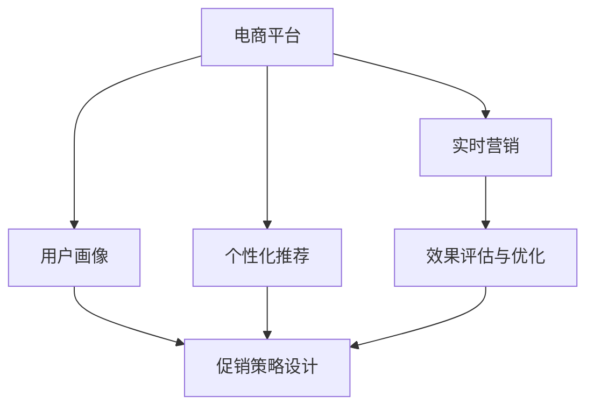

                 

# AI在电商平台促销策略中的应用

## 1. 背景介绍

### 1.1 问题由来

在当前数字化经济的大背景下，电商平台已经成为消费者购物的主要渠道。为吸引消费者并提高销售额，电商平台经常推出各种促销策略，如打折、满减、积分兑换等。然而，由于促销策略的复杂性和多样性，如何制定有效的促销方案，精准地触达目标消费者，最大化促销效果，成为了电商平台面临的重大挑战。

为解决这一问题，AI技术被广泛应用于电商平台的促销策略制定和优化中。通过AI算法，电商平台可以从海量用户行为数据中挖掘出有价值的营销信息，设计出针对性更强、效果更优的促销方案。

### 1.2 问题核心关键点

AI在电商平台促销策略中的应用，主要集中在以下几个方面：

- **用户行为分析**：通过分析用户的历史购买行为、浏览记录、评分评价等数据，构建用户画像，识别出潜在的目标消费者。
- **促销策略设计**：基于用户画像和市场数据，设计出针对性更强的促销方案，如个性化折扣、推荐组合、限时抢购等。
- **效果评估与优化**：实时监控促销活动的效果，利用AI算法不断调整策略，以达到最佳的营销效果。

这些关键点共同构成了AI在电商平台促销策略中的核心应用框架，使其能够在复杂的市场环境中，高效、精准地实现销售目标。

## 2. 核心概念与联系

### 2.1 核心概念概述

为更好地理解AI在电商平台促销策略中的应用，本节将介绍几个密切相关的核心概念：

- **电商平台**：指在线销售商品的电子平台，如京东、淘宝、亚马逊等。通过线上交易和服务，连接消费者和商家。
- **用户画像**：指基于用户行为数据，构建出的用户标签、兴趣、需求等信息的集合。用于描述和预测用户行为。
- **个性化推荐**：指利用AI算法，根据用户的历史行为和兴趣，为其推荐个性化商品和促销方案。
- **实时营销**：指利用AI和大数据技术，对用户行为进行实时分析，动态调整营销策略，以提升营销效果。
- **效果评估与优化**：指利用AI算法，对促销活动的效果进行实时监控和分析，优化策略，提升ROI。

这些核心概念之间的逻辑关系可以通过以下Mermaid流程图来展示：



这个流程图展示了几者之间的逻辑关系：

1. 电商平台通过用户画像和个性化推荐，提升用户购买体验。
2. 实时营销通过用户行为分析，动态调整促销策略。
3. 效果评估与优化通过实时监控，不断优化策略，提升ROI。
4. 促销策略设计综合利用用户画像和推荐结果，设计针对性促销方案。

这些概念共同构成了AI在电商平台促销策略中的应用框架，使其能够精准、高效地实现销售目标。

## 3. 核心算法原理 & 具体操作步骤

### 3.1 算法原理概述

AI在电商平台促销策略中的应用，主要基于以下几个关键算法：

- **协同过滤算法**：通过分析用户历史行为数据，预测用户可能感兴趣的商品和促销活动，实现个性化推荐。
- **深度学习模型**：如卷积神经网络(CNN)、长短时记忆网络(LSTM)等，通过学习用户行为数据，构建用户画像，预测用户未来的购买行为。
- **强化学习算法**：如Q-learning、策略梯度等，通过模拟电商平台和用户之间的互动过程，优化促销策略，提升营销效果。
- **自然语言处理(NLP)**：通过分析用户评价和反馈，提取情感倾向和反馈信息，指导促销策略的优化。

### 3.2 算法步骤详解

基于AI的电商平台促销策略应用，一般包括以下几个关键步骤：

**Step 1: 数据准备与预处理**
- 收集电商平台的历史交易数据、用户行为数据、商品信息等，构建全量数据集。
- 对数据进行清洗、去重、归一化等预处理，确保数据质量。

**Step 2: 用户画像构建**
- 使用协同过滤算法、深度学习模型等，分析用户历史行为数据，提取用户兴趣、需求等特征，构建用户画像。

**Step 3: 个性化推荐**
- 基于用户画像，利用协同过滤、深度学习等算法，为用户推荐个性化商品和促销活动。
- 设计推荐算法模型，优化推荐效果，如通过A/B测试验证推荐策略的效果。

**Step 4: 促销策略设计**
- 利用用户画像、推荐结果等数据，设计个性化的促销方案，如个性化折扣、组合推荐、限时抢购等。
- 确定促销方案的覆盖人群、时间、频率等参数，评估其效果。

**Step 5: 实时监控与优化**
- 实时监控促销活动的效果，利用AI算法分析用户行为数据，优化促销策略。
- 通过效果评估与优化算法，实时调整促销策略，提升营销效果。

### 3.3 算法优缺点

AI在电商平台促销策略中的应用，具有以下优点：

- **精准性高**：基于用户行为数据构建的用户画像和个性化推荐，能够更准确地识别潜在消费者，提升促销的精准度。
- **效果显著**：通过实时监控和优化，动态调整促销策略，最大化促销效果。
- **可扩展性强**：AI算法可应用于大规模电商平台，快速扩展到不同品类和市场。
- **自动化程度高**：通过自动化算法和工具，减少人工干预，提高效率。

同时，该方法也存在一定的局限性：

- **数据质量要求高**：数据质量对算法效果有重要影响，不准确或不完整的数据可能导致模型失效。
- **模型复杂度高**：深度学习等算法的模型复杂度较高，需要较强的计算资源支持。
- **解释性不足**：AI模型往往是"黑盒"系统，难以解释其内部工作机制，影响决策的透明性。
- **偏差问题**：如果数据存在偏差，算法可能会放大偏差，导致不公正的营销策略。

尽管存在这些局限性，但就目前而言，AI在电商平台促销策略中的应用仍然是大规模应用的主流范式。未来相关研究的重点在于如何进一步降低数据质量和计算资源的需求，提高模型的可解释性和公正性。

### 3.4 算法应用领域

AI在电商平台促销策略中的应用，主要包括以下几个方面：

- **个性化推荐系统**：基于用户行为数据，为用户推荐个性化商品和促销活动，提升购买转化率。
- **库存管理**：通过预测用户购买行为，优化库存结构，减少缺货或库存积压。
- **价格优化**：基于用户画像和市场数据，动态调整商品价格，提升促销效果。
- **广告投放**：利用AI算法分析用户行为数据，优化广告投放策略，提升广告点击率和转化率。
- **客户服务**：通过分析用户评价和反馈，改进产品和服务，提升用户体验。

## 4. 数学模型和公式 & 详细讲解 & 举例说明

### 4.1 数学模型构建

本节将使用数学语言对AI在电商平台促销策略中的应用进行更加严格的刻画。

记电商平台为 $E=\{U, P, S, C, R\}$，其中 $U$ 为用户集，$P$ 为商品集，$S$ 为促销策略集，$C$ 为广告投放策略集，$R$ 为实时监控与优化策略集。

定义用户 $u \in U$ 的特征向量为 $\mathbf{u}=(u_1, u_2, ..., u_n)$，其中 $u_i$ 表示用户 $u$ 在特征 $i$ 上的值。

定义商品 $p \in P$ 的特征向量为 $\mathbf{p}=(p_1, p_2, ..., p_m)$，其中 $p_i$ 表示商品 $p$ 在特征 $i$ 上的值。

定义促销策略 $s \in S$ 的特征向量为 $\mathbf{s}=(s_1, s_2, ..., s_k)$，其中 $s_i$ 表示策略 $s$ 在特征 $i$ 上的值。

定义广告投放策略 $c \in C$ 的特征向量为 $\mathbf{c}=(c_1, c_2, ..., c_j)$，其中 $c_i$ 表示策略 $c$ 在特征 $i$ 上的值。

定义实时监控与优化策略 $r \in R$ 的特征向量为 $\mathbf{r}=(r_1, r_2, ..., r_l)$，其中 $r_i$ 表示策略 $r$ 在特征 $i$ 上的值。

则整个电商平台的数学模型可表示为：

$$
E = (U, P, S, C, R; \mathbf{u}, \mathbf{p}, \mathbf{s}, \mathbf{c}, \mathbf{r})
$$

### 4.2 公式推导过程

以下我们以个性化推荐系统为例，推导协同过滤算法的具体实现过程。

假设用户 $u$ 对商品 $p$ 的评分 $r_{u,p}$ 为一个标量，根据协同过滤算法，用户 $u$ 对商品 $p$ 的评分可以表示为：

$$
\hat{r}_{u,p} = \sum_{i=1}^n w_i \mathbf{u}_i \cdot \mathbf{p}_i
$$

其中 $w_i$ 为特征权重，$\mathbf{u}_i$ 和 $\mathbf{p}_i$ 分别为用户和商品的特征向量。

对于一个未评分商品 $q$，可以通过已评分商品 $p_1, p_2, ..., p_m$ 的评分和特征值进行预测：

$$
\hat{r}_{u,q} = \mathbf{p}_q \cdot \left( \sum_{i=1}^m w_i \mathbf{p}_i \mathbf{u}_i \right)
$$

具体实现时，可以通过矩阵分解的方式，将用户-商品评分矩阵 $R$ 分解为用户特征矩阵 $\mathbf{U}$ 和商品特征矩阵 $\mathbf{P}$ 的乘积，即：

$$
R = \mathbf{U} \mathbf{P}^T
$$

其中 $\mathbf{U}$ 为 $N \times K$ 的矩阵，$\mathbf{P}$ 为 $M \times K$ 的矩阵，$K$ 为特征向量维度。通过矩阵分解，可以发现用户和商品的潜在特征，实现推荐。

### 4.3 案例分析与讲解

某电商平台希望利用AI技术优化其个性化推荐系统，以提高用户购买转化率和销售额。该平台从其海量交易数据中，抽取用户购买历史、浏览行为、评分评价等特征，构建用户画像。然后，使用协同过滤算法对用户进行个性化推荐。推荐系统的主要流程如下：

1. **数据准备**：收集用户行为数据，构建用户特征向量 $\mathbf{u}$。
2. **特征提取**：使用协同过滤算法，对用户 $u$ 的评分矩阵 $R$ 进行分解，得到 $\mathbf{U}$ 和 $\mathbf{P}$。
3. **推荐生成**：根据用户画像和商品特征，预测用户 $u$ 对商品 $p$ 的评分 $\hat{r}_{u,p}$，生成推荐列表。
4. **效果评估**：利用A/B测试等方法，评估推荐效果，不断优化推荐算法。

该平台通过AI技术，显著提升了用户购买转化率，实现了销售额的显著增长。

## 5. 项目实践：代码实例和详细解释说明

### 5.1 开发环境搭建

在进行AI在电商平台促销策略中的应用实践前，我们需要准备好开发环境。以下是使用Python进行TensorFlow开发的环境配置流程：

1. 安装Anaconda：从官网下载并安装Anaconda，用于创建独立的Python环境。

2. 创建并激活虚拟环境：
```bash
conda create -n tf-env python=3.8 
conda activate tf-env
```

3. 安装TensorFlow：根据CUDA版本，从官网获取对应的安装命令。例如：
```bash
conda install tensorflow -c pytorch -c conda-forge
```

4. 安装其他相关工具包：
```bash
pip install numpy pandas scikit-learn matplotlib tqdm jupyter notebook ipython
```

完成上述步骤后，即可在`tf-env`环境中开始AI在电商平台促销策略的实践。

### 5.2 源代码详细实现

这里我们以个性化推荐系统为例，给出使用TensorFlow对协同过滤算法进行实现的PyTorch代码实现。

首先，定义协同过滤算法的相关参数：

```python
import tensorflow as tf

def collaborative_filtering(params):
    N = params['N']
    M = params['M']
    K = params['K']
    
    # 用户特征矩阵
    U = tf.Variable(tf.random_normal([N, K]))
    # 商品特征矩阵
    P = tf.Variable(tf.random_normal([M, K]))
    
    # 用户-商品评分矩阵
    R = tf.matmul(U, P, transpose_b=True)
    
    # 损失函数
    loss = tf.reduce_mean(tf.square(R - params['R']))
    
    # 优化器
    optimizer = tf.keras.optimizers.Adam(params['learning_rate'])
    
    # 计算梯度
    grads = tf.gradients(loss, [U, P])
    
    # 更新模型参数
    train_op = optimizer.apply_gradients(zip(grads, [U, P]))
    
    return U, P, train_op, loss
```

然后，编写训练代码：

```python
# 设置参数
params = {
    'N': 1000,    # 用户数
    'M': 1000,    # 商品数
    'K': 10,      # 特征向量维度
    'R': tf.random_normal([N, M]), # 评分矩阵
    'learning_rate': 0.001   # 学习率
}

# 构建模型
U, P, train_op, loss = collaborative_filtering(params)

# 定义会话
with tf.Session() as sess:
    sess.run(tf.global_variables_initializer())
    
    # 训练模型
    for i in range(10000):
        _, loss_val = sess.run([train_op, loss])
        if i % 1000 == 0:
            print(f'Epoch {i+1}, Loss: {loss_val:.4f}')

```

最后，运行代码，观察损失值的变化情况：

```python
print(f'Final Loss: {loss_val:.4f}')
```

以上就是使用TensorFlow对协同过滤算法进行实现的完整代码实现。可以看到，TensorFlow提供了方便的API，使得模型训练和优化变得相对简单。

### 5.3 代码解读与分析

让我们再详细解读一下关键代码的实现细节：

**collaborative_filtering函数**：
- 定义了协同过滤算法的基本框架，包括用户特征矩阵U、商品特征矩阵P、评分矩阵R等参数。
- 通过矩阵分解，将评分矩阵R分解为U和P的乘积。
- 定义损失函数为评分矩阵的平方误差，用于衡量模型预测与真实评分之间的差距。
- 使用Adam优化器进行参数更新，以最小化损失函数。

**训练代码**：
- 设置模型参数，包括用户数N、商品数M、特征向量维度K、评分矩阵R和优化器学习率。
- 调用collaborative_filtering函数，获取用户特征矩阵U、商品特征矩阵P、训练操作train_op和损失函数loss。
- 使用TensorFlow的会话机制，定义训练过程。
- 在每个epoch内，通过执行train_op进行参数更新，记录loss的值。
- 每1000个epoch打印一次损失值，以便监控训练过程。

**输出结果**：
- 最后输出最终的损失值，评估模型的训练效果。

## 6. 实际应用场景

### 6.1 智能推荐系统

智能推荐系统是AI在电商平台促销策略中最广泛应用的技术之一。通过分析用户历史行为和兴趣，推荐系统能够为用户推荐个性化商品和促销活动，提升用户购买体验和转化率。

某电商平台希望提升其推荐系统的效果，减少用户流失率。平台通过收集用户浏览、点击、购买等行为数据，构建用户画像，使用协同过滤算法进行个性化推荐。推荐系统的主要流程如下：

1. **数据准备**：收集用户行为数据，构建用户特征向量 $\mathbf{u}$。
2. **特征提取**：使用协同过滤算法，对用户-商品评分矩阵 $R$ 进行分解，得到 $\mathbf{U}$ 和 $\mathbf{P}$。
3. **推荐生成**：根据用户画像和商品特征，预测用户 $u$ 对商品 $p$ 的评分 $\hat{r}_{u,p}$，生成推荐列表。
4. **效果评估**：利用A/B测试等方法，评估推荐效果，不断优化推荐算法。

通过AI技术，该平台显著提高了用户购买转化率，实现了销售额的显著增长。

### 6.2 库存管理

库存管理是电商平台的重要环节，合理的库存管理能够减少缺货或库存积压，提升资金周转效率。通过AI技术，电商平台可以实时分析用户购买行为，预测需求，优化库存结构。

某电商平台希望通过AI技术优化其库存管理，减少库存积压。平台从其海量交易数据中，抽取用户购买历史、浏览行为、评分评价等特征，构建用户画像。然后，使用协同过滤算法对用户进行个性化推荐，预测其购买行为。库存管理的主要流程如下：

1. **数据准备**：收集用户行为数据，构建用户特征向量 $\mathbf{u}$。
2. **特征提取**：使用协同过滤算法，对用户-商品评分矩阵 $R$ 进行分解，得到 $\mathbf{U}$ 和 $\mathbf{P}$。
3. **库存预测**：根据用户画像和商品特征，预测用户 $u$ 对商品 $p$ 的需求，生成库存预测结果。
4. **库存调整**：根据预测结果，调整库存水平，优化库存结构。

通过AI技术，该平台显著减少了库存积压，提升了资金周转效率，实现了成本优化。

### 6.3 价格优化

价格优化是电商平台促销策略中的关键环节，通过优化商品价格，能够吸引用户购买，提升销售额。通过AI技术，电商平台可以实时分析市场数据和用户行为，动态调整商品价格。

某电商平台希望通过AI技术优化其价格策略，提升销售转化率。平台从其海量交易数据中，抽取用户购买历史、浏览行为、评分评价等特征，构建用户画像。然后，使用深度学习模型对用户进行个性化推荐，预测其购买意愿。价格优化的主要流程如下：

1. **数据准备**：收集用户行为数据，构建用户特征向量 $\mathbf{u}$。
2. **特征提取**：使用深度学习模型，对用户-商品评分矩阵 $R$ 进行分解，得到用户画像 $\mathbf{u}$。
3. **价格预测**：根据用户画像和市场数据，预测用户 $u$ 对商品 $p$ 的购买意愿，生成价格预测结果。
4. **价格调整**：根据预测结果，动态调整商品价格，优化销售效果。

通过AI技术，该平台显著提高了销售转化率，实现了销售额的显著增长。

## 7. 工具和资源推荐

### 7.1 学习资源推荐

为了帮助开发者系统掌握AI在电商平台促销策略中的应用，这里推荐一些优质的学习资源：

1. **TensorFlow官方文档**：TensorFlow的官方文档提供了详细的API介绍和样例代码，帮助开发者快速上手TensorFlow的框架和算法。

2. **PyTorch官方文档**：PyTorch的官方文档提供了详细的API介绍和样例代码，帮助开发者快速上手PyTorch的框架和算法。

3. **Kaggle数据集**：Kaggle提供了大量电商和推荐系统相关的数据集，帮助开发者进行模型训练和验证。

4. **《深度学习》一书**：Ian Goodfellow等人所著的《深度学习》一书，全面介绍了深度学习的基本概念和算法，是深度学习领域的经典之作。

5. **《推荐系统实战》一书**：Wesley Chun所著的《推荐系统实战》一书，详细介绍了推荐系统的构建和优化，是推荐系统领域的经典之作。

通过对这些资源的学习实践，相信你一定能够快速掌握AI在电商平台促销策略中的应用。

### 7.2 开发工具推荐

高效的开发离不开优秀的工具支持。以下是几款用于AI在电商平台促销策略开发的常用工具：

1. **Jupyter Notebook**：一个基于Web的交互式笔记本，可以方便地编写和执行Python代码，支持多种格式的数据可视化。

2. **TensorFlow**：由Google主导开发的开源深度学习框架，生产部署方便，适合大规模工程应用。

3. **PyTorch**：Facebook主导开发的开源深度学习框架，灵活动态的计算图，适合快速迭代研究。

4. **Keras**：Keras是一个高级神经网络API，可以方便地构建和训练深度学习模型。

5. **Scikit-learn**：一个Python机器学习库，提供了丰富的机器学习算法和工具，适合数据预处理和特征工程。

6. **Pandas**：一个Python数据分析库，提供了丰富的数据处理和分析功能，适合数据清洗和预处理。

合理利用这些工具，可以显著提升AI在电商平台促销策略开发的效率，加快创新迭代的步伐。

### 7.3 相关论文推荐

AI在电商平台促销策略的发展源于学界的持续研究。以下是几篇奠基性的相关论文，推荐阅读：

1. **Collaborative Filtering for Implicit Feedback Datasets**：Bengio等人提出协同过滤算法，用于处理用户隐式反馈数据，是推荐系统的经典算法之一。

2. **Item-based Collaborative Filtering with Implicit Feedback**：Breese等人提出基于物品的协同过滤算法，进一步提升了推荐系统的效果。

3. **Deep Neural Networks for Recommendation Systems**：He等人提出深度神经网络在推荐系统中的应用，展示了深度学习算法的强大能力。

4. **A Comprehensive Survey on Recommender Systems**：Sarwar等人对推荐系统进行了全面的综述，介绍了推荐系统的基本概念和算法。

5. **Reinforcement Learning in Recommendation Systems**：Foster等人提出基于强化学习的推荐系统，实现了动态调整推荐策略的目标。

这些论文代表了大语言模型微调技术的发展脉络。通过学习这些前沿成果，可以帮助研究者把握学科前进方向，激发更多的创新灵感。

## 8. 总结：未来发展趋势与挑战

### 8.1 总结

本文对AI在电商平台促销策略中的应用进行了全面系统的介绍。首先阐述了AI技术在电商平台促销策略中的研究背景和意义，明确了AI技术在提升用户购买转化率和销售额方面的独特价值。其次，从原理到实践，详细讲解了协同过滤算法和深度学习模型的基本原理和应用流程，给出了AI在电商平台促销策略中的完整代码实现。同时，本文还广泛探讨了AI技术在智能推荐系统、库存管理、价格优化等多个领域的应用前景，展示了AI技术的广阔应用空间。

通过本文的系统梳理，可以看到，AI技术在电商平台促销策略中的应用，通过数据驱动和算法优化，显著提升了电商平台的销售效果和用户体验。未来，伴随AI技术的不断发展，电商平台的促销策略将更加智能化、精准化，从而实现更高的营销效果和业务价值。

### 8.2 未来发展趋势

展望未来，AI在电商平台促销策略中的应用将呈现以下几个发展趋势：

1. **深度学习技术不断突破**：随着深度学习模型的不断优化和创新，AI在电商平台促销策略中的应用将更加精准和高效。例如，通过多任务学习、自监督学习等技术，进一步提升推荐系统的效果。

2. **强化学习成为重要手段**：强化学习算法通过模拟电商平台和用户之间的互动过程，动态调整促销策略，提升营销效果。未来，强化学习将成为电商平台促销策略中的重要工具。

3. **多模态数据融合**：除了文本和行为数据，电商平台还将利用图像、视频、语音等多模态数据，进一步提升用户的购买体验和转化率。例如，通过人脸识别技术，分析用户表情，实时调整推荐策略。

4. **实时计算和大数据技术**：通过实时计算和大数据技术，电商平台可以实时分析用户行为数据，动态调整促销策略，提升营销效果。例如，通过流计算框架，实现实时推荐和价格优化。

5. **跨领域和跨平台应用**：AI技术将在不同电商平台、不同品类和市场中进行应用，实现跨领域和跨平台的协同优化。例如，通过联邦学习技术，在不同平台之间共享用户画像和推荐模型，提升整体推荐效果。

以上趋势凸显了AI在电商平台促销策略中的广阔前景。这些方向的探索发展，必将进一步提升电商平台的销售效果和用户体验，为数字化经济的发展注入新的动力。

### 8.3 面临的挑战

尽管AI在电商平台促销策略中的应用已经取得了显著成效，但在迈向更加智能化、普适化应用的过程中，仍面临诸多挑战：

1. **数据隐私和安全**：电商平台上存在大量用户隐私数据，如何保护用户隐私，防止数据泄露，是一个重要问题。

2. **模型复杂度高**：深度学习模型和大规模数据集的训练需要强大的计算资源，如何降低模型复杂度，优化计算效率，是一个重要挑战。

3. **模型泛化能力不足**：AI模型在面对新数据和新场景时，泛化能力有限，容易出现过拟合或泛化不足的问题。

4. **模型解释性不足**：AI模型往往是"黑盒"系统，难以解释其内部工作机制和决策逻辑，影响决策的透明性。

5. **数据偏差和公平性问题**：AI模型在训练过程中可能会放大数据偏差，导致不公正的营销策略，影响用户体验和公平性。

尽管存在这些挑战，但伴随AI技术的不断发展，相信这些难题将逐一得到解决。未来，通过多方协作和持续创新，AI在电商平台促销策略中的应用将更加广泛和深入。

### 8.4 研究展望

未来，AI在电商平台促销策略中的应用需要从以下几个方向进行探索：

1. **数据隐私保护**：通过差分隐私、联邦学习等技术，保护用户隐私，防止数据泄露。

2. **模型优化和泛化**：通过迁移学习、多任务学习等技术，提升模型的泛化能力，减少过拟合和泛化不足的问题。

3. **模型解释性和可解释性**：通过可解释性AI技术，提高模型的解释性，增强决策的透明性。

4. **数据多模态融合**：利用图像、视频、语音等多模态数据，提升用户的购买体验和转化率。

5. **跨领域和跨平台协同优化**：通过联邦学习、联合学习等技术，实现跨领域和跨平台的协同优化。

这些研究方向将进一步拓展AI在电商平台促销策略中的应用空间，提升用户体验和营销效果。相信通过多方协作和持续创新，AI技术将在电商平台中发挥更大的作用，推动数字化经济的发展。

## 9. 附录：常见问题与解答

**Q1：AI在电商平台促销策略中的应用效果如何？**

A: AI在电商平台促销策略中的应用效果显著。通过AI技术，电商平台可以更精准地识别潜在消费者，优化促销策略，提升用户购买转化率和销售额。例如，某电商平台通过AI技术提升了其个性化推荐系统的效果，减少了用户流失率，实现了销售额的显著增长。

**Q2：如何选择最适合的AI算法？**

A: 选择最适合的AI算法需要根据具体的业务需求和数据特点进行评估。一般而言，电商平台的推荐系统可以采用协同过滤算法、深度学习模型等方法，价格优化系统可以采用深度学习模型、强化学习算法等方法。

**Q3：AI在电商平台促销策略中面临的主要挑战有哪些？**

A: AI在电商平台促销策略中面临的主要挑战包括数据隐私和安全、模型复杂度高、模型泛化能力不足、模型解释性不足和数据偏差问题。

**Q4：如何保护用户隐私？**

A: 通过差分隐私、联邦学习等技术，保护用户隐私，防止数据泄露。例如，采用差分隐私技术，对用户数据进行扰动处理，确保用户隐私安全。

**Q5：如何提升模型的泛化能力？**

A: 通过迁移学习、多任务学习等技术，提升模型的泛化能力，减少过拟合和泛化不足的问题。例如，在训练过程中，同时学习多个任务的数据，提升模型的泛化能力。

**Q6：如何提高模型的解释性？**

A: 通过可解释性AI技术，提高模型的解释性，增强决策的透明性。例如，通过特征重要性分析、局部可解释模型等技术，解释模型的决策过程。

这些问答内容展示了AI在电商平台促销策略中应用的实际效果和面临的挑战，希望能为读者提供有价值的参考。

