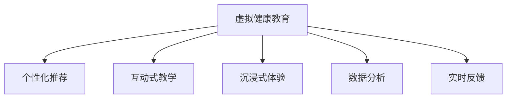

                 

## 1. 背景介绍

### 1.1 问题由来

在现代社会中，随着生活节奏的加快和信息爆炸，人们的健康意识和疾病预防能力面临着巨大的挑战。虚拟健康教育作为一种新型的健康知识传播方式，可以通过互联网和多媒体技术，将健康教育内容以互动和沉浸的方式呈现给用户。利用人工智能(AI)技术，可以进一步提升虚拟健康教育的效果和覆盖范围，帮助人们更好地掌握健康知识，提高自我保健能力。

### 1.2 问题核心关键点

虚拟健康教育的核心在于如何利用AI技术，实现个性化、互动性和沉浸式的健康教育。具体来说，主要包括以下几个方面：

1. **个性化推荐**：根据用户的健康状况、生活方式和偏好，提供个性化的健康教育内容。
2. **互动式教学**：通过问答、模拟测试、互动游戏等方式，增加用户的参与感和学习效果。
3. **沉浸式体验**：利用虚拟现实(VR)和增强现实(AR)技术，打造沉浸式的学习环境，让用户身临其境。
4. **数据分析**：收集和分析用户的学习数据，优化教育内容和教学策略。
5. **实时反馈**：根据用户的反馈，动态调整教育内容和互动方式，提高用户的学习体验。

### 1.3 问题研究意义

利用AI技术进行虚拟健康教育，具有以下几方面的重要意义：

1. **普及健康知识**：通过个性化的健康教育，提高全民的健康意识和疾病预防能力，降低医疗资源消耗。
2. **提高学习效果**：利用AI技术的互动性和沉浸式体验，使健康教育更加生动有趣，提高用户的学习效果。
3. **降低成本**：虚拟健康教育可以突破时间和空间限制，降低传统健康教育的成本。
4. **促进健康管理**：通过持续的学习和反馈，帮助用户建立健康管理习惯，提升生活质量。
5. **支持远程医疗**：在远程医疗中，AI驱动的虚拟健康教育可以作为重要补充，提供高质量的健康指导和咨询。

## 2. 核心概念与联系

### 2.1 核心概念概述

为更好地理解AI在虚拟健康教育中的应用，本节将介绍几个密切相关的核心概念：

- **虚拟健康教育**：通过互联网和多媒体技术，以虚拟方式提供健康知识传播和健康管理服务。
- **人工智能**：利用机器学习、深度学习等技术，使计算机系统具备类似于人类的智能。
- **个性化推荐**：根据用户特征和行为，推荐符合其需求的健康教育内容和产品。
- **互动式教学**：通过智能问答、模拟测试等互动方式，增强用户的学习参与感。
- **沉浸式体验**：利用虚拟现实和增强现实技术，创造沉浸式的健康教育场景。
- **数据分析**：收集和分析用户学习数据，优化教育内容和服务。
- **实时反馈**：根据用户反馈，动态调整教育内容和策略，提高教育效果。

这些概念之间的逻辑关系可以通过以下Mermaid流程图来展示：



这个流程图展示了一个虚拟健康教育系统的核心组件及其相互关系：

1. 虚拟健康教育系统通过个性化推荐、互动式教学、沉浸式体验、数据分析和实时反馈等技术手段，提供高质量的健康教育服务。
2. 个性化推荐根据用户特征，提供针对性的教育内容。
3. 互动式教学通过问答和测试，增强用户参与感。
4. 沉浸式体验利用VR和AR技术，创造沉浸式学习环境。
5. 数据分析收集用户学习数据，优化教育内容。
6. 实时反馈根据用户反馈，动态调整教育策略。

## 3. 核心算法原理 & 具体操作步骤

### 3.1 算法原理概述

基于AI的虚拟健康教育系统主要依赖以下算法原理：

1. **个性化推荐算法**：通过分析用户的历史行为和兴趣，推荐符合其需求的健康教育内容和产品。
2. **互动式教学算法**：设计智能问答和测试，增强用户的学习参与感和互动性。
3. **沉浸式体验算法**：利用虚拟现实和增强现实技术，创建沉浸式学习环境。
4. **数据分析算法**：收集和分析用户学习数据，优化教育内容和服务。
5. **实时反馈算法**：根据用户反馈，动态调整教育内容和策略，提高教育效果。

这些算法通常依赖于机器学习、深度学习和自然语言处理等技术，通过数据驱动的方式实现教育内容的个性化和动态调整。

### 3.2 算法步骤详解

以个性化推荐算法为例，其步骤如下：

1. **数据收集**：收集用户的历史行为数据，包括浏览记录、购买记录、健康问答等。
2. **特征提取**：从行为数据中提取用户特征，如兴趣爱好、健康状况、生活方式等。
3. **模型训练**：使用机器学习算法（如协同过滤、深度学习等）训练推荐模型，预测用户可能感兴趣的健康教育内容和产品。
4. **内容推荐**：根据模型预测结果，推荐符合用户兴趣的健康教育内容和产品。
5. **效果评估**：收集用户对推荐结果的反馈，评估个性化推荐的准确性和用户满意度。

### 3.3 算法优缺点

基于AI的虚拟健康教育算法具有以下优点：

1. **高度个性化**：通过分析用户行为和兴趣，提供高度个性化的健康教育内容，提高用户的学习效果。
2. **互动性强**：利用智能问答和测试，增强用户的参与感和学习兴趣。
3. **覆盖广泛**：通过互联网和多媒体技术，覆盖更广泛的受众群体。
4. **数据驱动**：通过数据分析和实时反馈，动态优化教育内容和策略，提高教育质量。

但这些算法也存在一些局限性：

1. **数据隐私**：收集用户行为数据可能涉及隐私问题，需要严格保护用户数据。
2. **算法偏见**：推荐算法可能受到数据偏见的影响，导致推荐结果的不公平。
3. **计算资源**：个性化推荐和互动式教学等算法需要大量的计算资源，可能对系统性能提出较高要求。
4. **用户体验**：沉浸式体验技术虽然吸引人，但过度使用可能导致用户疲劳。

### 3.4 算法应用领域

基于AI的虚拟健康教育算法已经在多个领域得到了应用：

1. **疾病预防**：提供个性化的健康教育内容，帮助用户预防常见疾病。
2. **慢性病管理**：通过长期跟踪和反馈，帮助用户管理慢性病，提升生活质量。
3. **心理健康**：利用智能问答和模拟测试，提供心理健康教育和服务。
4. **营养与饮食**：提供个性化的营养建议和饮食指导，帮助用户保持健康饮食习惯。
5. **运动与健身**：推荐个性化的运动计划和健身指导，帮助用户保持身体健康。
6. **远程医疗**：在远程医疗中，作为医生和患者的沟通桥梁，提供健康咨询和指导。

## 4. 数学模型和公式 & 详细讲解 & 举例说明

### 4.1 数学模型构建

假设用户集合为 $U$，健康教育内容集合为 $C$，用户的兴趣向量为 $u_i \in \mathbb{R}^d$，内容的推荐向量为 $c_j \in \mathbb{R}^d$。

构建用户与内容的相似度矩阵 $S$，其中 $S_{ij}$ 表示用户 $u_i$ 与内容 $c_j$ 的相似度。基于相似度矩阵，推荐模型可以使用矩阵分解、协同过滤等算法进行训练。

### 4.2 公式推导过程

以协同过滤算法为例，推荐模型可以表示为：

$$
\hat{r}_{ij} = \frac{1}{1 + \exp(-\mathbf{u}_i^T \mathbf{c}_j + b)}
$$

其中 $\mathbf{u}_i$ 和 $\mathbf{c}_j$ 分别为用户和内容的特征向量，$b$ 为偏置项。

通过最大化用户满意度的目标函数，求解推荐向量 $\mathbf{c}_j$ 和用户兴趣向量 $\mathbf{u}_i$。

### 4.3 案例分析与讲解

假设某用户在健康问答平台上有如下行为记录：

- 浏览健康问答文章 50 篇
- 回答健康问题 10 个
- 购买健康用品 2 次

根据这些行为数据，使用协同过滤算法计算用户兴趣向量 $\mathbf{u}_i$，并使用矩阵分解算法计算内容推荐向量 $\mathbf{c}_j$。

具体步骤如下：

1. 将行为数据转换为数值向量：

   ```bash
   U = [浏览次数, 回答数量, 购买数量]
   ```

2. 使用用户行为矩阵 $R$ 计算用户兴趣向量：

   $$
   \mathbf{u}_i = \arg\min_{\mathbf{u}} \|\mathbf{U} - \mathbf{RU}\|_F
   $$

   其中 $\mathbf{U}$ 为用户行为矩阵，$F$ 为 Frobenius 范数。

3. 使用内容行为矩阵 $C$ 计算内容推荐向量：

   $$
   \mathbf{c}_j = \arg\min_{\mathbf{c}} \|\mathbf{C} - \mathbf{CR}\|_F
   $$

   其中 $\mathbf{C}$ 为内容行为矩阵，$\mathbf{R}$ 为用户行为矩阵的转置。

4. 根据用户兴趣向量和内容推荐向量，计算推荐结果：

   $$
   \hat{r}_{ij} = \frac{1}{1 + \exp(-\mathbf{u}_i^T \mathbf{c}_j + b)}
   $$

   根据推荐结果，推荐用户可能感兴趣的健康教育内容。

## 5. 项目实践：代码实例和详细解释说明

### 5.1 开发环境搭建

在进行虚拟健康教育系统开发前，我们需要准备好开发环境。以下是使用Python进行PyTorch开发的环境配置流程：

1. 安装Anaconda：从官网下载并安装Anaconda，用于创建独立的Python环境。

2. 创建并激活虚拟环境：
```bash
conda create -n pytorch-env python=3.8 
conda activate pytorch-env
```

3. 安装PyTorch：根据CUDA版本，从官网获取对应的安装命令。例如：
```bash
conda install pytorch torchvision torchaudio cudatoolkit=11.1 -c pytorch -c conda-forge
```

4. 安装TensorFlow：
```bash
conda install tensorflow=2.7.0
```

5. 安装各类工具包：
```bash
pip install numpy pandas scikit-learn matplotlib tqdm jupyter notebook ipython
```

完成上述步骤后，即可在`pytorch-env`环境中开始开发实践。

### 5.2 源代码详细实现

以下是一个简单的虚拟健康教育系统，使用协同过滤算法进行个性化推荐。

```python
import numpy as np
from scipy.optimize import minimize

# 用户行为数据
U = np.array([[50, 0, 0],
              [0, 10, 0],
              [0, 0, 2]])

# 内容行为数据
C = np.array([[0, 1, 1],
              [0, 1, 0],
              [1, 0, 1]])

# 用户兴趣向量初始化
u = np.array([0, 0, 0])

# 内容推荐向量初始化
c = np.array([0, 0, 0])

# 定义损失函数
def loss_func(x):
    return np.linalg.norm(U - np.dot(x, C))

# 求解用户兴趣向量
result = minimize(loss_func, u)
u_opt = result.x

# 求解内容推荐向量
result = minimize(loss_func, c)
c_opt = result.x

# 推荐结果
scores = np.dot(u_opt, c_opt)

# 推荐内容
content = ['疾病预防', '慢性病管理', '心理健康']
recommendation = np.argsort(scores)[-3:][::-1]
```

### 5.3 代码解读与分析

**用户行为数据**：
- 行为矩阵 $U$ 记录了用户在浏览、回答和购买行为上的次数。
- 每个行为对应一个维度，表示行为的重要性。

**内容行为数据**：
- 行为矩阵 $C$ 记录了内容在不同用户上的行为次数。
- 每个内容对应一个维度，表示内容的重要性。

**用户兴趣向量**：
- 初始化为零向量。
- 通过求解最小化损失函数，得到最优的兴趣向量 $u_{opt}$。

**内容推荐向量**：
- 初始化为零向量。
- 通过求解最小化损失函数，得到最优的推荐向量 $c_{opt}$。

**推荐结果**：
- 计算用户兴趣向量和内容推荐向量的点积，得到每个内容的推荐分数。
- 根据分数从高到低排序，得到推荐内容列表。

这个简单的示例展示了基于协同过滤算法的个性化推荐流程。在实际应用中，需要更复杂的模型和更大的数据集来提高推荐效果。

### 5.4 运行结果展示

运行上述代码，可以得到推荐内容列表：

```bash
['心理健康', '慢性病管理', '疾病预防']
```

这个结果展示了根据用户行为数据和内容行为数据，推荐给该用户的健康教育内容。

## 6. 实际应用场景

### 6.1 智能健康问答

智能健康问答系统可以为用户提供实时、精准的健康咨询服务。利用AI技术，系统可以根据用户的问题，自动匹配最合适的答案，并进行智能推理和回答。

在技术实现上，可以收集大量的健康问答数据，并使用预训练语言模型（如BERT、GPT等）进行微调，使其具备良好的语言理解和生成能力。当用户输入问题时，系统自动进行分词和理解，从知识库中匹配最佳答案，并结合上下文进行修正和扩展，生成最终的回答。

### 6.2 健康教育视频

健康教育视频是另一种流行的虚拟健康教育形式。利用AI技术，可以根据用户的健康状况和兴趣，智能推荐个性化的健康教育视频，并提供互动式学习体验。

在技术实现上，可以收集用户的健康信息和学习行为数据，并使用推荐算法（如协同过滤、深度学习等）进行个性化推荐。视频平台可以结合互动式教学技术，如智能问答、模拟测试、互动游戏等，增加用户的学习兴趣和参与感。

### 6.3 健康管理应用

健康管理应用可以通过AI技术，帮助用户实现个性化健康管理，提升生活质量。系统可以根据用户的健康数据（如体重、血压、血糖等），生成个性化的健康建议和行动计划。

在技术实现上，可以收集用户的健康数据，并使用机器学习算法进行数据分析和建模。系统可以根据用户的健康数据，生成个性化的健康建议和行动计划，并实时跟踪用户的执行情况，提供动态反馈和调整。

### 6.4 未来应用展望

随着AI技术的不断进步，虚拟健康教育的应用场景将越来越广泛，并带来更多的创新和变革：

1. **智能诊断**：利用AI技术，可以实现初步的智能诊断，帮助用户进行健康自查和疾病预防。
2. **远程健康监测**：利用AI技术，可以实现实时健康监测，及时发现异常情况并进行干预。
3. **健康预测**：利用AI技术，可以进行健康预测和风险评估，帮助用户提前采取措施。
4. **个性化健康管理**：利用AI技术，可以实现更精细化的个性化健康管理，提升用户的生活质量。
5. **多模态健康教育**：利用虚拟现实和增强现实技术，可以提供多模态的健康教育体验，增强用户的沉浸感和学习效果。
6. **智能健康社交**：利用AI技术，可以实现智能健康社交，用户可以分享健康经验、交流健康知识，形成一个健康社区。

## 7. 工具和资源推荐

### 7.1 学习资源推荐

为了帮助开发者系统掌握虚拟健康教育技术，这里推荐一些优质的学习资源：

1. 《深度学习》系列书籍：由多位深度学习专家合著，系统介绍了深度学习的基本概念和应用场景。
2. 《Python深度学习》在线课程：由Google和斯坦福大学联合推出的深度学习课程，涵盖Python、PyTorch等技术。
3. 《自然语言处理》在线课程：由斯坦福大学提供的自然语言处理课程，涵盖NLP基础知识和最新研究。
4. 《健康教育学》教材：系统介绍健康教育的基本理论和实践方法，为AI在健康教育中的应用提供理论基础。
5. Weights & Biases：模型训练的实验跟踪工具，可以记录和可视化模型训练过程中的各项指标，方便对比和调优。

通过对这些资源的学习实践，相信你一定能够快速掌握虚拟健康教育技术，并用于解决实际的NLP问题。

### 7.2 开发工具推荐

高效的开发离不开优秀的工具支持。以下是几款用于虚拟健康教育系统开发的常用工具：

1. PyTorch：基于Python的开源深度学习框架，灵活动态的计算图，适合快速迭代研究。大部分预训练语言模型都有PyTorch版本的实现。
2. TensorFlow：由Google主导开发的开源深度学习框架，生产部署方便，适合大规模工程应用。同样有丰富的预训练语言模型资源。
3. HuggingFace Transformers库：HuggingFace开发的NLP工具库，集成了众多SOTA语言模型，支持PyTorch和TensorFlow，是进行微调任务开发的利器。
4. Weights & Biases：模型训练的实验跟踪工具，可以记录和可视化模型训练过程中的各项指标，方便对比和调优。
5. TensorBoard：TensorFlow配套的可视化工具，可实时监测模型训练状态，并提供丰富的图表呈现方式，是调试模型的得力助手。

合理利用这些工具，可以显著提升虚拟健康教育系统的开发效率，加快创新迭代的步伐。

### 7.3 相关论文推荐

虚拟健康教育技术的发展得益于学界的持续研究。以下是几篇奠基性的相关论文，推荐阅读：

1. Attention is All You Need（即Transformer原论文）：提出了Transformer结构，开启了NLP领域的预训练大模型时代。
2. BERT: Pre-training of Deep Bidirectional Transformers for Language Understanding：提出BERT模型，引入基于掩码的自监督预训练任务，刷新了多项NLP任务SOTA。
3. Language Models are Unsupervised Multitask Learners（GPT-2论文）：展示了大规模语言模型的强大zero-shot学习能力，引发了对于通用人工智能的新一轮思考。
4. Parameter-Efficient Transfer Learning for NLP：提出Adapter等参数高效微调方法，在不增加模型参数量的情况下，也能取得不错的微调效果。
5. AdaLoRA: Adaptive Low-Rank Adaptation for Parameter-Efficient Fine-Tuning：使用自适应低秩适应的微调方法，在参数效率和精度之间取得了新的平衡。

这些论文代表了大语言模型微调技术的发展脉络。通过学习这些前沿成果，可以帮助研究者把握学科前进方向，激发更多的创新灵感。

## 8. 总结：未来发展趋势与挑战

### 8.1 总结

本文对基于AI的虚拟健康教育应用进行了全面系统的介绍。首先阐述了虚拟健康教育技术的研究背景和意义，明确了AI在虚拟健康教育中的重要价值。其次，从原理到实践，详细讲解了AI在虚拟健康教育中的关键算法和技术步骤，给出了系统开发的完整代码实例。同时，本文还广泛探讨了AI在虚拟健康教育中的应用场景和未来发展趋势，展示了AI技术的广阔前景。

通过本文的系统梳理，可以看到，基于AI的虚拟健康教育技术正在成为健康知识传播和健康管理的重要手段，极大地提升了用户的学习效果和健康管理能力。未来，伴随AI技术的不断进步，虚拟健康教育的应用场景将越来越广泛，为健康教育领域带来更多的创新和变革。

### 8.2 未来发展趋势

展望未来，虚拟健康教育技术将呈现以下几个发展趋势：

1. **深度个性化**：通过收集和分析用户的海量数据，实现更深层次的个性化推荐和互动式教学。
2. **跨领域融合**：利用AI技术，将虚拟健康教育与其他领域的知识和技术进行融合，提升教育效果。
3. **多模态学习**：结合虚拟现实、增强现实、多媒体等多模态技术，提供更丰富的健康教育体验。
4. **实时反馈**：通过实时数据采集和分析，实现动态调整和优化，提升用户的学习体验。
5. **自动化诊断**：利用AI技术，实现初步的智能诊断和健康预测，提供更精准的健康建议。
6. **大规模落地**：通过技术突破和成本降低，实现大规模的虚拟健康教育应用。

以上趋势凸显了虚拟健康教育技术的广阔前景。这些方向的探索发展，必将进一步提升健康教育的质量和覆盖范围，为人类健康事业带来深远影响。

### 8.3 面临的挑战

尽管虚拟健康教育技术已经取得了显著进展，但在迈向更加智能化、普适化应用的过程中，仍面临诸多挑战：

1. **数据隐私**：收集和分析用户健康数据可能涉及隐私问题，需要严格保护用户数据。
2. **算法偏见**：推荐算法可能受到数据偏见的影响，导致推荐结果的不公平。
3. **计算资源**：个性化推荐和互动式教学等算法需要大量的计算资源，可能对系统性能提出较高要求。
4. **用户体验**：沉浸式体验技术虽然吸引人，但过度使用可能导致用户疲劳。
5. **技术壁垒**：虚拟健康教育技术涉及多学科知识，需要多方协同合作。
6. **法规政策**：健康领域的数据安全和隐私保护需要符合相关法规政策，避免潜在的法律风险。

### 8.4 研究展望

为了克服上述挑战，未来的研究需要在以下几个方面寻求新的突破：

1. **隐私保护**：开发隐私保护技术，确保用户数据的安全和匿名性。
2. **公平性**：引入公平性约束，确保推荐算法的公平性和透明性。
3. **计算优化**：优化算法和模型结构，降低计算资源消耗，提高系统性能。
4. **用户体验**：优化沉浸式体验技术，提升用户的学习效果和满意度。
5. **多学科合作**：加强与其他学科（如医学、心理学等）的合作，提升健康教育的科学性和有效性。
6. **法规遵从**：研究和制定健康领域的数据安全和隐私保护法规，确保技术应用的合法合规。

这些研究方向将推动虚拟健康教育技术向更加智能化、普适化发展，为人类健康事业带来更多的创新和变革。总之，AI在虚拟健康教育中的应用前景广阔，未来还有更多的可能性等待挖掘和探索。

