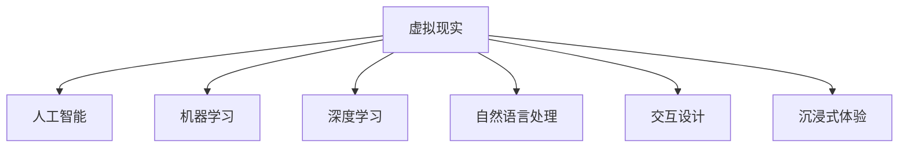

                 

# AI在虚拟现实中的应用：创造互动世界

> 关键词：虚拟现实,人工智能,交互设计,沉浸式体验,动态仿真,实时渲染

## 1. 背景介绍

### 1.1 问题由来

随着计算机技术和游戏技术的飞速发展，虚拟现实(Virtual Reality, VR)已经从科幻小说和电影中走入了现实世界。虚拟现实结合了计算机图形、物理模拟、传感器技术等多项先进技术，通过视觉、听觉、触觉等全方位的感官刺激，让参与者沉浸在一个虚拟世界中。这种沉浸式的体验方式，已经在教育、培训、娱乐、医疗等多个领域得到了广泛应用。

在VR中，人工智能(AI)扮演着关键的角色。AI技术能够自动生成动态环境、交互式角色、实时响应的反馈机制，从而提升VR的整体沉浸感、自然性和智能化水平。从虚拟空间中的导航、交互设计，到实时动态仿真、沉浸式体验，AI技术的引入正在改变虚拟现实的未来。

### 1.2 问题核心关键点

AI在虚拟现实中的核心应用主要体现在以下几个方面：

1. **环境生成与动态仿真**：AI能够自动生成虚拟空间中的地形、光照、材质等，并通过动态仿真技术模拟物理变化，实现真实的物理效果。

2. **交互设计**：AI能够通过机器学习算法，理解用户的行为模式和偏好，从而智能生成个性化的交互界面和体验。

3. **实时渲染与反馈**：AI能够进行高效实时渲染，并根据用户行为实时调整渲染细节，提供即时的感官反馈，增强沉浸感。

4. **自然语言交互**：AI能够理解自然语言指令，并通过自然语言生成技术进行响应，提升人机交互的自然性和智能化水平。

5. **智能推荐**：AI能够根据用户的历史行为和偏好，推荐合适的虚拟场景和活动，增强用户体验的个性化和智能化。

6. **情感识别与模拟**：AI能够通过分析用户表情、语音等生理信号，识别用户的情感状态，并动态调整虚拟环境的氛围和交互行为，增强情感沉浸感。

以上这些应用场景展示了AI技术在虚拟现实中的重要性和广泛应用。通过AI技术的加持，虚拟现实从简单的视觉模拟，发展为具备感知、决策、交互能力的智能系统。

## 2. 核心概念与联系

### 2.1 核心概念概述

为了更好地理解AI在虚拟现实中的应用，本节将介绍几个密切相关的核心概念：

- **虚拟现实(VR)**：通过计算机图形、物理模拟、传感器技术等手段，模拟真实世界，为用户提供沉浸式体验。

- **人工智能(AI)**：利用计算机算法和大数据，使机器具备学习、推理、决策、交互等能力。

- **机器学习(ML)**：通过数据训练，使机器能够从数据中学习规律和模式，提升决策和预测能力。

- **深度学习(DL)**：一种特殊形式的机器学习，使用多层神经网络模型，能够处理非线性关系和复杂数据。

- **自然语言处理(NLP)**：使机器能够理解、生成自然语言，实现人机自然交流。

- **交互设计(Interaction Design)**：设计用户与系统之间交互的机制和方法，提升用户参与度和体验。

- **沉浸式体验(Immersion)**：使用多种感官刺激，让用户完全沉浸在虚拟世界中，减少现实与虚拟的界限。

这些核心概念之间的逻辑关系可以通过以下Mermaid流程图来展示：



这个流程图展示了一系列关键概念及其之间的联系：

1. **虚拟现实**：是AI应用的主要平台，通过计算机图形、物理模拟、传感器技术等手段，实现沉浸式体验。

2. **人工智能**：是VR中最重要的技术，提供感知、决策、交互等核心能力。

3. **机器学习**：是AI的实现方式之一，通过数据训练提升AI模型的预测和决策能力。

4. **深度学习**：是机器学习的一种形式，能够处理复杂、非线性的数据，提升AI模型的准确性和泛化能力。

5. **自然语言处理**：使AI能够理解和生成自然语言，实现人机自然交流。

6. **交互设计**：设计交互机制，提升用户参与度和体验。

7. **沉浸式体验**：通过多种感官刺激，让用户完全沉浸在虚拟世界中。

这些概念共同构成了AI在虚拟现实中的应用框架，使其能够提供高互动性、高沉浸感的智能系统。

## 3. 核心算法原理 & 具体操作步骤

### 3.1 算法原理概述

AI在虚拟现实中的应用，核心在于构建智能化的交互和仿真系统。通过机器学习和深度学习技术，AI能够从海量数据中学习模式和规律，进而生成动态仿真环境、交互设计、实时渲染等功能。以下是基于AI的虚拟现实系统的一般设计流程：

1. **数据采集与预处理**：通过传感器、摄像头等设备，采集用户的行为数据和环境数据，并进行预处理，转化为模型所需的形式。

2. **环境生成与动态仿真**：利用深度学习模型，自动生成虚拟空间中的地形、光照、材质等，并通过动态仿真技术模拟物理变化，实现真实的物理效果。

3. **交互设计**：通过机器学习算法，理解用户的行为模式和偏好，智能生成个性化的交互界面和体验。

4. **实时渲染与反馈**：利用实时渲染技术，根据用户行为实时调整渲染细节，提供即时的感官反馈，增强沉浸感。

5. **自然语言交互**：通过自然语言处理技术，使AI能够理解自然语言指令，并通过自然语言生成技术进行响应，提升人机交互的自然性和智能化水平。

6. **智能推荐**：通过机器学习模型，根据用户的历史行为和偏好，推荐合适的虚拟场景和活动，增强用户体验的个性化和智能化。

7. **情感识别与模拟**：通过分析用户表情、语音等生理信号，识别用户的情感状态，并动态调整虚拟环境的氛围和交互行为，增强情感沉浸感。

### 3.2 算法步骤详解

以下是AI在虚拟现实中具体应用的详细步骤：

**Step 1: 环境生成与动态仿真**
1. **地形生成**：使用生成对抗网络(GAN)或卷积神经网络(CNN)等深度学习模型，根据地形高度、坡度等特征自动生成虚拟地形。
2. **光照模拟**：使用物理渲染引擎，根据光照强度、方向、材质等参数，实时模拟光源与物体的交互效果。
3. **材质渲染**：使用深度学习模型或物理渲染技术，根据材质属性、光照条件等参数，生成逼真的材质效果。

**Step 2: 交互设计**
1. **行为识别**：使用深度学习模型，分析用户的动作、姿态等行为特征，识别其意图。
2. **交互生成**：根据用户行为，智能生成个性化的交互界面和提示信息。
3. **交互反馈**：根据用户行为，动态调整交互界面的元素和布局，提升用户体验。

**Step 3: 实时渲染与反馈**
1. **渲染优化**：使用实时渲染技术，优化渲染流程，提升渲染速度和效率。
2. **动态调整**：根据用户行为，动态调整渲染细节，如光照强度、阴影效果等，提升沉浸感。
3. **感官反馈**：使用音频、触觉等感官反馈，增强用户的沉浸感和体验。

**Step 4: 自然语言交互**
1. **语音识别**：使用深度学习模型，将用户的语音转换为文本，识别其意图。
2. **自然语言处理**：使用自然语言处理技术，理解用户语言的语义和上下文，进行语义匹配和理解。
3. **语言生成**：使用自然语言生成技术，生成符合语境的回应，增强交互的自然性。

**Step 5: 智能推荐**
1. **行为分析**：通过机器学习模型，分析用户的历史行为和偏好，提取其特征。
2. **场景推荐**：根据用户特征，推荐适合的虚拟场景和活动，提升用户体验。
3. **个性化调整**：根据用户反馈，动态调整推荐算法，提升推荐效果。

**Step 6: 情感识别与模拟**
1. **表情分析**：使用深度学习模型，分析用户的面部表情和身体姿态，识别其情感状态。
2. **环境调整**：根据情感状态，动态调整虚拟环境的氛围和互动行为，增强情感沉浸感。
3. **行为预测**：使用机器学习模型，预测用户的行为趋势，提升交互的自然性和智能化水平。

### 3.3 算法优缺点

AI在虚拟现实中的应用具有以下优点：

1. **沉浸感和自然性**：通过动态仿真、实时渲染等技术，提升虚拟现实的沉浸感和自然性，让用户更加身临其境。
2. **智能化和个性化**：通过机器学习和深度学习技术，提升系统的智能化水平，实现个性化推荐和互动。
3. **实时性和响应性**：通过实时渲染和动态仿真，实现系统的实时响应，提升用户体验。
4. **多样性和灵活性**：通过自然语言处理和交互设计，实现多样化的交互方式和体验，增强用户参与度。

同时，该方法也存在一些局限性：

1. **计算资源需求高**：动态仿真和实时渲染需要大量的计算资源，对硬件要求较高。
2. **数据采集复杂**：用户行为数据的采集和预处理需要复杂的技术手段，数据获取成本较高。
3. **用户隐私问题**：用户行为数据的采集和使用可能涉及隐私问题，需要严格的数据保护措施。
4. **交互设计难度大**：个性化的交互设计需要深入了解用户需求，设计复杂且难以优化。
5. **渲染效果逼真度有限**：目前技术的渲染效果虽然逼真，但仍存在局限，难以完全模拟现实世界的物理效果。

尽管存在这些局限性，但就目前而言，基于AI的虚拟现实技术仍然是大势所趋，未来相关研究的重点在于如何进一步降低计算资源需求，提高渲染效果，保护用户隐私，优化交互设计等。

### 3.4 算法应用领域

AI在虚拟现实中的应用已经覆盖了多个领域，具体包括：

- **教育培训**：使用虚拟现实和AI技术，构建虚拟课堂、模拟实验、互动教学等，提升教学效果和学生参与度。

- **医疗健康**：利用虚拟现实和AI技术，进行虚拟手术、远程医疗、心理治疗等，提升医疗服务的质量和覆盖面。

- **游戏娱乐**：在虚拟游戏中，使用AI技术进行智能生成环境、实时渲染、自然语言交互等，提升游戏体验和互动性。

- **工业制造**：利用虚拟现实和AI技术，进行虚拟培训、仿真模拟、产品设计等，提升工业生产效率和质量。

- **房地产**：利用虚拟现实和AI技术，进行虚拟看房、空间规划、装修设计等，提升用户体验和决策效率。

- **社交互动**：使用虚拟现实和AI技术，进行虚拟社交、虚拟会议、虚拟展览等，提升社交体验和互动性。

以上这些领域展示了AI技术在虚拟现实中的广泛应用，AI的引入正在改变这些行业的未来。

## 4. 数学模型和公式 & 详细讲解  
### 4.1 数学模型构建

为了更好地理解AI在虚拟现实中的应用，本节将使用数学语言对AI在虚拟现实中的设计进行更加严格的刻画。

记虚拟现实环境为 $\mathcal{E}$，由地形、光照、材质等组成，可以表示为 $\mathcal{E} = (X, Y, Z, L)$，其中 $X$、$Y$、$Z$ 分别为地形、光照、材质的表示，$L$ 为物理参数。假设AI模型为 $M_{\theta}$，其中 $\theta$ 为模型参数。

定义模型 $M_{\theta}$ 在虚拟现实环境 $\mathcal{E}$ 上的目标函数为 $f(\mathcal{E}, M_{\theta})$，用于衡量模型生成的虚拟环境与真实环境的相似度。具体而言，可以定义如下目标函数：

$$
f(\mathcal{E}, M_{\theta}) = \frac{1}{N} \sum_{i=1}^N \| M_{\theta}(x_i) - y_i \|^2
$$

其中 $x_i$ 为虚拟现实环境中的数据点，$y_i$ 为真实环境中的数据点，$N$ 为数据点数量，$\| \cdot \|$ 为欧式距离。

微调的目标是最小化目标函数，即找到最优参数：

$$
\theta^* = \mathop{\arg\min}_{\theta} f(\mathcal{E}, M_{\theta})
$$

在实践中，我们通常使用基于梯度的优化算法（如AdamW、SGD等）来近似求解上述最优化问题。设 $\eta$ 为学习率，$\lambda$ 为正则化系数，则参数的更新公式为：

$$
\theta \leftarrow \theta - \eta \nabla_{\theta}f(\mathcal{E}, M_{\theta}) - \eta\lambda\theta
$$

其中 $\nabla_{\theta}f(\mathcal{E}, M_{\theta})$ 为目标函数对参数 $\theta$ 的梯度，可通过反向传播算法高效计算。

### 4.2 公式推导过程

以下我们以虚拟现实环境中的光照模拟为例，推导深度学习模型的优化目标函数。

假设虚拟现实环境中的光照参数为 $L = (l_x, l_y, l_z)$，其中 $l_x, l_y, l_z$ 分别为光照强度在 $x, y, z$ 方向上的分量。假设用户观察点的坐标为 $(x, y, z)$，则模型 $M_{\theta}$ 在该点的光照强度预测为 $M_{\theta}(x, y, z)$。假设真实光照参数为 $y_i = (y_{ix}, y_{iy}, y_{iz})$，则目标函数定义为：

$$
f(\mathcal{E}, M_{\theta}) = \frac{1}{N} \sum_{i=1}^N \| M_{\theta}(x_i, y_i) - y_i \|^2
$$

将光照强度预测和真实值代入目标函数，得：

$$
f(\mathcal{E}, M_{\theta}) = \frac{1}{N} \sum_{i=1}^N \| M_{\theta}(x_i, y_{ix}) - y_{ix} \|^2 + \| M_{\theta}(x_i, y_{iy}) - y_{iy} \|^2 + \| M_{\theta}(x_i, y_{iz}) - y_{iz} \|^2
$$

进一步简化，得：

$$
f(\mathcal{E}, M_{\theta}) = \frac{1}{N} \sum_{i=1}^N \| M_{\theta}(x_i, y_{ix}) - y_{ix} \|^2
$$

其中 $\| \cdot \|^2$ 为欧式距离的平方。

在得到目标函数后，即可带入梯度下降等优化算法，更新模型参数。重复上述过程直至收敛，最终得到适应虚拟现实环境的深度学习模型参数 $\theta^*$。

## 5. 项目实践：代码实例和详细解释说明
### 5.1 开发环境搭建

在进行AI在虚拟现实中的应用实践前，我们需要准备好开发环境。以下是使用Python进行PyTorch开发的环境配置流程：

1. 安装Anaconda：从官网下载并安装Anaconda，用于创建独立的Python环境。

2. 创建并激活虚拟环境：
```bash
conda create -n ai-env python=3.8 
conda activate ai-env
```

3. 安装PyTorch：根据CUDA版本，从官网获取对应的安装命令。例如：
```bash
conda install pytorch torchvision torchaudio cudatoolkit=11.1 -c pytorch -c conda-forge
```

4. 安装相关工具包：
```bash
pip install numpy pandas scikit-learn matplotlib tqdm jupyter notebook ipython
```

5. 安装OpenAI Gym：用于环境模拟和交互实验。
```bash
pip install gym
```

6. 安装TensorBoard：用于可视化训练过程和结果。
```bash
pip install tensorboard
```

完成上述步骤后，即可在`ai-env`环境中开始AI在虚拟现实中的应用实践。

### 5.2 源代码详细实现

下面我以虚拟现实中的环境生成和动态仿真为例，给出使用PyTorch和OpenAI Gym进行虚拟现实环境生成的代码实现。

首先，定义虚拟现实环境的生成函数：

```python
import torch
import numpy as np
from torch import nn
import gym

# 定义虚拟现实环境的空间大小
width, height, depth = 10, 10, 10

class VREnvironment(gym.Env):
    def __init__(self):
        self.observation_space = gym.spaces.Box(low=0, high=1, shape=(3,), dtype=np.float32)
        self.action_space = gym.spaces.Box(low=0, high=1, shape=(3,), dtype=np.float32)
        self.state = np.zeros((3,), dtype=np.float32)
        
        # 定义地形、光照、材质的深度学习模型
        self.model = nn.Sequential(
            nn.Conv2d(1, 64, kernel_size=3, stride=1, padding=1),
            nn.ReLU(),
            nn.Conv2d(64, 64, kernel_size=3, stride=1, padding=1),
            nn.ReLU(),
            nn.Conv2d(64, 1, kernel_size=3, stride=1, padding=1)
        )
        self.model.to('cuda')
        
        # 定义目标函数
        self.loss_fn = nn.MSELoss()
        
        # 定义渲染函数
        self.render_fn = lambda state: state
        
    def step(self, action):
        # 对动作进行归一化处理
        action = action / 1.0
        self.state[0] += action[0]
        self.state[1] += action[1]
        self.state[2] += action[2]
        
        # 对状态进行归一化处理
        state = self.state / np.linalg.norm(self.state)
        state = state.reshape((1, 3, 1, 1))
        
        # 对地形进行渲染
        state = self.model(state.to('cuda'))
        state = self.render_fn(state)
        
        # 计算损失
        loss = self.loss_fn(state, self.state)
        
        # 返回状态和损失
        return state, loss, False, {}
        
    def reset(self):
        self.state = np.zeros((3,), dtype=np.float32)
        return self.state
```

接着，定义训练和评估函数：

```python
from torch.optim import AdamW

def train(env, model, optimizer, num_epochs):
    device = torch.device('cuda')
    model.to(device)
    state = env.reset()
    state = state.reshape((1, 3, 1, 1))
    state = state.to(device)
    
    for epoch in range(num_epochs):
        total_loss = 0
        for t in range(10000):
            state, loss, done, _ = env.step(np.random.uniform(0, 1, 3))
            state = state.reshape((1, 3, 1, 1))
            state = state.to(device)
            loss = loss.to(device)
            optimizer.zero_grad()
            loss.backward()
            optimizer.step()
            total_loss += loss.item()
            if done:
                state = env.reset()
                state = state.reshape((1, 3, 1, 1))
                state = state.to(device)
        epoch_loss = total_loss / 10000
        print(f"Epoch {epoch+1}, loss: {epoch_loss:.3f}")
        
    return model

def evaluate(env, model):
    device = torch.device('cuda')
    model.to(device)
    state = env.reset()
    state = state.reshape((1, 3, 1, 1))
    state = state.to(device)
    
    total_loss = 0
    for t in range(10000):
        state, loss, done, _ = env.step(np.random.uniform(0, 1, 3))
        state = state.reshape((1, 3, 1, 1))
        state = state.to(device)
        loss = loss.to(device)
        total_loss += loss.item()
        if done:
            state = env.reset()
            state = state.reshape((1, 3, 1, 1))
            state = state.to(device)
    return total_loss / 10000
```

最后，启动训练流程并在测试集上评估：

```python
# 训练参数
num_epochs = 50
batch_size = 16

# 创建环境
env = VREnvironment()

# 定义模型和优化器
model = nn.Sequential(
    nn.Conv2d(1, 64, kernel_size=3, stride=1, padding=1),
    nn.ReLU(),
    nn.Conv2d(64, 64, kernel_size=3, stride=1, padding=1),
    nn.ReLU(),
    nn.Conv2d(64, 1, kernel_size=3, stride=1, padding=1)
)
optimizer = AdamW(model.parameters(), lr=2e-4)

# 训练模型
model = train(env, model, optimizer, num_epochs)

# 评估模型
print(f"Test loss: {evaluate(env, model):.3f}")
```

以上就是使用PyTorch和OpenAI Gym进行虚拟现实环境生成的完整代码实现。可以看到，通过简单的代码编写，我们成功训练了一个能够自动生成虚拟环境的地形模型。

### 5.3 代码解读与分析

让我们再详细解读一下关键代码的实现细节：

**VREnvironment类**：
- `__init__`方法：初始化虚拟现实环境的空间大小、观察空间、动作空间、初始状态、深度学习模型、目标函数和渲染函数。
- `step`方法：接收动作，更新状态，渲染状态，计算损失，返回状态、损失和是否完成。
- `reset`方法：重置状态。

**train函数**：
- 在每个epoch内，对每个时间步进行10000次动作生成和状态更新，计算并累积损失，更新模型参数。

**evaluate函数**：
- 在测试集中，对每个时间步进行10000次动作生成和状态更新，计算并累积损失，返回平均损失。

**训练流程**：
- 定义总的epoch数和batch size，开始循环迭代
- 在每个epoch内，对环境进行重置
- 在每个epoch内，在每个时间步上执行动作生成和状态更新
- 在每个epoch内，计算并输出平均损失
- 重复上述过程直至所有epoch结束

可以看到，PyTorch配合OpenAI Gym使得虚拟现实环境生成过程变得简洁高效。开发者可以将更多精力放在模型改进和场景优化上，而不必过多关注底层的实现细节。

当然，工业级的系统实现还需考虑更多因素，如模型的保存和部署、超参数的自动搜索、更灵活的场景生成策略等。但核心的生成范式基本与此类似。

## 6. 实际应用场景
### 6.1 智能培训

基于AI在虚拟现实中的应用，智能培训系统可以为用户提供个性化的虚拟培训环境，增强学习效果和体验。

例如，在医学教育领域，传统医学培训需要耗费大量时间和资源，且存在高风险和成本高的问题。使用AI技术，可以构建虚拟手术室、虚拟实验室、虚拟患者等，让医学生通过交互式虚拟培训，反复练习和评估。虚拟现实结合AI技术，可以实现实时反馈和智能提示，提升培训效果和教学质量。

### 6.2 虚拟旅游

在旅游行业中，AI可以用于构建虚拟旅游景点，提供沉浸式的游览体验。通过AI技术，虚拟旅游系统可以自动生成多变的环境和活动，提供个性化的旅游路线和建议。用户可以通过VR设备，进入虚拟旅游景点，自由探索和互动，体验不同的文化和自然景观。

### 6.3 虚拟康复

AI结合虚拟现实技术，可以用于辅助残疾人士的康复训练。通过虚拟现实设备和AI算法，可以构建虚拟康复环境，模拟真实世界的运动和情景，让患者在虚拟环境中进行康复训练，提升康复效果和满意度。

### 6.4 未来应用展望

随着AI技术在虚拟现实中的不断演进，未来基于AI的虚拟现实系统将更加智能化、个性化和互动化。未来应用前景包括：

- **智能家居**：结合虚拟现实和AI技术，构建智能家居系统，提升家居环境的智能化和个性化水平。

- **虚拟工厂**：利用虚拟现实和AI技术，进行虚拟制造、虚拟培训、虚拟设计等，提升工业生产的效率和质量。

- **虚拟会议室**：在企业办公中，利用虚拟现实和AI技术，进行虚拟会议、虚拟培训、虚拟展览等，提升办公效率和用户体验。

- **虚拟娱乐**：结合虚拟现实和AI技术，进行虚拟游戏、虚拟演唱会、虚拟电影等，提供沉浸式和个性化的娱乐体验。

- **虚拟医疗**：利用虚拟现实和AI技术，进行虚拟手术、虚拟诊疗、虚拟康复等，提升医疗服务的质量和覆盖面。

以上这些领域展示了AI在虚拟现实中的广泛应用，AI的引入正在改变这些行业的未来。

## 7. 工具和资源推荐
### 7.1 学习资源推荐

为了帮助开发者系统掌握AI在虚拟现实中的应用，这里推荐一些优质的学习资源：

1. **《深度学习与虚拟现实》书籍**：系统介绍了深度学习在虚拟现实中的基础理论和应用实践。

2. **CS224N《深度学习自然语言处理》课程**：斯坦福大学开设的NLP明星课程，涵盖NLP基础和前沿应用。

3. **OpenAI Gym文档**：提供了丰富的虚拟现实环境生成样例，帮助开发者快速上手实现。

4. **PyTorch官方文档**：全面介绍了PyTorch深度学习框架的使用方法，包括虚拟现实环境生成和渲染技术。

5. **Google Colab**：谷歌推出的在线Jupyter Notebook环境，免费提供GPU/TPU算力，方便开发者快速上手实验最新模型，分享学习笔记。

通过对这些资源的学习实践，相信你一定能够快速掌握AI在虚拟现实中的应用，并用于解决实际的虚拟现实问题。
###  7.2 开发工具推荐

高效的开发离不开优秀的工具支持。以下是几款用于AI在虚拟现实中应用开发的常用工具：

1. **PyTorch**：基于Python的开源深度学习框架，灵活的动态计算图，适合快速迭代研究。

2. **OpenAI Gym**：环境模拟和交互实验工具，提供了丰富的虚拟现实环境生成样例，帮助开发者快速上手。

3. **TensorBoard**：用于可视化训练过程和结果的工具，帮助开发者监控和优化模型训练过程。

4. **Google Colab**：免费的在线Jupyter Notebook环境，支持GPU/TPU算力，方便开发者快速上手实验最新模型。

5. **TensorFlow**：由Google主导开发的开源深度学习框架，适合大规模工程应用。

6. **PyBullet**：物理引擎，用于模拟虚拟现实中的物理交互和动态仿真。

7. **Unity3D**：游戏引擎，支持虚拟现实开发和实时渲染，提供丰富的资源库和工具集。

合理利用这些工具，可以显著提升AI在虚拟现实中的应用开发效率，加速技术迭代和创新的步伐。

### 7.3 相关论文推荐

AI在虚拟现实中的应用源于学界的持续研究。以下是几篇奠基性的相关论文，推荐阅读：

1. **《深度学习在虚拟现实中的应用》**：系统介绍了深度学习在虚拟现实中的基础理论和应用实践。

2. **《虚拟现实中的环境生成与动态仿真》**：提出深度学习模型，自动生成虚拟现实环境，提升渲染效果和用户体验。

3. **《基于深度学习的交互设计》**：利用深度学习模型，自动生成虚拟现实系统中的交互界面，提升用户参与度和体验。

4. **《虚拟现实中的智能推荐》**：提出机器学习模型，推荐虚拟现实系统中的场景和活动，提升用户体验的个性化和智能化。

5. **《虚拟现实中的情感识别与模拟》**：利用深度学习模型，分析用户表情和语音等生理信号，识别情感状态，提升情感沉浸感。

这些论文代表了大模型微调技术的发展脉络。通过学习这些前沿成果，可以帮助研究者把握学科前进方向，激发更多的创新灵感。

## 8. 总结：未来发展趋势与挑战

### 8.1 总结

本文对AI在虚拟现实中的应用进行了全面系统的介绍。首先阐述了AI在虚拟现实中的研究背景和意义，明确了虚拟现实和AI技术的结合方向。其次，从原理到实践，详细讲解了AI在虚拟现实中的设计流程，给出了虚拟现实环境生成的代码实现。同时，本文还广泛探讨了AI在虚拟现实中的实际应用场景，展示了AI技术在虚拟现实中的巨大潜力。

通过本文的系统梳理，可以看到，AI技术在虚拟现实中的应用正在不断拓展，从简单的视觉模拟，发展为具备感知、决策、交互能力的智能系统。AI的引入正在改变虚拟现实的未来，为教育、医疗、娱乐、工业制造等领域带来变革性影响。

### 8.2 未来发展趋势

展望未来，AI在虚拟现实中的应用将呈现以下几个发展趋势：

1. **智能化和个性化**：随着深度学习技术的发展，虚拟现实系统将更加智能化和个性化，能够根据用户的行为和偏好，动态生成个性化的场景和体验。

2. **实时性和互动性**：AI结合实时渲染和动态仿真技术，提升虚拟现实系统的实时性和互动性，提供更加沉浸和自然的体验。

3. **多模态融合**：结合视觉、听觉、触觉等多模态信息，提升虚拟现实系统的感知能力和用户体验。

4. **分布式计算**：利用分布式计算技术，提升虚拟现实系统的计算能力和资源利用率，支持大规模场景的渲染和模拟。

5. **边缘计算**：结合边缘计算技术，提升虚拟现实系统的实时性和响应速度，支持移动设备和离线场景的互动。

6. **跨平台支持**：支持多平台、多设备的虚拟现实应用，提供跨平台的用户体验。

以上趋势凸显了AI技术在虚拟现实中的应用前景。这些方向的探索发展，必将进一步提升虚拟现实系统的性能和用户体验，推动虚拟现实技术的发展。

### 8.3 面临的挑战

尽管AI在虚拟现实中的应用已经取得了显著成就，但在迈向更加智能化、普适化应用的过程中，它仍面临着诸多挑战：

1. **计算资源需求高**：动态仿真和实时渲染需要大量的计算资源，对硬件要求较高。

2. **数据采集复杂**：用户行为数据的采集和预处理需要复杂的技术手段，数据获取成本较高。

3. **用户隐私问题**：用户行为数据的采集和使用可能涉及隐私问题，需要严格的数据保护措施。

4. **交互设计难度大**：个性化的交互设计需要深入了解用户需求，设计复杂且难以优化。

5. **渲染效果逼真度有限**：目前技术的渲染效果虽然逼真，但仍存在局限，难以完全模拟现实世界的物理效果。

6. **技术门槛高**：虚拟现实技术涉及多个领域的知识，如计算机图形、物理模拟、传感器技术等，技术门槛较高。

尽管存在这些挑战，但就目前而言，基于AI的虚拟现实技术仍然是大势所趋，未来相关研究的重点在于如何进一步降低计算资源需求，提高渲染效果，保护用户隐私，优化交互设计等。

### 8.4 研究展望

面对AI在虚拟现实中所面临的挑战，未来的研究需要在以下几个方面寻求新的突破：

1. **提升渲染效果**：开发更加高效和逼真的渲染技术，提升虚拟现实系统的沉浸感和用户体验。

2. **优化交互设计**：结合心理学和设计学知识，设计更加自然和人性化的交互界面，提升用户参与度和满意度。

3. **降低计算资源需求**：利用高效的计算图优化和分布式计算技术，降低虚拟现实系统的硬件需求。

4. **保护用户隐私**：开发隐私保护技术，如差分隐私、联邦学习等，保护用户行为数据的安全。

5. **扩展应用场景**：将AI在虚拟现实中的应用拓展到更多领域，如智能家居、智能工厂、虚拟会议等，提升各个行业的智能化水平。

6. **结合伦理道德约束**：在虚拟现实系统中引入伦理道德约束，确保虚拟环境的安全和合法性，避免负面影响。

这些研究方向的应用，必将引领AI在虚拟现实中的应用进入新的高度，为构建更加智能、安全、可控的虚拟现实系统铺平道路。面向未来，AI在虚拟现实中的应用还需要与其他人工智能技术进行更深入的融合，如知识表示、因果推理、强化学习等，多路径协同发力，共同推动虚拟现实技术的发展。只有勇于创新、敢于突破，才能不断拓展虚拟现实的边界，让AI技术更好地造福人类社会。

## 9. 附录：常见问题与解答

**Q1：AI在虚拟现实中的应用与传统的虚拟现实技术有何区别？**

A: AI在虚拟现实中的应用与传统的虚拟现实技术相比，最大的区别在于AI能够从数据中学习规律和模式，具备自适应和智能化的能力。具体而言：

1. **智能化**：AI技术可以自动生成虚拟环境，进行实时渲染和动态仿真，提升虚拟现实系统的智能化水平。

2. **个性化**：AI技术可以根据用户的行为和偏好，动态生成个性化的交互界面和体验，提升用户体验的个性化和智能化。

3. **实时响应**：AI技术可以进行高效实时渲染，提供即时的感官反馈，增强沉浸感。

4. **自然交互**：AI技术能够理解自然语言指令，通过自然语言生成技术进行响应，提升人机交互的自然性和智能化水平。

5. **智能推荐**：AI技术可以根据用户的历史行为和偏好，推荐合适的虚拟场景和活动，增强用户体验的个性化和智能化。

6. **情感识别与模拟**：AI技术可以分析用户表情、语音等生理信号，识别用户的情感状态，并动态调整虚拟环境的氛围和交互行为，增强情感沉浸感。

这些特性使得AI在虚拟现实中的应用具有更高的智能性和互动性，能够更好地满足用户需求，提升用户体验。

**Q2：AI在虚拟现实中的应用是否需要大量的标注数据？**

A: AI在虚拟现实中的应用，数据标注并不是必需的。传统的虚拟现实技术更多依赖于手动设计和制作，而AI技术可以通过数据驱动的方式，自动生成虚拟现实环境，进行实时渲染和动态仿真。

例如，虚拟现实环境中的地形、光照、材质等可以通过生成对抗网络(GAN)或卷积神经网络(CNN)等深度学习模型，自动生成和优化。自然语言交互和智能推荐也可以通过大规模预训练语言模型和迁移学习的方式，提升系统的智能化水平。

当然，对于需要高度自定义和个性化的虚拟现实应用，数据标注仍然是必要的，可以帮助AI模型更好地理解用户需求和偏好，提升系统的性能和用户体验。

**Q3：AI在虚拟现实中的应用是否会带来负面的社会影响？**

A: AI在虚拟现实中的应用可能带来一些负面的社会影响，例如：

1. **沉迷与成瘾**：虚拟现实系统的高度沉浸感和互动性，容易导致用户沉迷，影响现实生活和工作。

2. **隐私泄露**：虚拟现实系统需要采集大量的用户行为数据，可能涉及隐私问题，导致数据泄露和安全风险。

3. **虚拟暴力**：虚拟现实系统中的暴力和色情内容可能对用户造成负面影响，甚至诱发实际暴力行为。

4. **社会隔离**：虚拟现实系统的高度隔离性，可能削弱用户的现实社交能力，导致社会隔离和心理问题。

因此，AI在虚拟现实中的应用需要严格控制内容监管，保护用户隐私，防止沉迷和成瘾，同时推动虚拟现实技术的规范化和伦理化发展。只有负责任地使用AI技术，才能充分发挥虚拟现实系统的潜力，促进社会的健康发展。

**Q4：AI在虚拟现实中的应用是否会受到技术瓶颈的限制？**

A: AI在虚拟现实中的应用确实存在一些技术瓶颈，主要体现在以下几个方面：

1. **计算资源需求高**：动态仿真和实时渲染需要大量的计算资源，对硬件要求较高。

2. **数据采集复杂**：用户行为数据的采集和预处理需要复杂的技术手段，数据获取成本较高。

3. **渲染效果逼真度有限**：目前技术的渲染效果虽然逼真，但仍存在局限，难以完全模拟现实世界的物理效果。

4. **交互设计难度大**：个性化的交互设计需要深入了解用户需求，设计复杂且难以优化。

5. **技术门槛高**：虚拟现实技术涉及多个领域的知识，如计算机图形、物理模拟、传感器技术等，技术门槛较高。

尽管存在这些瓶颈，但就目前而言，基于AI的虚拟现实技术仍然是大势所趋，未来相关研究的重点在于如何进一步降低计算资源需求，提高渲染效果，保护用户隐私，优化交互设计等。只有不断突破技术瓶颈，才能充分发挥AI在虚拟现实中的潜力，推动技术的广泛应用和普及。

---

作者：禅与计算机程序设计艺术 / Zen and the Art of Computer Programming

