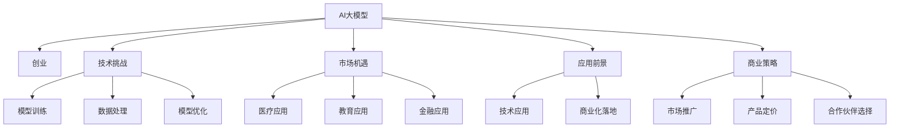

                 

# AI大模型创业战：挑战与机遇并存的思考

> 关键词：AI大模型,创业,技术挑战,市场机遇,应用前景,商业策略

## 1. 背景介绍

### 1.1 问题由来
人工智能（AI）技术的飞速发展，特别是大模型（Large Model）在自然语言处理（NLP）和计算机视觉（CV）等领域的突破性应用，为企业和个人创业带来了前所未有的机遇。然而，这些技术在落地应用时也面临诸多挑战，包括技术难度、市场竞争、伦理风险等。本文将从技术、市场、应用和商业策略等多个维度，探讨AI大模型的创业战，剖析其中的挑战与机遇，为有意进入该领域的企业和个人提供有价值的参考。

### 1.2 问题核心关键点
大模型技术的创业机遇主要体现在：

- **高性能和大规模：**大模型具有极高的计算能力和数据处理能力，能够在短时间内完成大规模数据的学习和推理。
- **跨领域应用：**大模型可以广泛应用于语音识别、图像识别、自然语言处理等多个领域，具有广泛的应用前景。
- **创新潜力：**大模型技术的发展催生了如预训练自监督学习、迁移学习、参数高效微调等前沿技术，为AI领域的创新提供了新的方向。
- **商业价值：**大模型技术能够大幅提升产品和服务性能，为企业带来显著的商业价值。

与此同时，大模型创业面临的挑战包括：

- **技术复杂性：**大模型涉及复杂的技术架构和算法设计，对技术团队的要求较高。
- **数据资源获取：**高质量的数据是训练大模型的关键，而获取和处理大规模数据资源是一个巨大挑战。
- **市场竞争：**AI大模型领域的竞争激烈，新进入者需要具备显著的竞争优势才能获得市场份额。
- **伦理风险：**大模型技术的应用可能引发伦理问题，如隐私保护、偏见等，需要采取严格的监管措施。

### 1.3 问题研究意义
深入理解AI大模型创业战中的挑战与机遇，对于有意进入该领域的创业者具有重要意义：

1. **降低创业风险：**通过识别潜在的技术和市场风险，可以制定更合理的创业策略，减少失败的可能性。
2. **优化资源分配：**了解大模型技术的关键要素和核心难点，有助于更好地分配资源，提高创业成功率。
3. **把握市场机遇：**掌握大模型技术的市场应用前景和商业价值，能够提前布局，抓住市场先机。
4. **提升竞争力：**通过技术创新和商业策略优化，可以在激烈的市场竞争中脱颖而出，获得竞争优势。

## 2. 核心概念与联系

### 2.1 核心概念概述

AI大模型创业战的核心概念包括：

- **AI大模型：**指的是具有大规模参数和复杂结构的深度学习模型，能够在多个领域实现高性能预测和推理。
- **创业：**指创业者通过技术创新和商业模式设计，将AI大模型技术转化为具有市场竞争力的产品或服务的过程。
- **技术挑战：**指在AI大模型应用过程中遇到的技术难题，如模型训练、数据处理、模型优化等。
- **市场机遇：**指AI大模型在特定领域（如医疗、教育、金融等）的应用前景和市场潜力。
- **应用前景：**指AI大模型在技术应用和商业化落地中的潜在价值和发展方向。
- **商业策略：**指创业者在市场推广、产品定价、合作伙伴选择等方面采取的策略和措施。

这些概念之间的联系可以通过以下Mermaid流程图来展示：



这个流程图展示了AI大模型在创业过程中的各个环节及其相互关系：

1. AI大模型的基础研究与开发。
2. 面对的技术挑战，如模型训练、数据处理和模型优化。
3. 探索的市场机遇，包括医疗、教育和金融等应用领域。
4. 技术的广泛应用及商业化落地过程。
5. 商业策略的制定和实施，如市场推广、产品定价和合作伙伴选择。

## 3. 核心算法原理 & 具体操作步骤
### 3.1 算法原理概述

AI大模型的创业战中，核心算法原理主要包括预训练自监督学习、迁移学习和微调（Fine-tuning）等。

- **预训练自监督学习：**指在无标注数据上，利用自监督任务（如语言模型、图像模型等）进行模型训练，学习到通用的特征表示。
- **迁移学习：**指将预训练模型应用到特定任务中，通过微调进一步优化模型性能。
- **微调：**指在特定任务的数据集上，通过有监督学习更新模型参数，使其更好地适应该任务。

### 3.2 算法步骤详解

AI大模型的创业战中，微调（Fine-tuning）是核心的步骤之一，其基本流程包括：

1. **数据准备：**收集并标注特定任务的数据集，划分为训练集、验证集和测试集。
2. **模型选择：**选择适合的预训练模型作为基础模型。
3. **任务适配：**在预训练模型的基础上，添加或修改任务特定的输出层和损失函数。
4. **微调训练：**使用微调数据集进行训练，更新模型参数，最小化损失函数。
5. **性能评估：**在验证集和测试集上评估模型性能，调整超参数和训练策略。
6. **部署应用：**将微调后的模型应用于实际应用场景中，进行预测和推理。

### 3.3 算法优缺点

微调的优点包括：

- **高效性：**通过微调，可以在较少的标注数据下获得良好的性能提升。
- **灵活性：**适应性强，能够快速调整以适应新任务。
- **可解释性：**微调后的模型通常更易于理解和解释。

然而，微调也存在以下缺点：

- **数据依赖：**微调效果高度依赖于标注数据的质量和数量。
- **过拟合风险：**如果数据量不足，模型可能会过拟合。
- **计算资源需求高：**微调需要大量的计算资源和存储空间。

### 3.4 算法应用领域

AI大模型的微调技术广泛应用于以下领域：

- **自然语言处理（NLP）：**如情感分析、文本分类、机器翻译等。
- **计算机视觉（CV）：**如图像分类、目标检测、图像生成等。
- **语音识别：**如语音识别、语音合成等。
- **医疗诊断：**如疾病预测、影像分析等。
- **金融分析：**如股票预测、信用评估等。
- **智能制造：**如质量检测、工艺优化等。

这些应用领域展示了微调技术的广泛性和潜力，为AI大模型的创业战提供了丰富的市场机遇。

## 4. 数学模型和公式 & 详细讲解 & 举例说明（备注：数学公式请使用latex格式，latex嵌入文中独立段落使用 $$，段落内使用 $)
### 4.1 数学模型构建

以自然语言处理（NLP）为例，常见的微调数学模型如下：

- **交叉熵损失函数：**用于分类任务，公式为：
$$
\mathcal{L}(\theta) = -\frac{1}{N} \sum_{i=1}^N \log p(y_i | x_i)
$$
其中，$p(y_i | x_i)$ 表示模型在输入 $x_i$ 下预测输出 $y_i$ 的概率，$N$ 为样本数。

- **均方误差损失函数：**用于回归任务，公式为：
$$
\mathcal{L}(\theta) = \frac{1}{N} \sum_{i=1}^N (y_i - \hat{y}_i)^2
$$
其中，$y_i$ 为真实标签，$\hat{y}_i$ 为模型预测结果。

### 4.2 公式推导过程

以二分类任务为例，假设模型 $M_{\theta}$ 在输入 $x$ 上的输出为 $\hat{y}=M_{\theta}(x) \in [0,1]$，真实标签 $y \in \{0,1\}$。则二分类交叉熵损失函数定义为：
$$
\ell(M_{\theta}(x),y) = -[y\log \hat{y} + (1-y)\log (1-\hat{y})]
$$

将其代入经验风险公式，得：
$$
\mathcal{L}(\theta) = -\frac{1}{N}\sum_{i=1}^N [y_i\log M_{\theta}(x_i)+(1-y_i)\log(1-M_{\theta}(x_i))]
$$

根据链式法则，损失函数对参数 $\theta_k$ 的梯度为：
$$
\frac{\partial \mathcal{L}(\theta)}{\partial \theta_k} = -\frac{1}{N}\sum_{i=1}^N (\frac{y_i}{M_{\theta}(x_i)}-\frac{1-y_i}{1-M_{\theta}(x_i)}) \frac{\partial M_{\theta}(x_i)}{\partial \theta_k}
$$

其中 $\frac{\partial M_{\theta}(x_i)}{\partial \theta_k}$ 可进一步递归展开，利用自动微分技术完成计算。

### 4.3 案例分析与讲解

以BERT模型为例，假设训练数据集为 $D=\{(x_i,y_i)\}_{i=1}^N$，其中 $x_i$ 为输入文本，$y_i$ 为标签。在微调过程中，定义模型输出层为全连接层，损失函数为交叉熵损失。微调步骤如下：

1. 将输入文本 $x_i$ 输入BERT模型，得到表示 $h$。
2. 将表示 $h$ 输入全连接层，得到预测结果 $\hat{y}$。
3. 计算预测结果 $\hat{y}$ 与真实标签 $y_i$ 之间的交叉熵损失，得到梯度 $\nabla_{\theta}\mathcal{L}(\theta)$。
4. 使用梯度下降等优化算法更新模型参数 $\theta$，最小化损失函数 $\mathcal{L}(\theta)$。

## 5. 项目实践：代码实例和详细解释说明
### 5.1 开发环境搭建

在进行AI大模型微调实践前，我们需要准备好开发环境。以下是使用Python进行PyTorch开发的环境配置流程：

1. 安装Anaconda：从官网下载并安装Anaconda，用于创建独立的Python环境。

2. 创建并激活虚拟环境：
```bash
conda create -n pytorch-env python=3.8 
conda activate pytorch-env
```

3. 安装PyTorch：根据CUDA版本，从官网获取对应的安装命令。例如：
```bash
conda install pytorch torchvision torchaudio cudatoolkit=11.1 -c pytorch -c conda-forge
```

4. 安装Transformers库：
```bash
pip install transformers
```

5. 安装各类工具包：
```bash
pip install numpy pandas scikit-learn matplotlib tqdm jupyter notebook ipython
```

完成上述步骤后，即可在`pytorch-env`环境中开始微调实践。

### 5.2 源代码详细实现

下面我们以命名实体识别(NER)任务为例，给出使用Transformers库对BERT模型进行微调的PyTorch代码实现。

首先，定义NER任务的数据处理函数：

```python
from transformers import BertTokenizer
from torch.utils.data import Dataset
import torch

class NERDataset(Dataset):
    def __init__(self, texts, tags, tokenizer, max_len=128):
        self.texts = texts
        self.tags = tags
        self.tokenizer = tokenizer
        self.max_len = max_len
        
    def __len__(self):
        return len(self.texts)
    
    def __getitem__(self, item):
        text = self.texts[item]
        tags = self.tags[item]
        
        encoding = self.tokenizer(text, return_tensors='pt', max_length=self.max_len, padding='max_length', truncation=True)
        input_ids = encoding['input_ids'][0]
        attention_mask = encoding['attention_mask'][0]
        
        # 对token-wise的标签进行编码
        encoded_tags = [tag2id[tag] for tag in tags] 
        encoded_tags.extend([tag2id['O']] * (self.max_len - len(encoded_tags)))
        labels = torch.tensor(encoded_tags, dtype=torch.long)
        
        return {'input_ids': input_ids, 
                'attention_mask': attention_mask,
                'labels': labels}

# 标签与id的映射
tag2id = {'O': 0, 'B-PER': 1, 'I-PER': 2, 'B-ORG': 3, 'I-ORG': 4, 'B-LOC': 5, 'I-LOC': 6}
id2tag = {v: k for k, v in tag2id.items()}

# 创建dataset
tokenizer = BertTokenizer.from_pretrained('bert-base-cased')

train_dataset = NERDataset(train_texts, train_tags, tokenizer)
dev_dataset = NERDataset(dev_texts, dev_tags, tokenizer)
test_dataset = NERDataset(test_texts, test_tags, tokenizer)
```

然后，定义模型和优化器：

```python
from transformers import BertForTokenClassification, AdamW

model = BertForTokenClassification.from_pretrained('bert-base-cased', num_labels=len(tag2id))

optimizer = AdamW(model.parameters(), lr=2e-5)
```

接着，定义训练和评估函数：

```python
from torch.utils.data import DataLoader
from tqdm import tqdm
from sklearn.metrics import classification_report

device = torch.device('cuda') if torch.cuda.is_available() else torch.device('cpu')
model.to(device)

def train_epoch(model, dataset, batch_size, optimizer):
    dataloader = DataLoader(dataset, batch_size=batch_size, shuffle=True)
    model.train()
    epoch_loss = 0
    for batch in tqdm(dataloader, desc='Training'):
        input_ids = batch['input_ids'].to(device)
        attention_mask = batch['attention_mask'].to(device)
        labels = batch['labels'].to(device)
        model.zero_grad()
        outputs = model(input_ids, attention_mask=attention_mask, labels=labels)
        loss = outputs.loss
        epoch_loss += loss.item()
        loss.backward()
        optimizer.step()
    return epoch_loss / len(dataloader)

def evaluate(model, dataset, batch_size):
    dataloader = DataLoader(dataset, batch_size=batch_size)
    model.eval()
    preds, labels = [], []
    with torch.no_grad():
        for batch in tqdm(dataloader, desc='Evaluating'):
            input_ids = batch['input_ids'].to(device)
            attention_mask = batch['attention_mask'].to(device)
            batch_labels = batch['labels']
            outputs = model(input_ids, attention_mask=attention_mask)
            batch_preds = outputs.logits.argmax(dim=2).to('cpu').tolist()
            batch_labels = batch_labels.to('cpu').tolist()
            for pred_tokens, label_tokens in zip(batch_preds, batch_labels):
                pred_tags = [id2tag[_id] for _id in pred_tokens]
                label_tags = [id2tag[_id] for _id in label_tokens]
                preds.append(pred_tags[:len(label_tags)])
                labels.append(label_tags)
                
    print(classification_report(labels, preds))
```

最后，启动训练流程并在测试集上评估：

```python
epochs = 5
batch_size = 16

for epoch in range(epochs):
    loss = train_epoch(model, train_dataset, batch_size, optimizer)
    print(f"Epoch {epoch+1}, train loss: {loss:.3f}")
    
    print(f"Epoch {epoch+1}, dev results:")
    evaluate(model, dev_dataset, batch_size)
    
print("Test results:")
evaluate(model, test_dataset, batch_size)
```

以上就是使用PyTorch对BERT进行命名实体识别任务微调的完整代码实现。可以看到，得益于Transformers库的强大封装，我们可以用相对简洁的代码完成BERT模型的加载和微调。

### 5.3 代码解读与分析

让我们再详细解读一下关键代码的实现细节：

**NERDataset类**：
- `__init__`方法：初始化文本、标签、分词器等关键组件。
- `__len__`方法：返回数据集的样本数量。
- `__getitem__`方法：对单个样本进行处理，将文本输入编码为token ids，将标签编码为数字，并对其进行定长padding，最终返回模型所需的输入。

**tag2id和id2tag字典**：
- 定义了标签与数字id之间的映射关系，用于将token-wise的预测结果解码回真实的标签。

**训练和评估函数**：
- 使用PyTorch的DataLoader对数据集进行批次化加载，供模型训练和推理使用。
- 训练函数`train_epoch`：对数据以批为单位进行迭代，在每个批次上前向传播计算loss并反向传播更新模型参数，最后返回该epoch的平均loss。
- 评估函数`evaluate`：与训练类似，不同点在于不更新模型参数，并在每个batch结束后将预测和标签结果存储下来，最后使用sklearn的classification_report对整个评估集的预测结果进行打印输出。

**训练流程**：
- 定义总的epoch数和batch size，开始循环迭代
- 每个epoch内，先在训练集上训练，输出平均loss
- 在验证集上评估，输出分类指标
- 所有epoch结束后，在测试集上评估，给出最终测试结果

可以看到，PyTorch配合Transformers库使得BERT微调的代码实现变得简洁高效。开发者可以将更多精力放在数据处理、模型改进等高层逻辑上，而不必过多关注底层的实现细节。

当然，工业级的系统实现还需考虑更多因素，如模型的保存和部署、超参数的自动搜索、更灵活的任务适配层等。但核心的微调范式基本与此类似。

## 6. 实际应用场景
### 6.1 智能客服系统

基于大语言模型微调的对话技术，可以广泛应用于智能客服系统的构建。传统客服往往需要配备大量人力，高峰期响应缓慢，且一致性和专业性难以保证。而使用微调后的对话模型，可以7x24小时不间断服务，快速响应客户咨询，用自然流畅的语言解答各类常见问题。

在技术实现上，可以收集企业内部的历史客服对话记录，将问题和最佳答复构建成监督数据，在此基础上对预训练对话模型进行微调。微调后的对话模型能够自动理解用户意图，匹配最合适的答案模板进行回复。对于客户提出的新问题，还可以接入检索系统实时搜索相关内容，动态组织生成回答。如此构建的智能客服系统，能大幅提升客户咨询体验和问题解决效率。

### 6.2 金融舆情监测

金融机构需要实时监测市场舆论动向，以便及时应对负面信息传播，规避金融风险。传统的人工监测方式成本高、效率低，难以应对网络时代海量信息爆发的挑战。基于大语言模型微调的文本分类和情感分析技术，为金融舆情监测提供了新的解决方案。

具体而言，可以收集金融领域相关的新闻、报道、评论等文本数据，并对其进行主题标注和情感标注。在此基础上对预训练语言模型进行微调，使其能够自动判断文本属于何种主题，情感倾向是正面、中性还是负面。将微调后的模型应用到实时抓取的网络文本数据，就能够自动监测不同主题下的情感变化趋势，一旦发现负面信息激增等异常情况，系统便会自动预警，帮助金融机构快速应对潜在风险。

### 6.3 个性化推荐系统

当前的推荐系统往往只依赖用户的历史行为数据进行物品推荐，无法深入理解用户的真实兴趣偏好。基于大语言模型微调技术，个性化推荐系统可以更好地挖掘用户行为背后的语义信息，从而提供更精准、多样的推荐内容。

在实践中，可以收集用户浏览、点击、评论、分享等行为数据，提取和用户交互的物品标题、描述、标签等文本内容。将文本内容作为模型输入，用户的后续行为（如是否点击、购买等）作为监督信号，在此基础上微调预训练语言模型。微调后的模型能够从文本内容中准确把握用户的兴趣点。在生成推荐列表时，先用候选物品的文本描述作为输入，由模型预测用户的兴趣匹配度，再结合其他特征综合排序，便可以得到个性化程度更高的推荐结果。

### 6.4 未来应用展望

随着大语言模型微调技术的发展，其在更多领域的应用前景将更加广阔。未来，AI大模型微调技术有望在智慧医疗、智慧教育、智慧城市等多个领域实现突破，为各行各业带来深度智能化应用。

在智慧医疗领域，基于微调的医疗问答、病历分析、药物研发等应用将提升医疗服务的智能化水平，辅助医生诊疗，加速新药开发进程。

在智能教育领域，微调技术可应用于作业批改、学情分析、知识推荐等方面，因材施教，促进教育公平，提高教学质量。

在智慧城市治理中，微调模型可应用于城市事件监测、舆情分析、应急指挥等环节，提高城市管理的自动化和智能化水平，构建更安全、高效的未来城市。

此外，在企业生产、社会治理、文娱传媒等众多领域，基于大模型微调的人工智能应用也将不断涌现，为经济社会发展注入新的动力。相信随着技术的日益成熟，微调方法将成为AI大模型的重要应用范式，推动人工智能技术在各行各业的落地应用。

## 7. 工具和资源推荐
### 7.1 学习资源推荐

为了帮助开发者系统掌握AI大模型微调的理论基础和实践技巧，这里推荐一些优质的学习资源：

1. 《Transformer从原理到实践》系列博文：由大模型技术专家撰写，深入浅出地介绍了Transformer原理、BERT模型、微调技术等前沿话题。

2. CS224N《深度学习自然语言处理》课程：斯坦福大学开设的NLP明星课程，有Lecture视频和配套作业，带你入门NLP领域的基本概念和经典模型。

3. 《Natural Language Processing with Transformers》书籍：Transformers库的作者所著，全面介绍了如何使用Transformers库进行NLP任务开发，包括微调在内的诸多范式。

4. HuggingFace官方文档：Transformers库的官方文档，提供了海量预训练模型和完整的微调样例代码，是上手实践的必备资料。

5. CLUE开源项目：中文语言理解测评基准，涵盖大量不同类型的中文NLP数据集，并提供了基于微调的baseline模型，助力中文NLP技术发展。

通过对这些资源的学习实践，相信你一定能够快速掌握AI大模型微调的精髓，并用于解决实际的NLP问题。
###  7.2 开发工具推荐

高效的开发离不开优秀的工具支持。以下是几款用于AI大模型微调开发的常用工具：

1. PyTorch：基于Python的开源深度学习框架，灵活动态的计算图，适合快速迭代研究。大部分预训练语言模型都有PyTorch版本的实现。

2. TensorFlow：由Google主导开发的开源深度学习框架，生产部署方便，适合大规模工程应用。同样有丰富的预训练语言模型资源。

3. Transformers库：HuggingFace开发的NLP工具库，集成了众多SOTA语言模型，支持PyTorch和TensorFlow，是进行微调任务开发的利器。

4. Weights & Biases：模型训练的实验跟踪工具，可以记录和可视化模型训练过程中的各项指标，方便对比和调优。与主流深度学习框架无缝集成。

5. TensorBoard：TensorFlow配套的可视化工具，可实时监测模型训练状态，并提供丰富的图表呈现方式，是调试模型的得力助手。

6. Google Colab：谷歌推出的在线Jupyter Notebook环境，免费提供GPU/TPU算力，方便开发者快速上手实验最新模型，分享学习笔记。

合理利用这些工具，可以显著提升AI大模型微调任务的开发效率，加快创新迭代的步伐。

### 7.3 相关论文推荐

AI大模型微调技术的发展源于学界的持续研究。以下是几篇奠基性的相关论文，推荐阅读：

1. Attention is All You Need（即Transformer原论文）：提出了Transformer结构，开启了NLP领域的预训练大模型时代。

2. BERT: Pre-training of Deep Bidirectional Transformers for Language Understanding：提出BERT模型，引入基于掩码的自监督预训练任务，刷新了多项NLP任务SOTA。

3. Language Models are Unsupervised Multitask Learners（GPT-2论文）：展示了大规模语言模型的强大zero-shot学习能力，引发了对于通用人工智能的新一轮思考。

4. Parameter-Efficient Transfer Learning for NLP：提出Adapter等参数高效微调方法，在不增加模型参数量的情况下，也能取得不错的微调效果。

5. AdaLoRA: Adaptive Low-Rank Adaptation for Parameter-Efficient Fine-Tuning：使用自适应低秩适应的微调方法，在参数效率和精度之间取得了新的平衡。

这些论文代表了大模型微调技术的发展脉络。通过学习这些前沿成果，可以帮助研究者把握学科前进方向，激发更多的创新灵感。

## 8. 总结：未来发展趋势与挑战
### 8.1 总结

本文对AI大模型创业战中的挑战与机遇进行了全面系统的探讨。首先，我们深入分析了AI大模型在创业过程中所面临的技术、市场和应用挑战，并详细介绍了大模型的核心算法原理和具体操作步骤。其次，我们通过实际应用场景的介绍，展示了AI大模型微调技术的广阔前景。最后，我们列出了相关学习资源、开发工具和推荐论文，为有意进入该领域的创业者提供了全面的技术指引。

通过本文的系统梳理，可以看到，AI大模型微调技术正处于快速发展阶段，未来在各行业的深度应用将带来革命性变化。创业者需要深入理解大模型的核心技术，并结合实际需求灵活应用，方能在激烈的市场竞争中脱颖而出，实现商业成功。

### 8.2 未来发展趋势

展望未来，AI大模型微调技术的发展趋势包括：

1. **技术不断进步：**大模型的参数量将继续增大，技术复杂度将不断提高，需要更多的研发投入和创新。
2. **应用场景广泛：**随着技术成熟，AI大模型将应用于更多垂直领域，如医疗、教育、金融等。
3. **数据驱动：**高质量的数据获取和处理将成为关键，需要更多数据标注和预处理技术。
4. **市场竞争激烈：**越来越多的企业进入AI大模型领域，市场竞争将更加激烈。
5. **伦理和隐私：**AI大模型应用需要考虑伦理和隐私问题，需要制定严格的规范和监管措施。
6. **可持续发展：**需要关注大模型的能效问题，探索更加绿色环保的训练和推理方法。

### 8.3 面临的挑战

尽管AI大模型微调技术在不断进步，但其面临的挑战依然严峻：

1. **技术难度高：**大模型涉及复杂的算法和架构，对技术团队要求较高。
2. **数据资源稀缺：**高质量标注数据的获取成本高，且数据多样性不足。
3. **市场竞争激烈：**新进入者需要具备显著的竞争优势才能获得市场份额。
4. **伦理和隐私问题：**大模型应用可能引发伦理和隐私问题，需要严格监管。
5. **计算资源需求大：**大模型的训练和推理需要大量的计算资源。

### 8.4 研究展望

面对AI大模型微调技术所面临的挑战，未来的研究应在以下几个方面寻求新的突破：

1. **探索新型训练方法：**研究更高效、更稳定的训练方法，如自监督学习、半监督学习等。
2. **开发多模态模型：**将视觉、语音、文本等不同模态的数据融合，提升大模型的应用范围和性能。
3. **优化模型结构和训练策略：**通过结构优化和策略改进，提高模型的推理效率和稳定性。
4. **加强伦理和隐私保护：**研究如何在技术应用中更好地保护用户隐私和伦理。
5. **提升模型解释性：**研究如何提高模型的可解释性，增强用户信任。

这些方向的研究将为AI大模型微调技术的进一步发展提供新的动力，推动其在更广阔的应用场景中落地。

## 9. 附录：常见问题与解答

**Q1：AI大模型创业需要哪些关键资源？**

A: AI大模型创业需要以下关键资源：

- **技术团队：**组建一支具备深度学习、NLP等专业背景的研发团队。
- **数据资源：**收集并标注高质量的数据集，用于模型训练和验证。
- **计算资源：**配备高性能GPU/TPU等计算设备，支持大规模模型训练和推理。
- **商业策略：**制定明确的商业模式和市场推广计划，寻找合作伙伴和用户。

**Q2：AI大模型的数据预处理有哪些步骤？**

A: AI大模型的数据预处理包括以下关键步骤：

1. **数据收集：**从不同渠道获取数据，如爬虫、API、数据库等。
2. **数据清洗：**去除无用、错误的数据，确保数据质量和一致性。
3. **数据标注：**为数据添加标签，如分类标签、实体标签等。
4. **数据增强：**通过数据增强技术，如回译、近义替换等，扩充数据集。
5. **数据划分：**将数据划分为训练集、验证集和测试集，用于模型训练、验证和测试。

**Q3：如何评估AI大模型的性能？**

A: 评估AI大模型的性能主要通过以下指标：

- **准确率（Accuracy）：**模型预测正确的样本比例。
- **召回率（Recall）：**模型正确预测的负样本比例。
- **精确率（Precision）：**模型正确预测的正样本比例。
- **F1值（F1 Score）：**综合准确率和召回率的指标。
- **ROC曲线（Receiver Operating Characteristic Curve）：**衡量模型在不同阈值下的性能。

**Q4：AI大模型创业的商业策略有哪些？**

A: AI大模型创业的商业策略主要包括以下几个方面：

- **市场定位：**明确目标用户群体和市场需求，制定差异化的产品策略。
- **合作伙伴：**寻找合适的合作伙伴，如云服务提供商、数据提供商等。
- **定价策略：**根据市场情况和用户需求，制定合理的定价策略。
- **市场推广：**通过广告、社交媒体、展会等渠道进行市场推广。
- **用户服务：**提供良好的用户服务和支持，提升用户体验。

**Q5：AI大模型创业需要考虑哪些风险？**

A: AI大模型创业需要考虑以下风险：

- **技术风险：**技术实现难度高，可能面临技术瓶颈。
- **市场风险：**市场竞争激烈，可能面临市场份额争夺。
- **法律风险：**数据隐私、知识产权等问题可能引发法律风险。
- **伦理风险：**模型偏见、误导性输出等问题可能引发伦理风险。
- **商业风险：**资金不足、运营成本高等问题可能影响企业发展。

---

作者：禅与计算机程序设计艺术 / Zen and the Art of Computer Programming

