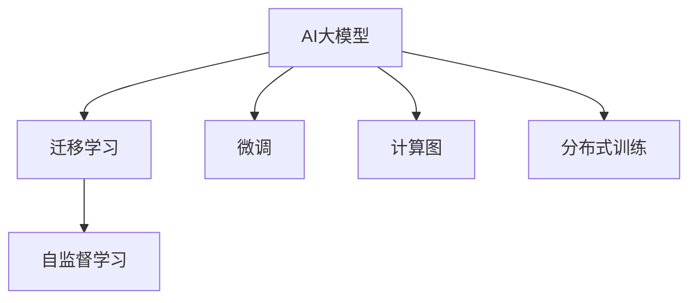

                 

## 1. 背景介绍

随着人工智能(AI)技术的不断进步，AI大模型已成为众多创业者和投资者的关注焦点。AI大模型不仅具有强大的数据处理能力和自我学习能力，还在自然语言处理(NLP)、计算机视觉(CV)、语音识别(SR)等众多领域取得了突破性进展。然而，如何实现AI大模型的商业化，从技术到盈利，是一个复杂的系统工程。

### 1.1 问题由来
近年来，基于深度学习的AI大模型在诸多领域取得了显著的成果，如AlphaGo、BERT等模型。这些大模型的核心竞争力在于其庞大的参数量、丰富的语义表示以及强大的泛化能力。但在将大模型落地应用时，面临诸多难题，如成本高昂、数据隐私、算力需求等。这些问题成为了制约AI大模型商业化的重要瓶颈。

### 1.2 问题核心关键点
对于AI大模型创业而言，其核心关键点在于如何从技术到盈利，将大模型的强大能力转化为商业模式，创造可持续的经济价值。以下是AI大模型创业过程中需要关注的关键点：

- **数据获取与处理**：高质量、大规模的数据是构建AI大模型的基础，如何获取、存储和处理这些数据是关键。
- **算力需求与成本**：构建和训练大模型需要强大的算力支持，如何有效降低算力成本是挑战之一。
- **模型优化与部署**：如何将大模型优化至最优状态，并在实际应用中实现高效部署，是实现商业化的重要环节。
- **盈利模式设计**：如何设计合理的盈利模式，保障公司长期盈利，是创业成功的关键。
- **用户体验优化**：保证用户使用大模型产品时体验流畅，提升用户体验，是增强市场竞争力的重要手段。

### 1.3 问题研究意义
研究AI大模型创业，对于推动AI技术的应用落地，加速AI产业的发展，具有重要意义：

- **加速技术应用**：创业者的探索和实践，可以迅速将AI大模型技术转化为实际产品，加速其在各行各业的应用。
- **优化资源配置**：创业公司通过市场化运作，可以更有效地配置资源，降低AI技术研发和应用的成本。
- **培育市场生态**：创业公司可以引入多种业务模式，形成完整的市场生态系统，提升AI大模型的商业化水平。
- **推动产业升级**：AI大模型创业可以带动上下游产业链的发展，推动相关产业的转型升级。

## 2. 核心概念与联系

### 2.1 核心概念概述

为更好地理解AI大模型创业的关键环节，本节将介绍几个核心概念：

- **AI大模型**：以深度神经网络为基础，具备强大的数据处理和自我学习能力的大规模预训练模型。如BERT、GPT-3等。
- **迁移学习**：将预训练模型的知识迁移到特定任务上，通过有监督微调获得任务特定能力。
- **微调**：基于特定任务的数据，对大模型进行参数更新，以优化模型在该任务上的表现。
- **自监督学习**：在大规模无标签数据上通过自我构建的监督信号进行学习，如BERT、GPT等预训练过程。
- **计算图**：用于表示模型结构与计算流程的图结构，如PyTorch、TensorFlow中的计算图。
- **分布式训练**：通过多个计算节点并行训练模型，提升训练速度和效率。

这些核心概念之间的逻辑关系可以通过以下Mermaid流程图来展示：



这个流程图展示了大模型技术的主要流程：

1. 大模型通过自监督学习获取广泛的语义知识。
2. 迁移学习将预训练知识迁移到特定任务上。
3. 微调优化模型在特定任务上的表现。
4. 计算图和分布式训练提升了模型的训练效率。

## 3. 核心算法原理 & 具体操作步骤
### 3.1 算法原理概述

AI大模型的创业过程中，核心算法原理主要包括迁移学习、微调、自监督学习等，这些原理在大模型的构建与应用中扮演着关键角色。

- **迁移学习**：通过在大规模无标签数据上进行预训练，学习通用的语言表示，再通过有监督微调获得特定任务能力。
- **微调**：通过特定任务数据对模型进行有监督训练，调整模型参数以适应任务需求。
- **自监督学习**：利用大数据集，通过自我构建的监督信号进行模型训练，无需标注数据。

### 3.2 算法步骤详解

AI大模型创业需要遵循以下核心步骤：

**Step 1: 数据准备**
- 收集和预处理高质量、大规模的数据集，分为训练集、验证集和测试集。

**Step 2: 模型选择与优化**
- 选择合适的预训练模型，进行必要的优化和调整，如调整超参数、设置学习率等。

**Step 3: 模型微调**
- 基于特定任务的数据集，进行有监督微调，优化模型参数以适应任务需求。

**Step 4: 模型部署与优化**
- 将优化后的模型部署到实际应用中，进行性能优化和用户体验提升。

**Step 5: 市场推广与盈利**
- 设计合理的盈利模式，推广产品，获取用户和市场认可。

### 3.3 算法优缺点

AI大模型创业过程中，算法存在以下优缺点：

**优点：**

- **技术领先**：使用大模型技术，可以获得行业领先的技术优势。
- **应用广泛**：大模型可以应用于NLP、CV、SR等多个领域，市场潜力巨大。
- **算法透明**：算法原理公开，便于监督和验证。

**缺点：**

- **成本高昂**：大模型和算力成本高，难以快速降低。
- **隐私风险**：大规模数据处理可能涉及隐私问题，需严格管控。
- **市场竞争**：市场竞争激烈，需具备强大技术和运营能力。

### 3.4 算法应用领域

AI大模型技术已经在众多领域得到了广泛应用，具体包括：

- **自然语言处理**：如文本分类、情感分析、机器翻译等。
- **计算机视觉**：如图像识别、目标检测、人脸识别等。
- **语音识别**：如语音转文本、语音识别等。
- **推荐系统**：如商品推荐、内容推荐等。
- **智能客服**：如智能问答、聊天机器人等。

这些领域的大模型应用不仅提高了效率，也提升了用户体验，为各行业带来了显著的经济效益。

## 4. 数学模型和公式 & 详细讲解
### 4.1 数学模型构建

AI大模型的核心算法包括迁移学习、微调等，其数学模型构建主要基于深度学习模型和优化算法。

**迁移学习模型**：
假设预训练模型为 $M_{\theta}$，其中 $\theta$ 为预训练得到的模型参数。给定下游任务 $T$ 的标注数据集 $D=\{(x_i,y_i)\}_{i=1}^N$，通过有监督微调，优化模型在特定任务上的参数 $\hat{\theta}$。微调的目标是使得损失函数 $\mathcal{L}(M_{\theta},D)$ 最小化。

**微调模型**：
以二分类任务为例，假设模型 $M_{\theta}$ 在输入 $x$ 上的输出为 $\hat{y}=M_{\theta}(x) \in [0,1]$，表示样本属于正类的概率。真实标签 $y \in \{0,1\}$。则二分类交叉熵损失函数定义为：

$$
\ell(M_{\theta}(x),y) = -[y\log \hat{y} + (1-y)\log (1-\hat{y})]
$$

微调的目标是找到新的模型参数 $\hat{\theta}$，使得损失函数 $\mathcal{L}(M_{\theta},D)$ 最小化。

### 4.2 公式推导过程

以二分类任务为例，推导微调模型的损失函数及其梯度：

**损失函数**：
$$
\mathcal{L}(\theta) = -\frac{1}{N}\sum_{i=1}^N [y_i\log M_{\theta}(x_i)+(1-y_i)\log(1-M_{\theta}(x_i))]
$$

**梯度**：
$$
\frac{\partial \mathcal{L}(\theta)}{\partial \theta_k} = -\frac{1}{N}\sum_{i=1}^N (\frac{y_i}{M_{\theta}(x_i)}-\frac{1-y_i}{1-M_{\theta}(x_i)}) \frac{\partial M_{\theta}(x_i)}{\partial \theta_k}
$$

通过计算梯度，结合优化算法，实现模型的微调。

### 4.3 案例分析与讲解

**案例分析**：
以NLP领域中的情感分析任务为例，使用BERT模型进行微调。

**分析讲解**：
1. 数据准备：收集情感分析的数据集，如IMDB电影评论。
2. 模型选择：使用预训练的BERT模型。
3. 模型微调：在IMDB评论数据集上微调BERT模型，学习情感分类任务。
4. 模型评估：在测试集上评估微调后的模型性能。

## 5. 项目实践：代码实例和详细解释说明
### 5.1 开发环境搭建

在Python环境下，使用PyTorch和TensorFlow进行AI大模型的实践。

1. 安装Anaconda和Jupyter Notebook。
2. 安装PyTorch和TensorFlow。
3. 安装相关数据处理库和模型库。

### 5.2 源代码详细实现

以下是一个简单的情感分析模型微调的Python代码实现。

```python
import torch
import torch.nn as nn
import torch.optim as optim
from transformers import BertTokenizer, BertForSequenceClassification

# 定义模型结构
class SentimentClassifier(nn.Module):
    def __init__(self, num_labels):
        super(SentimentClassifier, self).__init__()
        self.bert = BertForSequenceClassification.from_pretrained('bert-base-uncased', num_labels=num_labels)
        self.dropout = nn.Dropout(0.1)

    def forward(self, input_ids, attention_mask):
        outputs = self.bert(input_ids, attention_mask=attention_mask)
        logits = outputs[0]
        probabilities = nn.functional.softmax(logits, dim=1)
        return probabilities

# 加载数据集
tokenizer = BertTokenizer.from_pretrained('bert-base-uncased')
train_data = []
train_labels = []
# ... 加载和处理数据

# 定义模型、损失函数和优化器
model = SentimentClassifier(num_labels=2)
loss_fn = nn.CrossEntropyLoss()
optimizer = optim.Adam(model.parameters(), lr=2e-5)

# 训练过程
for epoch in range(10):
    total_loss = 0
    for batch in train_data:
        input_ids, attention_mask, labels = batch
        optimizer.zero_grad()
        outputs = model(input_ids, attention_mask)
        loss = loss_fn(outputs, labels)
        total_loss += loss.item()
        loss.backward()
        optimizer.step()
    print(f"Epoch {epoch+1}, loss: {total_loss/len(train_data):.4f}")
```

### 5.3 代码解读与分析

**代码解读**：
1. 定义情感分类器模型，使用BERT作为预训练模型，并添加了Dropout层以防止过拟合。
2. 加载并处理数据集，使用BertTokenizer对输入进行分词和编码。
3. 定义模型、损失函数和优化器，并进行10轮迭代训练。
4. 输出每个epoch的平均损失，并打印在屏幕上。

**分析**：
1. 数据集准备：情感分析任务的数据集为IMDB评论数据集，包含正负样本。
2. 模型选择：使用预训练的BERT模型，该模型已经在多个NLP任务上表现优异。
3. 模型微调：通过10轮迭代训练，微调模型在情感分类任务上的表现。
4. 模型评估：由于代码中未包含评估过程，实际应用中需额外定义评估函数和数据集，进行模型性能评估。

## 6. 实际应用场景
### 6.1 智能客服系统

智能客服系统是大模型创业的重要应用场景之一。通过微调大模型，客服系统能够自动理解用户问题并给出准确回答，提升用户体验和效率。

**应用实例**：
1. 收集历史客服数据，将其标注为问题与回答对。
2. 使用微调后的BERT模型进行问题-回答匹配，生成回答。
3. 持续收集新问题，更新模型知识库。

### 6.2 金融舆情监测

金融领域对舆情监测有着严格的需求，使用大模型可以实时监测舆情变化，识别潜在风险。

**应用实例**：
1. 收集金融相关的新闻、评论等数据。
2. 对数据进行情感分析，识别舆情趋势。
3. 对突发舆情进行实时监控和预警。

### 6.3 个性化推荐系统

个性化推荐系统是大模型在电商、社交媒体等领域的典型应用。通过微调模型，推荐系统能够更好地理解用户偏好，提高推荐精度。

**应用实例**：
1. 收集用户浏览、购买记录和评论数据。
2. 对数据进行特征提取，使用微调后的BERT模型进行用户兴趣匹配。
3. 根据匹配结果推荐商品或内容。

### 6.4 未来应用展望

未来，AI大模型将会在更多领域发挥重要作用，具体包括：

1. **智慧医疗**：通过微调模型，实现智能诊断、药物推荐等应用。
2. **智能教育**：使用微调后的模型，实现智能评估、个性化教学等。
3. **智慧城市**：通过微调模型，实现交通管理、公共安全等应用。
4. **智能制造**：使用微调模型，实现设备预测维护、质量控制等。

## 7. 工具和资源推荐
### 7.1 学习资源推荐

为了帮助开发者更好地理解AI大模型创业，推荐以下学习资源：

1. **《深度学习》**：Ian Goodfellow等著，系统介绍了深度学习的基本原理和应用。
2. **《Transformers from Top to Bottom》**：大模型领域的经典教材，详细介绍了Transformer模型及其应用。
3. **《PyTorch Lightning》**：Fast.ai开发的深度学习框架，简化了模型训练和部署流程。
4. **Kaggle**：数据科学竞赛平台，提供了丰富的数据集和竞赛，可以用于实践和研究。

### 7.2 开发工具推荐

为了提高AI大模型创业的效率，推荐以下开发工具：

1. **Anaconda**：跨平台的数据科学环境管理工具，支持Python、R等多种语言。
2. **Jupyter Notebook**：交互式编程环境，支持Python、R等多种语言，便于研究和实验。
3. **TensorFlow**：Google开发的深度学习框架，支持分布式训练和GPU加速。
4. **PyTorch**：Facebook开发的深度学习框架，支持动态计算图和GPU加速。
5. **Weights & Biases**：模型训练的实验跟踪工具，支持TensorFlow和PyTorch，便于模型调优和分析。

### 7.3 相关论文推荐

为了获取最新的AI大模型创业进展，推荐以下相关论文：

1. **"Attention is All You Need"**：Transformer模型的经典论文，标志着大模型时代的到来。
2. **"BERT: Pre-training of Deep Bidirectional Transformers for Language Understanding"**：BERT模型的经典论文，展示了预训练语言模型的巨大潜力。
3. **"Super-Convergence: Very Fast Training of Neural Networks using Large Learning Rates"**：提出了超收敛技术，大幅提升了模型训练效率。
4. **"Scalable Deep Learning with Deterministic Stochastic Gradients"**：提出了确定性随机梯度方法，提高了模型训练的稳定性和效率。

## 8. 总结：未来发展趋势与挑战
### 8.1 总结

本文从技术到盈利，详细介绍了AI大模型创业的关键环节和核心算法原理，通过代码实例和案例分析，展现了AI大模型在实际应用中的强大能力。

### 8.2 未来发展趋势

未来，AI大模型创业将呈现以下发展趋势：

1. **技术不断进步**：随着深度学习技术的不断创新，AI大模型的能力将进一步提升，应用场景将更加广泛。
2. **算力成本降低**：随着算力技术的进步和普及，AI大模型的构建和训练成本将逐步降低。
3. **应用领域拓展**：AI大模型将从NLP、CV、SR等领域，扩展到医疗、教育、金融等更多行业。
4. **盈利模式多样化**：除了直接销售模型，还将发展SaaS、API服务等多种盈利模式。
5. **用户体验优化**：通过不断优化模型和算法，提升用户体验，增强市场竞争力。

### 8.3 面临的挑战

AI大模型创业在取得进步的同时，也面临诸多挑战：

1. **数据获取难度**：高质量、大规模的数据集获取成本高、难度大。
2. **算力需求高**：构建和训练大模型需要强大的算力支持。
3. **市场竞争激烈**：AI大模型领域竞争激烈，需具备强大的技术和运营能力。
4. **隐私风险**：大规模数据处理可能涉及隐私问题，需严格管控。
5. **盈利模式单一**：现有盈利模式较为单一，需探索更多商业模式。

### 8.4 研究展望

未来，AI大模型创业需要在以下几个方面寻求新的突破：

1. **数据获取和处理**：利用数据增强和迁移学习等技术，提高数据获取和处理效率。
2. **算力优化**：通过分布式训练、超收敛技术等，降低算力成本，提高模型训练效率。
3. **盈利模式创新**：探索多种盈利模式，如SaaS、API服务、数据分析服务等。
4. **用户体验提升**：通过模型优化和算法改进，提升用户体验和满意度。

总之，AI大模型创业是大数据、人工智能时代的必然趋势，需要技术创新、市场开拓和商业模式创新的紧密结合，才能实现长期盈利和可持续发展。

## 9. 附录：常见问题与解答

**Q1: 如何降低AI大模型的算力成本？**

A: 可以通过以下方法降低算力成本：
1. **分布式训练**：使用多台计算节点并行训练模型，提升训练效率。
2. **超收敛技术**：使用大学习率进行快速训练，缩短训练时间。
3. **混合精度训练**：使用低精度计算，降低计算资源消耗。

**Q2: 如何确保AI大模型的隐私安全？**

A: 可以通过以下方法确保隐私安全：
1. **数据匿名化**：对数据进行去标识化处理，保护用户隐私。
2. **差分隐私**：在模型训练过程中加入噪声，避免数据泄露。
3. **访问控制**：设置严格的访问权限，保护数据安全。

**Q3: 如何提升AI大模型的训练效率？**

A: 可以通过以下方法提升训练效率：
1. **数据增强**：通过对数据进行扩充和增强，提高模型的泛化能力。
2. **模型优化**：通过剪枝、量化等技术，优化模型结构，降低计算量。
3. **分布式训练**：利用多台计算节点并行训练，提高训练效率。

**Q4: 如何确保AI大模型的鲁棒性？**

A: 可以通过以下方法确保鲁棒性：
1. **对抗训练**：引入对抗样本，提高模型鲁棒性。
2. **正则化技术**：使用L2正则、Dropout等技术，防止模型过拟合。
3. **多模型集成**：训练多个模型，取平均输出，提高模型鲁棒性。

**Q5: 如何设计合理的盈利模式？**

A: 可以通过以下方法设计盈利模式：
1. **SaaS模式**：将模型作为服务提供，按需使用。
2. **API模式**：通过API接口提供模型功能，收取费用。
3. **数据分析服务**：提供数据分析服务，收取数据处理和分析费用。

---

作者：禅与计算机程序设计艺术 / Zen and the Art of Computer Programming

