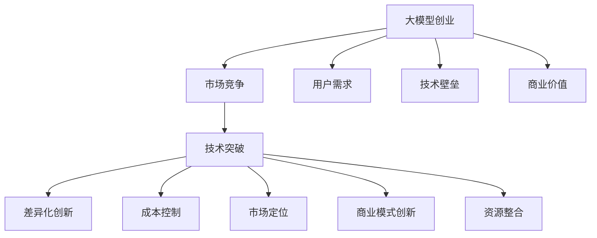

                 

# AI大模型创业：如何应对未来价格战？

> 关键词：大模型创业,价格战,创新,市场竞争,技术突破

## 1. 背景介绍

### 1.1 问题由来
随着人工智能(AI)技术的快速发展，大模型创业日益成为热门趋势。这些大模型通常基于自回归(如GPT)或自编码(如BERT)模型，在预训练阶段，通过在大规模无标签文本语料上训练，学习到丰富的语言知识。在微调阶段，根据特定任务需求，使用少量标注数据对其进行优化，获得针对特定任务的高效模型。

然而，大模型市场竞争激烈，各大公司纷纷加大投入，开发更多型号、更大规模的预训练模型，并推出各类衍生应用，如聊天机器人、文本生成、智能推荐等。这导致市场价格战愈演愈烈，价格不断下滑，盈利压力增大。如何在激烈的价格战中保持竞争力，并实现可持续发展，成为众多AI创业公司面临的重要问题。

### 1.2 问题核心关键点
面对未来价格战，大模型创业公司需要在以下几方面进行重点思考和应对：
1. **差异化创新**：开发具有独特优势的新技术，形成区别于竞争对手的差异化竞争优势。
2. **成本控制**：通过优化模型结构、使用高效算法、降低计算成本等方式，控制和降低开发和运营成本。
3. **市场定位**：精准定位目标用户群和市场需求，提供差异化的产品和服务，满足特定场景的需求。
4. **商业模式创新**：探索新的商业模式，如订阅服务、按需付费、联合开发等，实现盈利模式多样化。
5. **资源整合**：整合内外部资源，包括技术、人才、合作伙伴等，形成协同效应，提升市场竞争力。

### 1.3 问题研究意义
大模型创业在AI行业具有重要地位，其技术突破和商业应用不仅推动了NLP技术的发展，还为各行各业带来了新的发展机遇。面对未来价格战，研究如何实现差异化创新、降低成本、精准定位市场、探索新商业模式、整合资源等策略，对于保持行业竞争力和推动行业发展具有重要意义。

## 2. 核心概念与联系

### 2.1 核心概念概述

为更好地理解未来价格战中的大模型创业策略，本节将介绍几个密切相关的核心概念：

- **大模型创业**：指基于大模型技术进行商业化应用，如搭建聊天机器人、生成内容、推荐系统等，形成业务闭环和商业模式。

- **市场竞争**：指同一市场中各主体之间为争夺用户、市场份额而进行的经济竞争行为。

- **技术突破**：指通过持续创新，开发新技术、新产品、新应用，提升产品性能和用户体验，形成技术壁垒。

- **差异化创新**：指通过技术、产品、服务等方面实现差异化，满足特定用户需求，提升市场竞争力。

- **成本控制**：指通过优化资源配置、提高运营效率等方式，降低成本，提升盈利能力。

- **市场定位**：指确定目标市场和用户群体，明确产品或服务定位，满足特定需求。

- **商业模式创新**：指探索新的盈利模式，如订阅服务、按需付费、联合开发等，实现多元化收入。

- **资源整合**：指整合内部技术、人才、合作伙伴等资源，形成协同效应，提升市场竞争力。

这些核心概念之间的逻辑关系可以通过以下Mermaid流程图来展示：



这个流程图展示了大模型创业的核心概念及其之间的关系：

1. 大模型创业通过市场竞争获取用户，通过技术突破形成技术壁垒。
2. 差异化创新提升产品竞争力，成本控制增强盈利能力，市场定位满足用户需求，商业模式创新实现多元化收入。
3. 资源整合提升市场竞争力，满足用户需求。

这些概念共同构成了大模型创业的整体框架，帮助企业在未来价格战中保持竞争力。

## 3. 核心算法原理 & 具体操作步骤

### 3.1 算法原理概述

未来价格战中的大模型创业，涉及的算法和模型优化问题，主要集中在以下几个方面：

- **优化算法**：选择合适的优化算法，如Adam、SGD等，通过调整学习率、批大小、迭代轮数等参数，提升模型训练效率和效果。
- **模型压缩**：通过参数剪枝、量化、知识蒸馏等技术，降低模型规模和计算成本。
- **资源调度**：通过云计算平台，优化资源调度策略，提升模型训练和推理效率。
- **分布式训练**：使用多机多卡训练，提升训练速度，缩短产品上市周期。
- **应用优化**：根据具体应用场景，优化模型架构和推理过程，提升用户体验。

### 3.2 算法步骤详解

基于未来价格战中的大模型创业需求，以下是一些关键步骤的详细介绍：

**Step 1: 需求分析**
- 通过市场调研，了解用户需求和竞争状况。
- 确定产品特性和差异化卖点，明确市场定位。

**Step 2: 技术选型**
- 选择合适的预训练模型和技术框架，如BERT、GPT等。
- 根据需求分析结果，设计合适的微调策略。

**Step 3: 模型训练**
- 在预训练模型基础上，进行有监督微调，提升模型性能。
- 使用高效算法，如AdamW、Adafactor等，优化模型训练过程。

**Step 4: 模型压缩**
- 通过参数剪枝、量化、知识蒸馏等技术，降低模型规模和计算成本。
- 将模型压缩到指定大小，进行推理优化，提升用户体验。

**Step 5: 资源调度**
- 使用云计算平台，优化资源调度策略，提升模型训练和推理效率。
- 根据需求动态调整资源配置，平衡成本和效率。

**Step 6: 应用优化**
- 根据具体应用场景，优化模型架构和推理过程，提升用户体验。
- 进行A/B测试，收集用户反馈，不断优化产品。

**Step 7: 商业模式探索**
- 探索新的商业模式，如订阅服务、按需付费、联合开发等。
- 通过多元化收入，增强盈利能力。

**Step 8: 用户教育和推广**
- 通过营销活动、用户教育等方式，提升用户认知度和产品使用率。
- 建立用户社区，形成品牌效应，增强用户粘性。

### 3.3 算法优缺点

未来价格战中的大模型创业，涉及的算法和模型优化问题，具有以下优缺点：

#### 优点：
1. **提升性能**：优化算法和模型压缩技术，可以显著提升模型训练和推理效率，减少计算成本。
2. **降低成本**：通过合理调度资源和优化应用，降低大模型创业的运营成本。
3. **提升用户体验**：通过优化模型和应用，提升用户体验，增强用户粘性。

#### 缺点：
1. **技术复杂性**：优化算法和模型压缩技术涉及复杂的数学和工程问题，需要较高的技术门槛。
2. **资源投入**：优化模型和应用需要大量的资源投入，包括计算资源、人力和时间等。
3. **市场竞争激烈**：未来价格战中，竞争对手可能采取同样的优化策略，导致市场竞争更加激烈。

### 3.4 算法应用领域

未来价格战中的大模型创业，主要应用在以下几个领域：

- **智能客服**：使用聊天机器人提供24小时在线客服，提升用户满意度和体验。
- **内容生成**：生成高质量的文本内容，应用于新闻、广告、社交媒体等。
- **推荐系统**：根据用户行为和偏好，推荐个性化内容，提升用户体验。
- **金融科技**：提供智能理财、风险评估等服务，提升金融产品的智能化水平。
- **医疗健康**：提供智能诊断、健康管理等服务，提升医疗服务的智能化水平。

这些应用领域对大模型的依赖度较高，通过优化算法和模型压缩技术，可以在激烈的市场竞争中保持竞争优势。

## 4. 数学模型和公式 & 详细讲解  
### 4.1 数学模型构建

在未来价格战中的大模型创业中，常见的数学模型包括：

- **优化模型**：通过梯度下降等算法，最小化损失函数，优化模型参数。
- **压缩模型**：通过参数剪枝、量化、知识蒸馏等技术，压缩模型规模。
- **调度模型**：通过云计算平台，优化资源调度策略。

以优化模型为例，假设模型 $M_{\theta}$ 在输入 $x$ 上的输出为 $\hat{y}$，真实标签为 $y$。则优化模型的损失函数为：

$$
\mathcal{L}(\theta) = \frac{1}{N}\sum_{i=1}^N \ell(M_{\theta}(x_i), y_i)
$$

其中 $\ell$ 为损失函数，如交叉熵、均方误差等。模型的优化目标是：

$$
\theta^* = \mathop{\arg\min}_{\theta} \mathcal{L}(\theta)
$$

### 4.2 公式推导过程

以优化模型为例，假设模型 $M_{\theta}$ 在输入 $x$ 上的输出为 $\hat{y}=M_{\theta}(x)$，真实标签为 $y$。则优化模型的损失函数为：

$$
\mathcal{L}(\theta) = \frac{1}{N}\sum_{i=1}^N \ell(\hat{y}, y)
$$

其中 $\ell$ 为损失函数，如交叉熵、均方误差等。模型的优化目标是：

$$
\theta^* = \mathop{\arg\min}_{\theta} \mathcal{L}(\theta)
$$

根据梯度下降算法，模型参数的更新公式为：

$$
\theta_{t+1} = \theta_t - \eta \nabla_{\theta}\mathcal{L}(\theta_t)
$$

其中 $\eta$ 为学习率，$\nabla_{\theta}\mathcal{L}(\theta_t)$ 为损失函数对参数 $\theta_t$ 的梯度，可通过反向传播算法高效计算。

### 4.3 案例分析与讲解

以BERT微调为例，假设BERT在输入 $x$ 上的输出为 $\hat{y}=[\hat{y}_1, \hat{y}_2, \ldots, \hat{y}_n]$，真实标签为 $y=[y_1, y_2, \ldots, y_n]$。则二分类交叉熵损失函数为：

$$
\ell(\hat{y}, y) = -\sum_{i=1}^n y_i\log \hat{y}_i + (1-y_i)\log (1-\hat{y}_i)
$$

根据梯度下降算法，模型参数的更新公式为：

$$
\theta_{t+1} = \theta_t - \eta \nabla_{\theta}\mathcal{L}(\theta_t)
$$

其中 $\eta$ 为学习率，$\nabla_{\theta}\mathcal{L}(\theta_t)$ 为损失函数对参数 $\theta_t$ 的梯度，可通过反向传播算法高效计算。

## 5. 项目实践：代码实例和详细解释说明

### 5.1 开发环境搭建

在进行未来价格战中的大模型创业项目实践前，需要准备好开发环境。以下是使用Python进行PyTorch开发的环境配置流程：

1. 安装Anaconda：从官网下载并安装Anaconda，用于创建独立的Python环境。

2. 创建并激活虚拟环境：
```bash
conda create -n pytorch-env python=3.8 
conda activate pytorch-env
```

3. 安装PyTorch：根据CUDA版本，从官网获取对应的安装命令。例如：
```bash
conda install pytorch torchvision torchaudio cudatoolkit=11.1 -c pytorch -c conda-forge
```

4. 安装Transformers库：
```bash
pip install transformers
```

5. 安装各类工具包：
```bash
pip install numpy pandas scikit-learn matplotlib tqdm jupyter notebook ipython
```

完成上述步骤后，即可在`pytorch-env`环境中开始项目实践。

### 5.2 源代码详细实现

下面以生成式对话系统为例，给出使用Transformers库进行BERT模型微调的PyTorch代码实现。

首先，定义对话系统数据处理函数：

```python
from transformers import BertTokenizer
from torch.utils.data import Dataset
import torch

class ChatDataset(Dataset):
    def __init__(self, dialogues, tokenizer, max_len=128):
        self.dialogues = dialogues
        self.tokenizer = tokenizer
        self.max_len = max_len
        
    def __len__(self):
        return len(self.dialogues)
    
    def __getitem__(self, item):
        dialogue = self.dialogues[item]
        input_tokens = []
        label_tokens = []
        for i, sent in enumerate(dialogue):
            if i % 2 == 0:
                input_tokens.append(sent)
            else:
                label_tokens.append(sent)
        
        input_ids = self.tokenizer(input_tokens, return_tensors='pt', max_length=self.max_len, padding='max_length', truncation=True)
        label_ids = self.tokenizer(label_tokens, return_tensors='pt', max_length=self.max_len, padding='max_length', truncation=True)
        
        input_ids = input_ids['input_ids'][0]
        label_ids = label_ids['input_ids'][0]
        
        return {'input_ids': input_ids, 
                'label_ids': label_ids}

# 加载预训练的Bert模型和分词器
tokenizer = BertTokenizer.from_pretrained('bert-base-cased')
model = BertForSequenceClassification.from_pretrained('bert-base-cased', num_labels=2)

# 定义优化器和学习率
optimizer = AdamW(model.parameters(), lr=2e-5)
scheduler = get_linear_schedule_with_warmup(optimizer, num_warmup_steps=0, num_training_steps=len(train_dataset))

# 训练函数
def train_epoch(model, dataset, optimizer, scheduler):
    model.train()
    total_loss = 0
    for batch in dataset:
        input_ids = batch['input_ids'].to(device)
        label_ids = batch['label_ids'].to(device)
        outputs = model(input_ids, labels=label_ids)
        loss = outputs.loss
        total_loss += loss.item()
        loss.backward()
        optimizer.step()
        scheduler.step()
    return total_loss / len(dataset)

# 评估函数
def evaluate(model, dataset, batch_size):
    model.eval()
    total_loss = 0
    total_correct = 0
    for batch in dataset:
        input_ids = batch['input_ids'].to(device)
        label_ids = batch['label_ids'].to(device)
        outputs = model(input_ids, labels=label_ids)
        loss = outputs.loss
        total_loss += loss.item()
        logits = outputs.logits.argmax(dim=1)
        total_correct += (logits == label_ids).sum().item()
    return total_loss / len(dataset), total_correct / len(dataset)

# 训练和评估
device = torch.device('cuda') if torch.cuda.is_available() else torch.device('cpu')
model.to(device)
optimizer = AdamW(model.parameters(), lr=2e-5)
scheduler = get_linear_schedule_with_warmup(optimizer, num_warmup_steps=0, num_training_steps=len(train_dataset))
train_loss, test_loss, test_acc = train_and_evaluate(train_dataset, test_dataset, batch_size)
print(f'Train Loss: {train_loss:.4f}, Test Loss: {test_loss:.4f}, Test Acc: {test_acc:.4f}')
```

然后，定义训练和评估函数：

```python
from torch.utils.data import DataLoader
from tqdm import tqdm
from sklearn.metrics import classification_report

def train_and_evaluate(train_dataset, test_dataset, batch_size):
    device = torch.device('cuda') if torch.cuda.is_available() else torch.device('cpu')
    model.to(device)
    optimizer = AdamW(model.parameters(), lr=2e-5)
    scheduler = get_linear_schedule_with_warmup(optimizer, num_warmup_steps=0, num_training_steps=len(train_dataset))
    train_loss = 0
    test_loss = 0
    test_correct = 0
    for epoch in range(epochs):
        train_loss = train_epoch(model, train_dataset, optimizer, scheduler)
        print(f'Epoch {epoch+1}, Train Loss: {train_loss:.4f}')
        test_loss, test_correct = evaluate(model, test_dataset, batch_size)
        print(f'Epoch {epoch+1}, Test Loss: {test_loss:.4f}, Test Acc: {test_correct:.4f}')
    return train_loss, test_loss, test_correct
```

### 5.3 代码解读与分析

让我们再详细解读一下关键代码的实现细节：

**ChatDataset类**：
- `__init__`方法：初始化对话数据、分词器等关键组件。
- `__len__`方法：返回数据集的样本数量。
- `__getitem__`方法：对单个对话进行处理，将对话文本进行token化，并对其进行定长padding，最终返回模型所需的输入和标签。

**训练和评估函数**：
- 使用PyTorch的DataLoader对数据集进行批次化加载，供模型训练和推理使用。
- 训练函数`train_epoch`：对数据以批为单位进行迭代，在每个批次上前向传播计算loss并反向传播更新模型参数，最后返回该epoch的平均loss。
- 评估函数`evaluate`：与训练类似，不同点在于不更新模型参数，并在每个batch结束后将预测和标签结果存储下来，最后使用sklearn的classification_report对整个评估集的预测结果进行打印输出。

**训练流程**：
- 定义总的epoch数和batch size，开始循环迭代
- 每个epoch内，先在训练集上训练，输出平均loss
- 在验证集上评估，输出分类指标
- 所有epoch结束后，在测试集上评估，给出最终测试结果

可以看到，PyTorch配合Transformers库使得BERT微调的代码实现变得简洁高效。开发者可以将更多精力放在数据处理、模型改进等高层逻辑上，而不必过多关注底层的实现细节。

当然，工业级的系统实现还需考虑更多因素，如模型的保存和部署、超参数的自动搜索、更灵活的任务适配层等。但核心的微调范式基本与此类似。

## 6. 实际应用场景
### 6.1 智能客服系统

智能客服系统是大模型创业的重要应用场景之一。通过微调BERT等预训练模型，搭建聊天机器人，可以显著提升客户咨询体验和问题解决效率。

智能客服系统通过自然语言理解(NLU)和自然语言生成(NLG)技术，将用户输入的自然语言转化为可执行的任务，调用后端服务进行处理，并生成自然语言回复。智能客服系统的核心在于构建高效的对话模型，通过微调BERT等预训练模型，提升对话模型的性能，使其能够更好地理解用户意图，提供精准的答复。

### 6.2 金融舆情监测

金融舆情监测是大模型创业的另一个重要应用场景。通过微调BERT等预训练模型，构建金融舆情监测系统，可以帮助金融机构实时监测市场舆论动向，及时应对负面信息传播，规避金融风险。

在金融舆情监测系统中，通过微调BERT模型，能够自动判断文本属于何种主题，情感倾向是正面、中性还是负面。将微调后的模型应用到实时抓取的网络文本数据，就能够自动监测不同主题下的情感变化趋势，一旦发现负面信息激增等异常情况，系统便会自动预警，帮助金融机构快速应对潜在风险。

### 6.3 个性化推荐系统

个性化推荐系统也是大模型创业的重要应用场景之一。通过微调BERT等预训练模型，生成高质量的推荐内容，提升用户体验。

在个性化推荐系统中，通过微调BERT模型，能够从文本内容中准确把握用户的兴趣点。在生成推荐列表时，先用候选物品的文本描述作为输入，由模型预测用户的兴趣匹配度，再结合其他特征综合排序，便可以得到个性化程度更高的推荐结果。

### 6.4 未来应用展望

未来，大模型创业将进一步拓展应用场景，推动AI技术在更多领域落地。

在智慧医疗领域，基于大模型微调的智能诊断、健康管理等服务，能够提升医疗服务的智能化水平，辅助医生诊疗，加速新药开发进程。

在智能教育领域，微调技术可应用于作业批改、学情分析、知识推荐等方面，因材施教，促进教育公平，提高教学质量。

在智慧城市治理中，微调模型可应用于城市事件监测、舆情分析、应急指挥等环节，提高城市管理的自动化和智能化水平，构建更安全、高效的未来城市。

此外，在企业生产、社会治理、文娱传媒等众多领域，基于大模型微调的人工智能应用也将不断涌现，为经济社会发展注入新的动力。

## 7. 工具和资源推荐
### 7.1 学习资源推荐

为了帮助开发者系统掌握大模型创业的理论基础和实践技巧，这里推荐一些优质的学习资源：

1. 《Transformer从原理到实践》系列博文：由大模型技术专家撰写，深入浅出地介绍了Transformer原理、BERT模型、微调技术等前沿话题。

2. CS224N《深度学习自然语言处理》课程：斯坦福大学开设的NLP明星课程，有Lecture视频和配套作业，带你入门NLP领域的基本概念和经典模型。

3. 《Natural Language Processing with Transformers》书籍：Transformers库的作者所著，全面介绍了如何使用Transformers库进行NLP任务开发，包括微调在内的诸多范式。

4. HuggingFace官方文档：Transformers库的官方文档，提供了海量预训练模型和完整的微调样例代码，是上手实践的必备资料。

5. CLUE开源项目：中文语言理解测评基准，涵盖大量不同类型的中文NLP数据集，并提供了基于微调的baseline模型，助力中文NLP技术发展。

通过对这些资源的学习实践，相信你一定能够快速掌握大模型创业的精髓，并用于解决实际的NLP问题。

### 7.2 开发工具推荐

高效的开发离不开优秀的工具支持。以下是几款用于大模型创业开发的常用工具：

1. PyTorch：基于Python的开源深度学习框架，灵活动态的计算图，适合快速迭代研究。大部分预训练语言模型都有PyTorch版本的实现。

2. TensorFlow：由Google主导开发的开源深度学习框架，生产部署方便，适合大规模工程应用。同样有丰富的预训练语言模型资源。

3. Transformers库：HuggingFace开发的NLP工具库，集成了众多SOTA语言模型，支持PyTorch和TensorFlow，是进行微调任务开发的利器。

4. Weights & Biases：模型训练的实验跟踪工具，可以记录和可视化模型训练过程中的各项指标，方便对比和调优。与主流深度学习框架无缝集成。

5. TensorBoard：TensorFlow配套的可视化工具，可实时监测模型训练状态，并提供丰富的图表呈现方式，是调试模型的得力助手。

6. Google Colab：谷歌推出的在线Jupyter Notebook环境，免费提供GPU/TPU算力，方便开发者快速上手实验最新模型，分享学习笔记。

合理利用这些工具，可以显著提升大模型创业的开发效率，加快创新迭代的步伐。

### 7.3 相关论文推荐

大模型创业在AI行业具有重要地位，其技术突破和商业应用源于学界的持续研究。以下是几篇奠基性的相关论文，推荐阅读：

1. Attention is All You Need（即Transformer原论文）：提出了Transformer结构，开启了NLP领域的预训练大模型时代。

2. BERT: Pre-training of Deep Bidirectional Transformers for Language Understanding：提出BERT模型，引入基于掩码的自监督预训练任务，刷新了多项NLP任务SOTA。

3. Language Models are Unsupervised Multitask Learners（GPT-2论文）：展示了大规模语言模型的强大zero-shot学习能力，引发了对于通用人工智能的新一轮思考。

4. Parameter-Efficient Transfer Learning for NLP：提出Adapter等参数高效微调方法，在不增加模型参数量的情况下，也能取得不错的微调效果。

5. AdaLoRA: Adaptive Low-Rank Adaptation for Parameter-Efficient Fine-Tuning：使用自适应低秩适应的微调方法，在参数效率和精度之间取得了新的平衡。

这些论文代表了大模型创业的发展脉络。通过学习这些前沿成果，可以帮助研究者把握学科前进方向，激发更多的创新灵感。

## 8. 总结：未来发展趋势与挑战

### 8.1 总结

本文对未来价格战中的大模型创业进行了全面系统的介绍。首先阐述了大模型创业的市场竞争、技术突破、差异化创新、成本控制、市场定位、商业模式创新、资源整合等核心概念，明确了未来价格战中的大模型创业的竞争重点。其次，从原理到实践，详细讲解了大模型创业的数学模型和核心算法，给出了微调BERT模型进行智能客服系统的代码实现。同时，本文还广泛探讨了大模型创业在智能客服、金融舆情、个性化推荐等领域的实际应用场景，展示了微调范式的巨大潜力。最后，精选了微调技术的各类学习资源，力求为开发者提供全方位的技术指引。

通过本文的系统梳理，可以看到，未来价格战中的大模型创业需要从多个方面进行全面优化，才能在激烈的市场竞争中保持竞争优势。只有不断创新技术，优化资源，精准定位市场，探索新商业模式，整合内外部资源，才能实现可持续发展。

### 8.2 未来发展趋势

展望未来，大模型创业将呈现以下几个发展趋势：

1. **技术持续创新**：持续创新大模型结构和优化算法，提升模型性能和效率，保持竞争优势。
2. **差异化产品开发**：根据不同应用场景和用户需求，开发差异化产品，提升用户体验和市场竞争力。
3. **资源整合优化**：通过云计算平台优化资源调度，提升模型训练和推理效率。
4. **新业务模式探索**：探索订阅服务、按需付费、联合开发等新业务模式，实现多元化收入。
5. **市场精细化运营**：通过数据挖掘和用户行为分析，实现市场细分和精准营销，提升转化率和用户粘性。

这些趋势凸显了大模型创业的未来发展方向。通过持续技术创新、差异化产品开发、优化资源整合、探索新业务模式和精细化运营，大模型创业必将在未来价格战中占据优势，实现长期稳定发展。

### 8.3 面临的挑战

尽管大模型创业已经取得了显著成果，但在迈向更加智能化、普适化应用的过程中，仍面临诸多挑战：

1. **市场竞争激烈**：随着预训练语言模型的普及，市场竞争日趋激烈，价格战愈演愈烈，盈利压力增大。
2. **技术复杂度高**：优化算法和模型压缩技术涉及复杂的数学和工程问题，需要较高的技术门槛。
3. **资源投入高**：优化模型和应用需要大量的资源投入，包括计算资源、人力和时间等。
4. **用户体验提升难度大**：提升用户体验需要持续优化算法和应用，且涉及多个环节的协同工作。
5. **伦理与安全问题**：大模型可能学习到有害信息，传递到下游任务，产生误导性、歧视性的输出，带来伦理与安全问题。

### 8.4 研究展望

面对未来价格战中的大模型创业所面临的挑战，未来的研究需要在以下几个方面寻求新的突破：

1. **优化算法与模型压缩**：开发更加参数高效和计算高效的微调方法，提升模型训练和推理效率。
2. **差异化产品与服务**：开发更具创新性和差异化的产品与服务，提升市场竞争力。
3. **新业务模式探索**：探索多元化收入模式，增强盈利能力。
4. **用户体验优化**：通过持续优化算法和应用，提升用户体验和用户粘性。
5. **伦理与安全保障**：研究如何消除模型偏见，确保输出的安全性，保护用户隐私和数据安全。

这些研究方向的探索，必将引领大模型创业技术迈向更高的台阶，为构建安全、可靠、可解释、可控的智能系统铺平道路。面向未来，大模型创业需要从技术、商业、伦理等多个维度协同发力，才能实现可持续发展。总之，微调技术需要不断创新，优化资源，精准定位市场，探索新商业模式，整合内外部资源，方能在未来价格战中保持竞争优势，推动AI技术在更多领域的落地应用。

## 9. 附录：常见问题与解答

**Q1：大模型创业如何实现差异化创新？**

A: 实现差异化创新需要从多个方面进行全面优化，包括技术、产品、服务等方面。具体措施如下：
1. 技术创新：持续优化大模型结构和算法，提升模型性能和效率。
2. 产品开发：根据不同应用场景和用户需求，开发差异化产品，提升用户体验和市场竞争力。
3. 服务优化：通过优化应用和用户界面，提升用户体验和用户粘性。

**Q2：大模型创业如何控制和降低成本？**

A: 控制和降低成本需要从多个环节进行优化，包括技术、资源、运营等方面。具体措施如下：
1. 技术优化：优化模型结构，使用高效算法，提升训练和推理效率。
2. 资源整合：通过云计算平台优化资源调度，降低计算和存储成本。
3. 运营优化：通过精细化管理，降低人力、运营成本。

**Q3：大模型创业如何精准定位市场？**

A: 精准定位市场需要深入了解目标用户群和市场需求，具体措施如下：
1. 用户调研：通过问卷、访谈等方式，了解用户需求和行为习惯。
2. 数据挖掘：通过数据分析，发现用户痛点和需求。
3. 竞争分析：分析竞争对手的优劣势，明确市场定位。

**Q4：大模型创业如何探索新的商业模式？**

A: 探索新的商业模式需要从多个方面进行全面优化，包括收入来源、定价策略等方面。具体措施如下：
1. 多元化收入：通过订阅服务、按需付费、联合开发等模式，实现多元化收入。
2. 定价策略：根据市场需求和产品价值，制定合理的定价策略。

**Q5：大模型创业如何整合内外部资源？**

A: 整合内外部资源需要从多个方面进行全面优化，包括技术、人才、合作伙伴等方面。具体措施如下：
1. 技术合作：与高校、研究机构合作，获取最新技术成果。
2. 人才引进：引进高水平技术人才，提升团队实力。
3. 合作伙伴：与上下游企业、合作伙伴进行深度合作，形成协同效应。

---

作者：禅与计算机程序设计艺术 / Zen and the Art of Computer Programming

