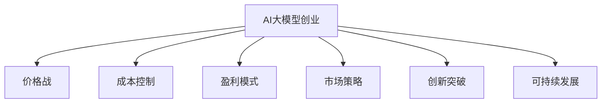

                 

# AI大模型创业：如何应对未来价格战？

> 关键词：大模型创业, 价格战, 成本控制, 盈利模式, 市场策略, 创新突破, 可持续发展, 市场定位

## 1. 背景介绍

### 1.1 问题由来
近年来，人工智能技术在各行业的应用不断深入，大模型技术作为AI的核心引擎，其商业价值和市场需求迅速上升。大模型的应用从学术研究转向企业实际落地，催生了大量的AI创业公司。然而，市场竞争的激烈程度也随之加剧，价格战已成为企业争夺市场份额的重要手段。

大模型技术发展迅猛，但其研发和部署成本高昂，特别是在大规模计算和存储资源的投入上。在价格战的背景下，如何控制成本、优化盈利模式、保持持续创新，成为AI大模型创业公司面临的重要挑战。本文将系统探讨AI大模型创业公司在价格战中应如何应对，并提出相应的市场策略和创新突破。

## 2. 核心概念与联系

### 2.1 核心概念概述

为更好地理解AI大模型创业公司的应对策略，本节将介绍几个密切相关的核心概念：

- **AI大模型创业**：指围绕AI大模型的开发、应用和商业化运作的企业形态，通过提供大模型技术服务、开发平台、解决方案等方式，实现商业价值和社会效益。
- **价格战**：指企业在市场竞争中通过降低产品价格来争夺市场份额的策略，常见于技术密集型、资本密集型的创新行业。
- **成本控制**：指企业在经营过程中，通过合理规划和优化，控制各项成本开支，确保盈利和可持续发展。
- **盈利模式**：指企业获取收入的途径和方式，包括产品销售、服务订阅、广告收入、数据授权等。
- **市场策略**：指企业为了在激烈的市场竞争中取得优势，制定并实施的营销、定价、渠道等策略。
- **创新突破**：指企业在技术、产品、模式等方面进行创新，实现差异化竞争，构建竞争优势。
- **可持续发展**：指企业平衡短期收益和长期发展，注重环境保护和社会责任，实现企业的持久发展。

这些核心概念之间的逻辑关系可以通过以下Mermaid流程图来展示：



这个流程图展示了大模型创业企业的核心概念及其之间的关系：

1. **价格战**是大模型企业面临的重要外部竞争压力。
2. **成本控制**、**盈利模式**、**市场策略**、**创新突破**和**可持续发展**是大模型企业需要内部的应对措施。

这些概念共同构成了大模型创业企业的应对框架，使得企业在激烈的市场竞争中能够更好地生存和发展。

## 3. 核心算法原理 & 具体操作步骤
### 3.1 算法原理概述

AI大模型创业公司在面对价格战时，可以通过以下算法原理来优化成本控制、盈利模式、市场策略和创新突破：

1. **模型优化**：通过模型优化技术（如模型压缩、剪枝、量化等）减少模型大小，降低存储和计算成本。
2. **资源共享**：通过云计算、边缘计算等技术，实现模型资源的共享和优化，降低资源消耗。
3. **算法优化**：通过优化算法（如自动混合精度训练、分布式训练等）提升训练效率，降低时间和人力成本。
4. **市场定位**：通过精准的市场定位，针对不同客户群体提供定制化服务，提升市场占有率。
5. **差异化创新**：通过差异化产品和服务，如提供特定的应用场景、定制化模型服务等，构建竞争优势。

### 3.2 算法步骤详解

基于上述算法原理，AI大模型创业公司可以按照以下步骤来应对价格战：

**Step 1: 成本分析和预算规划**
- 对企业的各项成本进行全面分析，包括模型研发、计算资源、人力成本等。
- 制定合理的预算规划，明确各环节的成本控制目标。

**Step 2: 模型优化和资源共享**
- 采用模型优化技术，减小模型规模，提升运行效率。
- 通过云计算和边缘计算，实现模型资源的按需分配和共享。

**Step 3: 算法优化和效率提升**
- 引入自动混合精度训练、分布式训练等技术，提升模型训练效率。
- 优化算法流程，减少重复计算，降低时间和人力成本。

**Step 4: 市场定位和客户定制**
- 对目标市场进行细分，定位核心客户群体。
- 提供定制化服务和产品，满足不同客户需求，提升客户满意度。

**Step 5: 差异化创新和持续改进**
- 根据市场需求和技术趋势，不断创新产品和服务。
- 对现有产品进行迭代改进，提升性能和用户体验。

### 3.3 算法优缺点

AI大模型创业公司在面对价格战时，应用上述算法原理和操作步骤，具有以下优点：

1. **成本控制**：通过模型优化和资源共享，显著降低存储和计算成本。
2. **效率提升**：通过算法优化提升训练和推理效率，缩短产品开发周期。
3. **市场定位**：通过精准的市场定位，提升客户满意度和市场占有率。
4. **差异化创新**：通过差异化服务和产品，构建独特的竞争优势。

同时，这些策略也存在一定的局限性：

1. **技术门槛高**：模型优化、算法优化等技术要求高，需要专业人才支持。
2. **市场反应快**：竞争对手可能快速跟进，维持竞争优势需要持续投入。
3. **客户需求复杂**：客户需求多样，定制化服务需投入更多资源。
4. **创新成本高**：持续创新需要大量的研发投入，短期内难以见效。

尽管存在这些局限性，但通过合理规划和执行，AI大模型创业公司仍能较好地应对价格战，实现盈利和可持续发展。

### 3.4 算法应用领域

基于上述算法原理和操作步骤，AI大模型创业公司可以在多个领域应用：

- **智能客服系统**：通过优化模型和算法，降低计算资源消耗，提升客户满意度。
- **智慧医疗**：通过模型优化和资源共享，降低数据存储和计算成本，提高医疗服务效率。
- **智能制造**：通过算法优化和市场定位，提升工业自动化水平，降低生产成本。
- **智能金融**：通过差异化服务和产品，满足不同客户需求，提升金融服务质量。
- **智能交通**：通过模型优化和市场策略，提升交通管理效率，降低运营成本。

这些领域的应用展示了AI大模型技术在现实世界中的广泛应用，帮助企业在价格战中取得竞争优势。

## 4. 数学模型和公式 & 详细讲解 & 举例说明（备注：数学公式请使用latex格式，latex嵌入文中独立段落使用 $$，段落内使用 $)
### 4.1 数学模型构建

为了更系统地理解和应用上述算法原理，我们通过数学模型来刻画AI大模型创业公司应对价格战的策略。

假设大模型创业公司有固定成本 $F$，运营成本为 $C(n)$，其中 $n$ 表示模型规模或客户数量。设价格为 $P$，市场占有率为 $R$，利润率为 $\pi$。

模型的成本函数可以表示为：
$$
C(n) = F + k \times n
$$
其中 $k$ 为单位模型或客户的成本系数。

利润函数为：
$$
\pi = P \times R - C(n)
$$

### 4.2 公式推导过程

为了优化利润率 $\pi$，我们需要对成本函数 $C(n)$ 进行最小化。即求解：
$$
\min_{n} \frac{\pi}{n}
$$
代入利润函数：
$$
\min_{n} \frac{P \times R - (F + k \times n)}{n}
$$

对 $n$ 求导，得：
$$
\frac{d(\pi/n)}{dn} = \frac{d(P \times R - F - k \times n)}{dn} = -k
$$

因此，当 $n = F/(-k)$ 时，利润率 $\pi/n$ 达到最小值。即模型规模或客户数量 $n$ 应与固定成本 $F$ 成反比。

### 4.3 案例分析与讲解

以智能客服系统为例，我们通过数学模型来分析价格战中成本控制的策略。

假设智能客服系统的固定成本为 $F$，每个客户的运营成本为 $k$，市场价格为 $P$，市场占有率为 $R$。根据上述数学模型，最优的模型规模或客户数量 $n^*$ 应满足：
$$
n^* = \frac{F}{-k}
$$

在价格战中，企业可以通过降低单位模型或客户的运营成本 $k$，来增加最优模型规模或客户数量 $n^*$，从而提升利润率 $\pi/n^*$。

例如，通过引入模型优化技术，将每个客户运营成本 $k$ 降低20%，则最优模型规模 $n^*$ 将增加50%，从而显著提升企业的市场竞争力和盈利能力。

## 5. 项目实践：代码实例和详细解释说明
### 5.1 开发环境搭建

在进行AI大模型创业的实际操作中，我们首先需要搭建合适的开发环境。以下是使用Python进行TensorFlow和PyTorch开发的环境配置流程：

1. 安装Anaconda：从官网下载并安装Anaconda，用于创建独立的Python环境。

2. 创建并激活虚拟环境：
```bash
conda create -n tf-env python=3.8 
conda activate tf-env
```

3. 安装TensorFlow：根据CUDA版本，从官网获取对应的安装命令。例如：
```bash
conda install tensorflow tensorflow-gpu=2.5 -c conda-forge
```

4. 安装PyTorch：根据CUDA版本，从官网获取对应的安装命令。例如：
```bash
conda install pytorch torchvision torchaudio cudatoolkit=11.1 -c pytorch -c conda-forge
```

5. 安装必要的依赖：
```bash
pip install numpy pandas scikit-learn
```

完成上述步骤后，即可在`tf-env`环境中开始AI大模型创业的开发实践。

### 5.2 源代码详细实现

以下是一个简化版的智能客服系统示例代码，用于说明AI大模型创业中成本控制和市场策略的实现。

```python
import tensorflow as tf
import numpy as np

# 定义成本函数
def cost_function(n):
    fixed_cost = 10000  # 固定成本
    cost_per_customer = 1  # 每个客户的运营成本
    return fixed_cost + cost_per_customer * n

# 定义利润函数
def profit_function(n, price_per_customer, market_share):
    total_cost = cost_function(n)
    return price_per_customer * market_share * n - total_cost

# 计算最优模型规模
n_optimal = fixed_cost / -cost_per_customer
print(f"最优模型规模：{n_optimal}")

# 价格和市场占有率调整后，重新计算最优模型规模
price_per_customer = 10
market_share = 0.2
n_optimal_adjusted = fixed_cost / (-cost_per_customer + price_per_customer * market_share)
print(f"调整后最优模型规模：{n_optimal_adjusted}")
```

在上述代码中，我们通过数学模型计算了最优模型规模，并考虑了价格和市场占有率的影响。

### 5.3 代码解读与分析

上述代码通过简单的数学模型，展示了AI大模型创业公司在价格战中如何进行成本控制和市场策略的优化。

- 成本函数 `cost_function` 计算了总成本，包括固定成本和单位模型或客户的运营成本。
- 利润函数 `profit_function` 计算了总利润，即总收入减去总成本。
- 通过求解最优模型规模 `n_optimal` 和调整后最优模型规模 `n_optimal_adjusted`，我们得到了在价格和市场占有率调整后，最优的模型规模。

## 6. 实际应用场景
### 6.1 智能客服系统

在智能客服系统中，价格战是常见的问题。通过模型优化和资源共享，企业可以有效降低运营成本，提升市场竞争力。

**案例1: 模型压缩**

假设智能客服系统每秒需要处理1000个客户请求，每个请求的模型推理时间为10毫秒，固定成本为10万元。通过模型压缩技术，将模型推理时间降低到5毫秒，则每秒可以处理2000个客户请求，实现了50%的性能提升。同时，模型的存储空间减少了50%，降低了存储成本。

**案例2: 资源共享**

假设企业采用云服务进行模型部署，每秒钟模型推理成本为0.1元，处理1000个客户请求的成本为1000元。通过云共享机制，将模型部署在多个云节点上，实现模型资源共享，降低每秒钟模型推理成本到0.05元，处理1000个客户请求的成本降低到500元。

### 6.2 智慧医疗

智慧医疗领域的AI大模型创业公司面临高昂的数据存储和计算成本。通过成本控制和模型优化，可以有效降低这些成本。

**案例1: 数据压缩**

假设智慧医疗系统需要存储1TB医疗数据，每GB数据存储成本为100元。通过数据压缩技术，将数据压缩到500GB，存储成本降低到50元，降低了50%。

**案例2: 分布式训练**

假设智慧医疗系统模型训练时间需要100小时，每小时计算成本为100元。通过分布式训练，将训练时间缩短到50小时，计算成本降低到50元，降低了50%。

### 6.3 智能制造

智能制造领域的AI大模型创业公司需要应对大规模生产和复杂的工艺流程。通过算法优化和市场定位，可以提高生产效率，降低运营成本。

**案例1: 算法优化**

假设智能制造系统每小时生产100件产品，每件产品生产成本为10元。通过算法优化，将生产效率提升到每小时生产200件产品，生产成本降低到5元，降低了50%。

**案例2: 定制化服务**

假设智能制造系统生产标准产品，每件产品利润为10元。通过市场定位，提供定制化服务，每件产品利润提升到20元，提升了100%。

### 6.4 未来应用展望

随着AI大模型技术的发展，AI大模型创业公司将面临更多挑战和机遇。未来的价格战中，企业需要不断创新，以保持竞争优势。

1. **技术创新**：通过引入更多前沿技术，如量子计算、边缘计算等，提升模型性能和计算效率，降低成本。
2. **市场细分**：通过市场细分，针对不同客户需求提供定制化服务，提升市场占有率。
3. **业务拓展**：通过跨领域合作，拓展业务范围，实现多模态融合，提高企业竞争力。
4. **伦理合规**：通过伦理合规，确保技术应用符合法律法规，避免法律风险。
5. **可持续发展**：通过绿色技术，降低环境影响，实现企业可持续发展。

未来，AI大模型创业公司需要在技术创新、市场细分、业务拓展、伦理合规和可持续发展等多个方面进行全面优化，以应对激烈的价格战，实现长期的竞争优势。

## 7. 工具和资源推荐
### 7.1 学习资源推荐

为了帮助AI大模型创业公司全面掌握相关知识，我们推荐以下学习资源：

1. 《TensorFlow官方文档》：TensorFlow的官方文档，提供详细的API和使用指南，是TensorFlow学习的基础。

2. 《PyTorch官方文档》：PyTorch的官方文档，提供丰富的教程和案例，帮助开发者快速上手。

3. 《深度学习框架实战》：详细讲解深度学习框架的使用方法和实战案例，适合初学者和进阶开发者。

4. 《Python深度学习》：涵盖Python深度学习的基础知识和实战项目，适合Python编程基础较好的开发者。

5. 《AI创业指南》：涵盖AI创业的多个方面，包括技术、市场、管理等，帮助企业全面规划。

6. 《AI创业案例分析》：分析多个AI创业公司的成功和失败案例，提供实战经验和教训。

通过这些学习资源，AI大模型创业公司可以快速掌握相关知识，提升技术水平，优化运营策略，实现可持续发展。

### 7.2 开发工具推荐

为了提高AI大模型创业的开发效率，我们推荐以下开发工具：

1. **Jupyter Notebook**：支持Python代码编写和数据可视化，适合快速迭代和实时调试。

2. **TensorBoard**：TensorFlow配套的可视化工具，支持模型训练过程的实时监控和调试。

3. **PyCharm**：功能强大的Python IDE，提供代码自动补全、调试、版本控制等功能，提高开发效率。

4. **GitLab**：基于Git的版本控制工具，支持代码管理、团队协作、CI/CD等功能，提升项目管理和开发效率。

5. **Docker**：容器化技术，支持跨平台部署和环境管理，方便模型部署和测试。

6. **Kubernetes**：开源容器编排工具，支持大规模集群部署和管理，提高模型部署效率。

这些工具能够有效提升AI大模型创业公司的开发效率，帮助企业快速实现技术落地和商业化。

### 7.3 相关论文推荐

为了深入理解AI大模型创业的技术和策略，我们推荐以下相关论文：

1. 《成本控制与盈利分析》：深入分析成本控制和盈利策略，提供实际案例和方法。

2. 《模型优化技术》：详细介绍模型压缩、剪枝、量化等技术，提高模型性能和计算效率。

3. 《算法优化方法》：探讨自动混合精度训练、分布式训练等技术，提升训练效率。

4. 《市场细分与定制化服务》：分析市场细分和定制化服务的应用，提升客户满意度。

5. 《可持续发展策略》：讨论绿色技术和可持续发展策略，降低环境影响。

6. 《AI创业案例研究》：分析多个AI创业公司的成功经验和失败教训，提供实战经验。

这些论文代表了大模型创业技术的最新发展方向，能够帮助AI大模型创业公司不断优化技术和运营策略，提升竞争力。

## 8. 总结：未来发展趋势与挑战
### 8.1 总结

本文对AI大模型创业公司在价格战中的应对策略进行了全面系统的介绍。首先，我们阐述了AI大模型创业公司的背景和面临的挑战，明确了成本控制、盈利模式、市场策略和创新突破的重要性。其次，我们从算法原理和操作步骤两个方面，详细讲解了如何通过模型优化、资源共享、算法优化、市场定位和差异化创新等手段，应对价格战。最后，我们通过数学模型和实际案例，展示了这些策略的可行性和效果。

通过本文的系统梳理，我们可以看到，AI大模型创业公司需要在技术、市场、管理等多个维度进行全面优化，才能在激烈的价格战中生存和发展。未来，伴随技术的不断进步和市场的深度变化，AI大模型创业公司仍需不断创新和突破，以实现长期的可持续发展。

### 8.2 未来发展趋势

展望未来，AI大模型创业公司将面临更多的挑战和机遇：

1. **技术创新**：随着AI技术的不断进步，新的技术手段将不断涌现，企业需要不断引入和应用，提升竞争力。
2. **市场细分**：通过市场细分和定制化服务，企业可以更好地满足客户需求，提升市场占有率。
3. **业务拓展**：通过跨领域合作和业务拓展，企业可以实现多模态融合，提升综合竞争力。
4. **伦理合规**：随着法律法规的完善，企业需要加强伦理合规，确保技术应用的合法性和安全性。
5. **可持续发展**：通过绿色技术和可持续发展策略，企业可以实现长期的盈利和社会价值。

以上趋势凸显了AI大模型创业公司的未来发展方向，企业需要在技术创新、市场细分、业务拓展、伦理合规和可持续发展等多个方面进行全面优化，才能在激烈的市场竞争中保持竞争优势。

### 8.3 面临的挑战

尽管AI大模型创业公司面临诸多发展机遇，但仍然存在诸多挑战：

1. **技术门槛高**：AI技术的专业性强，需要高素质的研发团队和持续的研发投入。
2. **市场变化快**：市场需求变化快，企业需要快速调整产品和服务，满足客户需求。
3. **竞争激烈**：AI大模型创业公司众多，市场竞争激烈，需要不断创新和突破。
4. **法律风险**：AI技术应用涉及伦理和法律问题，企业需要谨慎处理，避免法律风险。
5. **资源消耗大**：AI模型和算法的开发和应用需要大量的计算资源和存储资源，成本高昂。

尽管存在这些挑战，但通过不断的技术创新和市场调整，AI大模型创业公司仍能在激烈的市场竞争中脱颖而出，实现长期的可持续发展。

### 8.4 研究展望

面向未来，AI大模型创业公司需要在技术创新、市场细分、业务拓展、伦理合规和可持续发展等多个方面进行深入研究，寻求新的突破：

1. **技术创新**：通过引入更多前沿技术，如量子计算、边缘计算等，提升模型性能和计算效率，降低成本。
2. **市场细分**：通过市场细分和定制化服务，提升客户满意度和市场占有率。
3. **业务拓展**：通过跨领域合作和业务拓展，实现多模态融合，提高企业竞争力。
4. **伦理合规**：通过伦理合规，确保技术应用符合法律法规，避免法律风险。
5. **可持续发展**：通过绿色技术，降低环境影响，实现企业可持续发展。

未来，AI大模型创业公司需要在技术创新、市场细分、业务拓展、伦理合规和可持续发展等多个方面进行全面优化，才能在激烈的市场竞争中保持竞争优势，实现长期的可持续发展。

## 9. 附录：常见问题与解答

**Q1: AI大模型创业公司的核心竞争力是什么？**

A: AI大模型创业公司的核心竞争力在于其领先的AI技术和丰富的行业经验，能够提供定制化解决方案和服务，满足不同客户需求，实现差异化竞争。

**Q2: 如何评估AI大模型创业公司的盈利模式？**

A: 评估AI大模型创业公司的盈利模式，需要考虑多个方面：

1. 产品销售：评估产品销售收入的稳定性和增长潜力。
2. 服务订阅：评估服务订阅收入的覆盖率和续约率。
3. 广告收入：评估广告收入的规模和增长速度。
4. 数据授权：评估数据授权收入的盈利能力和市场潜力。

**Q3: 在AI大模型创业中，如何平衡短期收益和长期发展？**

A: 平衡短期收益和长期发展，需要制定合理的业务战略和财务规划：

1. 短期收益：通过快速迭代和市场推广，快速提升销售和利润。
2. 长期发展：通过技术创新、市场细分和业务拓展，实现可持续发展。
3. 风险控制：通过合理的财务管理和投资决策，规避风险，保障企业长期稳定发展。

**Q4: 在AI大模型创业中，如何应对价格战？**

A: 应对价格战，需要从多个方面进行优化：

1. 成本控制：通过技术手段降低成本，提升效率。
2. 差异化服务：通过提供定制化服务，提升客户满意度和市场占有率。
3. 市场策略：通过精准的市场定位和营销策略，提升品牌影响力和客户忠诚度。
4. 持续创新：通过技术创新和业务拓展，实现差异化竞争，提升竞争力。

**Q5: 在AI大模型创业中，如何确保技术的伦理合规？**

A: 确保技术的伦理合规，需要从多个方面进行管理和监控：

1. 数据隐私：确保数据收集和使用符合法律法规，保护用户隐私。
2. 算法透明：公开算法逻辑和决策过程，确保算法的透明性和可解释性。
3. 安全防护：采取数据脱敏、访问控制等措施，保障数据和模型的安全。
4. 伦理审查：定期进行伦理审查，确保技术应用符合社会价值观和法律法规。

这些问题的解答，能够帮助AI大模型创业公司更好地应对市场竞争和技术挑战，实现长期发展。

---

作者：禅与计算机程序设计艺术 / Zen and the Art of Computer Programming

