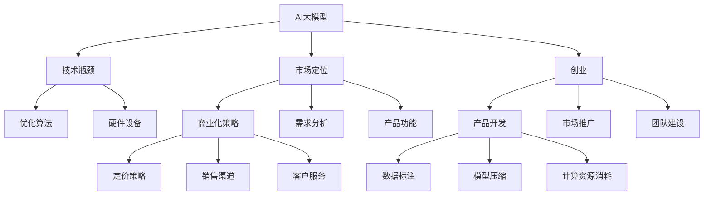

                 

# AI大模型创业：如何应对未来市场挑战？

> 关键词：AI大模型,创业,市场挑战,技术瓶颈,市场定位,商业化策略

## 1. 背景介绍

### 1.1 问题由来
近年来，人工智能(AI)技术不断突破，AI大模型在语音识别、图像识别、自然语言处理等领域取得了显著进展。这些模型以其强大的学习能力和泛化能力，在工业界和学术界都获得了广泛关注。然而，AI大模型的开发和部署面临着诸多挑战，从技术瓶颈到市场定位，再到商业化策略，都考验着创业者的智慧与勇气。本文将从多个角度探讨AI大模型创业面临的主要市场挑战，并给出应对策略。

## 2. 核心概念与联系

### 2.1 核心概念概述

为更好地理解AI大模型创业的市场挑战，本节将介绍几个密切相关的核心概念：

- AI大模型：指基于大规模深度学习模型，能够在图像、语音、文本等多个领域进行高性能推理和生成的模型。典型代表包括GPT系列、BERT、ResNet等。
- 创业：指创业者将技术转化为产品的过程，涉及产品开发、市场推广、团队建设等环节。
- 市场挑战：指在AI大模型创业过程中，创业者面临的各种市场障碍和问题，包括技术瓶颈、市场定位、商业化策略等。
- 技术瓶颈：指在大模型开发和部署过程中遇到的技术难题，如计算资源消耗、模型压缩、数据标注等。
- 市场定位：指根据市场需求，合理规划产品功能和定位，明确产品差异化优势。
- 商业化策略：指如何将技术转化为有市场竞争力的产品，涉及定价策略、销售渠道、客户服务等环节。

这些核心概念之间的逻辑关系可以通过以下Mermaid流程图来展示：



这个流程图展示了大模型创业的核心概念及其之间的关系：

1. AI大模型作为创业的基础，需要解决技术瓶颈，才能获得市场竞争力。
2. 市场定位和商业化策略是创业成功的关键，决定产品的市场接受度和盈利能力。
3. 创业涉及产品开发、市场推广和团队建设等环节，各环节缺一不可。
4. 数据标注、模型压缩、计算资源消耗等技术瓶颈，需要通过优化算法、硬件设备等方式解决。

## 3. 核心算法原理 & 具体操作步骤
### 3.1 算法原理概述

AI大模型的创业核心在于如何将技术转化为有市场竞争力的产品。技术瓶颈、市场定位和商业化策略是其面临的主要市场挑战。

1. **技术瓶颈**：包括数据标注、模型压缩、计算资源消耗等问题。需要通过优化算法、改进硬件设备等方式来解决。
2. **市场定位**：需要根据市场需求，明确产品功能和定位，以便精准地吸引客户。
3. **商业化策略**：包括定价策略、销售渠道、客户服务等环节，需要制定合理的策略，确保产品能够成功进入市场。

### 3.2 算法步骤详解

AI大模型创业的步骤主要包括以下几个关键环节：

**Step 1: 技术研发与优化**
- 收集标注数据，建立数据集，并进行数据预处理和标注。
- 选择合适的大模型架构，并进行模型训练和优化。
- 应用模型压缩、硬件优化等技术，降低计算资源消耗。

**Step 2: 市场定位与功能规划**
- 进行市场调研，分析用户需求和竞争环境，确定产品功能和差异化优势。
- 制定产品路线图，确定迭代优先级和时间节点。
- 根据市场需求，调整产品功能和性能指标。

**Step 3: 商业化策略与推广**
- 制定定价策略，合理定价，确保产品具有市场竞争力。
- 选择适合的销售渠道，制定营销方案，进行市场推广。
- 提供优质的客户服务，建立良好的品牌口碑。

**Step 4: 团队建设与管理**
- 组建核心团队，确保技术和产品研发有足够的资源支持。
- 建立高效的团队沟通机制，确保项目进度和目标一致。
- 吸引和留住优秀人才，提升团队创新能力和执行力。

### 3.3 算法优缺点

AI大模型创业的优势在于其强大的技术基础和潜力，但同时也面临诸多挑战：

1. **技术瓶颈**：大模型对计算资源和数据标注的需求较高，开发和部署成本较高。但优势在于其高精度和泛化能力，能够解决复杂问题。
2. **市场定位**：市场竞争激烈，需要对产品功能进行精细化设计和差异化竞争。但市场需求多变，需要快速响应和迭代。
3. **商业化策略**：产品定价、销售渠道、客户服务等环节需要细致规划，确保产品能够成功进入市场。但市场环境多变，需要灵活调整策略。

### 3.4 算法应用领域

AI大模型创业的应用领域广泛，涵盖多个行业，如医疗、金融、零售、制造等。具体应用包括：

- 医疗影像识别：大模型可以通过标注图像数据，识别病灶、病变等，辅助医生诊断。
- 金融风险预测：利用大模型对历史数据进行学习和预测，评估信贷风险和市场趋势。
- 智能客服系统：通过微调大模型，实现自然语言处理和用户对话，提升客户服务体验。
- 零售推荐系统：大模型可以根据用户行为数据，推荐个性化的商品和内容。
- 制造质量控制：通过图像识别和分析，检测产品质量缺陷，提升制造效率和品质。

## 4. 数学模型和公式 & 详细讲解 & 举例说明
### 4.1 数学模型构建

AI大模型的数学模型通常包括两个部分：前向计算和损失函数。

前向计算用于将输入数据转化为模型的输出，常见的前向计算公式为：

$$
\hat{y} = f(\theta, x)
$$

其中 $\hat{y}$ 为模型输出，$f(\cdot)$ 为前向计算函数，$\theta$ 为模型参数，$x$ 为输入数据。

损失函数用于衡量模型的预测输出与真实标签之间的差异，常见的损失函数包括交叉熵损失、均方误差损失等。

$$
\mathcal{L} = \frac{1}{N}\sum_{i=1}^N \ell(\hat{y}_i, y_i)
$$

其中 $\ell(\cdot)$ 为损失函数，$N$ 为样本数量，$\hat{y}_i$ 和 $y_i$ 分别为模型输出和真实标签。

### 4.2 公式推导过程

以二分类任务为例，交叉熵损失函数的推导过程如下：

设模型对输入 $x$ 的预测概率为 $p$，真实标签为 $y$，则二分类交叉熵损失函数为：

$$
\ell(p,y) = -[y\log p + (1-y)\log(1-p)]
$$

带入公式 $$
\mathcal{L} = \frac{1}{N}\sum_{i=1}^N \ell(\hat{y}_i, y_i)
$$

得：

$$
\mathcal{L} = -\frac{1}{N}\sum_{i=1}^N [y_i\log \hat{y}_i + (1-y_i)\log(1-\hat{y}_i)]
$$

### 4.3 案例分析与讲解

假设有一个AI大模型创业项目，主要功能是医疗影像识别。以下是该项目的详细分析：

- **数据准备**：从医院获取1万张标注的影像数据，使用机器学习算法进行数据预处理和标注。
- **模型选择**：选择ResNet作为基础模型，并进行迁移学习，微调模型参数以适应医疗影像数据的特征。
- **模型训练**：使用GPU集群进行模型训练，设置合适的超参数和优化算法，训练过程中进行正则化和Dropout以避免过拟合。
- **模型优化**：应用模型压缩技术和硬件加速技术，降低模型计算资源消耗，提升推理速度。
- **市场定位**：通过调研，发现目标客户为中小医院和诊所，需求集中在快速诊断和初步筛查。因此，将产品定位为快速筛查工具，强调其高效和易用性。
- **商业化策略**：采用SaaS模式，提供按月订阅服务，设置合理价格，并开展市场推广活动。同时，提供优质的客户支持和技术培训，提升用户满意度。

## 5. 项目实践：代码实例和详细解释说明
### 5.1 开发环境搭建

在进行AI大模型创业项目开发前，需要搭建一个适合的开发环境。以下是常见的开发环境搭建流程：

1. **安装Python**：下载并安装最新版本的Python，例如：
```bash
sudo apt-get update && sudo apt-get install python3
```

2. **安装虚拟环境**：使用pip安装virtualenv或conda，创建虚拟环境：
```bash
pip install virtualenv
virtualenv venv
source venv/bin/activate
```

3. **安装依赖库**：安装常用的依赖库，如TensorFlow、PyTorch、Keras等：
```bash
pip install tensorflow==2.4.1
pip install pytorch torchvision torchaudio
pip install keras
```

4. **配置GPU**：安装CUDA和cuDNN，以支持GPU加速：
```bash
# 安装CUDA
curl -s https://developer.download.nvidia.com/compute/cuda/repos/ubuntu2004/x86_64/cuda-repo-ubuntu2004_11.0.221-1_amd64.deb | sudo dpkg -i -
sudo apt-get update && sudo apt-get install -y cuda
# 安装cuDNN
wget https://developer.nvidia.com/compute/cuda/repos/ubuntu2004/x86_64/cudnn-repo-ubuntu2004_8.0.4.11-1_amd64.deb
sudo dpkg -i cudnn-repo-ubuntu2004_8.0.4.11-1_amd64.deb
sudo apt-get update
sudo apt-get install libcudnn8 libcudnn8-dev libcudnn8-plugin libnccl2 libnccl-dev libnccl-pairwise libnccl-backend libnccl-consensus libcudnn8-plugin libnccl-ps libnccl-channel libcudnn8-plugin libnccl-backend libcudnn8 libcudnn8-dev libcudnn8 plugin-loads cudnn-libs cuDNN sample-cuDNN-api-cxx
```

### 5.2 源代码详细实现

以下是AI大模型创业项目中医疗影像识别的代码实现：

**1. 数据准备**
```python
import os
import cv2

# 加载标注数据
train_data = []
train_labels = []
with open('train.txt', 'r') as f:
    for line in f:
        label, path = line.strip().split()
        train_data.append(cv2.imread(os.path.join('train', path)))
        train_labels.append(int(label))

# 数据预处理
train_data = [cv2.resize(x, (224, 224)) for x in train_data]
train_data = [x / 255.0 for x in train_data]
train_data = np.array(train_data)
train_labels = np.array(train_labels)
```

**2. 模型训练**
```python
import tensorflow as tf
from tensorflow.keras.layers import Conv2D, Flatten, Dense, Input
from tensorflow.keras.models import Model

# 定义模型结构
input_layer = Input(shape=(224, 224, 3))
x = Conv2D(32, 3, activation='relu')(input_layer)
x = Conv2D(64, 3, activation='relu')(x)
x = Flatten()(x)
x = Dense(128, activation='relu')(x)
output_layer = Dense(1, activation='sigmoid')(x)

model = Model(inputs=input_layer, outputs=output_layer)
model.compile(optimizer='adam', loss='binary_crossentropy', metrics=['accuracy'])

# 训练模型
model.fit(train_data, train_labels, epochs=10, batch_size=32)
```

**3. 模型优化**
```python
# 应用模型压缩和硬件优化技术
from tensorflow.keras.applications.resnet50 import ResNet50

# 加载预训练模型
resnet = ResNet50(weights='imagenet')
for layer in resnet.layers:
    layer.trainable = False

# 替换模型顶层
x = resnet.output
x = Flatten()(x)
x = Dense(128, activation='relu')(x)
output_layer = Dense(1, activation='sigmoid')(x)

resnet_model = Model(inputs=resnet.input, outputs=output_layer)
resnet_model.compile(optimizer='adam', loss='binary_crossentropy', metrics=['accuracy'])

# 训练模型
resnet_model.fit(train_data, train_labels, epochs=10, batch_size=32)
```

**4. 市场定位**
通过调研，目标客户为中小医院和诊所，需求集中在快速诊断和初步筛查。因此，将产品定位为快速筛查工具，强调其高效和易用性。

**5. 商业化策略**
采用SaaS模式，提供按月订阅服务，设置合理价格，并开展市场推广活动。同时，提供优质的客户支持和技术培训，提升用户满意度。

### 5.3 代码解读与分析

以下是关键代码的详细解读：

**数据准备**
- 使用`cv2.imread`加载图像数据。
- 将数据标准化为0-1之间的小数。

**模型训练**
- 使用Keras定义卷积神经网络模型。
- 应用Adam优化器进行训练，交叉熵损失函数进行优化。

**模型优化**
- 使用ResNet50作为基础模型，保留其卷积层，仅替换顶层。
- 应用Flatten和Dense层，进行二分类任务。

**市场定位**
- 通过调研，明确目标客户需求和市场定位。

**商业化策略**
- 采用SaaS模式，按月订阅收费。
- 提供优质客户支持和技术培训。

## 6. 实际应用场景
### 6.1 医疗影像识别
AI大模型在医疗影像识别中具有广泛应用，能够快速准确地诊断疾病。例如，通过微调大模型，识别影像中的病灶、病变等，辅助医生诊断。该应用可以大大减少医生的工作量，提高诊断效率和准确性。

### 6.2 金融风险预测
利用AI大模型对历史数据进行学习和预测，评估信贷风险和市场趋势。通过微调大模型，可以提供更为精准的风险评估和投资建议，帮助金融机构控制风险。

### 6.3 智能客服系统
通过微调大模型，构建智能客服系统，实现自然语言处理和用户对话，提升客户服务体验。该应用可以7x24小时不间断服务，快速响应客户咨询，用自然流畅的语言解答各类常见问题。

### 6.4 未来应用展望
随着AI大模型的不断发展，未来将在更多领域得到应用，为传统行业带来变革性影响。

## 7. 工具和资源推荐
### 7.1 学习资源推荐

为了帮助开发者系统掌握AI大模型的创业理论基础和实践技巧，这里推荐一些优质的学习资源：

1. 《深度学习》系列书籍：由Ian Goodfellow等著名学者撰写，系统介绍深度学习的理论基础和实践技巧。
2. CS231n《深度学习计算机视觉》课程：斯坦福大学开设的计算机视觉明星课程，涵盖图像识别、目标检测等前沿话题。
3. 《Python深度学习》书籍：Francois Chollet著作，详细介绍TensorFlow和Keras的使用方法。
4. Kaggle平台：提供大量数据集和竞赛，帮助开发者实践AI大模型在实际问题中的应用。
5. GitHub开源项目：收集和分享开源项目，涵盖深度学习、自然语言处理等多个领域。

通过对这些资源的学习实践，相信你一定能够快速掌握AI大模型创业的精髓，并用于解决实际的AI问题。

### 7.2 开发工具推荐

高效的开发离不开优秀的工具支持。以下是几款用于AI大模型创业开发的常用工具：

1. Jupyter Notebook：免费的交互式编程环境，支持Python和其他编程语言，方便进行数据处理和模型训练。
2. Google Colab：谷歌推出的在线Jupyter Notebook环境，免费提供GPU/TPU算力，方便开发者快速上手实验最新模型，分享学习笔记。
3. TensorFlow：由Google主导开发的开源深度学习框架，生产部署方便，适合大规模工程应用。
4. PyTorch：基于Python的开源深度学习框架，灵活动态的计算图，适合快速迭代研究。
5. Visual Studio Code：功能强大的代码编辑器，支持多种编程语言和版本控制工具。

合理利用这些工具，可以显著提升AI大模型创业任务的开发效率，加快创新迭代的步伐。

### 7.3 相关论文推荐

AI大模型和创业技术的发展源于学界的持续研究。以下是几篇奠基性的相关论文，推荐阅读：

1. Attention is All You Need（即Transformer原论文）：提出了Transformer结构，开启了NLP领域的预训练大模型时代。
2. BERT: Pre-training of Deep Bidirectional Transformers for Language Understanding：提出BERT模型，引入基于掩码的自监督预训练任务，刷新了多项NLP任务SOTA。
3. AI Challenges: Lessons from Deep Learning Success and Failures：总结了深度学习在AI领域的应用经验，提出了未来发展的方向。
4. Transfer Learning for Healthcare Data Mining and Analysis：探讨了AI在医疗领域的应用，提出了数据准备和模型微调的方法。
5. Survey on Deep Learning for Drug Discovery：综述了AI在药物发现中的应用，提供了丰富的案例和参考。

这些论文代表了大模型创业技术的发展脉络。通过学习这些前沿成果，可以帮助研究者把握学科前进方向，激发更多的创新灵感。

## 8. 总结：未来发展趋势与挑战
### 8.1 总结

本文对AI大模型创业面临的主要市场挑战进行了全面系统的介绍。首先阐述了AI大模型创业的背景和意义，明确了技术瓶颈、市场定位和商业化策略是其面临的主要市场挑战。其次，从原理到实践，详细讲解了AI大模型的数学模型和具体实现步骤，提供了完整的代码实例。同时，本文还探讨了AI大模型在医疗、金融、零售等多个行业的应用前景，展示了其广阔的市场潜力。此外，本文精选了创业过程中的学习资源、开发工具和相关论文，力求为读者提供全方位的技术指引。

通过本文的系统梳理，可以看到，AI大模型创业是一项充满挑战但极具潜力的项目。技术瓶颈、市场定位和商业化策略是其成功与否的关键因素。唯有从数据、算法、工程、业务等多个维度协同发力，才能真正实现AI大模型的商业化应用。未来，伴随技术的持续演进和市场的不断变化，AI大模型创业也将面临更多的机遇和挑战。

### 8.2 未来发展趋势

展望未来，AI大模型创业将呈现以下几个发展趋势：

1. **技术瓶颈逐渐缓解**：计算资源和数据标注的成本将逐步降低，AI大模型的应用范围和性能将进一步扩大。
2. **市场定位更加精准**：通过对市场需求和用户行为的深入分析，AI大模型将能够更加精准地定位目标客户和产品功能。
3. **商业化策略更加灵活**：多样化的商业模式，如按需服务、订阅服务等，将满足不同用户的需求和市场变化。
4. **应用领域更加广泛**：AI大模型将在更多行业和场景中得到应用，如医疗、金融、制造等，推动传统行业的数字化转型。
5. **技术创新不断涌现**：新的算法和技术不断涌现，如自监督学习、联邦学习等，将推动AI大模型的持续进步。

### 8.3 面临的挑战

尽管AI大模型创业具备巨大的潜力，但在迈向成功的过程中，仍面临着诸多挑战：

1. **技术瓶颈**：计算资源和数据标注的需求较高，开发和部署成本较高。
2. **市场定位**：需要对市场需求进行深入分析，确保产品具有市场竞争力。
3. **商业化策略**：需要灵活调整定价、销售渠道等策略，以适应市场变化。
4. **市场竞争**：面临众多竞争对手，需要不断提升产品性能和用户体验。
5. **客户支持**：需要提供优质的客户支持和技术培训，提升用户满意度。

### 8.4 研究展望

面对AI大模型创业所面临的挑战，未来的研究需要在以下几个方面寻求新的突破：

1. **优化技术瓶颈**：开发新的算法和技术，如模型压缩、硬件加速等，降低计算资源和数据标注的需求。
2. **提升市场定位能力**：通过大数据分析和用户调研，精准定位目标客户和产品功能。
3. **灵活调整商业化策略**：根据市场变化，灵活调整定价、销售渠道等策略，确保产品成功进入市场。
4. **加强市场竞争能力**：持续提升产品性能和用户体验，保持市场竞争力。
5. **提升客户支持能力**：提供优质的客户支持和技术培训，提升用户满意度。

总之，AI大模型创业需要从技术、市场、商业等多个维度进行全面优化，方能实现成功。未来，随着技术的持续演进和市场的不断变化，AI大模型创业也将迎来更多的机遇和挑战。只有勇于创新、敢于突破，才能在AI大模型创业的道路上不断前行，推动AI技术在各个领域的深入应用。

## 9. 附录：常见问题与解答

**Q1: AI大模型的计算资源需求较高，开发和部署成本较高，如何降低成本？**

A: 可以通过以下方式降低成本：
1. 采用分布式计算：使用多台机器进行模型训练和推理，提高计算效率。
2. 应用模型压缩技术：减少模型参数量，降低内存和存储需求。
3. 使用开源工具：选择免费或低成本的开源工具，如TensorFlow、PyTorch等，降低开发成本。
4. 应用数据增强技术：通过数据增强技术扩充训练集，提高模型泛化能力，减少标注数据需求。

**Q2: AI大模型的市场定位和产品功能如何确定？**

A: 通过以下方式确定市场定位和产品功能：
1. 进行市场调研：了解目标客户的需求和市场竞争环境。
2. 分析用户行为：收集用户反馈和行为数据，确定用户痛点和需求。
3. 设计产品原型：根据市场需求和用户反馈，设计产品原型并进行测试。
4. 迭代优化产品：根据测试结果和用户反馈，不断优化产品功能和性能。

**Q3: AI大模型的商业化策略有哪些？**

A: 常见的商业化策略包括：
1. 按需服务：按用户需求和使用量收费，提供个性化的服务。
2. 订阅服务：按月或按年订阅，提供持续的服务和支持。
3. 按使用量收费：根据用户使用量进行收费，提供更灵活的定价方案。
4. 免费试用：提供免费试用期，吸引用户试用和转化。
5. 合作伙伴模式：与合作伙伴合作，共同推广和销售产品。

**Q4: AI大模型的开发环境如何搭建？**

A: 搭建AI大模型开发环境的步骤如下：
1. 安装Python：从官网下载并安装最新版本的Python。
2. 安装虚拟环境：使用pip安装virtualenv或conda，创建虚拟环境。
3. 安装依赖库：安装常用的依赖库，如TensorFlow、PyTorch、Keras等。
4. 配置GPU：安装CUDA和cuDNN，以支持GPU加速。

**Q5: AI大模型的开发工具有哪些？**

A: 常用的AI大模型开发工具包括：
1. Jupyter Notebook：免费的交互式编程环境，支持Python和其他编程语言。
2. Google Colab：免费的在线Jupyter Notebook环境，支持GPU/TPU算力。
3. TensorFlow：由Google主导开发的深度学习框架，生产部署方便。
4. PyTorch：基于Python的开源深度学习框架，灵活动态的计算图。
5. Visual Studio Code：功能强大的代码编辑器，支持多种编程语言和版本控制工具。

**Q6: AI大模型的学习资源有哪些？**

A: 常用的AI大模型学习资源包括：
1. 《深度学习》系列书籍：由Ian Goodfellow等著名学者撰写，系统介绍深度学习的理论基础和实践技巧。
2. CS231n《深度学习计算机视觉》课程：斯坦福大学开设的计算机视觉明星课程，涵盖图像识别、目标检测等前沿话题。
3. 《Python深度学习》书籍：Francois Chollet著作，详细介绍TensorFlow和Keras的使用方法。
4. Kaggle平台：提供大量数据集和竞赛，帮助开发者实践AI大模型在实际问题中的应用。
5. GitHub开源项目：收集和分享开源项目，涵盖深度学习、自然语言处理等多个领域。

以上是AI大模型创业过程中常见问题及其解答，希望对创业者和开发者有所帮助。

---

作者：禅与计算机程序设计艺术 / Zen and the Art of Computer Programming

