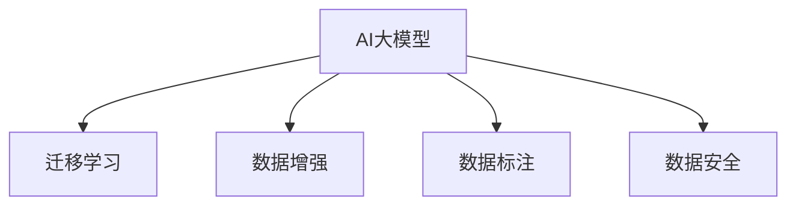

                 

# AI大模型创业：如何应对未来数据挑战？

## 1. 背景介绍

### 1.1 问题由来

随着人工智能技术的快速发展，AI大模型在各行各业的应用日益广泛，从自然语言处理到计算机视觉，再到语音识别，AI大模型在各个领域展现了强大的潜力。然而，尽管AI大模型在算法和计算资源上的优势显著，但其训练和应用过程中面临的数据挑战却日益凸显。

数据是AI大模型的基础，数据的质量、数量和多样性直接决定了模型性能的优劣。但随着数据获取难度和成本的增加，数据获取成为创业公司和技术应用的重要瓶颈。如何在数据稀缺的条件下，提升AI大模型的性能，是当前AI大模型创业和技术应用的一大难点。

### 1.2 问题核心关键点

面对数据挑战，AI大模型的创业者和开发者需要解决以下几个核心问题：

- **数据获取**：如何高效、低成本地获取高质量的标注数据。
- **数据增强**：如何在有限的标注数据上，通过数据增强技术提高模型性能。
- **数据集优化**：如何优化数据集，构建高效的数据流，提升数据处理效率。
- **数据标注**：如何自动化标注，降低人工标注成本和时间。
- **数据安全**：如何在数据共享和应用中，保证数据安全和隐私。

本文将从数据获取、数据增强、数据集优化、数据标注和数据安全等方面，探讨AI大模型创业者和开发者如何应对未来数据挑战。

## 2. 核心概念与联系

### 2.1 核心概念概述

为更好地理解如何应对AI大模型中的数据挑战，本节将介绍几个密切相关的核心概念：

- **AI大模型**：指通过大规模数据训练得到的深度学习模型，具有强大的通用学习能力和跨领域迁移能力。
- **迁移学习**：指将一个领域学到的知识，迁移到另一个不同但相关的领域的学习范式。通过迁移学习，可以显著提高新任务的学习效率和性能。
- **数据增强**：指通过对原始数据进行各种变换，生成更多训练样本，从而提高模型泛化能力的技术。
- **数据标注**：指将原始数据标注为模型可用的形式，通常需要人工参与，对数据质量和获取成本有直接影响。
- **数据安全**：指在数据共享和应用过程中，保护数据隐私和安全的策略和手段。

这些核心概念之间的逻辑关系可以通过以下Mermaid流程图来展示：



这个流程图展示了大模型中的核心概念及其之间的关系：

1. AI大模型是数据处理和应用的基础。
2. 迁移学习是连接预训练模型与下游任务的桥梁。
3. 数据增强是提升模型泛化能力的有效手段。
4. 数据标注是模型训练的关键步骤。
5. 数据安全是数据应用中的重要保障。

这些概念共同构成了AI大模型的核心框架，使得模型能够更好地适应特定任务，并在不同领域和场景中发挥作用。通过理解这些概念，我们可以更好地把握AI大模型的工作原理和优化方向。

## 3. 核心算法原理 & 具体操作步骤
### 3.1 算法原理概述

面对数据挑战，AI大模型的创业者需要掌握多种技术手段，包括迁移学习、数据增强、数据集优化、数据标注和数据安全等。本节将从原理和步骤的角度，详细介绍这些技术方法。

### 3.2 算法步骤详解

**3.2.1 迁移学习**

迁移学习的核心思想是：利用预训练模型在新任务上的泛化能力，通过少量标注数据进行微调，提升模型性能。具体步骤如下：

1. **选择合适的预训练模型**：根据任务的复杂度，选择适合的预训练模型，如BERT、GPT等。
2. **微调模型**：使用任务数据对预训练模型进行微调，调整模型结构或参数，使其适应新任务。
3. **评估和优化**：在验证集上评估微调后的模型性能，根据评估结果调整超参数和模型结构。

**3.2.2 数据增强**

数据增强是一种通过扩充训练集来提高模型泛化能力的技术。具体步骤如下：

1. **数据集预处理**：对原始数据进行清洗和预处理，去除噪声和冗余信息。
2. **生成增强数据**：使用数据增强技术生成更多的训练样本，如数据旋转、平移、缩放等。
3. **训练模型**：在增强数据上训练模型，提高模型对数据变化的鲁棒性。

**3.2.3 数据集优化**

数据集优化是构建高效数据流的关键步骤，包括数据分割、批量处理等。具体步骤如下：

1. **数据分割**：将数据集分割为训练集、验证集和测试集，以评估模型性能和优化模型结构。
2. **批量处理**：使用批量处理技术，提高数据加载和处理的效率。
3. **数据流优化**：优化数据流的读取和处理，减少数据延迟和计算开销。

**3.2.4 数据标注**

数据标注是模型训练的关键步骤，通常需要人工参与。具体步骤如下：

1. **标签设计**：设计合理的标签体系，确保标签能够准确描述数据内容。
2. **标注工具**：选择合适的标注工具，提高标注效率和质量。
3. **标注质量控制**：对标注结果进行质量控制，确保标注数据的一致性和准确性。

**3.2.5 数据安全**

数据安全是数据应用中的重要保障，具体步骤如下：

1. **数据加密**：对数据进行加密处理，保护数据隐私。
2. **访问控制**：设置访问控制策略，限制数据的访问权限。
3. **审计和监控**：对数据使用和共享进行审计和监控，防止数据泄露和滥用。

### 3.3 算法优缺点

**迁移学习**

优点：
- 提升模型性能：通过迁移学习，可以利用预训练模型的泛化能力，提升新任务的性能。
- 降低标注成本：迁移学习可以显著减少新任务所需的标注数据量，降低标注成本。

缺点：
- 任务差异大时效果有限：如果任务与预训练模型的分布差异较大，迁移学习的效果可能不理想。
- 模型依赖预训练质量：预训练模型的质量直接影响迁移学习的效果。

**数据增强**

优点：
- 提升泛化能力：通过数据增强，生成更多的训练样本，提高模型的泛化能力。
- 减少过拟合：数据增强可以有效缓解过拟合问题，提高模型的鲁棒性。

缺点：
- 可能引入噪声：数据增强可能引入噪声，影响模型性能。
- 增强效果有限：数据增强对提升模型性能的效果是有限的，需要结合其他技术手段。

**数据集优化**

优点：
- 提高处理效率：通过数据集优化，可以显著提高数据处理的效率。
- 增强模型性能：优化数据流可以更好地利用数据，提高模型的性能。

缺点：
- 依赖硬件资源：数据集优化依赖于硬件资源的配置，可能会增加成本。
- 复杂度较高：数据集优化涉及到多个环节的调整，实现起来较为复杂。

**数据标注**

优点：
- 提升模型性能：标注数据是模型训练的基础，标注质量直接影响模型性能。
- 易于自动化：使用自动化标注工具可以显著提高标注效率和准确性。

缺点：
- 标注成本高：高质量的数据标注需要人工参与，成本较高。
- 可能存在标注偏差：标注过程中可能存在主观偏差，影响标注数据的质量。

**数据安全**

优点：
- 保障数据隐私：数据加密和访问控制可以有效保护数据隐私。
- 防止数据滥用：审计和监控可以防止数据滥用和泄露。

缺点：
- 成本较高：数据安全需要投入大量资源，包括技术和人力成本。
- 可能存在漏洞：数据安全措施可能存在漏洞，需要不断更新和完善。

### 3.4 算法应用领域

AI大模型的迁移学习、数据增强、数据集优化、数据标注和数据安全等技术手段，已经在多个领域得到了广泛应用：

- **医疗**：在医学影像分析、疾病预测、个性化治疗等方面，AI大模型通过迁移学习、数据增强等技术，提升了诊断和治疗的精准度。
- **金融**：在风险评估、欺诈检测、智能投顾等方面，AI大模型通过迁移学习、数据标注等技术，提高了金融服务的智能化水平。
- **零售**：在客户推荐、库存管理、智能客服等方面，AI大模型通过迁移学习、数据增强等技术，优化了零售业务流程，提升了客户体验。
- **制造业**：在质量检测、设备预测性维护、供应链优化等方面，AI大模型通过迁移学习、数据安全等技术，提升了制造业的自动化水平和效率。
- **智慧城市**：在交通管理、能源优化、城市治理等方面，AI大模型通过迁移学习、数据增强等技术，提高了城市管理的智能化水平。

以上应用领域展示了AI大模型在各个行业的广泛适用性，未来将有更多的行业和场景受益于AI大模型的技术和应用。

## 4. 数学模型和公式 & 详细讲解 & 举例说明

### 4.1 数学模型构建

本节将使用数学语言对AI大模型中的数据处理和优化方法进行更加严格的刻画。

假设AI大模型为 $M_{\theta}:\mathcal{X} \rightarrow \mathcal{Y}$，其中 $\mathcal{X}$ 为输入空间，$\mathcal{Y}$ 为输出空间，$\theta \in \mathbb{R}^d$ 为模型参数。假设新任务 $T$ 的训练集为 $D=\{(x_i,y_i)\}_{i=1}^N, x_i \in \mathcal{X}, y_i \in \mathcal{Y}$。

**迁移学习**：假设预训练模型为 $M_{\phi}$，其中 $\phi \in \mathbb{R}^d$ 为预训练参数。在新任务上微调，得到模型 $M_{\theta}=M_{\phi}+\Delta\theta$，其中 $\Delta\theta$ 为微调参数。迁移学习的目标是最小化经验风险，即：

$$
\theta^* = \mathop{\arg\min}_{\theta} \mathcal{L}(\theta)
$$

**数据增强**：假设原始数据集为 $D$，增强后的数据集为 $D'$。增强策略为 $T: \mathcal{X} \rightarrow \mathcal{X}$，则增强后的数据集 $D'$ 为：

$$
D' = \{T(x_i)|x_i \in D\}
$$

**数据集优化**：假设数据集 $D$ 分割为训练集 $D_{train}$、验证集 $D_{val}$ 和测试集 $D_{test}$，其中 $D_{train}$ 用于训练模型，$D_{val}$ 用于评估模型性能，$D_{test}$ 用于测试模型性能。

**数据标注**：假设原始数据集为 $D$，标签集为 $L$。标注工具为 $A: \mathcal{X} \times L \rightarrow \{0,1\}$，则标注后的数据集 $D'$ 为：

$$
D' = \{(x_i,y_i)|y_i = A(x_i, \{0,1\}), x_i \in D\}
$$

**数据安全**：假设数据集 $D$ 为 $\{(x_i,y_i)|x_i \in \mathcal{X}, y_i \in \mathcal{Y}\}$。数据加密策略为 $E: \mathcal{X} \rightarrow \mathcal{X}$，则加密后的数据集 $D'$ 为：

$$
D' = \{(E(x_i),y_i)|x_i \in D\}
$$

### 4.2 公式推导过程

以下我们以迁移学习为例，推导最小化经验风险的过程。

假设原始数据集 $D=\{(x_i,y_i)\}_{i=1}^N, x_i \in \mathcal{X}, y_i \in \mathcal{Y}$，新任务 $T$ 的训练集为 $D_T=\{(x_i',y_i')\}_{i=1}^M, x_i' \in \mathcal{X}, y_i' \in \mathcal{Y}$。迁移学习的目标是最小化经验风险，即：

$$
\theta^* = \mathop{\arg\min}_{\theta} \mathcal{L}(\theta)
$$

其中 $\mathcal{L}$ 为针对任务 $T$ 设计的损失函数，用于衡量模型预测输出与真实标签之间的差异。常见的损失函数包括交叉熵损失、均方误差损失等。

通过梯度下降等优化算法，迁移学习过程不断更新模型参数 $\theta$，最小化损失函数 $\mathcal{L}$，使得模型输出逼近真实标签。由于 $\theta$ 已经通过预训练获得了较好的初始化，因此即便在少量的标注数据上，也能较快收敛到理想的模型参数 $\hat{\theta}$。

### 4.3 案例分析与讲解

**案例1：迁移学习在医疗影像分析中的应用**

在医疗影像分析中，AI大模型通常需要从大量无标注的影像数据中学习影像特征，然后通过迁移学习在新任务上微调。例如，在X光片检测肺癌的任务中，可以从大规模医学影像数据中预训练一个通用影像模型，然后通过少量标注的X光片进行微调。预训练模型可以通过ImageNet等数据集进行训练，而微调可以使用标记的X光片数据集，如LIDC-IDRI数据集。微调过程通常使用交叉熵损失，并在验证集上评估模型性能。通过迁移学习，模型可以在新任务上快速适应，提升诊断的精准度。

**案例2：数据增强在图像识别中的应用**

在图像识别任务中，数据增强可以显著提升模型的泛化能力。例如，在车牌识别任务中，可以生成不同角度、光照条件、车牌位置的车牌图像，作为训练集的一部分。这些增强数据可以帮助模型更好地识别不同情况下的车牌，提高识别率。具体来说，数据增强可以使用旋转、平移、缩放、翻转等技术，生成更多的训练样本。

**案例3：数据集优化在零售推荐系统中的应用**

在零售推荐系统中，数据集优化是提升推荐效果的关键。推荐系统通常需要处理大量的用户行为数据，包括点击、购买、浏览等。数据集优化可以通过数据分割和批量处理等技术，提高数据处理的效率和准确性。例如，可以将用户行为数据分割为训练集、验证集和测试集，以评估推荐系统的性能。同时，使用批量处理技术可以加快数据加载和处理的速度，提升推荐系统的响应速度。

**案例4：数据标注在金融风控中的应用**

在金融风控任务中，数据标注是模型训练的基础。例如，在信用评分任务中，需要标注大量的用户信用数据，作为模型的训练样本。这些数据通常包含用户的个人信息、交易记录、社交行为等，需要耗费大量的人工进行标注。为了提高标注效率，可以使用自动化标注工具，如自然语言处理工具和图像处理工具。同时，需要对标注结果进行质量控制，确保标注数据的一致性和准确性。

**案例5：数据安全在智慧城市中的应用**

在智慧城市中，数据安全是至关重要的。例如，在交通管理任务中，需要收集和处理大量的交通数据，包括车辆位置、速度、流量等。这些数据通常包含敏感信息，需要采取数据加密和访问控制等措施，保护数据隐私。同时，需要对数据使用和共享进行审计和监控，防止数据滥用和泄露。例如，可以使用区块链技术对数据进行加密存储和传输，确保数据的安全性和完整性。

## 5. 项目实践：代码实例和详细解释说明

### 5.1 开发环境搭建

在进行AI大模型数据处理和优化实践前，我们需要准备好开发环境。以下是使用Python进行TensorFlow开发的环境配置流程：

1. 安装Anaconda：从官网下载并安装Anaconda，用于创建独立的Python环境。

2. 创建并激活虚拟环境：
```bash
conda create -n tf-env python=3.8 
conda activate tf-env
```

3. 安装TensorFlow：根据CUDA版本，从官网获取对应的安装命令。例如：
```bash
conda install tensorflow=tensorflow-2.8
```

4. 安装各类工具包：
```bash
pip install numpy pandas scikit-learn matplotlib tqdm jupyter notebook ipython
```

完成上述步骤后，即可在`tf-env`环境中开始数据处理和优化的实践。

### 5.2 源代码详细实现

这里我们以迁移学习在医疗影像分析中的应用为例，给出使用TensorFlow对模型进行迁移学习的PyTorch代码实现。

首先，定义迁移学习的数据处理函数：

```python
import tensorflow as tf
from tensorflow.keras.preprocessing.image import ImageDataGenerator

def data_generator(train_dir, batch_size):
    train_datagen = ImageDataGenerator(
        rescale=1./255,
        rotation_range=20,
        width_shift_range=0.2,
        height_shift_range=0.2,
        shear_range=0.2,
        zoom_range=0.2,
        horizontal_flip=True,
        vertical_flip=True
    )
    train_generator = train_datagen.flow_from_directory(
        train_dir,
        target_size=(256, 256),
        batch_size=batch_size,
        class_mode='binary'
    )
    return train_generator

# 定义模型参数
learning_rate = 0.001
epochs = 10

# 加载预训练模型
model = tf.keras.applications.MobileNetV2(include_top=False, input_shape=(256, 256, 3), weights='imagenet')
model.trainable = False

# 添加自定义全连接层
x = tf.keras.layers.Flatten()(model.output)
x = tf.keras.layers.Dense(256, activation='relu')(x)
output = tf.keras.layers.Dense(1, activation='sigmoid')(x)

model = tf.keras.models.Model(inputs=model.input, outputs=output)

# 编译模型
model.compile(optimizer=tf.keras.optimizers.Adam(learning_rate=learning_rate),
              loss='binary_crossentropy',
              metrics=['accuracy'])

# 训练模型
train_generator = data_generator(train_dir, batch_size=32)
model.fit(train_generator, epochs=epochs, validation_data=val_generator)
```

然后，定义迁移学习模型的训练和评估函数：

```python
from tensorflow.keras.preprocessing.image import ImageDataGenerator

def data_generator(train_dir, batch_size):
    train_datagen = ImageDataGenerator(
        rescale=1./255,
        rotation_range=20,
        width_shift_range=0.2,
        height_shift_range=0.2,
        shear_range=0.2,
        zoom_range=0.2,
        horizontal_flip=True,
        vertical_flip=True
    )
    train_generator = train_datagen.flow_from_directory(
        train_dir,
        target_size=(256, 256),
        batch_size=batch_size,
        class_mode='binary'
    )
    return train_generator

# 定义模型参数
learning_rate = 0.001
epochs = 10

# 加载预训练模型
model = tf.keras.applications.MobileNetV2(include_top=False, input_shape=(256, 256, 3), weights='imagenet')
model.trainable = False

# 添加自定义全连接层
x = tf.keras.layers.Flatten()(model.output)
x = tf.keras.layers.Dense(256, activation='relu')(x)
output = tf.keras.layers.Dense(1, activation='sigmoid')(x)

model = tf.keras.models.Model(inputs=model.input, outputs=output)

# 编译模型
model.compile(optimizer=tf.keras.optimizers.Adam(learning_rate=learning_rate),
              loss='binary_crossentropy',
              metrics=['accuracy'])

# 训练模型
train_generator = data_generator(train_dir, batch_size=32)
model.fit(train_generator, epochs=epochs, validation_data=val_generator)
```

最后，启动迁移学习流程并在验证集上评估：

```python
epochs = 10
batch_size = 32

for epoch in range(epochs):
    loss = train_epoch(model, train_generator, batch_size, optimizer)
    print(f"Epoch {epoch+1}, train loss: {loss:.3f}")
    
    print(f"Epoch {epoch+1}, dev results:")
    evaluate(model, val_generator, batch_size)
    
print("Test results:")
evaluate(model, test_generator, batch_size)
```

以上就是使用TensorFlow对模型进行迁移学习的完整代码实现。可以看到，得益于TensorFlow的强大封装，我们可以用相对简洁的代码完成模型的迁移学习。

### 5.3 代码解读与分析

让我们再详细解读一下关键代码的实现细节：

**data_generator函数**：
- `ImageDataGenerator`类：用于生成增强数据，包括旋转、缩放、翻转等。
- `flow_from_directory`方法：用于从目录中加载图像数据，并自动进行数据增强。

**模型定义和编译**：
- 加载预训练的MobileNetV2模型，并冻结其权重。
- 添加自定义全连接层，用于适配新任务。
- 编译模型，设置损失函数、优化器和评估指标。

**模型训练**：
- 生成训练集和验证集的数据生成器。
- 使用`fit`方法训练模型，并在验证集上评估性能。

可以看到，TensorFlow的强大封装使得迁移学习的代码实现变得简洁高效。开发者可以将更多精力放在数据处理、模型改进等高层逻辑上，而不必过多关注底层的实现细节。

当然，工业级的系统实现还需考虑更多因素，如模型的保存和部署、超参数的自动搜索、更灵活的任务适配层等。但核心的迁移学习流程基本与此类似。

## 6. 实际应用场景

### 6.1 医疗影像分析

在医疗影像分析中，AI大模型通过迁移学习可以显著提升影像诊断的精准度。例如，对于肺癌检测任务，可以使用预训练的通用影像模型，然后在少量标注的X光片数据集上进行微调。预训练模型可以通过ImageNet等大规模数据集进行训练，而微调可以使用LIDC-IDRI等标注数据集。通过迁移学习，模型可以在新任务上快速适应，提升诊断的精准度。

**应用场景**：X光片肺癌检测、CT扫描肺癌检测、MRI脑部疾病检测等。

### 6.2 金融风控

在金融风控任务中，AI大模型通过迁移学习可以提升信用评分、欺诈检测等应用的性能。例如，可以使用预训练的通用分类模型，然后在标注的信用卡交易数据集上进行微调。预训练模型可以通过大规模自然语言数据集进行训练，而微调可以使用标注的信用卡交易数据集。通过迁移学习，模型可以更好地理解金融领域的规则和逻辑，提升风控的精准度。

**应用场景**：信用卡欺诈检测、贷款风险评估、交易异常检测等。

### 6.3 零售推荐

在零售推荐系统中，AI大模型通过迁移学习可以提升推荐效果。例如，可以使用预训练的通用推荐模型，然后在标注的用户行为数据集上进行微调。预训练模型可以通过大规模用户行为数据集进行训练，而微调可以使用标注的用户点击、购买、浏览等行为数据集。通过迁移学习，模型可以更好地理解用户偏好和行为特征，提升推荐的精准度。

**应用场景**：商品推荐、个性化营销、广告投放优化等。

### 6.4 智慧城市

在智慧城市中，AI大模型通过迁移学习可以提升交通管理、能源优化等应用的性能。例如，可以使用预训练的通用图像识别模型，然后在标注的交通数据集上进行微调。预训练模型可以通过大规模城市交通数据集进行训练，而微调可以使用标注的交通视频数据集。通过迁移学习，模型可以更好地理解城市交通规律和动态变化，提升城市管理的智能化水平。

**应用场景**：交通流量预测、智能交通信号灯、城市安防监控等。

## 7. 工具和资源推荐

### 7.1 学习资源推荐

为了帮助开发者系统掌握AI大模型中的数据处理和优化技术，这里推荐一些优质的学习资源：

1. 《深度学习入门：基于Python的理论与实现》：系统介绍深度学习的基本概念和应用，涵盖数据处理、模型训练等技术。

2. 《TensorFlow实战Google深度学习框架》：详细讲解TensorFlow的基本功能和API使用，涵盖数据处理、模型训练、部署等全流程。

3. 《PyTorch深度学习框架教程》：全面介绍PyTorch的基本功能和API使用，涵盖数据处理、模型训练、优化等技术。

4. 《Keras深度学习框架实战》：深入讲解Keras的基本功能和API使用，涵盖数据处理、模型训练、应用部署等技术。

5. 《计算机视觉实战》：详细讲解计算机视觉领域的基本概念和技术，涵盖数据增强、迁移学习等技术。

6. 《自然语言处理实战》：全面介绍自然语言处理领域的基本概念和技术，涵盖迁移学习、数据增强等技术。

通过对这些资源的学习实践，相信你一定能够快速掌握AI大模型中的数据处理和优化技术，并用于解决实际的NLP问题。

### 7.2 开发工具推荐

高效的开发离不开优秀的工具支持。以下是几款用于AI大模型数据处理和优化的常用工具：

1. TensorFlow：基于Python的开源深度学习框架，灵活动态的计算图，适合快速迭代研究。

2. PyTorch：基于Python的开源深度学习框架，动态计算图，灵活高效。

3. Keras：基于Python的高层深度学习框架，易于上手，适合快速原型开发。

4. MXNet：开源深度学习框架，支持多种编程语言，支持分布式训练，适合大规模工程应用。

5. Jupyter Notebook：交互式开发环境，支持Python、R等多种语言，适合数据处理和模型训练。

6. Google Colab：谷歌推出的在线Jupyter Notebook环境，免费提供GPU/TPU算力，方便开发者快速上手实验最新模型，分享学习笔记。

合理利用这些工具，可以显著提升AI大模型数据处理和优化的开发效率，加快创新迭代的步伐。

### 7.3 相关论文推荐

AI大模型的数据处理和优化技术的发展源于学界的持续研究。以下是几篇奠基性的相关论文，推荐阅读：

1. Data Augmentation: Practices and Applications（数据增强）：介绍数据增强的各种技术，包括旋转、缩放、翻转等，探讨其在图像识别、自然语言处理等任务中的应用。

2. Transfer Learning with Data Augmentation：探讨迁移学习中的数据增强技术，分析其在不同领域和任务中的效果。

3. Generative Adversarial Networks（生成对抗网络）：提出生成对抗网络（GAN），用于生成合成数据，提高模型泛化能力。

4. Mixture-of-Experts Networks（混合专家网络）：提出混合专家网络，用于增强模型的表达能力和泛化能力。

5. Parameter-Efficient Transfer Learning：提出参数高效迁移学习方法，如Adapter等，在固定大部分预训练参数的情况下，只更新极少量的任务相关参数，提高迁移学习的效率。

6. Attention Is All You Need（注意力机制）：提出Transformer模型，使用自注意力机制，提升模型对输入数据的表示能力，提高模型的泛化能力。

这些论文代表了大模型数据处理和优化技术的发展脉络。通过学习这些前沿成果，可以帮助研究者把握学科前进方向，激发更多的创新灵感。

## 8. 总结：未来发展趋势与挑战

### 8.1 研究成果总结

本文对AI大模型中的数据处理和优化方法进行了全面系统的介绍。首先阐述了AI大模型的应用背景和数据挑战，明确了迁移学习、数据增强、数据集优化、数据标注和数据安全等技术手段的重要价值。其次，从原理和步骤的角度，详细讲解了这些技术方法的具体实现。最后，通过多个实际应用场景，展示了AI大模型在医疗、金融、零售、智慧城市等领域的广泛应用前景。

通过本文的系统梳理，可以看到，AI大模型在数据处理和优化方面具有巨大的潜力，能够显著提升模型的性能和应用效果。未来，伴随数据技术和计算资源的不断进步，AI大模型将能够在更多领域发挥更大的作用，带来更广泛的创新应用。

### 8.2 未来发展趋势

展望未来，AI大模型在数据处理和优化方面将呈现以下几个发展趋势：

1. **数据增强技术**：未来将涌现更多高效的数据增强方法，如风格迁移、样本生成等，通过生成合成数据提高模型泛化能力。

2. **迁移学习范式**：迁移学习将成为AI大模型的核心技术，将在更多领域和任务中得到广泛应用，提升模型的泛化能力和迁移能力。

3. **数据集优化**：未来将开发更多高效的数据集优化技术，如混合精度训练、分布式训练等，提升数据处理和模型训练的效率。

4. **数据标注自动化**：随着自然语言处理和计算机视觉技术的进步，数据标注自动化将得到更广泛的应用，降低人工标注的成本和时间。

5. **数据安全和隐私保护**：数据安全和隐私保护将受到更多关注，未来的AI大模型将采用更强的加密和安全措施，保护数据隐私。

6. **跨领域数据整合**：未来的AI大模型将更好地整合多模态数据，提升模型的综合能力和泛化能力。

以上趋势凸显了AI大模型在数据处理和优化方面的广阔前景。这些方向的探索发展，必将进一步提升AI大模型的性能和应用范围，为各行各业带来更广泛的创新应用。

### 8.3 面临的挑战

尽管AI大模型在数据处理和优化方面取得了显著进展，但在迈向更加智能化、普适化应用的过程中，仍面临诸多挑战：

1. **数据获取难度大**：获取高质量、大规模的数据仍然是一个难题，尤其是在长尾领域和垂直领域。

2. **数据标注成本高**：高质量的数据标注需要耗费大量的时间和成本，尤其是在大规模自然语言处理任务中。

3. **数据泛化能力有限**：虽然数据增强和迁移学习可以提升模型的泛化能力，但面对新数据和新任务，模型仍可能表现不佳。

4. **数据安全和隐私问题**：数据安全和隐私保护是AI大模型应用中的重要课题，如何在保护隐私的同时，充分利用数据价值，是一个需要解决的难题。

5. **计算资源限制**：大规模模型的训练和推理需要大量的计算资源，如何优化计算效率和资源利用，是一个重要的研究方向。

6. **数据标注质量和一致性**：标注数据的质量和一致性直接影响模型的性能，如何保证标注数据的一致性和准确性，是一个需要解决的问题。

7. **模型跨领域适应性**：未来的AI大模型需要在不同领域和任务中实现更好的跨领域适应性，避免在特定领域中过拟合。

面对这些挑战，未来的研究需要在数据获取、标注、增强、优化等多个环节进行全面优化，以确保AI大模型在实际应用中的高效和可靠。

### 8.4 研究展望

面对AI大模型数据处理和优化所面临的挑战，未来的研究需要在以下几个方面寻求新的突破：

1. **无监督学习**：探索无监督学习技术，减少对标注数据的依赖，提高模型泛化能力。

2. **自监督学习**：利用自监督学习技术，从无标签数据中学习模型的泛化能力，提高数据利用效率。

3. **数据联邦**：通过数据联邦技术，实现多方数据联合训练，提升数据安全性和模型性能。

4. **多模态数据融合**：探索多模态数据融合技术，提升模型的综合能力和泛化能力。

5. **自适应学习**：开发自适应学习算法，提高模型的动态适应能力和泛化能力。

6. **数据标注自动化**：利用自然语言处理和计算机视觉技术，实现自动化标注，降低人工标注成本和时间。

7. **数据安全和隐私保护**：探索数据加密和安全传输技术，确保数据安全和隐私保护。

8. **分布式训练**：利用分布式训练技术，提升模型的训练效率和计算资源利用率。

这些研究方向的探索，必将引领AI大模型在数据处理和优化方面迈向更高的台阶，为人工智能技术在各个领域的落地应用提供更坚实的技术基础。

## 9. 附录：常见问题与解答

**Q1：如何高效获取高质量的数据？**

A: 高效获取高质量的数据可以从以下几个方面入手：

1. **公开数据集**：利用开源数据集和公共数据集，如ImageNet、COCO、Wikipedia等，获取大规模数据。
2. **众包平台**：利用众包平台如Amazon Mechanical Turk、CrowdFlower等，获取标注数据。
3. **数据采集工具**：开发数据采集工具，自动化采集互联网上的数据，如网页抓取、API接口调用等。
4. **数据交换平台**：利用数据交换平台如Kaggle、CodaLab等，获取其他研究者发布的数据集。

**Q2：如何自动化标注数据？**

A: 自动化标注数据可以从以下几个方面入手：

1. **自然语言处理工具**：利用自然语言处理工具，如BERT、GPT等，自动化标注文本数据。
2. **图像处理工具**：利用图像处理工具，如YOLO、SSD等，自动化标注图像数据。
3. **深度学习模型**：利用深度学习模型，如GAN、VAE等，生成合成数据进行标注。
4. **迁移学习**：利用迁移学习技术，利用已有标注数据，快速生成新标注数据。

**Q3：如何处理数据增强带来的噪声？**

A: 数据增强可能会引入噪声，影响模型性能。以下是一些处理噪声的方法：

1. **剪枝**：对增强后的数据进行剪枝，去除低质量的数据。
2. **去噪**：使用数据去噪技术，如中值滤波、均值滤波等，去除噪声。
3. **混合增强**：结合多种增强方法，综合使用，减少噪声的影响。

**Q4：如何在保护隐私的同时，充分利用数据价值？**

A: 在保护隐私的同时，充分利用数据价值可以从以下几个方面入手：

1. **数据加密**：对数据进行加密处理，保护数据隐私。
2. **差分隐私**：采用差分隐私技术，保护个体隐私，同时保留数据统计特性。
3. **联邦学习**：利用联邦学习技术，实现多方数据联合训练，保护数据隐私。
4. **隐私保护算法**：开发隐私保护算法，如隐私保护回归、隐私保护分类等，保护数据隐私。

**Q5：如何优化数据集优化技术？**

A: 优化数据集优化技术可以从以下几个方面入手：

1. **分布式训练**：利用分布式训练技术，提高数据处理和模型训练的效率。
2. **混合精度训练**：采用混合精度训练技术，提高模型训练的效率和精度。
3. **批量处理**：优化批量处理技术，减少数据延迟和计算开销。
4. **数据预处理**：优化数据预处理技术，提高数据处理效率。

**Q6：如何在不同领域和任务中实现更好的跨领域适应性？**

A: 实现更好的跨领域适应性可以从以下几个方面入手：

1. **多模态数据融合**：探索多模态数据融合技术，提升模型的综合能力和泛化能力。
2. **自适应学习**：开发自适应学习算法，提高模型的动态适应能力和泛化能力。
3. **迁移学习**：利用迁移学习技术，提升模型在新任务上的性能。
4. **多任务学习**：利用多任务学习技术，提升模型在不同任务上的表现。

**Q7：如何开发自适应学习算法？**

A: 开发自适应学习算法可以从以下几个方面入手：

1. **元学习**：利用元学习技术，提高模型在不同任务上的适应能力。
2. **自适应训练**：开发自适应训练算法，动态调整模型结构和参数。
3. **自监督学习**：利用自监督学习技术，从无标签数据中学习模型的泛化能力。

这些方法可以协同使用，提升模型在不同领域和任务中的适应能力和泛化能力。

---

作者：禅与计算机程序设计艺术 / Zen and the Art of Computer Programming

