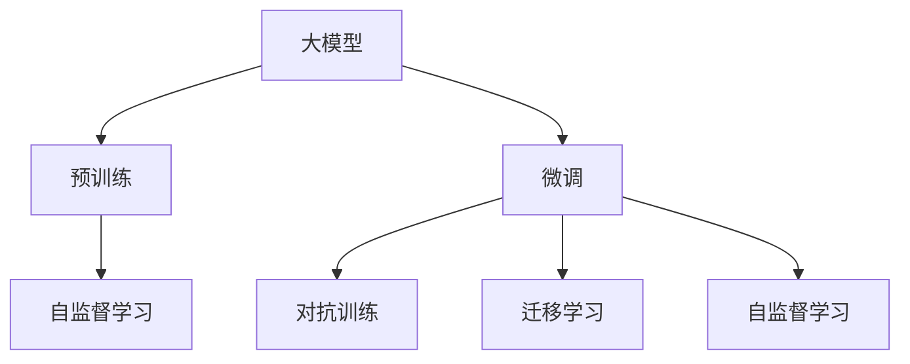

                 

## 1. 背景介绍

### 1.1 问题由来

随着人工智能技术的飞速发展，大模型创业已经成为当下最炙手可热的领域之一。从Google的BERT到OpenAI的GPT-3，大模型的表现力及其潜在的商业价值引发了行业内外广泛关注。越来越多的创业公司瞄准了这一领域，希望通过技术创新获得市场领先地位。但如何在大模型创业中取得成功，避免未来竞争对手的挑战，成为每个创业团队必须直面的问题。

### 1.2 问题核心关键点

大模型创业的核心在于利用大规模预训练语言模型进行商业化应用，获取商业价值。但如何构建有效的竞争优势，是每个大模型创业团队需要深入思考的战略问题。本文将从核心概念、算法原理、实际操作、数学模型、项目实践、应用场景、工具和资源、总结与展望等方面，全面解读大模型创业的关键技术要素，并探讨未来应对竞争的策略。

## 2. 核心概念与联系

### 2.1 核心概念概述

1. **大模型（Large Model）**：指使用大规模数据进行预训练，拥有庞大参数量（通常超过百亿）的深度学习模型，如BERT、GPT等。这些模型能够对自然语言进行复杂的语义理解，并应用于各种NLP任务。

2. **预训练（Pre-training）**：指在无标签数据上进行的自监督训练，模型通过预测缺失的信息来学习语言表示。常见的预训练任务包括语言模型、掩码语言模型等。

3. **微调（Fine-tuning）**：指在大规模预训练的基础上，针对特定任务进行有监督训练，优化模型在该任务上的性能。微调过程通常使用小规模标注数据。

4. **迁移学习（Transfer Learning）**：将预训练模型应用于新任务，无需从头训练，而是利用已学习到的知识。大模型的迁移学习特别适用于数据稀缺的任务。

5. **对抗训练（Adversarial Training）**：在训练过程中加入对抗样本，提高模型对对抗样本的鲁棒性，增强模型的泛化能力。

6. **自监督学习（Self-supervised Learning）**：利用数据的隐含信息进行训练，无需标签。自监督学习是大模型预训练的主要方法。

### 2.2 核心概念原理和架构的 Mermaid 流程图



上述流程图展示了大模型从预训练到微调，再到对抗训练和迁移学习的完整过程。

## 3. 核心算法原理 & 具体操作步骤

### 3.1 算法原理概述

大模型创业的核心算法主要是基于预训练和微调的方法。该方法通过在无标签数据上预训练大规模语言模型，然后针对特定任务进行微调，最终获取高精度的模型。这种做法的优点是能够在数据稀缺的情况下快速适应新任务，并且模型表现较好。

### 3.2 算法步骤详解

#### 3.2.1 预训练阶段

1. **数据准备**：收集大规模无标签数据，如维基百科、互联网文本等。
2. **模型训练**：使用自监督任务（如语言模型）对模型进行预训练。
3. **参数更新**：根据梯度下降等优化算法，不断调整模型参数，提升模型性能。

#### 3.2.2 微调阶段

1. **任务适配**：根据目标任务，设计适当的输出层和损失函数。
2. **数据准备**：准备标注数据集，划分训练集、验证集和测试集。
3. **模型微调**：使用小规模标注数据，通过梯度下降等方法调整模型参数。
4. **性能评估**：在验证集上评估模型性能，根据结果调整超参数。
5. **模型测试**：在测试集上测试微调后的模型，评估其在特定任务上的表现。

### 3.3 算法优缺点

#### 3.3.1 优点

1. **快速适应新任务**：在少量标注数据上即可快速训练出高性能模型。
2. **模型通用性强**：预训练模型可用于多种NLP任务，只需进行特定任务的微调。
3. **参数高效**：通常只需调整少量参数，可有效降低计算成本。

#### 3.3.2 缺点

1. **标注成本高**：微调过程中需要大量标注数据，成本较高。
2. **泛化能力有限**：当目标任务与预训练数据差异较大时，性能可能不佳。
3. **对抗样本鲁棒性差**：模型对对抗样本较为敏感，容易受到攻击。
4. **可解释性差**：黑盒模型缺乏可解释性，难以理解其内部工作机制。

### 3.4 算法应用领域

大模型的预训练-微调方法在NLP的多个领域都有广泛应用，如：

- 问答系统：如百度知道、智能客服等。
- 机器翻译：如Google翻译、DeepL翻译等。
- 文本分类：如垃圾邮件分类、情感分析等。
- 文本生成：如小说创作、新闻摘要等。
- 对话系统：如智能语音助手、聊天机器人等。

## 4. 数学模型和公式 & 详细讲解 & 举例说明

### 4.1 数学模型构建

假设我们使用BERT模型进行预训练，然后使用微调方法针对某个特定任务进行训练。设模型参数为 $\theta$，输入为 $x$，输出为 $y$。

预训练模型的损失函数为：
$$
L_{pre}(\theta) = -\log P(y|x;\theta)
$$

微调模型的损失函数为：
$$
L_{fin}(\theta) = \sum_{i=1}^N L(y_i|x_i;\theta)
$$

其中，$L$ 为指定任务的损失函数，$N$ 为样本数。

### 4.2 公式推导过程

以二分类任务为例，假设模型输出为 $y = [\hat{y}_1, \hat{y}_2]$，其中 $\hat{y}_1$ 为正例预测概率。则交叉熵损失函数为：
$$
L(y_i|x_i;\theta) = -(y_i \log \hat{y}_1 + (1-y_i) \log (1-\hat{y}_1))
$$

对损失函数求梯度，得到：
$$
\frac{\partial L}{\partial \theta} = -\frac{y_i}{\hat{y}_1} + \frac{1-y_i}{1-\hat{y}_1} \frac{\partial \hat{y}_1}{\partial \theta}
$$

将上述结果带入梯度下降算法中，更新模型参数：
$$
\theta \leftarrow \theta - \eta \frac{\partial L}{\partial \theta}
$$

其中，$\eta$ 为学习率。

### 4.3 案例分析与讲解

以情感分析任务为例，假设我们有一批电影评论数据，需要判断每条评论的情感极性。

1. **数据准备**：收集电影评论数据，并标注为正面或负面。
2. **模型预训练**：在IMDB数据集上进行预训练，学习通用的语言表示。
3. **模型微调**：使用电影评论数据进行微调，学习情感分析的特定知识。
4. **性能评估**：在验证集上评估微调后模型的表现。
5. **模型测试**：在测试集上测试微调后模型的性能。

## 5. 项目实践：代码实例和详细解释说明

### 5.1 开发环境搭建

1. **安装Python**：
   ```bash
   sudo apt-get install python3-pip
   ```
2. **安装TensorFlow和Keras**：
   ```bash
   pip install tensorflow keras
   ```
3. **安装PyTorch和TorchVision**：
   ```bash
   pip install torch torchvision
   ```
4. **安装BERT模型**：
   ```bash
   pip install transformers
   ```

### 5.2 源代码详细实现

以下是使用PyTorch进行BERT微调的示例代码：

```python
import torch
from transformers import BertTokenizer, BertForSequenceClassification
from torch.utils.data import DataLoader, Dataset
from sklearn.metrics import accuracy_score

# 数据准备
tokenizer = BertTokenizer.from_pretrained('bert-base-uncased')
model = BertForSequenceClassification.from_pretrained('bert-base-uncased', num_labels=2)
train_data = ...
val_data = ...
test_data = ...

# 数据处理
class IMDBDataset(Dataset):
    def __init__(self, data, tokenizer, max_len):
        self.data = data
        self.tokenizer = tokenizer
        self.max_len = max_len
    
    def __len__(self):
        return len(self.data)
    
    def __getitem__(self, index):
        text = self.data[index]['text']
        label = self.data[index]['label']
        encoding = self.tokenizer(text, max_length=self.max_len, truncation=True, padding='max_length', return_tensors='pt')
        input_ids = encoding['input_ids']
        attention_mask = encoding['attention_mask']
        return {'input_ids': input_ids, 'attention_mask': attention_mask, 'labels': torch.tensor([label])}

# 模型训练
device = torch.device('cuda' if torch.cuda.is_available() else 'cpu')
model.to(device)
optimizer = torch.optim.Adam(model.parameters(), lr=2e-5)

for epoch in range(3):
    for batch in DataLoader(train_data, batch_size=16):
        input_ids = batch['input_ids'].to(device)
        attention_mask = batch['attention_mask'].to(device)
        labels = batch['labels'].to(device)
        model.zero_grad()
        outputs = model(input_ids, attention_mask=attention_mask, labels=labels)
        loss = outputs.loss
        loss.backward()
        optimizer.step()
    
    # 模型评估
    model.eval()
    val_correct = 0
    val_total = 0
    with torch.no_grad():
        for batch in DataLoader(val_data, batch_size=16):
            input_ids = batch['input_ids'].to(device)
            attention_mask = batch['attention_mask'].to(device)
            labels = batch['labels'].to(device)
            outputs = model(input_ids, attention_mask=attention_mask, labels=labels)
            logits = outputs.logits
            predicted_labels = torch.argmax(logits, dim=1)
            val_correct += (predicted_labels == labels).sum().item()
            val_total += labels.size(0)
    
    val_accuracy = val_correct / val_total
    print(f'Epoch: {epoch+1}, Validation Accuracy: {val_accuracy:.4f}')

# 模型测试
test_correct = 0
test_total = 0
with torch.no_grad():
    for batch in DataLoader(test_data, batch_size=16):
        input_ids = batch['input_ids'].to(device)
        attention_mask = batch['attention_mask'].to(device)
        labels = batch['labels'].to(device)
        outputs = model(input_ids, attention_mask=attention_mask, labels=labels)
        logits = outputs.logits
        predicted_labels = torch.argmax(logits, dim=1)
        test_correct += (predicted_labels == labels).sum().item()
        test_total += labels.size(0)

test_accuracy = test_correct / test_total
print(f'Test Accuracy: {test_accuracy:.4f}')
```

### 5.3 代码解读与分析

上述代码中，我们使用了BERT模型进行情感分析任务的微调。具体步骤包括：

1. **数据准备**：使用IMDB数据集进行预训练。
2. **模型初始化**：加载预训练模型和 tokenizer。
3. **数据处理**：将文本数据转换为模型可接受的形式。
4. **模型训练**：使用Adam优化器进行训练，并在验证集上评估模型性能。
5. **模型测试**：在测试集上测试微调后模型的表现。

## 6. 实际应用场景

### 6.1 智慧医疗

大模型可以应用于医疗领域的文本处理任务，如病历分析、医疗问答、药物研发等。通过微调大模型，可以在医生诊断和病历分析中提供更准确的信息，并辅助药物研发。

### 6.2 智能客服

智能客服系统可以利用大模型进行情感分析、意图识别等任务，提高客户体验。通过微调模型，可以更准确地理解和回复用户问题，提供更加个性化的服务。

### 6.3 金融舆情监测

金融行业需要实时监测市场舆情，防止负面信息传播。通过微调大模型，可以在大规模非结构化数据中快速发现异常情况，帮助金融机构及时采取措施。

### 6.4 个性化推荐

推荐系统可以利用大模型进行用户行为分析和推荐模型训练。通过微调，可以实现更精准、个性化的推荐，提升用户满意度。

## 7. 工具和资源推荐

### 7.1 学习资源推荐

1. **《深度学习入门》**：清华大学郑涌老师的深度学习入门课程，系统介绍了深度学习的基本原理和实现方法。
2. **《TensorFlow实战》**：Google TensorFlow官方文档，提供了丰富的示例和文档，适合深入学习TensorFlow的使用。
3. **《PyTorch教程》**：PyTorch官方文档，提供了丰富的教程和示例，适合深入学习PyTorch的使用。
4. **《BERT论文》**：Google BERT论文，介绍了BERT模型的预训练和微调方法，是了解大模型应用的重要参考资料。

### 7.2 开发工具推荐

1. **Jupyter Notebook**：适用于数据处理和模型训练的交互式开发环境。
2. **TensorBoard**：用于可视化模型训练过程和结果。
3. **Weights & Biases**：模型训练的实验跟踪工具，记录训练过程中的各项指标。
4. **PyTorch Lightning**：基于PyTorch的轻量级框架，支持快速搭建和训练模型。

### 7.3 相关论文推荐

1. **《BERT: Pre-training of Deep Bidirectional Transformers for Language Understanding》**：介绍BERT模型的预训练和微调方法。
2. **《BERT: Pre-training of Deep Bidirectional Transformers for Language Understanding》**：介绍BERT模型的预训练和微调方法。
3. **《Google's Neural Machine Translation System: Bridging the Gap between Human and Machine Translation》**：介绍机器翻译任务的预训练和微调方法。
4. **《Longformer: The Long-Document Transformer》**：介绍Longformer模型在长文本处理中的应用。

## 8. 总结：未来发展趋势与挑战

### 8.1 研究成果总结

大模型创业在过去几年取得了飞速发展，广泛应用于NLP领域的各个任务。然而，其成功依赖于大规模数据和计算资源，以及优秀的算法和模型架构。预训练和微调技术的成熟，使得大模型在实际应用中表现出色。

### 8.2 未来发展趋势

1. **模型规模不断扩大**：随着计算能力的提升和数据量的增加，未来大模型的规模将不断扩大。更大的模型能够处理更复杂的任务，提高模型表现。
2. **模型通用性增强**：大模型将更多地应用于不同的领域和任务，成为通用人工智能的基础。
3. **自动化微调技术**：自动微调技术将使大模型的应用更加简单便捷，降低对数据标注和计算资源的依赖。
4. **跨领域迁移学习**：跨领域迁移学习将使大模型能够在不同的领域和任务之间快速迁移，提高模型适应能力。
5. **实时处理技术**：实时处理技术将使大模型能够快速响应和处理大量数据，提高模型的实用性。

### 8.3 面临的挑战

1. **数据隐私和安全**：大规模数据的使用可能涉及隐私问题，需要采取有效的保护措施。
2. **计算资源不足**：大模型的训练和推理需要大量的计算资源，如何优化模型结构和算法，提高计算效率，是一个重要挑战。
3. **模型可解释性差**：大模型通常是黑盒模型，缺乏可解释性，难以理解其内部工作机制。
4. **对抗样本鲁棒性差**：大模型对对抗样本较为敏感，容易受到攻击，需要提高其鲁棒性。

### 8.4 研究展望

未来，大模型创业需要在以下几个方面进行深入研究：

1. **自动化微调**：开发更加智能的微调技术，减少人工干预。
2. **多模态融合**：将视觉、语音等多模态数据与文本数据结合，提高模型的应用范围和表现。
3. **对抗样本鲁棒性**：研究新的对抗样本生成方法和防御策略，提高模型的鲁棒性。
4. **模型可解释性**：研究可解释性模型，提高模型的透明度和可信度。
5. **跨领域迁移学习**：研究跨领域迁移学习算法，提高模型的适应能力。

## 9. 附录：常见问题与解答

### 9.1 Q1: 大模型创业的流程是什么？

A: 大模型创业的流程包括以下几个步骤：

1. **数据收集和预处理**：收集大规模无标签数据，并进行预处理。
2. **模型预训练**：使用自监督任务对模型进行预训练。
3. **模型微调**：使用小规模标注数据对模型进行微调，适配特定任务。
4. **模型评估和测试**：在验证集和测试集上评估模型性能，并进行调整。

### 9.2 Q2: 大模型创业的挑战有哪些？

A: 大模型创业面临的主要挑战包括：

1. **数据隐私和安全**：大规模数据的使用可能涉及隐私问题，需要采取有效的保护措施。
2. **计算资源不足**：大模型的训练和推理需要大量的计算资源，如何优化模型结构和算法，提高计算效率，是一个重要挑战。
3. **模型可解释性差**：大模型通常是黑盒模型，缺乏可解释性，难以理解其内部工作机制。
4. **对抗样本鲁棒性差**：大模型对对抗样本较为敏感，容易受到攻击，需要提高其鲁棒性。

### 9.3 Q3: 如何选择合适的微调超参数？

A: 选择合适的微调超参数是提高模型性能的重要步骤。建议采用以下方法：

1. **学习率**：通常在0.0001到0.001之间调整。
2. **批大小**：通常在16到32之间调整。
3. **迭代次数**：通常在1到10之间调整。
4. **正则化**：通常使用L2正则和Dropout等方法，避免过拟合。

### 9.4 Q4: 大模型的迁移学习与微调的区别是什么？

A: 大模型的迁移学习和微调有以下区别：

1. **数据量**：迁移学习通常需要大量预训练数据，而微调通常使用小规模标注数据。
2. **任务适配**：迁移学习更多关注领域迁移，而微调更多关注特定任务的优化。
3. **目标**：迁移学习旨在提高模型的泛化能力，而微调旨在提高模型在特定任务上的性能。

### 9.5 Q5: 大模型创业如何应对未来竞争对手？

A: 应对未来竞争对手可以从以下几个方面入手：

1. **持续创新**：不断进行技术创新和产品迭代，保持市场竞争力。
2. **合作共赢**：与其他企业合作，共享资源和技术，共同推动行业发展。
3. **人才建设**：吸引和培养优秀人才，构建强大的研发团队。
4. **市场策略**：制定科学的市场策略，拓展市场份额。
5. **用户体验**：提升用户体验，增加用户粘性。

---

作者：禅与计算机程序设计艺术 / Zen and the Art of Computer Programming

