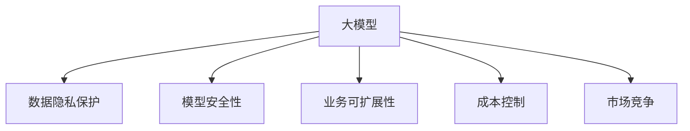

                 

## 1. 背景介绍

### 1.1 问题由来
随着AI技术的发展，大模型在各个行业的应用变得越来越广泛。这些大模型不仅能够处理大规模的数据集，还能进行复杂的任务，如图像识别、自然语言处理和语音识别等。同时，随着云服务的发展，许多创业公司可以基于大模型构建自己的业务，实现快速创新和规模化发展。但是，大模型也带来了数据隐私、安全性等问题，如何在行业发展中应对这些问题，是创业公司需要考虑的重要问题。

### 1.2 问题核心关键点
大模型创业面临的核心问题包括：数据隐私保护、模型安全性、业务可扩展性、成本控制、市场竞争等。如何处理这些问题，实现大模型的应用与商业化，成为了创业公司需要解决的重要难题。

### 1.3 问题研究意义
大模型创业具有重要的现实意义，可以推动技术进步、创造就业机会、推动产业发展等。同时，对于创业公司来说，应用大模型能够快速验证市场潜力和商业模式，缩短产品开发周期，实现商业价值。

## 2. 核心概念与联系

### 2.1 核心概念概述

- **大模型（Large Models）**：指具有大规模参数量和复杂度的模型，如GPT-3、BERT、ResNet等。这些模型通常需要在GPU或TPU上运行，以处理大规模的数据集和复杂的任务。
- **数据隐私保护（Data Privacy Protection）**：指在数据收集、存储、处理和传输过程中，确保个人数据的保护，防止数据泄露和滥用。
- **模型安全性（Model Security）**：指保护模型免受攻击，防止模型被篡改或攻击者利用模型进行恶意行为。
- **业务可扩展性（Business Scalability）**：指创业公司能够快速扩展业务规模，适应市场需求和用户增长。
- **成本控制（Cost Control）**：指创业公司需要有效管理各项成本，以确保公司长期稳定发展。
- **市场竞争（Market Competition）**：指创业公司需要在竞争激烈的市场中占据一席之地，确保产品和服务的差异化优势。

这些概念之间的联系可以通过以下Mermaid流程图来展示：



这个流程图展示了大模型创业过程中需要处理的核心概念及其相互关系。

## 3. 核心算法原理 & 具体操作步骤

### 3.1 算法原理概述

基于大模型的创业，其核心在于应用大模型解决行业问题，实现商业化。具体来说，创业公司需要：

- 收集和处理数据，训练大模型。
- 部署和优化大模型，确保其高效运行。
- 保护数据隐私和模型安全。
- 实现业务的快速扩展。
- 控制成本，确保公司长期稳定发展。
- 在市场竞争中占据优势，确保产品和服务的差异化。

### 3.2 算法步骤详解

**Step 1: 数据收集与预处理**

- 收集与业务相关的数据集，确保数据质量和多样性。
- 对数据进行预处理，如去重、清洗、标注等。
- 使用数据增强技术，扩充数据集，提升模型性能。

**Step 2: 模型训练与优化**

- 选择合适的大模型架构，如Transformer、BERT等。
- 设计合适的损失函数和优化算法，如交叉熵损失、AdamW等。
- 使用GPU或TPU进行训练，确保模型高效运行。
- 在训练过程中应用正则化技术，如L2正则、Dropout等，防止过拟合。
- 应用模型压缩和剪枝技术，减少模型规模，降低成本。

**Step 3: 部署与运行**

- 将训练好的模型部署到服务器上，确保模型的高效运行。
- 应用缓存、负载均衡等技术，确保系统的稳定性和高可用性。
- 对模型进行监控和调优，确保模型性能和稳定性。
- 使用API接口，实现模型的快速调用和集成。

**Step 4: 数据隐私保护**

- 在数据收集和处理过程中，应用加密和匿名化技术，保护用户隐私。
- 在数据存储和传输过程中，使用安全协议，防止数据泄露。
- 在模型训练过程中，应用差分隐私技术，保护用户隐私。

**Step 5: 模型安全性**

- 对模型进行加密和签名，防止模型被篡改或攻击。
- 应用模型审计和监控技术，及时发现和应对安全威胁。
- 在模型部署过程中，应用防火墙和入侵检测等技术，确保系统的安全性。

**Step 6: 业务可扩展性**

- 在业务扩展过程中，使用容器化和微服务架构，确保系统的可扩展性。
- 应用云服务，快速扩展系统规模，应对业务增长。
- 应用自动化运维技术，确保系统的高可用性和快速恢复能力。

**Step 7: 成本控制**

- 在模型训练过程中，应用成本优化技术，降低计算成本。
- 在模型部署过程中，应用资源池和负载均衡技术，降低服务器成本。
- 应用自动化测试和部署技术，降低人力成本。

**Step 8: 市场竞争**

- 在市场竞争中，应用差异化技术，确保产品和服务的独特性。
- 应用市场分析和用户反馈，优化产品和服务。
- 应用广告和营销策略，提高品牌知名度和市场份额。

### 3.3 算法优缺点

基于大模型的创业方法具有以下优点：

- 能够快速应用大模型，实现技术创新和业务升级。
- 能够快速处理大规模数据，提升业务效率。
- 能够在不同业务场景中应用，实现业务的灵活扩展。

同时，该方法也存在一定的局限性：

- 需要较高的技术门槛和资金投入，创业公司需要具备一定的技术实力和资金实力。
- 模型训练和优化需要大量计算资源和时间，创业公司需要具备较高的计算能力和时间管理能力。
- 数据隐私和模型安全需要投入大量资源进行保护，创业公司需要具备较高的安全意识和能力。

尽管存在这些局限性，但就目前而言，基于大模型的创业方法仍是大规模应用的主要方式。未来相关研究的重点在于如何进一步降低技术门槛，提高模型的少样本学习和跨领域迁移能力，同时兼顾可解释性和伦理安全性等因素。

### 3.4 算法应用领域

基于大模型的创业方法在多个领域得到了广泛应用，如自然语言处理、计算机视觉、语音识别等。以下是几个具体的应用场景：

- **自然语言处理（NLP）**：利用大模型进行文本分类、命名实体识别、情感分析、机器翻译等任务，提升自然语言处理能力。
- **计算机视觉（CV）**：利用大模型进行图像识别、图像生成、视频分析等任务，提升计算机视觉能力。
- **语音识别（ASR）**：利用大模型进行语音识别、语音合成等任务，提升语音处理能力。
- **推荐系统**：利用大模型进行用户行为分析、商品推荐等任务，提升推荐系统的准确性和个性化。
- **医疗健康**：利用大模型进行医学影像分析、病历分析、药物研发等任务，提升医疗健康能力。

## 4. 数学模型和公式 & 详细讲解 & 举例说明

### 4.1 数学模型构建

假设一个大模型应用在NLP任务上，其输入为文本数据 $x$，输出为分类结果 $y$。模型的目标是最小化损失函数 $L(x, y)$，即：

$$
\min_{\theta} L(x, y) = \sum_{i=1}^{n} \ell(x_i, y_i)
$$

其中 $\ell(x_i, y_i)$ 为单样本损失函数，如交叉熵损失函数。

### 4.2 公式推导过程

对于交叉熵损失函数，其表达式为：

$$
\ell(x_i, y_i) = -\frac{1}{n} \sum_{i=1}^{n} y_i \log(\hat{y_i}) + (1-y_i) \log(1-\hat{y_i})
$$

其中 $\hat{y_i}$ 为模型预测结果。

在实际应用中，需要将交叉熵损失函数应用到模型训练中。具体来说，假设模型的输出为 $z$，则模型预测结果为 $\hat{y_i} = \sigma(z_i)$，其中 $\sigma$ 为激活函数。

在模型训练过程中，损失函数对模型参数 $\theta$ 的梯度为：

$$
\nabla_{\theta} L = -\frac{1}{n} \sum_{i=1}^{n} \nabla_{\theta} \ell(x_i, y_i)
$$

其中 $\nabla_{\theta} \ell(x_i, y_i)$ 为单样本损失函数对模型参数 $\theta$ 的梯度。

### 4.3 案例分析与讲解

假设我们应用BERT模型进行文本分类任务，将交叉熵损失函数应用到模型训练中。具体实现过程如下：

```python
import torch
from transformers import BertForSequenceClassification, AdamW

# 加载BERT模型和训练数据
model = BertForSequenceClassification.from_pretrained('bert-base-uncased')
optimizer = AdamW(model.parameters(), lr=2e-5)
train_dataset = ...

# 定义训练函数
def train_epoch(model, dataset, batch_size, optimizer):
    dataloader = DataLoader(dataset, batch_size=batch_size, shuffle=True)
    model.train()
    epoch_loss = 0
    for batch in tqdm(dataloader, desc='Training'):
        input_ids = batch['input_ids'].to(device)
        attention_mask = batch['attention_mask'].to(device)
        labels = batch['labels'].to(device)
        model.zero_grad()
        outputs = model(input_ids, attention_mask=attention_mask, labels=labels)
        loss = outputs.loss
        epoch_loss += loss.item()
        loss.backward()
        optimizer.step()
    return epoch_loss / len(dataloader)

# 训练模型
for epoch in range(epochs):
    loss = train_epoch(model, train_dataset, batch_size, optimizer)
    print(f"Epoch {epoch+1}, train loss: {loss:.3f}")
```

## 5. 项目实践：代码实例和详细解释说明

### 5.1 开发环境搭建

在开发过程中，需要搭建适合的大模型开发环境。以下是Python和PyTorch开发环境搭建步骤：

1. 安装Anaconda：从官网下载并安装Anaconda，用于创建独立的Python环境。
```bash
conda create -n pytorch-env python=3.8 
conda activate pytorch-env
```

2. 安装PyTorch：根据CUDA版本，从官网获取对应的安装命令。例如：
```bash
conda install pytorch torchvision torchaudio cudatoolkit=11.1 -c pytorch -c conda-forge
```

3. 安装Transformers库：
```bash
pip install transformers
```

4. 安装各类工具包：
```bash
pip install numpy pandas scikit-learn matplotlib tqdm jupyter notebook ipython
```

完成上述步骤后，即可在`pytorch-env`环境中开始大模型微调实践。

### 5.2 源代码详细实现

这里以BERT模型进行文本分类任务为例，给出使用Transformers库进行大模型微调的PyTorch代码实现。

首先，定义文本分类任务的数据处理函数：

```python
from transformers import BertTokenizer
from torch.utils.data import Dataset
import torch

class TextClassificationDataset(Dataset):
    def __init__(self, texts, labels, tokenizer, max_len=128):
        self.texts = texts
        self.labels = labels
        self.tokenizer = tokenizer
        self.max_len = max_len
        
    def __len__(self):
        return len(self.texts)
    
    def __getitem__(self, item):
        text = self.texts[item]
        label = self.labels[item]
        
        encoding = self.tokenizer(text, return_tensors='pt', max_length=self.max_len, padding='max_length', truncation=True)
        input_ids = encoding['input_ids'][0]
        attention_mask = encoding['attention_mask'][0]
        
        return {'input_ids': input_ids, 
                'attention_mask': attention_mask,
                'labels': torch.tensor(label, dtype=torch.long)}
```

然后，定义模型和优化器：

```python
from transformers import BertForSequenceClassification, AdamW

model = BertForSequenceClassification.from_pretrained('bert-base-uncased', num_labels=2)

optimizer = AdamW(model.parameters(), lr=2e-5)
```

接着，定义训练和评估函数：

```python
from torch.utils.data import DataLoader
from tqdm import tqdm
from sklearn.metrics import classification_report

device = torch.device('cuda') if torch.cuda.is_available() else torch.device('cpu')
model.to(device)

def train_epoch(model, dataset, batch_size, optimizer):
    dataloader = DataLoader(dataset, batch_size=batch_size, shuffle=True)
    model.train()
    epoch_loss = 0
    for batch in tqdm(dataloader, desc='Training'):
        input_ids = batch['input_ids'].to(device)
        attention_mask = batch['attention_mask'].to(device)
        labels = batch['labels'].to(device)
        model.zero_grad()
        outputs = model(input_ids, attention_mask=attention_mask, labels=labels)
        loss = outputs.loss
        epoch_loss += loss.item()
        loss.backward()
        optimizer.step()
    return epoch_loss / len(dataloader)

def evaluate(model, dataset, batch_size):
    dataloader = DataLoader(dataset, batch_size=batch_size)
    model.eval()
    preds, labels = [], []
    with torch.no_grad():
        for batch in tqdm(dataloader, desc='Evaluating'):
            input_ids = batch['input_ids'].to(device)
            attention_mask = batch['attention_mask'].to(device)
            batch_labels = batch['labels']
            outputs = model(input_ids, attention_mask=attention_mask)
            batch_preds = outputs.logits.argmax(dim=1).to('cpu').tolist()
            batch_labels = batch_labels.to('cpu').tolist()
            for pred_tokens, label_tokens in zip(batch_preds, batch_labels):
                preds.append(pred_tokens)
                labels.append(label_tokens)
                
    print(classification_report(labels, preds))
```

最后，启动训练流程并在测试集上评估：

```python
epochs = 5
batch_size = 16

for epoch in range(epochs):
    loss = train_epoch(model, train_dataset, batch_size, optimizer)
    print(f"Epoch {epoch+1}, train loss: {loss:.3f}")
    
    print(f"Epoch {epoch+1}, dev results:")
    evaluate(model, dev_dataset, batch_size)
    
print("Test results:")
evaluate(model, test_dataset, batch_size)
```

以上就是使用PyTorch进行BERT模型微调的全流程实现。通过示例代码，可以看出大模型的微调过程相对简单，但在具体应用中，还需要针对具体任务和数据特点进行优化和调参。

### 5.3 代码解读与分析

**TextClassificationDataset类**：
- `__init__`方法：初始化文本、标签、分词器等关键组件。
- `__len__`方法：返回数据集的样本数量。
- `__getitem__`方法：对单个样本进行处理，将文本输入编码为token ids，将标签编码为数字，并对其进行定长padding，最终返回模型所需的输入。

**模型和优化器**：
- 使用BertForSequenceClassification作为文本分类的任务适配器，指定标签数为2，即二分类任务。
- 应用AdamW优化器进行模型参数的优化，设置学习率为2e-5。

**训练和评估函数**：
- 使用PyTorch的DataLoader对数据集进行批次化加载，供模型训练和推理使用。
- 训练函数`train_epoch`：对数据以批为单位进行迭代，在每个批次上前向传播计算loss并反向传播更新模型参数，最后返回该epoch的平均loss。
- 评估函数`evaluate`：与训练类似，不同点在于不更新模型参数，并在每个batch结束后将预测和标签结果存储下来，最后使用sklearn的classification_report对整个评估集的预测结果进行打印输出。

**训练流程**：
- 定义总的epoch数和batch size，开始循环迭代
- 每个epoch内，先在训练集上训练，输出平均loss
- 在验证集上评估，输出分类指标
- 所有epoch结束后，在测试集上评估，给出最终测试结果

## 6. 实际应用场景

### 6.1 智能客服系统

基于大模型的智能客服系统能够快速响应客户咨询，用自然流畅的语言解答各类常见问题。该系统可以24/7不间断服务，提高客户咨询体验和问题解决效率。具体实现如下：

1. 收集企业内部的历史客服对话记录，将问题和最佳答复构建成监督数据。
2. 将问题-答复对作为微调数据，训练BERT模型学习匹配答复。
3. 对于新客户提出的问题，系统自动解析问题，并在知识库中检索相关信息，动态生成最佳答复。
4. 应用缓存和负载均衡技术，确保系统的高可用性和快速响应能力。

### 6.2 金融舆情监测

金融舆情监测系统能够实时监测市场舆论动向，帮助金融机构及时应对负面信息传播，规避金融风险。具体实现如下：

1. 收集金融领域相关的新闻、报道、评论等文本数据。
2. 对文本数据进行主题标注和情感标注，构建监督数据。
3. 在标注数据上训练BERT模型，学习金融舆情分类和情感分析能力。
4. 应用对抗训练和数据增强技术，提升模型的鲁棒性和泛化能力。
5. 在实时抓取的网络文本数据上，应用微调模型进行舆情监测和分析。
6. 应用缓存和负载均衡技术，确保系统的稳定性和高可用性。

### 6.3 个性化推荐系统

个性化推荐系统能够根据用户的历史行为，推荐用户感兴趣的商品或内容。具体实现如下：

1. 收集用户浏览、点击、评论、分享等行为数据。
2. 提取和用户交互的物品标题、描述、标签等文本内容。
3. 在文本内容上训练BERT模型，学习用户兴趣表示。
4. 应用对抗训练和数据增强技术，提升模型的鲁棒性和泛化能力。
5. 在推荐系统中，应用微调模型进行用户行为分析和商品推荐。
6. 应用缓存和负载均衡技术，确保系统的稳定性和高可用性。

## 7. 工具和资源推荐

### 7.1 学习资源推荐

为了帮助开发者系统掌握大模型微调的理论基础和实践技巧，这里推荐一些优质的学习资源：

1. 《Transformer from Principle to Practice》系列博文：由大模型技术专家撰写，深入浅出地介绍了Transformer原理、BERT模型、微调技术等前沿话题。
2. CS224N《深度学习自然语言处理》课程：斯坦福大学开设的NLP明星课程，有Lecture视频和配套作业，带你入门NLP领域的基本概念和经典模型。
3. 《Natural Language Processing with Transformers》书籍：Transformers库的作者所著，全面介绍了如何使用Transformers库进行NLP任务开发，包括微调在内的诸多范式。
4. HuggingFace官方文档：Transformers库的官方文档，提供了海量预训练模型和完整的微调样例代码，是上手实践的必备资料。
5. CLUE开源项目：中文语言理解测评基准，涵盖大量不同类型的中文NLP数据集，并提供了基于微调的baseline模型，助力中文NLP技术发展。

通过对这些资源的学习实践，相信你一定能够快速掌握大语言模型微调的精髓，并用于解决实际的NLP问题。

### 7.2 开发工具推荐

高效的开发离不开优秀的工具支持。以下是几款用于大模型微调开发的常用工具：

1. PyTorch：基于Python的开源深度学习框架，灵活动态的计算图，适合快速迭代研究。大部分预训练语言模型都有PyTorch版本的实现。
2. TensorFlow：由Google主导开发的开源深度学习框架，生产部署方便，适合大规模工程应用。同样有丰富的预训练语言模型资源。
3. Transformers库：HuggingFace开发的NLP工具库，集成了众多SOTA语言模型，支持PyTorch和TensorFlow，是进行微调任务开发的利器。
4. Weights & Biases：模型训练的实验跟踪工具，可以记录和可视化模型训练过程中的各项指标，方便对比和调优。与主流深度学习框架无缝集成。
5. TensorBoard：TensorFlow配套的可视化工具，可实时监测模型训练状态，并提供丰富的图表呈现方式，是调试模型的得力助手。
6. Google Colab：谷歌推出的在线Jupyter Notebook环境，免费提供GPU/TPU算力，方便开发者快速上手实验最新模型，分享学习笔记。

合理利用这些工具，可以显著提升大模型微调任务的开发效率，加快创新迭代的步伐。

### 7.3 相关论文推荐

大语言模型和微调技术的发展源于学界的持续研究。以下是几篇奠基性的相关论文，推荐阅读：

1. Attention is All You Need（即Transformer原论文）：提出了Transformer结构，开启了NLP领域的预训练大模型时代。
2. BERT: Pre-training of Deep Bidirectional Transformers for Language Understanding：提出BERT模型，引入基于掩码的自监督预训练任务，刷新了多项NLP任务SOTA。
3. Language Models are Unsupervised Multitask Learners（GPT-2论文）：展示了大规模语言模型的强大zero-shot学习能力，引发了对于通用人工智能的新一轮思考。
4. Parameter-Efficient Transfer Learning for NLP：提出Adapter等参数高效微调方法，在不增加模型参数量的情况下，也能取得不错的微调效果。
5. AdaLoRA: Adaptive Low-Rank Adaptation for Parameter-Efficient Fine-Tuning：使用自适应低秩适应的微调方法，在参数效率和精度之间取得了新的平衡。
6. Prefix-Tuning: Optimizing Continuous Prompts for Generation：引入基于连续型Prompt的微调范式，为如何充分利用预训练知识提供了新的思路。

这些论文代表了大语言模型微调技术的发展脉络。通过学习这些前沿成果，可以帮助研究者把握学科前进方向，激发更多的创新灵感。

## 8. 总结：未来发展趋势与挑战

### 8.1 总结

本文对基于大模型的创业方法进行了全面系统的介绍。首先阐述了大模型创业面临的核心问题，包括数据隐私保护、模型安全性、业务可扩展性、成本控制、市场竞争等。其次，从原理到实践，详细讲解了大模型的微调方法，包括数据收集、模型训练、模型部署、数据隐私保护、模型安全性、业务可扩展性、成本控制、市场竞争等各个环节的详细内容。

通过本文的系统梳理，可以看到，基于大模型的创业方法已经在多个行业得到了广泛应用，并展示出了巨大的潜力。未来，伴随大模型的不断演进，其应用场景和落地效果必将进一步拓展，推动技术进步和产业升级。

### 8.2 未来发展趋势

展望未来，大模型创业将呈现以下几个发展趋势：

1. 模型规模持续增大。随着算力成本的下降和数据规模的扩张，大模型的参数量将继续增长。超大规模语言模型蕴含的丰富语言知识，有望支撑更加复杂多变的下游任务微调。
2. 微调方法日趋多样。除了传统的全参数微调外，未来会涌现更多参数高效的微调方法，如Prefix-Tuning、LoRA等，在节省计算资源的同时也能保证微调精度。
3. 持续学习成为常态。随着数据分布的不断变化，微调模型也需要持续学习新知识以保持性能。如何在不遗忘原有知识的同时，高效吸收新样本信息，将成为重要的研究课题。
4. 标注样本需求降低。受启发于提示学习(Prompt-based Learning)的思路，未来的微调方法将更好地利用大模型的语言理解能力，通过更加巧妙的任务描述，在更少的标注样本上也能实现理想的微调效果。
5. 多模态微调崛起。当前的微调主要聚焦于纯文本数据，未来会进一步拓展到图像、视频、语音等多模态数据微调。多模态信息的融合，将显著提升语言模型对现实世界的理解和建模能力。
6. 模型通用性增强。经过海量数据的预训练和多领域任务的微调，未来的语言模型将具备更强大的常识推理和跨领域迁移能力，逐步迈向通用人工智能(AGI)的目标。

以上趋势凸显了大模型微调技术的广阔前景。这些方向的探索发展，必将进一步提升大模型的性能和应用范围，为人工智能技术的发展注入新的动力。

### 8.3 面临的挑战

尽管大模型微调技术已经取得了瞩目成就，但在迈向更加智能化、普适化应用的过程中，它仍面临着诸多挑战：

1. 标注成本瓶颈。虽然微调大大降低了标注数据的需求，但对于长尾应用场景，难以获得充足的高质量标注数据，成为制约微调性能的瓶颈。如何进一步降低微调对标注样本的依赖，将是一大难题。
2. 模型鲁棒性不足。当前微调模型面对域外数据时，泛化性能往往大打折扣。对于测试样本的微小扰动，微调模型的预测也容易发生波动。如何提高微调模型的鲁棒性，避免灾难性遗忘，还需要更多理论和实践的积累。
3. 推理效率有待提高。大规模语言模型虽然精度高，但在实际部署时往往面临推理速度慢、内存占用大等效率问题。如何在保证性能的同时，简化模型结构，提升推理速度，优化资源占用，将是重要的优化方向。
4. 可解释性亟需加强。当前微调模型更像是"黑盒"系统，难以解释其内部工作机制和决策逻辑。对于医疗、金融等高风险应用，算法的可解释性和可审计性尤为重要。如何赋予微调模型更强的可解释性，将是亟待攻克的难题。
5. 安全性有待保障。预训练语言模型难免会学习到有偏见、有害的信息，通过微调传递到下游任务，产生误导性、歧视性的输出，给实际应用带来安全隐患。如何从数据和算法层面消除模型偏见，避免恶意用途，确保输出的安全性，也将是重要的研究课题。
6. 知识整合能力不足。现有的微调模型往往局限于任务内数据，难以灵活吸收和运用更广泛的先验知识。如何让微调过程更好地与外部知识库、规则库等专家知识结合，形成更加全面、准确的信息整合能力，还有很大的想象空间。

正视微调面临的这些挑战，积极应对并寻求突破，将是大模型微调走向成熟的必由之路。相信随着学界和产业界的共同努力，这些挑战终将一一被克服，大模型微调必将在构建人机协同的智能时代中扮演越来越重要的角色。

### 8.4 研究展望

面对大模型微调所面临的种种挑战，未来的研究需要在以下几个方面寻求新的突破：

1. 探索无监督和半监督微调方法。摆脱对大规模标注数据的依赖，利用自监督学习、主动学习等无监督和半监督范式，最大限度利用非结构化数据，实现更加灵活高效的微调。
2. 研究参数高效和计算高效的微调范式。开发更加参数高效的微调方法，在固定大部分预训练参数的同时，只更新极少量的任务相关参数。同时优化微调模型的计算图，减少前向传播和反向传播的资源消耗，实现更加轻量级、实时性的部署。
3. 融合因果和对比学习范式。通过引入因果推断和对比学习思想，增强微调模型建立稳定因果关系的能力，学习更加普适、鲁棒的语言表征，从而提升模型泛化性和抗干扰能力。
4. 引入更多先验知识。将符号化的先验知识，如知识图谱、逻辑规则等，与神经网络模型进行巧妙融合，引导微调过程学习更准确、合理的语言模型。同时加强不同模态数据的整合，实现视觉、语音等多模态信息与文本信息的协同建模。
5. 结合因果分析和博弈论工具。将因果分析方法引入微调模型，识别出模型决策的关键特征，增强输出解释的因果性和逻辑性。借助博弈论工具刻画人机交互过程，主动探索并规避模型的脆弱点，提高系统稳定性。
6. 纳入伦理道德约束。在模型训练目标中引入伦理导向的评估指标，过滤和惩罚有偏见、有害的输出倾向。同时加强人工干预和审核，建立模型行为的监管机制，确保输出符合人类价值观和伦理道德。

这些研究方向的探索，必将引领大模型微调技术迈向更高的台阶，为构建安全、可靠、可解释、可控的智能系统铺平道路。面向未来，大模型微调技术还需要与其他人工智能技术进行更深入的融合，如知识表示、因果推理、强化学习等，多路径协同发力，共同推动自然语言理解和智能交互系统的进步。只有勇于创新、敢于突破，才能不断拓展语言模型的边界，让智能技术更好地造福人类社会。

## 9. 附录：常见问题与解答

**Q1：大模型微调是否适用于所有NLP任务？**

A: 大模型微调在大多数NLP任务上都能取得不错的效果，特别是对于数据量较小的任务。但对于一些特定领域的任务，如医学、法律等，仅仅依靠通用语料预训练的模型可能难以很好地适应。此时需要在特定领域语料上进一步预训练，再进行微调，才能获得理想效果。此外，对于一些需要时效性、个性化很强的任务，如对话、推荐等，微调方法也需要针对性的改进优化。

**Q2：微调过程中如何选择合适的学习率？**

A: 微调的学习率一般要比预训练时小1-2个数量级，如果使用过大的学习率，容易破坏预训练权重，导致过拟合。一般建议从1e-5开始调参，逐步减小学习率，直至收敛。也可以使用warmup策略，在开始阶段使用较小的学习率，再逐渐过渡到预设值。需要注意的是，不同的优化器(如AdamW、Adafactor等)以及不同的学习率调度策略，可能需要设置不同的学习率阈值。

**Q3：采用大模型微调时会面临哪些资源瓶颈？**

A: 目前主流的预训练大模型动辄以亿计的参数规模，对算力、内存、存储都提出了很高的要求。GPU/TPU等高性能设备是必不可少的，但即便如此，超大批次的训练和推理也可能遇到显存不足的问题。因此需要采用一些资源优化技术，如梯度积累、混合精度训练、模型并行等，来突破硬件瓶颈。同时，模型的存储和读取也可能占用大量时间和空间，需要采用模型压缩、稀疏化存储等方法进行优化。

**Q4：如何缓解微调过程中的过拟合问题？**

A: 过拟合是微调面临的主要挑战，尤其是在标注数据不足的情况下。常见的缓解策略包括：
1. 数据增强：通过回译、近义替换等方式扩充训练集
2. 正则化：使用L2正则、Dropout、Early Stopping等防止过拟合
3. 对抗训练：引入对抗样本，提高模型鲁棒性
4. 参数高效微调：只调整少量参数(如Adapter、Prefix等)，减小过拟合风险
5. 多模型集成：训练多个微调模型，取平均输出，抑制过拟合

这些策略往往需要根据具体任务和数据特点进行灵活组合。只有在数据、模型、训练、推理等各环节进行全面优化，才能最大限度地发挥大模型微调的威力。

**Q5：微调模型在落地部署时需要注意哪些问题？**

A: 将微调模型转化为实际应用，还需要考虑以下因素：
1. 模型裁剪：去除不必要的层和参数，减小模型尺寸，加快推理速度
2. 量化加速：将浮点模型转为定点模型，压缩存储空间，提高计算效率
3. 服务化封装：将模型封装为标准化服务接口，便于集成调用
4. 弹性伸缩：根据请求流量动态调整资源配置，平衡服务质量和成本
5. 监控告警：实时采集系统指标，设置异常告警阈值，确保服务稳定性
6. 安全防护：采用访问鉴权、数据脱敏等措施，保障数据和模型安全

大模型微调为NLP应用开启了广阔的想象空间，但如何将强大的性能转化为稳定、高效、安全的业务价值，还需要工程实践的不断打磨。唯有从数据、算法、工程、业务等多个维度协同发力，才能真正实现人工智能技术在垂直行业的规模化落地。总之，微调需要开发者根据具体任务，不断迭代和优化模型、数据和算法，方能得到理想的效果。

---

作者：禅与计算机程序设计艺术 / Zen and the Art of Computer Programming

