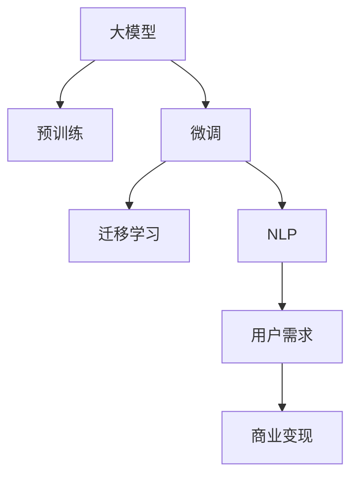

                 

# AI大模型创业：如何构建未来可持续的商业模式？

在人工智能快速发展的今天，大模型（如GPT-4等）已经成为商业竞争的核心资产。然而，如何构建基于大模型的可持续商业模式，是一个亟待解答的重要问题。本文将从背景介绍、核心概念、核心算法、应用场景、实践指南等多个维度，探讨如何通过大模型创业，开创未来可持续的商业模式。

## 1. 背景介绍

### 1.1 问题由来

近年来，人工智能技术特别是大模型技术的突飞猛进，为各行各业带来了前所未有的变革。大模型不仅在图像识别、语音识别、自然语言处理等领域取得了显著成果，而且正在逐步应用于更加复杂的应用场景。例如，GPT-4等大模型已经在自然语言生成、推理、分析等领域展示了强大的能力，吸引了大量资本和技术的投入。

### 1.2 问题核心关键点

构建基于大模型的可持续商业模式，需要解决以下核心问题：
- **市场定位**：大模型需要面向哪个市场，解决哪个问题？
- **技术积累**：如何在大模型开发过程中，积累核心技术，保持竞争优势？
- **商业模式创新**：如何基于大模型开发新的业务模式，实现盈利？
- **用户体验优化**：如何提升用户体验，扩大市场规模？
- **生态建设**：如何构建开放生态，吸引更多的合作伙伴和用户？

### 1.3 问题研究意义

构建基于大模型的商业模式，不仅能够为企业带来巨大的经济效益，还能推动整个行业的技术进步和应用普及。具体而言，其研究意义包括：

- **经济效益**：大模型商业化应用，可以带来新的收入来源，推动企业持续发展。
- **技术进步**：大模型创业能够加速技术研发和创新，推动AI技术的广泛应用。
- **社会价值**：大模型能够解决实际问题，提升生产效率，优化用户体验。
- **市场竞争**：构建大模型生态系统，能够吸引更多的合作伙伴和用户，增强市场竞争力。

## 2. 核心概念与联系

### 2.1 核心概念概述

构建基于大模型的商业模式，需要理解以下几个关键概念：

- **大模型（Large Language Model）**：一种通过大量文本数据预训练得到的语言模型，具有强大的自然语言处理能力。
- **预训练（Pre-training）**：通过无监督学习，在大规模文本数据上训练模型，学习通用的语言表示。
- **微调（Fine-tuning）**：在大模型基础上，使用特定任务的数据集进行有监督学习，优化模型在该任务上的表现。
- **迁移学习（Transfer Learning）**：通过在大模型上进行微调，将学到的知识迁移到其他相关任务上，实现知识的泛化。
- **自然语言处理（Natural Language Processing, NLP）**：使用AI技术处理、分析、生成自然语言，提高人机交互效率。
- **用户需求（User Demand）**：识别和满足用户真实需求，提升用户体验，增加用户粘性。
- **商业变现（Commercialization）**：通过大模型技术开发商业产品，实现商业模式创新。

这些概念构成了构建基于大模型的商业模式的理论基础。理解这些概念的联系，有助于全面把握大模型创业的各个环节。

### 2.2 核心概念原理和架构的 Mermaid 流程图



这个流程图展示了大模型从预训练、微调到最终商业变现的整个过程。

## 3. 核心算法原理 & 具体操作步骤

### 3.1 算法原理概述

构建基于大模型的商业模式，核心在于如何将大模型应用于实际业务，并通过算法优化，实现经济效益的最大化。以下是基本的算法原理：

- **市场分析**：分析目标市场的需求，识别潜在用户，设计模型应用场景。
- **模型选择**：选择合适的预训练大模型，确保其能力符合业务需求。
- **数据准备**：收集和整理训练数据，确保数据质量和多样性。
- **模型微调**：在预训练大模型的基础上，进行有监督的微调，优化模型在特定任务上的表现。
- **商业化应用**：将微调后的模型应用于实际业务场景，开发商业产品。
- **用户反馈**：收集用户反馈，优化模型和产品，提升用户体验。

### 3.2 算法步骤详解

构建基于大模型的商业模式，一般包括以下几个关键步骤：

**Step 1: 市场分析与需求识别**
- 定义目标市场：识别目标用户群体，明确其需求和痛点。
- 设计应用场景：确定大模型在特定业务场景下的应用，如客服、翻译、推荐等。

**Step 2: 选择合适的预训练模型**
- 评估现有大模型的能力：如GPT-4、BERT等，确保其符合业务需求。
- 定制模型：根据特定需求，调整模型架构和参数设置。

**Step 3: 数据准备与预训练**
- 收集数据：根据业务需求，收集相应的文本数据，确保数据质量和多样性。
- 数据清洗：处理缺失值、噪声数据，确保数据干净。
- 数据增强：通过数据扩充、回译等方式，提升数据多样性。

**Step 4: 模型微调**
- 设计任务适配层：根据业务场景，设计合适的任务输出层和损失函数。
- 设置微调超参数：如学习率、批大小、迭代轮数等，确保微调效果。
- 执行梯度训练：对数据进行批处理，前向传播计算损失，反向传播更新参数。
- 评估模型性能：在验证集和测试集上评估模型表现，优化参数设置。

**Step 5: 商业化应用**
- 产品设计：根据微调结果，设计商业产品，确保用户友好。
- 部署上线：将模型部署到服务器，提供API接口，供用户调用。
- 用户反馈收集：通过用户反馈，持续优化产品，提升用户体验。

**Step 6: 持续优化**
- 模型迭代：根据用户反馈和业务需求，不断更新模型，提升性能。
- 商业变现：通过收费、广告、订阅等方式，实现商业变现。

### 3.3 算法优缺点

构建基于大模型的商业模式，具有以下优点：

- **性能提升**：大模型具有强大的语言理解能力和生成能力，能够提升业务处理效率和效果。
- **广泛应用**：大模型可以应用于各种NLP任务，如翻译、问答、摘要、推荐等，具有广阔的应用前景。
- **易用性高**：现有大模型API接口丰富，开发门槛较低，可以快速实现商业产品。

同时，该方法也存在一定的局限性：

- **数据依赖**：大模型性能受数据质量和多样性的影响较大，需要持续收集和清洗数据。
- **资源消耗大**：大模型计算资源消耗大，部署和维护成本较高。
- **隐私风险**：大模型需要处理大量用户数据，存在隐私泄露的风险。

尽管存在这些局限性，但就目前而言，基于大模型的商业模式仍是大模型应用的主流范式。未来相关研究的重点在于如何进一步降低对数据和计算资源的依赖，提高模型的安全性，同时兼顾用户隐私保护。

### 3.4 算法应用领域

基于大模型的商业模式，已经在多个领域取得了广泛应用，包括但不限于：

- **金融**：通过大模型进行信用评估、情感分析、舆情监测等，提高金融服务的智能化水平。
- **医疗**：使用大模型进行疾病诊断、药物研发、患者咨询等，提升医疗服务的效率和准确性。
- **教育**：利用大模型进行智能答疑、个性化推荐、语言学习等，推动教育公平和个性化教育的发展。
- **零售**：通过大模型进行用户画像分析、商品推荐、智能客服等，提升零售服务的个性化和精准度。
- **客服**：构建基于大模型的智能客服系统，提高客户咨询的响应速度和质量，降低人力成本。

除了上述这些经典领域，大模型还在更多垂直行业找到了应用，如法律咨询、旅游规划、工业制造等，为各行各业带来新的商业机遇。

## 4. 数学模型和公式 & 详细讲解 & 举例说明

### 4.1 数学模型构建

构建基于大模型的商业模式，需要理解数学模型和公式的原理。以下是一个简单的例子：

假设我们希望通过大模型实现情感分析任务。假设模型输入为一句话 $x$，输出为情感标签 $y \in \{pos, neg\}$。模型的预测函数为 $P(y|x; \theta)$，其中 $\theta$ 为模型参数。

目标是最小化模型在训练集 $D$ 上的损失函数 $\mathcal{L}$，即：

$$
\min_{\theta} \mathcal{L}(P(y|x; \theta), y)
$$

常用的损失函数包括交叉熵损失、均方误差损失等。这里以交叉熵损失为例，其计算公式为：

$$
\mathcal{L}(y, \hat{y}) = -\frac{1}{N}\sum_{i=1}^N (y_i \log \hat{y}_i + (1 - y_i) \log (1 - \hat{y}_i))
$$

其中 $y_i$ 为真实标签，$\hat{y}_i$ 为模型预测结果。

### 4.2 公式推导过程

以交叉熵损失为例，推导其梯度公式：

$$
\frac{\partial \mathcal{L}}{\partial \theta_k} = -\frac{1}{N}\sum_{i=1}^N \left(\frac{y_i}{\hat{y}_i} - \frac{1 - y_i}{1 - \hat{y}_i}\right) \frac{\partial \hat{y}_i}{\partial \theta_k}
$$

其中 $\frac{\partial \hat{y}_i}{\partial \theta_k}$ 为模型输出对参数 $\theta_k$ 的导数，可以通过反向传播算法高效计算。

### 4.3 案例分析与讲解

以情感分析为例，使用大模型进行微调。

**Step 1: 数据准备**
- 收集情感标注数据集，如IMDB评论数据集。
- 对数据进行预处理，包括分词、去噪、标准化等。

**Step 2: 模型微调**
- 选择合适的预训练模型，如BERT。
- 添加任务适配层：在BERT顶层添加一个全连接层，输出情感类别。
- 设计损失函数：使用交叉熵损失，计算预测结果与真实标签之间的差异。
- 设置超参数：如学习率、批大小等。

**Step 3: 模型训练**
- 将数据分批次输入模型，前向传播计算损失。
- 反向传播更新模型参数，使用优化算法如AdamW。
- 在验证集上评估模型性能，优化超参数设置。

**Step 4: 商业化应用**
- 设计API接口，供用户调用。
- 提供示例应用场景，如客户评论分析、舆情监测等。

**Step 5: 持续优化**
- 收集用户反馈，优化模型性能。
- 实时更新模型，提升情感分析准确度。

## 5. 项目实践：代码实例和详细解释说明

### 5.1 开发环境搭建

在进行项目实践前，需要搭建好开发环境。以下是使用Python进行PyTorch开发的环境配置流程：

1. 安装Anaconda：从官网下载并安装Anaconda，用于创建独立的Python环境。

2. 创建并激活虚拟环境：
```bash
conda create -n pytorch-env python=3.8 
conda activate pytorch-env
```

3. 安装PyTorch：根据CUDA版本，从官网获取对应的安装命令。例如：
```bash
conda install pytorch torchvision torchaudio cudatoolkit=11.1 -c pytorch -c conda-forge
```

4. 安装其他相关库：
```bash
pip install numpy pandas scikit-learn torchtext transformers
```

完成上述步骤后，即可在`pytorch-env`环境中开始项目实践。

### 5.2 源代码详细实现

以下是使用PyTorch进行情感分析任务的大模型微调代码实现。

```python
import torch
import torch.nn as nn
import torch.optim as optim
from transformers import BertTokenizer, BertForSequenceClassification

# 准备数据集
tokenizer = BertTokenizer.from_pretrained('bert-base-uncased')
train_dataset = ...  # 情感标注训练集
dev_dataset = ...  # 情感标注验证集
test_dataset = ...  # 情感标注测试集

# 定义模型
model = BertForSequenceClassification.from_pretrained('bert-base-uncased', num_labels=2)
model.eval()

# 定义损失函数
criterion = nn.CrossEntropyLoss()

# 定义优化器
optimizer = optim.Adam(model.parameters(), lr=2e-5)

# 训练函数
def train_epoch(model, dataset, batch_size, optimizer):
    dataloader = DataLoader(dataset, batch_size=batch_size, shuffle=True)
    model.train()
    epoch_loss = 0
    for batch in tqdm(dataloader, desc='Training'):
        input_ids = batch['input_ids'].to(device)
        attention_mask = batch['attention_mask'].to(device)
        labels = batch['labels'].to(device)
        model.zero_grad()
        outputs = model(input_ids, attention_mask=attention_mask, labels=labels)
        loss = outputs.loss
        epoch_loss += loss.item()
        loss.backward()
        optimizer.step()
    return epoch_loss / len(dataloader)

# 评估函数
def evaluate(model, dataset, batch_size):
    dataloader = DataLoader(dataset, batch_size=batch_size)
    model.eval()
    preds, labels = [], []
    with torch.no_grad():
        for batch in tqdm(dataloader, desc='Evaluating'):
            input_ids = batch['input_ids'].to(device)
            attention_mask = batch['attention_mask'].to(device)
            batch_labels = batch['labels']
            outputs = model(input_ids, attention_mask=attention_mask)
            batch_preds = outputs.logits.argmax(dim=2).to('cpu').tolist()
            batch_labels = batch_labels.to('cpu').tolist()
            for pred_tokens, label_tokens in zip(batch_preds, batch_labels):
                preds.append(pred_tokens[:len(label_tokens)])
                labels.append(label_tokens)
    return preds, labels

# 启动训练流程并在测试集上评估
epochs = 5
batch_size = 16

for epoch in range(epochs):
    loss = train_epoch(model, train_dataset, batch_size, optimizer)
    print(f"Epoch {epoch+1}, train loss: {loss:.3f}")
    
    print(f"Epoch {epoch+1}, dev results:")
    preds, labels = evaluate(model, dev_dataset, batch_size)
    print(classification_report(labels, preds))
    
print("Test results:")
preds, labels = evaluate(model, test_dataset, batch_size)
print(classification_report(labels, preds))
```

以上是使用PyTorch对BERT进行情感分析任务微调的完整代码实现。可以看到，使用Transformers库可以极大地简化大模型微调的实现过程。

### 5.3 代码解读与分析

让我们再详细解读一下关键代码的实现细节：

**数据处理函数**：
- `NERDataset`类：定义了数据集的处理函数，包括文本的token化、标签的编码等。

**标签与id的映射**：
- `tag2id`和`id2tag`字典：定义了标签与数字id之间的映射关系，用于将token-wise的预测结果解码回真实的标签。

**训练和评估函数**：
- `train_epoch`函数：对数据以批为单位进行迭代，在每个批次上前向传播计算损失，反向传播更新模型参数，最后返回该epoch的平均loss。
- `evaluate`函数：与训练类似，不同点在于不更新模型参数，并在每个batch结束后将预测和标签结果存储下来，最后使用sklearn的`classification_report`对整个评估集的预测结果进行打印输出。

**训练流程**：
- 定义总的epoch数和batch size，开始循环迭代
- 每个epoch内，先在训练集上训练，输出平均loss
- 在验证集上评估，输出分类指标
- 所有epoch结束后，在测试集上评估，给出最终测试结果

可以看出，使用PyTorch和Transformers库，大模型的微调实现变得简洁高效。开发者可以将更多精力放在数据处理、模型改进等高层逻辑上，而不必过多关注底层的实现细节。

## 6. 实际应用场景

### 6.1 智能客服系统

基于大模型的微调技术，可以广泛应用于智能客服系统的构建。传统客服往往需要配备大量人力，高峰期响应缓慢，且一致性和专业性难以保证。而使用微调后的对话模型，可以7x24小时不间断服务，快速响应客户咨询，用自然流畅的语言解答各类常见问题。

在技术实现上，可以收集企业内部的历史客服对话记录，将问题和最佳答复构建成监督数据，在此基础上对预训练对话模型进行微调。微调后的对话模型能够自动理解用户意图，匹配最合适的答案模板进行回复。对于客户提出的新问题，还可以接入检索系统实时搜索相关内容，动态组织生成回答。如此构建的智能客服系统，能大幅提升客户咨询体验和问题解决效率。

### 6.2 金融舆情监测

金融机构需要实时监测市场舆论动向，以便及时应对负面信息传播，规避金融风险。传统的人工监测方式成本高、效率低，难以应对网络时代海量信息爆发的挑战。基于大语言模型微调的文本分类和情感分析技术，为金融舆情监测提供了新的解决方案。

具体而言，可以收集金融领域相关的新闻、报道、评论等文本数据，并对其进行主题标注和情感标注。在此基础上对预训练语言模型进行微调，使其能够自动判断文本属于何种主题，情感倾向是正面、中性还是负面。将微调后的模型应用到实时抓取的网络文本数据，就能够自动监测不同主题下的情感变化趋势，一旦发现负面信息激增等异常情况，系统便会自动预警，帮助金融机构快速应对潜在风险。

### 6.3 个性化推荐系统

当前的推荐系统往往只依赖用户的历史行为数据进行物品推荐，无法深入理解用户的真实兴趣偏好。基于大语言模型微调技术，个性化推荐系统可以更好地挖掘用户行为背后的语义信息，从而提供更精准、多样的推荐内容。

在实践中，可以收集用户浏览、点击、评论、分享等行为数据，提取和用户交互的物品标题、描述、标签等文本内容。将文本内容作为模型输入，用户的后续行为（如是否点击、购买等）作为监督信号，在此基础上微调预训练语言模型。微调后的模型能够从文本内容中准确把握用户的兴趣点。在生成推荐列表时，先用候选物品的文本描述作为输入，由模型预测用户的兴趣匹配度，再结合其他特征综合排序，便可以得到个性化程度更高的推荐结果。

### 6.4 未来应用展望

随着大语言模型和微调方法的不断发展，基于微调范式将在更多领域得到应用，为传统行业带来变革性影响。

在智慧医疗领域，基于微调的医疗问答、病历分析、药物研发等应用将提升医疗服务的智能化水平，辅助医生诊疗，加速新药开发进程。

在智能教育领域，微调技术可应用于作业批改、学情分析、知识推荐等方面，因材施教，促进教育公平，提高教学质量。

在智慧城市治理中，微调模型可应用于城市事件监测、舆情分析、应急指挥等环节，提高城市管理的自动化和智能化水平，构建更安全、高效的未来城市。

此外，在企业生产、社会治理、文娱传媒等众多领域，基于大模型微调的人工智能应用也将不断涌现，为NLP技术带来新的应用场景。相信随着预训练语言模型和微调方法的持续演进，大语言模型微调技术必将在构建人机协同的智能时代中扮演越来越重要的角色。

## 7. 工具和资源推荐

### 7.1 学习资源推荐

为了帮助开发者系统掌握大语言模型微调的理论基础和实践技巧，这里推荐一些优质的学习资源：

1. 《Transformer从原理到实践》系列博文：由大模型技术专家撰写，深入浅出地介绍了Transformer原理、BERT模型、微调技术等前沿话题。

2. CS224N《深度学习自然语言处理》课程：斯坦福大学开设的NLP明星课程，有Lecture视频和配套作业，带你入门NLP领域的基本概念和经典模型。

3. 《Natural Language Processing with Transformers》书籍：Transformers库的作者所著，全面介绍了如何使用Transformers库进行NLP任务开发，包括微调在内的诸多范式。

4. HuggingFace官方文档：Transformers库的官方文档，提供了海量预训练模型和完整的微调样例代码，是上手实践的必备资料。

5. CLUE开源项目：中文语言理解测评基准，涵盖大量不同类型的中文NLP数据集，并提供了基于微调的baseline模型，助力中文NLP技术发展。

通过对这些资源的学习实践，相信你一定能够快速掌握大语言模型微调的精髓，并用于解决实际的NLP问题。

### 7.2 开发工具推荐

高效的开发离不开优秀的工具支持。以下是几款用于大语言模型微调开发的常用工具：

1. PyTorch：基于Python的开源深度学习框架，灵活动态的计算图，适合快速迭代研究。大部分预训练语言模型都有PyTorch版本的实现。

2. TensorFlow：由Google主导开发的开源深度学习框架，生产部署方便，适合大规模工程应用。同样有丰富的预训练语言模型资源。

3. Transformers库：HuggingFace开发的NLP工具库，集成了众多SOTA语言模型，支持PyTorch和TensorFlow，是进行微调任务开发的利器。

4. Weights & Biases：模型训练的实验跟踪工具，可以记录和可视化模型训练过程中的各项指标，方便对比和调优。与主流深度学习框架无缝集成。

5. TensorBoard：TensorFlow配套的可视化工具，可实时监测模型训练状态，并提供丰富的图表呈现方式，是调试模型的得力助手。

6. Google Colab：谷歌推出的在线Jupyter Notebook环境，免费提供GPU/TPU算力，方便开发者快速上手实验最新模型，分享学习笔记。

合理利用这些工具，可以显著提升大语言模型微调任务的开发效率，加快创新迭代的步伐。

### 7.3 相关论文推荐

大语言模型和微调技术的发展源于学界的持续研究。以下是几篇奠基性的相关论文，推荐阅读：

1. Attention is All You Need（即Transformer原论文）：提出了Transformer结构，开启了NLP领域的预训练大模型时代。

2. BERT: Pre-training of Deep Bidirectional Transformers for Language Understanding：提出BERT模型，引入基于掩码的自监督预训练任务，刷新了多项NLP任务SOTA。

3. Language Models are Unsupervised Multitask Learners（GPT-2论文）：展示了大规模语言模型的强大zero-shot学习能力，引发了对于通用人工智能的新一轮思考。

4. Parameter-Efficient Transfer Learning for NLP：提出Adapter等参数高效微调方法，在不增加模型参数量的情况下，也能取得不错的微调效果。

5. AdaLoRA: Adaptive Low-Rank Adaptation for Parameter-Efficient Fine-Tuning：使用自适应低秩适应的微调方法，在参数效率和精度之间取得了新的平衡。

这些论文代表了大语言模型微调技术的发展脉络。通过学习这些前沿成果，可以帮助研究者把握学科前进方向，激发更多的创新灵感。

## 8. 总结：未来发展趋势与挑战

### 8.1 总结

本文对构建基于大模型的可持续商业模式进行了全面系统的介绍。首先阐述了大语言模型和微调技术的研究背景和意义，明确了微调在拓展预训练模型应用、提升下游任务性能方面的独特价值。其次，从原理到实践，详细讲解了微调的数学模型和关键步骤，给出了微调任务开发的完整代码实例。同时，本文还探讨了微调方法在智能客服、金融舆情、个性化推荐等多个行业领域的应用前景，展示了微调范式的巨大潜力。此外，本文精选了微调技术的各类学习资源，力求为读者提供全方位的技术指引。

通过本文的系统梳理，可以看到，基于大模型的微调技术正在成为NLP领域的重要范式，极大地拓展了预训练语言模型的应用边界，催生了更多的落地场景。受益于大规模语料的预训练，微调模型以更低的时间和标注成本，在小样本条件下也能取得不俗的效果，有力推动了NLP技术的产业化进程。未来，伴随预训练语言模型和微调方法的持续演进，大语言模型微调必将在构建人机协同的智能时代中扮演越来越重要的角色。

### 8.2 未来发展趋势

展望未来，大语言模型微调技术将呈现以下几个发展趋势：

1. **市场规模持续扩大**：随着大模型技术的不断成熟，其应用范围将进一步扩大，市场规模也将持续增长。

2. **应用场景更加多样**：大模型微调将应用于更多垂直领域，如医疗、法律、工业等，解决更多实际问题。

3. **技术创新加速**：预训练大模型、微调技术将不断进步，产生更多的SOTA算法和模型。

4. **跨模态融合**：大模型微调将更多地与图像、视频、语音等模态数据结合，形成多模态融合的智能系统。

5. **商业变现模式创新**：大模型微调将探索更多商业变现模式，如订阅服务、API接口收费等。

6. **用户定制化服务**：根据用户需求定制化大模型微调，提升用户体验。

7. **生态系统建设**：建立开放、协同的生态系统，吸引更多合作伙伴和用户，推动行业发展。

### 8.3 面临的挑战

尽管大语言模型微调技术已经取得了瞩目成就，但在迈向更加智能化、普适化应用的过程中，它仍面临着诸多挑战：

1. **数据依赖**：大模型性能受数据质量和多样性的影响较大，需要持续收集和清洗数据。

2. **计算资源消耗大**：大模型计算资源消耗大，部署和维护成本较高。

3. **隐私风险**：大模型需要处理大量用户数据，存在隐私泄露的风险。

4. **模型鲁棒性不足**：当前微调模型面对域外数据时，泛化性能往往大打折扣。

5. **可解释性不足**：当前微调模型更像是"黑盒"系统，难以解释其内部工作机制和决策逻辑。

6. **安全防护不足**：模型面临恶意攻击和误用风险，需要建立完备的安全防护机制。

7. **标准化问题**：缺乏统一的标准和规范，导致不同系统间兼容性差。

### 8.4 研究展望

面对大语言模型微调所面临的种种挑战，未来的研究需要在以下几个方面寻求新的突破：

1. **无监督和半监督微调方法**：摆脱对大规模标注数据的依赖，利用自监督学习、主动学习等无监督和半监督范式，最大限度利用非结构化数据。

2. **参数高效和计算高效的微调方法**：开发更加参数高效的微调方法，在固定大部分预训练参数的同时，只更新极少量的任务相关参数。

3. **因果学习和对比学习范式**：通过引入因果推断和对比学习思想，增强微调模型建立稳定因果关系的能力，学习更加普适、鲁棒的语言表征。

4. **多模态融合**：将符号化的先验知识与神经网络模型进行融合，提升模型性能。

5. **伦理道德约束**：在模型训练目标中引入伦理导向的评估指标，过滤和惩罚有偏见、有害的输出倾向。

6. **模型评估和标准化**：建立统一的标准和规范，确保不同系统间的兼容性。

这些研究方向的探索，必将引领大语言模型微调技术迈向更高的台阶，为构建安全、可靠、可解释、可控的智能系统铺平道路。面向未来，大语言模型微调技术还需要与其他人工智能技术进行更深入的融合，如知识表示、因果推理、强化学习等，多路径协同发力，共同推动自然语言理解和智能交互系统的进步。只有勇于创新、敢于突破，才能不断拓展语言模型的边界，让智能技术更好地造福人类社会。

## 9. 附录：常见问题与解答

**Q1: 大模型微调适用于所有NLP任务吗？**

A: 大模型微调在大多数NLP任务上都能取得不错的效果，特别是对于数据量较小的任务。但对于一些特定领域的任务，如医学、法律等，仅仅依靠通用语料预训练的模型可能难以很好地适应。此时需要在特定领域语料上进一步预训练，再进行微调，才能获得理想效果。

**Q2: 如何选择合适的学习率？**

A: 微调的学习率一般要比预训练时小1-2个数量级，如果使用过大的学习率，容易破坏预训练权重，导致过拟合。一般建议从1e-5开始调参，逐步减小学习率，直至收敛。也可以使用warmup策略，在开始阶段使用较小的学习率，再逐渐过渡到预设值。

**Q3: 采用大模型微调时会面临哪些资源瓶颈？**

A: 目前主流的预训练大模型动辄以亿计的参数规模，对算力、内存、存储都提出了很高的要求。GPU/TPU等高性能设备是必不可少的，但即便如此，超大批次的训练和推理也可能遇到显存不足的问题。因此需要采用一些资源优化技术，如梯度积累、混合精度训练、模型并行等，来突破硬件瓶颈。

**Q4: 如何缓解微调过程中的过拟合问题？**

A: 过拟合是微调面临的主要挑战，尤其是在标注数据不足的情况下。常见的缓解策略包括：

- 数据增强：通过回译、近义替换等方式扩充训练集
- 正则化：使用L2正则、Dropout、Early Stopping等避免过拟合
- 对抗训练：引入对抗样本，提高模型鲁棒性
- 参数高效微调：只调整少量参数(如Adapter、Prefix等)，减小过拟合风险
- 多模型集成：训练多个微调模型，取平均输出，抑制过拟合

这些策略往往需要根据具体任务和数据特点进行灵活组合。只有在数据、模型、训练、推理等各环节进行全面优化，才能最大限度地发挥大模型微调的威力。

**Q5: 大模型微调在落地部署时需要注意哪些问题？**

A: 将微调模型转化为实际应用，还需要考虑以下因素：

- 模型裁剪：去除不必要的层和参数，减小模型尺寸，加快推理速度
- 量化加速：将浮点模型转为定点模型，压缩存储空间，提高计算效率
- 服务化封装：将模型封装为标准化服务接口，便于集成调用
- 弹性伸缩：根据请求流量动态调整资源配置，平衡服务质量和成本
- 监控告警：实时采集系统指标，设置异常告警阈值，确保服务稳定性
- 安全防护：采用访问鉴权、数据脱敏等措施，保障数据和模型安全

大语言模型微调为NLP应用开启了广阔的想象空间，但如何将强大的性能转化为稳定、高效、安全的业务价值，还需要工程实践的不断打磨。唯有从数据、算法、工程、业务等多个维度协同发力，才能真正实现人工智能技术在垂直行业的规模化落地。总之，微调需要开发者根据具体任务，不断迭代和优化模型、数据和算法，方能得到理想的效果。

---

作者：禅与计算机程序设计艺术 / Zen and the Art of Computer Programming

