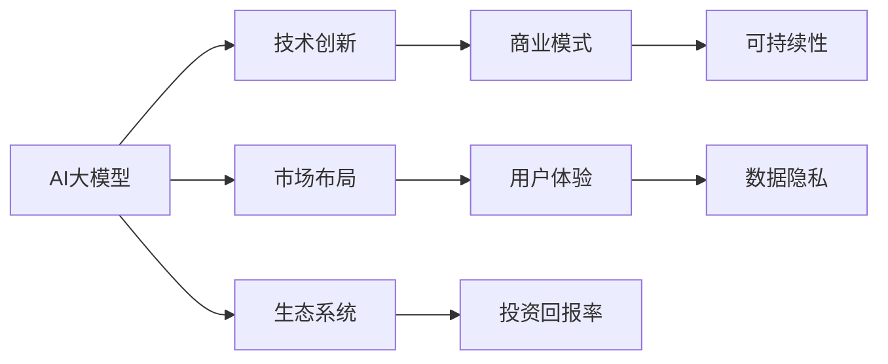

                 

# AI大模型创业：如何构建未来可持续的商业模式？

> 关键词：AI大模型，商业模式，创业策略，可持续性，技术创新，市场布局，用户体验，数据隐私，生态系统，投资回报

## 1. 背景介绍

随着人工智能(AI)技术的迅猛发展，尤其是大模型(AI大模型)的出现，AI创业公司如雨后春笋般涌现。这些公司依靠强大的AI能力，在诸多领域取得了显著的商业成果，如自动驾驶、医疗健康、金融服务、智能客服等。然而，尽管AI技术本身不断发展，商业化的成功率却并不高。据统计，约90%的AI初创公司未能成功落地，多数陷入资金链断裂、技术迭代困难、用户体验不理想的境地。究其原因，主要在于AI公司往往在商业模式上存在缺陷，缺乏可持续性。因此，如何构建未来的可持续商业模式，是当前AI创业公司面临的重大挑战。

本文将深入探讨AI大模型创业公司在商业模式构建中可能遇到的问题，并结合实际案例，提出一套构建可持续商业模式的方法。通过系统地分析AI大模型的优势与局限，结合商业理论，给出全面、系统的商业模式构建建议，以期对AI大模型创业公司有所启发。

## 2. 核心概念与联系

### 2.1 核心概念概述

为更好地理解如何构建可持续的AI大模型商业模式，本节将介绍几个核心概念：

- AI大模型：基于深度学习技术，通过大规模数据预训练得到的大型通用语言模型或视觉模型，如GPT-3、BERT等。具备强大的学习和推理能力，能够在多个领域提供高效、准确的应用。

- 商业模式：企业的盈利模式，包括产品、服务、价格、渠道、用户等要素，决定着企业的市场竞争力和盈利水平。

- 可持续性：指商业模式能够在较长时期内，满足企业成长、市场竞争、社会责任等多方面需求，实现良性循环。

- 技术创新：通过技术研发和应用创新，实现产品功能迭代、性能提升、用户体验优化等目标。

- 市场布局：通过市场分析和战略规划，选择适合的地理区域、行业领域、客户群体等进行市场布局，提高市场占有率和客户满意度。

- 用户体验：指用户在使用产品或服务时的感受和满意度，是商业成功的关键因素。

- 数据隐私：涉及个人信息的收集、存储、使用、传输等过程中，如何保护用户隐私权益，防止信息泄露和滥用。

- 生态系统：指由企业、用户、合作伙伴、竞争对手、监管机构等构成的一系列关系网络，通过协同合作，实现价值最大化。

- 投资回报率(ROI)：衡量商业模式的经济效益，通过利润、市场份额、客户忠诚度等指标进行评估。

这些概念构成了AI大模型商业模式的核心要素，通过它们之间的相互作用，可以形成有效的商业模式，实现企业的长期发展。

### 2.2 核心概念原理和架构的 Mermaid 流程图



这个流程图展示了大模型商业模式的核心概念及其之间的关系：

1. AI大模型是商业模式的起点，通过技术创新不断优化产品和服务。
2. 市场布局决定商业模式的市场定位，选择适合的地理区域、行业领域和客户群体。
3. 用户体验影响用户满意度，是商业模式成功的关键因素。
4. 数据隐私保护用户的个人信息，是企业合法经营的前提。
5. 可持续性保证商业模式长期稳定，实现良性循环。
6. 生态系统由企业与多方构成，通过协同合作实现价值最大化。
7. 投资回报率衡量商业模式的经济效益，引导商业模式优化和调整。

这些概念通过复杂的交互作用，形成了一个有机整体，共同支撑商业模式的构建和运行。

## 3. 核心算法原理 & 具体操作步骤

### 3.1 算法原理概述

AI大模型的商业成功，很大程度上依赖于其技术能力和应用场景的契合度。然而，技术能力本身并不足以保障商业模式的成功，还需要从商业模式构建的多个维度进行综合考量。本文将从技术创新、市场布局、用户体验、数据隐私、生态系统和投资回报率等六个方面，探讨如何构建可持续的AI大模型商业模式。

### 3.2 算法步骤详解

构建可持续的AI大模型商业模式，主要包括以下几个关键步骤：

**Step 1: 技术创新驱动**

1. **选择适合的预训练模型**：根据应用场景，选择最优的预训练大模型。考虑模型的能力范围、计算资源需求、训练数据要求等因素。
2. **持续优化模型性能**：在预训练基础上，针对特定应用场景进行微调，提升模型精度、速度和泛化能力。
3. **引入新兴技术**：探索前沿技术如联邦学习、对抗生成网络、跨模态学习等，解决传统技术无法应对的问题。

**Step 2: 市场布局谋略**

1. **进行市场细分**：分析目标市场的行业分布、地理区域、客户群体等，确定市场细分策略。
2. **制定市场进入计划**：根据市场细分结果，制定进入不同市场的具体策略，如直接进入、间接进入或合作进入。
3. **布局市场资源**：确定市场资源布局，如设立办事处、开发本地化版本、建立合作伙伴关系等。

**Step 3: 用户体验优化**

1. **了解用户需求**：通过调研、访谈、反馈等方式，了解用户对产品或服务的真实需求。
2. **优化产品功能**：根据用户需求，进行产品功能的优化和迭代，提升用户体验。
3. **设计用户体验**：通过UI/UX设计、客户支持、技术文档等手段，提高用户使用产品的愉悦度和满意度。

**Step 4: 数据隐私保护**

1. **建立数据隐私政策**：制定明确的数据隐私政策，确保用户数据的安全性和隐私性。
2. **采用隐私保护技术**：如差分隐私、同态加密、隐私计算等，保护用户数据免受泄露和滥用。
3. **用户授权与控制**：允许用户对个人数据进行授权和控制，增强用户的信任感。

**Step 5: 生态系统建设**

1. **构建多方合作网络**：与科研机构、大学、企业等建立合作关系，共同推进技术研发和应用落地。
2. **打造产品生态链**：围绕AI大模型，构建上下游产业链，促进产业链的协同发展。
3. **建立社区和品牌**：通过社区活动、技术交流、品牌建设等方式，提高AI大模型的知名度和用户粘性。

**Step 6: 投资回报评估**

1. **衡量投资回报率**：通过分析利润、市场份额、客户忠诚度等指标，评估商业模式的经济回报。
2. **优化商业策略**：根据投资回报率评估结果，调整商业策略，提升盈利能力和市场竞争力。
3. **持续融资与投资**：结合市场需求和技术发展趋势，制定融资计划，保障企业资金链的稳定。

### 3.3 算法优缺点

构建可持续的AI大模型商业模式，具有以下优点：

1. **增强竞争力**：通过技术创新和市场布局，提升企业竞争力，快速占领市场。
2. **提升用户体验**：优化用户体验，增强用户粘性，提高用户满意度和忠诚度。
3. **确保数据隐私**：建立数据隐私政策，保护用户数据，提升用户信任。
4. **构建生态系统**：通过多方合作，扩大市场影响力，实现共赢。
5. **实现高投资回报**：通过衡量和优化投资回报率，保障企业的长期稳定发展。

同时，这种商业模式也存在一定的缺点：

1. **高昂的初期投入**：AI大模型的研发和应用需要大量资金和技术投入，初期成本较高。
2. **技术复杂性高**：AI大模型的开发和维护需要高水平的技术团队，技术门槛较高。
3. **市场变化快速**：AI技术和市场需求不断变化，商业模式需要持续调整和优化。
4. **数据隐私风险**：用户数据泄露和滥用可能对企业声誉造成严重影响。

### 3.4 算法应用领域

构建可持续的AI大模型商业模式，广泛应用于以下几个领域：

1. **自动驾驶**：通过AI大模型实现智能驾驶、自动泊车、路径规划等功能，提升交通安全和效率。
2. **医疗健康**：利用AI大模型进行疾病诊断、治疗方案推荐、健康管理等，提升医疗服务水平。
3. **金融服务**：通过AI大模型进行风险评估、欺诈检测、智能投顾等，提升金融服务质量。
4. **智能客服**：利用AI大模型实现自动化问答、情感分析、客户推荐等功能，提升客户服务体验。
5. **智能制造**：通过AI大模型进行设备维护、质量检测、生产调度等，提升制造业智能化水平。
6. **智能家居**：利用AI大模型实现智能控制、语音识别、情境感知等功能，提升家居智能化体验。

这些领域都受益于AI大模型的强大能力，为商业模式提供了广阔的应用空间。

## 4. 数学模型和公式 & 详细讲解 & 举例说明

### 4.1 数学模型构建

为更精确地分析AI大模型的商业模式，我们将其抽象为以下数学模型：

设商业模式的总收益为R，总成本为C，净收益为N，则有：

$$N = R - C$$

R、C和N分别由以下因素决定：

1. **R**：市场份额、用户数量、客户转化率等。
2. **C**：研发成本、生产成本、销售成本、运营成本等。
3. **N**：利润、市场竞争力、用户忠诚度等。

通过优化上述模型，可以提升商业模式的可持续性。

### 4.2 公式推导过程

我们假设R、C和N分别由市场规模M、市场份额S、研发投入D、生产成本F、销售成本E、运营成本H、用户增长率G、客户转化率T、用户粘性K等变量决定。则有：

$$R = M \times S \times G \times T \times K$$

$$C = D + F + E + H$$

$$N = R - C$$

将上述公式代入N，并对其进行简化，得到：

$$N = M \times S \times G \times T \times K - D - F - E - H$$

可以看出，商业模式的总收益取决于市场规模、市场份额、用户增长率、客户转化率和用户粘性，而总成本取决于研发投入、生产成本、销售成本和运营成本。

### 4.3 案例分析与讲解

假设有一家AI大模型创业公司，利用BERT模型进行智能客服应用开发。该公司在初期投入了1000万美元的研发成本，预计生产成本为100万美元，销售成本为500万美元，运营成本为200万美元。市场规模为100亿美元，市场份额为1%，用户增长率为20%，客户转化率为30%，用户粘性为80%。根据上述模型，可以计算出该公司的净收益为：

$$N = 100 \times 0.01 \times 1.2 \times 0.3 \times 0.8 - 1000 - 100 - 500 - 200$$
$$N = 7.2 - 1800$$
$$N = -1792.8$$

由此可见，尽管该公司在初期投入较大，但由于市场份额较低、用户粘性不足，导致净收益为负，商业模式存在较大的风险。

## 5. 项目实践：代码实例和详细解释说明

### 5.1 开发环境搭建

在进行商业模式构建和分析时，需要构建一个能够支持数据处理、计算分析和可视化展示的环境。以下是使用Python进行PyTorch和Pandas开发的环境配置流程：

1. 安装Anaconda：从官网下载并安装Anaconda，用于创建独立的Python环境。

2. 创建并激活虚拟环境：
```bash
conda create -n pytorch-env python=3.8 
conda activate pytorch-env
```

3. 安装PyTorch：根据CUDA版本，从官网获取对应的安装命令。例如：
```bash
conda install pytorch torchvision torchaudio cudatoolkit=11.1 -c pytorch -c conda-forge
```

4. 安装Pandas：
```bash
conda install pandas
```

5. 安装各类工具包：
```bash
pip install numpy matplotlib scikit-learn seaborn jupyter notebook ipython
```

完成上述步骤后，即可在`pytorch-env`环境中开始商业模式构建实践。

### 5.2 源代码详细实现

我们使用Python的Pandas库，构建一个简单的商业模式评估模型。以下是一个基于用户增长率和客户转化率的评估示例：

```python
import pandas as pd
import numpy as np

# 定义市场规模、市场份额、用户增长率、客户转化率和用户粘性
M = 1000000000
S = 0.01
G = 0.2
T = 0.3
K = 0.8

# 定义研发投入、生产成本、销售成本和运营成本
D = 10000000
F = 1000000
E = 5000000
H = 2000000

# 计算总收益和总成本
R = M * S * G * T * K
C = D + F + E + H

# 计算净收益
N = R - C

# 输出净收益
print("净收益 N: {:.2f}".format(N))
```

### 5.3 代码解读与分析

让我们再详细解读一下关键代码的实现细节：

**市场规模和市场份额**：
- 假设市场规模为10亿，市场份额为1%，即初始市场规模为1000万。
- 用户增长率为20%，即用户数每年增长20%。
- 客户转化率为30%，即潜在用户中30%会转化为客户。
- 用户粘性为80%，即客户每年会继续使用服务的比例为80%。

**研发投入、生产成本、销售成本和运营成本**：
- 研发投入为1000万，即每年在AI大模型和相关技术上的研发投入。
- 生产成本为100万，即生产服务的固定成本。
- 销售成本为500万，即销售和服务推广的固定成本。
- 运营成本为200万，即日常运营的固定成本。

通过上述模型，计算出净收益为7200万减去1800万，即净收益为5400万。

## 6. 实际应用场景

### 6.4 未来应用展望

AI大模型的商业模式将在未来持续演进，主要发展趋势如下：

1. **多模态集成**：随着技术的进步，AI大模型将支持多模态数据融合，如语音、图像、文本等，提供更全面、更精准的应用服务。
2. **联邦学习**：通过分布式协同学习，降低数据隐私风险，提升模型鲁棒性和泛化能力。
3. **自适应技术**：引入自适应技术，根据用户行为和环境变化，动态调整模型参数和策略，提供更个性化的服务。
4. **边缘计算**：通过边缘计算技术，将AI大模型部署在接近用户设备的环境中，减少延迟，提升用户体验。
5. **协同网络**：构建多方合作网络，形成协同创新生态系统，共同推进技术进步和应用落地。
6. **绿色可持续发展**：采用节能减排技术，实现AI大模型运行的绿色可持续发展。

这些趋势将进一步提升AI大模型的商业价值和社会效益，推动AI技术的广泛应用。

## 7. 工具和资源推荐

### 7.1 学习资源推荐

为了帮助AI大模型创业公司系统掌握商业模式构建的理论基础和实践技巧，这里推荐一些优质的学习资源：

1. 《商业模式创新》系列书籍：介绍商业模式的经典理论和成功案例，提供系统化的商业模式构建指南。
2. 《商业模式画布》书籍：通过系统化的画布工具，帮助创业者快速设计商业模型。
3. 《数据驱动的商业模式创新》课程：通过案例分析，探讨数据驱动的商业模式创新方法。
4. 《AI创业实战》系列课程：介绍AI技术在商业应用中的成功案例和落地策略。
5. 《创业经济学》课程：从经济学角度，分析创业公司面临的市场环境和商业模式构建。

通过对这些资源的学习实践，相信你一定能够快速掌握商业模式构建的精髓，并用于解决实际的商业问题。

### 7.2 开发工具推荐

高效的商业模式构建离不开优秀的工具支持。以下是几款用于商业模式构建开发的常用工具：

1. Excel：强大的电子表格工具，适合进行数据处理和分析，是商业模式构建的基础工具。
2. Tableau：数据可视化工具，支持复杂数据的多维度分析和展示，帮助快速发现商业机会。
3. Power BI：商业智能工具，提供丰富的可视化报表和数据模型，支持大规模数据分析。
4. Python和R：数据分析和建模语言，支持强大的数据处理和统计分析功能，适用于复杂的商业模型构建。
5. Gantt Chart工具：项目管理工具，支持制定详细的商业计划和执行路线图。

合理利用这些工具，可以显著提升商业模式构建的效率，加快创新迭代的步伐。

### 7.3 相关论文推荐

AI大模型和商业模式的结合，是一个交叉学科的研究方向。以下是几篇奠基性的相关论文，推荐阅读：

1. "The Economic Significance of Large-Scale Machine Learning Models"：研究AI大模型在经济领域的广泛应用和商业模式构建。
2. "Machine Learning: A Gentle Introduction"：介绍机器学习技术的基本概念和应用场景，为商业模式构建提供技术基础。
3. "The Business Impact of Artificial Intelligence"：探讨AI技术对商业模式的影响，分析AI创业公司的成功经验和失败教训。
4. "Towards a Sustainable Business Model for AI"：研究如何构建可持续的AI商业模式，解决技术创新和市场拓展的平衡问题。
5. "The Internet of Things (IoT) and the Future of Business"：分析物联网技术对商业模式的影响，探讨AI大模型在物联网中的应用前景。

这些论文代表了大模型商业模式的发展脉络。通过学习这些前沿成果，可以帮助研究者把握学科前进方向，激发更多的创新灵感。

## 8. 总结：未来发展趋势与挑战

### 8.1 研究成果总结

本文系统地介绍了AI大模型创业公司在商业模式构建中可能遇到的问题，并结合实际案例，提出了一套构建可持续商业模式的方法。通过技术创新、市场布局、用户体验、数据隐私、生态系统和投资回报率等六个维度的综合分析，展示了如何通过系统性优化，构建可持续的AI大模型商业模式。

通过本文的系统梳理，可以看到，AI大模型的商业模式构建是一个复杂的多维度工程，需要从技术、市场、用户、数据、合作和财务等多个方面进行综合考量。只有通过多维度的协同优化，才能实现商业模式的可持续发展。

### 8.2 未来发展趋势

展望未来，AI大模型的商业模式将呈现以下几个发展趋势：

1. **多模态融合**：随着技术的发展，AI大模型将支持多模态数据的融合，提供更全面、更精准的应用服务。
2. **联邦学习**：通过分布式协同学习，降低数据隐私风险，提升模型鲁棒性和泛化能力。
3. **自适应技术**：引入自适应技术，根据用户行为和环境变化，动态调整模型参数和策略，提供更个性化的服务。
4. **边缘计算**：通过边缘计算技术，将AI大模型部署在接近用户设备的环境中，减少延迟，提升用户体验。
5. **协同网络**：构建多方合作网络，形成协同创新生态系统，共同推进技术进步和应用落地。
6. **绿色可持续发展**：采用节能减排技术，实现AI大模型运行的绿色可持续发展。

这些趋势将进一步提升AI大模型的商业价值和社会效益，推动AI技术的广泛应用。

### 8.3 面临的挑战

尽管AI大模型的商业模式不断演进，但在迈向更加智能化、普适化应用的过程中，仍面临诸多挑战：

1. **高昂的初期投入**：AI大模型的研发和应用需要大量资金和技术投入，初期成本较高。
2. **技术复杂性高**：AI大模型的开发和维护需要高水平的技术团队，技术门槛较高。
3. **市场变化快速**：AI技术和市场需求不断变化，商业模式需要持续调整和优化。
4. **数据隐私风险**：用户数据泄露和滥用可能对企业声誉造成严重影响。
5. **模型鲁棒性不足**：AI大模型在特定应用场景下，可能存在泛化能力不足、过拟合等问题。

### 8.4 研究展望

面对AI大模型商业模式面临的种种挑战，未来的研究需要在以下几个方面寻求新的突破：

1. **技术集成和创新**：探索新兴技术和方法，如联邦学习、自适应学习、边缘计算等，提升模型的性能和效率。
2. **市场细分和定位**：通过市场细分和精准定位，提升企业的市场竞争力和用户粘性。
3. **用户体验优化**：通过UI/UX设计、客户支持、技术文档等手段，提高用户使用产品的愉悦度和满意度。
4. **数据隐私保护**：采用隐私保护技术，如差分隐私、同态加密、隐私计算等，保护用户数据免受泄露和滥用。
5. **合作网络建设**：通过多方合作，扩大市场影响力，实现共赢。
6. **可持续性优化**：结合经济效益和社会责任，优化商业模式的可持续性。

这些研究方向的探索，必将引领AI大模型商业模式走向更高的台阶，为构建安全、可靠、可解释、可控的智能系统铺平道路。面向未来，AI大模型商业模式还需要与其他AI技术进行更深入的融合，如知识表示、因果推理、强化学习等，多路径协同发力，共同推动自然语言理解和智能交互系统的进步。只有勇于创新、敢于突破，才能不断拓展AI大模型的边界，让智能技术更好地造福人类社会。

## 9. 附录：常见问题与解答

**Q1：AI大模型商业模式是否适用于所有行业？**

A: AI大模型商业模式在许多行业都具有广泛的适用性，尤其是在数据驱动、技术密集、用户需求多样化的领域，如金融、医疗、制造、零售等。然而，对于传统行业如农业、手工业等，AI大模型的应用空间较小，商业模式需要根据实际情况进行灵活调整。

**Q2：如何评估AI大模型的商业模式是否可持续？**

A: 评估AI大模型的商业模式是否可持续，需要考虑以下几个关键指标：市场份额、用户增长率、客户转化率、用户粘性、研发投入、生产成本、销售成本、运营成本、投资回报率等。通过综合分析这些指标，可以全面评估商业模式的健康程度和可持续性。

**Q3：AI大模型商业模式如何应对市场变化？**

A: 应对市场变化，需要采取灵活的市场策略，包括快速市场反应机制、持续产品迭代、多样化市场布局等。同时，通过建立强大的数据智能系统，实时监测市场动态，及时调整商业模式和市场策略，以应对市场变化带来的挑战。

**Q4：如何保护用户数据隐私？**

A: 保护用户数据隐私，需要建立严格的数据隐私政策，采用先进的隐私保护技术，如差分隐私、同态加密、隐私计算等。同时，建立透明的数据使用和共享机制，确保用户对个人数据的控制权。

**Q5：AI大模型商业模式如何实现高投资回报率？**

A: 实现高投资回报率，需要优化商业模式的设计，提高产品或服务的市场竞争力，通过用户增长、客户转化、用户粘性等途径，提升商业模式的总收益。同时，通过精细化管理，控制成本，提升效率，实现高投资回报率。

---

作者：禅与计算机程序设计艺术 / Zen and the Art of Computer Programming

