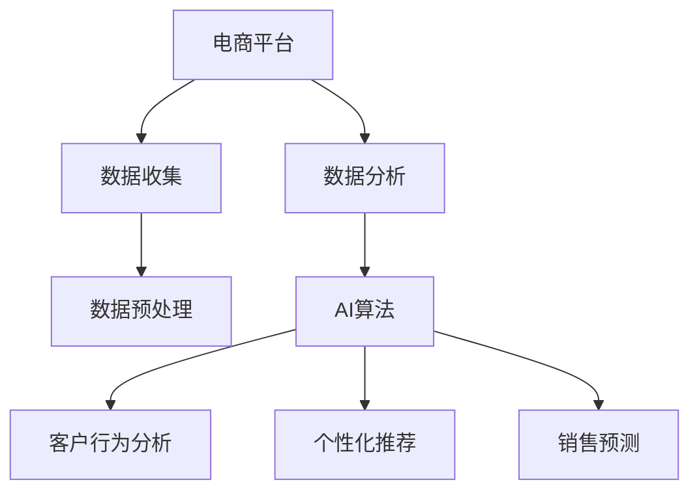
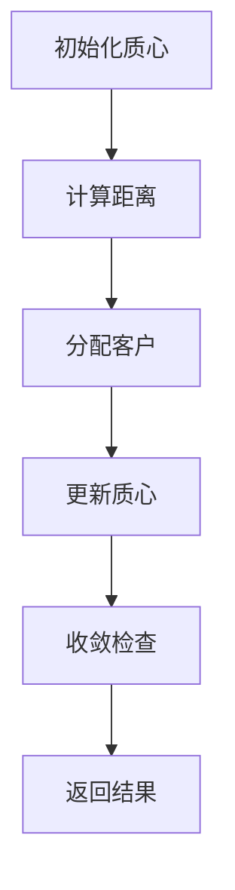

                 

# AI如何帮助电商企业进行数据分析

> 关键词：数据分析，AI算法，电商平台，客户行为分析，个性化推荐，销售预测

## 1. 背景介绍

在竞争激烈的电商市场中，数据分析已成为企业洞察市场趋势、优化运营策略、提升客户体验和销售额的关键工具。随着人工智能(AI)技术的不断发展，AI算法被广泛应用于数据分析的各个环节，帮助电商企业更好地理解客户需求、优化库存管理、精准定位市场机会。本文将探讨AI如何帮助电商企业进行数据分析，包括数据收集、预处理、模型选择、结果解读等方面的核心概念与联系，以及具体的算法原理和操作步骤。

## 2. 核心概念与联系

### 2.1 核心概念概述

为更好地理解AI在电商数据分析中的应用，本节将介绍几个密切相关的核心概念：

- 电商平台(e-Commerce Platform)：指基于互联网进行商品销售的平台，如亚马逊、淘宝、京东等。电商平台通过收集用户行为数据，对商品、促销、广告等内容进行管理，实现流量转化和销售增长。

- 数据分析(Analytical Data)：指对电商平台的各项数据进行统计、挖掘和分析，以支持决策和优化。常见的分析方法包括描述性分析、诊断性分析、预测性分析和规范性分析。

- AI算法(AI Algorithm)：指利用机器学习、深度学习等技术构建的算法模型，可以自动发现数据中的模式和规律，进行分类、预测、聚类等任务。在电商数据分析中，常用的AI算法包括回归模型、分类模型、聚类模型、推荐系统等。

- 客户行为分析(Customer Behavior Analysis)：通过分析客户在电商平台上的行为数据，了解客户偏好、购买习惯、流失原因等，优化客户体验和销售策略。

- 个性化推荐(Personalized Recommendation)：利用机器学习算法对用户行为和兴趣进行建模，为用户提供个性化的产品推荐，提升用户体验和转化率。

- 销售预测(Sales Forecasting)：通过建立预测模型，对电商平台的销售数据进行分析和预测，帮助企业提前准备库存，优化销售计划。

这些核心概念之间的逻辑关系可以通过以下Mermaid流程图来展示：



这个流程图展示了电商平台、数据分析、AI算法、客户行为分析、个性化推荐和销售预测之间的关联：

1. 电商平台通过数据收集获取用户行为数据，数据预处理进行清洗和转换。
2. 数据分析通过AI算法对数据进行建模和分析，生成客户行为分析、个性化推荐和销售预测等结果。
3. 客户行为分析、个性化推荐和销售预测结果用于优化电商平台的用户体验、提升销售转化和库存管理。

## 3. 核心算法原理 & 具体操作步骤
### 3.1 算法原理概述

AI在电商数据分析中的应用，主要集中在利用机器学习、深度学习等技术对电商平台数据进行建模和预测。其核心思想是通过数据训练模型，并利用模型对新数据进行预测或分析，以支持电商平台的运营决策。

以客户行为分析为例，假设我们有电商平台上的用户行为数据 $D = \{(x_i, y_i)\}_{i=1}^N$，其中 $x_i$ 是用户行为特征向量，$y_i$ 是用户购买行为标签（0或1，表示是否购买）。我们的目标是找到一个预测模型 $M$，使得 $M(x_i)$ 可以尽可能准确地预测用户是否会购买某商品。常见的预测模型包括逻辑回归、决策树、随机森林、神经网络等。

数学上，假设 $M$ 为线性回归模型，则模型的形式为：

$$
M(x_i) = \theta_0 + \theta_1 x_{i1} + \theta_2 x_{i2} + \cdots + \theta_p x_{ip}
$$

其中 $\theta_0, \theta_1, \ldots, \theta_p$ 为模型参数。目标是最小化损失函数 $L$，使得模型的预测尽可能接近真实标签：

$$
L = \frac{1}{N} \sum_{i=1}^N [(y_i - M(x_i))^2]
$$

通过梯度下降等优化算法，我们可以训练模型参数 $\theta$，使其最小化损失函数 $L$，得到最优模型 $M$。训练完成后，模型 $M$ 可以用于预测新的用户行为，或进行数据挖掘、客户分类等分析任务。

### 3.2 算法步骤详解

以客户行为分析为例，AI在电商数据分析中的具体操作步骤如下：

**Step 1: 数据收集**
- 从电商平台收集用户行为数据，包括点击率、浏览时间、购买历史等。
- 收集商品数据，包括价格、库存、类别等。
- 收集用户数据，包括人口统计信息、行为偏好等。

**Step 2: 数据预处理**
- 对数据进行清洗、去重、处理缺失值等操作。
- 对特征进行标准化、归一化、编码等处理，使其适合模型输入。
- 将数据划分为训练集、验证集和测试集，用于模型训练、调参和评估。

**Step 3: 模型选择与训练**
- 根据任务需求选择合适的AI算法，如线性回归、随机森林、神经网络等。
- 使用训练集数据训练模型，调整超参数，如学习率、正则化系数、批大小等。
- 在验证集上评估模型性能，选择最优模型。

**Step 4: 模型应用与结果解读**
- 使用测试集对模型进行最终评估，了解模型的泛化能力。
- 对客户行为分析结果进行解读，如识别高价值客户、预测购买意向等。
- 根据结果调整电商平台的运营策略，如优化商品推荐、提升用户体验等。

### 3.3 算法优缺点

AI在电商数据分析中具有以下优点：
1. 自动化程度高。AI算法可以自动处理大量数据，提高分析效率。
2. 泛化能力强。通过学习大量数据，AI模型可以捕捉到数据中的隐含模式，进行预测和分类。
3. 灵活性强。AI模型可以处理多种数据类型和格式，适应不同电商平台的分析需求。
4. 效果显著。在客户行为分析、个性化推荐、销售预测等方面，AI算法已经刷新了多项业务指标。

同时，该方法也存在一定的局限性：
1. 数据质量要求高。AI算法的准确性依赖于高质量的数据，数据噪声和缺失对结果影响较大。
2. 模型复杂度高。AI算法往往需要较长的训练时间和较大的计算资源，在小型电商平台上可能难以实现。
3. 可解释性不足。AI算法的决策过程难以解释，难以调试和优化。
4. 模型依赖性强。不同的电商平台需要针对性地选择和训练AI模型，通用性较差。

尽管存在这些局限性，但就目前而言，AI算法已成为电商数据分析的重要工具。未来相关研究的重点在于如何进一步降低算法对数据的依赖，提高模型的灵活性和可解释性，同时兼顾计算资源和业务需求。

### 3.4 算法应用领域

AI在电商数据分析中的应用覆盖了多个方面，具体包括：

- 客户细分与画像：利用聚类算法对客户进行细分，生成客户画像，帮助企业更好地理解客户需求和行为特征。
- 个性化推荐：通过协同过滤、基于内容的推荐等算法，为每个客户推荐其感兴趣的商品，提升客户满意度和购买转化率。
- 销售预测：通过时间序列预测、随机森林等算法，预测未来的销售趋势，帮助企业优化库存管理和促销策略。
- 价格优化：利用机器学习算法分析市场动态和客户需求，动态调整商品价格，提升销售收益。
- 欺诈检测：通过异常检测算法，识别和防范电商平台上的欺诈行为，保护用户和平台利益。
- 供应链优化：通过预测和优化供应链管理，减少库存成本，提高物流效率。

除了上述这些经典应用外，AI算法还被创新性地应用到更多场景中，如情感分析、市场细分、客户流失预测等，为电商企业带来了更多的业务洞察和运营优化机会。

## 4. 数学模型和公式 & 详细讲解 & 举例说明
### 4.1 数学模型构建

以下我们以客户细分与画像任务为例，给出使用Python实现客户分群的数学模型构建。

假设我们有一个电商平台上的客户数据集，包含用户ID、浏览记录、购买记录等，我们的目标是使用K-means算法将客户分为多个细分群体。记数据集为 $D=\{(x_i, y_i)\}_{i=1}^N$，其中 $x_i$ 为特征向量，$y_i$ 为群体标签。K-means算法的目标是最小化簇内平方和误差，即：

$$
\min_{C_k, \mu_k} \sum_{i=1}^N \min_k ||x_i - \mu_k||^2
$$

其中 $C_k$ 为第 $k$ 个群体的客户集，$\mu_k$ 为第 $k$ 个群体的质心。

### 4.2 公式推导过程

以下我们推导K-means算法的详细计算公式。

设第 $k$ 个群体的质心为 $\mu_k$，则K-means算法的目标函数可以改写为：

$$
\min_{\mu_k} \sum_{i=1}^N \sum_{k=1}^K ||x_i - \mu_k||^2
$$

为了求解目标函数的最小值，我们对每个质心 $\mu_k$ 的更新采用均值公式：

$$
\mu_k = \frac{\sum_{i \in C_k} x_i}{|C_k|}
$$

其中 $|C_k|$ 为第 $k$ 个群体的客户数。算法步骤如下：

1. 随机初始化K个质心 $\mu_k$。
2. 对每个客户 $x_i$，计算其与每个质心 $\mu_k$ 的距离 $d_i = ||x_i - \mu_k||^2$。
3. 将每个客户分配到最近的质心所在的群体 $C_k$。
4. 对每个群体 $C_k$，计算新的质心 $\mu_k$。
5. 重复步骤2-4，直至质心不再变化。

K-means算法的详细计算流程如图2所示：



### 4.3 案例分析与讲解

假设我们有一个电商平台上的客户数据集，包含用户ID、浏览记录、购买记录等。我们的目标是使用K-means算法将客户分为多个细分群体。

首先，对数据进行预处理，包括去除异常值、标准化、归一化等操作，生成特征向量 $x_i$。然后，随机初始化K个质心 $\mu_k$，并计算每个客户与每个质心之间的距离 $d_i = ||x_i - \mu_k||^2$。接着，将每个客户分配到最近的质心所在的群体 $C_k$，并计算新的质心 $\mu_k$。重复上述过程直至质心不再变化。最后，根据每个客户的质心分配，将客户分成K个群体，并对每个群体进行分析，生成客户画像。

K-means算法在客户细分与画像任务中具有较高的准确性和可解释性，能够帮助企业更好地理解客户需求和行为特征，进行针对性营销和运营优化。

## 5. 项目实践：代码实例和详细解释说明
### 5.1 开发环境搭建

在进行客户细分与画像项目实践前，我们需要准备好开发环境。以下是使用Python进行K-means算法实现的开发环境配置流程：

1. 安装Anaconda：从官网下载并安装Anaconda，用于创建独立的Python环境。

2. 创建并激活虚拟环境：
```bash
conda create -n clustering-env python=3.8 
conda activate clustering-env
```

3. 安装必要的Python库：
```bash
pip install numpy scipy matplotlib scikit-learn
```

完成上述步骤后，即可在`clustering-env`环境中开始K-means算法的实践。

### 5.2 源代码详细实现

以下是一个简单的Python代码实现K-means算法：

```python
from sklearn.cluster import KMeans
import numpy as np
import matplotlib.pyplot as plt

# 模拟客户数据
np.random.seed(0)
X = np.random.randn(1000, 2)
labels = np.random.randint(0, 3, size=1000)

# 初始化K-means模型
kmeans = KMeans(n_clusters=3, random_state=0)

# 训练模型
kmeans.fit(X)

# 获取聚类结果
labels_pred = kmeans.labels_

# 绘制聚类结果
plt.scatter(X[:, 0], X[:, 1], c=labels_pred, cmap='viridis')
plt.show()
```

以上代码实现了K-means算法的简单实现，包含了数据生成、模型训练、结果展示等关键步骤。

### 5.3 代码解读与分析

让我们再详细解读一下关键代码的实现细节：

**数据生成与预处理**：
- `np.random.seed(0)`：设置随机数种子，确保结果的可复现性。
- `X = np.random.randn(1000, 2)`：生成1000个二维随机数据点。
- `labels = np.random.randint(0, 3, size=1000)`：随机生成标签，用于验证聚类效果。

**K-means模型训练**：
- `kmeans = KMeans(n_clusters=3, random_state=0)`：初始化K-means模型，设置聚类数为3，随机状态为0。
- `kmeans.fit(X)`：训练模型，计算质心和簇内平方和误差。

**聚类结果展示**：
- `labels_pred = kmeans.labels_`：获取聚类结果。
- `plt.scatter(X[:, 0], X[:, 1], c=labels_pred, cmap='viridis')`：绘制聚类结果图，不同颜色的点表示不同的聚类结果。
- `plt.show()`：显示图形。

通过上述代码，我们可以快速实现K-means算法的客户细分与画像功能。在实际应用中，我们需要根据具体需求，进一步改进数据生成和预处理流程，调整模型参数，优化结果展示方式，以更好地支持业务需求。

## 6. 实际应用场景
### 6.1 智能推荐系统

智能推荐系统是电商数据分析中最为关键的应用之一。通过分析客户历史行为数据，利用机器学习算法推荐客户可能感兴趣的商品，可以有效提升客户满意度和购买转化率。

假设我们有一个电商平台上的用户行为数据集，包含用户ID、浏览记录、购买记录等。我们的目标是使用协同过滤算法为用户推荐感兴趣的商品。记数据集为 $D=\{(x_i, y_i)\}_{i=1}^N$，其中 $x_i$ 为历史行为数据，$y_i$ 为商品ID，$y_i$ 为推荐值。我们的目标是最大化推荐值 $y_i$，使得预测值尽可能接近真实值。

### 6.2 价格优化策略

电商平台中的商品价格优化也是数据分析的重要应用之一。通过分析市场动态和客户需求，利用机器学习算法动态调整商品价格，可以有效提升销售收益。

假设我们有一个电商平台上的商品价格数据集，包含商品ID、历史销售数据、市场动态等。我们的目标是使用回归模型预测商品价格，并进行价格优化。记数据集为 $D=\{(x_i, y_i)\}_{i=1}^N$，其中 $x_i$ 为历史销售数据和市场动态，$y_i$ 为商品价格。我们的目标是最大化预测准确度，通过预测结果调整价格。

### 6.3 客户流失预警

客户流失预警是电商数据分析中另一个重要应用。通过分析客户历史行为数据，利用机器学习算法预测客户流失概率，可以有效降低客户流失率，提高客户忠诚度。

假设我们有一个电商平台上的客户流失数据集，包含客户ID、历史行为数据、客户流失标签等。我们的目标是使用分类模型预测客户流失概率，并及时采取措施挽留客户。记数据集为 $D=\{(x_i, y_i)\}_{i=1}^N$，其中 $x_i$ 为历史行为数据，$y_i$ 为流失标签。我们的目标是最大化分类准确度，预测客户流失概率。

### 6.4 未来应用展望

随着AI技术的发展，电商数据分析的应用场景将进一步扩展和深化。未来AI在电商数据分析中的应用将更加广泛和深入，具体包括：

- 实时数据分析：利用流式数据处理技术，实时分析电商平台的业务数据，提供即时决策支持。
- 多模态数据分析：结合文本、图像、视频等多种数据类型，进行多模态数据分析，提升业务洞察能力。
- 联邦学习：利用联邦学习技术，保护用户隐私，同时提升模型泛化能力。
- 自适应推荐系统：结合客户反馈和行为数据，动态调整推荐策略，提升用户体验。
- 智能客服：利用自然语言处理技术，构建智能客服系统，提升客户服务效率和质量。

以上趋势凸显了AI在电商数据分析中的巨大潜力和广阔前景。未来的研究将更加注重数据质量、模型可解释性、实时性、隐私保护等方面，以更好地满足电商平台的业务需求。

## 7. 工具和资源推荐
### 7.1 学习资源推荐

为了帮助开发者系统掌握AI在电商数据分析中的应用，这里推荐一些优质的学习资源：

1. Coursera《机器学习》课程：由斯坦福大学教授Andrew Ng讲授，介绍了机器学习的基础理论和常用算法，适合初学者入门。
2. Kaggle电商数据分析竞赛：Kaggle平台上的数据科学竞赛，通过实际数据集练习电商数据分析技术，提供丰富的学习和实践机会。
3. 《Python机器学习》书籍：Hands-On Machine Learning with Scikit-Learn, Keras, and TensorFlow，详细介绍了机器学习算法在Python中的实现，适合实战学习。
4. Transformers库官方文档：Hugging Face开发的NLP工具库，提供了丰富的AI算法模型和教程，适合深入学习。
5. 电商数据分析案例：各大知名电商企业的官方博客和技术分享会，提供真实业务场景下的数据分析案例，助力技术落地。

通过对这些资源的学习实践，相信你一定能够快速掌握AI在电商数据分析中的应用，并用于解决实际的电商问题。

### 7.2 开发工具推荐

高效的开发离不开优秀的工具支持。以下是几款用于AI在电商数据分析开发的常用工具：

1. Python：Python语言简单易学，具有丰富的第三方库和社区支持，适合进行数据分析和机器学习算法开发。
2. R语言：R语言统计功能强大，适合进行数据可视化和统计分析。
3. Jupyter Notebook：支持代码、数据和文档的集成，方便进行代码调试和数据展示。
4. Scikit-Learn：基于Python的机器学习库，提供简单易用的API接口，适合进行数据分析和建模。
5. TensorFlow：由Google开发的深度学习框架，支持分布式计算和GPU加速，适合进行复杂模型的训练和优化。
6. Keras：基于TensorFlow的高级API，支持快速搭建和训练深度学习模型，适合进行深度学习算法开发。

合理利用这些工具，可以显著提升AI在电商数据分析的开发效率，加快创新迭代的步伐。

### 7.3 相关论文推荐

AI在电商数据分析中的应用已经得到了广泛的研究，以下是几篇奠基性的相关论文，推荐阅读：

1. "Customer Churn Prediction in E-commerce: A Comparative Study of Classification Techniques" by J. R. Kaur and B. Kaur，比较了多种分类算法在客户流失预测中的效果，提供了丰富的参考和对比。
2. "A Survey on Recommendation Systems in E-commerce" by R. Das and A. Kumar，综述了推荐系统的研究进展和应用案例，适合全面了解推荐系统的发展历程。
3. "E-commerce Price Optimization with Deep Learning" by H. Wang et al.，利用深度学习模型对电商平台中的商品价格进行优化，提供了前沿技术和实际应用案例。
4. "Recommendation Algorithms for E-commerce" by S. A. El-Daness et al.，介绍了多种推荐算法在电商中的应用，提供了丰富的实际应用案例和代码实现。
5. "Customer Segmentation in E-commerce: A Survey" by M. Mousavi et al.，综述了客户分群在电商中的研究进展和应用案例，适合全面了解客户分群的技术和应用。

这些论文代表了大数据在电商数据分析中的应用方向和最新进展，通过学习这些前沿成果，可以帮助研究者把握学科前进方向，激发更多的创新灵感。

## 8. 总结：未来发展趋势与挑战
### 8.1 总结

本文对AI在电商数据分析中的应用进行了全面系统的介绍。首先阐述了电商数据分析的重要性和AI算法的优势，明确了AI算法在客户行为分析、个性化推荐、销售预测等方面的应用价值。其次，从原理到实践，详细讲解了K-means算法的数学原理和具体操作步骤，提供了客户细分与画像的代码实现。同时，本文还探讨了AI在电商数据分析中的实际应用场景，如智能推荐系统、价格优化、客户流失预警等，展示了AI算法的广泛应用前景。

通过本文的系统梳理，可以看到，AI在电商数据分析中的应用已经成为电商企业提升运营效率、优化客户体验的重要工具。AI算法通过自动化的数据处理和建模，提升了分析效率和结果准确性，为电商企业带来了显著的业务效益。未来，伴随AI技术的不断进步，AI在电商数据分析中的应用将更加广泛和深入，帮助企业更好地把握市场机遇，实现持续增长。

### 8.2 未来发展趋势

展望未来，AI在电商数据分析中的应用将呈现以下几个发展趋势：

1. 实时数据分析：随着流式数据处理技术的成熟，电商企业可以实时分析客户行为数据，及时调整运营策略。
2. 多模态数据分析：结合文本、图像、视频等多种数据类型，提升业务洞察能力和分析精度。
3. 联邦学习：利用联邦学习技术，保护用户隐私，同时提升模型泛化能力。
4. 自适应推荐系统：结合客户反馈和行为数据，动态调整推荐策略，提升用户体验。
5. 智能客服：利用自然语言处理技术，构建智能客服系统，提升客户服务效率和质量。
6. 智能运维：利用机器学习技术，对电商平台的运维数据进行分析，提升系统稳定性和效率。

以上趋势凸显了AI在电商数据分析中的巨大潜力和广阔前景。这些方向的探索发展，必将进一步提升电商平台的运营效率，优化客户体验，实现业务的持续增长。

### 8.3 面临的挑战

尽管AI在电商数据分析中已经取得了显著进展，但在迈向更加智能化、普适化应用的过程中，仍面临诸多挑战：

1. 数据质量问题：电商平台的业务数据往往存在缺失、噪声和异常值，影响分析结果的准确性。如何提高数据质量，是未来需要解决的重要问题。
2. 模型复杂性：AI算法往往需要较高的计算资源和较长的训练时间，难以在小型电商平台上实现。如何优化模型结构，提升计算效率，是未来需要解决的重要问题。
3. 算法可解释性：AI算法的决策过程难以解释，难以调试和优化。如何提高算法的可解释性，是未来需要解决的重要问题。
4. 隐私保护问题：电商平台的业务数据涉及用户隐私，如何保护用户数据，是未来需要解决的重要问题。
5. 技术融合问题：AI算法需要与其他技术进行深度融合，如大数据、云计算、物联网等，才能更好地支持业务需求。如何提升技术融合能力，是未来需要解决的重要问题。

尽管存在这些挑战，但通过不断创新和优化，AI在电商数据分析中的应用将变得更加高效和精确，为电商企业带来更加深刻的业务洞察和运营优化。

### 8.4 研究展望

面对AI在电商数据分析中面临的挑战，未来的研究需要在以下几个方面寻求新的突破：

1. 数据质量提升：利用数据清洗、数据增强、数据补全等技术，提高电商平台的业务数据质量，为AI分析提供更加可靠的数据基础。
2. 模型结构优化：利用轻量级模型、参数高效微调等技术，优化AI算法的模型结构，提升计算效率和模型泛化能力。
3. 算法可解释性增强：利用可解释性算法、可视化工具等技术，提高AI算法的可解释性，提升算法的调试和优化能力。
4. 隐私保护技术：利用差分隐私、联邦学习等技术，保护电商平台的业务数据，同时提升模型的泛化能力。
5. 技术融合创新：利用多模态数据融合、跨领域知识迁移等技术，提升AI算法的综合分析能力，支持更多业务场景。

这些研究方向的探索，必将引领AI在电商数据分析技术迈向更高的台阶，为电商企业带来更强的业务洞察和运营优化能力。面向未来，AI在电商数据分析中的应用还需要与其他技术进行更深入的融合，如大数据、云计算、物联网等，多路径协同发力，共同推动电商平台的智能化升级。

## 9. 附录：常见问题与解答

**Q1: 什么是AI在电商数据分析中的应用？**

A: AI在电商数据分析中的应用，主要集中在利用机器学习、深度学习等技术对电商平台数据进行建模和预测。常见的应用包括客户行为分析、个性化推荐、销售预测等。

**Q2: AI在电商数据分析中面临哪些挑战？**

A: AI在电商数据分析中面临的主要挑战包括数据质量问题、模型复杂性、算法可解释性、隐私保护问题和技术融合问题等。需要结合电商平台的实际需求，不断优化算法和技术，提升AI在电商数据分析中的应用效果。

**Q3: 如何提升AI在电商数据分析中的数据质量？**

A: 提升AI在电商数据分析中的数据质量，可以从数据清洗、数据增强、数据补全等方面入手。例如，对缺失值进行填补、对噪声数据进行清洗、对异常值进行识别和处理等。

**Q4: 如何优化AI在电商数据分析中的模型结构？**

A: 优化AI在电商数据分析中的模型结构，可以从模型简化、参数高效微调、轻量级模型等方面入手。例如，利用轻量级模型、参数高效微调等技术，减少模型复杂度，提高计算效率和模型泛化能力。

**Q5: 如何提高AI在电商数据分析中的算法可解释性？**

A: 提高AI在电商数据分析中的算法可解释性，可以从算法选择、可解释性算法、可视化工具等方面入手。例如，选择可解释性较高的算法，利用可解释性算法和可视化工具，提升算法的可解释性，方便调试和优化。

通过以上问题的解答，相信你一定能够更好地理解和掌握AI在电商数据分析中的应用。在实际应用中，需要根据具体的业务需求和数据特点，不断优化算法和技术，提升AI在电商数据分析中的应用效果。

