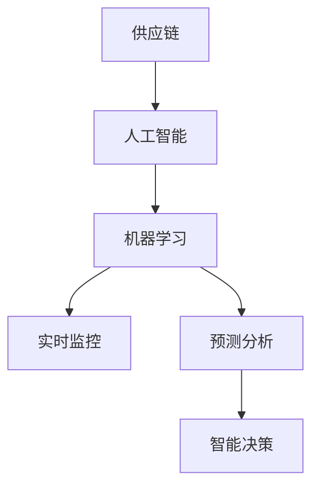

                 

# AI实时监控供给链的应用

> 关键词：AI, 实时监控, 供给链, 智能决策, 预测分析

## 1. 背景介绍

### 1.1 问题由来

在当今全球化的商业环境中，企业间的供应链联系变得日益紧密。同时，市场竞争加剧、产品多样化、消费者需求多变等因素使得供应链管理变得越来越复杂。传统的手工监控方式，例如人工检查和记录，由于缺乏实时性和自动化，难以满足现代供应链的快速响应和精准管理需求。因此，使用人工智能(AI)技术，尤其是基于机器学习模型的实时监控系统，成为供应链管理的一大趋势。

### 1.2 问题核心关键点

实时监控供应链的主要目标是通过AI技术预测并应对供应链中可能出现的问题，优化供应链的效率，降低运营成本，提升客户满意度。核心关键点包括：

- 数据集成：获取来自供应链各环节的数据，并集成至中央数据仓库。
- 数据清洗与预处理：清洗和标准化数据，保证数据质量。
- 实时监控与预警：构建模型实时监控供应链，并在异常发生时及时发出预警。
- 智能决策：基于实时监控数据，优化供应链策略，实现智能决策。
- 预测分析：利用历史数据和实时监控数据进行预测，提前准备应对策略。

本文将围绕实时监控供应链的核心技术，详细阐述AI在供应链中的应用，并通过具体案例进行解读和分析。

## 2. 核心概念与联系

### 2.1 核心概念概述

为更好地理解AI在供应链中的应用，本节将介绍几个密切相关的核心概念：

- 供应链(Supply Chain)：产品从原材料获取、生产、配送、直到客户手中的全过程。涉及制造、仓储、运输、销售等多个环节。
- 人工智能(AI)：模拟人类智能行为的机器学习模型，能够进行数据分析、决策支持、自动化控制等任务。
- 机器学习(ML)：AI的子领域，利用数据训练模型，通过算法自我学习并优化，具有预测、分类、聚类等功能。
- 实时监控(Real-Time Monitoring)：持续、不间断地获取供应链数据，并对其进行分析和处理。
- 预测分析(Predictive Analytics)：通过历史数据和实时数据，预测供应链中可能发生的事件，如库存不足、缺货、运输延误等。
- 智能决策(Intelligent Decision Making)：基于数据分析结果，自动化地生成和优化供应链策略。

这些概念之间的逻辑关系可以通过以下Mermaid流程图来展示：



这个流程图展示了我们所讨论的核心概念及其之间的关系：

1. 供应链是AI和机器学习研究的对象。
2. 人工智能提供了构建机器学习模型的能力。
3. 实时监控和预测分析是AI在供应链中的应用方式。
4. 智能决策基于实时监控和预测分析的结果，指导供应链管理。

## 3. 核心算法原理 & 具体操作步骤
### 3.1 算法原理概述

AI在供应链中的应用通常涉及机器学习模型的构建、训练和应用。其核心思想是：

- 利用历史数据和实时数据，训练预测模型，实时监控供应链状态。
- 模型持续学习，根据最新数据调整预测结果。
- 基于预测结果，自动生成供应链管理策略，优化运营。

本文将以供应链库存管理为例，介绍机器学习模型在实时监控中的应用。

### 3.2 算法步骤详解

基于机器学习的供应链实时监控主要包括以下几个步骤：

**Step 1: 数据收集与预处理**
- 数据收集：从供应链各环节（如制造、仓储、运输、销售等）采集数据，包括库存水平、运输状态、订单量等。
- 数据清洗与预处理：去除噪音数据，标准化数据格式，保证数据质量。

**Step 2: 模型选择与训练**
- 选择适当的机器学习模型，如回归模型、时间序列模型、决策树等。
- 利用历史数据训练模型，设定合适的超参数，并进行模型验证。

**Step 3: 实时监控与预警**
- 集成实时数据至模型，持续监控供应链状态。
- 设定预警阈值，当预测结果超出阈值时，自动发出预警。

**Step 4: 智能决策与策略优化**
- 基于预测结果，自动生成供应链管理策略，如调整库存、重新规划运输路线等。
- 定期评估策略效果，不断优化模型。

### 3.3 算法优缺点

基于机器学习的供应链实时监控系统具有以下优点：
1. 实时性高：能够实时监控供应链状态，快速响应异常。
2. 自动化程度高：自动生成和优化供应链策略，减轻人工负担。
3. 预测准确：基于历史数据和实时数据进行预测，减少人为干预。

同时，该系统也存在一定的局限性：
1. 数据质量要求高：数据完整性和准确性直接影响模型预测结果。
2. 模型复杂度较高：需要考虑多个维度因素，构建模型复杂。
3. 成本投入大：前期数据采集和模型构建需投入大量资源。

尽管存在这些局限性，但就目前而言，基于机器学习的供应链实时监控系统仍是目前的主流解决方案。未来相关研究的重点在于如何进一步降低数据需求，提高模型预测精度，同时兼顾成本和收益。

### 3.4 算法应用领域

AI在供应链中的应用领域非常广泛，包括但不限于以下几个方面：

- 库存管理：利用AI预测库存水平，优化补货策略。
- 需求预测：根据历史销售数据和市场趋势，预测未来需求，优化生产计划。
- 运输调度：利用AI优化运输路线和时间，降低物流成本。
- 风险管理：通过预测和分析，识别供应链中的潜在风险，提前应对。
- 供应商管理：评估供应商绩效，优化供应商选择策略。

以上应用领域展示了AI在供应链管理中的强大潜力，未来随着技术的不断演进，AI在供应链中的应用将更加深入和广泛。

## 4. 数学模型和公式 & 详细讲解  
### 4.1 数学模型构建

本节将使用数学语言对基于机器学习的供应链实时监控过程进行更加严格的刻画。

记供应链状态为 $X_t$，预测模型为 $f$，历史数据集为 $D=\{(X_i,Y_i)\}_{i=1}^N$，其中 $Y_i$ 为预测结果。则模型的训练目标为：

$$
\min_{f} \sum_{i=1}^N \ell(f(X_i),Y_i)
$$

其中 $\ell$ 为损失函数，常用的有均方误差、交叉熵等。

### 4.2 公式推导过程

以库存水平预测为例，我们假设库存水平 $Q_t$ 和需求量 $D_t$ 之间存在线性关系，则回归模型为：

$$
Q_t = f(X_t) = \alpha + \beta D_t + \epsilon
$$

其中 $\alpha$ 为截距，$\beta$ 为斜率，$\epsilon$ 为随机误差。模型的损失函数为均方误差：

$$
L(Q_t,Y_t) = \frac{1}{2}\sum_{i=1}^N (Q_t - Y_t)^2
$$

对模型参数进行梯度下降优化，即：

$$
\alpha, \beta \leftarrow \alpha - \eta \frac{\partial L}{\partial \alpha}, \beta - \eta \frac{\partial L}{\partial \beta}
$$

其中 $\eta$ 为学习率。

### 4.3 案例分析与讲解

假设某电商平台销售某产品，历史记录表明其日均销售量为 $D_t$，库存水平为 $Q_t$。我们可以通过实时监控需求量和库存水平，预测未来库存水平。

首先，收集历史数据 $D_t$ 和 $Q_t$，去除异常数据，进行数据预处理。然后，选择合适的回归模型，设定超参数，利用历史数据训练模型。接着，将实时需求量 $D_t$ 输入模型，计算预测的库存水平 $Q_t$。最后，设定预警阈值，当预测库存水平接近下限时，自动发出预警。

通过以上步骤，我们可以实现供应链库存的实时监控和预警，提升库存管理的精准度。

## 5. 项目实践：代码实例和详细解释说明
### 5.1 开发环境搭建

在进行供应链实时监控项目开发前，我们需要准备好开发环境。以下是使用Python进行机器学习开发的环境配置流程：

1. 安装Anaconda：从官网下载并安装Anaconda，用于创建独立的Python环境。

2. 创建并激活虚拟环境：
```bash
conda create -n ml-env python=3.8 
conda activate ml-env
```

3. 安装必要的机器学习库：
```bash
conda install scikit-learn pandas numpy matplotlib seaborn jupyter notebook ipython
```

4. 安装特定领域的库：
```bash
conda install tsfresh statsmodels
```

完成上述步骤后，即可在`ml-env`环境中开始项目开发。

### 5.2 源代码详细实现

下面我们以库存管理为例，给出使用Python的Scikit-learn库进行库存水平预测的代码实现。

首先，定义库存水平和需求量的数据集：

```python
import pandas as pd

# 加载数据集
data = pd.read_csv('inventory.csv', index_col='time')
# 数据集特征工程，提取必要列
data = data[['demand', 'inventory']]
```

然后，定义回归模型并拟合：

```python
from sklearn.linear_model import LinearRegression

# 训练模型
model = LinearRegression()
X = data[['demand']]
y = data['inventory']
model.fit(X, y)
```

接着，定义实时监控函数：

```python
def monitor_inventory(model, demand, threshold):
    # 预测库存水平
    inventory = model.predict(demand)
    # 判断库存是否低于预警阈值
    if inventory[0] < threshold:
        print('Inventory level is below threshold. Consider restocking.')
    return inventory
```

最后，启动实时监控流程：

```python
# 设定预警阈值
threshold = 100

# 持续获取实时需求数据
while True:
    # 获取实时需求量
    demand = get_realtime_demand()
    # 实时监控库存水平
    inventory = monitor_inventory(model, demand, threshold)
    # 输出实时库存水平和状态
    print('Inventory level: ', inventory)
```

以上就是使用Scikit-learn库进行库存水平预测的完整代码实现。可以看到，使用机器学习库进行项目开发，可以极大地简化模型构建和优化过程。

### 5.3 代码解读与分析

让我们再详细解读一下关键代码的实现细节：

**inventory.csv**：
- 库存水平和需求量的历史数据。

**LinearRegression模型**：
- 利用历史数据训练线性回归模型，预测库存水平。

**monitor_inventory函数**：
- 根据实时需求量，预测库存水平。
- 如果预测的库存水平低于预设阈值，则发出预警。

**while循环**：
- 持续获取实时需求数据。
- 调用monitor_inventory函数进行实时监控，输出库存水平和状态。

可以看到，使用机器学习库进行项目开发，代码实现简洁高效，同时能够快速迭代和优化。

## 6. 实际应用场景
### 6.1 智能制造

在智能制造领域，AI实时监控系统可以实时监控生产线的状态，预测设备故障，优化生产调度，提高生产效率和产品质量。通过机器学习模型实时监控生产线，可以及时识别出异常情况，如设备故障、原材料短缺等，并自动调整生产计划，避免生产停滞。

### 6.2 物流管理

在物流管理领域，AI实时监控系统可以实时监控货物运输状态，预测运输延误，优化运输路线，降低运输成本。通过机器学习模型实时监控货物位置和状态，可以预测货物到达时间，优化运输路径，确保货物按时到达。

### 6.3 风险管理

在风险管理领域，AI实时监控系统可以实时监控供应链风险，预测潜在问题，提前准备应对策略。通过机器学习模型实时监控供应链数据，可以识别出异常数据，预测供应链中断的风险，提前采取措施，降低风险带来的损失。

### 6.4 未来应用展望

随着AI技术的不断演进，未来AI在供应链中的应用将更加智能化和自动化。以下是一些可能的应用场景：

1. 自适应优化：AI实时监控系统可以根据实时数据，自适应地优化供应链策略，提升运营效率。

2. 跨领域融合：AI实时监控系统可以融合多模态数据，如传感器数据、图像数据等，实现更全面的监控。

3. 实时反馈：AI实时监控系统可以实时反馈监控结果，提供决策支持，提高决策的准确性和及时性。

4. 智能调度：AI实时监控系统可以基于实时数据，智能调度资源，优化供应链运营。

5. 异常检测：AI实时监控系统可以检测异常数据，提供预警，避免潜在风险。

## 7. 工具和资源推荐
### 7.1 学习资源推荐

为了帮助开发者系统掌握AI在供应链中的应用，这里推荐一些优质的学习资源：

1. Coursera《机器学习》课程：斯坦福大学开设的机器学习课程，涵盖机器学习的基本概念和算法，适合初学者入门。

2. Kaggle：数据科学竞赛平台，提供大量开源数据集和代码，适合练习和实战。

3. Scikit-learn官方文档：机器学习库Scikit-learn的官方文档，详细介绍了各种机器学习算法的实现和应用。

4. TensorFlow官方文档：开源机器学习框架TensorFlow的官方文档，提供丰富的API和教程，适合深入学习。

5. Udacity《高级机器学习》课程：Udacity的高级机器学习课程，涵盖深度学习、强化学习等高级算法，适合进阶学习。

通过对这些资源的学习实践，相信你一定能够快速掌握AI在供应链中的应用，并用于解决实际的供应链问题。

### 7.2 开发工具推荐

高效的开发离不开优秀的工具支持。以下是几款用于AI在供应链实时监控开发的常用工具：

1. Python：机器学习的主流编程语言，语法简洁，生态系统丰富。

2. Jupyter Notebook：交互式编程环境，便于数据处理和模型训练。

3. Scikit-learn：开源机器学习库，提供了丰富的机器学习算法和工具，易于使用。

4. TensorFlow：开源机器学习框架，支持深度学习，提供了丰富的API和工具。

5. Keras：深度学习框架，提供了简单易用的API，方便模型构建和训练。

6. PyTorch：深度学习框架，灵活高效，支持动态计算图。

合理利用这些工具，可以显著提升AI在供应链实时监控任务的开发效率，加快创新迭代的步伐。

### 7.3 相关论文推荐

AI在供应链中的应用研究源于学界的持续研究。以下是几篇奠基性的相关论文，推荐阅读：

1. "A Survey of Advanced Analytics for Supply Chain Management"（供应链管理高级分析综述）：全面综述了供应链管理的高级分析方法，包括数据挖掘、机器学习等。

2. "Predictive Maintenance: A Survey and Taxonomy"（预测维护：综述与分类）：综述了预测维护的研究现状和分类方法，介绍了机器学习在预测维护中的应用。

3. "Real-time demand forecasting in smart manufacturing"（智能制造中的实时需求预测）：探讨了机器学习在智能制造中的应用，包括实时需求预测、生产调度优化等。

4. "Supply Chain Risk Management: An overview and a proposed framework for an integration of information and risk"（供应链风险管理：信息和风险整合框架综述）：综述了供应链风险管理的理论和应用，提出了一种信息和风险整合的框架。

5. "Real-time supply chain monitoring and response using big data analytics"（大数据分析在实时供应链监控和响应中的应用）：探讨了大数据分析在供应链监控中的应用，包括实时数据处理、异常检测等。

这些论文代表了大数据和机器学习在供应链中的应用发展脉络。通过学习这些前沿成果，可以帮助研究者把握学科前进方向，激发更多的创新灵感。

## 8. 总结：未来发展趋势与挑战

### 8.1 总结

本文对基于机器学习的供应链实时监控方法进行了全面系统的介绍。首先阐述了供应链实时监控的背景和意义，明确了AI在供应链实时监控中的独特价值。其次，从原理到实践，详细讲解了机器学习模型在实时监控中的应用，给出了实时监控任务开发的完整代码实例。同时，本文还广泛探讨了AI在供应链中的应用场景，展示了实时监控范式的广泛应用前景。此外，本文精选了实时监控技术的各类学习资源，力求为读者提供全方位的技术指引。

通过本文的系统梳理，可以看到，基于机器学习的供应链实时监控技术正在成为供应链管理的重要范式，极大地拓展了供应链的智能管理能力，推动了供应链的高效运营。未来，伴随机器学习技术的不断演进，基于机器学习的供应链实时监控系统将更加智能和高效，为供应链管理带来更深远的变革。

### 8.2 未来发展趋势

展望未来，机器学习在供应链中的应用将呈现以下几个发展趋势：

1. 实时性进一步提升：随着计算资源和算法的进步，实时监控系统的实时性将进一步提高，能够更快速地响应用户需求。

2. 数据处理能力增强：随着数据存储和处理技术的进步，实时监控系统能够处理更大规模的数据，支持更加精准的预测和分析。

3. 多模态融合：实时监控系统将融合更多维度的数据，如传感器数据、图像数据等，实现更全面的监控。

4. 自适应优化：实时监控系统将具备自适应能力，根据实时数据自动调整策略，优化供应链运营。

5. 跨领域应用：实时监控系统将逐步应用于更多领域，如智能制造、智慧城市等，带来更加广泛的应用场景。

以上趋势凸显了机器学习在供应链中的应用前景。这些方向的探索发展，必将进一步提升供应链管理的智能程度和效率。

### 8.3 面临的挑战

尽管机器学习在供应链中的应用已经取得了显著进展，但在迈向更加智能化、普适化应用的过程中，它仍面临着诸多挑战：

1. 数据质量瓶颈：供应链数据种类繁多，数据质量参差不齐，数据清洗和预处理需要大量人力和时间。

2. 模型复杂度：供应链涉及多个环节和多种变量，模型需要考虑复杂的关系和影响因素，构建模型难度较大。

3. 计算资源需求高：实时监控需要处理大量数据，对计算资源的需求较高，计算成本较高。

4. 模型维护困难：实时监控系统需要定期维护和更新，保持模型的准确性和时效性。

5. 安全性问题：供应链数据涉及隐私和商业机密，数据泄露和滥用可能带来安全风险。

这些挑战需要研究者不断探索和解决，才能使机器学习在供应链中得到更广泛的应用。

### 8.4 研究展望

未来，机器学习在供应链中的应用需要在以下几个方面寻求新的突破：

1. 数据融合技术：研究更加高效的数据融合方法，如深度融合、多源数据融合等，提高数据质量和处理效率。

2. 模型优化技术：研究更加高效的模型优化方法，如压缩、加速、自适应等，提高模型性能和实时性。

3. 跨领域学习：研究跨领域学习的方法，如迁移学习、多任务学习等，提高模型在多个领域中的应用能力。

4. 数据隐私保护：研究数据隐私保护技术，如差分隐私、联邦学习等，确保供应链数据的安全性。

5. 交互式监控：研究交互式监控方法，如人机交互、多模态交互等，提高供应链监控的可视化和可解释性。

这些研究方向的探索，必将引领机器学习在供应链中的应用走向更加深入和成熟，推动供应链管理的智能化和高效化。

## 9. 附录：常见问题与解答

**Q1：AI实时监控供应链是否适用于所有企业？**

A: AI实时监控供应链主要适用于数据规模较大、供应链管理复杂的企业。对于数据量较小、流程简单的企业，可以考虑采用传统的手工监控方式。

**Q2：机器学习模型的训练需要多少历史数据？**

A: 机器学习模型的训练效果与历史数据量和质量密切相关。一般而言，数据量越大、质量越高，模型的预测精度越高。建议至少使用1年以上的历史数据进行模型训练。

**Q3：如何处理供应链中的噪声数据？**

A: 供应链数据中常常包含噪声数据，如传感器故障、数据传输错误等。常见的处理方式包括数据清洗、异常值检测、数据插值等。

**Q4：实时监控系统如何与现有的ERP系统集成？**

A: 实时监控系统需要与现有的ERP系统集成，以获取供应链数据。集成方式可以采用API接口、ETL工具、数据湖等。

**Q5：实时监控系统如何保障数据安全性？**

A: 实时监控系统需要严格保障数据安全性，防止数据泄露和滥用。建议采用数据加密、访问控制、数据脱敏等技术手段。

这些问题的解答，有助于理解AI在供应链实时监控中的应用场景和技术挑战。通过不断探索和实践，相信机器学习技术在供应链中的应用将更加广泛和深入。

