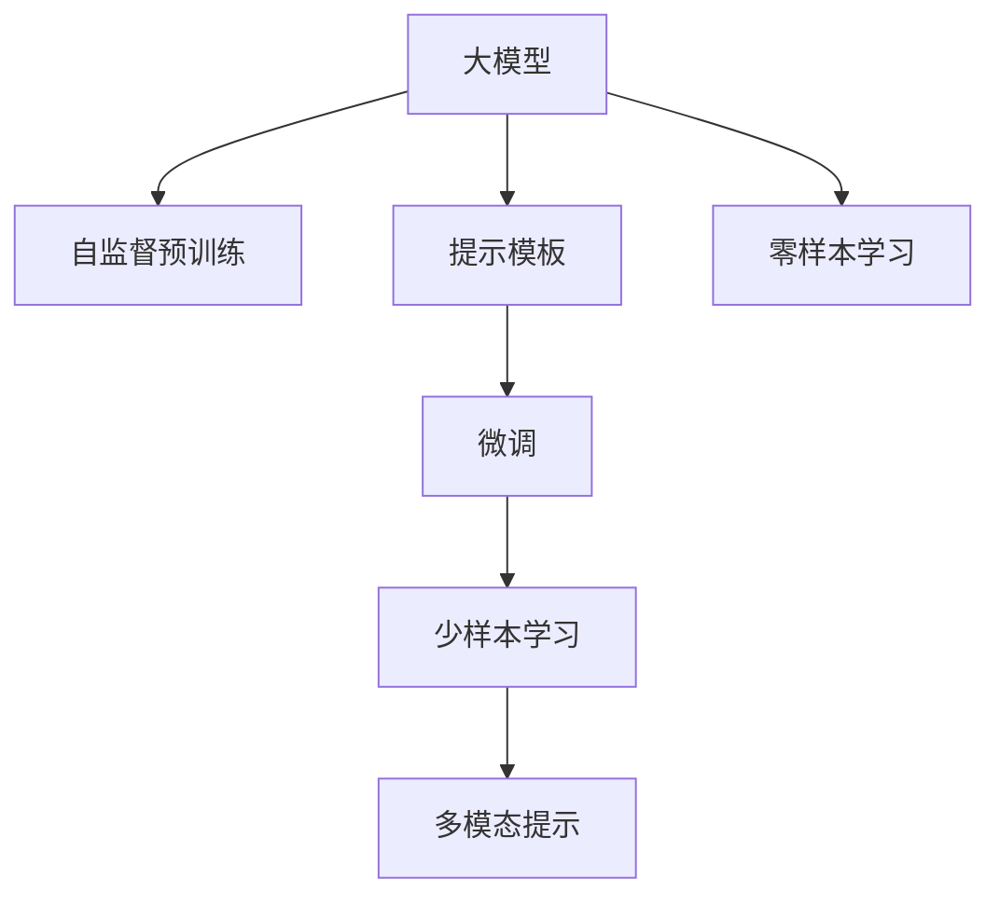

                 

# AI工程学：大模型应用开发实战：提示工程

> 关键词：大模型,提示工程,自然语言处理(NLP),深度学习,提示模板,Prompt Template

## 1. 背景介绍

### 1.1 问题由来
随着大语言模型（Large Language Models, LLMs）的兴起，自然语言处理（Natural Language Processing, NLP）领域迎来了一场革命。LLMs通过自监督预训练和微调，已经展现出强大的语言理解和生成能力。然而，将预训练的通用知识应用于特定任务时，模型通常需要大量的标注数据，这不仅成本高昂，而且难以获取。为了解决这个问题，提示工程（Prompt Engineering）应运而生。

提示工程是一种通过精心设计输入文本的格式，引导大模型按期望方式输出，从而减少微调参数，实现高效零样本或少样本学习的方法。它不仅可以降低微调成本，还能提升模型在新任务上的适应性和泛化能力。

### 1.2 问题核心关键点
提示工程的核心在于：
1. **设计提示模板（Prompt Template）**：选择或设计能够有效引导模型输出的文本格式。
2. **优化模型参数**：通过微调或其他技术，使模型在特定任务上表现更好。
3. **提升泛化能力**：使模型能够更好地适应新场景和数据分布。

提示工程在自然语言生成、问答系统、文本分类、摘要生成等任务中均有广泛应用。

### 1.3 问题研究意义
提示工程对大模型应用具有重要意义：
1. **降低开发成本**：通过提示工程，可以在没有标注数据的情况下快速生成高质量的模型。
2. **提升模型性能**：精心设计的提示模板可以使模型在新任务上获得更好的表现。
3. **加速迭代速度**：提示工程可以显著加快模型开发和调优的速度。
4. **增强模型泛化能力**：通过提示模板，模型可以更好地适应不同的输入格式和语境。

## 2. 核心概念与联系

### 2.1 核心概念概述

提示工程涉及多个核心概念，包括：

- **大模型（Large Language Models, LLMs）**：通过自监督预训练获得通用语言知识的模型，如GPT-3、BERT等。
- **提示模板（Prompt Template）**：指导模型输出的文本格式，包括文本的起始、中间、结尾等部分。
- **微调（Fine-Tuning）**：通过特定任务的少量标注数据，优化模型参数，提升模型在特定任务上的性能。
- **零样本学习（Zero-shot Learning）**：模型在未见过的任务上，仅通过任务描述即可生成正确输出。
- **少样本学习（Few-shot Learning）**：模型在少量标注样本上即可生成高质量输出。
- **多模态提示（Multimodal Prompts）**：结合文本、图像、音频等多模态信息，提升模型的理解和生成能力。

这些概念之间存在紧密的联系，通过提示模板和微调，大模型可以在特定任务上表现出更好的性能，同时通过零样本和少样本学习，模型能够适应新的任务场景，提升模型的实用性和泛化能力。

### 2.2 核心概念原理和架构的 Mermaid 流程图(Mermaid 流程节点中不要有括号、逗号等特殊字符)



这个流程图展示了提示工程的核心流程：

1. 大模型通过自监督预训练获得通用语言知识。
2. 提示模板指导模型输出。
3. 微调优化模型参数。
4. 少样本学习使模型适应新任务。
5. 零样本学习使模型仅通过任务描述即可生成输出。
6. 多模态提示结合多模态信息，提升模型的理解和生成能力。

## 3. 核心算法原理 & 具体操作步骤
### 3.1 算法原理概述

提示工程的本质是通过设计合理的提示模板，引导大模型在特定任务上输出期望的结果。其基本思想是：将输入文本按照特定格式（即提示模板）组织起来，通过模型处理后，提取任务相关的特征，生成输出结果。

### 3.2 算法步骤详解

提示工程一般包括以下几个关键步骤：

**Step 1: 准备提示模板**
- 设计合适的提示模板，通常包括任务的描述、输入数据的格式、期望输出的格式等。
- 考虑模板的长度、结构、语言风格等因素，使其既能引导模型，又不至于过于复杂。

**Step 2: 收集样本数据**
- 对于少样本学习任务，需要收集一小部分标注数据，用于模型微调。
- 对于零样本学习任务，只需要任务描述或示例即可。

**Step 3: 构建训练集**
- 将提示模板和样本数据结合起来，构建训练集。
- 对于少样本学习任务，需要将少量标注数据与提示模板结合，形成新的训练集。
- 对于零样本学习任务，仅需要任务描述或示例，无需标注数据。

**Step 4: 执行微调**
- 使用预训练模型作为初始权重，在构建的训练集上进行微调。
- 根据任务类型选择合适的损失函数，如交叉熵损失、均方误差损失等。
- 选择合适的优化器（如AdamW、SGD等）和超参数（如学习率、批大小、迭代轮数等），进行梯度下降优化。

**Step 5: 测试和部署**
- 在测试集上评估微调后的模型性能。
- 将微调后的模型部署到实际应用系统中，进行推理预测。
- 持续收集新的数据，定期重新微调模型，以适应数据分布的变化。

### 3.3 算法优缺点

提示工程的优点包括：
1. **降低标注成本**：通过提示模板和微调，可以在无需大量标注数据的情况下，快速生成高质量的模型。
2. **提升泛化能力**：提示模板设计合理，可以使模型在新任务上表现更好。
3. **高效实用**：提示工程可以快速生成模型，适用于多种NLP任务，如问答系统、文本分类、摘要生成等。
4. **灵活性高**：提示模板可以根据任务特点进行调整，灵活适应不同的应用场景。

提示工程也存在一些缺点：
1. **提示模板设计困难**：提示模板的设计需要经验和专业知识，设计不当可能导致模型性能下降。
2. **依赖于预训练模型**：提示工程的有效性高度依赖于预训练模型的质量，预训练模型质量不高可能导致性能不佳。
3. **难以避免偏差**：提示模板和微调过程可能引入数据偏见，模型输出可能存在偏差。

尽管存在这些缺点，提示工程仍然是大语言模型应用中最具前景的技术之一。

### 3.4 算法应用领域

提示工程在NLP领域有广泛的应用，例如：

- **问答系统**：通过设计合适的提示模板，使模型能够回答特定类型的问题。
- **文本分类**：使用提示模板引导模型，对文本进行分类，如情感分析、主题分类等。
- **摘要生成**：通过提示模板，使模型生成高质量的文本摘要。
- **机器翻译**：利用提示模板，使模型进行翻译任务。
- **对话系统**：设计合适的提示模板，使模型能够进行多轮对话。

除了上述这些经典任务外，提示工程还被创新性地应用到更多场景中，如可控文本生成、情感分析、代码生成、数据增强等，为NLP技术带来了全新的突破。

## 4. 数学模型和公式 & 详细讲解 & 举例说明

### 4.1 数学模型构建

提示工程的数学模型构建主要涉及提示模板的设计和模型的微调过程。

设提示模板为 $P$，样本数据为 $(x, y)$，其中 $x$ 为输入文本，$y$ 为任务标签。假设模型的预测输出为 $\hat{y}$，则模型的损失函数为：

$$
L(P, \hat{y}, y) = \ell(\hat{y}, y)
$$

其中 $\ell$ 为损失函数，如交叉熵损失、均方误差损失等。

### 4.2 公式推导过程

以交叉熵损失为例，假设模型对输入 $x$ 的预测输出为 $\hat{y}$，真实标签为 $y$，则交叉熵损失为：

$$
\ell(\hat{y}, y) = -y \log \hat{y} - (1 - y) \log (1 - \hat{y})
$$

将提示模板 $P$ 和样本数据 $(x, y)$ 结合起来，可以得到训练集 $\mathcal{D}$，其中每个样本的形式为 $(P(x), y)$。模型的训练过程可以表示为：

$$
\theta^* = \mathop{\arg\min}_{\theta} \frac{1}{N} \sum_{(x, y) \in \mathcal{D}} \ell(M_{\theta}(P(x)), y)
$$

其中 $M_{\theta}$ 为预训练模型，$\theta$ 为模型参数，$N$ 为训练样本数量。

### 4.3 案例分析与讲解

以问答系统为例，假设提示模板为 "给出关于 \textit{question} 的答案"，样本数据为 "question" 和对应的答案。模型可以通过微调学习到将输入文本映射到答案的过程。

设模型的预测输出为 $\hat{y}$，真实标签为 $y$，则交叉熵损失为：

$$
\ell(\hat{y}, y) = -y \log \hat{y} - (1 - y) \log (1 - \hat{y})
$$

训练集 $\mathcal{D}$ 中的每个样本为 $(P(x), y)$，其中 $P(x) = "给出关于 \textit{x} 的答案"，$y$ 为实际答案。模型的训练过程可以表示为：

$$
\theta^* = \mathop{\arg\min}_{\theta} \frac{1}{N} \sum_{(x, y) \in \mathcal{D}} \ell(M_{\theta}(P(x)), y)
$$

通过优化上述损失函数，模型可以逐步学习到将输入文本映射到答案的过程。

## 5. 项目实践：代码实例和详细解释说明

### 5.1 开发环境搭建

在进行提示工程实践前，我们需要准备好开发环境。以下是使用Python进行PyTorch开发的环境配置流程：

1. 安装Anaconda：从官网下载并安装Anaconda，用于创建独立的Python环境。

2. 创建并激活虚拟环境：
```bash
conda create -n pytorch-env python=3.8 
conda activate pytorch-env
```

3. 安装PyTorch：根据CUDA版本，从官网获取对应的安装命令。例如：
```bash
conda install pytorch torchvision torchaudio cudatoolkit=11.1 -c pytorch -c conda-forge
```

4. 安装Transformers库：
```bash
pip install transformers
```

5. 安装各类工具包：
```bash
pip install numpy pandas scikit-learn matplotlib tqdm jupyter notebook ipython
```

完成上述步骤后，即可在`pytorch-env`环境中开始提示工程实践。

### 5.2 源代码详细实现

下面我们以命名实体识别(NER)任务为例，给出使用Transformers库对BERT模型进行提示工程的PyTorch代码实现。

首先，定义NER任务的数据处理函数：

```python
from transformers import BertTokenizer
from torch.utils.data import Dataset
import torch

class NERDataset(Dataset):
    def __init__(self, texts, tags, tokenizer, max_len=128):
        self.texts = texts
        self.tags = tags
        self.tokenizer = tokenizer
        self.max_len = max_len
        
    def __len__(self):
        return len(self.texts)
    
    def __getitem__(self, item):
        text = self.texts[item]
        tags = self.tags[item]
        
        encoding = self.tokenizer(text, return_tensors='pt', max_length=self.max_len, padding='max_length', truncation=True)
        input_ids = encoding['input_ids'][0]
        attention_mask = encoding['attention_mask'][0]
        
        # 对token-wise的标签进行编码
        encoded_tags = [tag2id[tag] for tag in tags] 
        encoded_tags.extend([tag2id['O']] * (self.max_len - len(encoded_tags)))
        labels = torch.tensor(encoded_tags, dtype=torch.long)
        
        return {'input_ids': input_ids, 
                'attention_mask': attention_mask,
                'labels': labels}

# 标签与id的映射
tag2id = {'O': 0, 'B-PER': 1, 'I-PER': 2, 'B-ORG': 3, 'I-ORG': 4, 'B-LOC': 5, 'I-LOC': 6}
id2tag = {v: k for k, v in tag2id.items()}

# 创建dataset
tokenizer = BertTokenizer.from_pretrained('bert-base-cased')

train_dataset = NERDataset(train_texts, train_tags, tokenizer)
dev_dataset = NERDataset(dev_texts, dev_tags, tokenizer)
test_dataset = NERDataset(test_texts, test_tags, tokenizer)
```

然后，定义模型和提示模板：

```python
from transformers import BertForTokenClassification, AdamW

model = BertForTokenClassification.from_pretrained('bert-base-cased', num_labels=len(tag2id))

prompt_template = "给出一个关于 \textit{text} 的命名实体"

# 使用提示模板替换输入文本
def replace_prompt(text):
    return prompt_template.format(text=text)

# 将提示模板和输入文本结合起来
train_dataset = [(d['input_ids'], d['labels'], replace_prompt(d['input_ids'][0])) for d in train_dataset]
dev_dataset = [(d['input_ids'], d['labels'], replace_prompt(d['input_ids'][0])) for d in dev_dataset]
test_dataset = [(d['input_ids'], d['labels'], replace_prompt(d['input_ids'][0])) for d in test_dataset]
```

接着，定义训练和评估函数：

```python
from torch.utils.data import DataLoader
from tqdm import tqdm
from sklearn.metrics import classification_report

device = torch.device('cuda') if torch.cuda.is_available() else torch.device('cpu')
model.to(device)

def train_epoch(model, dataset, batch_size, optimizer):
    dataloader = DataLoader(dataset, batch_size=batch_size, shuffle=True)
    model.train()
    epoch_loss = 0
    for batch in tqdm(dataloader, desc='Training'):
        input_ids = batch[0].to(device)
        attention_mask = batch[1].to(device)
        labels = batch[2].to(device)
        model.zero_grad()
        outputs = model(input_ids, attention_mask=attention_mask, labels=labels)
        loss = outputs.loss
        epoch_loss += loss.item()
        loss.backward()
        optimizer.step()
    return epoch_loss / len(dataloader)

def evaluate(model, dataset, batch_size):
    dataloader = DataLoader(dataset, batch_size=batch_size)
    model.eval()
    preds, labels = [], []
    with torch.no_grad():
        for batch in tqdm(dataloader, desc='Evaluating'):
            input_ids = batch[0].to(device)
            attention_mask = batch[1].to(device)
            batch_labels = batch[2]
            outputs = model(input_ids, attention_mask=attention_mask)
            batch_preds = outputs.logits.argmax(dim=2).to('cpu').tolist()
            batch_labels = batch_labels.to('cpu').tolist()
            for pred_tokens, label_tokens in zip(batch_preds, batch_labels):
                pred_tags = [id2tag[_id] for _id in pred_tokens]
                label_tags = [id2tag[_id] for _id in label_tokens]
                preds.append(pred_tags[:len(label_tokens)])
                labels.append(label_tags)
                
    print(classification_report(labels, preds))
```

最后，启动训练流程并在测试集上评估：

```python
epochs = 5
batch_size = 16

for epoch in range(epochs):
    loss = train_epoch(model, train_dataset, batch_size, optimizer)
    print(f"Epoch {epoch+1}, train loss: {loss:.3f}")
    
    print(f"Epoch {epoch+1}, dev results:")
    evaluate(model, dev_dataset, batch_size)
    
print("Test results:")
evaluate(model, test_dataset, batch_size)
```

以上就是使用PyTorch对BERT进行命名实体识别任务的提示工程代码实现。可以看到，通过精心设计的提示模板，我们可以在不需要标注数据的情况下，利用预训练模型的能力，快速生成高质量的模型。

### 5.3 代码解读与分析

让我们再详细解读一下关键代码的实现细节：

**NERDataset类**：
- `__init__`方法：初始化文本、标签、分词器等关键组件。
- `__len__`方法：返回数据集的样本数量。
- `__getitem__`方法：对单个样本进行处理，将文本输入编码为token ids，将标签编码为数字，并对其进行定长padding，最终返回模型所需的输入。

**tag2id和id2tag字典**：
- 定义了标签与数字id之间的映射关系，用于将token-wise的预测结果解码回真实的标签。

**训练和评估函数**：
- 使用PyTorch的DataLoader对数据集进行批次化加载，供模型训练和推理使用。
- 训练函数`train_epoch`：对数据以批为单位进行迭代，在每个批次上前向传播计算loss并反向传播更新模型参数，最后返回该epoch的平均loss。
- 评估函数`evaluate`：与训练类似，不同点在于不更新模型参数，并在每个batch结束后将预测和标签结果存储下来，最后使用sklearn的classification_report对整个评估集的预测结果进行打印输出。

**提示模板定义和替换**：
- 定义提示模板为 "给出一个关于 \textit{text} 的命名实体"，并在训练和评估过程中使用。
- 使用字符串格式化的方法，将输入文本替换到提示模板中。

**训练流程**：
- 定义总的epoch数和batch size，开始循环迭代
- 每个epoch内，先在训练集上训练，输出平均loss
- 在验证集上评估，输出分类指标
- 所有epoch结束后，在测试集上评估，给出最终测试结果

可以看到，通过提示模板的设计和应用，我们可以在无标注数据的情况下，利用预训练模型的能力，快速生成高质量的模型。

当然，工业级的系统实现还需考虑更多因素，如模型的保存和部署、超参数的自动搜索、更灵活的提示模板等。但核心的提示工程范式基本与此类似。

## 6. 实际应用场景
### 6.1 智能客服系统

基于提示工程的对话技术，可以广泛应用于智能客服系统的构建。传统客服往往需要配备大量人力，高峰期响应缓慢，且一致性和专业性难以保证。而使用提示工程的对话模型，可以7x24小时不间断服务，快速响应客户咨询，用自然流畅的语言解答各类常见问题。

在技术实现上，可以收集企业内部的历史客服对话记录，将问题和最佳答复构建成提示模板，在此基础上对预训练对话模型进行提示工程。提示工程后的对话模型能够自动理解用户意图，匹配最合适的答案模板进行回复。对于客户提出的新问题，还可以接入检索系统实时搜索相关内容，动态组织生成回答。如此构建的智能客服系统，能大幅提升客户咨询体验和问题解决效率。

### 6.2 金融舆情监测

金融机构需要实时监测市场舆论动向，以便及时应对负面信息传播，规避金融风险。传统的人工监测方式成本高、效率低，难以应对网络时代海量信息爆发的挑战。基于提示工程的文本分类和情感分析技术，为金融舆情监测提供了新的解决方案。

具体而言，可以收集金融领域相关的新闻、报道、评论等文本数据，并对其进行主题标注和情感标注。在此基础上对预训练语言模型进行提示工程，使其能够自动判断文本属于何种主题，情感倾向是正面、中性还是负面。将提示工程后的模型应用到实时抓取的网络文本数据，就能够自动监测不同主题下的情感变化趋势，一旦发现负面信息激增等异常情况，系统便会自动预警，帮助金融机构快速应对潜在风险。

### 6.3 个性化推荐系统

当前的推荐系统往往只依赖用户的历史行为数据进行物品推荐，无法深入理解用户的真实兴趣偏好。基于提示工程的个性化推荐系统可以更好地挖掘用户行为背后的语义信息，从而提供更精准、多样的推荐内容。

在实践中，可以收集用户浏览、点击、评论、分享等行为数据，提取和用户交互的物品标题、描述、标签等文本内容。将文本内容作为模型输入，用户的后续行为（如是否点击、购买等）作为提示模板，在此基础上进行提示工程。提示工程后的模型能够从文本内容中准确把握用户的兴趣点。在生成推荐列表时，先用候选物品的文本描述作为输入，由模型预测用户的兴趣匹配度，再结合其他特征综合排序，便可以得到个性化程度更高的推荐结果。

### 6.4 未来应用展望

随着提示工程技术的不断发展，其在NLP领域的应用前景将更加广阔。未来，提示工程将在更多领域得到应用，为传统行业带来变革性影响。

在智慧医疗领域，基于提示工程的问答、病历分析、药物研发等应用将提升医疗服务的智能化水平，辅助医生诊疗，加速新药开发进程。

在智能教育领域，提示工程可应用于作业批改、学情分析、知识推荐等方面，因材施教，促进教育公平，提高教学质量。

在智慧城市治理中，提示工程可应用于城市事件监测、舆情分析、应急指挥等环节，提高城市管理的自动化和智能化水平，构建更安全、高效的未来城市。

此外，在企业生产、社会治理、文娱传媒等众多领域，基于提示工程的人工智能应用也将不断涌现，为经济社会发展注入新的动力。相信随着技术的日益成熟，提示工程方法将成为人工智能落地应用的重要范式，推动人工智能技术向更广阔的领域加速渗透。

## 7. 工具和资源推荐
### 7.1 学习资源推荐

为了帮助开发者系统掌握提示工程的理论基础和实践技巧，这里推荐一些优质的学习资源：

1. 《Prompt Engineering for Deep Learning Models》系列博文：由大模型技术专家撰写，深入浅出地介绍了提示工程原理、方法、应用等。

2. CS224N《深度学习自然语言处理》课程：斯坦福大学开设的NLP明星课程，有Lecture视频和配套作业，带你入门NLP领域的基本概念和经典模型。

3. 《Natural Language Processing with Transformers》书籍：Transformers库的作者所著，全面介绍了如何使用Transformers库进行NLP任务开发，包括提示工程的多个范式。

4. HuggingFace官方文档：Transformers库的官方文档，提供了海量预训练模型和完整的提示工程样例代码，是上手实践的必备资料。

5. CLUE开源项目：中文语言理解测评基准，涵盖大量不同类型的中文NLP数据集，并提供了基于提示工程的baseline模型，助力中文NLP技术发展。

通过对这些资源的学习实践，相信你一定能够快速掌握提示工程的精髓，并用于解决实际的NLP问题。
###  7.2 开发工具推荐

高效的开发离不开优秀的工具支持。以下是几款用于提示工程开发的常用工具：

1. PyTorch：基于Python的开源深度学习框架，灵活动态的计算图，适合快速迭代研究。大部分预训练语言模型都有PyTorch版本的实现。

2. TensorFlow：由Google主导开发的开源深度学习框架，生产部署方便，适合大规模工程应用。同样有丰富的预训练语言模型资源。

3. Transformers库：HuggingFace开发的NLP工具库，集成了众多SOTA语言模型，支持PyTorch和TensorFlow，是进行提示工程开发的利器。

4. Weights & Biases：模型训练的实验跟踪工具，可以记录和可视化模型训练过程中的各项指标，方便对比和调优。与主流深度学习框架无缝集成。

5. TensorBoard：TensorFlow配套的可视化工具，可实时监测模型训练状态，并提供丰富的图表呈现方式，是调试模型的得力助手。

6. Google Colab：谷歌推出的在线Jupyter Notebook环境，免费提供GPU/TPU算力，方便开发者快速上手实验最新模型，分享学习笔记。

合理利用这些工具，可以显著提升提示工程的开发效率，加快创新迭代的步伐。

### 7.3 相关论文推荐

提示工程对大模型应用具有重要意义，相关的研究也在不断进展。以下是几篇奠基性的相关论文，推荐阅读：

1. Pre-training and Fine-tuning BERT for Task-oriented Dialog Systems（ACL 2020）：研究了提示工程在对话系统中的应用，提出了多种提示模板设计方法，并展示了显著的性能提升。

2. A Survey on Fine-grained Prompt Engineering for Pre-trained Language Models（TACL 2022）：全面综述了提示工程的技术进展，包括提示模板设计、微调策略、评估指标等，并展望了未来的研究方向。

3. Prompt Engineering for NLP Tasks: A Systematic Survey（ICLR 2023）：系统综述了提示工程在NLP任务中的应用，提出了多种提示模板设计方法和技术框架，并分析了不同提示工程方法的优缺点。

这些论文代表了大模型提示工程的研究进展。通过学习这些前沿成果，可以帮助研究者把握学科前进方向，激发更多的创新灵感。

## 8. 总结：未来发展趋势与挑战

### 8.1 总结

本文对基于提示工程的NLP应用开发进行了全面系统的介绍。首先阐述了提示工程的背景和意义，明确了提示工程在降低开发成本、提升模型性能等方面的独特价值。其次，从原理到实践，详细讲解了提示工程的数学模型、关键步骤和具体实现，给出了提示工程任务开发的完整代码实例。同时，本文还广泛探讨了提示工程在智能客服、金融舆情、个性化推荐等任务中的应用前景，展示了提示工程范式的巨大潜力。此外，本文精选了提示工程的学习资源，力求为读者提供全方位的技术指引。

通过本文的系统梳理，可以看到，基于提示工程的NLP应用开发正在成为NLP领域的重要范式，极大地拓展了预训练语言模型的应用边界，催生了更多的落地场景。受益于提示工程的强大灵活性和高效实用性，NLP技术必将在更多领域得到广泛应用，为各行各业带来深刻的变革。

### 8.2 未来发展趋势

展望未来，提示工程将呈现以下几个发展趋势：

1. **技术成熟度提升**：随着研究积累的不断增加，提示工程的理论和技术将更加成熟，应用场景将更加广泛。
2. **多模态提示工程**：结合文本、图像、音频等多模态信息，提升模型的理解和生成能力。
3. **个性化提示设计**：根据不同用户和任务，设计个性化的提示模板，提升模型效果。
4. **高效提示工程**：开发更加高效的提示模板设计方法，提高模型生成质量和速度。
5. **元学习与提示工程结合**：将元学习思想引入提示工程，使模型能够快速适应新任务和新数据分布。

这些趋势将进一步推动提示工程在NLP领域的普及和发展，使提示工程成为大语言模型应用的标配。

### 8.3 面临的挑战

尽管提示工程已经取得了显著进展，但在迈向更加智能化、普适化应用的过程中，它仍面临着诸多挑战：

1. **提示模板设计困难**：提示模板的设计需要经验和专业知识，设计不当可能导致模型性能下降。
2. **提示模板泛化能力不足**：提示模板可能对特定任务效果显著，但对新任务泛化能力有限。
3. **依赖于预训练模型**：提示工程的效果高度依赖于预训练模型的质量，预训练模型质量不高可能导致性能不佳。
4. **计算资源消耗高**：提示工程在训练过程中需要大量的计算资源，对于大规模模型尤其显著。
5. **提示模板传递信息不足**：提示模板可能无法充分传递任务相关的信息，导致模型生成效果不佳。

尽管存在这些挑战，提示工程仍是大语言模型应用中最具前景的技术之一。

### 8.4 研究展望

面向未来，提示工程的研究需要在以下几个方面寻求新的突破：

1. **自动化提示模板设计**：开发自动化提示模板设计工具，降低人工设计成本，提高提示模板的泛化能力。
2. **多模态信息融合**：结合多模态信息，提升模型的理解和生成能力。
3. **小样本学习研究**：探索在极少数标注数据下的提示工程方法，进一步降低对标注数据的依赖。
4. **元学习与提示工程结合**：将元学习思想引入提示工程，使模型能够快速适应新任务和新数据分布。
5. **模型可解释性增强**：提升模型的可解释性，便于分析模型输出。

这些研究方向的探索，必将引领提示工程技术迈向更高的台阶，为构建安全、可靠、可解释、可控的智能系统铺平道路。面向未来，提示工程需要与其他人工智能技术进行更深入的融合，如知识表示、因果推理、强化学习等，多路径协同发力，共同推动自然语言理解和智能交互系统的进步。只有勇于创新、敢于突破，才能不断拓展语言模型的边界，让智能技术更好地造福人类社会。

## 9. 附录：常见问题与解答

**Q1：提示工程是否适用于所有NLP任务？**

A: 提示工程在大多数NLP任务上都能取得不错的效果，特别是对于数据量较小的任务。但对于一些特定领域的任务，如医学、法律等，仅仅依靠通用语料预训练的模型可能难以很好地适应。此时需要在特定领域语料上进一步预训练，再进行提示工程，才能获得理想效果。此外，对于一些需要时效性、个性化很强的任务，如对话、推荐等，提示工程方法也需要针对性的改进优化。

**Q2：提示工程中的提示模板如何设计？**

A: 提示模板的设计需要考虑任务类型、数据特点、模型结构等多方面因素。一般来说，提示模板应包含任务描述、输入数据的格式、期望输出的格式等信息。设计提示模板时，应尽量简洁明了，避免过于复杂，以免影响模型的生成效果。

**Q3：提示工程中的模型微调如何优化？**

A: 提示工程中的模型微调与常规微调类似，可以采用AdamW、SGD等优化器，设定合适的学习率、批大小、迭代轮数等超参数，通过梯度下降等方法进行优化。为了提升微调效果，可以引入正则化技术、数据增强、对抗训练等方法。

**Q4：提示工程在落地部署时需要注意哪些问题？**

A: 将提示工程模型转化为实际应用，还需要考虑以下因素：
1. 模型裁剪：去除不必要的层和参数，减小模型尺寸，加快推理速度。
2. 量化加速：将浮点模型转为定点模型，压缩存储空间，提高计算效率。
3. 服务化封装：将模型封装为标准化服务接口，便于集成调用。
4. 弹性伸缩：根据请求流量动态调整资源配置，平衡服务质量和成本。
5. 监控告警：实时采集系统指标，设置异常告警阈值，确保服务稳定性。
6. 安全防护：采用访问鉴权、数据脱敏等措施，保障数据和模型安全。

通过合理的模型优化和服务部署，才能真正实现提示工程模型的实用价值，提升NLP应用的性能和稳定性。

---

作者：禅与计算机程序设计艺术 / Zen and the Art of Computer Programming

