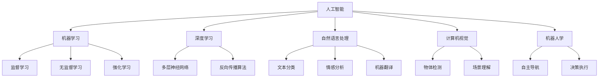

                 

# AI技术在实际应用中的前景

## 1. 背景介绍

人工智能(AI)技术自上世纪60年代兴起以来，经历了几十年的发展，已成为现代科技的重要组成部分。其核心思想在于模仿人类智能的行为和思维，通过算法和大数据驱动，实现机器的自主学习和决策。随着计算能力的提升和数据的不断积累，AI技术在多个领域取得了显著的突破和应用。

本文将从AI技术的核心概念、应用场景、未来展望等方面展开，探索AI技术在实际应用中的前景，并讨论其面临的挑战与机遇。

## 2. 核心概念与联系

### 2.1 核心概念概述

为了更好地理解AI技术在实际应用中的前景，首先需要了解几个关键概念：

- **人工智能(AI)**：指通过机器学习、数据挖掘等技术，使计算机系统具备类似人类的智能行为，包括感知、学习、推理、决策等能力。
- **机器学习(ML)**：使计算机系统能够通过数据学习并自主改进性能的过程，主要包含监督学习、无监督学习和强化学习等。
- **深度学习(Deep Learning)**：机器学习的一种，基于多层神经网络结构，通过反向传播算法训练模型，显著提升了机器学习模型的表达能力和泛化能力。
- **自然语言处理(NLP)**：使计算机系统能够理解、处理和生成人类语言的技术，主要应用于语音识别、文本分类、情感分析、机器翻译等任务。
- **计算机视觉(CV)**：使计算机系统能够识别、分析和处理图像和视频数据的技术，广泛应用于人脸识别、物体检测、场景理解等任务。
- **机器人学(Robotics)**：结合AI技术和机械工程，使机器人能够自主导航、决策和执行任务的技术。

这些概念构成了AI技术的基石，并紧密联系在一起，共同推动了AI技术的发展和应用。

### 2.2 核心概念原理和架构的 Mermaid 流程图(Mermaid 流程节点中不要有括号、逗号等特殊字符)



## 3. 核心算法原理 & 具体操作步骤

### 3.1 算法原理概述

AI技术的核心在于通过算法和大数据实现机器的自主学习和决策。其核心算法原理包括：

- **监督学习(Supervised Learning)**：利用已标记的数据训练模型，使其能够对新数据进行分类或预测。
- **无监督学习(Unsupervised Learning)**：从未标记的数据中提取特征和结构，发现数据的内在规律和关系。
- **强化学习(Reinforcement Learning)**：通过与环境交互，使智能体不断尝试并优化策略，达到预设的目标。
- **深度学习(Deep Learning)**：利用多层神经网络结构，通过反向传播算法优化模型参数，实现对复杂数据的拟合。

### 3.2 算法步骤详解

AI技术在实际应用中的具体操作步骤包括：

1. **数据收集与预处理**：获取大量的原始数据，并进行清洗、标注和归一化处理，确保数据的质量和一致性。
2. **模型选择与训练**：选择合适的机器学习算法和模型，利用训练数据进行模型训练，调整超参数以优化模型性能。
3. **模型评估与优化**：在验证集上评估模型性能，根据评估结果进行模型优化和调整，直至达到预设的指标要求。
4. **模型部署与应用**：将训练好的模型部署到生产环境中，进行实际的数据处理和决策。

### 3.3 算法优缺点

AI技术的优缺点如下：

- **优点**：
  - **高效性**：自动化处理大量数据，提升工作效率。
  - **准确性**：基于大数据和先进算法，能够实现高精度的预测和分类。
  - **灵活性**：能够快速适应不同任务和环境，灵活调整算法和模型。
  - **可扩展性**：技术易于部署和扩展，能够支持大规模应用。

- **缺点**：
  - **数据依赖**：对数据的依赖性强，数据质量不高可能影响模型效果。
  - **模型复杂性**：模型复杂度较高，调试和维护成本高。
  - **伦理与法律问题**：部分应用可能涉及伦理和法律问题，需谨慎处理。
  - **技术门槛**：需要专业的算法和数据处理能力，对技术要求高。

### 3.4 算法应用领域

AI技术在多个领域都有广泛的应用，包括：

- **医疗健康**：AI在疾病诊断、药物研发、个性化医疗等方面有巨大潜力，能够提高医疗服务的精准性和效率。
- **金融行业**：AI在风险评估、信用评分、智能投顾等方面表现出色，能够提升金融服务的智能化水平。
- **自动驾驶**：AI技术在自动驾驶、无人驾驶等方向取得了显著进展，能够实现更加安全、高效的智能交通系统。
- **智能制造**：AI在智能制造、智能仓储、智能物流等方面有广泛应用，能够提升生产效率和质量。
- **教育领域**：AI在个性化教学、智能评估、智能辅导等方面有巨大潜力，能够提升教育质量和效率。
- **零售行业**：AI在商品推荐、库存管理、客户服务等方面表现出色，能够提升零售业务的智能化水平。

## 4. 数学模型和公式 & 详细讲解 & 举例说明

### 4.1 数学模型构建

AI技术的数学模型主要包括以下几类：

- **线性回归模型**：$y = w^T x + b$，其中$w$为权重向量，$b$为偏置项。
- **逻辑回归模型**：$y = \sigma(w^T x + b)$，其中$\sigma$为sigmoid函数。
- **决策树模型**：通过树形结构对数据进行划分和决策。
- **支持向量机(SVM)**：通过最大化边界距离来分割不同类别的数据。
- **卷积神经网络(CNN)**：利用卷积层和池化层对图像数据进行特征提取和分类。
- **循环神经网络(RNN)**：通过时间序列的输入和输出，对序列数据进行建模和预测。
- **生成对抗网络(GAN)**：通过对抗训练，生成与真实数据难以区分的合成数据。

### 4.2 公式推导过程

以线性回归模型为例，推导其最小二乘法的损失函数和梯度下降优化算法。

设训练数据集为$(x_i, y_i)$，$i=1,2,...,n$。则线性回归模型的目标是最小化均方误差损失函数：

$$
\min_{w, b} \frac{1}{n}\sum_{i=1}^n (y_i - w^T x_i - b)^2
$$

引入均值计算符号$\bar{y}$和$\bar{x}$，可简化为：

$$
\min_{w, b} \frac{1}{n} \left\Vert y - wx - b \right\Vert^2
$$

对模型参数$w$和$b$求导，可得梯度下降优化算法的更新公式：

$$
w \leftarrow w - \alpha \frac{1}{n} (wx - y)^T (wx - y)
$$

$$
b \leftarrow b - \alpha \frac{1}{n} (wx - y)
$$

其中$\alpha$为学习率。

### 4.3 案例分析与讲解

以图像分类为例，说明CNN模型的训练和应用过程。

1. **模型构建**：构建一个包含卷积层、池化层和全连接层的CNN模型，用于对图像进行分类。
2. **数据准备**：准备图像数据集，并进行数据增强和预处理，如缩放、裁剪、归一化等。
3. **模型训练**：将数据集分为训练集和验证集，利用训练集对模型进行训练，并在验证集上评估模型性能。
4. **模型优化**：根据评估结果，调整模型结构和超参数，如卷积核大小、池化大小、学习率等。
5. **模型部署**：将训练好的模型部署到实际应用中，进行图像分类和识别。

## 5. 项目实践：代码实例和详细解释说明

### 5.1 开发环境搭建

项目实践前，需要准备开发环境。以下是使用Python进行TensorFlow开发的环境配置流程：

1. 安装Anaconda：从官网下载并安装Anaconda，用于创建独立的Python环境。
2. 创建并激活虚拟环境：
```bash
conda create -n tensorflow-env python=3.8 
conda activate tensorflow-env
```

3. 安装TensorFlow：根据CUDA版本，从官网获取对应的安装命令。例如：
```bash
conda install tensorflow -c tensorflow -c conda-forge
```

4. 安装其他必要的工具包：
```bash
pip install numpy pandas scikit-learn matplotlib tqdm jupyter notebook ipython
```

完成上述步骤后，即可在`tensorflow-env`环境中开始项目实践。

### 5.2 源代码详细实现

以下是一个基于TensorFlow的图像分类项目的完整代码实现。

```python
import tensorflow as tf
from tensorflow.keras import layers, models
from tensorflow.keras.preprocessing.image import ImageDataGenerator

# 定义模型结构
def create_model():
    model = models.Sequential([
        layers.Conv2D(32, (3, 3), activation='relu', input_shape=(150, 150, 3)),
        layers.MaxPooling2D((2, 2)),
        layers.Conv2D(64, (3, 3), activation='relu'),
        layers.MaxPooling2D((2, 2)),
        layers.Conv2D(128, (3, 3), activation='relu'),
        layers.MaxPooling2D((2, 2)),
        layers.Flatten(),
        layers.Dense(512, activation='relu'),
        layers.Dense(1, activation='sigmoid')
    ])
    return model

# 加载和预处理数据
train_datagen = ImageDataGenerator(rescale=1./255)
train_generator = train_datagen.flow_from_directory(
    'train',
    target_size=(150, 150),
    batch_size=20,
    class_mode='binary'
)

test_datagen = ImageDataGenerator(rescale=1./255)
test_generator = test_datagen.flow_from_directory(
    'test',
    target_size=(150, 150),
    batch_size=20,
    class_mode='binary'
)

# 构建模型
model = create_model()

# 编译模型
model.compile(optimizer='adam', loss='binary_crossentropy', metrics=['accuracy'])

# 训练模型
history = model.fit(train_generator, epochs=10, validation_data=test_generator)

# 评估模型
test_loss, test_acc = model.evaluate(test_generator, verbose=2)
print(f'Test accuracy: {test_acc:.2f}')
```

### 5.3 代码解读与分析

**create_model函数**：
- 定义了一个包含卷积层、池化层和全连接层的CNN模型，用于对图像进行分类。

**train_datagen和test_datagen对象**：
- 利用ImageDataGenerator对训练集和测试集进行数据增强和预处理，如缩放、裁剪、归一化等。

**model.compile方法**：
- 编译模型，指定优化器、损失函数和评估指标。

**model.fit方法**：
- 训练模型，利用训练集进行训练，并在验证集上评估模型性能。

**model.evaluate方法**：
- 评估模型，利用测试集计算模型的准确率。

## 6. 实际应用场景

### 6.1 智慧医疗

AI技术在智慧医疗领域有广泛的应用，包括医学影像分析、疾病预测、个性化医疗等。

- **医学影像分析**：利用卷积神经网络对医学影像进行自动分析和诊断，提高诊断准确率和效率。
- **疾病预测**：通过机器学习模型对患者历史数据进行分析，预测未来可能的疾病风险，提前采取干预措施。
- **个性化医疗**：利用深度学习对患者基因数据进行分析，制定个性化的治疗方案，提升治疗效果。

### 6.2 金融风险管理

AI技术在金融风险管理中有广泛的应用，包括信用评分、风险评估、智能投顾等。

- **信用评分**：利用机器学习模型对客户的信用数据进行分析，评估其信用风险。
- **风险评估**：通过深度学习模型对金融市场数据进行分析，预测市场波动和风险。
- **智能投顾**：利用AI技术提供个性化的投资建议，帮助投资者做出更明智的投资决策。

### 6.3 智能制造

AI技术在智能制造中有广泛的应用，包括智能检测、智能仓储、智能物流等。

- **智能检测**：利用机器视觉技术对产品质量进行自动检测和分析，提升检测效率和准确率。
- **智能仓储**：通过深度学习对仓库数据进行分析，优化仓储管理和库存管理，提高仓储效率。
- **智能物流**：利用机器学习对物流数据进行分析，优化物流路径和配送方案，提升物流效率。

### 6.4 智能交通

AI技术在智能交通中有广泛的应用，包括自动驾驶、交通流量分析、智能导航等。

- **自动驾驶**：利用机器学习对环境数据进行分析，实现车辆的自动驾驶和导航。
- **交通流量分析**：利用机器学习对交通数据进行分析，优化交通流量和调度方案，提高交通效率。
- **智能导航**：利用深度学习对地图数据进行分析，提供个性化的导航服务，提升用户体验。

## 7. 工具和资源推荐

### 7.1 学习资源推荐

为了帮助开发者系统掌握AI技术的应用，这里推荐一些优质的学习资源：

1. 《机器学习实战》：通过实际项目，系统讲解了机器学习的基本原理和应用。
2. 《深度学习》（Goodfellow等著）：详细介绍了深度学习的理论基础和实践应用。
3. 《计算机视觉：算法与应用》：全面讲解了计算机视觉的原理和技术。
4. 《自然语言处理综论》：系统介绍了自然语言处理的基本概念和应用。
5. 《机器人学导论》：讲解了机器人学的基本原理和技术。
6. 《TensorFlow实战》：详细介绍了TensorFlow的架构和应用。

通过对这些资源的学习实践，相信你一定能够快速掌握AI技术的精髓，并用于解决实际的工程问题。

### 7.2 开发工具推荐

高效的开发离不开优秀的工具支持。以下是几款用于AI技术开发常用的工具：

1. TensorFlow：基于Python的开源深度学习框架，灵活动态的计算图，适合快速迭代研究。
2. PyTorch：基于Python的开源深度学习框架，动态计算图，灵活易用。
3. Keras：基于TensorFlow和Theano的高级API，易于上手，适合快速开发。
4. scikit-learn：Python数据科学库，包含丰富的机器学习算法和工具。
5. Jupyter Notebook：基于Web的交互式计算环境，便于数据可视化、代码编写和调试。

合理利用这些工具，可以显著提升AI技术的开发效率，加快创新迭代的步伐。

### 7.3 相关论文推荐

AI技术的快速发展离不开学界的持续研究。以下是几篇奠基性的相关论文，推荐阅读：

1. 《神经网络与深度学习》：Ian Goodfellow等著，全面介绍了神经网络与深度学习的理论基础和实践应用。
2. 《大规模深度学习模型》：Jurgen Schmidhuber等著，讲解了深度学习模型的应用和发展。
3. 《机器学习：原理、算法与应用》：周志华著，详细介绍了机器学习的基本原理和应用。
4. 《深度学习与人类行为分析》：Susan Farsiu等著，讲解了深度学习在行为分析中的应用。
5. 《机器学习：模型、算法与应用》：Tom Mitchell著，讲解了机器学习模型的基本原理和应用。

这些论文代表了大数据和AI技术的发展脉络，通过学习这些前沿成果，可以帮助研究者把握学科前进方向，激发更多的创新灵感。

## 8. 总结：未来发展趋势与挑战

### 8.1 总结

本文对AI技术在实际应用中的前景进行了全面系统的介绍。首先阐述了AI技术的核心概念和应用场景，明确了AI技术在多个领域的重要作用。其次，从理论到实践，详细讲解了AI技术的算法原理和具体操作步骤，给出了AI技术开发的完整代码实例。同时，本文还广泛探讨了AI技术在智慧医疗、金融风险管理、智能制造、智能交通等实际应用场景中的应用前景，展示了AI技术的巨大潜力。此外，本文精选了AI技术的各类学习资源，力求为读者提供全方位的技术指引。

通过本文的系统梳理，可以看到，AI技术在实际应用中具有广阔的前景，能够深刻影响人类的生产生活方式。未来，伴随技术的不断演进，AI技术必将带来更多创新和突破，为各行各业带来新的变革和机遇。

### 8.2 未来发展趋势

展望未来，AI技术的发展趋势如下：

1. **模型规模不断增大**：随着计算能力的提升和数据量的增加，AI模型的参数规模将不断增大，能够处理更加复杂和精细的数据。
2. **多模态融合**：AI技术将突破单一模态的限制，实现视觉、语音、文本等多模态数据的融合，提升系统的感知和理解能力。
3. **实时计算与推理**：AI系统将实现实时计算和推理，能够即时处理大量的数据和任务，提升系统的响应速度和效率。
4. **自适应与自学习**：AI系统将具备自适应和自学习的能力，能够根据环境变化和数据输入，动态调整参数和策略，提升系统的灵活性和适应性。
5. **人机协同**：AI系统将更加注重人机协同，提升用户体验和系统互动性，实现更加智能和友好的交互。

### 8.3 面临的挑战

尽管AI技术在实际应用中取得了显著的成果，但在迈向更加智能化、普适化应用的过程中，仍面临诸多挑战：

1. **数据隐私与伦理**：AI系统对数据的依赖性强，数据隐私和伦理问题亟需解决，避免数据滥用和隐私泄露。
2. **技术复杂性**：AI技术的复杂度高，调试和维护成本高，需要专业的知识和技能。
3. **算力与成本**：大规模AI模型的训练和推理需要高性能的计算资源，成本较高。
4. **模型鲁棒性**：AI模型对数据的依赖性强，鲁棒性不足，面临对抗攻击和数据扰动的风险。
5. **伦理与法律问题**：部分AI应用可能涉及伦理和法律问题，需谨慎处理。

### 8.4 研究展望

面对AI技术面临的挑战，未来的研究需要在以下几个方面寻求新的突破：

1. **隐私保护技术**：开发更加安全和隐私保护的数据处理和传输技术，确保数据的安全和隐私。
2. **模型压缩与优化**：开发更加高效和轻量级的模型压缩和优化方法，降低计算资源和成本。
3. **模型鲁棒性提升**：研究如何提高AI模型的鲁棒性，使其能够应对对抗攻击和数据扰动。
4. **人机协同技术**：研究人机协同的交互机制和技术，提升系统的智能性和用户体验。
5. **伦理与法律框架**：构建AI技术的伦理与法律框架，确保AI系统的安全、可靠和可解释。

这些研究方向的探索，必将引领AI技术迈向更高的台阶，为构建安全、可靠、可解释、可控的智能系统铺平道路。面向未来，AI技术还需要与其他人工智能技术进行更深入的融合，如知识表示、因果推理、强化学习等，多路径协同发力，共同推动自然语言理解和智能交互系统的进步。只有勇于创新、敢于突破，才能不断拓展AI技术的边界，让智能技术更好地造福人类社会。

## 9. 附录：常见问题与解答

**Q1：AI技术在实际应用中面临哪些挑战？**

A: AI技术在实际应用中面临以下挑战：

1. **数据隐私与伦理**：AI系统对数据的依赖性强，数据隐私和伦理问题亟需解决，避免数据滥用和隐私泄露。
2. **技术复杂性**：AI技术的复杂度高，调试和维护成本高，需要专业的知识和技能。
3. **算力与成本**：大规模AI模型的训练和推理需要高性能的计算资源，成本较高。
4. **模型鲁棒性**：AI模型对数据的依赖性强，鲁棒性不足，面临对抗攻击和数据扰动的风险。
5. **伦理与法律问题**：部分AI应用可能涉及伦理和法律问题，需谨慎处理。

**Q2：AI技术在医疗领域的应用前景如何？**

A: AI技术在医疗领域具有广阔的应用前景，包括医学影像分析、疾病预测、个性化医疗等。

1. **医学影像分析**：利用卷积神经网络对医学影像进行自动分析和诊断，提高诊断准确率和效率。
2. **疾病预测**：通过机器学习模型对患者历史数据进行分析，预测未来可能的疾病风险，提前采取干预措施。
3. **个性化医疗**：利用深度学习对患者基因数据进行分析，制定个性化的治疗方案，提升治疗效果。

**Q3：AI技术在金融风险管理中的应用有哪些？**

A: AI技术在金融风险管理中有广泛的应用，包括信用评分、风险评估、智能投顾等。

1. **信用评分**：利用机器学习模型对客户的信用数据进行分析，评估其信用风险。
2. **风险评估**：通过深度学习模型对金融市场数据进行分析，预测市场波动和风险。
3. **智能投顾**：利用AI技术提供个性化的投资建议，帮助投资者做出更明智的投资决策。

**Q4：AI技术在智能交通中的应用前景如何？**

A: AI技术在智能交通中有广泛的应用，包括自动驾驶、交通流量分析、智能导航等。

1. **自动驾驶**：利用机器学习对环境数据进行分析，实现车辆的自动驾驶和导航。
2. **交通流量分析**：利用机器学习对交通数据进行分析，优化交通流量和调度方案，提高交通效率。
3. **智能导航**：利用深度学习对地图数据进行分析，提供个性化的导航服务，提升用户体验。

---

作者：禅与计算机程序设计艺术 / Zen and the Art of Computer Programming

