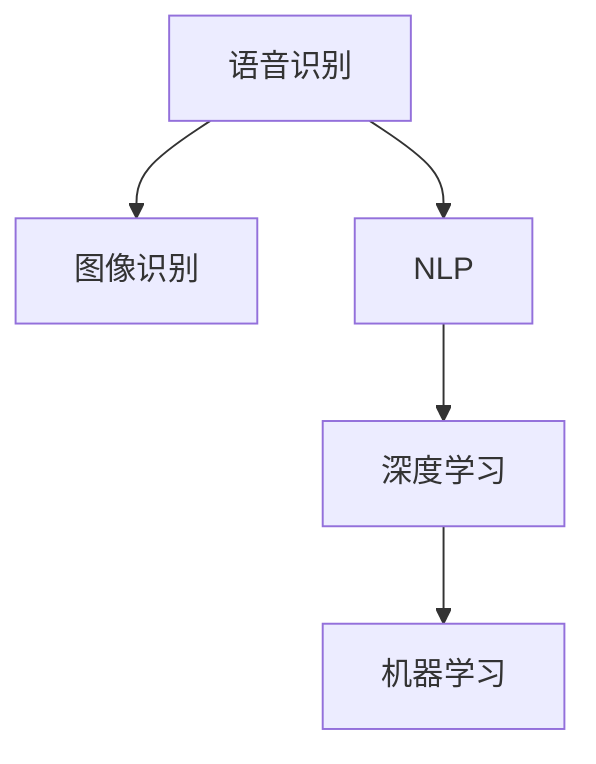
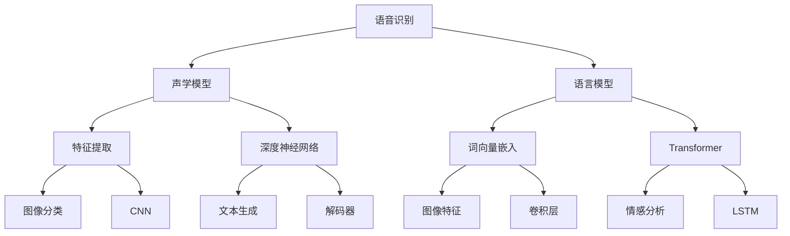

                 

# AI技术在消费电子中的应用现状

在数字时代的浪潮中，AI技术正在迅速渗透到各行各业，其中消费电子领域尤为显著。从智能手机、智能电视到智能音箱、智能家居，AI技术的应用正让消费电子设备变得更加智能、便捷、个性化。本文将详细探讨AI技术在消费电子中的应用现状，通过核心概念、核心算法、项目实践、实际应用等角度，全面剖析AI在消费电子中的实际应用，以及其面临的挑战和未来发展趋势。

## 1. 背景介绍

### 1.1 问题由来
随着人工智能技术的不断突破，AI技术在消费电子领域的普及速度迅速提升。AI不仅带来了全新的用户体验，还推动了消费电子设备的智能化升级。然而，尽管AI技术在消费电子领域取得了显著进展，但其应用效果仍受限于实际应用场景和技术的成熟度。因此，本文将对AI技术在消费电子中的应用现状进行全面分析，旨在为技术开发者和业界从业者提供有价值的参考。

### 1.2 问题核心关键点
在消费电子领域，AI技术的应用主要体现在以下几个方面：
1. 智能交互：通过语音识别、图像识别、自然语言处理等技术，实现设备与人类的自然交互。
2. 个性化推荐：根据用户行为和偏好，提供个性化内容推荐，提升用户体验。
3. 智能化控制：通过传感器、摄像头等设备收集数据，实现设备之间的互联互通，提高设备智能水平。
4. 自动化服务：通过机器学习、深度学习等技术，实现自动化服务，如语音助手、智能推荐等。
5. 安全性保障：通过AI技术增强设备的安全性，防范恶意攻击和数据泄露。

## 2. 核心概念与联系

### 2.1 核心概念概述

在消费电子领域，AI技术的应用涉及多个核心概念，包括：

- **语音识别**：利用深度学习等技术，将语音信号转换为文本信息，实现自然语言理解。
- **图像识别**：通过卷积神经网络(CNN)等技术，对图像进行特征提取和分类，实现对物体、场景的识别。
- **自然语言处理(NLP)**：通过语言模型、Transformer等技术，实现对文本信息的理解和生成。
- **深度学习**：利用多层神经网络对数据进行训练，提取特征，实现复杂的任务处理。
- **机器学习**：通过数据驱动的方法，不断优化模型，提升性能。

这些核心概念之间的逻辑关系可以通过以下Mermaid流程图来展示：



### 2.2 核心概念原理和架构的 Mermaid 流程图



## 3. 核心算法原理 & 具体操作步骤

### 3.1 算法原理概述

在消费电子领域，AI技术的应用主要基于以下几个核心算法原理：

1. **语音识别**：通过声学模型和语言模型，实现对语音信号的特征提取和文本转写。
2. **图像识别**：利用卷积神经网络(CNN)对图像进行特征提取和分类。
3. **自然语言处理(NLP)**：通过语言模型、Transformer等技术，实现对文本信息的理解和生成。
4. **深度学习**：利用多层神经网络对数据进行训练，提取特征，实现复杂的任务处理。
5. **机器学习**：通过数据驱动的方法，不断优化模型，提升性能。

### 3.2 算法步骤详解

以下是AI技术在消费电子中的应用步骤：

**Step 1: 数据收集与预处理**
- 收集用户数据、设备数据等，进行数据清洗和预处理，确保数据质量。
- 对数据进行标注，生成训练集、验证集和测试集。

**Step 2: 模型训练与微调**
- 选择合适的预训练模型，如BERT、ResNet等，作为初始化参数。
- 根据具体任务需求，设计合适的任务适配层和损失函数。
- 使用适当的优化算法（如Adam、SGD等），设置学习率、批大小等超参数。
- 在训练集上进行有监督训练，进行模型微调。

**Step 3: 模型评估与部署**
- 在验证集上评估模型性能，进行超参数调优。
- 在测试集上测试模型效果，确保模型泛化能力。
- 将模型部署到实际设备中，进行实时推理和交互。

### 3.3 算法优缺点

**优点：**
1. 提升用户体验：通过AI技术，消费电子设备可以提供更智能、个性化的服务，提升用户体验。
2. 增加设备功能：AI技术使得设备具备更多功能，如语音助手、图像识别等，扩展了设备应用场景。
3. 提升设备效率：AI技术可以自动化处理大量数据，减少人工干预，提高设备效率。

**缺点：**
1. 数据依赖性高：AI技术的效果高度依赖于数据质量，数据标注成本高。
2. 模型复杂度高：大规模模型训练和推理资源消耗大，硬件要求高。
3. 算法复杂性高：AI算法复杂，开发和调试难度大，需要专业知识。

### 3.4 算法应用领域

AI技术在消费电子领域的应用涵盖了多个方面：

1. **智能手机**：通过语音识别、图像识别等技术，实现智能助理、智能拍摄、智能识别等功能。
2. **智能电视**：通过自然语言处理(NLP)技术，实现语音控制、内容推荐等功能。
3. **智能音箱**：通过语音识别、自然语言处理(NLP)等技术，实现智能助理、智能播放等功能。
4. **智能家居**：通过传感器、摄像头等设备，实现设备互联、智能控制等功能。
5. **智能穿戴设备**：通过健康监测、语音识别等技术，提升用户体验，实现个性化服务。

## 4. 数学模型和公式 & 详细讲解 & 举例说明

### 4.1 数学模型构建

在AI技术的应用中，数学模型和公式是实现核心算法的基础。以语音识别为例，其核心模型包括声学模型和语言模型，其数学模型如下：

- **声学模型**：$P(x|y) = \prod_{i=1}^T P(x_i|x_{i-1}, y)$，其中 $x$ 为语音信号，$y$ 为文本转写，$P(x|y)$ 表示在给定文本转写 $y$ 的情况下，语音信号 $x$ 的概率分布。
- **语言模型**：$P(y|x) = \frac{P(x|y)P(y)}{P(x)}$，其中 $P(y)$ 为文本转写的先验概率，$P(x)$ 为语音信号的先验概率，$P(x|y)$ 为条件概率。

### 4.2 公式推导过程

以语音识别中的声学模型为例，其推导过程如下：

1. 将语音信号 $x$ 分解为多个帧 $x_i$，其中 $i$ 表示帧序号。
2. 对于每个帧 $x_i$，使用声学模型 $P(x_i|x_{i-1}, y)$ 计算其条件概率。
3. 将各帧的概率相乘，得到整个语音信号的概率 $P(x|y)$。

### 4.3 案例分析与讲解

**案例：智能音箱的语音识别**

假设一个智能音箱的语音识别系统，需要识别用户输入的语音指令，进行智能回答。该系统的数学模型构建如下：

- **声学模型**：使用基于RNN的声学模型，计算语音信号 $x$ 在给定文本转写 $y$ 的情况下的概率。
- **语言模型**：使用基于LSTM的语言模型，计算文本转写 $y$ 的概率。
- **模型融合**：将声学模型和语言模型结合，得到最终的概率 $P(x|y)$。

## 5. 项目实践：代码实例和详细解释说明

### 5.1 开发环境搭建

在项目实践前，我们需要准备好开发环境。以下是使用Python进行TensorFlow开发的环境配置流程：

1. 安装Anaconda：从官网下载并安装Anaconda，用于创建独立的Python环境。
2. 创建并激活虚拟环境：
```bash
conda create -n tf-env python=3.7
conda activate tf-env
```
3. 安装TensorFlow：根据CUDA版本，从官网获取对应的安装命令。例如：
```bash
conda install tensorflow -c tensorflow -c conda-forge
```
4. 安装各类工具包：
```bash
pip install numpy pandas scikit-learn matplotlib tqdm jupyter notebook ipython
```

完成上述步骤后，即可在`tf-env`环境中开始项目实践。

### 5.2 源代码详细实现

以下是一个基于TensorFlow实现语音识别的代码示例：

```python
import tensorflow as tf
from tensorflow.keras import layers

# 定义声学模型
class AcousticModel(tf.keras.Model):
    def __init__(self, input_shape):
        super(AcousticModel, self).__init__()
        self.cnn1 = layers.Conv2D(32, (3, 3), activation='relu', input_shape=input_shape)
        self.pool1 = layers.MaxPooling2D((2, 2))
        self.cnn2 = layers.Conv2D(64, (3, 3), activation='relu')
        self.pool2 = layers.MaxPooling2D((2, 2))
        self.flatten = layers.Flatten()
        self.fc1 = layers.Dense(128, activation='relu')
        self.fc2 = layers.Dense(num_classes, activation='softmax')
        
    def call(self, x):
        x = self.cnn1(x)
        x = self.pool1(x)
        x = self.cnn2(x)
        x = self.pool2(x)
        x = self.flatten(x)
        x = self.fc1(x)
        return self.fc2(x)

# 定义语言模型
class LinguisticModel(tf.keras.Model):
    def __init__(self, input_shape):
        super(LinguisticModel, self).__init__()
        self.lstm1 = layers.LSTM(128, return_sequences=True)
        self.lstm2 = layers.LSTM(128)
        self.dense = layers.Dense(num_classes, activation='softmax')
        
    def call(self, x):
        x = self.lstm1(x)
        x = self.lstm2(x)
        x = self.dense(x)
        return x

# 定义融合模型
class FusionModel(tf.keras.Model):
    def __init__(self, acoustic_model, linguistic_model):
        super(FusionModel, self).__init__()
        self.acoustic_model = acoustic_model
        self.linguistic_model = linguistic_model
        self.concat = layers.Concatenate()
        self.fc = layers.Dense(128, activation='relu')
        self.output = layers.Dense(num_classes, activation='softmax')
        
    def call(self, x):
        acoustic_output = self.acoustic_model(x)
        linguistic_output = self.linguistic_model(x)
        concat_output = self.concat([acoustic_output, linguistic_output])
        x = self.fc(concat_output)
        return self.output(x)

# 训练模型
model = FusionModel(acoustic_model, linguistic_model)
model.compile(optimizer='adam', loss='sparse_categorical_crossentropy', metrics=['accuracy'])

# 训练过程
model.fit(train_dataset, epochs=10, validation_data=val_dataset)

# 评估模型
model.evaluate(test_dataset)
```

### 5.3 代码解读与分析

让我们再详细解读一下关键代码的实现细节：

**AcousticModel类**：
- `__init__`方法：初始化声学模型，包含卷积层、池化层和全连接层。
- `call`方法：定义模型的前向传播过程，对输入的语音信号进行特征提取和分类。

**LinguisticModel类**：
- `__init__`方法：初始化语言模型，包含LSTM层和全连接层。
- `call`方法：定义模型的前向传播过程，对文本转写进行分类。

**FusionModel类**：
- `__init__`方法：初始化融合模型，包含声学模型、语言模型和全连接层。
- `call`方法：定义模型的前向传播过程，将声学模型和语言模型的输出进行融合，并最终输出分类结果。

**训练过程**：
- 创建融合模型，并使用`compile`方法定义优化器和损失函数。
- 使用`fit`方法在训练集上训练模型，设置训练轮数和验证集。
- 使用`evaluate`方法在测试集上评估模型性能。

**评估过程**：
- 在测试集上使用`evaluate`方法评估模型性能，输出准确率和损失值。

## 6. 实际应用场景

### 6.1 智能音箱

智能音箱作为AI技术在消费电子领域的重要应用，能够实现语音识别、自然语言处理(NLP)、智能助理等功能。通过语音识别技术，智能音箱可以听懂用户的指令，并进行智能回答或控制其他智能设备。例如，用户可以语音指令控制智能音箱播放音乐、设置闹钟、查询天气等信息，极大地提升了用户体验。

### 6.2 智能电视

智能电视通过自然语言处理(NLP)技术，可以实现语音控制、内容推荐等功能。用户可以通过语音指令控制电视播放、切换频道、查找电影等，极大提升了观影体验。同时，智能电视还可以根据用户的观影历史和偏好，推荐相关影视内容，提升用户粘性。

### 6.3 智能家居

智能家居通过传感器、摄像头等设备，实现设备互联和智能控制。例如，智能音箱可以通过语音指令控制智能灯泡、智能窗帘、智能门锁等设备，提升家居生活的便利性和安全性。同时，智能家居还可以根据用户的生活习惯和偏好，自动调整设备状态，实现节能减排和智能化生活。

### 6.4 未来应用展望

随着AI技术的不断发展，未来AI在消费电子领域的应用将更加广泛和深入。以下是对未来应用前景的展望：

1. **全场景智能**：未来AI将实现全场景智能，设备之间的互联互通将更加紧密，用户可以通过一个智能设备控制多个设备，实现无缝智能体验。
2. **个性化服务**：AI技术将更好地理解用户需求，提供更加个性化的服务，如推荐系统、智能助理等，提升用户体验。
3. **自动化服务**：AI技术将实现更多自动化服务，如自动调节温度、光照等，提升生活品质。
4. **数据隐私保护**：随着AI技术的应用深入，数据隐私保护将成为重要议题。未来的AI应用将更加注重用户隐私，确保数据安全和透明。

## 7. 工具和资源推荐

### 7.1 学习资源推荐

为了帮助开发者系统掌握AI技术在消费电子中的应用，这里推荐一些优质的学习资源：

1. **TensorFlow官方文档**：TensorFlow官方文档提供了丰富的API和教程，适合初学者快速上手。
2. **TensorFlow模型库**：TensorFlow模型库包含了多种预训练模型和样例代码，方便开发者直接使用。
3. **Google AI博文**：Google AI博客介绍了许多前沿的AI应用和技术，适合了解最新的研究方向和实践经验。
4. **OpenAI GPT系列论文**：OpenAI发布的GPT系列论文详细介绍了GPT模型在自然语言处理领域的应用，适合深入学习。
5. **Kaggle竞赛**：Kaggle数据科学竞赛提供了大量的数据集和挑战任务，适合实战练习。

通过对这些资源的学习实践，相信你一定能够快速掌握AI技术在消费电子中的应用，并用于解决实际的业务问题。

### 7.2 开发工具推荐

高效的开发离不开优秀的工具支持。以下是几款用于AI技术在消费电子领域开发的常用工具：

1. **TensorFlow**：由Google主导开发的开源深度学习框架，生产部署方便，适合大规模工程应用。
2. **PyTorch**：由Facebook主导开发的深度学习框架，灵活高效，适合快速迭代研究。
3. **Keras**：基于TensorFlow和Theano的高级深度学习API，适合初学者和快速原型开发。
4. **Jupyter Notebook**：开源的交互式笔记本，支持Python、R等多种语言，适合数据分析和模型开发。
5. **Colab**：谷歌推出的在线Jupyter Notebook环境，免费提供GPU/TPU算力，适合快速上手实验最新模型，分享学习笔记。

合理利用这些工具，可以显著提升AI技术在消费电子领域的开发效率，加快创新迭代的步伐。

### 7.3 相关论文推荐

AI技术在消费电子领域的发展源于学界的持续研究。以下是几篇奠基性的相关论文，推荐阅读：

1. **Attention is All You Need**：提出Transformer结构，开启了NLP领域的预训练大模型时代。
2. **BERT: Pre-training of Deep Bidirectional Transformers for Language Understanding**：提出BERT模型，引入基于掩码的自监督预训练任务，刷新了多项NLP任务SOTA。
3. **Convolutional Neural Networks for Sentence Classification**：提出卷积神经网络用于文本分类，展示了其在NLP领域的潜力。
4. **Deep Recurrent Neural Networks for Speech Recognition**：提出基于RNN的声学模型，展示了其在语音识别领域的优势。
5. **LSTM: A Search Space Odyssey Through Time**：提出长短期记忆网络(LSTM)，解决了RNN在处理长期依赖问题上的缺陷。

这些论文代表了大语言模型在消费电子领域的发展脉络。通过学习这些前沿成果，可以帮助研究者把握学科前进方向，激发更多的创新灵感。

## 8. 总结：未来发展趋势与挑战

### 8.1 总结

本文对AI技术在消费电子领域的应用现状进行了全面系统的介绍。首先阐述了AI技术在消费电子领域的研究背景和意义，明确了AI技术在提升用户体验、扩展设备功能、提高设备效率等方面的独特价值。其次，从原理到实践，详细讲解了AI技术在消费电子中的应用步骤，以及各个核心算法的数学模型和公式推导过程。同时，本文还广泛探讨了AI技术在智能音箱、智能电视、智能家居等多个行业领域的应用前景，展示了AI技术在消费电子领域的广阔前景。

通过本文的系统梳理，可以看到，AI技术在消费电子领域的应用已经取得了显著进展，推动了设备智能化和用户体验的提升。未来，伴随AI技术的不断进步，消费电子设备将变得更加智能、便捷、个性化，为用户带来更加卓越的使用体验。

### 8.2 未来发展趋势

展望未来，AI技术在消费电子领域将呈现以下几个发展趋势：

1. **全场景智能**：未来AI将实现全场景智能，设备之间的互联互通将更加紧密，用户可以通过一个智能设备控制多个设备，实现无缝智能体验。
2. **个性化服务**：AI技术将更好地理解用户需求，提供更加个性化的服务，如推荐系统、智能助理等，提升用户体验。
3. **自动化服务**：AI技术将实现更多自动化服务，如自动调节温度、光照等，提升生活品质。
4. **数据隐私保护**：随着AI技术的应用深入，数据隐私保护将成为重要议题。未来的AI应用将更加注重用户隐私，确保数据安全和透明。
5. **跨模态融合**：未来的AI应用将更多地融合视觉、语音、文本等多模态数据，实现更全面的智能体验。

以上趋势凸显了AI技术在消费电子领域的广阔前景。这些方向的探索发展，必将进一步推动消费电子设备智能化水平的提升，为人类生活带来更多便利和惊喜。

### 8.3 面临的挑战

尽管AI技术在消费电子领域取得了显著进展，但仍面临诸多挑战：

1. **数据隐私问题**：在智能设备中，大量用户数据被收集和处理，如何保护用户隐私成为重要议题。
2. **设备计算资源**：大规模模型和算法需要高计算资源，如何在有限的硬件环境下实现高效推理是一个挑战。
3. **算法公平性**：AI算法可能存在偏见和歧视，如何确保算法的公平性是一个重要问题。
4. **模型可解释性**：AI模型往往被视为“黑盒”，缺乏可解释性，如何提升模型的透明度是一个挑战。
5. **安全性和鲁棒性**：AI模型可能面临恶意攻击和干扰，如何确保模型的安全性和鲁棒性是一个重要问题。

面对这些挑战，未来需要在数据隐私保护、硬件优化、算法公平性、模型可解释性和安全性等方面进行深入研究和探索，以推动AI技术在消费电子领域的应用。

### 8.4 研究展望

面对AI技术在消费电子领域所面临的挑战，未来的研究需要在以下几个方面寻求新的突破：

1. **隐私保护技术**：研究数据加密、差分隐私等技术，确保用户数据隐私和安全。
2. **高效推理技术**：研究模型压缩、量化等技术，优化推理性能，降低硬件资源消耗。
3. **公平性算法**：研究算法公平性评估和优化方法，确保AI算法的公平性。
4. **可解释性算法**：研究模型解释和可视化方法，提升模型的可解释性。
5. **安全性技术**：研究模型鲁棒性和抗干扰能力，提升系统的安全性。

这些研究方向的探索，必将推动AI技术在消费电子领域的持续进步，为人类生活带来更多便利和惊喜。

## 9. 附录：常见问题与解答

**Q1: AI技术在消费电子设备中的应用现状如何？**

A: AI技术在消费电子设备中的应用现状主要体现在以下几个方面：
1. 语音识别：通过语音识别技术，智能音箱、智能电视等设备可以实现自然语言交互，提升用户体验。
2. 图像识别：通过图像识别技术，智能相机、智能电视等设备可以实现人脸识别、物体识别等。
3. 自然语言处理(NLP)：通过自然语言处理技术，智能音箱、智能电视等设备可以实现内容推荐、智能助理等。
4. 深度学习：通过深度学习技术，智能电视、智能相机等设备可以实现图像识别、情感分析等。
5. 机器学习：通过机器学习技术，智能电视、智能音箱等设备可以实现个性化推荐、自动化服务等功能。

**Q2: 如何确保AI在消费电子设备中的安全性？**

A: 确保AI在消费电子设备中的安全性需要从以下几个方面进行：
1. 数据加密：使用数据加密技术，确保用户数据在传输和存储过程中的安全性。
2. 差分隐私：使用差分隐私技术，在保护用户隐私的前提下，提供数据分析和推理服务。
3. 模型鲁棒性：使用鲁棒性优化技术，确保模型在面对恶意攻击和干扰时，仍然能够保持稳定和可靠。
4. 算法公平性：使用公平性评估和优化方法，确保AI算法在处理不同数据集时不产生偏见和歧视。
5. 模型解释性：使用模型解释和可视化方法，提升模型的可解释性，确保模型的决策过程透明可控。

**Q3: AI技术在消费电子设备中的应用前景如何？**

A: AI技术在消费电子设备中的应用前景非常广阔，主要体现在以下几个方面：
1. 全场景智能：未来AI将实现全场景智能，设备之间的互联互通将更加紧密，用户可以通过一个智能设备控制多个设备，实现无缝智能体验。
2. 个性化服务：AI技术将更好地理解用户需求，提供更加个性化的服务，如推荐系统、智能助理等，提升用户体验。
3. 自动化服务：AI技术将实现更多自动化服务，如自动调节温度、光照等，提升生活品质。
4. 跨模态融合：未来的AI应用将更多地融合视觉、语音、文本等多模态数据，实现更全面的智能体验。
5. 数据隐私保护：随着AI技术的应用深入，数据隐私保护将成为重要议题。未来的AI应用将更加注重用户隐私，确保数据安全和透明。

**Q4: AI技术在消费电子设备中面临哪些挑战？**

A: AI技术在消费电子设备中面临的挑战主要包括：
1. 数据隐私问题：在智能设备中，大量用户数据被收集和处理，如何保护用户隐私成为重要议题。
2. 设备计算资源：大规模模型和算法需要高计算资源，如何在有限的硬件环境下实现高效推理是一个挑战。
3. 算法公平性：AI算法可能存在偏见和歧视，如何确保算法的公平性是一个重要问题。
4. 模型可解释性：AI模型往往被视为“黑盒”，缺乏可解释性，如何提升模型的透明度是一个挑战。
5. 安全性和鲁棒性：AI模型可能面临恶意攻击和干扰，如何确保模型的安全性和鲁棒性是一个重要问题。

**Q5: 如何确保AI在消费电子设备中的公平性？**

A: 确保AI在消费电子设备中的公平性需要从以下几个方面进行：
1. 数据平衡：确保训练数据集在性别、年龄、种族等方面的平衡，避免数据偏见。
2. 算法优化：使用公平性优化算法，确保模型在处理不同数据集时不产生偏见和歧视。
3. 模型评估：使用公平性评估指标，评估模型的公平性表现，并进行持续改进。

**Q6: 如何确保AI在消费电子设备中的安全性？**

A: 确保AI在消费电子设备中的安全性需要从以下几个方面进行：
1. 数据加密：使用数据加密技术，确保用户数据在传输和存储过程中的安全性。
2. 差分隐私：使用差分隐私技术，在保护用户隐私的前提下，提供数据分析和推理服务。
3. 模型鲁棒性：使用鲁棒性优化技术，确保模型在面对恶意攻击和干扰时，仍然能够保持稳定和可靠。
4. 算法公平性：使用公平性评估和优化方法，确保AI算法在处理不同数据集时不产生偏见和歧视。
5. 模型解释性：使用模型解释和可视化方法，提升模型的可解释性，确保模型的决策过程透明可控。

**Q7: AI技术在消费电子设备中的应用现状如何？**

A: AI技术在消费电子设备中的应用现状主要体现在以下几个方面：
1. 语音识别：通过语音识别技术，智能音箱、智能电视等设备可以实现自然语言交互，提升用户体验。
2. 图像识别：通过图像识别技术，智能相机、智能电视等设备可以实现人脸识别、物体识别等。
3. 自然语言处理(NLP)：通过自然语言处理技术，智能音箱、智能电视等设备可以实现内容推荐、智能助理等。
4. 深度学习：通过深度学习技术，智能电视、智能相机等设备可以实现图像识别、情感分析等。
5. 机器学习：通过机器学习技术，智能电视、智能音箱等设备可以实现个性化推荐、自动化服务等功能。

**Q8: AI技术在消费电子设备中的应用前景如何？**

A: AI技术在消费电子设备中的应用前景非常广阔，主要体现在以下几个方面：
1. 全场景智能：未来AI将实现全场景智能，设备之间的互联互通将更加紧密，用户可以通过一个智能设备控制多个设备，实现无缝智能体验。
2. 个性化服务：AI技术将更好地理解用户需求，提供更加个性化的服务，如推荐系统、智能助理等，提升用户体验。
3. 自动化服务：AI技术将实现更多自动化服务，如自动调节温度、光照等，提升生活品质。
4. 跨模态融合：未来的AI应用将更多地融合视觉、语音、文本等多模态数据，实现更全面的智能体验。
5. 数据隐私保护：随着AI技术的应用深入，数据隐私保护将成为重要议题。未来的AI应用将更加注重用户隐私，确保数据安全和透明。

**Q9: AI技术在消费电子设备中面临哪些挑战？**

A: AI技术在消费电子设备中面临的挑战主要包括：
1. 数据隐私问题：在智能设备中，大量用户数据被收集和处理，如何保护用户隐私成为重要议题。
2. 设备计算资源：大规模模型和算法需要高计算资源，如何在有限的硬件环境下实现高效推理是一个挑战。
3. 算法公平性：AI算法可能存在偏见和歧视，如何确保算法的公平性是一个重要问题。
4. 模型可解释性：AI模型往往被视为“黑盒”，缺乏可解释性，如何提升模型的透明度是一个挑战。
5. 安全性和鲁棒性：AI模型可能面临恶意攻击和干扰，如何确保模型的安全性和鲁棒性是一个重要问题。

**Q10: 如何确保AI在消费电子设备中的安全性？**

A: 确保AI在消费电子设备中的安全性需要从以下几个方面进行：
1. 数据加密：使用数据加密技术，确保用户数据在传输和存储过程中的安全性。
2. 差分隐私：使用差分隐私技术，在保护用户隐私的前提下，提供数据分析和推理服务。
3. 模型鲁棒性：使用鲁棒性优化技术，确保模型在面对恶意攻击和干扰时，仍然能够保持稳定和可靠。
4. 算法公平性：使用公平性评估和优化方法，确保AI算法在处理不同数据集时不产生偏见和歧视。
5. 模型解释性：使用模型解释和可视化方法，提升模型的可解释性，确保模型的决策过程透明可控。

**Q11: AI技术在消费电子设备中的应用现状如何？**

A: AI技术在消费电子设备中的应用现状主要体现在以下几个方面：
1. 语音识别：通过语音识别技术，智能音箱、智能电视等设备可以实现自然语言交互，提升用户体验。
2. 图像识别：通过图像识别技术，智能相机、智能电视等设备可以实现人脸识别、物体识别等。
3. 自然语言处理(NLP)：通过自然语言处理技术，智能音箱、智能电视等设备可以实现内容推荐、智能助理等。
4. 深度学习：通过深度学习技术，智能电视、智能相机等设备可以实现图像识别、情感分析等。
5. 机器学习：通过机器学习技术，智能电视、智能音箱等设备可以实现个性化推荐、自动化服务等功能。

**Q12: AI技术在消费电子设备中的应用前景如何？**

A: AI技术在消费电子设备中的应用前景非常广阔，主要体现在以下几个方面：
1. 全场景智能：未来AI将实现全场景智能，设备之间的互联互通将更加紧密，用户可以通过一个智能设备控制多个设备，实现无缝智能体验。
2. 个性化服务：AI技术将更好地理解用户需求，提供更加个性化的服务，如推荐系统、智能助理等，提升用户体验。
3. 自动化服务：AI技术将实现更多自动化服务，如自动调节温度、光照等，提升生活品质。
4. 跨模态融合：未来的AI应用将更多地融合视觉、语音、文本等多模态数据，实现更全面的智能体验。
5. 数据隐私保护：随着AI技术的应用深入，数据隐私保护将成为重要议题。未来的AI应用将更加注重用户隐私，确保数据安全和透明。

**Q13: AI技术在消费电子设备中面临哪些挑战？**

A: AI技术在消费电子设备中面临的挑战主要包括：
1. 数据隐私问题：在智能设备中，大量用户数据被收集和处理，如何保护用户隐私成为重要议题。
2. 设备计算资源：大规模模型和算法需要高计算资源，如何在有限的硬件环境下实现高效推理是一个挑战。
3. 算法公平性：AI算法可能存在偏见和歧视，如何确保算法的公平性是一个重要问题。
4. 模型可解释性：AI模型往往被视为“黑盒”，缺乏可解释性，如何提升模型的透明度是一个挑战。
5. 安全性和鲁棒性：AI模型可能面临恶意攻击和干扰，如何确保模型的安全性和鲁棒性是一个重要问题。

**Q14: 如何确保AI在消费电子设备中的安全性？**

A: 确保AI在消费电子设备中的安全性需要从以下几个方面进行：
1. 数据加密：使用数据加密技术，确保用户数据在传输和存储过程中的安全性。
2. 差分隐私：使用差分隐私技术，在保护用户隐私的前提下，提供数据分析和推理服务。
3. 模型鲁棒性：使用鲁棒性优化技术，确保模型在面对恶意攻击和干扰时，仍然能够保持稳定和可靠。
4. 算法公平性：使用公平性评估和优化方法，确保AI算法在处理不同数据集时不产生偏见和歧视。
5. 模型解释性：使用模型解释和可视化方法，提升模型的可解释性，确保模型的决策过程透明可控。

**Q15: AI技术在消费电子设备中的应用现状如何？**

A: AI技术在消费电子设备中的应用现状主要体现在以下几个方面：
1. 语音识别：通过语音识别技术，智能音箱、智能电视等设备可以实现自然语言交互，提升用户体验。
2. 图像识别：通过图像识别技术，智能相机、智能电视等设备可以实现人脸识别、物体识别等。
3. 自然语言处理(NLP)：通过自然语言处理技术，智能音箱、智能电视等设备可以实现内容推荐、智能助理等。
4. 深度学习：通过深度学习技术，智能电视、智能相机等设备可以实现图像识别、情感分析等。
5. 机器学习：通过机器学习技术，智能电视、智能音箱等设备可以实现个性化推荐、自动化服务等功能。

**Q16: AI技术在消费电子设备中的应用前景如何？**

A: AI技术在消费电子设备中的应用前景非常广阔，主要体现在以下几个方面：
1. 全场景智能：未来AI将实现全场景智能，设备之间的互联互通将更加紧密，用户可以通过一个智能设备控制多个设备，实现无缝智能体验。
2. 个性化服务：AI技术将更好地理解用户需求，提供更加个性化的服务，如推荐系统、智能助理等，提升用户体验。
3. 自动化服务：AI技术将实现更多自动化服务，如自动调节温度、光照等，提升生活品质。
4. 跨模态融合：未来的AI应用将更多地融合视觉、语音、文本等多模态数据，实现更全面的智能体验。
5. 数据隐私保护：随着AI技术的应用深入，数据隐私保护将成为重要议题。未来的AI应用将更加注重用户隐私，确保数据安全和透明。

**Q17: AI技术在消费电子设备中面临哪些挑战？**

A: AI技术在消费电子设备中面临的挑战主要包括：
1. 数据隐私问题：在智能设备中，大量用户数据被收集和处理，如何保护用户隐私成为重要议题。
2. 设备计算资源：大规模模型和算法需要高计算资源，如何在有限的硬件环境下实现高效推理是一个挑战。
3. 算法公平性：AI算法可能存在偏见和歧视，如何确保算法的公平性是一个重要问题。
4. 模型可解释性：AI模型往往被视为“黑盒”，缺乏可解释性，如何提升模型的透明度是一个挑战。
5. 安全性和鲁棒性：AI模型可能面临恶意攻击和干扰，如何确保模型的安全性和鲁棒性是一个重要问题。

**Q18: 如何确保AI在消费电子设备中的安全性？**

A: 确保AI在消费电子设备中的安全性需要从以下几个方面进行：
1. 数据加密：使用数据加密技术，确保用户数据在传输和存储过程中的安全性。
2. 差分隐私：使用差分隐私技术，在保护用户隐私的前提下，提供数据分析和推理服务。
3. 模型鲁棒性：使用鲁棒性优化技术，确保模型在面对恶意攻击和干扰时，仍然能够保持稳定和可靠。
4. 算法公平性：使用公平性评估和优化方法，确保AI算法在处理不同数据集时不产生偏见和歧视。
5. 模型解释性：使用模型解释和可视化方法，提升模型的可解释性，确保模型的决策过程透明可控。

**Q19: AI技术在消费电子设备中的应用现状如何？**

A: AI技术在消费电子设备中的应用现状主要体现在以下几个方面：
1. 语音识别：通过语音识别技术，智能音箱、智能电视等设备可以实现自然语言交互，提升用户体验。
2. 图像识别：通过图像识别技术，智能相机、智能电视等设备可以实现人脸识别、物体识别等。
3. 自然语言处理(NLP)：通过自然语言处理技术，智能音箱、智能电视等设备可以实现内容推荐、智能助理等。
4. 深度学习：通过深度学习技术，智能电视、智能相机等设备可以实现图像识别、情感分析等。
5. 机器学习：通过机器学习技术，智能电视、智能音箱等设备可以实现个性化推荐、自动化服务等功能。

**Q20: AI技术在消费电子设备中的应用前景如何？**

A: AI技术在消费电子设备中的应用前景非常广阔，主要体现在以下几个方面：
1. 全场景智能：未来AI将实现全场景智能，设备之间的互联互通将更加紧密，用户可以通过一个智能设备控制多个设备，实现无缝智能体验。
2. 个性化服务：AI技术将更好地理解用户需求，提供更加个性化的服务，如推荐系统、智能助理等，提升用户体验。
3. 自动化服务：AI技术将实现更多自动化服务，如自动调节温度、光照等，提升生活品质。
4. 跨模态融合：未来的AI应用将更多地融合视觉、语音、文本等多模态数据，实现更全面的智能体验。
5. 数据隐私保护：随着AI技术的应用深入，数据隐私保护将成为重要议题。未来的AI应用将更加注重用户隐私，确保数据安全和透明。

**Q21: AI技术在消费电子设备中面临哪些挑战？**

A: AI技术在消费电子设备中面临的挑战主要包括：
1. 数据隐私问题：在智能设备中，大量用户数据被收集和处理，如何保护用户隐私成为重要议题。
2. 设备计算资源：大规模模型和算法需要高计算资源，如何在有限的硬件环境下实现高效推理是一个挑战。
3. 算法公平性：AI算法可能存在偏见和歧视，如何确保算法的公平性是一个重要问题。
4. 模型可解释性：AI模型往往被视为“黑盒”，缺乏可解释性，如何提升模型的透明度是一个挑战。
5. 安全性和鲁棒性：AI模型可能面临恶意攻击和干扰，如何确保模型的安全性和鲁棒性是一个重要问题。

**Q22: 如何确保AI在消费电子设备中的安全性？**

A: 确保AI在消费电子设备中的安全性需要从以下几个方面进行：
1. 数据加密：使用数据加密技术，确保用户数据在传输和存储过程中的安全性。
2. 差分隐私：使用差分隐私技术，在保护用户隐私的前提下，提供数据分析和推理服务。
3. 模型鲁棒性：使用鲁棒性优化技术，确保模型在面对恶意攻击和干扰时，仍然能够保持稳定和可靠。
4. 算法公平性：使用公平性评估和优化方法，确保AI算法在处理不同数据集时不产生偏见和歧视。
5. 模型解释性：使用模型解释和可视化方法，提升模型的可解释性，确保模型的决策过程透明可控。

**Q23: AI技术在消费电子设备中的应用现状如何？**

A: AI技术在消费电子设备中的应用现状主要体现在以下几个方面：
1. 语音识别：通过语音识别技术，智能音箱、智能电视等设备可以实现自然语言交互，提升用户体验。
2. 图像识别：通过图像识别技术，智能相机、智能电视等设备可以实现人脸识别、物体识别等。
3. 自然语言处理(NLP)：通过自然语言处理技术，智能音箱、智能电视等设备可以实现内容推荐、智能助理等。
4. 深度学习：通过深度学习技术，智能电视、智能相机等设备可以实现图像识别、情感分析等。
5. 机器学习：通过机器学习技术，智能电视、智能音箱等设备可以实现个性化推荐、自动化服务等功能。

**Q24: AI技术在消费电子设备中的应用前景如何？**

A: AI技术在消费电子设备中的应用前景非常广阔，主要体现在以下几个方面：
1. 全场景智能：未来AI将实现全场景智能，设备之间的互联互通将更加紧密，用户可以通过一个智能设备控制多个设备，实现无缝智能体验。
2. 个性化服务：AI技术将更好地理解用户需求，提供更加个性化的服务，如推荐系统、智能助理等，提升用户体验。
3. 自动化服务：AI技术将实现更多自动化服务，如自动调节温度、光照等，提升生活品质。
4. 跨模态融合：未来的AI应用将更多地融合视觉、语音、文本等多模态数据，实现更全面的智能体验。
5. 数据隐私保护：随着AI技术的应用深入，数据隐私保护将成为重要议题。未来的AI应用将更加注重用户隐私，确保数据安全和透明。

**Q25: AI技术在消费电子设备中面临哪些挑战？**

A: AI技术在消费电子设备中面临的挑战主要包括：
1. 数据隐私问题：在智能设备中，大量用户数据被收集和处理，如何保护用户隐私成为重要议题。
2. 设备计算资源：大规模模型和算法需要高计算资源，如何在有限的硬件环境下实现高效推理是一个挑战。
3. 算法公平性：AI算法可能存在偏见和歧视，如何确保算法的公平性是一个重要问题。
4. 模型可解释性：AI模型往往被视为“黑盒”，缺乏可解释性，如何提升模型的透明度是一个挑战。
5. 安全

