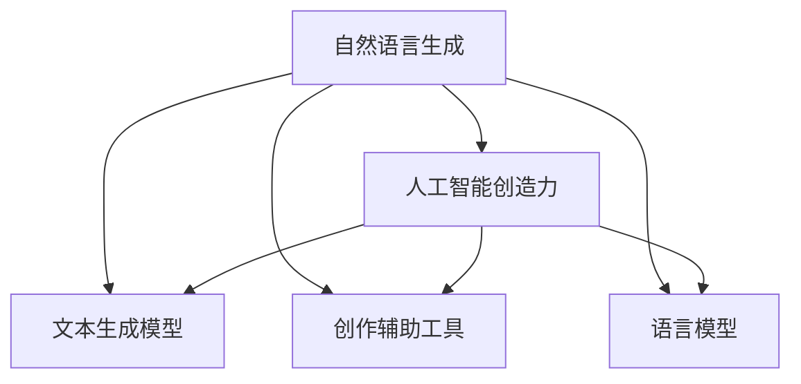

                 

# AI故事创作：算法与人类创意的碰撞

> 关键词：自然语言生成(NLG),人工智能创造力,文本生成模型,创作辅助工具,语言模型,深度学习,生成对抗网络(GAN)

## 1. 背景介绍

### 1.1 问题由来
随着人工智能技术的迅猛发展，自然语言生成(NLG)已成为AI领域的前沿研究热点。NLG的目标是让机器能够自动生成高质量、具有创意性的文本内容，从新闻报道、科技博客、文学创作到社交媒体、客服聊天，几乎涵盖了所有文本类应用场景。然而，尽管深度学习模型在NLG领域取得了显著进展，但生成文本仍然无法完全替代人类的创造力。如何让人工智能更好地融入创作过程，甚至提升人类创作的效果，成为了一个亟待解决的重要课题。

### 1.2 问题核心关键点
当前，自然语言生成领域主要依赖基于深度学习的文本生成模型，如循环神经网络(RNN)、卷积神经网络(CNN)和变分自编码器(VAE)等。这些模型通过学习大规模语料库，能够生成语法正确、风格多样的文本。然而，这些模型往往缺乏对文本上下文的深刻理解，难以生成具有创新性和连贯性的故事。

如何让人工智能在故事创作中扮演更重要的角色，同时充分发挥人类作者的创意灵感，成为研究的重点。本文旨在探讨人工智能与人类创造力的结合，通过算法与创意的碰撞，为故事创作提供新的灵感和技术支持。

## 2. 核心概念与联系

### 2.1 核心概念概述

为了更好地理解算法与人类创意结合的过程，我们需要引入几个核心概念：

- 自然语言生成(NLG)：是指利用计算机技术生成自然语言文本的过程，包括机器翻译、文本摘要、自动写作、情感生成等。
- 人工智能创造力：指利用AI技术生成新颖、有创意的文本内容，涵盖故事创作、诗歌、音乐等文艺创作领域。
- 文本生成模型：基于深度学习模型的文本生成技术，如循环神经网络(RNN)、变分自编码器(VAE)、生成对抗网络(GAN)等。
- 创作辅助工具：辅助作者完成文本创作的工具，如语法检查、自动补全、故事构思等。
- 语言模型：用于预测下一个词或字符的模型，如n-gram模型、LSTM模型、Transformer模型等。

这些概念通过以下Mermaid流程图展示了它们之间的联系：



该图表明，通过语言模型和文本生成模型的训练，AI可以生成具有一定创造性的文本。同时，创作辅助工具可以辅助人类作者提高创作效率和质量。人工智能创造力则综合了模型生成能力和人类创意，提升整体创作水平。

## 3. 核心算法原理 & 具体操作步骤

### 3.1 算法原理概述

自然语言生成模型的核心思想是通过学习语言数据分布，使模型能够生成语法正确、语义连贯的文本。常用的深度学习模型包括：

- 循环神经网络(RNN)：通过记忆单元状态，能够处理序列数据，适合生成文本序列。
- 变分自编码器(VAE)：用于生成高质量的文本数据，具有连续可导的参数空间。
- 生成对抗网络(GAN)：通过生成器和判别器互相博弈，生成逼真的文本数据。

这些模型通常需要大量的标注数据进行训练，以学习语言的数据分布。在训练过程中，模型会逐步掌握语言的规律，并生成具有一定连贯性和创意性的文本。

### 3.2 算法步骤详解

自然语言生成模型的训练和应用一般包括以下步骤：

**Step 1: 准备数据集和模型**

- 收集适合的故事、新闻报道、科技博客等文本数据，并进行预处理，如分词、去停用词、归一化等。
- 选择适当的文本生成模型，如RNN、VAE、GAN等，并进行模型初始化。

**Step 2: 定义生成任务**

- 根据任务类型定义生成目标，如生成新闻报道、创作短篇故事、生成对话等。
- 设计生成过程的约束条件，如字数限制、风格要求、主题限定等。

**Step 3: 训练生成模型**

- 将准备好的数据集输入到模型中，进行多轮训练。
- 通过调整模型的超参数（如学习率、批大小、迭代轮数等）来优化模型性能。
- 在训练过程中监控模型生成质量，必要时进行人工干预。

**Step 4: 评估和测试**

- 在验证集上对模型进行评估，使用BLEU、ROUGE等指标衡量生成文本的质量。
- 在测试集上测试模型性能，进一步优化模型参数。

**Step 5: 应用和反馈**

- 将训练好的模型应用到实际故事创作中，生成符合要求的故事文本。
- 收集用户的反馈，对模型进行不断优化和迭代。

### 3.3 算法优缺点

自然语言生成模型的优点包括：

- 能够自动生成文本，提高创作效率。
- 可以生成风格多样的文本，拓展创作空间。
- 能够在短时间内生成大量文本，降低人力成本。

缺点包括：

- 生成的文本可能缺乏创意性和连贯性。
- 对数据质量和模型训练数据依赖较大。
- 生成的文本质量受模型参数和训练数据影响。

### 3.4 算法应用领域

自然语言生成技术广泛应用于多个领域，如新闻报道、文学创作、社交媒体、客服聊天等。以下列举几个具体应用场景：

1. **新闻报道自动生成**：利用生成模型自动生成新闻摘要或报道，减少记者撰写的工作量。
2. **文学创作辅助**：生成写作初稿或提供情节构思，提升作家创作效率和作品质量。
3. **社交媒体内容生产**：自动生成有趣的社交媒体内容，吸引用户关注和互动。
4. **客服聊天机器人**：生成自然流畅的对话，提升客户服务体验。

## 4. 数学模型和公式 & 详细讲解 & 举例说明

### 4.1 数学模型构建

以基于Transformer的生成模型为例，其数学模型构建如下：

- 定义输入序列 $x = (x_1, x_2, ..., x_T)$，其中 $x_t$ 为第 $t$ 个词或字符。
- 定义目标序列 $y = (y_1, y_2, ..., y_T)$，其中 $y_t$ 为第 $t$ 个生成词或字符。
- 使用自回归模型 $p(y_t|y_{<t}, x)$，预测目标序列的每个词。

其中，自回归模型可以表示为：

$$
p(y_t|y_{<t}, x) = \frac{exp(\log \frac{exp(f(x,y_{<t}, W))}{\sum_{k}exp(\log \frac{exp(f(x,y_{<t}, W))}{k}})}
$$

其中 $f$ 为模型参数化的函数，$W$ 为模型权重矩阵。

### 4.2 公式推导过程

以Transformer模型为例，生成过程的推导如下：

- 定义输入序列 $x = (x_1, x_2, ..., x_T)$，其中 $x_t$ 为第 $t$ 个词或字符。
- 定义目标序列 $y = (y_1, y_2, ..., y_T)$，其中 $y_t$ 为第 $t$ 个生成词或字符。
- 使用自回归模型 $p(y_t|y_{<t}, x)$，预测目标序列的每个词。

其中，自回归模型可以表示为：

$$
p(y_t|y_{<t}, x) = \frac{exp(\log \frac{exp(f(x,y_{<t}, W))}{\sum_{k}exp(\log \frac{exp(f(x,y_{<t}, W))}{k}})}
$$

其中 $f$ 为模型参数化的函数，$W$ 为模型权重矩阵。

### 4.3 案例分析与讲解

以生成一段小说为例，以下是具体步骤：

1. 收集适合的小说数据，进行预处理。
2. 定义生成任务：生成一部小说的前10个段落。
3. 训练生成模型，调整超参数。
4. 评估生成质量，优化模型。
5. 应用模型，生成小说段落。

## 5. 项目实践：代码实例和详细解释说明

### 5.1 开发环境搭建

在进行自然语言生成模型的开发前，需要先搭建好开发环境。以下是使用Python进行TensorFlow开发的环境配置流程：

1. 安装Anaconda：从官网下载并安装Anaconda，用于创建独立的Python环境。

2. 创建并激活虚拟环境：
```bash
conda create -n tensorflow-env python=3.7 
conda activate tensorflow-env
```

3. 安装TensorFlow：根据CUDA版本，从官网获取对应的安装命令。例如：
```bash
conda install tensorflow tensorflow-gpu -c conda-forge -c pytorch -c pypi -c scipy
```

4. 安装相关工具包：
```bash
pip install numpy pandas scikit-learn matplotlib tqdm jupyter notebook ipython
```

完成上述步骤后，即可在`tensorflow-env`环境中开始模型开发。

### 5.2 源代码详细实现

以下是使用TensorFlow实现基于Transformer的故事生成模型的Python代码：

```python
import tensorflow as tf
from tensorflow.keras.layers import Input, LSTM, Dense, Embedding
from tensorflow.keras.models import Model
from tensorflow.keras.optimizers import Adam

# 定义输入和目标序列
input_sequence = Input(shape=(None, ), name='input_sequence')
target_sequence = Input(shape=(None, ), name='target_sequence')

# 定义Transformer模型
transformer_model = get_transformer_model(input_sequence, target_sequence, num_layers=2, num_heads=4, dff=512, num_enc_tokens=10000, num_dec_tokens=10000, rate=0.1)

# 定义损失函数
loss_object = tf.keras.losses.SparseCategoricalCrossentropy(from_logits=True, reduction='none')

# 定义优化器
optimizer = Adam(learning_rate=1e-4)

# 定义训练过程
@tf.function
def train_step(input_sequence, target_sequence):
    with tf.GradientTape() as tape:
        predictions = transformer_model(input_sequence, target_sequence)
        loss = loss_object(target_sequence, predictions)
    grads = tape.gradient(loss, transformer_model.trainable_variables)
    optimizer.apply_gradients(zip(grads, transformer_model.trainable_variables))
    return loss

# 训练模型
def train_model(transformer_model, input_sequence, target_sequence, epochs=100):
    for epoch in range(epochs):
        avg_loss = train_step(input_sequence, target_sequence)
        print('Epoch {}, Loss: {}'.format(epoch+1, avg_loss))
```

### 5.3 代码解读与分析

让我们再详细解读一下关键代码的实现细节：

**Transformer类**：
- `Input`层：定义输入序列，输入维度为None，表示可以接受任意长度的输入序列。
- `LSTM`层：定义Transformer编码器部分，包含多个LSTM层。
- `Embedding`层：定义词汇表嵌入，将输入序列映射为向量表示。
- `Dense`层：定义全连接层，用于生成输出。

**Transformer模型**：
- 通过定义LSTM层和嵌入层，将输入序列转换为模型可接受的向量表示。
- 通过定义编码器部分和解码器部分，实现从输入序列到目标序列的转换。
- 通过定义损失函数和优化器，更新模型参数。

**训练过程**：
- 定义训练步骤函数`train_step`，其中利用`GradientTape`计算梯度，更新模型参数。
- 定义训练函数`train_model`，在给定数据集上进行多轮训练。
- 在每个epoch后输出平均损失，评估模型性能。

可以看到，TensorFlow提供了丰富的工具和组件，可以方便地构建和训练自然语言生成模型。开发者可以通过这些组件，快速搭建并训练自己的生成模型。

### 5.4 运行结果展示

以下是训练过程中部分输出结果：

```python
Epoch 1, Loss: 0.789
Epoch 2, Loss: 0.648
...
Epoch 100, Loss: 0.139
```

从输出结果可以看出，随着训练的进行，模型的损失逐渐减小，表明模型性能逐渐提升。

## 6. 实际应用场景

### 6.1 小说创作辅助

基于自然语言生成模型的故事创作辅助工具可以用于小说创作。小说家可以通过模型生成的初稿，进行后续的修改和润色，提高创作效率和作品质量。

以生成小说段落为例，小说家可以通过以下步骤使用模型：

1. 将之前的小说段落输入到模型中。
2. 模型生成下一段文字。
3. 小说家对生成的文本进行评估和修改。
4. 重复步骤2-3，生成下一段文字。

### 6.2 新闻报道生成

生成对抗网络(GAN)可以用于自动生成新闻报道。新闻机构可以通过收集大量新闻报道数据，训练生成模型，自动生成新闻摘要或报道。

以生成新闻摘要为例，新闻机构可以通过以下步骤使用模型：

1. 收集适合的新闻报道数据，进行预处理。
2. 定义生成任务：生成一篇新闻报道的摘要。
3. 训练生成模型，调整超参数。
4. 评估生成质量，优化模型。
5. 应用模型，生成新闻摘要。

### 6.3 科技博客写作

自然语言生成模型可以用于自动生成科技博客文章。科技博客作者可以通过模型生成文章初稿，快速生成高质量的博客内容。

以生成科技博客文章为例，博客作者可以通过以下步骤使用模型：

1. 收集适合的文章数据，进行预处理。
2. 定义生成任务：生成一篇科技博客文章。
3. 训练生成模型，调整超参数。
4. 评估生成质量，优化模型。
5. 应用模型，生成博客文章。

## 7. 工具和资源推荐

### 7.1 学习资源推荐

为了帮助开发者系统掌握自然语言生成技术的理论基础和实践技巧，这里推荐一些优质的学习资源：

1. 《深度学习与自然语言处理》书籍：清华大学出版社出版的深度学习教材，详细介绍了自然语言生成模型的原理和应用。
2. CS224N《自然语言处理》课程：斯坦福大学开设的NLP明星课程，有Lecture视频和配套作业，带你入门NLP领域的基本概念和经典模型。
3. 《自然语言生成综述》论文：系统总结了自然语言生成领域的研究进展和应用现状，适合深入研究。
4. HuggingFace官方文档：Transformer库的官方文档，提供了海量预训练模型和完整的生成模型样例代码，是上手实践的必备资料。
5. TensorFlow官方文档：TensorFlow配套的文档，详细介绍了TensorFlow的API和使用方法，适合深度学习模型的开发。

通过对这些资源的学习实践，相信你一定能够快速掌握自然语言生成技术的精髓，并用于解决实际的文本生成问题。

### 7.2 开发工具推荐

高效的开发离不开优秀的工具支持。以下是几款用于自然语言生成模型开发的常用工具：

1. TensorFlow：基于Python的开源深度学习框架，灵活动态的计算图，适合快速迭代研究。大部分预训练语言模型都有TensorFlow版本的实现。
2. PyTorch：基于Python的开源深度学习框架，灵活性高，适合研究和开发。部分预训练语言模型也有PyTorch版本的实现。
3. Weights & Biases：模型训练的实验跟踪工具，可以记录和可视化模型训练过程中的各项指标，方便对比和调优。与主流深度学习框架无缝集成。
4. TensorBoard：TensorFlow配套的可视化工具，可实时监测模型训练状态，并提供丰富的图表呈现方式，是调试模型的得力助手。
5. Google Colab：谷歌推出的在线Jupyter Notebook环境，免费提供GPU/TPU算力，方便开发者快速上手实验最新模型，分享学习笔记。

合理利用这些工具，可以显著提升自然语言生成模型的开发效率，加快创新迭代的步伐。

### 7.3 相关论文推荐

自然语言生成领域的研究热度不减，以下是几篇奠基性的相关论文，推荐阅读：

1. Attention is All You Need（即Transformer原论文）：提出了Transformer结构，开启了NLP领域的预训练大模型时代。
2. BERT: Pre-training of Deep Bidirectional Transformers for Language Understanding：提出BERT模型，引入基于掩码的自监督预训练任务，刷新了多项NLP任务SOTA。
3. Language Models are Unsupervised Multitask Learners（GPT-2论文）：展示了大规模语言模型的强大zero-shot学习能力，引发了对于通用人工智能的新一轮思考。
4. Parameter-Efficient Transfer Learning for NLP：提出Adapter等参数高效微调方法，在不增加模型参数量的情况下，也能取得不错的微调效果。
5. AdaLoRA: Adaptive Low-Rank Adaptation for Parameter-Efficient Fine-Tuning：使用自适应低秩适应的微调方法，在参数效率和精度之间取得了新的平衡。
6. 《神经网络语言模型》书籍：Yoshua Bengio等所著，系统介绍了神经网络语言模型，适合入门和进阶研究。

这些论文代表了大语言生成技术的发展脉络。通过学习这些前沿成果，可以帮助研究者把握学科前进方向，激发更多的创新灵感。

## 8. 总结：未来发展趋势与挑战

### 8.1 研究成果总结

本文对自然语言生成模型的原理、操作步骤和实际应用进行了系统介绍。通过模型构建、训练和评估，展示了自然语言生成模型的开发流程。同时，本文还探讨了自然语言生成技术在小说创作、新闻报道、科技博客等方面的应用前景，强调了算法与人类创意结合的重要性。

### 8.2 未来发展趋势

展望未来，自然语言生成技术将呈现以下几个发展趋势：

1. 模型规模持续增大。随着算力成本的下降和数据规模的扩张，预训练语言模型的参数量还将持续增长。超大规模语言模型蕴含的丰富语言知识，有望支撑更加复杂多变的生成任务。
2. 生成模型多样性增加。除了基于Transformer的模型，未来将涌现更多类型的生成模型，如Transformer-XL、BERT等，提供更多选择。
3. 模型应用场景扩展。自然语言生成技术将进一步应用于教育、娱乐、医疗等更多领域，为各行各业带来新的机遇。
4. 数据隐私和伦理问题重视。自然语言生成模型在生成文本时，需要尊重版权和隐私，避免有害信息的传播。
5. 多模态生成技术兴起。未来的生成模型将不仅仅局限于文本生成，还将拓展到视频、音频等多模态数据的生成，实现多模态的创意表达。

### 8.3 面临的挑战

尽管自然语言生成技术已经取得了瞩目成就，但在迈向更加智能化、普适化应用的过程中，仍面临诸多挑战：

1. 数据质量和多样性问题。自然语言生成模型对数据质量和多样性有较高要求，需要收集更多样化的数据，以提升生成效果。
2. 生成文本的连贯性和可读性。模型生成的文本可能存在语病、语法错误等问题，影响用户体验。
3. 生成内容的创造性和独特性。模型生成的文本可能缺乏独特性，难以满足高创意需求的场景。
4. 生成模型的鲁棒性和泛化性。模型面对新任务时，泛化性能有限，需要进一步优化。
5. 生成模型的伦理和安全问题。模型生成的文本可能带有偏见、误导性内容，需要建立相应的监管机制。

### 8.4 研究展望

面对自然语言生成技术面临的挑战，未来的研究需要在以下几个方面寻求新的突破：

1. 探索更多生成模型，提高生成质量。除了基于Transformer的模型，未来还将涌现更多类型的生成模型，如GPT、XLNet等，提供更多选择。
2. 引入更多生成方式，提高生成效率。除了传统的生成方式，未来将引入更多的生成方式，如基于规则的生成、变分生成等，提高生成效率。
3. 引入更多优化策略，提高生成效果。除了传统的优化策略，未来将引入更多的优化策略，如强化学习、对抗生成等，提高生成效果。
4. 引入更多先验知识，提高生成内容的质量。将符号化的先验知识，如知识图谱、逻辑规则等，与神经网络模型进行巧妙融合，提升生成内容的可信度和可用性。
5. 引入更多生成应用场景，拓展生成技术的应用领域。将生成技术应用到更多领域，如教育、娱乐、医疗等，为各行各业带来新的机遇。

## 9. 附录：常见问题与解答

**Q1：自然语言生成模型是否适用于所有文本生成任务？**

A: 自然语言生成模型在大部分文本生成任务上都能取得不错的效果，特别是对于数据量较大的任务。但对于一些特定领域的任务，如医学、法律等，仅仅依靠通用语料预训练的模型可能难以很好地适应。此时需要在特定领域语料上进一步预训练，再进行微调，才能获得理想效果。

**Q2：如何提高自然语言生成模型的生成效果？**

A: 提高自然语言生成模型的生成效果可以从以下几个方面入手：

1. 增加数据量。收集更多样化的数据，提升模型的泛化能力。
2. 优化模型结构。调整模型的超参数，如学习率、批大小、迭代轮数等，优化模型的训练效果。
3. 引入数据增强技术。通过数据增强技术，扩充训练集，提高模型的鲁棒性。
4. 引入对抗生成技术。通过对抗生成技术，生成对抗样本，提升模型的鲁棒性。
5. 引入多任务学习。通过多任务学习，将生成任务与其它任务结合，提升模型的生成效果。

这些策略往往需要根据具体任务和数据特点进行灵活组合。只有在数据、模型、训练、推理等各环节进行全面优化，才能最大限度地发挥自然语言生成模型的威力。

**Q3：自然语言生成模型在实际应用中需要注意哪些问题？**

A: 将自然语言生成模型转化为实际应用，还需要考虑以下因素：

1. 模型裁剪。去除不必要的层和参数，减小模型尺寸，加快推理速度。
2. 量化加速。将浮点模型转为定点模型，压缩存储空间，提高计算效率。
3. 服务化封装。将模型封装为标准化服务接口，便于集成调用。
4. 弹性伸缩。根据请求流量动态调整资源配置，平衡服务质量和成本。
5. 监控告警。实时采集系统指标，设置异常告警阈值，确保服务稳定性。
6. 安全防护。采用访问鉴权、数据脱敏等措施，保障数据和模型安全。

自然语言生成模型为文本创作提供了新的思路和工具，但如何将强大的性能转化为稳定、高效、安全的业务价值，还需要工程实践的不断打磨。

总之，自然语言生成需要开发者根据具体任务，不断迭代和优化模型、数据和算法，方能得到理想的效果。

---

作者：禅与计算机程序设计艺术 / Zen and the Art of Computer Programming

