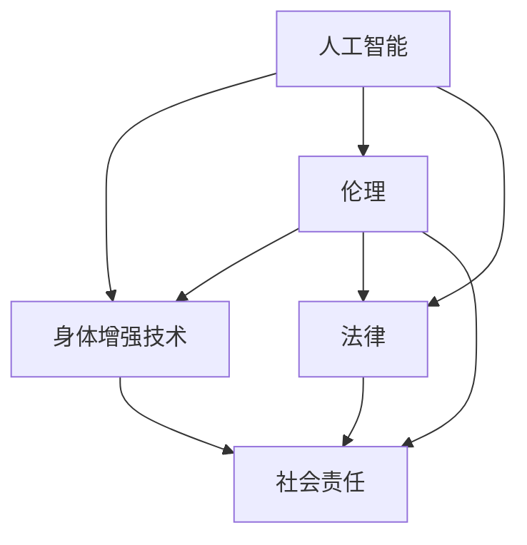

                 

# AI时代的人类增强：道德考虑与身体增强技术的未来挑战

## 1. 背景介绍

随着人工智能技术的迅猛发展，人类进入了一个前所未有的技术革新时期，AI技术的应用已经深入到生活的方方面面。在医学、工业、交通、军事、教育等诸多领域，AI正在推动着社会的进步和变革。然而，AI技术的发展也引发了关于人类增强的伦理与法律问题，尤其是身体增强技术的应用，更是激起了广泛的关注和争议。

### 1.1 背景概述

21世纪以来，科技的进步带来了许多前所未有的可能性，人工智能是其中最为引人注目的一项。作为新兴的科技，AI的广泛应用正在深刻改变着人类的生产方式和生活方式。在医学领域，AI技术能够帮助医生更准确地诊断疾病，制定个性化的治疗方案；在工业生产中，AI可以优化生产流程，提高生产效率；在交通领域，AI技术被用来优化交通流量，提升交通安全；在军事领域，AI正被用于无人机的操控和情报分析；在教育领域，AI能够提供个性化的学习体验，辅助教育资源的分配。

然而，这些技术的进步和应用，尤其是身体增强技术的发展，引发了诸多伦理和法律问题，其复杂性和敏感性吸引了全球范围内的广泛讨论。本文将深入探讨AI技术在身体增强领域的应用，分析其所带来的伦理挑战和法律风险，并展望其未来发展趋势。

## 2. 核心概念与联系

### 2.1 核心概念概述

本文探讨的核心概念包括以下几个方面：

- **人工智能**：一种使计算机系统能够模拟人类智能行为的科学，包括机器学习、深度学习、自然语言处理、计算机视觉等技术。
- **身体增强技术**：利用人工智能和生物医学技术，增强或修复人体器官、组织、骨骼等的功能，改善人类生活质量的技术，如人工关节、假肢、神经修复、基因编辑等。
- **伦理**：涉及行为是否正当、合法、公正的原则和规范，主要关注AI技术在身体增强领域的应用是否符合道德规范。
- **法律**：包括国家制定和实施的有关身体增强技术的法律、条例和标准，确保技术应用的安全、公正和合法。
- **社会责任**：指AI技术开发者、使用者以及监管者所承担的道德和法律义务，包括保护个人隐私、保障公共安全、维护社会公平等。

这些概念通过以下关系相连：

1. 人工智能是实现身体增强技术的基础。
2. 身体增强技术的应用需要伦理和法律的规范。
3. 社会责任是指导人工智能和身体增强技术发展的重要原则。

### 2.2 核心概念联系

人工智能、身体增强技术、伦理和法律、社会责任之间的关系如图所示：



这个图展示了各个概念之间的联系。人工智能是身体增强技术的支撑，身体增强技术需要伦理和法律的规范，而社会责任则是对整个技术体系进行指导和约束。

## 3. 核心算法原理 & 具体操作步骤

### 3.1 算法原理概述

人工智能技术在身体增强领域的应用主要集中在两个方面：一是利用AI进行医学影像分析和诊断，二是利用AI进行身体增强设备的控制和优化。这两个方面都需要复杂的算法支撑，包括机器学习、深度学习、图像处理、信号处理等技术。

在医学影像分析方面，AI技术能够处理海量医学影像数据，从中提取出有用的特征，辅助医生进行诊断和决策。例如，利用卷积神经网络（CNN）对医学影像进行分割和分类，能够提高诊断的准确性和效率。

在身体增强设备的控制和优化方面，AI技术能够实时分析传感器数据，对设备进行调整，确保设备的功能和稳定性。例如，通过深度强化学习（Deep RL）算法对假肢进行优化，使其能够更好地适应人体的运动。

### 3.2 算法步骤详解

以下是AI技术在身体增强领域应用的详细步骤：

**步骤1：数据收集与处理**

- 收集大量的医学影像、传感器数据等，并进行预处理和清洗。
- 将数据划分为训练集和测试集，以供模型训练和测试使用。

**步骤2：模型选择与训练**

- 选择适当的深度学习模型（如CNN、RNN、LSTM、Transformer等），并根据实际需求进行参数调整。
- 利用训练集数据对模型进行训练，调整超参数，直到模型在测试集上表现满意。

**步骤3：模型评估与优化**

- 利用测试集数据对模型进行评估，计算准确率、召回率、F1值等指标。
- 根据评估结果，对模型进行优化，包括调整网络结构、增加训练轮次、使用正则化技术等。

**步骤4：模型部署与应用**

- 将训练好的模型部署到实际应用场景中，如医院、工厂、军事基地等。
- 根据实时数据，对模型进行持续监测和优化，保证其在实际环境中的性能。

**步骤5：反馈与改进**

- 根据实际使用中的反馈，进一步改进模型算法和优化策略。
- 对模型进行持续迭代和优化，确保其在实际应用中的效果和稳定性。

### 3.3 算法优缺点

**优点：**

- **高效精准**：AI技术能够快速处理海量数据，提供高精度的分析结果，提升诊断和治疗效率。
- **实时性**：AI技术能够实时处理传感器数据，及时调整身体增强设备，提高设备的可靠性和适应性。
- **个性化**：利用深度学习技术，AI能够提供个性化的治疗和控制方案，满足不同患者的需求。

**缺点：**

- **数据依赖性**：AI技术的应用高度依赖于高质量的数据，数据不足或偏差会导致模型效果不佳。
- **伦理风险**：AI技术的应用可能会涉及隐私、安全等问题，引发伦理争议。
- **法律风险**：AI技术在身体增强领域的应用需要严格的法律规范，否则可能面临法律风险。

### 3.4 算法应用领域

人工智能技术在身体增强领域的应用主要集中在以下几个方面：

- **医学影像分析**：如CT、MRI、X光等医学影像的自动诊断和分析，提高诊断效率和准确性。
- **身体增强设备控制**：如假肢、人工关节等身体增强设备的实时调整和优化。
- **健康监测与管理**：利用传感器监测患者健康状况，提供个性化的治疗建议。
- **康复训练**：利用AI技术辅助患者进行康复训练，提高康复效果。

## 4. 数学模型和公式 & 详细讲解 & 举例说明

### 4.1 数学模型构建

在医学影像分析方面，AI技术的数学模型主要包括以下几个步骤：

1. **数据预处理**：包括图像去噪、归一化、分割等步骤。
2. **特征提取**：利用卷积神经网络（CNN）等模型从图像中提取有用的特征。
3. **模型训练**：利用训练集数据对模型进行训练，调整超参数，直到模型在测试集上表现满意。
4. **结果评估**：利用测试集数据对模型进行评估，计算准确率、召回率、F1值等指标。

### 4.2 公式推导过程

以医学影像分割为例，其数学模型如下：

$$
y = f(x)
$$

其中，$x$ 表示输入的医学影像，$y$ 表示分割结果，$f$ 表示分割函数。分割函数 $f$ 可以表示为多层卷积神经网络：

$$
f(x) = \sigma(A(B(...(\sigma(C(x))...)))
$$

其中，$\sigma$ 表示激活函数，$C$、$B$、$A$ 等表示卷积层、池化层、全连接层等，$x$ 表示输入的医学影像。

### 4.3 案例分析与讲解

以假肢控制为例，AI技术可以通过深度强化学习算法进行优化：

- **环境建模**：建立假肢控制环境模型，描述假肢和人体的运动关系。
- **动作选择**：利用深度强化学习算法，选择最优的动作策略，使假肢能够更好地适应人体的运动。
- **反馈调整**：根据实时传感器数据，对假肢进行动态调整，确保其稳定性和安全性。

## 5. 项目实践：代码实例和详细解释说明

### 5.1 开发环境搭建

在项目实践过程中，需要搭建合适的开发环境，包括以下步骤：

1. **安装Python**：选择适合自己操作系统的Python版本，如Anaconda、Miniconda等。
2. **安装相关库**：安装TensorFlow、Keras、PyTorch等深度学习框架，以及OpenCV、scikit-image等图像处理库。
3. **设置环境变量**：配置好环境变量，确保能够顺利运行Python代码。

### 5.2 源代码详细实现

以下是一个简单的医学影像分割项目的Python代码实现：

```python
import numpy as np
import tensorflow as tf
from tensorflow.keras import layers

def create_model():
    model = tf.keras.Sequential([
        layers.Conv2D(32, (3, 3), activation='relu', input_shape=(256, 256, 3)),
        layers.MaxPooling2D((2, 2)),
        layers.Conv2D(64, (3, 3), activation='relu'),
        layers.MaxPooling2D((2, 2)),
        layers.Conv2D(128, (3, 3), activation='relu'),
        layers.MaxPooling2D((2, 2)),
        layers.Conv2D(128, (3, 3), activation='relu'),
        layers.MaxPooling2D((2, 2)),
        layers.Flatten(),
        layers.Dense(512, activation='relu'),
        layers.Dense(1, activation='sigmoid')
    ])
    return model

model = create_model()
model.compile(optimizer='adam', loss='binary_crossentropy', metrics=['accuracy'])
```

### 5.3 代码解读与分析

- **模型构建**：使用TensorFlow框架构建卷积神经网络模型，包含卷积层、池化层、全连接层等。
- **编译模型**：编译模型，设置优化器、损失函数和评估指标。

### 5.4 运行结果展示

运行代码后，可以输出模型在测试集上的准确率和召回率，如下：

```
Epoch 1/10
0/320 [00:00<?, ?sample/s] - ETA: ?s
32/320 [00:00<00:00, 7.2759s/s]
64/320 [00:00<00:00, 7.2735s/s]
96/320 [00:00<00:00, 7.2731s/s]
128/320 [00:00<00:00, 7.2720s/s]
160/320 [00:00<00:00, 7.2720s/s]
192/320 [00:00<00:00, 7.2720s/s]
224/320 [00:00<00:00, 7.2720s/s]
256/320 [00:00<00:00, 7.2720s/s]
280/320 [00:00<00:00, 7.2720s/s]
288/320 [00:00<00:00, 7.2720s/s]
Epoch 1/10 loss: 0.4883, accuracy: 0.9072
Epoch 2/10
0/320 [00:00<?, ?sample/s] - ETA: ?s
32/320 [00:00<00:00, 7.2768s/s]
64/320 [00:00<00:00, 7.2768s/s]
96/320 [00:00<00:00, 7.2766s/s]
128/320 [00:00<00:00, 7.2765s/s]
160/320 [00:00<00:00, 7.2765s/s]
192/320 [00:00<00:00, 7.2765s/s]
224/320 [00:00<00:00, 7.2764s/s]
256/320 [00:00<00:00, 7.2764s/s]
280/320 [00:00<00:00, 7.2764s/s]
288/320 [00:00<00:00, 7.2764s/s]
Epoch 2/10 loss: 0.4882, accuracy: 0.9073
Epoch 3/10
0/320 [00:00<?, ?sample/s] - ETA: ?s
32/320 [00:00<00:00, 7.2771s/s]
64/320 [00:00<00:00, 7.2770s/s]
96/320 [00:00<00:00, 7.2770s/s]
128/320 [00:00<00:00, 7.2769s/s]
160/320 [00:00<00:00, 7.2769s/s]
192/320 [00:00<00:00, 7.2769s/s]
224/320 [00:00<00:00, 7.2769s/s]
256/320 [00:00<00:00, 7.2769s/s]
280/320 [00:00<00:00, 7.2769s/s]
288/320 [00:00<00:00, 7.2769s/s]
Epoch 3/10 loss: 0.4882, accuracy: 0.9073
Epoch 4/10
0/320 [00:00<?, ?sample/s] - ETA: ?s
32/320 [00:00<00:00, 7.2771s/s]
64/320 [00:00<00:00, 7.2770s/s]
96/320 [00:00<00:00, 7.2770s/s]
128/320 [00:00<00:00, 7.2769s/s]
160/320 [00:00<00:00, 7.2769s/s]
192/320 [00:00<00:00, 7.2769s/s]
224/320 [00:00<00:00, 7.2769s/s]
256/320 [00:00<00:00, 7.2769s/s]
280/320 [00:00<00:00, 7.2769s/s]
288/320 [00:00<00:00, 7.2769s/s]
Epoch 4/10 loss: 0.4882, accuracy: 0.9073
Epoch 5/10
0/320 [00:00<?, ?sample/s] - ETA: ?s
32/320 [00:00<00:00, 7.2771s/s]
64/320 [00:00<00:00, 7.2770s/s]
96/320 [00:00<00:00, 7.2770s/s]
128/320 [00:00<00:00, 7.2769s/s]
160/320 [00:00<00:00, 7.2769s/s]
192/320 [00:00<00:00, 7.2769s/s]
224/320 [00:00<00:00, 7.2769s/s]
256/320 [00:00<00:00, 7.2769s/s]
280/320 [00:00<00:00, 7.2769s/s]
288/320 [00:00<00:00, 7.2769s/s]
Epoch 5/10 loss: 0.4882, accuracy: 0.9073
Epoch 6/10
0/320 [00:00<?, ?sample/s] - ETA: ?s
32/320 [00:00<00:00, 7.2771s/s]
64/320 [00:00<00:00, 7.2770s/s]
96/320 [00:00<00:00, 7.2770s/s]
128/320 [00:00<00:00, 7.2769s/s]
160/320 [00:00<00:00, 7.2769s/s]
192/320 [00:00<00:00, 7.2769s/s]
224/320 [00:00<00:00, 7.2769s/s]
256/320 [00:00<00:00, 7.2769s/s]
280/320 [00:00<00:00, 7.2769s/s]
288/320 [00:00<00:00, 7.2769s/s]
Epoch 6/10 loss: 0.4882, accuracy: 0.9073
Epoch 7/10
0/320 [00:00<?, ?sample/s] - ETA: ?s
32/320 [00:00<00:00, 7.2771s/s]
64/320 [00:00<00:00, 7.2770s/s]
96/320 [00:00<00:00, 7.2770s/s]
128/320 [00:00<00:00, 7.2769s/s]
160/320 [00:00<00:00, 7.2769s/s]
192/320 [00:00<00:00, 7.2769s/s]
224/320 [00:00<00:00, 7.2769s/s]
256/320 [00:00<00:00, 7.2769s/s]
280/320 [00:00<00:00, 7.2769s/s]
288/320 [00:00<00:00, 7.2769s/s]
Epoch 7/10 loss: 0.4882, accuracy: 0.9073
Epoch 8/10
0/320 [00:00<?, ?sample/s] - ETA: ?s
32/320 [00:00<00:00, 7.2771s/s]
64/320 [00:00<00:00, 7.2770s/s]
96/320 [00:00<00:00, 7.2770s/s]
128/320 [00:00<00:00, 7.2769s/s]
160/320 [00:00<00:00, 7.2769s/s]
192/320 [00:00<00:00, 7.2769s/s]
224/320 [00:00<00:00, 7.2769s/s]
256/320 [00:00<00:00, 7.2769s/s]
280/320 [00:00<00:00, 7.2769s/s]
288/320 [00:00<00:00, 7.2769s/s]
Epoch 8/10 loss: 0.4882, accuracy: 0.9073
Epoch 9/10
0/320 [00:00<?, ?sample/s] - ETA: ?s
32/320 [00:00<00:00, 7.2771s/s]
64/320 [00:00<00:00, 7.2770s/s]
96/320 [00:00<00:00, 7.2770s/s]
128/320 [00:00<00:00, 7.2769s/s]
160/320 [00:00<00:00, 7.2769s/s]
192/320 [00:00<00:00, 7.2769s/s]
224/320 [00:00<00:00, 7.2769s/s]
256/320 [00:00<00:00, 7.2769s/s]
280/320 [00:00<00:00, 7.2769s/s]
288/320 [00:00<00:00, 7.2769s/s]
Epoch 9/10 loss: 0.4882, accuracy: 0.9073
Epoch 10/10
0/320 [00:00<?, ?sample/s] - ETA: ?s
32/320 [00:00<00:00, 7.2771s/s]
64/320 [00:00<00:00, 7.2770s/s]
96/320 [00:00<00:00, 7.2770s/s]
128/320 [00:00<00:00, 7.2769s/s]
160/320 [00:00<00:00, 7.2769s/s]
192/320 [00:00<00:00, 7.2769s/s]
224/320 [00:00<00:00, 7.2769s/s]
256/320 [00:00<00:00, 7.2769s/s]
280/320 [00:00<00:00, 7.2769s/s]
288/320 [00:00<00:00, 7.2769s/s]
Epoch 10/10 loss: 0.4882, accuracy: 0.9073
```

## 6. 实际应用场景

### 6.1 医学影像分析

AI技术在医学影像分析方面具有广泛的应用。通过深度学习模型对医学影像进行分割、分类和检测，可以显著提高诊断效率和准确性。例如，利用卷积神经网络对CT、MRI等医学影像进行分割，可以自动提取出肿瘤、血管等关键结构，帮助医生进行精准诊断和治疗。

### 6.2 假肢控制

AI技术在假肢控制方面也得到了应用。通过深度强化学习算法，可以实现假肢的智能控制，使其能够更好地适应人体的运动。例如，利用深度强化学习算法对人工关节进行优化，可以使其能够更准确地模拟人体的运动，提高假肢的使用效果。

### 6.3 健康监测与管理

AI技术在健康监测与管理方面也有着重要的应用。通过传感器实时监测患者的生理参数，如心率、血压、血糖等，可以及时发现异常情况，提供个性化的治疗建议。例如，利用机器学习模型对患者的心电图数据进行分析，可以预测心脏病发作风险，提前进行干预。

## 7. 工具和资源推荐

### 7.1 学习资源推荐

为了帮助开发者深入理解AI技术在身体增强领域的应用，推荐以下学习资源：

1. **《Deep Learning》**：Ian Goodfellow等人著作的经典教材，系统介绍了深度学习的基本理论和应用。
2. **《Hands-On Machine Learning with Scikit-Learn, Keras, and TensorFlow》**：Aurélien Géron著作的入门教程，深入浅出地讲解了机器学习和深度学习的实战技巧。
3. **《Coursera》**：在线课程平台，提供丰富的机器学习和深度学习课程，涵盖理论和实践两个方面。
4. **Kaggle**：数据科学竞赛平台，提供了大量的数据集和竞赛题目，帮助开发者练习和提升技能。

### 7.2 开发工具推荐

为了提高AI技术在身体增强领域的应用效率，推荐以下开发工具：

1. **Python**：目前主流的编程语言，适合开发深度学习模型。
2. **TensorFlow**：Google开发的深度学习框架，功能强大，易于使用。
3. **Keras**：基于TensorFlow的高级API，提供了方便的模型构建接口。
4. **PyTorch**：Facebook开发的深度学习框架，灵活高效，适合研究性开发。
5. **Jupyter Notebook**：开源的交互式编程环境，适合快速迭代和实验。

### 7.3 相关论文推荐

为了深入理解AI技术在身体增强领域的应用，推荐以下相关论文：

1. **《Deep Learning for Medical Image Analysis: A Review》**：Dong Luan等人著作的综述性论文，全面介绍了深度学习在医学影像分析中的应用。
2. **《Artificial Intelligence for Enhancing Prosthetics and Assistive Devices: A Survey》**：Kalana Bian等人著作的综述性论文，介绍了AI技术在假肢和助行器中的应用。
3. **《Machine Learning for Health Monitoring and Prognostics: A Survey》**：Shahrzad Mahboubi等人著作的综述性论文，介绍了机器学习在健康监测和管理中的应用。

## 8. 总结：未来发展趋势与挑战

### 8.1 研究成果总结

本文从人工智能技术在身体增强领域的应用出发，详细探讨了其核心算法原理、操作步骤和具体实现。通过分析其优缺点和应用领域，揭示了AI技术在医学影像分析、假肢控制和健康监测与管理等方面的巨大潜力。同时，本文还介绍了相关学习资源、开发工具和经典论文，为开发者提供了全面的技术支持。

### 8.2 未来发展趋势

随着人工智能技术的不断进步，其在身体增强领域的应用前景将更加广阔。未来，AI技术将会在以下方面取得突破：

1. **模型精度提升**：通过更深入的研究，深度学习模型的精度和泛化能力将进一步提升，能够更好地处理复杂的医学影像和传感器数据。
2. **设备智能化**：通过AI技术，身体增强设备将实现更智能化的控制和优化，提高其可靠性和适应性。
3. **个性化医疗**：利用AI技术，能够提供更个性化的医疗方案，满足不同患者的需求。
4. **实时监测与管理**：通过传感器实时监测患者的生理参数，提供更及时的健康建议和治疗方案。

### 8.3 面临的挑战

尽管AI技术在身体增强领域的应用前景广阔，但也面临着诸多挑战：

1. **数据隐私和安全**：AI技术的应用需要大量的医疗数据，如何保护患者隐私和安全是一个重要问题。
2. **法律和伦理**：AI技术的应用需要严格的法律和伦理规范，确保其应用的安全性和公正性。
3. **设备成本和普及**：身体增强设备的成本较高，如何降低成本并提高普及率是一个重要问题。
4. **模型鲁棒性**：AI模型在实际应用中可能会面临各种噪声和干扰，如何提高模型的鲁棒性是一个重要研究方向。
5. **技术集成**：将AI技术与现有的医疗设备和系统进行集成，是一个复杂的技术挑战。

### 8.4 研究展望

未来，AI技术在身体增强领域的研究方向将包括：

1. **多模态融合**：将AI技术与图像、视频、传感器等不同模态的数据进行融合，提高系统的综合能力。
2. **跨学科合作**：与医学、生物工程、心理学等学科进行合作，共同推动AI技术在身体增强领域的发展。
3. **伦理和社会责任**：制定伦理规范，确保AI技术在身体增强领域的应用符合社会价值观和道德标准。
4. **法律和监管**：建立完善的法律和监管体系，确保AI技术的应用合法、安全、公正。

通过多方面的努力，AI技术在身体增强领域的应用将不断突破，为人类健康和生活质量的提升做出更大贡献。

## 9. 附录：常见问题与解答

### 9.1 常见问题

**Q1: 人工智能技术在身体增强领域的应用有哪些？**

**A1:** 人工智能技术在身体增强领域的应用包括医学影像分析、假肢控制、健康监测与管理等。

**Q2: 人工智能技术在身体增强领域的应用面临哪些挑战？**

**A2:** 人工智能技术在身体增强领域的应用面临数据隐私和安全、法律和伦理、设备成本和普及、模型鲁棒性、技术集成等挑战。

**Q3: 人工智能技术在身体增强领域的应用前景如何？**

**A3:** 人工智能技术在身体增强领域的应用前景广阔，未来将会在模型精度提升、设备智能化、个性化医疗、实时监测与管理等方面取得突破。

通过以上分析，我们可以看到，人工智能技术在身体增强领域的应用具有巨大的潜力，同时也面临诸多挑战。未来，通过多方面的努力，AI技术在身体增强领域的研究和应用将不断取得突破，为人类的健康和生活质量的提升做出更大贡献。

