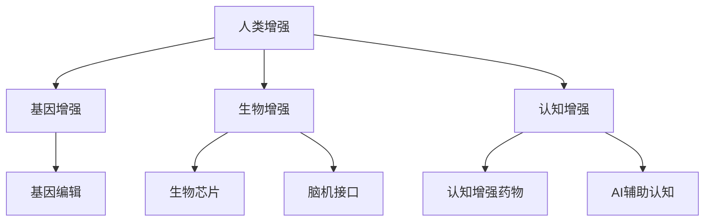

                 

## 1. 背景介绍

### 1.1 问题由来
随着人工智能(AI)技术的快速发展，AI时代正在迅速到来。在这一过程中，人类的增强变得前所未有的可能和必要。AI技术的普及带来了全新的医疗、教育、生活等各个领域的变革。但与此同时，它也引发了诸多道德和社会问题。

当前，随着生物技术、机器学习、纳米技术、神经科学等领域的飞速进步，从基因编辑、人机融合到认知增强，身体增强的技术正在逐步变成现实。然而，这些技术的广泛应用也引发了伦理、安全、隐私等诸多问题，引发社会广泛关注。

### 1.2 问题核心关键点
人类增强技术主要涵盖三个维度：基因增强、生物增强和认知增强。

1. **基因增强**：通过基因编辑技术（如CRISPR-Cas9）修正或添加基因，改善人类身体机能。
2. **生物增强**：通过植入生物芯片、增强肢体、脑机接口等方式，提升人类感知和运动能力。
3. **认知增强**：通过神经增强药物、AI辅助认知等手段，提升人类记忆、思维和情绪管理能力。

这些增强技术的应用，既有提升人类生活质量、推动社会进步的巨大潜力，也伴随着伦理、法律和安全等诸多风险。如何平衡技术进步与伦理道德，确保人体增强的安全和公正，成为当前社会面临的重要挑战。

### 1.3 问题研究意义
研究人类增强技术，对于推动AI时代的技术进步，促进社会健康发展，具有重要意义：

1. **提升生活质量**：通过身体和认知增强，改善人类的健康、学习和生活质量，使人们更适应现代社会的需求。
2. **促进医疗进步**：基因和生物增强技术为疾病治疗、器官移植等领域带来新希望。
3. **加速产业升级**：增强技术的应用能够带动相关产业的发展，提升社会整体竞争力。
4. **应对人口老龄化**：增强技术能够延长寿命，提高老龄人口的生活质量，缓解人口老龄化压力。
5. **推动社会进步**：增强技术有助于提升人的能力和潜力，推动社会向着更加公正、和谐的方向发展。

## 2. 核心概念与联系

### 2.1 核心概念概述

为更好地理解AI时代人类增强技术的道德考量，本节将介绍几个关键概念：

- **人类增强**：通过科技手段提升人类的身体和认知能力，包括基因增强、生物增强、认知增强等。
- **生物芯片**：植入人体以增强记忆、情感、感知等能力的小型生物电子设备。
- **脑机接口**：将人脑与计算机连接，实现人脑对计算机的直接控制和信息传递。
- **认知增强**：通过药物、训练、AI技术等手段提升人类的认知能力，包括记忆、注意力、决策等。
- **基因编辑**：通过CRISPR等技术修改人类基因，以治疗疾病、增强身体机能。
- **AI辅助**：利用人工智能技术，帮助人类处理复杂任务，提升效率。

这些核心概念之间存在紧密联系，共同构成了AI时代人类增强技术的核心框架。

### 2.2 核心概念原理和架构的 Mermaid 流程图



这个流程图展示了人类增强技术的主要组成部分及其相互关系：

1. **基因增强**：通过基因编辑技术改善人类身体机能。
2. **生物增强**：通过植入芯片、增强肢体等手段提升感知和运动能力。
3. **认知增强**：通过药物、训练和AI技术提升认知能力。
4. **基因编辑**：基因增强的基础技术。
5. **生物芯片**：生物增强的重要组成部分。
6. **脑机接口**：实现生物增强和认知增强的重要技术。
7. **认知增强药物**：直接提升认知能力的药物。
8. **AI辅助认知**：利用AI提升人类认知处理能力的工具。

这些核心概念共同构成了人类增强技术的全貌，涵盖了从基因层面到认知层面的全面提升。

## 3. 核心算法原理 & 具体操作步骤
### 3.1 算法原理概述

人类增强技术的算法原理主要基于生物、神经、基因等科学原理。核心算法包括：

- **基因编辑算法**：通过CRISPR-Cas9等技术，在基因层面对人体进行修改变异。
- **生物芯片算法**：通过设计微型电路和算法，实现植入芯片的智能控制和信息处理。
- **脑机接口算法**：通过解码人脑信号和神经信号，实现人脑与计算机的实时连接。
- **认知增强算法**：通过药物作用、AI辅助认知等手段，提升人类认知能力。

这些算法在不同维度上协同作用，共同提升人类的身体和认知能力。

### 3.2 算法步骤详解

人类增强技术的实现过程包括以下关键步骤：

**Step 1: 需求评估**
- 对用户需求进行详细评估，确定增强目标，如增强记忆、提升运动能力、改善认知等。
- 明确目标后，选择合适的技术路径，如基因编辑、生物芯片、脑机接口等。

**Step 2: 设计方案**
- 根据目标和技术路径，设计具体的增强方案，如选择基因编辑的具体基因、设计生物芯片的功能、确定脑机接口的连接方式等。
- 确定方案后，进行详细的技术实现和模拟验证。

**Step 3: 预临床实验**
- 在动物或细胞层面进行预实验，验证方案的安全性和有效性。
- 预实验结果验证后，逐步进行人体临床试验。

**Step 4: 临床试验**
- 选择适合的临床试验对象，进行小样本试点实验，验证方案的安全性和有效性。
- 试点实验结果验证后，进行大规模人体试验，收集数据和反馈。

**Step 5: 市场推广**
- 根据试验结果，优化和完善增强方案，进行市场推广和产业化落地。
- 进行效果评估和用户反馈，持续优化和改进技术方案。

### 3.3 算法优缺点

人类增强技术的算法具有以下优点：

1. **提升能力**：通过科学手段提升人类的身体和认知能力，改善生活质量。
2. **治疗疾病**：基因编辑技术可以治疗多种遗传疾病，延长寿命。
3. **推动产业发展**：带动相关产业的发展，如生物芯片、脑机接口等。
4. **应对老龄化**：增强技术可以延长寿命，提高老龄人口的生活质量。

同时，这些技术也存在一定的局限性：

1. **伦理争议**：增强技术可能引发伦理争议，如基因编辑可能导致的不公平。
2. **安全风险**：植入芯片、基因编辑等技术存在安全隐患，可能导致不可逆的损害。
3. **隐私问题**：生物芯片和脑机接口可能涉及大量个人隐私，引发隐私泄露问题。
4. **资源限制**：大规模推广增强技术需要大量的资源投入，包括资金、设备、人力等。
5. **社会公平**：增强技术可能加剧社会不平等，只有少数人能够享受到增强带来的好处。

### 3.4 算法应用领域

人类增强技术在多个领域已初步应用：

- **医疗**：基因编辑技术用于治疗遗传性疾病，脑机接口用于帮助病患恢复运动能力。
- **教育**：认知增强药物帮助学生提升记忆和学习能力，AI辅助教育提升教学效果。
- **娱乐**：生物芯片用于游戏玩家增强感知和反应能力，增强娱乐体验。
- **体育**：生物增强技术提升运动员的运动能力和表现。
- **军事**：增强士兵的认知和体能，提升战斗力和生存能力。

未来，随着技术的发展和应用的普及，增强技术将进一步扩展到更多领域，如公共安全、智能交通等。

## 4. 数学模型和公式 & 详细讲解 & 举例说明

### 4.1 数学模型构建

人类增强技术的数学模型主要基于生物和神经科学的理论。以下以基因编辑技术为例，展示其数学模型构建过程。

假设基因序列为 $G$，基因编辑的目标位点为 $T$。通过CRISPR-Cas9等技术，设计指导RNA(gRNA)和Cas9蛋白，指导Cas9切割目标基因。基因编辑过程的数学模型如下：

$$
M(G, T) = \begin{cases}
G' & \text{if}\ gRNA \text{binds to} T \\
G & \text{otherwise}
\end{cases}
$$

其中 $G'$ 为编辑后的基因序列。

### 4.2 公式推导过程

基因编辑技术的具体实现涉及多个步骤，以下以CRISPR-Cas9为例，详细推导其数学模型：

1. **目标位点识别**：通过设计gRNA，识别目标基因序列 $T$。
2. **Cas9切割**：Cas9蛋白结合gRNA，精确切割目标基因 $T$。
3. **基因修复**：细胞通过非同源末端连接或同源重组等方式修复切割位点，形成新的基因序列 $G'$。

根据以上步骤，可以构建基因编辑的数学模型：

$$
G' = \text{CRISPR-Cas9}(G, T)
$$

其中 $G'$ 为编辑后的基因序列，$G$ 为原始基因序列，$T$ 为目标基因序列。

### 4.3 案例分析与讲解

以CRISPR-Cas9为例，展示基因编辑技术的数学模型在实际中的应用。

假设目标基因序列 $T$ 为单基因遗传病位点，原始基因序列 $G$ 为健康状态。通过CRISPR-Cas9切割并修复后，新的基因序列 $G'$ 可以修复突变，从而治愈该遗传病。

$$
G' = \text{CRISPR-Cas9}(G, T)
$$

在实际应用中，CRISPR-Cas9技术已经用于多种遗传病的治疗，如囊性纤维化、镰状细胞贫血等，取得了显著的疗效。

## 5. 项目实践：代码实例和详细解释说明

### 5.1 开发环境搭建

为了实现人类增强技术，需要搭建一个综合的开发环境。以下是基于Python和生物信息学工具的搭建流程：

1. **安装Python和相关库**：安装Python 3.x版本，并使用pip安装必要的生物信息学库，如BioPython、SciPy等。
2. **配置硬件和软件**：使用生物芯片和脑机接口相关的硬件设备，如电极、传感器等，并配置相应的软件环境。
3. **搭建数据平台**：建立数据存储和管理系统，收集和整理基因数据、生物芯片数据等。
4. **搭建计算平台**：使用高性能计算集群，进行大规模基因编辑和生物芯片模拟实验。

### 5.2 源代码详细实现

以下是一个简单的基因编辑技术实现代码示例，展示CRISPR-Cas9技术的基本原理：

```python
from Bio import SeqIO
from Bio.Seq import Seq
from Bio.SeqRecord import SeqRecord
from Bio.SeqFeature import SeqFeature, FeatureLocation
from Bio.SeqIO import write_file

def crisperCas9(gene_sequence, target_position):
    # 设计gRNA
    gRNA = "GTTTCCGGGCCCACGACCGCCAGCCCGCAGGCGGCCGAGGCCGGCGGCCGTGCAGAGAAGCGGGATCGGCTGCCAGCCAGAAGCGCCGGCGGGCGCCGGGCGACAGCGCCCGCGCGCGCCGGCCGGGCAGGCGCCGCGCCGGGCGACAGCCGGCGCCGCAGCGCCGGCCCGCGGGGCGGCGCCGCCGGGCGGCCCGCCGCCCGCGGGCGGCCGCCGGCGGCGGCCGGCGCCGGGCGGCACCCGCGCCGGGCGGCGCCGCCGCGCCGGGCCCGCCGCCGCGCGGGGCCGGCGCCGCGGCCGCCGCCGCCGCCGCGGCCCGCGCCGCCGCCGGCCGCCGGCGCGCCGCCGCGGCCGCCGCGGCCGCCGGCGGCGCGGCCGCCGCCGCCGCCGCGCGGCGCGGCGCCGCCGCCGCCGCCGCCGCCGCGGCCGCGCGGCCGCCGCCGCGCGGCGCGGCGCGGCCGCGGCCGCCGCGGCCGCCGCGGCCGCCGCGGCGCGGCGGCGCGGCCGCCGCCGCGCGGCGCGGCGCCGCCGCCGCGGCGGCCGCCGCCGCCGCCGCGGCCGCCGCCGCCGCCGCCGCCGCCGCCGCCGCCGCCGCCGCCGCCGCCGCCGCCGCCGCCGCCGCCGCCGCCGCCGCCGCCGCCGCCGCCGCCGCCGCCGCCGCCGCCGCCGCCGCCGCCGCCGCCGCCGCCGCCGCCGCCGCCGCCGCCGCCGCCGCCGCCGCCGCCGCCGCCGCCGCCGCCGCCGCCGCCGCCGCCGCCGCCGCCGCCGCCGCCGCCGCCGCCGCCGCCGCCGCCGCCGCCGCCGCCGCCGCCGCCGCCGCCGCCGCCGCCGCCGCCGCCGCCGCCGCCGCCGCCGCCGCCGCCGCCGCCGCCGCCGCCGCCGCCGCCGCCGCCGCCGCCGCCGCCGCCGCCGCCGCCGCCGCCGCCGCCGCCGCCGCCGCCGCCGCCGCCGCCGCCGCCGCCGCCGCCGCCGCCGCCGCCGCCGCCGCCGCCGCCGCCGCCGCCGCCGCCGCCGCCGCCGCCGCCGCCGCCGCCGCCGCCGCCGCCGCCGCCGCCGCCGCCGCCGCCGCCGCCGCCGCCGCCGCCGCCGCCGCCGCCGCCGCCGCCGCCGCCGCCGCCGCCGCCGCCGCCGCCGCCGCCGCCGCCGCCGCCGCCGCCGCCGCCGCCGCCGCCGCCGCCGCCGCCGCCGCCGCCGCCGCCGCCGCCGCCGCCGCCGCCGCCGCCGCCGCCGCCGCCGCCGCCGCCGCCGCCGCCGCCGCCGCCGCCGCCGCCGCCGCCGCCGCCGCCGCCGCCGCCGCCGCCGCCGCCGCCGCCGCCGCCGCCGCCGCCGCCGCCGCCGCCGCCGCCGCCGCCGCCGCCGCCGCCGCCGCCGCCGCCGCCGCCGCCGCCGCCGCCGCCGCCGCCGCCGCCGCCGCCGCCGCCGCCGCCGCCGCCGCCGCCGCCGCCGCCGCCGCCGCCGCCGCCGCCGCCGCCGCCGCCGCCGCCGCCGCCGCCGCCGCCGCCGCCGCCGCCGCCGCCGCCGCCGCCGCCGCCGCCGCCGCCGCCGCCGCCGCCGCCGCCGCCGCCGCCGCCGCCGCCGCCGCCGCCGCCGCCGCCGCCGCCGCCGCCGCCGCCGCCGCCGCCGCCGCCGCCGCCGCCGCCGCCGCCGCCGCCGCCGCCGCCGCCGCCGCCGCCGCCGCCGCCGCCGCCGCCGCCGCCGCCGCCGCCGCCGCCGCCGCCGCCGCCGCCGCCGCCGCCGCCGCCGCCGCCGCCGCCGCCGCCGCCGCCGCCGCCGCCGCCGCCGCCGCCGCCGCCGCCGCCGCCGCCGCCGCCGCCGCCGCCGCCGCCGCCGCCGCCGCCGCCGCCGCCGCCGCCGCCGCCGCCGCCGCCGCCGCCGCCGCCGCCGCCGCCGCCGCCGCCGCCGCCGCCGCCGCCGCCGCCGCCGCCGCCGCCGCCGCCGCCGCCGCCGCCGCCGCCGCCGCCGCCGCCGCCGCCGCCGCCGCCGCCGCCGCCGCCGCCGCCGCCGCCGCCGCCGCCGCCGCCGCCGCCGCCGCCGCCGCCGCCGCCGCCGCCGCCGCCGCCGCCGCCGCCGCCGCCGCCGCCGCCGCCGCCGCCGCCGCCGCCGCCGCCGCCGCCGCCGCCGCCGCCGCCGCCGCCGCCGCCGCCGCCGCCGCCGCCGCCGCCGCCGCCGCCGCCGCCGCCGCCGCCGCCGCCGCCGCCGCCGCCGCCGCCGCCGCCGCCGCCGCCGCCGCCGCCGCCGCCGCCGCCGCCGCCGCCGCCGCCGCCGCCGCCGCCGCCGCCGCCGCCGCCGCCGCCGCCGCCGCCGCCGCCGCCGCCGCCGCCGCCGCCGCCGCCGCCGCCGCCGCCGCCGCCGCCGCCGCCGCCGCCGCCGCCGCCGCCGCCGCCGCCGCCGCCGCCGCCGCCGCCGCCGCCGCCGCCGCCGCCGCCGCCGCCGCCGCCGCCGCCGCCGCCGCCGCCGCCGCCGCCGCCGCCGCCGCCGCCGCCGCCGCCGCCGCCGCCGCCGCCGCCGCCGCCGCCGCCGCCGCCGCCGCCGCCGCCGCCGCCGCCGCCGCCGCCGCCGCCGCCGCCGCCGCCGCCGCCGCCGCCGCCGCCGCCGCCGCCGCCGCCGCCGCCGCCGCCGCCGCCGCCGCCGCCGCCGCCGCCGCCGCCGCCGCCGCCGCCGCCGCCGCCGCCGCCGCCGCCGCCGCCGCCGCCGCCGCCGCCGCCGCCGCCGCCGCCGCCGCCGCCGCCGCCGCCGCCGCCGCCGCCGCCGCCGCCGCCGCCGCCGCCGCCGCCGCCGCCGCCGCCGCCGCCGCCGCCGCCGCCGCCGCCGCCGCCGCCGCCGCCGCCGCCGCCGCCGCCGCCGCCGCCGCCGCCGCCGCCGCCGCCGCCGCCGCCGCCGCCGCCGCCGCCGCCGCCGCCGCCGCCGCCGCCGCCGCCGCCGCCGCCGCCGCCGCCGCCGCCGCCGCCGCCGCCGCCGCCGCCGCCGCCGCCGCCGCCGCCGCCGCCGCCGCCGCCGCCGCCGCCGCCGCCGCCGCCGCCGCCGCCGCCGCCGCCGCCGCCGCCGCCGCCGCCGCCGCCGCCGCCGCCGCCGCCGCCGCCGCCGCCGCCGCCGCCGCCGCCGCCGCCGCCGCCGCCGCCGCCGCCGCCGCCGCCGCCGCCGCCGCCGCCGCCGCCGCCGCCGCCGCCGCCGCCGCCGCCGCCGCCGCCGCCGCCGCCGCCGCCGCCGCCGCCGCCGCCGCCGCCGCCGCCGCCGCCGCCGCCGCCGCCGCCGCCGCCGCCGCCGCCGCCGCCGCCGCCGCCGCCGCCGCCGCCGCCGCCGCCGCCGCCGCCGCCGCCGCCGCCGCCGCCGCCGCCGCCGCCGCCGCCGCCGCCGCCGCCGCCGCCGCCGCCGCCGCCGCCGCCGCCGCCGCCGCCGCCGCCGCCGCCGCCGCCGCCGCCGCCGCCGCCGCCGCCGCCGCCGCCGCCGCCGCCGCCGCCGCCGCCGCCGCCGCCGCCGCCGCCGCCGCCGCCGCCGCCGCCGCCGCCGCCGCCGCCGCCGCCGCCGCCGCCGCCGCCGCCGCCGCCGCCGCCGCCGCCGCCGCCGCCGCCGCCGCCGCCGCCGCCGCCGCCGCCGCCGCCGCCGCCGCCGCCGCCGCCGCCGCCGCCGCCGCCGCCGCCGCCGCCGCCGCCGCCGCCGCCGCCGCCGCCGCCGCCGCCGCCGCCGCCGCCGCCGCCGCCGCCGCCGCCGCCGCCGCCGCCGCCGCCGCCGCCGCCGCCGCCGCCGCCGCCGCCGCCGCCGCCGCCGCCGCCGCCGCCGCCGCCGCCGCCGCCGCCGCCGCCGCCGCCGCCGCCGCCGCCGCCGCCGCCGCCGCCGCCGCCGCCGCCGCCGCCGCCGCCGCCGCCGCCGCCGCCGCCGCCGCCGCCGCCGCCGCCGCCGCCGCCGCCGCCGCCGCCGCCGCCGCCGCCGCCGCCGCCGCCGCCGCCGCCGCCGCCGCCGCCGCCGCCGCCGCCGCCGCCGCCGCCGCCGCCGCCGCCGCCGCCGCCGCCGCCGCCGCCGCCGCCGCCGCCGCCGCCGCCGCCGCCGCCGCCGCCGCCGCCGCCGCCGCCGCCGCCGCCGCCGCCGCCGCCGCCGCCGCCGCCGCCGCCGCCGCCGCCGCCGCCGCCGCCGCCGCCGCCGCCGCCGCCGCCGCCGCCGCCGCCGCCGCCGCCGCCGCCGCCGCCGCCGCCGCCGCCGCCGCCGCCGCCGCCGCCGCCGCCGCCGCCGCCGCCGCCGCCGCCGCCGCCGCCGCCGCCGCCGCCGCCGCCGCCGCCGCCGCCGCCGCCGCCGCCGCCGCCGCCGCCGCCGCCGCCGCCGCCGCCGCCGCCGCCGCCGCCGCCGCCGCCGCCGCCGCCGCCGCCGCCGCCGCCGCCGCCGCCGCCGCCGCCGCCGCCGCCGCCGCCGCCGCCGCCGCCGCCGCCGCCGCCGCCGCCGCCGCCGCCGCCGCCGCCGCCGCCGCCGCCGCCGCCGCCGCCGCCGCCGCCGCCGCCGCCGCCGCCGCCGCCGCCGCCGCCGCCGCCGCCGCCGCCGCCGCCGCCGCCGCCGCCGCCGCCGCCGCCGCCGCCGCCGCCGCCGCCGCCGCCGCCGCCGCCGCCGCCGCCGCCGCCGCCGCCGCCGCCGCCGCCGCCGCCGCCGCCGCCGCCGCCGCCGCCGCCGCCGCCGCCGCCGCCGCCGCCGCCGCCGCCGCCGCCGCCGCCGCCGCCGCCGCCGCCGCCGCCGCCGCCGCCGCCGCCGCCGCCGCCGCCGCCGCCGCCGCCGCCGCCGCCGCCGCCGCCGCCGCCGCCGCCGCCGCCGCCGCCGCCGCCGCCGCCGCCGCCGCCGCCGCCGCCGCCGCCGCCGCCGCCGCCGCCGCCGCCGCCGCCGCCGCCGCCGCCGCCGCCGCCGCCGCCGCCGCCGCCGCCGCCGCCGCCGCCGCCGCCGCCGCCGCCGCCGCCGCCGCCGCCGCCGCCGCCGCCGCCGCCGCCGCCGCCGCCGCCGCCGCCGCCGCCGCCGCCGCCGCCGCCGCCGCCGCCGCCGCCGCCGCCGCCGCCGCCGCCGCCGCCGCCGCCGCCGCCGCCGCCGCCGCCGCCGCCGCCGCCGCCGCCGCCGCCGCCGCCGCCGCCGCCGCCGCCGCCGCCGCCGCCGCCGCCGCCGCCGCCGCCGCCGCCGCCGCCGCCGCCGCCGCCGCCGCCGCCGCCGCCGCCGCCGCCGCCGCCGCCGCCGCCGCCGCCGCCGCCGCCGCCGCCGCCGCCGCCGCCGCCGCCGCCGCCGCCGCCGCCGCCGCCGCCGCCGCCGCCGCCGCCGCCGCCGCCGCCGCCGCCGCCGCCGCCGCCGCCGCCGCCGCCGCCGCCGCCGCCGCCGCCGCCGCCGCCGCCGCCGCCGCCGCCGCCGCCGCCGCCGCCGCCGCCGCCGCCGCCGCCGCCGCCGCCGCCGCCGCCGCCGCCGCCGCCGCCGCCGCCGCCGCCGCCGCCGCCGCCGCCGCCGCCGCCGCCGCCGCCGCCGCCGCCGCCGCCGCCGCCGCCGCCGCCGCCGCCGCCGCCGCCGCCGCCGCCGCCGCCGCCGCCGCCGCCGCCGCCGCCGCCGCCGCCGCCGCCGCCGCCGCCGCCGCCGCCGCCGCCGCCGCCGCCGCCGCCGCCGCCGCCGCCGCCGCCGCCGCCGCCGCCGCCGCCGCCGCCGCCGCCGCCGCCGCCGCCGCCGCCGCCGCCGCCGCCGCCGCCGCCGCCGCCGCCGCCGCCGCCGCCGCCGCCGCCGCCGCCGCCGCCGCCGCCGCCGCCGCCGCCGCCGCCGCCGCCGCCGCCGCCGCCGCCGCCGCCGCCGCCGCCGCCGCCGCCGCCGCCGCCGCCGCCGCCGCCGCCGCCGCCGCCGCCGCCGCCGCCGCCGCCGCCGCCGCCGCCGCCGCCGCCGCCGCCGCCGCCGCCGCCGCCGCCGCCGCCGCCGCCGCCGCCGCCGCCGCCGCCGCCGCCGCCGCCGCCGCCGCCGCCGCCGCCGCCGCCGCCGCCGCCGCCGCCGCCGCCGCCGCCGCCGCCGCCGCCGCCGCCGCCGCCGCCGCCGCCGCCGCCGCCGCCGCCGCCGCCGCCGCCGCCGCCGCCGCCGCCGCCGCCGCCGCCGCCGCCGCCGCCGCCGCCGCCGCCGCCGCCGCCGCCGCCGCCGCCGCCGCCGCCGCCGCCGCCGCCGCCGCCGCCGCCGCCGCCGCCGCCGCCGCCGCCGCCGCCGCCGCCGCCGCCGCCGCCGCCGCCGCCGCCGCCGCCGCCGCCGCCGCCGCCGCCGCCGCCGCCGCCGCCGCCGCCGCCGCCGCCGCCGCCGCCGCCGCCGCCGCCGCCGCCGCCGCCGCCGCCGCCGCCGCCGCCGCCGCCGCCGCCGCCGCCGCCGCCGCCGCCGCCGCCGCCGCCGCCGCCGCCGCCGCCGCCGCCGCCGCCGCCGCCGCCGCCGCCGCCGCCGCCGCCGCCGCCGCCGCCGCCGCCGCCGCCGCCGCCGCCGCCGCCGCCGCCGCCGCCGCCGCCGCCGCCGCCGCCGCCGCCGCCGCCGCCGCCGCCGCCGCCGCCGCCGCCGCCGCCGCCGCCGCCGCCGCCGCCGCCGCCGCCGCCGCCGCCGCCGCCGCCGCCGCCGCCGCCGCCGCCGCCGCCGCCGCCGCCGCCGCCGCCGCCGCCGCCGCCGCCGCCGCCGCCGCCGCCGCCGCCGCCGCCGCCGCCGCCGCCGCCGCCGCCGCCGCCGCCGCCGCCGCCGCCGCCGCCGCCGCCGCCGCCGCCGCCGCCGCCGCCGCCGCCGCCGCCGCCGCCGCCGCCGCCGCCGCCGCCGCCGCCGCCGCCGCCGCCGCCGCCGCCGCCGCCGCCGCCGCCGCCGCCGCCGCCGCCGCCGCCGCCGCCGCCGCCGCCGCCGCCGCCGCCGCCGCCGCCGCCGCCGCCGCCGCCGCCGCCGCCGCCGCCGCCGCCGCCGCCGCCGCCGCCGCCGCCGCCGCCGCCGCCGCCGCCGCCGCCGCCGCCGCCGCCGCCGCCGCCGCCGCCGCCGCCGCCGCCGCCGCCGCCGCCGCCGCCGCCGCCGCCGCCGCCGCCGCCGCCGCCGCCGCCGCCGCCGCCGCCGCCGCCGCCGCCGCCGCCGCCGCCGCCGCCGCCGCCGCCGCCGCCGCCGCCGCCGCCGCCGCCGCCGCCGCCGCCGCCGCCGCCGCCGCCGCCGCCGCCGCCGCCGCCGCCGCCGCCGCCGCCGCCGCCGCCGCCGCCGCCGCCGCCGCCGCCGCCGCCGCCGCCGCCGCCGCCGCCGCCGCCGCCGCCGCCGCCGCCGCCGCCGCCGCCGCCGCCGCCGCCGCCGCCGCCGCCGCCGCCGCCGCCGCCGCCGCCGCCGCCGCCGCCGCCGCCGCCGCCGCCGCCGCCGCCGCCGCCGCCGCCGCCGCCGCCGCCGCCGCCGCCGCCGCCGCCGCCGCCGCCGCCGCCGCCGCCGCCGCCGCCGCCGCCGCCGCCGCCGCCGCCGCCGCCGCCGCCGCCGCCGCCGCCGCCGCCGCCGCCGCCGCCGCCGCCGCCGCCGCCGCCGCCGCCGCCGCCGCCGCCGCCGCCGCCGCCGCCGCCGCCGCCGCCGCCGCCGCCGCCGCCGCCGCCGCCGCCGCCGCCGCCGCCGCCGCCGCCGCCGCCGCCGCCGCCGCCGCCGCCGCCGCCGCCGCCGCCGCCGCCGCCGCCGCCGCCGCCGCCGCCGCCGCCGCCGCCGCCGCCGCCGCCGCCGCCGCCGCCGCCGCCGCCGCCGCCGCCGCCGCCGCCGCCGCCGCCGCCGCCGCCGCCGCCGCCGCCGCCGCCGCCGCCGCCGCCGCCGCCGCCGCCGCCGCCGCCGCCGCCGCCGCCGCCGCCGCCGCCGCCGCCGCCGCCGCCGCCGCCGCCGCCGCCGCCGCCGCCGCCGCCGCCGCCGCCGCCGCCGCCGCCGCCGCCGCCGCCGCCGCCGCCGCCGCCGCCGCCGCCGCCGCCGCCGCCGCCGCCGCCGCCGCCGCCGCCGCCGCCGCCGCCGCCGCCGCCGCCGCCGCCGCCGCCGCCGCCGCCGCCGCCGCCGCCGCCGCCGCCGCCGCCGCCGCCGCCGCCGCCGCCGCCGCCGCCGCCGCCGCCGCCGCCGCCGCCGCCGCCGCCGCCGCCGCCGCCGCCGCCGCCGCCGCCGCCGCCGCCGCCGCCGCCGCCGCCGCCGCCGCCGCCGCCGCCGCCGCCGCCGCCGCCGCCGCCGCCGCCGCCGCCGCCGCCGCCGCCGCCGCCGCCGCCGCCGCCGCCGCCGCCGCCGCCGCCGCCGCCGCCGCCGCCGCCGCCGCCGCCGCCGCCGCCGCCGCCGCCGCCGCCGCCGCCGCCGCCGCCGCCGCCGCCGCCGCCGCCGCCGCCGCCGCCGCCGCCGCCGCCGCCGCCGCCGCCGCCGCCGCCGCCGCCGCCGCCGCCGCCGCCGCCGCCGCCGCCGCCGCCGCCGCCGCCGCCGCCGCCGCCGCCGCCGCCGCCGCCGCCGCCGCCGCCGCCGCCGCCGCCGCCGCCGCCGCCGCCGCCGCCGCCGCCGCCGCCGCCGCCGCCGCCGCCGCCGCCGCCGCCGCCGCCGCCGCCGCCGCCGCCGCCGCCGCCGCCGCCGCCGCCGCCGCCGCCGCCGCCGCCGCCGCCGCCGCCGCCGCCGCCGCCGCCGCCGCCGCCGCCGCCGCCGCCGCCGCCGCCGCCGCCGCCGCCGCCGCCGCCGCCGCCGCCGCCGCCGCCGCCGCCGCCGCCGCCGCCGCCGCCGCCGCCGCCGCCGCCGCCGCCGCCGCCGCCGCCGCCGCCGCCGCCGCCGCCGCCGCCGCCGCCGCCGCCGCCGCCGCCGCCGCCGCCGCCGCCGCCGCCGCCGCCGCCGCCGCCGCCGCCGCCGCCGCCGCCGCCGCCGCCGCCGCCGCCGCCGCCGCCGCCGCCGCCGCCGCCGCCGCCGCCGCCGCCGCCGCCGCCGCCGCCGCCGCCGCCGCCGCCGCCGCCGCCGCCGCCGCCGCCGCCGCCGCCGCCGCCGCCGCCGCCGCCGCCGCCGCCGCCGCCGCCGCCGCCGCCGCCGCCGCCGCCGCCGCCGCCGCCGCCGCCGCCGCCGCCGCCGCCGCCGCCGCCGCCGCCGCCGCCGCCGCCGCCGCCGCCGCCGCCGCCGCCGCCGCCGCCGCCGCCGCCGCCGCCGCCGCCGCCGCCGCCGCCGCCGCCGCCGCCGCCGCCGCCGCCGCCGCCGCCGCCGCCGCCGCCGCCGCCGCCGCCGCCGCCGCCGCCGCCGCCGCCGCCGCCGCCGCCGCCGCCGCCGCCGCCGCCGCCGCCGCCGCCGCCGCCGCCGCCGCCGCCGCCGCCGCCGCCGCCGCCGCCGCCGCCGCCGCCGCCGCCGCCGCCGCCGCCGCCGCCGCCGCCGCCGCCGCCGCCGCCGCCGCCGCCGCCGCCGCCGCCGCCGCCGCCGCCGCCGCCGCCGCCGCCGCCGCCGCCGCCGCCGCCGCCGCCGCCGCCGCCGCCGCCGCCGCCGCCGCCGCCGCCGCCGCCGCCGCCGCCGCCGCCGCCGCCGCCGCCGCCGCCGCCGCCGCCGCCGCCGCCGCCGCCGCCGCCGCCGCCGCCGCCGCCGCCGCCGCCGCCGCCGCCGCCGCCGCCGCCGCCGCCGCCGCCGCCGCCGCCGCCGCCGCCGCCGCCGCCGCCGCCGCCGCCGCCGCCGCCGCCGCCGCCGCCGCCGCCGCCGCCGCCGCCGCCGCCGCCGCCGCCGCCGCCGCCGCCGCCGCCGCCGCCGCCGCCGCCGCCGCCGCCGCCGCCGCCGCCGCCGCCGCCGCCGCCGCCGCCGCCGCCGCCGCCGCCGCCGCCGCCGCCGCCGCCGCCGCCGCCGCCGCCGCCGCCGCCGCCGCCGCCGCCGCCGCCGCCGCCGCCGCCGCCGCCGCCGCCGCCGCCGCCGCCGCCGCCGCCGCCGCCGCCGCCGCCGCCGCCGCCGCCGCCGCCGCCGCCGCCGCCGCCGCCGCCGCCGCCGCCGCCGCCGCCGCCGCCGCCGCCGCCGCCGCCGCCGCCGCCGCCGCCGCCGCCGCCGCCGCCGCCGCCGCCGCCGCCGCCGCCGCCGCCGCCGCCGCCGCCGCCGCCGCCGCCGCCGCCGCCGCCGCCGCCGCCGCCGCCGCCGCCGCCGCCGCCGCCGCCGCCGCCGCCGCCGCCGCCGCCGCCGCCGCCGCCGCCGCCGCCGCCGCCGCCGCCGCCGCCGCCGCCGCCGCCGCCGCCGCCGCC

