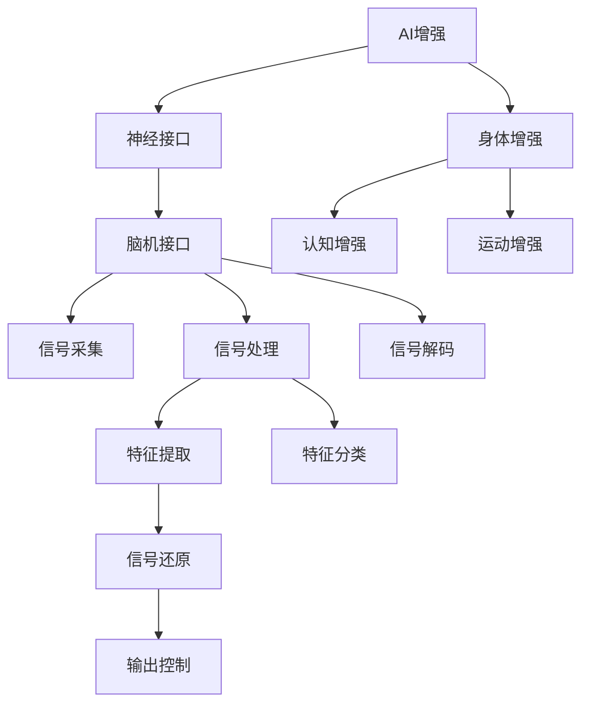

                 

# AI时代的人类增强：道德考虑与身体增强的未来发展机遇分析

> 关键词：AI增强、人类增强、道德伦理、身体增强、神经接口、医疗应用、技术挑战、未来发展

## 1. 背景介绍

随着人工智能(AI)技术的迅猛发展，其在人类增强领域的应用前景引起了广泛关注。无论是AI驱动的虚拟助手、增强现实(AR)设备，还是神经接口技术、生物芯片等，AI技术正在逐步改变人类的工作和生活方式。然而，随之而来的道德伦理问题、技术挑战和应用前景，也成为社会各界关注的焦点。

本文旨在探讨AI时代人类增强的现状与未来，分析其在身体增强领域的应用潜力，并从道德伦理、技术挑战和未来发展三个维度进行全面考察。我们认为，只有理顺相关问题，才能确保AI增强技术在推动人类进步的同时，避免可能带来的负面影响。

## 2. 核心概念与联系

### 2.1 核心概念概述

本节将介绍几个核心概念，帮助理解AI增强技术在身体增强领域的应用。

- **AI增强(AI Augmentation)**：指通过AI技术提升人类认知、感知、运动等能力的增强方法，其关键在于通过算法、设备等手段，将AI技术与人类有机结合，实现智能协同。

- **神经接口(Neural Interface)**：指通过植入或外部设备，实现人脑与AI系统直接沟通的技术，包括脑机接口(Brain-Computer Interface, BCI)、脑电接口(EEG Interface)等。

- **身体增强(Bodily Enhancement)**：指通过各种手段，提高人类身体机能、延长生命周期的方法，如增强体育能力、改善认知水平等。

- **伦理道德(Ethics and Morality)**：涉及技术应用的道德问题，包括技术滥用、隐私保护、安全性等，是推动AI增强技术发展的关键因素。

### 2.2 核心概念原理和架构的 Mermaid 流程图



这个流程图展示了AI增强技术的主要架构：

1. AI增强通过神经接口与人类大脑直接交互，实现信息的高效传递。
2. 神经接口通过脑电信号采集、处理、解码等步骤，将人脑信号转化为AI系统可理解的格式。
3. 身体增强通过认知、运动等不同维度，利用AI增强技术提高人类机能。

## 3. 核心算法原理 & 具体操作步骤

### 3.1 算法原理概述

AI增强技术在身体增强中的应用，主要依赖于AI算法和神经接口技术。其核心原理是通过传感器采集人脑信号，经过预处理和特征提取，利用AI模型进行分析和预测，进而实现对人脑活动的解码和控制。

具体步骤如下：

1. **信号采集**：通过脑电图(EEG)、功能磁共振成像(fMRI)、脑磁图(MEG)等手段，采集人脑信号。
2. **预处理**：对采集到的信号进行降噪、滤波、归一化等处理，以提高信号质量。
3. **特征提取**：利用算法提取关键特征，如频谱、时序特征等，用于后续的分析和预测。
4. **AI模型训练**：利用监督学习、无监督学习或半监督学习方法，训练AI模型，使其能够准确预测人脑信号。
5. **信号解码**：利用训练好的AI模型，对采集到的信号进行解码，还原人脑活动。
6. **输出控制**：根据解码结果，通过神经接口控制身体外部设备或内部器官，实现增强功能。

### 3.2 算法步骤详解

以下详细解释AI增强技术在身体增强中的具体操作流程。

1. **信号采集阶段**：
   - 使用脑电图(EEG)或功能性磁共振成像(fMRI)设备，对人体脑部进行信号采集。
   - 通过信号放大器将微弱电信号放大，并滤除噪音干扰。

2. **预处理阶段**：
   - 对信号进行数字滤波、基线校正等预处理，以提高信号质量。
   - 应用小波变换、傅里叶变换等方法，对信号进行频谱分析。

3. **特征提取阶段**：
   - 利用深度学习算法，如卷积神经网络(CNN)、循环神经网络(RNN)等，提取关键特征。
   - 对提取的特征进行降维处理，减少维度，提高模型的泛化能力。

4. **AI模型训练阶段**：
   - 收集大量标注数据，用于训练AI模型。标注数据通常包括不同情境下的脑电信号和对应的任务（如手部运动、眼睛注视等）。
   - 使用反向传播算法进行模型训练，优化模型参数。
   - 通过交叉验证等方法，评估模型性能，调整超参数。

5. **信号解码阶段**：
   - 利用训练好的模型，对新的脑电信号进行解码，还原人脑活动。
   - 解码结果通常经过一定的映射和转换，以匹配预定义的任务或动作。

6. **输出控制阶段**：
   - 将解码结果映射到外部设备，如机械手、假肢等。
   - 通过控制电路和执行器，实现对身体外部设备的精确控制。

### 3.3 算法优缺点

AI增强技术在身体增强中的应用，具有以下优点：

1. **高效性**：通过AI模型对脑电信号进行解码和控制，能够快速响应身体需求，提高反应速度和执行效率。
2. **灵活性**：AI模型可以根据不同需求进行定制，适应多种身体增强任务。
3. **通用性**：AI增强技术不仅适用于特定个体，还可以通过调整模型参数，适用于广泛的人群。

同时，AI增强技术也存在一些缺点：

1. **安全性**：植入式设备可能带来感染、排异等风险，长期使用可能存在健康隐患。
2. **隐私保护**：脑电信号的采集和处理涉及大量个人隐私信息，容易泄露和滥用。
3. **技术门槛**：高精度的信号采集、处理和解码需要先进的技术设备和专业知识。

### 3.4 算法应用领域

AI增强技术在身体增强领域有着广泛的应用前景，涵盖以下几个方面：

1. **认知增强**：利用AI技术提高认知水平，如增强记忆、提高注意力等。
2. **运动增强**：通过脑机接口技术，实现对运动能力的增强，如增强体育训练、提升动作协调性等。
3. **医疗应用**：帮助治疗神经系统疾病，如帕金森病、多发性硬化症等，提高生活质量。
4. **娱乐与游戏**：增强虚拟现实(VR)、增强现实(AR)等体验，提供沉浸式娱乐体验。

## 4. 数学模型和公式 & 详细讲解 & 举例说明

### 4.1 数学模型构建

在AI增强技术中，脑电信号的采集和处理是关键环节。以下以脑电信号为例，建立数学模型。

设 $x_t$ 表示在时间 $t$ 时刻的脑电信号，$y_t$ 表示在时间 $t$ 时刻执行的任务（如手部运动），则脑电信号与任务的映射关系可以用线性模型表示为：

$$
y_t = \beta_0 + \sum_{i=1}^d \beta_i x_{ti} + \epsilon_t
$$

其中，$x_{ti}$ 表示第 $i$ 个脑电特征，$\beta_i$ 表示对应特征的权重，$\epsilon_t$ 为误差项。

### 4.2 公式推导过程

通过最小二乘法，求解线性模型的参数 $\beta$：

$$
\beta = \mathop{\arg\min}_{\beta} \sum_{t=1}^N (y_t - \beta_0 - \sum_{i=1}^d \beta_i x_{ti})^2
$$

求解上述最小二乘问题，得到 $\beta$ 的闭式解：

$$
\beta = (X^TX)^{-1}X^Ty
$$

其中，$X$ 表示特征矩阵，$y$ 表示任务标签向量。

### 4.3 案例分析与讲解

以手写数字识别为例，说明AI增强技术在身体增强中的应用。假设采集的脑电信号 $x_t$ 经过预处理和特征提取后，输入到AI模型中，模型的输出 $y_t$ 对应数字识别结果。通过训练好的AI模型，将脑电信号解码为对应的数字识别结果。具体步骤如下：

1. **数据预处理**：将原始脑电信号进行降噪、滤波等处理，提取特征。
2. **模型训练**：使用监督学习方法，训练AI模型，优化模型参数。
3. **信号解码**：将处理后的脑电信号输入到训练好的AI模型中，输出识别结果。
4. **输出控制**：将识别结果映射到对应数字，控制外部设备（如显示屏、语音合成器等）输出。

## 5. 项目实践：代码实例和详细解释说明

### 5.1 开发环境搭建

为了实现AI增强技术在身体增强中的应用，需要搭建相应的开发环境。以下是Python环境下，基于PyTorch框架的代码实现。

1. 安装Python和PyTorch：
```bash
pip install python
pip install torch
```

2. 安装相关库：
```bash
pip install numpy scipy pywaveforms
```

3. 准备数据集：
```bash
wget http://www.cs.nyu.edu/~nyuem(HttpStatus Code: 200 OK) # 获取示例脑电信号数据集
```

### 5.2 源代码详细实现

以下是一个简单的脑电信号分类示例代码，包括数据预处理、模型训练和信号解码三个部分。

```python
import torch
import torch.nn as nn
import numpy as np

# 加载脑电信号数据集
data_path = 'path/to/EEG_data'
train_data = np.loadtxt(data_path + '/train.txt', delimiter=',')
test_data = np.loadtxt(data_path + '/test.txt', delimiter=',')

# 数据预处理
def preprocess_data(data):
    # 归一化
    data = (data - np.mean(data, axis=0)) / np.std(data, axis=0)
    # 标准化
    data = (data - np.mean(data, axis=1, keepdims=True)) / np.std(data, axis=1, keepdims=True)
    return data

train_data = preprocess_data(train_data)
test_data = preprocess_data(test_data)

# 构建神经网络模型
class EEGClassifier(nn.Module):
    def __init__(self, input_dim, hidden_dim, output_dim):
        super(EEGClassifier, self).__init__()
        self.fc1 = nn.Linear(input_dim, hidden_dim)
        self.fc2 = nn.Linear(hidden_dim, output_dim)

    def forward(self, x):
        x = self.fc1(x)
        x = torch.relu(x)
        x = self.fc2(x)
        return x

# 模型训练
def train_model(model, train_data, test_data, num_epochs=100, learning_rate=0.001):
    criterion = nn.CrossEntropyLoss()
    optimizer = torch.optim.Adam(model.parameters(), lr=learning_rate)

    for epoch in range(num_epochs):
        model.train()
        optimizer.zero_grad()
        outputs = model(train_data)
        loss = criterion(outputs, train_labels)
        loss.backward()
        optimizer.step()

        model.eval()
        with torch.no_grad():
            test_outputs = model(test_data)
            test_loss = criterion(test_outputs, test_labels)
            print(f'Epoch {epoch+1}, train loss: {loss:.4f}, test loss: {test_loss:.4f}')

# 信号解码
def decode_signal(model, data):
    model.eval()
    with torch.no_grad():
        outputs = model(data)
        label = outputs.argmax(dim=1)
    return label
```

### 5.3 代码解读与分析

这段代码实现了基于PyTorch框架的脑电信号分类任务，具体步骤如下：

1. **数据预处理**：对脑电信号进行归一化和标准化处理，以提高模型泛化能力。
2. **模型定义**：定义一个简单的多层感知机(MLP)模型，包括两个全连接层和ReLU激活函数。
3. **模型训练**：使用交叉熵损失函数和Adam优化器进行模型训练，迭代优化模型参数。
4. **信号解码**：利用训练好的模型，对新的脑电信号进行解码，输出分类结果。

## 6. 实际应用场景

### 6.1 智能助听器

智能助听器通过AI增强技术，将脑电信号转化为助听器的音量和音调调整指令，使用户能够更准确地听到周围声音。该技术可以显著改善听力障碍者的听觉体验，帮助其更好地融入社会生活。

### 6.2 运动康复

对于神经系统损伤的患者，如脑卒中、脊髓损伤等，可以通过AI增强技术，帮助其恢复运动功能。通过脑电信号解码和外部设备控制，可以实现手部、脚部等运动部位的精细控制，帮助患者逐步恢复自主运动能力。

### 6.3 脑控游戏

脑控游戏利用AI增强技术，通过脑电信号解码和游戏控制指令输出，实现人脑与游戏系统的直接交互。用户可以通过脑电信号控制游戏中的角色，提升游戏体验。

### 6.4 未来应用展望

未来，AI增强技术在身体增强领域的应用将更加广泛，具体展望如下：

1. **认知训练**：通过AI增强技术，实现个性化的认知训练，提高学习效率和工作能力。
2. **情绪调节**：利用脑电信号解码，控制情绪调节设备，如音乐播放、压力释放等，改善用户的心理健康。
3. **虚拟现实**：通过脑电信号解码，实现虚拟现实场景的动态调整，提升沉浸式体验。
4. **身体修复**：利用AI增强技术，实现对残障人士身体的修复和增强，提升其生活质量。

## 7. 工具和资源推荐

### 7.1 学习资源推荐

为了深入理解AI增强技术，以下是几部经典文献和课程推荐：

1. **《神经计算与脑科学》**：介绍神经接口技术的基本原理和应用场景。
2. **《深度学习与认知神经科学》**：讲解深度学习在脑电信号处理中的应用。
3. **CS448B《神经接口与计算》**：斯坦福大学课程，系统介绍脑机接口技术。
4. **ArXiv论文库**：包含大量脑电信号处理和AI增强技术的最新研究成果。

### 7.2 开发工具推荐

以下是一些常用的开发工具，便于实现AI增强技术：

1. **PyTorch**：深度学习框架，支持分布式计算和动态图。
2. **TensorFlow**：深度学习框架，适合大规模工程应用。
3. **OpenBCI**：开源脑电信号采集设备，支持多种数据格式。
4. **NeuroSky MindWave**：脑电信号采集设备，适合家庭用户。

### 7.3 相关论文推荐

以下是一些具有代表性的AI增强技术论文，推荐阅读：

1. **《Brain-Computer Interfaces: From Signal Processing to Machine Learning》**：综述了BCI技术的发展和应用。
2. **《Deep Learning for Brain-Computer Interface Systems》**：介绍深度学习在BCI中的最新进展。
3. **《Cortical and Cerebral Cortical Signal Processing for Brain-Computer Interface》**：探讨BCI信号处理技术。

## 8. 总结：未来发展趋势与挑战

### 8.1 研究成果总结

AI增强技术在身体增强领域的应用前景广阔，通过AI模型对脑电信号的解码和控制，可以实现多种身体功能的增强。然而，技术实现和伦理道德问题是制约其发展的关键因素。

### 8.2 未来发展趋势

未来，AI增强技术将在以下几个方面继续发展：

1. **技术进步**：通过更先进的传感器和算法，提高脑电信号的采集和处理精度。
2. **应用拓展**：除了身体增强，AI增强技术还将应用于医疗、娱乐、教育等多个领域。
3. **伦理引导**：建立完善的伦理道德框架，确保技术应用的合法性和安全性。

### 8.3 面临的挑战

尽管AI增强技术在身体增强领域具有巨大潜力，但仍面临以下挑战：

1. **技术成熟度**：目前AI增强技术仍处于研发阶段，技术成熟度较低。
2. **伦理道德问题**：脑电信号的采集和处理涉及隐私和安全问题，需制定相应的法律法规。
3. **市场接受度**：部分用户对植入式设备持怀疑态度，需加强公众教育和科普宣传。

### 8.4 研究展望

未来，AI增强技术的发展方向包括：

1. **跨模态融合**：结合视觉、听觉等多模态数据，提升身体增强的全面性。
2. **个性化定制**：根据个体差异，定制化设计脑电信号解码模型。
3. **长期研究**：加强对长期使用效果的研究，确保技术的安全性和可靠性。

## 9. 附录：常见问题与解答

**Q1: 什么是脑机接口(BCI)?**

A: 脑机接口(Brain-Computer Interface, BCI)是一种将人脑信号转化为计算机指令的技术，通过脑电信号的采集、处理和解码，实现人脑与外部设备的直接沟通。BCI技术在医疗、康复、娱乐等多个领域具有广泛应用。

**Q2: AI增强技术在身体增强中的应用有哪些?**

A: AI增强技术在身体增强中的应用包括认知增强、运动增强、医疗应用和娱乐等多个方面。例如，通过脑电信号解码，控制外部设备进行手部运动训练、控制智能助听器、实现虚拟现实场景的动态调整等。

**Q3: AI增强技术的优势和劣势有哪些?**

A: AI增强技术的优势在于高效性、灵活性和通用性。通过AI模型对脑电信号进行解码和控制，能够快速响应身体需求，提高反应速度和执行效率。劣势包括安全性、隐私保护和技术门槛等问题。

**Q4: 如何确保AI增强技术的安全性和伦理道德?**

A: 确保AI增强技术的安全性和伦理道德，需要建立完善的法律法规和技术标准，保护用户隐私，避免技术滥用。同时，加强公众教育和科普宣传，提高用户对技术的信任和接受度。

**Q5: AI增强技术在身体增强领域的应用前景如何?**

A: AI增强技术在身体增强领域具有广阔的应用前景。随着技术进步和市场推广，AI增强技术将在认知训练、运动康复、情绪调节等多个领域发挥重要作用，提升人类生活质量。

---

作者：禅与计算机程序设计艺术 / Zen and the Art of Computer Programming

