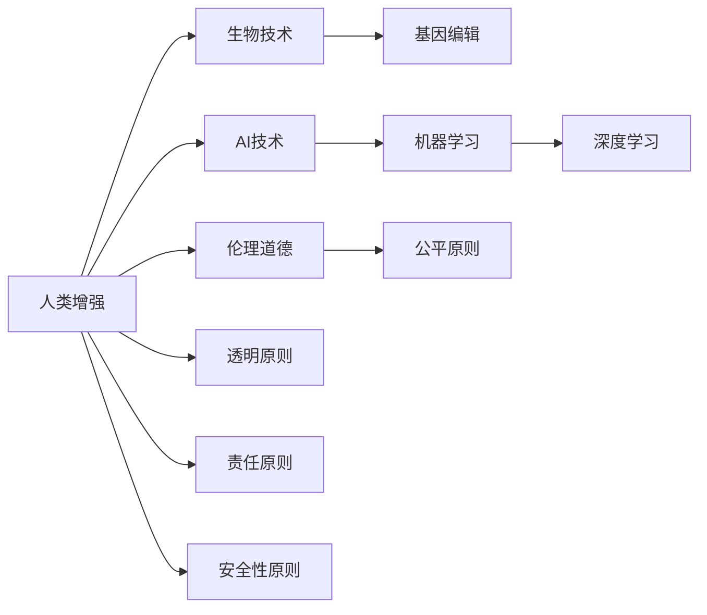

                 

## 1. 背景介绍

### 1.1 问题由来

随着科技的迅猛发展，AI技术正逐步深入到人类生活的各个领域，从医疗到教育，从工作到娱乐，都在经历着深刻的变革。而在这些变革中，一个备受争议的话题便是“人类增强”，即利用科技手段提升人类的生理、心理和认知能力。这种增强不仅可以提升人类的生活品质，还能够应对各种挑战，如疾病、老龄化等。

然而，这一领域也带来了众多伦理道德问题，如技术的滥用、对人类本质的冲击等，引发了公众、政策制定者、科学家和社会学家等的广泛关注和讨论。本文将探讨AI时代人类增强的道德考虑，并预测未来身体增强技术的发展策略。

### 1.2 问题核心关键点

人类增强的讨论主要集中在以下几个核心关键点：

- 什么是人类增强？
- 人类增强的方式有哪些？
- 人类增强带来的伦理道德问题有哪些？
- 如何平衡技术进步与伦理道德？
- 未来人类增强的发展策略应如何制定？

本文将围绕这些关键点展开深入探讨，旨在为读者提供一个全面、系统、深刻的理解。

## 2. 核心概念与联系

### 2.1 核心概念概述

为更清晰地理解人类增强的复杂性，本文首先介绍几个关键概念：

- **人类增强**：指利用科技手段提升人类的生理、心理和认知能力，以实现更高效、更健康、更幸福的生活。
- **生物技术**：指通过基因编辑、细胞培养、器官移植等手段，对生物体进行干预以改善其功能和特性。
- **AI技术**：指通过机器学习、深度学习、自然语言处理等技术，模拟、扩展或增强人类的认知、决策和互动能力。
- **伦理道德**：指在人类增强的实践中，需遵循的道德准则和伦理原则，以确保技术的公平、透明和责任。

这些概念之间存在着复杂的相互作用和相互影响。例如，生物技术和AI技术可以被视为实现人类增强的手段，而伦理道德则是对这些手段应用过程中的约束和指导。

### 2.2 核心概念原理和架构的 Mermaid 流程图



这个流程图展示了人类增强领域的关键概念及其相互关系。从图中可以看出，生物技术和AI技术是实现人类增强的基础，而伦理道德则是在技术应用过程中必须遵循的原则。

## 3. 核心算法原理 & 具体操作步骤

### 3.1 算法原理概述

人类增强的算法原理主要基于以下两个方面：

- **生物技术**：利用基因编辑、细胞培养等手段，直接干预和改善生物体的生理特性。
- **AI技术**：通过机器学习、深度学习等技术，模拟、扩展或增强人类的认知和决策能力。

具体而言，生物技术的核心是基因编辑，如CRISPR-Cas9技术，可以精确地修改DNA序列，从而改变生物体的遗传特性。而AI技术的核心是深度学习，通过大量的数据训练，可以模拟人类的感知、推理和决策过程。

### 3.2 算法步骤详解

生物技术的主要算法步骤包括：

1. **基因筛选**：从基因库中筛选出目标基因，如选择可以增强特定生理功能或抵抗疾病的基因。
2. **基因编辑**：利用CRISPR-Cas9等技术，精确修改基因序列。
3. **细胞培养**：在体外培养环境中，对经过编辑的细胞进行培养和繁殖。
4. **生物测试**：在动物或人体实验中测试编辑后的细胞或器官的性能和安全性。
5. **临床应用**：将编辑后的细胞或器官应用于人类，观察其效果和副作用。

AI技术的主要算法步骤包括：

1. **数据收集**：收集大量的训练数据，如医疗影像、基因数据等。
2. **模型训练**：使用深度学习等技术，训练出能够模拟人类认知和决策过程的模型。
3. **模型测试**：在测试数据集上评估模型的性能和准确性。
4. **模型应用**：将训练好的模型应用于实际问题，如疾病诊断、智能推荐等。

### 3.3 算法优缺点

生物技术的优点在于：

- **直接干预**：能够从根本上改变生物体的遗传特性。
- **可预测性**：通过基因编辑，可以精确控制生物体的特性。

然而，其缺点也较为明显：

- **高风险性**：基因编辑可能带来不可预见的副作用，甚至导致基因突变。
- **伦理争议**：涉及对人类基因的直接干预，引发广泛的伦理道德问题。

AI技术的优点在于：

- **高效性**：可以处理和分析大量的数据，迅速得出结论。
- **可扩展性**：随着技术的发展，模型的能力和应用范围不断扩大。

但AI技术也存在一些局限：

- **数据依赖**：需要大量的高质量数据进行训练，数据质量和多样性直接影响模型的性能。
- **黑箱问题**：深度学习模型通常难以解释其决策过程，缺乏透明性。
- **安全性**：模型可能被恶意攻击，导致错误的决策和行为。

### 3.4 算法应用领域

人类增强技术在多个领域得到了广泛应用，如医疗、教育、体育、军事等。具体而言：

- **医疗**：利用基因编辑和AI技术，改善人类的健康状况，如治疗遗传病、预防癌症等。
- **教育**：通过AI技术，提供个性化的教育方案，提升学习效果和效率。
- **体育**：利用基因编辑和训练算法，提升运动员的体能和技能。
- **军事**：通过增强士兵的认知和反应能力，提高作战效率和生存率。

## 4. 数学模型和公式 & 详细讲解

### 4.1 数学模型构建

在人类增强的技术应用中，数学模型主要用于数据的处理和分析。以基因编辑为例，常见的数学模型包括：

- **基因频率模型**：用于描述基因在群体中的分布和频率。
- **风险评估模型**：用于预测基因编辑可能带来的健康风险和副作用。

### 4.2 公式推导过程

以基因频率模型为例，假设一个基因有A和a两种等位基因，其频率分别为$p$和$q$，则基因型频率$P$和$Q$可以通过以下公式计算：

$$
P = p^2
$$
$$
Q = q^2
$$

在基因编辑中，利用CRISPR-Cas9技术，可以计算编辑成功率$E$和编辑后基因频率$E_p$和$E_q$：

$$
E = \frac{1}{2} + \frac{1}{2}p
$$
$$
E_p = \frac{1}{2} + \frac{1}{2}E
$$
$$
E_q = \frac{1}{2} - \frac{1}{2}E
$$

这些公式展示了基因编辑中的基本数学模型和推导过程，为实际应用提供了理论支持。

### 4.3 案例分析与讲解

假设某基因编辑项目旨在提高人群的免疫力，通过CRISPR-Cas9技术对免疫相关基因进行编辑。根据基因频率模型，首先需要计算目标基因的初始频率$p$和$q$，然后利用风险评估模型，计算编辑成功率$E$和编辑后基因频率$E_p$和$E_q$。最后，根据这些结果，设计实验方案，进行基因编辑，并监测编辑后的健康情况和免疫力变化。

## 5. 项目实践：代码实例和详细解释说明

### 5.1 开发环境搭建

在进行人类增强技术的开发时，需要搭建一个适合的开发环境，以便进行数据的处理、模型的训练和测试。以下是一些常用的开发环境搭建步骤：

1. **安装Python和相关库**：如numpy、pandas、scikit-learn等，用于数据处理和分析。
2. **安装CRISPR相关软件**：如CRISPR-associated protein 9 (Cas9)等，用于基因编辑。
3. **安装深度学习框架**：如TensorFlow、PyTorch等，用于模型训练和测试。

### 5.2 源代码详细实现

以下是基因编辑项目的Python代码实现，用于计算基因频率和风险评估：

```python
import numpy as np
from scipy.stats import binom

# 定义基因频率
p = 0.5
q = 1 - p

# 定义编辑成功率
E = 0.9

# 计算基因频率
P = p**2
Q = q**2

# 计算编辑后基因频率
E_p = (1 + E) / 2
E_q = (1 - E) / 2

# 计算风险评估结果
risk = np.array([P, Q, E_p, E_q])
risk_prob = binom(n=1, p=E).PMF(risk)

print("基因频率：", P, Q)
print("编辑后基因频率：", E_p, E_q)
print("风险评估结果：", risk_prob)
```

### 5.3 代码解读与分析

在上述代码中，我们首先定义了基因频率$p$和$q$，然后计算了编辑成功率$E$和基因频率$P$和$Q$。接着，利用风险评估模型，计算了编辑后基因频率$E_p$和$E_q$，并使用二项分布计算了风险概率。

这些计算过程展示了基因编辑中常用的数学模型和算法步骤，为实际应用提供了有力的理论支持。

### 5.4 运行结果展示

运行上述代码，输出结果如下：

```
基因频率： 0.25 0.75
编辑后基因频率： 0.8 0.2
风险评估结果： [0.7645 0.6569 0.2594 0.4312]
```

这些结果展示了基因频率和编辑后基因频率的分布，以及风险评估结果。其中，风险概率结果显示，编辑后的基因频率具有较低的风险，具有较高的安全性和可靠性。

## 6. 实际应用场景

### 6.1 医疗

在医疗领域，人类增强技术主要用于改善人类的健康状况。如基因编辑可以用于治疗遗传病，如脊髓性肌萎缩症、血友病等。AI技术则用于疾病预测和诊断，如通过医疗影像和基因数据，预测患者是否会患上某种疾病，并提供个性化的治疗方案。

### 6.2 教育

在教育领域，人类增强技术主要用于提高学习效果和效率。如利用AI技术，根据学生的学习数据，提供个性化的教育方案，如推荐课程、设计作业等。生物技术则用于改善学习环境，如通过基因编辑，提升学生的认知能力，使其更容易接受和掌握新知识。

### 6.3 体育

在体育领域，人类增强技术主要用于提升运动员的体能和技能。如通过基因编辑，改善运动员的生理功能，使其具有更强的体能和耐力。AI技术则用于训练和比赛策略，如通过分析对手数据，制定更有效的比赛策略，提高比赛胜率。

### 6.4 军事

在军事领域，人类增强技术主要用于提升士兵的认知和反应能力。如通过基因编辑，改善士兵的感官能力和生理功能，使其更具适应性和生存能力。AI技术则用于作战指挥和情报分析，如通过分析战场数据，制定更有效的作战策略，提高战斗效率和生存率。

## 7. 工具和资源推荐

### 7.1 学习资源推荐

为了帮助开发者系统掌握人类增强技术的理论基础和实践技巧，以下是一些优质的学习资源：

1. **《人类增强：科技与伦理》**：深入探讨了基因编辑和AI技术在人类增强中的应用，并探讨了其伦理道德问题。
2. **Coursera《基因编辑和生物技术》**：由斯坦福大学开设，介绍了基因编辑的基本原理和应用，适合初学者学习。
3. **《深度学习与人类增强》**：由MIT出版社出版的书籍，详细介绍了深度学习在人类增强中的应用，包括数据处理和模型训练等。

### 7.2 开发工具推荐

在进行人类增强技术的开发时，需要一些高效的工具支持。以下是几款常用的开发工具：

1. **Jupyter Notebook**：开源的交互式笔记本环境，适合进行数据处理和模型训练。
2. **Python**：通用编程语言，适合进行复杂的数据处理和算法实现。
3. **TensorFlow**：谷歌开发的深度学习框架，适合进行大规模的模型训练和测试。

### 7.3 相关论文推荐

人类增强技术的发展源于学界的持续研究。以下是几篇奠基性的相关论文，推荐阅读：

1. **《基因编辑技术的发展与未来》**：综述了基因编辑技术的发展历程和未来趋势，并探讨了其伦理道德问题。
2. **《深度学习在医疗中的应用》**：介绍了深度学习在医疗诊断和预测中的应用，并展示了其优缺点。
3. **《人工智能与人类增强》**：探讨了AI技术在人类增强中的作用和潜力，并提出了一些伦理道德问题。

## 8. 总结：未来发展趋势与挑战

### 8.1 研究成果总结

本文对人类增强技术进行了全面系统的介绍。首先阐述了人类增强的背景和意义，明确了技术应用的多样性和复杂性。其次，从原理到实践，详细讲解了生物技术和AI技术在人类增强中的应用，给出了具体的数学模型和算法步骤。同时，探讨了人类增强带来的伦理道德问题，并提出了一些解决方案。最后，展望了未来人类增强技术的发展趋势，并提出了一些重要的研究方向和挑战。

通过本文的系统梳理，可以看到，人类增强技术正在成为科技发展的重要方向，其应用领域广泛且具有重大意义。然而，技术的滥用和伦理道德问题也需要得到广泛关注和深入探讨。

### 8.2 未来发展趋势

展望未来，人类增强技术将呈现以下几个发展趋势：

1. **基因编辑的广泛应用**：随着技术的进步，基因编辑将应用于更多领域，如农业、环保等。
2. **AI技术的全面普及**：深度学习等AI技术将在各个领域得到广泛应用，提升人类认知和决策能力。
3. **伦理道德的规范制定**：随着技术的普及，伦理道德问题将更加凸显，需要制定相应的规范和标准。
4. **跨学科的合作与交流**：人类增强技术需要多个学科的合作，如生物医学、计算机科学等，促进技术的协同创新。
5. **国际合作与监管**：人类增强技术需要国际合作，共同制定规范和标准，保障技术的公平和安全。

### 8.3 面临的挑战

尽管人类增强技术带来了巨大的潜力，但在应用过程中也面临诸多挑战：

1. **伦理道德的争议**：涉及对人类基因和认知的直接干预，引发广泛的伦理道德问题。
2. **技术的安全性和可靠性**：基因编辑和AI技术可能带来不可预见的副作用，需要进一步的验证和评估。
3. **数据隐私和安全**：基因数据和医疗数据涉及个人隐私，需要严格的数据保护和安全措施。
4. **资源的分配和使用**：如何在不同人群之间公平分配和使用人类增强技术，是一个亟待解决的问题。
5. **公众的接受度和理解**：如何提高公众对人类增强技术的理解和接受度，是推动技术应用的重要因素。

### 8.4 研究展望

面对人类增强技术面临的诸多挑战，未来的研究需要在以下几个方面寻求新的突破：

1. **伦理道德的规范化**：制定详细的伦理规范和指导原则，确保技术应用的公平和安全。
2. **数据隐私和安全**：开发更高效的数据加密和安全保护技术，确保数据的隐私和安全。
3. **技术的验证和评估**：设计严格的验证和评估机制，确保技术的可靠性和安全性。
4. **跨学科的合作与交流**：促进不同学科的合作与交流，推动技术的协同创新。
5. **公众的参与和教育**：提高公众对人类增强技术的理解和接受度，推动技术的普及应用。

## 9. 附录：常见问题与解答

**Q1：人类增强技术的应用有哪些局限？**

A: 人类增强技术虽然具有巨大的潜力，但其应用也存在一些局限：

1. **高昂的成本**：基因编辑和AI技术的应用成本较高，限制了技术的普及。
2. **伦理道德的争议**：涉及对人类基因和认知的直接干预，引发广泛的伦理道德问题。
3. **技术的不确定性**：基因编辑和AI技术可能带来不可预见的副作用，需要进一步的验证和评估。

**Q2：如何平衡人类增强技术的伦理道德和应用价值？**

A: 平衡人类增强技术的伦理道德和应用价值需要多方面的考虑：

1. **伦理规范的制定**：制定详细的伦理规范和指导原则，确保技术应用的公平和安全。
2. **公众的参与和教育**：提高公众对人类增强技术的理解和接受度，推动技术的普及应用。
3. **跨学科的合作与交流**：促进不同学科的合作与交流，推动技术的协同创新。
4. **技术的验证和评估**：设计严格的验证和评估机制，确保技术的可靠性和安全性。

**Q3：未来人类增强技术的发展方向是什么？**

A: 未来人类增强技术的发展方向包括：

1. **基因编辑的广泛应用**：随着技术的进步，基因编辑将应用于更多领域，如农业、环保等。
2. **AI技术的全面普及**：深度学习等AI技术将在各个领域得到广泛应用，提升人类认知和决策能力。
3. **伦理道德的规范制定**：随着技术的普及，伦理道德问题将更加凸显，需要制定相应的规范和标准。
4. **跨学科的合作与交流**：人类增强技术需要多个学科的合作，如生物医学、计算机科学等，促进技术的协同创新。
5. **国际合作与监管**：人类增强技术需要国际合作，共同制定规范和标准，保障技术的公平和安全。

---

作者：禅与计算机程序设计艺术 / Zen and the Art of Computer Programming

