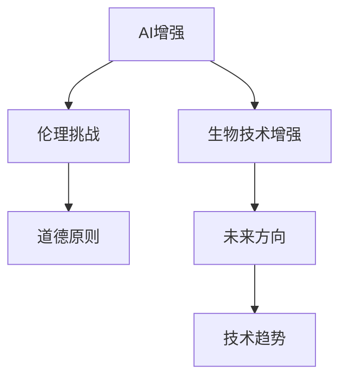

                 

# AI时代的人类增强：道德考虑与身体增强的未来方向展望

## 1. 背景介绍

在AI技术迅猛发展的今天，人类增强已成为热门话题。从人工智能的道德伦理到身体增强的科技前沿，这篇论文将带领您深入探讨AI时代下人类增强的道德挑战和未来发展方向。

### 1.1 问题由来

AI时代的人类增强，包括生物科技、基因编辑、人工智能等多个层面。比如，生物科技领域的基因编辑技术，可以通过修改DNA序列来预防疾病、延长寿命；人工智能领域的机器学习算法，能够提升人类认知、提升工作效率；身体增强技术如增强现实（AR）、虚拟现实（VR），能够改善人体感知能力。

然而，这些技术的应用，也带来了诸多道德和伦理问题。比如，基因编辑是否应该用于胚胎筛查，以预防遗传疾病？AI是否应该用于增强人类认知，以提升工作效率？身体增强技术是否应该被滥用，以增强人类感知能力？这些问题引发了广泛的讨论和关注。

### 1.2 问题核心关键点

这些问题涉及到技术的广泛应用，以及人类对科技伦理的考量。本文将从人类增强的伦理挑战出发，探讨AI时代下人类增强的未来方向，并提出一些关键问题供读者思考。

## 2. 核心概念与联系

### 2.1 核心概念概述

为更好地理解人类增强的伦理挑战，本节将介绍几个关键概念：

- **AI增强**：利用人工智能算法提升人类认知、效率和感知能力的技术。
- **生物技术增强**：通过基因编辑、生物合成等生物技术提升人类健康、寿命的技术。
- **伦理挑战**：在技术应用过程中，可能涉及的道德、法律和伦理问题。
- **未来方向**：基于当前技术趋势，对人类增强的未来发展进行预测和思考。
- **道德原则**：科技应用应遵循的基本伦理原则，如尊重生命、公平正义、知情同意等。

这些核心概念之间的逻辑关系可以通过以下Mermaid流程图来展示：



这个流程图展示了一系列概念及其关联：AI增强和生物技术增强技术的应用，带来了伦理挑战，而这些挑战需要遵循基本的道德原则，才能指导未来的发展方向。

## 3. 核心算法原理 & 具体操作步骤

### 3.1 算法原理概述

AI时代的人类增强技术，往往需要结合多学科知识。本文以AI增强为代表，深入探讨其核心算法原理和具体操作步骤。

AI增强的核心在于算法模型和数据集的设计。常见的算法模型包括神经网络、深度学习、强化学习等。数据集则涉及大量标注数据，用于模型的训练和优化。

### 3.2 算法步骤详解

AI增强的算法步骤主要包括以下几个关键环节：

**Step 1: 数据准备**

- 收集和标注相关数据。例如，在语音识别领域，需要收集大量的语音数据，并进行标签标注。
- 数据清洗和预处理。例如，去除噪音、标准化数据格式等。

**Step 2: 模型设计**

- 选择合适的算法模型。例如，卷积神经网络（CNN）适用于图像识别，循环神经网络（RNN）适用于语音识别。
- 确定模型的结构。例如，深度学习模型通常包含多个层次，每一层负责提取不同的特征。

**Step 3: 模型训练**

- 使用标注数据对模型进行训练。例如，使用反向传播算法，计算模型参数的梯度，并更新参数以最小化损失函数。
- 验证模型的性能。例如，使用验证集对模型进行评估，判断是否出现过拟合或欠拟合。

**Step 4: 模型优化**

- 调整模型参数。例如，调整学习率、增加正则化项等。
- 引入迁移学习技术。例如，使用预训练模型作为初始参数，加快模型的训练过程。

**Step 5: 模型部署**

- 将模型封装成API或SDK，便于集成使用。
- 部署到生产环境，进行实时应用。

### 3.3 算法优缺点

AI增强技术具有以下优点：

- **高效性**：能够大幅提升工作效率，提高决策效率。
- **广泛应用**：适用于多个领域，如医疗、教育、娱乐等。
- **灵活性**：能够根据具体任务进行定制化设计。

但同时，AI增强也存在以下缺点：

- **过拟合问题**：模型可能会对特定数据集产生过拟合，导致泛化能力差。
- **隐私问题**：需要收集大量用户数据，涉及隐私保护问题。
- **伦理问题**：可能引发对人类认知的挑战，甚至威胁到人类伦理和道德底线。

### 3.4 算法应用领域

AI增强技术已经在多个领域得到广泛应用，包括：

- **医疗领域**：用于医学影像分析、疾病预测、个性化治疗等。
- **教育领域**：用于自动批改试卷、个性化教学等。
- **商业领域**：用于智能客服、推荐系统、金融风险控制等。
- **娱乐领域**：用于游戏、音乐、影视等创作。
- **智能制造**：用于工业自动化、智能制造等。

## 4. 数学模型和公式 & 详细讲解 & 举例说明

### 4.1 数学模型构建

本节将使用数学语言对AI增强技术进行描述。

假设存在一个简单的AI增强任务，如语音识别。其数学模型可以表示为：

$$ f(x) = W^T \sigma(z) $$

其中，$x$表示输入数据（如语音信号），$z$表示隐藏层特征，$\sigma$为激活函数，$W$表示权重矩阵，$f(x)$表示输出结果（如识别出的文字）。

### 4.2 公式推导过程

以神经网络为例，其推导过程如下：

1. **前向传播**：
   $$
   z^{[l]} = W^{[l]} x + b^{[l]}
   $$
   $$
   a^{[l]} = \sigma(z^{[l]})
   $$
   其中，$x$为输入向量，$W^{[l]}$为权重矩阵，$b^{[l]}$为偏置向量，$\sigma$为激活函数，$a^{[l]}$为激活输出。

2. **反向传播**：
   $$
   \Delta^{[l]} = \delta^{[l]} (a^{[l]})^T
   $$
   $$
   \Delta^{[l]} = \delta^{[l+1]} (W^{[l+1]})^T
   $$
   其中，$\Delta^{[l]}$为误差梯度，$\delta^{[l]}$为误差信号。

3. **参数更新**：
   $$
   W^{[l]} \leftarrow W^{[l]} - \eta \Delta^{[l]}
   $$
   $$
   b^{[l]} \leftarrow b^{[l]} - \eta \Delta^{[l]}
   $$
   其中，$\eta$为学习率，$W^{[l]}$和$b^{[l]}$为需要更新的参数。

### 4.3 案例分析与讲解

以图像识别为例，常见的深度学习模型为卷积神经网络（CNN）。CNN包含多个卷积层、池化层和全连接层。例如，VGG模型由多个卷积层和池化层组成，可以学习到图像中的特征，并通过全连接层将其映射到分类结果。

## 5. 项目实践：代码实例和详细解释说明

### 5.1 开发环境搭建

在进行AI增强项目开发前，我们需要准备好开发环境。以下是使用Python进行TensorFlow开发的环境配置流程：

1. 安装Anaconda：从官网下载并安装Anaconda，用于创建独立的Python环境。

2. 创建并激活虚拟环境：
```bash
conda create -n tensorflow-env python=3.8 
conda activate tensorflow-env
```

3. 安装TensorFlow：根据CUDA版本，从官网获取对应的安装命令。例如：
```bash
conda install tensorflow tensorflow-gpu -c conda-forge
```

4. 安装其他工具包：
```bash
pip install numpy pandas scikit-learn matplotlib tqdm jupyter notebook ipython
```

完成上述步骤后，即可在`tensorflow-env`环境中开始项目开发。

### 5.2 源代码详细实现

这里我们以图像分类任务为例，给出使用TensorFlow进行卷积神经网络（CNN）的PyTorch代码实现。

首先，定义CNN模型：

```python
import tensorflow as tf
from tensorflow.keras.layers import Conv2D, MaxPooling2D, Flatten, Dense
from tensorflow.keras.models import Sequential

model = Sequential([
    Conv2D(32, (3, 3), activation='relu', input_shape=(28, 28, 1)),
    MaxPooling2D((2, 2)),
    Conv2D(64, (3, 3), activation='relu'),
    MaxPooling2D((2, 2)),
    Flatten(),
    Dense(64, activation='relu'),
    Dense(10, activation='softmax')
])
```

接着，定义损失函数和优化器：

```python
loss_fn = tf.keras.losses.CategoricalCrossentropy()
optimizer = tf.keras.optimizers.Adam(learning_rate=0.001)
```

然后，定义训练和评估函数：

```python
@tf.function
def train_step(x, y):
    with tf.GradientTape() as tape:
        logits = model(x, training=True)
        loss_value = loss_fn(y, logits)
    gradients = tape.gradient(loss_value, model.trainable_variables)
    optimizer.apply_gradients(zip(gradients, model.trainable_variables))
    return loss_value

@tf.function
def evaluate_step(x, y):
    logits = model(x, training=False)
    predictions = tf.argmax(logits, axis=1)
    return loss_fn(y, logits), tf.reduce_mean(tf.cast(tf.equal(predictions, y), tf.float32))
```

最后，启动训练流程并在测试集上评估：

```python
epochs = 10
batch_size = 64

for epoch in range(epochs):
    for batch in train_dataset:
        x_batch, y_batch = batch
        loss = train_step(x_batch, y_batch)
    print(f"Epoch {epoch+1}, train loss: {loss:.3f}")
    
    test_loss, acc = evaluate_step(test_dataset)
    print(f"Epoch {epoch+1}, test loss: {test_loss:.3f}, test accuracy: {acc:.2f}")
```

以上就是使用TensorFlow对CNN进行图像分类任务微调的完整代码实现。可以看到，TensorFlow提供了强大的自动微分功能，可以方便地定义模型和优化器，并快速完成模型的训练和评估。

### 5.3 代码解读与分析

让我们再详细解读一下关键代码的实现细节：

**Sequential模型定义**：
- `Sequential`是TensorFlow中常用的模型定义方式，通过链式调用各层模型实现模型结构设计。
- `Conv2D`表示卷积层，`MaxPooling2D`表示池化层，`Flatten`表示全连接层，`Dense`表示全连接层。

**损失函数定义**：
- `CategoricalCrossentropy`表示分类交叉熵损失函数，适用于多分类任务。
- `optimizer`表示优化器，`learning_rate`表示学习率。

**训练函数定义**：
- `tf.function`表示使用TensorFlow函数，加速模型的训练过程。
- `with tf.GradientTape()`表示开启梯度计算。
- `logits`表示模型的输出结果。
- `loss_value`表示计算的损失值。
- `gradients`表示梯度。
- `optimizer.apply_gradients()`表示应用梯度更新模型参数。

**评估函数定义**：
- `logits`表示模型的输出结果。
- `predictions`表示模型预测的分类结果。
- `loss_fn(y, logits)`表示计算损失值。
- `tf.equal(predictions, y)`表示计算预测值与真实值的相等性。
- `tf.reduce_mean()`表示计算平均准确率。

可以看到，TensorFlow提供了一整套完整的工具链，可以方便地进行模型的定义、训练和评估。开发者可以专注于模型结构的设计和训练流程的实现，而不必过多关注底层细节。

当然，工业级的系统实现还需考虑更多因素，如模型的保存和部署、超参数的自动搜索、更灵活的任务适配层等。但核心的模型训练范式基本与此类似。

## 6. 实际应用场景

### 6.1 医疗诊断

AI增强技术在医疗诊断领域有着广泛的应用，例如使用深度学习算法进行医学影像分析，辅助医生诊断疾病。医疗影像数据量大且标注困难，AI增强技术可以通过学习大量标注数据，提高诊断的准确性和效率。

### 6.2 智能驾驶

AI增强技术在智能驾驶领域也有着重要的应用。例如，通过深度学习算法分析传感器数据，实现自动驾驶。AI增强技术可以大幅提高车辆的感知能力、决策能力和执行能力，提升行驶安全性和效率。

### 6.3 金融分析

AI增强技术在金融分析领域也有广泛的应用。例如，使用深度学习算法进行股票价格预测、风险评估等。AI增强技术可以通过学习大量的金融数据，提高预测准确性和风险评估的精度。

### 6.4 未来应用展望

随着AI技术的不断进步，AI增强技术将在更多领域得到应用。未来，AI增强技术将不仅仅局限于计算机视觉、语音识别等领域，还将扩展到更多领域，如农业、教育、娱乐等。同时，AI增强技术的不断演进，也将带来更多新的应用场景和创新点。

## 7. 工具和资源推荐

### 7.1 学习资源推荐

为了帮助开发者系统掌握AI增强技术，这里推荐一些优质的学习资源：

1. 《深度学习》书籍：由Goodfellow等人所著，全面介绍了深度学习的理论基础和实践技巧。
2. 《TensorFlow官方文档》：TensorFlow官方文档，提供了完整的API参考和实践指南。
3. 《机器学习实战》书籍：由Peter Harrington所著，通过实际案例介绍了机器学习的常用算法和实现。
4. Coursera的深度学习课程：斯坦福大学开设的深度学习课程，内容全面、深入浅出，是深度学习的入门级课程。
5. Udacity的深度学习课程：Udacity的深度学习课程，内容覆盖深度学习的基础理论和实践技巧。

通过对这些资源的学习实践，相信你一定能够快速掌握AI增强技术的精髓，并用于解决实际的AI问题。

### 7.2 开发工具推荐

高效的开发离不开优秀的工具支持。以下是几款用于AI增强开发的常用工具：

1. TensorFlow：由Google主导开发的深度学习框架，生产部署方便，适合大规模工程应用。
2. PyTorch：基于Python的开源深度学习框架，灵活性和易用性高，适合快速迭代研究。
3. Keras：基于TensorFlow和Theano的高级神经网络API，简单易用，适合快速原型设计。
4. Jupyter Notebook：用于编写和执行Python代码的交互式笔记本，方便调试和分享代码。
5. Colab：谷歌推出的在线Jupyter Notebook环境，免费提供GPU/TPU算力，方便开发者快速上手实验最新模型。

合理利用这些工具，可以显著提升AI增强任务的开发效率，加快创新迭代的步伐。

### 7.3 相关论文推荐

AI增强技术的发展源于学界的持续研究。以下是几篇奠基性的相关论文，推荐阅读：

1. ImageNet Large Scale Visual Recognition Challenge：提出大规模图像识别任务，推动了深度学习在图像识别领域的发展。
2. AlphaGo：提出深度强化学习技术，实现围棋自动对弈，展示了AI在决策优化方面的潜力。
3. GANs Trained by a Two Time-Scale Update Rule Generate High-Resolution Natural Image Synthesis：提出生成对抗网络（GAN）技术，推动了生成模型在图像生成领域的发展。
4. Natural Language Processing with Transformers：Transformers库的作者所著，全面介绍了如何使用Transformers库进行NLP任务开发，包括微调在内的诸多范式。
5. Attention is All You Need：提出Transformer结构，开启了NLP领域的预训练大模型时代。

这些论文代表了大AI增强技术的发展脉络。通过学习这些前沿成果，可以帮助研究者把握学科前进方向，激发更多的创新灵感。

## 8. 总结：未来发展趋势与挑战

### 8.1 研究成果总结

本文对AI增强技术的核心算法和操作步骤进行了详细介绍，涵盖了深度学习、神经网络、自动微分等关键技术。通过详细讲解数学模型和代码实例，帮助读者全面理解AI增强技术的原理和实践。

### 8.2 未来发展趋势

展望未来，AI增强技术将呈现以下几个发展趋势：

1. **模型规模持续增大**：随着算力成本的下降和数据规模的扩张，深度学习模型的参数量还将持续增长。超大规模模型蕴含的丰富知识，将支撑更加复杂多变的AI任务。
2. **多模态融合**：未来的AI增强技术将不仅仅局限于计算机视觉、语音识别等领域，还将扩展到更多领域，如农业、教育、娱乐等。多模态信息的融合，将显著提升AI系统的感知能力。
3. **迁移学习**：在迁移学习方面，未来的研究将更加关注如何将已有的知识和经验更好地迁移到新的任务上，提高模型的泛化能力。
4. **可解释性和透明性**：未来的AI增强技术将更加注重可解释性和透明性，帮助用户更好地理解模型的决策过程，提高系统的可信度。

### 8.3 面临的挑战

尽管AI增强技术已经取得了瞩目成就，但在迈向更加智能化、普适化应用的过程中，它仍面临着诸多挑战：

1. **数据依赖**：AI增强技术需要大量的标注数据进行训练，数据获取和标注成本较高。如何在数据稀缺的情况下，实现模型的有效训练，是未来需要解决的重要问题。
2. **伦理道德**：AI增强技术的应用，涉及隐私保护、公平性、安全性等问题。如何在技术应用过程中，遵守伦理道德规范，是未来需要考虑的重要问题。
3. **计算资源**：AI增强技术的训练和推理过程，需要大量的计算资源。如何在资源受限的情况下，实现模型的有效训练和推理，是未来需要解决的重要问题。

### 8.4 研究展望

面向未来，AI增强技术的研究方向将包括以下几个方面：

1. **数据增强**：利用数据增强技术，通过合成数据、对抗样本等方法，扩充训练集规模，提高模型的泛化能力。
2. **模型压缩**：通过模型压缩技术，减少模型的参数量和计算资源，提高模型的部署效率。
3. **跨领域迁移**：通过跨领域迁移学习，实现模型在不同领域之间的知识迁移，提升模型的泛化能力。
4. **多任务学习**：通过多任务学习技术，在训练多个任务时共享模型参数，提高模型的效率和性能。
5. **生成对抗网络（GAN）**：通过GAN技术，生成高质量的合成数据，扩充训练集规模，提高模型的泛化能力。

这些研究方向将为AI增强技术的发展提供新的动力，推动AI技术在更多领域的应用。

## 9. 附录：常见问题与解答

**Q1: AI增强技术是否适用于所有领域？**

A: AI增强技术在许多领域都有着广泛的应用，如医疗、金融、教育、制造等。但不同的领域需要根据具体场景进行调整和优化。

**Q2: 如何选择合适的AI增强算法？**

A: 选择合适的AI增强算法需要考虑数据类型、任务类型和性能要求。例如，计算机视觉任务通常使用卷积神经网络，自然语言处理任务通常使用循环神经网络或Transformer等。

**Q3: AI增强技术是否应该大规模推广？**

A: AI增强技术在提高效率和性能方面有着巨大潜力，但其推广也需注意伦理和道德问题。例如，在医疗领域，需要确保算法的准确性和安全性，避免误诊等问题。

**Q4: 如何保护AI增强技术的数据隐私？**

A: 数据隐私保护是AI增强技术的重要问题。可以采用数据匿名化、加密等技术，保护用户隐私。同时，可以采用差分隐私等技术，确保模型训练数据的安全性。

**Q5: AI增强技术是否应该进行跨领域应用？**

A: AI增强技术的跨领域应用，将有助于推动技术的普适化和普及。但不同领域的复杂性和需求不同，需要进行针对性的设计和优化。

总之，AI增强技术在提升人类生产力和生活质量方面有着巨大的潜力。但需要在技术应用过程中，注意伦理和道德问题，确保技术的可持续发展。面向未来，AI增强技术的研究将不断深入，推动技术在更多领域的应用。相信在AI技术的不断演进中，人类将迎来更加美好的未来。

