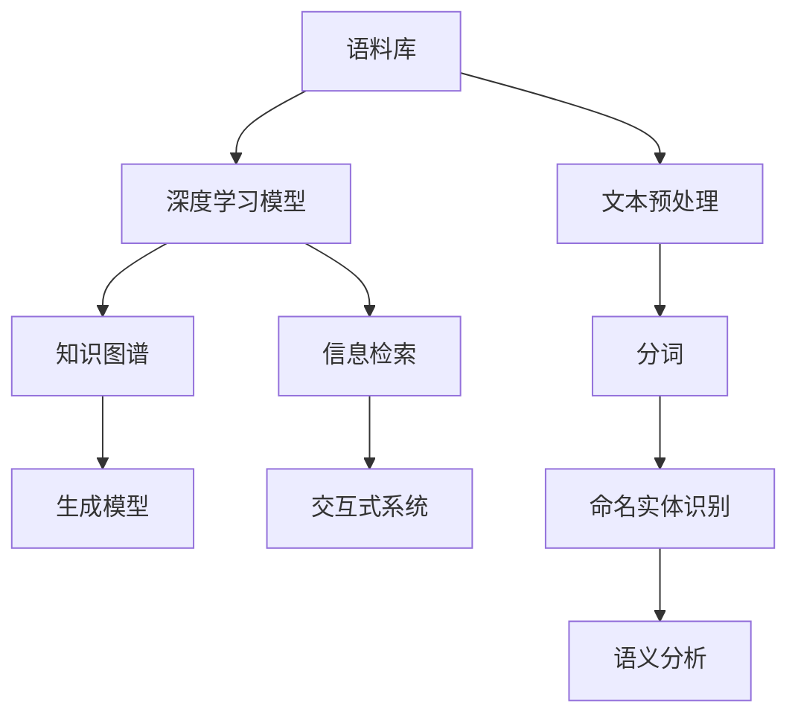

                 

# AI时代的自然语言处理突破：个性化知识库

> 关键词：自然语言处理, 个性化, 知识库, 语义理解, 生成模型, 语料收集, 信息检索, 交互式系统, 深度学习, 模型压缩, 迁移学习, 多模态, 领域知识

## 1. 背景介绍

### 1.1 问题由来

人工智能(AI)技术的飞速发展，极大地推动了自然语言处理(Natural Language Processing, NLP)领域的进步。然而，NLP技术要想真正落地应用，还需要解决许多现实问题，比如如何从海量文本数据中提取有用的信息，如何使模型具有足够的智能来理解和生成自然语言，如何构建能适应特定领域需求的个性化知识库。

### 1.2 问题核心关键点

构建一个高效的个性化知识库，是实现高效、智能的NLP应用的关键步骤。该知识库不仅需要存储大量的文本数据，还需要具备强大的语义理解、信息检索和生成能力。本文将介绍基于深度学习技术，如何构建和应用一个高效的个性化知识库。

### 1.3 问题研究意义

在AI时代，个性化知识库作为自然语言处理的突破口，对于推动NLP技术在更多实际场景中的应用具有重要意义：

- 提升信息检索准确性：在智能问答、个性化推荐等领域，构建高度定制化的知识库，可以显著提升系统检索相关信息的准确性和效率。
- 增强语义理解能力：通过与领域专家的互动，个性化知识库可以不断更新，帮助模型更好地理解特定领域的语言和逻辑。
- 促进生成模型的创新：个性化知识库可以作为生成模型的语料库，提升模型生成的自然性和准确性。
- 实现交互式系统：构建与用户交互的个性化知识库，可以实现智能问答、对话系统、个性化推荐等交互式应用，提升用户体验。

## 2. 核心概念与联系

### 2.1 核心概念概述

为更好地理解基于深度学习的个性化知识库，本节将介绍几个关键概念：

- 自然语言处理(NLP)：研究如何让计算机理解和生成自然语言的技术，涉及文本预处理、分词、命名实体识别、语义分析等多个环节。
- 语料库(Corpus)：包含大量文本数据的数据库，是构建个性化知识库的基础。
- 深度学习(Deep Learning)：一种模拟人脑神经网络的学习方式，通过多层次的抽象表示，可以提取数据中的复杂特征。
- 知识图谱(Knowledge Graph)：用于描述实体及其关系的图形结构，可以辅助模型更好地理解语义。
- 生成模型(Generative Model)：能够生成文本、图像等内容的模型，如语言模型、变分自编码器等。
- 信息检索(Information Retrieval)：从大量数据中快速检索与查询相关的信息，是知识库中重要的一环。
- 交互式系统(Interactive System)：与用户实时交互的NLP系统，如智能问答、对话系统等。

这些核心概念之间的逻辑关系可以通过以下Mermaid流程图来展示：



这个流程图展示了一些核心概念之间的逻辑关系：

1. 语料库为深度学习模型提供训练数据。
2. 深度学习模型用于构建知识图谱，提取文本中的语义信息。
3. 生成模型用于创建高质量的文本输出，辅助用户理解与生成。
4. 信息检索帮助从知识库中快速检索到相关内容。
5. 交互式系统与用户实时交互，提供定制化的服务。

这些概念共同构成了个性化知识库的基本框架，使得NLP系统能够更好地理解和生成自然语言，满足用户的多样化需求。

## 3. 核心算法原理 & 具体操作步骤

### 3.1 算法原理概述

基于深度学习的个性化知识库，主要包括三个核心步骤：语料收集与预处理、深度学习模型训练、知识图谱构建与查询。

1. **语料收集与预处理**：收集大规模的文本数据，并进行清洗、分词、命名实体识别、去除停用词等预处理操作。

2. **深度学习模型训练**：使用大规模的语料库训练深度学习模型，提取文本中的语义信息，并构建知识图谱。

3. **知识图谱构建与查询**：利用深度学习模型构建知识图谱，并通过信息检索技术，快速从知识库中检索到相关内容。

### 3.2 算法步骤详解

以下将详细介绍每一个核心步骤的具体实现过程。

#### 3.2.1 语料收集与预处理

**步骤1：语料收集**
收集与个性化知识库相关的文本数据，如百科全书、新闻、论文、网页等。这些数据需要覆盖全面，且质量高，以确保知识库的内容丰富和准确。

**步骤2：预处理**
对收集到的语料进行清洗和预处理，包括：
- 分词：将文本分解为词语或子词。
- 去除停用词：去除常见的无意义词语，如“的”、“是”等。
- 命名实体识别：识别出人名、地名、机构名等专有名词。
- 去除噪音：去除噪音文本，如拼写错误、乱码等。

#### 3.2.2 深度学习模型训练

**步骤1：模型选择**
选择合适的深度学习模型，如BERT、GPT等，作为知识库的核心模型。这些模型已经在大规模语料库上进行了预训练，能够提取高质量的语义信息。

**步骤2：微调**
使用收集到的语料库，对预训练模型进行微调，使其能够更好地理解特定领域的语言和逻辑。微调过程中，可以使用监督学习、无监督学习或半监督学习的方法。

**步骤3：知识图谱构建**
将微调后的模型输出的语义信息，构建为知识图谱。知识图谱包含实体、属性、关系等信息，可以辅助模型更好地理解语义。

#### 3.2.3 知识图谱构建与查询

**步骤1：构建知识图谱**
利用深度学习模型输出的语义信息，构建知识图谱。知识图谱可以使用Neo4j、Gephi等工具进行存储和可视化。

**步骤2：信息检索**
通过构建的知识图谱，利用信息检索技术，快速检索与查询相关的信息。信息检索技术可以使用向量检索、文本检索、结构化查询等多种方式。

### 3.3 算法优缺点

基于深度学习的个性化知识库具有以下优点：

1. 高度定制化：通过深度学习模型，可以根据特定领域的数据，构建高度定制化的知识库，满足不同场景的需求。
2. 高效的语义理解：深度学习模型能够提取文本中的语义信息，帮助模型更好地理解自然语言。
3. 强大的生成能力：深度学习模型可以生成高质量的文本，提高知识库的信息完整性。
4. 实时交互：构建与用户实时交互的个性化知识库，可以提供更好的用户体验。

然而，该方法也存在一些缺点：

1. 数据依赖性高：个性化知识库的构建需要大量的高质量数据，获取这些数据成本较高。
2. 模型训练复杂：深度学习模型的训练需要大量的计算资源和时间，训练过程较为复杂。
3. 知识图谱构建难度大：知识图谱的构建需要领域专家的参与，且需要考虑实体关系的复杂性。
4. 信息检索准确性有待提高：信息检索技术的准确性直接影响知识库的实用性。

### 3.4 算法应用领域

基于深度学习的个性化知识库已经在多个领域得到应用，如：

- 智能问答系统：利用知识库和深度学习模型，实现智能问答，回答用户的问题。
- 个性化推荐系统：根据用户的行为数据和知识库信息，推荐个性化的内容。
- 客户服务系统：通过知识库和自然语言处理技术，构建智能客服系统，提供24小时服务。
- 医疗信息系统：构建医疗领域的知识库，辅助医生进行诊断和治疗。
- 新闻信息检索：利用知识库和信息检索技术，快速检索与新闻相关的信息。

## 4. 数学模型和公式 & 详细讲解 & 举例说明

### 4.1 数学模型构建

基于深度学习的个性化知识库，可以使用多种数学模型进行构建和训练。这里以BERT为例，介绍其基本数学模型。

**BERT模型的数学模型**：
$$
h_i = \text{BERT}(w_i, W)
$$

其中 $h_i$ 表示第 $i$ 个词语的向量表示，$w_i$ 表示词语，$W$ 表示BERT模型的参数。

**信息检索的数学模型**：
$$
\text{Retrieval}_{\text{Rank}_i} = \text{BERT}(w_i, W) \cdot \text{BERT}(q, W)
$$

其中 $\text{Retrieval}_{\text{Rank}_i}$ 表示词语 $w_i$ 与查询 $q$ 的相关性。

### 4.2 公式推导过程

以下将详细介绍BERT模型的基本公式推导过程。

**BERT模型的推导**：
$$
h_i = \text{BERT}(w_i, W) = f(W \cdot h_{i-1} + b)
$$

其中 $f$ 表示非线性激活函数，$h_{i-1}$ 表示上一层的输出，$W$ 表示BERT的参数，$b$ 表示偏置项。

**信息检索的推导**：
$$
\text{Retrieval}_{\text{Rank}_i} = \text{BERT}(w_i, W) \cdot \text{BERT}(q, W) = \langle \text{BERT}(w_i, W), \text{BERT}(q, W) \rangle
$$

其中 $\langle \cdot, \cdot \rangle$ 表示向量的点积操作。

### 4.3 案例分析与讲解

以智能问答系统为例，介绍基于深度学习的个性化知识库的实现过程。

**步骤1：语料收集与预处理**
收集与问答系统相关的语料，如FAQ、知识库等，并进行清洗和预处理。

**步骤2：BERT模型训练**
使用收集到的语料，对BERT模型进行微调，使其能够理解问答相关的问题和答案。

**步骤3：知识图谱构建**
利用微调后的BERT模型，构建知识图谱，包含实体、属性和关系等信息。

**步骤4：信息检索**
通过构建的知识图谱，利用向量检索技术，快速检索与问答问题相关的答案。

## 5. 项目实践：代码实例和详细解释说明

### 5.1 开发环境搭建

在进行项目实践前，我们需要准备好开发环境。以下是使用Python进行PyTorch开发的环境配置流程：

1. 安装Anaconda：从官网下载并安装Anaconda，用于创建独立的Python环境。

2. 创建并激活虚拟环境：
```bash
conda create -n pytorch-env python=3.8 
conda activate pytorch-env
```

3. 安装PyTorch：根据CUDA版本，从官网获取对应的安装命令。例如：
```bash
conda install pytorch torchvision torchaudio cudatoolkit=11.1 -c pytorch -c conda-forge
```

4. 安装Transformer库：
```bash
pip install transformers
```

5. 安装各类工具包：
```bash
pip install numpy pandas scikit-learn matplotlib tqdm jupyter notebook ipython
```

完成上述步骤后，即可在`pytorch-env`环境中开始项目实践。

### 5.2 源代码详细实现

下面我们以命名实体识别(NER)任务为例，给出使用Transformers库对BERT模型进行微调的PyTorch代码实现。

首先，定义NER任务的数据处理函数：

```python
from transformers import BertTokenizer
from torch.utils.data import Dataset
import torch

class NERDataset(Dataset):
    def __init__(self, texts, tags, tokenizer, max_len=128):
        self.texts = texts
        self.tags = tags
        self.tokenizer = tokenizer
        self.max_len = max_len
        
    def __len__(self):
        return len(self.texts)
    
    def __getitem__(self, item):
        text = self.texts[item]
        tags = self.tags[item]
        
        encoding = self.tokenizer(text, return_tensors='pt', max_length=self.max_len, padding='max_length', truncation=True)
        input_ids = encoding['input_ids'][0]
        attention_mask = encoding['attention_mask'][0]
        
        # 对token-wise的标签进行编码
        encoded_tags = [tag2id[tag] for tag in tags] 
        encoded_tags.extend([tag2id['O']] * (self.max_len - len(encoded_tags)))
        labels = torch.tensor(encoded_tags, dtype=torch.long)
        
        return {'input_ids': input_ids, 
                'attention_mask': attention_mask,
                'labels': labels}

# 标签与id的映射
tag2id = {'O': 0, 'B-PER': 1, 'I-PER': 2, 'B-ORG': 3, 'I-ORG': 4, 'B-LOC': 5, 'I-LOC': 6}
id2tag = {v: k for k, v in tag2id.items()}

# 创建dataset
tokenizer = BertTokenizer.from_pretrained('bert-base-cased')

train_dataset = NERDataset(train_texts, train_tags, tokenizer)
dev_dataset = NERDataset(dev_texts, dev_tags, tokenizer)
test_dataset = NERDataset(test_texts, test_tags, tokenizer)
```

然后，定义模型和优化器：

```python
from transformers import BertForTokenClassification, AdamW

model = BertForTokenClassification.from_pretrained('bert-base-cased', num_labels=len(tag2id))

optimizer = AdamW(model.parameters(), lr=2e-5)
```

接着，定义训练和评估函数：

```python
from torch.utils.data import DataLoader
from tqdm import tqdm
from sklearn.metrics import classification_report

device = torch.device('cuda') if torch.cuda.is_available() else torch.device('cpu')
model.to(device)

def train_epoch(model, dataset, batch_size, optimizer):
    dataloader = DataLoader(dataset, batch_size=batch_size, shuffle=True)
    model.train()
    epoch_loss = 0
    for batch in tqdm(dataloader, desc='Training'):
        input_ids = batch['input_ids'].to(device)
        attention_mask = batch['attention_mask'].to(device)
        labels = batch['labels'].to(device)
        model.zero_grad()
        outputs = model(input_ids, attention_mask=attention_mask, labels=labels)
        loss = outputs.loss
        epoch_loss += loss.item()
        loss.backward()
        optimizer.step()
    return epoch_loss / len(dataloader)

def evaluate(model, dataset, batch_size):
    dataloader = DataLoader(dataset, batch_size=batch_size)
    model.eval()
    preds, labels = [], []
    with torch.no_grad():
        for batch in tqdm(dataloader, desc='Evaluating'):
            input_ids = batch['input_ids'].to(device)
            attention_mask = batch['attention_mask'].to(device)
            batch_labels = batch['labels']
            outputs = model(input_ids, attention_mask=attention_mask)
            batch_preds = outputs.logits.argmax(dim=2).to('cpu').tolist()
            batch_labels = batch_labels.to('cpu').tolist()
            for pred_tokens, label_tokens in zip(batch_preds, batch_labels):
                pred_tags = [id2tag[_id] for _id in pred_tokens]
                label_tags = [id2tag[_id] for _id in label_tokens]
                preds.append(pred_tags[:len(label_tags)])
                labels.append(label_tags)
                
    print(classification_report(labels, preds))
```

最后，启动训练流程并在测试集上评估：

```python
epochs = 5
batch_size = 16

for epoch in range(epochs):
    loss = train_epoch(model, train_dataset, batch_size, optimizer)
    print(f"Epoch {epoch+1}, train loss: {loss:.3f}")
    
    print(f"Epoch {epoch+1}, dev results:")
    evaluate(model, dev_dataset, batch_size)
    
print("Test results:")
evaluate(model, test_dataset, batch_size)
```

以上就是使用PyTorch对BERT进行命名实体识别任务微调的完整代码实现。可以看到，得益于Transformers库的强大封装，我们可以用相对简洁的代码完成BERT模型的加载和微调。

### 5.3 代码解读与分析

让我们再详细解读一下关键代码的实现细节：

**NERDataset类**：
- `__init__`方法：初始化文本、标签、分词器等关键组件。
- `__len__`方法：返回数据集的样本数量。
- `__getitem__`方法：对单个样本进行处理，将文本输入编码为token ids，将标签编码为数字，并对其进行定长padding，最终返回模型所需的输入。

**tag2id和id2tag字典**：
- 定义了标签与数字id之间的映射关系，用于将token-wise的预测结果解码回真实的标签。

**训练和评估函数**：
- 使用PyTorch的DataLoader对数据集进行批次化加载，供模型训练和推理使用。
- 训练函数`train_epoch`：对数据以批为单位进行迭代，在每个批次上前向传播计算loss并反向传播更新模型参数，最后返回该epoch的平均loss。
- 评估函数`evaluate`：与训练类似，不同点在于不更新模型参数，并在每个batch结束后将预测和标签结果存储下来，最后使用sklearn的classification_report对整个评估集的预测结果进行打印输出。

**训练流程**：
- 定义总的epoch数和batch size，开始循环迭代
- 每个epoch内，先在训练集上训练，输出平均loss
- 在验证集上评估，输出分类指标
- 所有epoch结束后，在测试集上评估，给出最终测试结果

可以看到，PyTorch配合Transformers库使得BERT微调的代码实现变得简洁高效。开发者可以将更多精力放在数据处理、模型改进等高层逻辑上，而不必过多关注底层的实现细节。

当然，工业级的系统实现还需考虑更多因素，如模型的保存和部署、超参数的自动搜索、更灵活的任务适配层等。但核心的微调范式基本与此类似。

## 6. 实际应用场景

### 6.1 智能客服系统

基于大语言模型微调的对话技术，可以广泛应用于智能客服系统的构建。传统客服往往需要配备大量人力，高峰期响应缓慢，且一致性和专业性难以保证。而使用微调后的对话模型，可以7x24小时不间断服务，快速响应客户咨询，用自然流畅的语言解答各类常见问题。

在技术实现上，可以收集企业内部的历史客服对话记录，将问题和最佳答复构建成监督数据，在此基础上对预训练对话模型进行微调。微调后的对话模型能够自动理解用户意图，匹配最合适的答案模板进行回复。对于客户提出的新问题，还可以接入检索系统实时搜索相关内容，动态组织生成回答。如此构建的智能客服系统，能大幅提升客户咨询体验和问题解决效率。

### 6.2 金融舆情监测

金融机构需要实时监测市场舆论动向，以便及时应对负面信息传播，规避金融风险。传统的人工监测方式成本高、效率低，难以应对网络时代海量信息爆发的挑战。基于大语言模型微调的文本分类和情感分析技术，为金融舆情监测提供了新的解决方案。

具体而言，可以收集金融领域相关的新闻、报道、评论等文本数据，并对其进行主题标注和情感标注。在此基础上对预训练语言模型进行微调，使其能够自动判断文本属于何种主题，情感倾向是正面、中性还是负面。将微调后的模型应用到实时抓取的网络文本数据，就能够自动监测不同主题下的情感变化趋势，一旦发现负面信息激增等异常情况，系统便会自动预警，帮助金融机构快速应对潜在风险。

### 6.3 个性化推荐系统

当前的推荐系统往往只依赖用户的历史行为数据进行物品推荐，无法深入理解用户的真实兴趣偏好。基于大语言模型微调技术，个性化推荐系统可以更好地挖掘用户行为背后的语义信息，从而提供更精准、多样的推荐内容。

在实践中，可以收集用户浏览、点击、评论、分享等行为数据，提取和用户交互的物品标题、描述、标签等文本内容。将文本内容作为模型输入，用户的后续行为（如是否点击、购买等）作为监督信号，在此基础上微调预训练语言模型。微调后的模型能够从文本内容中准确把握用户的兴趣点。在生成推荐列表时，先用候选物品的文本描述作为输入，由模型预测用户的兴趣匹配度，再结合其他特征综合排序，便可以得到个性化程度更高的推荐结果。

### 6.4 未来应用展望

随着大语言模型微调技术的发展，基于微调范式将在更多领域得到应用，为传统行业带来变革性影响。

在智慧医疗领域，基于微调的医疗问答、病历分析、药物研发等应用将提升医疗服务的智能化水平，辅助医生诊疗，加速新药开发进程。

在智能教育领域，微调技术可应用于作业批改、学情分析、知识推荐等方面，因材施教，促进教育公平，提高教学质量。

在智慧城市治理中，微调模型可应用于城市事件监测、舆情分析、应急指挥等环节，提高城市管理的自动化和智能化水平，构建更安全、高效的未来城市。

此外，在企业生产、社会治理、文娱传媒等众多领域，基于大模型微调的人工智能应用也将不断涌现，为经济社会发展注入新的动力。相信随着技术的日益成熟，微调方法将成为人工智能落地应用的重要范式，推动人工智能技术向更广阔的领域加速渗透。

## 7. 工具和资源推荐

### 7.1 学习资源推荐

为了帮助开发者系统掌握大语言模型微调的理论基础和实践技巧，这里推荐一些优质的学习资源：

1. 《Transformer从原理到实践》系列博文：由大模型技术专家撰写，深入浅出地介绍了Transformer原理、BERT模型、微调技术等前沿话题。

2. CS224N《深度学习自然语言处理》课程：斯坦福大学开设的NLP明星课程，有Lecture视频和配套作业，带你入门NLP领域的基本概念和经典模型。

3. 《Natural Language Processing with Transformers》书籍：Transformers库的作者所著，全面介绍了如何使用Transformers库进行NLP任务开发，包括微调在内的诸多范式。

4. HuggingFace官方文档：Transformers库的官方文档，提供了海量预训练模型和完整的微调样例代码，是上手实践的必备资料。

5. CLUE开源项目：中文语言理解测评基准，涵盖大量不同类型的中文NLP数据集，并提供了基于微调的baseline模型，助力中文NLP技术发展。

通过对这些资源的学习实践，相信你一定能够快速掌握大语言模型微调的精髓，并用于解决实际的NLP问题。

### 7.2 开发工具推荐

高效的开发离不开优秀的工具支持。以下是几款用于大语言模型微调开发的常用工具：

1. PyTorch：基于Python的开源深度学习框架，灵活动态的计算图，适合快速迭代研究。大部分预训练语言模型都有PyTorch版本的实现。

2. TensorFlow：由Google主导开发的开源深度学习框架，生产部署方便，适合大规模工程应用。同样有丰富的预训练语言模型资源。

3. Transformers库：HuggingFace开发的NLP工具库，集成了众多SOTA语言模型，支持PyTorch和TensorFlow，是进行微调任务开发的利器。

4. Weights & Biases：模型训练的实验跟踪工具，可以记录和可视化模型训练过程中的各项指标，方便对比和调优。与主流深度学习框架无缝集成。

5. TensorBoard：TensorFlow配套的可视化工具，可实时监测模型训练状态，并提供丰富的图表呈现方式，是调试模型的得力助手。

6. Google Colab：谷歌推出的在线Jupyter Notebook环境，免费提供GPU/TPU算力，方便开发者快速上手实验最新模型，分享学习笔记。

合理利用这些工具，可以显著提升大语言模型微调任务的开发效率，加快创新迭代的步伐。

### 7.3 相关论文推荐

大语言模型和微调技术的发展源于学界的持续研究。以下是几篇奠基性的相关论文，推荐阅读：

1. Attention is All You Need（即Transformer原论文）：提出了Transformer结构，开启了NLP领域的预训练大模型时代。

2. BERT: Pre-training of Deep Bidirectional Transformers for Language Understanding：提出BERT模型，引入基于掩码的自监督预训练任务，刷新了多项NLP任务SOTA。

3. Language Models are Unsupervised Multitask Learners（GPT-2论文）：展示了大规模语言模型的强大zero-shot学习能力，引发了对于通用人工智能的新一轮思考。

4. Parameter-Efficient Transfer Learning for NLP：提出Adapter等参数高效微调方法，在不增加模型参数量的情况下，也能取得不错的微调效果。

5. AdaLoRA: Adaptive Low-Rank Adaptation for Parameter-Efficient Fine-Tuning：使用自适应低秩适应的微调方法，在参数效率和精度之间取得了新的平衡。

6. Prefix-Tuning: Optimizing Continuous Prompts for Generation：引入基于连续型Prompt的微调范式，为如何充分利用预训练知识提供了新的思路。

这些论文代表了大语言模型微调技术的发展脉络。通过学习这些前沿成果，可以帮助研究者把握学科前进方向，激发更多的创新灵感。

## 8. 总结：未来发展趋势与挑战

### 8.1 总结

本文对基于深度学习技术，构建和应用个性化知识库进行了全面系统的介绍。首先阐述了个性化知识库在NLP技术中的重要性，明确了其对于推动NLP技术在更多实际场景中的应用具有重要意义。其次，从原理到实践，详细讲解了深度学习模型训练、知识图谱构建与查询等核心步骤，给出了微调任务开发的完整代码实例。同时，本文还广泛探讨了微调方法在智能客服、金融舆情、个性化推荐等多个领域的应用前景，展示了微调范式的巨大潜力。此外，本文精选了微调技术的各类学习资源，力求为读者提供全方位的技术指引。

通过本文的系统梳理，可以看到，基于深度学习的个性化知识库已经成为NLP技术的重要突破口，在智能问答、推荐系统、客服系统等多个场景中得到了广泛应用。未来，伴随深度学习技术的不断发展，个性化知识库将发挥更大的作用，成为推动NLP技术落地应用的关键手段。

### 8.2 未来发展趋势

展望未来，基于深度学习的个性化知识库将呈现以下几个发展趋势：

1. 模型规模持续增大。随着算力成本的下降和数据规模的扩张，深度学习模型的参数量还将持续增长。超大模型蕴含的丰富语义信息，有望支撑更加复杂多变的下游任务微调。

2. 微调方法日趋多样。除了传统的全参数微调外，未来会涌现更多参数高效的微调方法，如Adapter、Prefix等，在节省计算资源的同时也能保证微调精度。

3. 持续学习成为常态。随着数据分布的不断变化，微调模型也需要持续学习新知识以保持性能。如何在不遗忘原有知识的同时，高效吸收新样本信息，将成为重要的研究课题。

4. 标注样本需求降低。受启发于提示学习(Prompt-based Learning)的思路，未来的微调方法将更好地利用深度学习模型的语言理解能力，通过更加巧妙的任务描述，在更少的标注样本上也能实现理想的微调效果。

5. 知识图谱构建难度降低。随着领域知识图谱的逐步完善，知识图谱的构建将不再依赖于领域专家的参与，可以自动从文本中学习实体和关系，构建高质量的知识图谱。

6. 信息检索技术进步。向量检索、文本检索、结构化查询等技术将不断进步，实现更快速、更准确的信息检索。

7. 多模态信息融合。未来的知识库将不再局限于文本信息，将融合视觉、语音等多模态数据，提升知识库的完整性和准确性。

以上趋势凸显了大语言模型微调技术的广阔前景。这些方向的探索发展，必将进一步提升NLP系统的性能和应用范围，为人类认知智能的进化带来深远影响。

### 8.3 面临的挑战

尽管基于深度学习的个性化知识库已经取得了瞩目成就，但在迈向更加智能化、普适化应用的过程中，它仍面临着诸多挑战：

1. 数据依赖性高。个性化知识库的构建需要大量的高质量数据，获取这些数据成本较高。如何降低数据依赖性，减少标注样本的需求，将是一大难题。

2. 模型训练复杂。深度学习模型的训练需要大量的计算资源和时间，训练过程较为复杂。如何优化模型训练流程，降低训练成本，提高训练效率，还需要进一步探索。

3. 知识图谱构建难度大。知识图谱的构建需要领域专家的参与，且需要考虑实体关系的复杂性。如何自动从文本中学习实体和关系，构建高质量的知识图谱，仍然是一个重要的问题。

4. 信息检索准确性有待提高。信息检索技术的准确性直接影响知识库的实用性。如何提高信息检索的精度和效率，是未来知识库构建和应用的关键。

5. 知识图谱更新频繁。随着数据分布的变化，知识图谱需要不断更新以保持其时效性。如何高效地更新知识图谱，避免知识图谱的过期和失效，是未来的研究热点。

6. 多模态数据融合难度大。将视觉、语音等多模态数据融合到知识库中，需要克服不同模态数据表示方式的差异，实现统一的语义理解。

7. 安全性和隐私保护。深度学习模型和知识图谱中可能存在安全隐患和隐私泄露风险，如何确保模型的安全性和隐私保护，是未来知识库应用的重要课题。

这些挑战需要在未来的研究中不断攻克，才能推动基于深度学习的个性化知识库在更多实际场景中的应用，真正实现智能化的NLP技术。

### 8.4 研究展望

未来，基于深度学习的个性化知识库将在以下几个方面进行进一步研究：

1. 更高效的数据获取和预处理：研究自动化数据标注技术，减少对标注样本的依赖，提高数据获取的效率和质量。

2. 更灵活的微调方法：开发更多参数高效和计算高效的微调方法，如AdaLoRA、Adaptation等，在保证微调效果的同时，降低计算资源的需求。

3. 更普适的知识图谱构建方法：研究自动构建知识图谱的技术，降低领域专家参与的程度，提升知识图谱构建的效率和准确性。

4. 更精准的信息检索技术：研究多模态信息检索技术，提高信息检索的精度和效率，实现更加智能的知识库检索。

5. 更全面的知识库应用：研究如何将知识库应用于更多实际场景中，如医疗、金融、教育、智能客服等，实现知识库的全面普及。

6. 更严格的安全和隐私保护：研究如何在知识库构建和应用中，确保模型的安全和隐私保护，防止数据泄露和模型滥用。

这些研究方向将推动基于深度学习的个性化知识库的不断进步，为推动NLP技术在更多实际场景中的应用提供更强大的技术支持。相信伴随着技术的不断发展，个性化知识库将成为推动AI时代NLP技术进步的重要力量。

## 9. 附录：常见问题与解答

**Q1：大语言模型微调是否适用于所有NLP任务？**

A: 大语言模型微调在大多数NLP任务上都能取得不错的效果，特别是对于数据量较小的任务。但对于一些特定领域的任务，如医学、法律等，仅仅依靠通用语料预训练的模型可能难以很好地适应。此时需要在特定领域语料上进一步预训练，再进行微调，才能获得理想效果。此外，对于一些需要时效性、个性化很强的任务，如对话、推荐等，微调方法也需要针对性的改进优化。

**Q2：微调过程中如何选择合适的学习率？**

A: 微调的学习率一般要比预训练时小1-2个数量级，如果使用过大的学习率，容易破坏预训练权重，导致过拟合。一般建议从1e-5开始调参，逐步减小学习率，直至收敛。也可以使用warmup策略，在开始阶段使用较小的学习率，再逐渐过渡到预设值。需要注意的是，不同的优化器(如AdamW、Adafactor等)以及不同的学习率调度策略，可能需要设置不同的学习率阈值。

**Q3：采用大模型微调时会面临哪些资源瓶颈？**

A: 目前主流的预训练大模型动辄以亿计的参数规模，对算力、内存、存储都提出了很高的要求。GPU/TPU等高性能设备是必不可少的，但即便如此，超大批次的训练和推理也可能遇到显存不足的问题。因此需要采用一些资源优化技术，如梯度积累、混合精度训练、模型并行等，来突破硬件瓶颈。同时，模型的存储和读取也可能占用大量时间和空间，需要采用模型压缩、稀疏化存储等方法进行优化。

**Q4：如何缓解微调过程中的过拟合问题？**

A: 过拟合是微调面临的主要挑战，尤其是在标注数据不足的情况下。常见的缓解策略包括：
1. 数据增强：通过回译、近义替换等方式扩充训练集
2. 正则化：使用L2正则、Dropout、Early Stopping等避免过拟合
3. 对抗训练：引入对抗样本，提高模型鲁棒性
4. 参数高效微调：只调整少量参数(如Adapter、Prefix等)，减小过拟合风险
5. 多模型集成：训练多个微调模型，取平均输出，抑制过拟合

这些策略往往需要根据具体任务和数据特点进行灵活组合。只有在数据、模型、训练、推理等各环节进行全面优化，才能最大限度地发挥大模型微调的威力。

**Q5：微调模型在落地部署时需要注意哪些问题？**

A: 将微调模型转化为实际应用，还需要考虑以下因素：
1. 模型裁剪：去除不必要的层和参数，减小模型尺寸，加快推理速度
2. 量化加速：将浮点模型转为定点模型，压缩存储空间，提高计算效率
3. 服务化封装：将模型封装为标准化服务接口，便于集成调用
4. 弹性伸缩：根据请求流量动态调整资源配置，平衡服务质量和成本
5. 监控告警：实时采集系统指标，设置异常告警阈值，确保服务稳定性
6. 安全防护：采用访问鉴权、数据脱敏等措施，保障数据和模型安全

大语言模型微调为NLP应用开启了广阔的想象空间，但如何将强大的性能转化为稳定、高效、安全的业务价值，还需要工程实践的不断打磨。唯有从数据、算法、工程、业务等多个维度协同发力，才能真正实现人工智能技术在垂直行业的规模化落地。总之，微调需要开发者根据具体任务，不断迭代和优化模型、数据和算法，方能得到理想的效果。

---

作者：禅与计算机程序设计艺术 / Zen and the Art of Computer Programming

