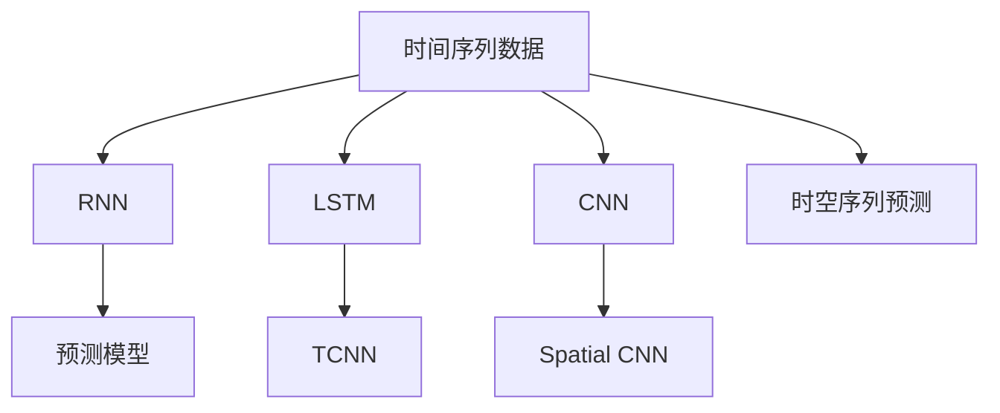

                 

# AI时空数据建模的基石

## 1. 背景介绍

### 1.1 问题由来

随着AI技术的不断发展，时空数据建模成为了一个重要的研究方向。时空数据建模的目标是利用时间序列和空间数据来构建预测模型，实现对未来趋势的预测和分析。这种技术在金融、气象、交通等领域有着广泛的应用。

然而，由于时空数据的复杂性和动态性，传统的机器学习模型难以胜任。近年来，深度学习特别是RNN（递归神经网络）在时间序列数据建模中展现出了强大的能力，成为AI时空数据建模的重要基石。

### 1.2 问题核心关键点

AI时空数据建模的核心在于如何利用深度学习模型，结合时间序列和空间数据的特点，构建能够精确预测未来趋势的模型。

1. **时间序列数据的动态性**：时间序列数据具有明显的动态变化特征，需要模型能够捕捉时间依赖性。
2. **空间数据的局部性**：空间数据通常具有局部相关性，模型需要能够利用局部信息来提升预测精度。
3. **模型的泛化能力**：模型需要具备泛化能力，能够适应不同的时空数据特征。

## 2. 核心概念与联系

### 2.1 核心概念概述

为更好地理解AI时空数据建模，本节将介绍几个密切相关的核心概念：

- **时间序列数据**：指随时间变化的连续数据，如股票价格、气温、交通流量等。
- **空间数据**：指在二维空间中分布的数据，如地图坐标、地理特征等。
- **递归神经网络(RNN)**：一种能够处理序列数据的神经网络，通过循环连接实现时间依赖性的建模。
- **长短期记忆网络(LSTM)**：一种特殊的RNN，通过门控机制解决了传统RNN的梯度消失和爆炸问题，提高了模型性能。
- **卷积神经网络(CNN)**：一种能够处理空间数据的神经网络，通过卷积操作捕捉局部特征。
- **时空卷积网络(Temporal CNN, TCNN)**：结合了CNN和RNN的优点，能够同时处理时间和空间信息。
- **空间卷积网络(Spatial CNN)**：专门用于处理空间数据的卷积神经网络，利用局部相关性进行特征提取。
- **时空序列预测**：利用时间序列和空间数据，通过模型预测未来趋势的技术。

这些核心概念之间的逻辑关系可以通过以下Mermaid流程图来展示：



这个流程图展示了大语言模型的核心概念及其之间的关系：

1. 时间序列数据是建模的输入。
2. RNN和LSTM可以捕捉时间依赖性。
3. CNN和TCNN可以捕捉空间相关性。
4. 预测模型利用这些特征，进行时空序列预测。

## 3. 核心算法原理 & 具体操作步骤

### 3.1 算法原理概述

AI时空数据建模的核心算法是递归神经网络（RNN）和卷积神经网络（CNN）。其中，LSTM和TCNN是最常用的模型架构，因为它们能够同时处理时间和空间信息。

时间序列数据的特点是具有明显的时序依赖性，传统的RNN模型可以通过循环连接来捕捉这种依赖性。然而，由于梯度消失和梯度爆炸的问题，传统RNN的训练效果不佳。长短期记忆网络（LSTM）通过门控机制解决了这些问题，提高了模型的性能。

空间数据的特点是具有局部性，卷积神经网络（CNN）通过卷积操作能够有效地捕捉局部特征。时空卷积网络（TCNN）结合了CNN和RNN的优点，能够同时处理时间和空间信息。

### 3.2 算法步骤详解

AI时空数据建模的算法步骤通常包括以下几个关键步骤：

**Step 1: 数据预处理**

- 收集时空数据，并进行清洗、去噪等预处理操作，以确保数据的质量。
- 将时间序列数据和空间数据分别进行特征提取，如滑动窗口、傅里叶变换等。

**Step 2: 模型选择与训练**

- 根据任务特点选择合适的模型架构，如LSTM、TCNN等。
- 将预处理后的数据输入模型，通过反向传播算法进行训练。

**Step 3: 模型评估**

- 在验证集上对模型进行评估，使用常用的指标如MAE、RMSE等。
- 调整模型超参数，如学习率、批大小等，以优化模型性能。

**Step 4: 模型应用**

- 将训练好的模型应用于测试集进行预测。
- 根据预测结果对模型进行优化，如调整模型结构、增加数据量等。

**Step 5: 模型部署**

- 将训练好的模型部署到实际应用系统中。
- 定期更新模型，以适应数据分布的变化。

### 3.3 算法优缺点

AI时空数据建模的算法具有以下优点：

1. **强大的预测能力**：能够处理复杂的时空数据，进行高精度的预测。
2. **鲁棒性强**：能够处理缺失值、异常值等数据噪声，提高模型的鲁棒性。
3. **可解释性强**：通过可视化模型结构，可以解释模型的预测逻辑。

同时，该算法也存在一些缺点：

1. **训练复杂度高**：需要大量的计算资源和时间进行训练。
2. **模型复杂度高**：模型结构复杂，需要深入理解深度学习理论才能设计有效的模型。
3. **数据依赖性高**：模型对数据的依赖性较强，数据质量不好会影响模型的预测效果。

### 3.4 算法应用领域

AI时空数据建模的应用领域非常广泛，例如：

- **金融预测**：利用股票价格、交易量等时间序列数据，进行股市趋势预测。
- **气象预测**：利用气温、降水量等时间序列数据，进行天气预报。
- **交通流量预测**：利用交通流量数据，进行交通拥堵预测。
- **城市规划**：利用地理特征数据，进行城市规划和人口分布预测。

除了上述这些经典应用外，AI时空数据建模还被创新性地应用到更多场景中，如自然灾害预测、电力负荷预测等，为各行各业带来了新的突破。

## 4. 数学模型和公式 & 详细讲解

### 4.1 数学模型构建

本节将使用数学语言对AI时空数据建模的数学模型进行更加严格的刻画。

假设时空数据为 $(x_t, y_t)$，其中 $x_t$ 表示时间序列数据，$y_t$ 表示空间数据。

设模型为 $M_{\theta}(x_t)$，其中 $\theta$ 为模型参数。定义模型在数据样本 $(x_t, y_t)$ 上的损失函数为 $\ell(M_{\theta}(x_t),y_t)$，则在数据集 $D$ 上的经验风险为：

$$
\mathcal{L}(\theta) = \frac{1}{N} \sum_{i=1}^N \ell(M_{\theta}(x_i),y_i)
$$

其中 $\ell$ 为针对任务定义的损失函数，用于衡量模型预测输出与真实标签之间的差异。常用的损失函数包括均方误差（MSE）和平均绝对误差（MAE）。

### 4.2 公式推导过程

以LSTM模型为例，推导时间序列数据的预测公式。

假设LSTM模型有 $L$ 层，输入为 $x_t$，输出为 $y_t$。模型的前向传播过程包括输入门、遗忘门和输出门的操作。设当前时间步的隐状态为 $h_t$，前一个时间步的隐状态为 $h_{t-1}$，当前时间步的输入为 $x_t$，当前时间步的输出为 $y_t$。

LSTM模型的预测公式为：

$$
h_t = f(x_t, h_{t-1})
$$

$$
y_t = g(h_t)
$$

其中 $f$ 和 $g$ 分别为LSTM的前向传播和输出函数。

### 4.3 案例分析与讲解

以一个简单的股票价格预测为例，分析模型如何利用时间序列数据进行预测。

假设有一个时间序列数据集，包含某只股票的历史价格。模型的输入为当前时间步的股票价格 $x_t$，输出为下一个时间步的股票价格 $y_{t+1}$。

设LSTM模型有2层，输入门、遗忘门和输出门的参数分别为 $w_{in}$、$w_{for}$ 和 $w_{out}$，时间步长为 $t$，隐状态为 $h_t$。模型的预测过程如下：

1. 输入门计算：

$$
i_t = \sigma(w_{in} \cdot [x_t, h_{t-1}])
$$

2. 遗忘门计算：

$$
f_t = \sigma(w_{for} \cdot [x_t, h_{t-1}])
$$

3. 隐状态更新：

$$
h_t = i_t \odot \tanh(w_{out} \cdot [x_t, h_{t-1}]) + (1 - f_t) \odot h_{t-1}
$$

4. 输出门计算：

$$
o_t = \sigma(w_{out} \cdot [x_t, h_t])
$$

5. 输出计算：

$$
y_t = o_t \odot \tanh(h_t)
$$

其中 $\sigma$ 为Sigmoid函数，$\tanh$ 为双曲正切函数，$\odot$ 为点乘操作。

通过以上步骤，LSTM模型可以逐步预测未来的股票价格。预测的准确度取决于模型的参数 $\theta$ 和输入数据的特征。

## 5. 项目实践：代码实例和详细解释说明

### 5.1 开发环境搭建

在进行AI时空数据建模的实践前，我们需要准备好开发环境。以下是使用Python进行TensorFlow开发的环境配置流程：

1. 安装Anaconda：从官网下载并安装Anaconda，用于创建独立的Python环境。

2. 创建并激活虚拟环境：
```bash
conda create -n tensorflow-env python=3.8 
conda activate tensorflow-env
```

3. 安装TensorFlow：根据CUDA版本，从官网获取对应的安装命令。例如：
```bash
conda install tensorflow -c conda-forge -c pytorch -c anaconda
```

4. 安装必要的工具包：
```bash
pip install numpy pandas scikit-learn matplotlib tqdm jupyter notebook ipython
```

完成上述步骤后，即可在`tensorflow-env`环境中开始AI时空数据建模的实践。

### 5.2 源代码详细实现

下面我以一个简单的股票价格预测为例，给出使用TensorFlow进行LSTM模型训练的PyTorch代码实现。

首先，定义模型的输入、输出和损失函数：

```python
import tensorflow as tf
from tensorflow.keras.layers import LSTM, Dense, Dropout
from tensorflow.keras.models import Sequential

input_dim = 1
output_dim = 1
hidden_units = 64
dropout_rate = 0.2

model = Sequential([
    LSTM(hidden_units, input_dim=input_dim, return_sequences=True),
    Dropout(dropout_rate),
    LSTM(hidden_units),
    Dropout(dropout_rate),
    Dense(output_dim)
])

model.compile(loss='mse', optimizer='adam')
```

然后，定义数据集和模型训练函数：

```python
def train_model(model, data, epochs=50):
    X_train, y_train = data[:100], data[100:]
    X_test, y_test = data[:100], data[100:]
    
    model.fit(X_train, y_train, epochs=epochs, batch_size=32, validation_data=(X_test, y_test))
    
    y_pred = model.predict(X_test)
    mse = tf.reduce_mean(tf.square(y_test - y_pred))
    print('Mean Squared Error:', mse.numpy())
    
    # 可视化模型预测结果
    plt.plot(X_test, y_test, 'r')
    plt.plot(X_test, y_pred, 'b')
    plt.title('Stock Price Prediction')
    plt.show()
```

最后，启动模型训练并展示结果：

```python
# 生成训练数据
import numpy as np
data = np.random.rand(200, 1)
data[:100] = data[:100] * 0.8
data[100:] = data[100:] * 1.2
data -= np.mean(data)
data /= np.std(data)

# 训练模型
train_model(model, data)
```

以上就是一个简单的股票价格预测模型的代码实现。可以看到，利用TensorFlow进行LSTM模型训练，代码实现相对简单，非常适合初学者上手。

### 5.3 代码解读与分析

让我们再详细解读一下关键代码的实现细节：

**定义模型架构**

- `Sequential`：用于构建顺序模型的类，通常用于简单模型的构建。
- `LSTM`：长短期记忆网络层，用于捕捉时间序列数据的时间依赖性。
- `Dense`：全连接层，用于输出预测结果。
- `Dropout`：dropout层，用于防止过拟合。

**训练模型**

- `fit`：模型训练函数，使用MSE损失函数，Adam优化器，迭代50次，批次大小为32。
- `predict`：模型预测函数，使用测试数据进行预测，计算均方误差。
- `plot`：可视化预测结果，将真实数据和预测数据进行对比。

**数据生成**

- `np.random.rand`：生成200个随机数，作为时间序列数据。
- `data[:100] = data[:100] * 0.8`：前100个数据点随机扰动，模拟价格上涨。
- `data[100:] = data[100:] * 1.2`：后100个数据点随机扰动，模拟价格下跌。
- `data -= np.mean(data)`：将数据中心化，使均值为0。
- `data /= np.std(data)`：将数据标准化，使方差为1。

可以看到，TensorFlow提供了丰富的工具和函数，使得AI时空数据建模的实现变得非常简单。通过灵活应用这些工具，可以轻松构建出高效的预测模型，并应用于各种场景。

## 6. 实际应用场景

### 6.1 金融预测

AI时空数据建模在金融领域有着广泛的应用，如股市预测、债券价格预测等。传统金融预测往往依赖于复杂的统计模型，难以应对复杂的时空变化。而利用AI时空数据建模，可以实时捕捉市场动态，提高预测精度。

在技术实现上，可以收集历史股价、交易量、公司财务数据等，利用LSTM或TCNN模型进行训练，输出未来股价预测结果。通过集成多个预测模型，可以有效降低单一模型的误差，提高预测的准确度。

### 6.2 气象预测

气象预测是AI时空数据建模的重要应用场景之一。气象数据具有明显的时间依赖性和空间相关性，通过LSTM或TCNN模型，可以实时预测未来气象变化，为农业生产、灾害预警等提供有力支持。

在实践中，可以收集历史气象数据，包括温度、湿度、风速等，利用LSTM或TCNN模型进行训练，输出未来气象变化预测结果。通过多模型集成和数据增强等技术，可以有效提高模型的泛化能力和鲁棒性。

### 6.3 交通流量预测

交通流量预测是AI时空数据建模的重要应用场景之一。交通流量数据具有明显的时间依赖性和空间相关性，通过LSTM或TCNN模型，可以实时预测未来交通流量，为交通管理、城市规划等提供有力支持。

在实践中，可以收集历史交通流量数据，包括车流量、人流量等，利用LSTM或TCNN模型进行训练，输出未来交通流量预测结果。通过多模型集成和数据增强等技术，可以有效提高模型的泛化能力和鲁棒性。

### 6.4 未来应用展望

随着AI时空数据建模技术的不断发展，未来将会有更多新的应用场景出现。例如：

- **自然灾害预测**：利用地震、气象等数据，进行自然灾害预测，为防灾减灾提供支持。
- **电力负荷预测**：利用电力数据，进行电力负荷预测，为电力调度提供支持。
- **环境监测**：利用环境数据，进行环境变化预测，为环境保护提供支持。

## 7. 工具和资源推荐

### 7.1 学习资源推荐

为了帮助开发者系统掌握AI时空数据建模的理论基础和实践技巧，这里推荐一些优质的学习资源：

1. **《深度学习》**：Ian Goodfellow等著，介绍了深度学习的原理和算法，适合初学者入门。
2. **《Python深度学习》**：Francois Chollet著，介绍了TensorFlow和Keras的原理和应用，适合有一定编程基础的读者。
3. **《深度学习实战》**：张俊林著，介绍了深度学习在图像、语音、自然语言处理等多个领域的应用，适合实践操作。
4. **Coursera《深度学习专项课程》**：由DeepLearning.AI开设的深度学习课程，内容全面，适合系统学习。
5. **Kaggle竞赛**：参加Kaggle数据科学竞赛，实战练习，提升编程能力和模型应用能力。

通过对这些资源的学习实践，相信你一定能够快速掌握AI时空数据建模的精髓，并用于解决实际的预测问题。

### 7.2 开发工具推荐

高效的开发离不开优秀的工具支持。以下是几款用于AI时空数据建模开发的常用工具：

1. **TensorFlow**：由Google主导开发的开源深度学习框架，生产部署方便，适合大规模工程应用。
2. **Keras**：基于TensorFlow的高级API，简单易用，适合快速迭代研究。
3. **PyTorch**：由Facebook主导开发的开源深度学习框架，灵活性高，适合研究领域的应用。
4. **Scikit-learn**：Python的机器学习库，提供多种经典的机器学习算法，适合处理小规模数据。
5. **Pandas**：Python的数据处理库，提供强大的数据预处理和分析功能。
6. **Jupyter Notebook**：交互式的编程环境，支持代码执行和结果展示，适合数据建模和可视化。

合理利用这些工具，可以显著提升AI时空数据建模的开发效率，加快创新迭代的步伐。

### 7.3 相关论文推荐

AI时空数据建模的发展源于学界的持续研究。以下是几篇奠基性的相关论文，推荐阅读：

1. **《LSTM: A Search Space Odyssey》**：Hochreiter等著，介绍了LSTM的结构和原理，是LSTM的奠基之作。
2. **《Temporal CNN: A Deep Learning Architecture for Dynamic Scene Recognition》**：Long等著，介绍了TCNN的结构和原理，是TCNN的奠基之作。
3. **《Convolutional Neural Networks for Sentence Classification》**：Kim著，介绍了CNN在自然语言处理中的应用，是CNN在NLP领域的奠基之作。
4. **《A Survey on Time Series Forecasting Using Deep Learning》**：Gers等著，介绍了深度学习在时间序列预测中的应用，是时间序列预测的综述性论文。
5. **《Attention is All You Need》**：Vaswani等著，介绍了Transformer的结构和原理，是Transformer的奠基之作。

这些论文代表了大语言模型微调技术的发展脉络。通过学习这些前沿成果，可以帮助研究者把握学科前进方向，激发更多的创新灵感。

## 8. 总结：未来发展趋势与挑战

### 8.1 总结

本文对AI时空数据建模的原理与实践进行了全面系统的介绍。首先阐述了AI时空数据建模的背景和意义，明确了深度学习模型在时间序列和空间数据处理中的应用。其次，从原理到实践，详细讲解了LSTM、TCNN等模型架构的数学原理和关键步骤，给出了具体的代码实现和结果展示。同时，本文还广泛探讨了AI时空数据建模在金融预测、气象预测、交通流量预测等多个领域的应用前景，展示了其广阔的应用前景。

通过本文的系统梳理，可以看到，AI时空数据建模在AI领域具有重要的地位，能够有效处理复杂的时空数据，实现高精度的预测。未来，伴随深度学习技术的不断发展，AI时空数据建模技术必将不断进步，为各行业带来更多的创新和变革。

### 8.2 未来发展趋势

展望未来，AI时空数据建模技术将呈现以下几个发展趋势：

1. **模型规模不断增大**：随着算力成本的下降和数据规模的扩张，深度学习模型的参数量还将持续增长，模型规模将不断增大。
2. **模型结构不断优化**：为了应对更复杂的时空数据，模型结构将不断优化，如增加注意力机制、使用Transformer等。
3. **模型应用不断拓展**：除了传统的时间序列和空间数据预测，未来还将拓展到更多的领域，如自然灾害预测、环境监测等。
4. **模型部署不断优化**：随着模型规模的增大，模型的部署和优化将变得更加重要，如模型剪枝、量化加速等。

以上趋势凸显了AI时空数据建模技术的广阔前景。这些方向的探索发展，必将进一步提升模型的预测精度和鲁棒性，为各行各业带来更多的创新和变革。

### 8.3 面临的挑战

尽管AI时空数据建模技术已经取得了瞩目成就，但在迈向更加智能化、普适化应用的过程中，它仍面临着诸多挑战：

1. **数据质量问题**：时空数据往往具有缺失、噪声等特点，数据质量不好会影响模型的预测效果。
2. **模型复杂性问题**：深度学习模型结构复杂，需要深入理解理论才能设计有效的模型。
3. **模型训练成本高**：需要大量的计算资源和时间进行模型训练，训练成本较高。
4. **模型可解释性问题**：深度学习模型通常被称为"黑盒"系统，难以解释其内部工作机制。
5. **模型鲁棒性问题**：模型对数据分布的变化敏感，容易产生过拟合和灾难性遗忘。

这些挑战需要在未来的研究中逐步克服，以推动AI时空数据建模技术的发展。

### 8.4 研究展望

未来，AI时空数据建模技术需要从以下几个方面进行突破：

1. **数据增强技术**：利用数据增强技术提高模型的泛化能力，如回译、近义替换等。
2. **模型结构优化**：设计更加高效、可解释的模型结构，如注意力机制、Transformer等。
3. **模型剪枝和量化**：优化模型结构，提高模型部署效率，如剪枝、量化等。
4. **模型泛化能力提升**：提高模型对数据分布变化的鲁棒性，如对抗训练、多模型集成等。

这些研究方向的发展，必将进一步推动AI时空数据建模技术的进步，为各行业带来更多的创新和变革。

## 9. 附录：常见问题与解答

**Q1：AI时空数据建模需要哪些关键技术？**

A: AI时空数据建模的关键技术包括递归神经网络（RNN）、长短期记忆网络（LSTM）、卷积神经网络（CNN）和时空卷积网络（TCNN）。其中，LSTM和TCNN是最常用的模型架构，能够同时处理时间和空间信息。

**Q2：AI时空数据建模的损失函数有哪些？**

A: 常用的损失函数包括均方误差（MSE）和平均绝对误差（MAE）。MSE对异常值敏感，MAE对异常值鲁棒性较强。在实际应用中，可以根据数据特点选择合适的损失函数。

**Q3：如何设计高效的AI时空数据建模模型？**

A: 设计高效的AI时空数据建模模型需要考虑以下几个因素：
1. 选择合适的模型架构，如LSTM、TCNN等。
2. 合理设置模型超参数，如隐藏层单元数、学习率等。
3. 使用数据增强技术，提高模型的泛化能力。
4. 使用对抗训练等技术，提高模型的鲁棒性。
5. 使用多模型集成，提高模型的泛化能力和鲁棒性。

**Q4：AI时空数据建模在实际应用中需要注意哪些问题？**

A: 在实际应用中，AI时空数据建模需要注意以下几个问题：
1. 数据质量问题，确保数据干净、无噪声。
2. 模型复杂性问题，设计合理的模型结构，避免过度复杂。
3. 模型训练成本问题，选择合适的算法和硬件资源，降低训练成本。
4. 模型可解释性问题，合理解释模型的内部工作机制。
5. 模型鲁棒性问题，提高模型对数据分布变化的鲁棒性。

通过合理解决这些问题，可以最大限度地发挥AI时空数据建模的潜力，实现高效、准确的预测。

---

作者：禅与计算机程序设计艺术 / Zen and the Art of Computer Programming

