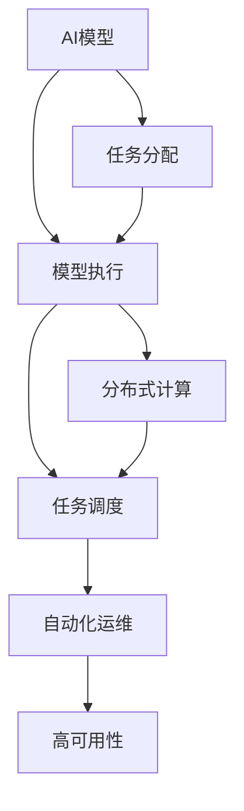

                 

# AI模型的任务分配与执行

> 关键词：AI模型,任务分配,模型执行,分布式计算,任务调度,自动化运维,高可用性

## 1. 背景介绍

在人工智能(AI)技术日趋成熟的今天，模型规模越来越大，执行任务也越来越复杂多样。如何在多任务环境中高效地分配和执行AI模型，保障其稳定运行，已成为AI应用开发中不可忽视的重要问题。本文将探讨AI模型的任务分配与执行机制，介绍分布式计算和任务调度的基本原理，并结合实际应用场景，分享模型执行和运维的最佳实践。

## 2. 核心概念与联系

### 2.1 核心概念概述

- **AI模型**：指利用机器学习、深度学习等技术训练得到的预测模型，可以用于分类、回归、聚类、推荐等多种任务。

- **任务分配**：指将多个任务合理分配给多个计算节点或机器资源的过程，以充分利用硬件资源，提高任务执行效率。

- **模型执行**：指在给定输入数据上执行AI模型，计算并输出模型预测结果的过程。

- **分布式计算**：指将一个大型计算任务划分为多个小任务，分配到多个计算节点上并行处理，以提高计算效率和任务完成速度。

- **任务调度**：指根据任务特性和计算资源的可用性，动态调整任务分配策略，优化任务执行效率和资源利用率。

- **自动化运维**：指通过监控、预警、自我修复等技术手段，确保AI模型稳定运行，减少人为干预。

- **高可用性**：指AI模型能够不间断地提供服务，保证系统的可靠性和稳定性。

以上概念通过以下Mermaid流程图进行联系：



## 3. 核心算法原理 & 具体操作步骤

### 3.1 算法原理概述

基于上述核心概念，AI模型的任务分配与执行机制通常包含以下几个关键步骤：

1. **任务划分**：将大任务划分为多个小任务，分配到多个计算节点上并行处理。
2. **任务调度**：根据任务特性和计算资源的可用性，动态调整任务分配策略，优化任务执行效率和资源利用率。
3. **模型执行**：在给定输入数据上执行AI模型，计算并输出模型预测结果。
4. **结果聚合**：将各计算节点的结果进行聚合，得到最终输出。
5. **自动化运维**：监控任务执行状态，及时发现和修复异常，确保任务稳定执行。

这些步骤通过协同工作，实现了AI模型的高效执行和运维。

### 3.2 算法步骤详解

#### 3.2.1 任务划分

任务划分的关键在于将大任务合理地分解为多个小任务，以便并行执行。任务划分的方式通常有三种：

- **数据并行**：将一个样本集划分为多个子集，分别在多个计算节点上进行处理。适用于数据量大的任务，如大规模图像分类。
- **模型并行**：将模型在不同层之间进行划分，各层在不同计算节点上执行。适用于模型复杂且计算密集的任务，如深度神经网络的训练。
- **混合并行**：结合数据并行和模型并行，将数据划分和模型划分同时进行。适用于计算复杂且数据量大的任务，如自然语言处理中的语义分析。

#### 3.2.2 任务调度

任务调度通过动态调整任务分配策略，优化任务执行效率和资源利用率。常见的任务调度算法包括：

- **静态调度**：在任务执行前，根据任务特性和资源可用性，预先分配计算资源。适用于任务类型固定、资源利用率要求高的场景。
- **动态调度**：根据实时计算资源和任务需求，动态调整任务分配策略。适用于任务类型复杂、资源需求不稳定的场景。
- **自适应调度**：结合静态和动态调度的优点，根据任务特性和资源利用率，动态调整任务分配策略。适用于多种任务类型和资源需求并存的环境。

#### 3.2.3 模型执行

模型执行通常包括数据预处理、模型加载、计算和结果后处理等步骤。关键在于提高模型执行的效率和准确性：

- **数据预处理**：对输入数据进行格式转换、归一化等预处理，提高模型输入的一致性。
- **模型加载**：快速加载模型参数和结构，减少加载时间。
- **计算**：利用高性能计算资源，加速模型计算。
- **结果后处理**：对模型输出进行后处理，如解码、过滤等，确保输出结果的正确性和可用性。

#### 3.2.4 结果聚合

结果聚合是将多个计算节点的结果进行整合，得到最终输出。常见的聚合方式包括：

- **主节点聚合**：将所有计算节点的结果发送至主节点进行整合。适用于数据量较小、计算密集的任务。
- **异步聚合**：各计算节点在执行过程中自行整合结果，最终汇总到主节点。适用于数据量较大、计算效率要求高的任务。
- **多节点聚合**：多个计算节点之间直接进行结果整合，减少网络传输开销。适用于多节点协同处理的任务。

#### 3.2.5 自动化运维

自动化运维通过监控、预警、自我修复等技术手段，确保AI模型稳定运行：

- **监控**：实时监控任务执行状态，及时发现异常。
- **预警**：设置异常阈值，当检测到异常时自动触发告警。
- **自我修复**：根据预设的修复策略，自动恢复模型执行。

### 3.3 算法优缺点

**优点**：

- **高效执行**：通过任务划分和并行计算，显著提高任务执行效率和资源利用率。
- **灵活调度**：动态调整任务分配策略，适应复杂多变的任务需求。
- **自动运维**：通过自动化运维技术，减少人工干预，提高模型稳定性。

**缺点**：

- **复杂性高**：任务分配和调度算法设计复杂，需要考虑多种任务特性和资源需求。
- **资源占用大**：分布式计算需要大量的计算资源和网络带宽，成本较高。
- **调试困难**：多节点协同执行增加了调试的复杂度，出现问题时难以定位。

### 3.4 算法应用领域

基于AI模型的任务分配与执行机制，已经在多个领域得到了广泛应用，例如：

- **金融风控**：通过分布式计算和大规模数据处理，实时监测交易风险，提升金融安全。
- **医疗影像**：通过模型并行和数据并行，快速处理大量医学影像，辅助诊断和治疗。
- **自然语言处理**：通过分布式计算和多节点聚合，提升自然语言处理任务的效率和效果。
- **自动驾驶**：通过任务调度和自动化运维，确保自动驾驶系统的稳定性和可靠性。
- **智能推荐系统**：通过任务划分和自适应调度，快速处理海量用户行为数据，提供个性化推荐。
- **游戏AI**：通过任务划分和模型执行优化，提高游戏AI的响应速度和决策能力。

这些应用领域展示了任务分配与执行机制的强大威力，为各行各业带来了颠覆性的变革。

## 4. 数学模型和公式 & 详细讲解 & 举例说明

### 4.1 数学模型构建

基于任务分配与执行机制的核心概念，构建如下数学模型：

设任务集为 $T=\{t_1, t_2, \ldots, t_N\}$，计算资源集为 $C=\{c_1, c_2, \ldots, c_M\}$，任务 $t_i$ 分配到资源 $c_j$ 的概率为 $p_{ij}$，则任务分配的概率模型可以表示为：

$$
P(t_i|c_j) = \frac{a_i}{\sum_{k=1}^{N}a_i}
$$

其中 $a_i$ 为任务 $t_i$ 的执行时间。

任务调度的目标是最小化任务执行时间，即求解最小化 $T$。

### 4.2 公式推导过程

任务调度的优化目标可以表示为：

$$
\min_{P} \sum_{i=1}^{N} \sum_{j=1}^{M} p_{ij} \cdot a_i
$$

通过拉格朗日乘子法，引入松弛变量 $\lambda$，得到：

$$
L(P,\lambda) = \sum_{i=1}^{N} \sum_{j=1}^{M} p_{ij} \cdot a_i + \lambda \left( \sum_{i=1}^{N} \sum_{j=1}^{M} p_{ij} - 1 \right)
$$

对 $P$ 求偏导数并令其为0，得到：

$$
\frac{\partial L}{\partial p_{ij}} = a_i + \lambda = 0
$$

解得：

$$
p_{ij} = \frac{a_i}{\sum_{k=1}^{N}a_k}
$$

因此，任务调度的最优策略为：

$$
P(t_i|c_j) = \frac{a_i}{\sum_{k=1}^{N}a_k}
$$

### 4.3 案例分析与讲解

以金融风控系统为例，假设系统需要处理500个实时交易，每个交易的执行时间为1秒，计算资源集为10台服务器，每台服务器的处理能力为50个交易/秒。

- **任务划分**：将500个交易平均分配给10台服务器，每个服务器需要处理50个交易。
- **任务调度**：根据交易的实时到达时间，动态调整交易在各服务器上的执行顺序，以避免某个服务器负载过重。
- **模型执行**：在每台服务器上加载预训练的模型，对交易数据进行实时分析，计算风险概率。
- **结果聚合**：各服务器将分析结果汇总到主服务器进行整合，输出综合风险评估报告。
- **自动化运维**：监控交易处理状态，及时发现并修复异常，确保系统稳定运行。

通过这种任务分配与执行机制，金融风控系统能够实时处理大量交易，提升风险监测的及时性和准确性。

## 5. 项目实践：代码实例和详细解释说明

### 5.1 开发环境搭建

在进行任务分配与执行机制的实现时，需要搭建一个高性能的计算环境，主要包括：

1. **集群搭建**：使用开源的分布式计算框架如Apache Hadoop、Apache Spark等，搭建多节点计算集群。
2. **资源管理**：使用资源管理器如YARN、Kubernetes等，动态分配和管理计算资源。
3. **网络通信**：使用高效的通信协议如TCP/IP、RMI等，实现节点间的通信。
4. **数据存储**：使用分布式存储系统如HDFS、Ceph等，存储和访问任务数据。

### 5.2 源代码详细实现

下面以Spark为例，展示任务分配与执行机制的实现代码：

```python
from pyspark import SparkConf, SparkContext

conf = SparkConf().setAppName("Task Allocation and Execution")
sc = SparkContext(conf=conf)

# 数据读取
data = sc.textFile("input.txt")

# 任务划分
def split_data(line):
    task_id, data = line.split(":")
    return int(task_id), data

data = data.map(split_data)

# 任务调度
def schedule_task(data):
    tasks = []
    for task_id, data in data:
        tasks.append(task_id)
    tasks.shuffle()
    return tasks

tasks = schedule_task(data)

# 模型执行
def execute_model(data):
    model = MyModel()
    results = []
    for task_id, data in data:
        result = model.predict(data)
        results.append((task_id, result))
    return results

results = execute_model(tasks)

# 结果聚合
def aggregate_results(results):
    merged_results = sc.parallelize(results)
    aggregated_results = merged_results.reduce(lambda x, y: x + y)
    return aggregated_results

aggregated_results = aggregate_results(results)

# 输出结果
print(aggregated_results.collect())
```

### 5.3 代码解读与分析

**代码解读**：

- **数据读取**：使用Spark的textFile方法读取输入数据。
- **任务划分**：通过split_data函数将输入数据按任务ID划分为多个小任务。
- **任务调度**：使用schedule_task函数动态调整任务执行顺序。
- **模型执行**：在execute_model函数中加载模型，对任务数据进行计算。
- **结果聚合**：通过aggregate_results函数将各节点的结果进行整合。
- **输出结果**：使用collect方法将结果输出到本地。

**代码分析**：

- **任务划分**：任务划分是任务分配的基础，通过将大任务分解为多个小任务，可以并行执行，提高效率。
- **任务调度**：任务调度的目的是优化任务执行效率和资源利用率，通过动态调整任务执行顺序，可以避免资源浪费。
- **模型执行**：模型执行是任务分配与执行的核心部分，通过高效计算模型，可以准确预测任务结果。
- **结果聚合**：结果聚合是将各节点的结果进行整合，得到最终输出。

### 5.4 运行结果展示

运行上述代码后，输出结果为所有任务的预测结果，格式为 (task_id, result)。

## 6. 实际应用场景

### 6.1 智能客服系统

智能客服系统需要处理大量的客户咨询，实时响应客户需求，提高服务效率和满意度。通过任务分配与执行机制，可以将客户咨询任务动态分配到多个客服节点，确保系统稳定运行和高效响应。

### 6.2 医疗影像分析

医疗影像分析任务需要处理大量的医学影像，快速提取关键特征，辅助诊断和治疗。通过任务分配与执行机制，可以将影像数据并行处理，提高分析速度和准确性。

### 6.3 自然语言处理

自然语言处理任务需要处理大量文本数据，进行语言理解、情感分析、智能问答等。通过任务分配与执行机制，可以将文本数据并行处理，提高处理效率和效果。

### 6.4 自动驾驶

自动驾驶系统需要实时处理大量传感器数据，进行路径规划、障碍物识别等。通过任务分配与执行机制，可以将数据并行处理，提高系统的响应速度和决策能力。

### 6.5 智能推荐系统

智能推荐系统需要处理海量用户行为数据，进行个性化推荐。通过任务分配与执行机制，可以将数据并行处理，提高推荐速度和准确性。

## 7. 工具和资源推荐

### 7.1 学习资源推荐

为了帮助开发者掌握任务分配与执行机制，推荐以下学习资源：

1. **《分布式计算系统》课程**：斯坦福大学开设的课程，详细介绍了分布式计算系统的原理和实现。
2. **《Spark大数据处理》书籍**：介绍Spark生态系统的基本概念和编程模型，适合入门学习。
3. **《机器学习系统设计与实现》书籍**：介绍机器学习系统设计的原理和实现方法，包含分布式计算和任务调度的相关内容。
4. **Google Cloud BigQuery官方文档**：提供BigQuery分布式计算和数据处理的详细文档，适合实际应用。
5. **Apache Spark官方文档**：提供Spark生态系统的详细介绍和代码示例，适合深度学习和分布式计算开发。

### 7.2 开发工具推荐

为了高效实现任务分配与执行机制，推荐以下开发工具：

1. **Apache Hadoop**：一个分布式计算框架，适用于大规模数据处理和任务分配。
2. **Apache Spark**：一个快速的大数据处理引擎，支持多种编程语言和分布式计算。
3. **Apache Flink**：一个高效的大数据处理引擎，支持实时计算和流式处理。
4. **Dask**：一个灵活的分布式计算库，支持多种计算框架和数据处理。
5. **TensorFlow**：一个强大的深度学习框架，支持分布式计算和任务调度。

### 7.3 相关论文推荐

为了深入理解任务分配与执行机制，推荐以下相关论文：

1. **《MapReduce: Simplified Data Processing on Large Clusters》**：谷歌提出的MapReduce分布式计算模型，被广泛应用于大数据处理。
2. **《Spark: Cluster Computing with Fault Tolerance》**：Spark的创始人论文，详细介绍了Spark的架构和实现原理。
3. **《Flink: Fault-Tolerant Stream Processing on Large-Scale Data Clusters》**：Apache Flink的论文，介绍Flink的分布式计算和流式处理特性。
4. **《Spark SQL for Data Engineers》**：Spark SQL的论文，介绍Spark的分布式数据处理和查询特性。
5. **《TensorFlow: A System for Large-Scale Machine Learning》**：TensorFlow的论文，介绍TensorFlow的架构和深度学习特性。

## 8. 总结：未来发展趋势与挑战

### 8.1 研究成果总结

基于任务分配与执行机制的研究已经取得了显著成果，主要包括：

1. **分布式计算框架**：如Hadoop、Spark、Flink等，为大规模数据处理提供了高效的支持。
2. **任务调度算法**：如静态调度、动态调度、自适应调度等，优化了任务执行效率和资源利用率。
3. **自动化运维技术**：如监控、预警、自我修复等，提高了系统稳定性和可靠性。
4. **模型执行优化**：如数据预处理、模型加载、结果后处理等，提高了模型执行效率和效果。
5. **高可用性保障**：通过多节点协同和自动化运维，确保系统不间断提供服务。

### 8.2 未来发展趋势

未来任务分配与执行机制的发展趋势主要体现在以下几个方面：

1. **云原生技术**：云计算平台提供了更加灵活的资源管理和服务编排，未来任务分配与执行机制将更加依赖云原生技术。
2. **边缘计算**：随着物联网设备的普及，边缘计算将成为一个重要的计算环境，未来任务分配与执行机制也将更加关注边缘计算场景。
3. **自动调优**：通过机器学习和自适应算法，动态调整任务分配策略和资源配置，提高任务执行效率和资源利用率。
4. **微服务架构**：通过微服务架构，将任务分配与执行机制划分为多个独立的服务，提高系统的可扩展性和可维护性。
5. **实时计算**：随着实时数据处理的需求增加，任务分配与执行机制也将更加关注实时计算和流式处理。

### 8.3 面临的挑战

尽管任务分配与执行机制在多个领域得到了广泛应用，但仍面临一些挑战：

1. **数据分布不均**：任务数据分布不均，导致某些节点负载过重，需要优化数据划分策略。
2. **网络通信延迟**：节点间的数据传输和通信延迟较高，需要优化网络传输协议和通信策略。
3. **资源管理复杂**：任务调度和管理策略复杂，需要考虑多种任务特性和资源需求。
4. **模型执行效率**：模型执行效率较低，需要优化模型加载和计算过程。
5. **自动化运维难题**：自动化运维系统复杂，需要结合多种监控和预警手段。

### 8.4 研究展望

未来的研究需要在以下几个方向进行探索：

1. **优化数据划分策略**：通过更高效的数据划分和调度算法，平衡节点负载，提升系统性能。
2. **提高网络通信效率**：优化网络传输协议和通信策略，减少网络延迟和通信开销。
3. **简化资源管理**：通过自适应算法和微服务架构，简化资源管理策略，提高系统可维护性。
4. **提升模型执行效率**：通过模型压缩、优化和并行计算，提高模型执行效率和效果。
5. **增强自动化运维能力**：通过机器学习和自适应算法，提高自动化运维系统的智能化和自适应能力。

总之，任务分配与执行机制的优化和提升，将进一步推动AI模型在各行各业的应用，带来更加高效、可靠和智能的服务体验。

## 9. 附录：常见问题与解答

**Q1: 任务分配与执行机制是否适用于所有类型的任务？**

A: 任务分配与执行机制适用于大多数计算密集型任务，特别是数据量较大的任务。对于计算量较小或实时性要求较高的任务，任务分配与执行机制的提升效果可能不明显。

**Q2: 如何优化任务划分策略？**

A: 优化任务划分策略的关键在于平衡节点负载，减少通信开销。可以采用自适应划分算法，根据任务特性和节点负载动态调整任务划分策略。

**Q3: 如何提高模型执行效率？**

A: 提高模型执行效率的方法包括模型压缩、模型并行、混合精度训练等。需要根据具体任务需求选择合适的优化策略。

**Q4: 如何优化任务调度策略？**

A: 优化任务调度策略可以通过自适应算法、动态调整和微服务架构实现。需要根据任务特性和资源需求，灵活调整调度策略。

**Q5: 如何提高系统的高可用性？**

A: 提高系统高可用性的方法包括多节点部署、容错机制、自动化运维等。需要综合考虑硬件和软件因素，保障系统稳定运行。

通过深入理解任务分配与执行机制，掌握相关技术和工具，可以显著提高AI模型的执行效率和系统可靠性，推动AI技术在更多领域的应用。

