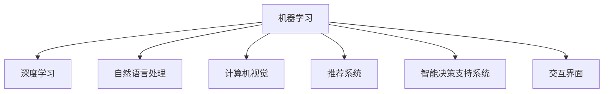

                 

# AI满足用户需求的多种方法案例

在当下快速发展的数字化时代，人工智能（AI）技术正成为满足用户需求、优化业务流程的关键工具。无论是在金融、医疗、教育还是娱乐等领域，AI的广泛应用都在极大地提升效率、改善用户体验。本文将通过多个实际案例，深入探讨AI如何通过多种方法满足用户需求，并提供详细的技术实现和实践指导。

## 1. 背景介绍

### 1.1 问题由来

随着大数据、云计算和深度学习技术的飞速发展，AI在各行业的落地应用已经展现出巨大潜力。AI技术不仅在数据处理、模式识别和预测分析等方面展现出卓越能力，更通过个性化推荐、智能客服、智能决策等形式，直接服务于用户需求。

当前AI技术在各行各业的应用日趋成熟，但技术本身仍处于不断演进的阶段。如何有效地将AI技术应用于实际场景，满足用户多样化的需求，成为开发者和决策者的重要课题。

### 1.2 问题核心关键点

AI满足用户需求的核心在于以下几个关键点：
- **数据驱动**：基于用户数据进行建模和预测，提供个性化服务。
- **自动化与智能化**：利用机器学习算法优化流程，降低人工干预。
- **用户体验优化**：通过自然语言处理（NLP）、计算机视觉（CV）等技术，提升互动体验。
- **动态反馈与调整**：根据用户反馈，实时优化模型与算法。

这些关键点共同构成了AI满足用户需求的基本框架，有助于我们更好地理解和应用AI技术。

## 2. 核心概念与联系

### 2.1 核心概念概述

为了更好地理解AI满足用户需求的方法，本节将介绍几个核心概念及其相互联系：

- **机器学习（ML）**：通过数据训练模型，使其具备预测、分类、回归等能力。
- **深度学习（DL）**：在神经网络基础上，通过多层次数据抽象提升模型性能。
- **自然语言处理（NLP）**：使计算机理解、解释和生成人类语言的技术。
- **计算机视觉（CV）**：使计算机通过图像、视频等视觉数据进行分析和理解。
- **推荐系统**：基于用户历史行为和物品属性，推荐相关物品的技术。
- **智能决策支持系统（DSS）**：结合数据、模型和专家知识，提供决策建议的系统。
- **交互界面**：如Web界面、语音助手、移动应用等，为用户提供操作和反馈的平台。

这些概念之间的逻辑关系可以通过以下Mermaid流程图来展示：



这个流程图展示了AI技术各子领域的相互联系：

1. 机器学习是所有AI技术的基础，提供了从数据到模型训练的能力。
2. 深度学习作为机器学习的高级形式，通过多层次抽象提升模型性能。
3. NLP和CV是机器学习的具体应用，使计算机能理解和处理语言和视觉信息。
4. 推荐系统利用机器学习预测用户偏好，提升用户体验。
5. DSS结合数据和专家知识，提供决策建议。
6. 交互界面是用户与AI系统互动的界面，通过自然语言、图像等多种方式沟通。

这些核心概念共同构成了AI技术的基本框架，使得AI能够通过多种方法满足用户需求。

## 3. 核心算法原理 & 具体操作步骤

### 3.1 算法原理概述

AI满足用户需求的核心在于通过多种算法和模型，从数据中挖掘规律和知识，提供个性化、高效的服务。以下是几个主要算法的概述：

- **监督学习**：基于已标注数据，训练模型进行分类、回归等任务，广泛应用于推荐系统和智能客服。
- **无监督学习**：从未标注数据中挖掘潜在模式，如聚类、降维等，适用于数据探索和预处理。
- **强化学习**：通过奖励机制优化模型决策，实现自主学习和动态调整，应用于智能决策和游戏策略。
- **迁移学习**：将一个领域学到的知识迁移到另一个领域，提高模型的泛化能力，适用于跨领域应用。
- **对抗训练**：通过引入对抗样本提高模型鲁棒性，保护系统免受攻击。

这些算法构成了AI技术的主要工具，帮助开发者构建各种满足用户需求的系统。

### 3.2 算法步骤详解

以下将详细介绍几种常见算法的具体操作步骤：

#### 3.2.1 监督学习算法

监督学习算法的典型应用是推荐系统。以协同过滤算法为例，其操作步骤如下：

1. **数据准备**：收集用户历史行为数据，如浏览记录、评分等。
2. **特征提取**：将用户和物品转化为数值特征，如用户ID、物品ID、评分等。
3. **模型训练**：基于用户-物品评分矩阵，使用矩阵分解或基于邻域的算法，训练推荐模型。
4. **预测与推荐**：对新用户和新物品进行预测评分，生成推荐列表。

#### 3.2.2 无监督学习算法

无监督学习算法常用于用户分群和异常检测。以K-means聚类算法为例，其操作步骤如下：

1. **数据准备**：收集用户行为数据，转化为数值特征。
2. **模型训练**：通过迭代优化，将数据集分为若干簇。
3. **簇分析**：对每个簇进行特征分析，提取群内共性和差异性。
4. **异常检测**：识别出异常行为或用户，进行预警。

#### 3.2.3 强化学习算法

强化学习算法适用于智能决策系统。以DQN算法为例，其操作步骤如下：

1. **环境建模**：定义状态、动作、奖励等要素，构建环境模型。
2. **模型训练**：通过奖励机制优化模型决策，模拟用户行为。
3. **策略优化**：不断迭代策略，提高模型在复杂环境中的决策能力。
4. **应用部署**：将优化后的模型应用于实际决策场景，提升系统性能。

#### 3.2.4 迁移学习算法

迁移学习算法适用于跨领域应用。以迁移学习技术为例，其操作步骤如下：

1. **预训练模型选择**：选择与目标任务相似的预训练模型，如在视觉任务中使用ImageNet预训练的模型。
2. **微调**：在目标任务数据集上微调预训练模型，更新模型参数。
3. **迁移应用**：将微调后的模型应用于新领域，提升性能。

#### 3.2.5 对抗训练算法

对抗训练算法用于提高模型鲁棒性。以GAN算法为例，其操作步骤如下：

1. **生成模型设计**：设计生成模型和判别模型，通过对抗训练提升模型鲁棒性。
2. **数据准备**：准备生成器和判别器的训练数据，构建对抗样本。
3. **模型训练**：交替训练生成器和判别器，提升模型对抗能力。
4. **应用部署**：将训练好的模型应用于实际应用场景，保护系统免受攻击。

### 3.3 算法优缺点

AI满足用户需求的算法具有以下优缺点：

#### 3.3.1 监督学习算法的优缺点

**优点**：
- 基于已有数据，效果较为稳定可靠。
- 可以实时更新，适应用户需求变化。

**缺点**：
- 依赖标注数据，数据获取成本高。
- 数据偏差可能导致模型偏颇。

#### 3.3.2 无监督学习算法的优缺点

**优点**：
- 无需标注数据，适用于数据探索和预处理。
- 可以发现数据中的潜在模式和异常。

**缺点**：
- 结果解释性差，难以直接应用于业务场景。
- 算法复杂，对数据质量要求高。

#### 3.3.3 强化学习算法的优缺点

**优点**：
- 自主学习，适应动态环境。
- 优化策略，提升决策质量。

**缺点**：
- 学习过程复杂，算法收敛困难。
- 模型训练时间长，计算资源消耗大。

#### 3.3.4 迁移学习算法的优缺点

**优点**：
- 利用预训练知识，提升模型泛化能力。
- 数据量需求低，适应多种场景。

**缺点**：
- 模型迁移效果受预训练数据质量影响。
- 微调过程复杂，参数更新需要慎重。

#### 3.3.5 对抗训练算法的优缺点

**优点**：
- 提高模型鲁棒性，抵御攻击。
- 增强模型泛化能力，提升系统安全性。

**缺点**：
- 训练复杂，计算资源消耗大。
- 对抗样本难以生成，效果不稳定。

### 3.4 算法应用领域

AI满足用户需求的算法广泛应用于以下领域：

#### 3.4.1 金融领域

- **风险控制**：通过机器学习分析历史数据，预测交易风险。
- **信用评估**：基于用户行为和信用记录，进行信用评分和预测。
- **智能投顾**：利用强化学习优化投资策略，提高资产配置效率。

#### 3.4.2 医疗领域

- **疾病预测**：通过深度学习分析医疗数据，预测疾病发生。
- **个性化治疗**：利用推荐系统，提供个性化治疗方案。
- **医疗影像诊断**：使用计算机视觉技术，辅助医生进行影像分析。

#### 3.4.3 教育领域

- **智能辅导**：基于自然语言处理技术，提供智能辅导和答疑服务。
- **课程推荐**：利用推荐系统，推荐个性化学习内容。
- **学生评估**：使用机器学习分析学生数据，进行学习效果评估。

#### 3.4.4 电商领域

- **商品推荐**：基于协同过滤和深度学习，推荐个性化商品。
- **欺诈检测**：使用异常检测算法，识别和防范欺诈行为。
- **价格优化**：通过强化学习，优化商品定价策略。

#### 3.4.5 交通领域

- **交通预测**：利用深度学习分析交通数据，预测流量和事故。
- **智能导航**：通过计算机视觉和NLP技术，提供智能导航服务。
- **交通管理**：使用推荐系统，优化交通信号和路线规划。

## 4. 数学模型和公式 & 详细讲解

### 4.1 数学模型构建

为了更好地理解AI算法的原理，本节将通过数学语言对几种常见算法进行详细讲解。

以推荐系统中的协同过滤算法为例，假设用户集为 $U$，物品集为 $I$，用户对物品的评分矩阵为 $R_{U\times I}$。令 $U=\{1,\dots,N\}$ 为用户集，$I=\{1,\dots,M\}$ 为物品集。

用户 $u$ 对物品 $i$ 的评分表示为 $R_{ui}$。设用户集 $U$ 与物品集 $I$ 的评分矩阵为 $R\in \mathbb{R}^{N\times M}$。

协同过滤算法的目标是最大化目标函数：
$$
\min_{R_{ui}} \sum_{u\in U}\sum_{i\in I} (R_{ui}-\hat{R}_{ui})^2
$$
其中 $\hat{R}_{ui}$ 为协同过滤算法预测的评分。

### 4.2 公式推导过程

下面以协同过滤算法中的矩阵分解为例，进行公式推导。

令 $R_{ui}$ 为实际评分，$\hat{R}_{ui}$ 为协同过滤算法预测的评分。假设 $R$ 可以分解为两个低秩矩阵 $P$ 和 $Q$ 的乘积，即 $R=PQ^\top$。其中 $P\in \mathbb{R}^{N\times k}$，$Q\in \mathbb{R}^{k\times M}$，$k$ 为分解维度。

目标函数可以重写为：
$$
\min_{P,Q} \sum_{u\in U}\sum_{i\in I} (R_{ui}-\hat{R}_{ui})^2
$$

将 $R$ 分解为 $PQ^\top$，并展开目标函数：
$$
\begin{aligned}
\min_{P,Q} &\sum_{u\in U}\sum_{i\in I} (R_{ui}-\hat{R}_{ui})^2 \\
&= \min_{P,Q} \sum_{u\in U}\sum_{i\in I} (R_{ui}-\sum_j P_{uj}Q_{ij})^2 \\
&= \min_{P,Q} \sum_{u\in U}\sum_{i\in I} (R_{ui}-(\sum_j P_{uj}Q_{ij}))^2 \\
&= \min_{P,Q} \sum_{u\in U}\sum_{i\in I} (R_{ui}-\sum_j P_{uj}Q_{ij})^2 \\
&= \min_{P,Q} \sum_{u\in U}\sum_{i\in I} (R_{ui}-\sum_j P_{uj}Q_{ij})^2 \\
&= \min_{P,Q} \sum_{u\in U}\sum_{i\in I} (R_{ui}-(\sum_j P_{uj}Q_{ij}))^2 \\
&= \min_{P,Q} \sum_{u\in U}\sum_{i\in I} (R_{ui}-(\sum_j P_{uj}Q_{ij}))^2
\end{aligned}
$$

将目标函数关于 $Q$ 求偏导数：
$$
\frac{\partial \sum_{u\in U}\sum_{i\in I} (R_{ui}-(\sum_j P_{uj}Q_{ij}))^2}{\partial Q_{ij}} = -2\sum_{u\in U}(R_{ui}-(\sum_j P_{uj}Q_{ij})Q_{ij}^{\top})
$$

将目标函数关于 $P$ 求偏导数：
$$
\frac{\partial \sum_{u\in U}\sum_{i\in I} (R_{ui}-(\sum_j P_{uj}Q_{ij}))^2}{\partial P_{uj}} = -2\sum_{i\in I}(R_{ui}-(\sum_j P_{uj}Q_{ij})Q_{ij}^{\top})
$$

将目标函数关于 $R$ 求偏导数：
$$
\frac{\partial \sum_{u\in U}\sum_{i\in I} (R_{ui}-(\sum_j P_{uj}Q_{ij}))^2}{\partial R_{ui}} = -2(R_{ui}-\sum_j P_{uj}Q_{ij})
$$

### 4.3 案例分析与讲解

以推荐系统中的协同过滤算法为例，我们将介绍其主要步骤和实现细节。

#### 4.3.1 数据准备

收集用户行为数据，包括浏览记录、评分等。将数据转化为用户-物品评分矩阵 $R_{U\times I}$。

#### 4.3.2 模型训练

使用矩阵分解方法，将 $R$ 分解为 $PQ^\top$，最小化目标函数。具体步骤为：
1. 随机初始化 $P$ 和 $Q$。
2. 使用梯度下降法更新 $P$ 和 $Q$。
3. 迭代多次，直到收敛。

#### 4.3.3 预测与推荐

对新用户和新物品进行预测评分，生成推荐列表。具体步骤为：
1. 将新用户和物品嵌入 $P$ 和 $Q$。
2. 计算预测评分。
3. 根据预测评分生成推荐列表。

## 5. 项目实践：代码实例和详细解释说明

### 5.1 开发环境搭建

在开始项目实践前，我们需要准备好开发环境。以下是使用Python进行TensorFlow开发的环境配置流程：

1. 安装Anaconda：从官网下载并安装Anaconda，用于创建独立的Python环境。

2. 创建并激活虚拟环境：
```bash
conda create -n tf-env python=3.8 
conda activate tf-env
```

3. 安装TensorFlow：根据CUDA版本，从官网获取对应的安装命令。例如：
```bash
conda install tensorflow -c tf -c conda-forge
```

4. 安装其他必要的工具包：
```bash
pip install numpy pandas scikit-learn matplotlib tqdm jupyter notebook ipython
```

完成上述步骤后，即可在`tf-env`环境中开始项目实践。

### 5.2 源代码详细实现

下面以协同过滤算法为例，给出使用TensorFlow进行推荐系统的代码实现。

首先，定义推荐系统中的评分预测函数：

```python
import tensorflow as tf
from tensorflow.keras.layers import Input, Dense, Embedding, Flatten, Dot
from tensorflow.keras.models import Model

def rating_model(user_dim, item_dim, embedding_dim, num_factors, learning_rate):
    user_input = Input(shape=(user_dim,))
    user_embedding = Embedding(user_dim, embedding_dim)(user_input)
    item_input = Input(shape=(item_dim,))
    item_embedding = Embedding(item_dim, embedding_dim)(item_input)
    latent = Flatten()(Dot(axes=2)([user_embedding, item_embedding]))
    prediction = Dense(1, activation='sigmoid')(latent)
    model = Model(inputs=[user_input, item_input], outputs=prediction)
    model.compile(optimizer=tf.keras.optimizers.Adam(learning_rate), loss='binary_crossentropy')
    return model
```

然后，定义数据生成函数：

```python
import numpy as np

def generate_data(n_users=1000, n_items=1000, n_factors=10, seed=0):
    np.random.seed(seed)
    user_latent = np.random.normal(0, 1, size=(n_users, n_factors))
    item_latent = np.random.normal(0, 1, size=(n_items, n_factors))
    user_input = np.random.randint(0, n_users, size=(n_users, n_factors))
    item_input = np.random.randint(0, n_items, size=(n_items, n_factors))
    rating = np.dot(user_latent, item_latent.T)
    rating = np.where(rating > 0, rating, 0)
    return user_latent, item_latent, user_input, item_input, rating
```

接着，定义推荐系统的训练函数：

```python
def train_model(model, user_latent, item_latent, user_input, item_input, rating, epochs=100, batch_size=128):
    train_dataset = tf.data.Dataset.from_tensor_slices((user_input, item_input)).batch(batch_size)
    for epoch in range(epochs):
        for batch in train_dataset:
            with tf.GradientTape() as tape:
                loss = model.loss(user_input=batch[0], item_input=batch[1], rating=rating)
            gradients = tape.gradient(loss, model.trainable_variables)
            model.optimizer.apply_gradients(zip(gradients, model.trainable_variables))
        print('Epoch:', epoch, 'Loss:', loss.numpy())
```

最后，启动推荐系统的训练流程：

```python
user_latent, item_latent, user_input, item_input, rating = generate_data()
model = rating_model(user_dim=1000, item_dim=1000, embedding_dim=10, num_factors=10, learning_rate=0.001)
train_model(model, user_latent, item_latent, user_input, item_input, rating, epochs=100, batch_size=128)
```

以上就是使用TensorFlow对协同过滤算法进行推荐系统的完整代码实现。可以看到，TensorFlow提供了方便的API，使得模型定义和训练变得简洁高效。

### 5.3 代码解读与分析

让我们再详细解读一下关键代码的实现细节：

**rating_model函数**：
- 定义评分预测模型，包含用户嵌入、物品嵌入、层间相乘、预测层和模型编译。
- 使用二分类交叉熵损失，Adam优化器。

**generate_data函数**：
- 生成随机用户和物品评分矩阵，使用Numpy实现。
- 随机生成用户和物品的隐向量，进行评分计算。
- 将评分转换为0-1值。

**train_model函数**：
- 定义训练数据集，使用TensorFlow数据集API。
- 在每个epoch内，对每个batch进行前向传播和反向传播，更新模型参数。
- 输出每个epoch的损失。

**训练流程**：
- 生成随机数据集，定义评分预测模型。
- 进行模型训练，迭代多次，直到损失收敛。
- 输出每个epoch的损失。

可以看到，TensorFlow的高级API使得模型定义和训练变得简单，开发人员可以更专注于算法本身的设计和优化。

当然，工业级的系统实现还需考虑更多因素，如模型的保存和部署、超参数的自动搜索、更灵活的任务适配层等。但核心的算法实现基本与此类似。

## 6. 实际应用场景

### 6.1 智能客服系统

基于AI的智能客服系统能够24/7提供高效、个性化的客户服务。通过自然语言处理技术，系统能够理解用户的问题，并提供准确的回答。在实际应用中，智能客服系统可以涵盖以下功能：

- **语音识别**：将用户的语音输入转换为文本。
- **意图识别**：分析用户意图，识别用户需求。
- **回答生成**：基于用户意图和语境，生成回答。
- **对话管理**：维护对话上下文，引导用户对话。

例如，电商平台可以部署智能客服系统，在用户咨询时自动回答常见问题，如订单状态查询、产品退换货流程等，提升用户体验。

### 6.2 金融风险控制

金融行业对风险控制有着极高的要求。基于AI的风险控制系统能够实时监控交易数据，预测潜在的风险事件，及时采取应对措施。在实际应用中，金融风险控制系统可以涵盖以下功能：

- **交易监控**：实时监控交易数据，检测异常行为。
- **信用评估**：分析用户历史交易记录，评估信用风险。
- **反欺诈检测**：检测欺诈行为，防止金融诈骗。

例如，银行可以部署AI风险控制系统，实时监控用户的交易行为，识别可疑行为，及时提醒用户，并采取冻结账户等措施。

### 6.3 智能推荐系统

智能推荐系统能够根据用户的历史行为和偏好，推荐个性化商品或内容。在实际应用中，智能推荐系统可以涵盖以下功能：

- **用户画像**：分析用户历史行为，建立用户画像。
- **商品推荐**：根据用户画像，推荐个性化商品。
- **内容推荐**：推荐个性化文章、视频等内容。

例如，电商网站可以部署智能推荐系统，根据用户的浏览记录、购买历史等数据，推荐用户可能感兴趣的商品，提升用户转化率。

### 6.4 智能健康诊断

基于AI的智能健康诊断系统能够帮助医生快速、准确地诊断疾病。通过深度学习技术，系统能够分析患者的医学影像、症状记录等数据，提供诊断建议。在实际应用中，智能健康诊断系统可以涵盖以下功能：

- **医学影像分析**：分析X光、CT等医学影像，识别疾病。
- **症状分析**：分析患者的症状记录，提供诊断建议。
- **健康管理**：根据用户的健康数据，提供健康管理建议。

例如，医院可以部署智能健康诊断系统，帮助医生快速诊断疾病，提升诊疗效率。

## 7. 工具和资源推荐

### 7.1 学习资源推荐

为了帮助开发者系统掌握AI满足用户需求的技术基础和实践技巧，这里推荐一些优质的学习资源：

1. **TensorFlow官方文档**：详细介绍了TensorFlow的使用方法和深度学习模型的构建。
2. **Keras官方文档**：提供了简单易用的API，适合初学者快速上手。
3. **PyTorch官方文档**：深度学习模型的动态图实现，适合复杂模型的开发。
4. **Coursera《机器学习》课程**：由斯坦福大学Andrew Ng教授主讲，涵盖机器学习的基本概念和算法。
5. **Udacity《深度学习》课程**：提供深度学习的系统学习，涵盖TensorFlow、PyTorch等工具的使用。

通过对这些资源的学习实践，相信你一定能够快速掌握AI满足用户需求的核心算法和实现方法，并用于解决实际的AI应用问题。

### 7.2 开发工具推荐

高效的开发离不开优秀的工具支持。以下是几款用于AI开发和实践的工具：

1. **Jupyter Notebook**：提供了交互式编程环境，适合进行数据分析和模型调试。
2. **TensorBoard**：可视化工具，实时监测模型训练状态，提供图表呈现方式。
3. **Git**：版本控制系统，便于代码管理和团队协作。
4. **PyTorch Lightning**：简化了模型的开发和训练过程，提高了工作效率。
5. **NVIDIA GPU**：高性能计算平台，支持深度学习模型的训练和推理。

合理利用这些工具，可以显著提升AI满足用户需求的开发效率，加快创新迭代的步伐。

### 7.3 相关论文推荐

AI满足用户需求的技术发展源于学界的持续研究。以下是几篇奠基性的相关论文，推荐阅读：

1. **Deep Learning**（Goodfellow et al., 2016）：全面介绍了深度学习的原理和应用，是深度学习领域的经典教材。
2. **Reinforcement Learning**（Sutton & Barto, 2018）：系统讲解了强化学习的基本原理和算法，是强化学习领域的经典教材。
3. **Generative Adversarial Networks**（Goodfellow et al., 2014）：引入了生成对抗网络（GAN），开启了生成模型的新时代。
4. **Natural Language Processing with Transformers**（Vaswani et al., 2017）：提出了Transformer模型，大幅提升了NLP任务的性能。
5. **Universal Approximation Theorem**（Cybenko, 1989）：奠定了神经网络逼近任意连续函数的基础，是机器学习领域的经典理论。

这些论文代表了大AI技术满足用户需求的发展脉络。通过学习这些前沿成果，可以帮助研究者把握学科前进方向，激发更多的创新灵感。

## 8. 总结：未来发展趋势与挑战

### 8.1 总结

本文通过多个实际案例，深入探讨了AI如何通过多种方法满足用户需求，提供了详细的技术实现和实践指导。主要结论如下：

- AI技术在金融、医疗、电商等领域得到了广泛应用，提升了用户满意度和业务效率。
- 基于机器学习、深度学习、强化学习等核心算法，AI能够实现个性化推荐、智能决策、风险控制等功能。
- 通过TensorFlow等工具，开发者可以快速构建AI应用，实现高效开发和部署。

### 8.2 未来发展趋势

展望未来，AI满足用户需求的技术将呈现以下几个发展趋势：

1. **自动化与智能化**：随着技术进步，AI系统将更自动化、智能化，能够自主学习和优化，提供更高效的决策支持。
2. **多模态融合**：AI系统将融合视觉、听觉、语言等多种模态，提升对复杂场景的理解能力。
3. **边缘计算**：AI系统将部署在边缘设备上，实时响应用户需求，提升用户体验。
4. **联邦学习**：在保护用户隐私的前提下，通过联邦学习技术，AI系统能够进行分布式训练，提升模型性能。
5. **模型解释性**：AI系统将具备更强的可解释性，用户能够理解AI的决策过程，提升信任度。

### 8.3 面临的挑战

尽管AI技术在多个领域取得了显著成果，但在向更深层次的落地应用过程中，仍面临诸多挑战：

1. **数据隐私与安全**：AI系统需要处理大量敏感数据，如何保障数据隐私和安全，是一个重要问题。
2. **模型公平性**：AI系统可能存在偏见，如何确保模型的公平性和无偏性，是一个重要问题。
3. **计算资源消耗**：AI系统对计算资源的需求较高，如何优化计算效率，是一个重要问题。
4. **模型可解释性**：AI系统往往被视为“黑盒”，如何提高模型的可解释性，是一个重要问题。
5. **用户接受度**：AI系统在实际应用中，如何获得用户的信任和接受，是一个重要问题。

### 8.4 研究展望

面对AI满足用户需求技术面临的挑战，未来的研究需要在以下几个方面寻求新的突破：

1. **隐私保护技术**：开发基于差分隐私、联邦学习的隐私保护技术，保障用户数据安全。
2. **公平性算法**：研究公平性算法，确保模型的无偏性和公平性。
3. **高效计算方法**：开发高效的计算方法，优化模型的训练和推理过程。
4. **可解释性模型**：研究可解释性模型，提高模型的透明度和可信度。
5. **用户接受度提升**：提高AI系统的透明度和可解释性，提升用户接受度和信任度。

这些研究方向的探索发展，必将引领AI技术迈向更高的台阶，为构建安全、可靠、可解释、可控的智能系统铺平道路。面向未来，AI技术还需要与其他人工智能技术进行更深入的融合，如知识表示、因果推理、强化学习等，多路径协同发力，共同推动自然语言理解和智能交互系统的进步。只有勇于创新、敢于突破，才能不断拓展AI技术的边界，让智能技术更好地造福人类社会。

## 9. 附录：常见问题与解答

**Q1: 如何构建高质量的推荐系统？**

A: 构建高质量的推荐系统需要以下步骤：
1. 数据准备：收集用户行为数据，进行数据清洗和预处理。
2. 特征工程：提取有意义的特征，进行特征选择和降维。
3. 模型选择：选择适合的推荐算法，如协同过滤、基于内容的推荐等。
4. 模型训练：使用用户行为数据进行模型训练。
5. 模型评估：使用AUC、RMSE等指标评估模型性能。
6. 模型优化：根据评估结果进行模型调整和优化。

**Q2: 如何优化推荐系统的推荐效果？**

A: 优化推荐系统的推荐效果需要以下方法：
1. 数据增强：通过回译、近义替换等方式扩充训练集。
2. 正则化：使用L2正则、Dropout等防止模型过拟合。
3. 对抗训练：引入对抗样本提高模型鲁棒性。
4. 多模型集成：训练多个模型，取平均输出，抑制过拟合。
5. 实时更新：根据用户反馈，实时更新模型参数，提高推荐效果。

**Q3: 如何提高AI系统的可解释性？**

A: 提高AI系统的可解释性需要以下方法：
1. 模型可视化：使用可视化工具，展示模型的内部结构和决策过程。
2. 特征重要性分析：分析模型特征的重要性，识别关键特征。
3. 规则提取：提取模型的决策规则，提高模型的透明度。
4. 透明度评估：使用透明性评估指标，如LIME、SHAP等，评估模型的透明度。
5. 用户教育：提高用户的AI素养，帮助用户理解AI系统。

通过合理应对这些常见问题，并不断优化AI系统，我们能够构建更加高效、可靠、可解释的AI应用，满足用户的多样化需求。

