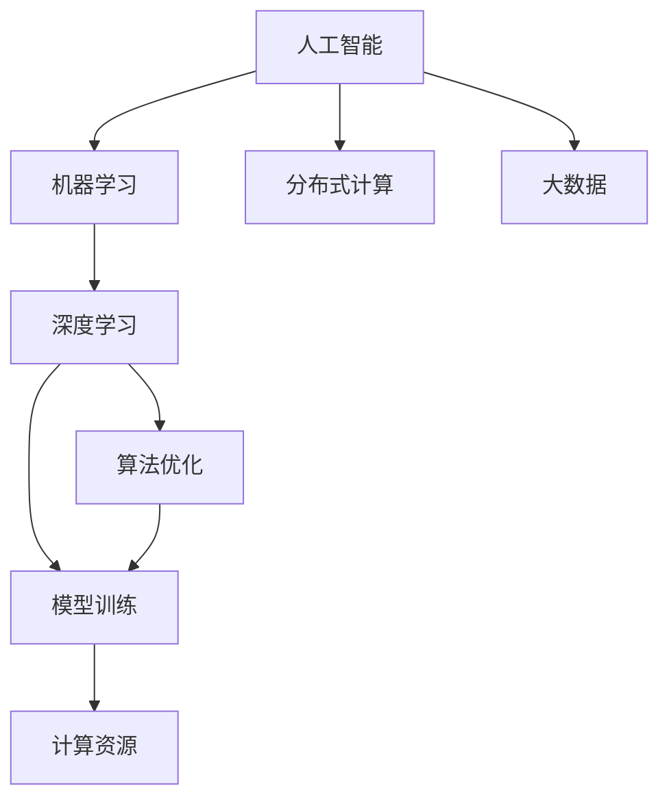

                 

# AI算法、算力与大数据的结合

> 关键词：人工智能,机器学习,深度学习,分布式计算,大数据,算法优化,模型训练,深度学习框架,性能优化

## 1. 背景介绍

### 1.1 问题由来

随着科技的迅猛发展，人工智能（AI）技术逐渐成为驱动经济、社会、科技等领域进步的重要力量。特别是在机器学习、深度学习等领域的突破，使得AI在图像识别、自然语言处理、语音识别、推荐系统等众多领域取得了显著的成果。然而，随着数据量和计算复杂度的持续增加，AI的算法、算力与数据之间的矛盾也日益突出，成为制约AI发展的关键因素。

具体而言，算法、算力与数据之间的关系主要体现在以下几个方面：
1. 数据驱动的算法设计：AI模型的训练与优化高度依赖于数据的特性与规模。
2. 算力支撑的模型训练：高效的模型训练需要强大的计算资源，而大规模计算需要分布式计算架构的支撑。
3. 算法与算力的协同优化：优化算法的性能以适应有限的计算资源，同时开发高效的算力架构以支撑大规模模型的训练。

### 1.2 问题核心关键点

对于AI算法、算力与大数据的结合，以下是几个关键问题：
1. 如何设计高效算法以适应大规模数据？
2. 如何利用分布式计算提升模型训练效率？
3. 如何优化模型训练过程中的资源使用？
4. 如何构建可扩展的AI训练系统架构？
5. 如何实现高效的算法与算力的协同优化？

这些核心问题共同构成AI算法、算力与大数据结合的核心内容，其解决思路和方法直接影响到AI技术的应用深度和广度。

## 2. 核心概念与联系

### 2.1 核心概念概述

为更好地理解AI算法、算力与大数据的结合，本节将介绍几个密切相关的核心概念：

- **人工智能（AI）**：基于数据、算法与算力进行模拟、延伸与扩展人类智能的技术领域。
- **机器学习（ML）**：通过让机器从数据中学习，进而完成特定任务的过程。
- **深度学习（DL）**：一种特殊的机器学习方法，通过多层神经网络模拟人脑的神经系统，处理复杂数据与任务。
- **分布式计算**：通过将计算任务分配到多个计算机节点上进行并行处理，以提升计算效率。
- **大数据**：指超出传统数据处理应用范围的海量、高速度、多样化数据集合，需要进行特殊的数据处理技术与分析工具。
- **算法优化**：针对特定任务或数据，通过调整算法参数或结构以提高算法效率与性能。
- **模型训练**：通过大量数据与计算资源，训练AI模型以实现特定任务的能力。

这些核心概念之间的逻辑关系可以通过以下Mermaid流程图来展示：



这个流程图展示了大数据、分布式计算、深度学习、算法优化与模型训练之间的逻辑关系：

1. 大数据为深度学习算法提供了丰富的训练数据。
2. 分布式计算提升了模型训练的效率，能够处理大规模数据集。
3. 算法优化旨在提高深度学习算法的效率和性能。
4. 模型训练将优化后的算法应用于实际数据，获得高效的模型。

这些概念共同构成了AI算法、算力与大数据结合的基础框架，使其能够高效地从数据中学习和优化，实现复杂的智能任务。

## 3. 核心算法原理 & 具体操作步骤
### 3.1 算法原理概述

AI算法、算力与大数据的结合，核心在于设计和优化能够高效处理大规模数据的算法，同时利用分布式计算和优化算力架构，提升模型训练的效率与性能。

**核心算法原理**：
1. **数据驱动的算法设计**：设计算法时需要考虑数据的特性与规模，如数据的分布、维度、特征复杂度等，以提高算法的泛化能力与准确性。
2. **分布式计算**：通过将计算任务分配到多个计算机节点上进行并行处理，以提高计算效率，降低单个节点的计算负担。
3. **模型训练的优化**：利用梯度下降、随机梯度下降（SGD）等优化算法，同时引入自适应学习率（如AdamW）等技术，以加快模型的收敛速度，提高训练的稳定性与效率。
4. **资源管理与调度**：合理分配计算资源，优化资源使用，如使用资源管理工具（如Kubernetes）进行任务调度和资源分配。

**具体操作步骤**：
1. **数据预处理**：对大规模数据进行清洗、归一化、特征工程等预处理，减少数据噪声，提高数据质量。
2. **分布式计算框架搭建**：选择合适的分布式计算框架（如Apache Spark、TensorFlow、PyTorch等），构建分布式计算集群。
3. **算法设计**：设计或选择合适的深度学习算法，如卷积神经网络（CNN）、循环神经网络（RNN）、变压器（Transformer）等，根据数据特性进行调参与优化。
4. **模型训练**：将数据集划分为训练集、验证集与测试集，选择合适的训练参数与优化算法，进行大规模模型训练。
5. **性能评估与优化**：在验证集上进行性能评估，根据评估结果调整训练参数与算法结构，优化模型性能。

### 3.2 算法步骤详解

以下是具体的AI算法、算力与大数据结合的操作步骤：

**Step 1: 数据预处理**
1. **数据清洗**：去除异常值、重复数据、噪声数据等，提高数据质量。
2. **数据归一化**：对数据进行归一化处理，使其符合模型训练的数值范围。
3. **特征工程**：根据任务需求，对数据进行特征提取与工程化，生成有用的特征。

**Step 2: 分布式计算框架搭建**
1. **分布式计算框架选择**：选择合适的分布式计算框架，如Apache Spark、TensorFlow、PyTorch等，搭建分布式计算集群。
2. **计算节点配置**：根据任务需求配置计算节点的数量与计算能力，确保足够的计算资源。
3. **分布式计算编程**：使用分布式计算框架提供的API进行编程，实现分布式计算逻辑。

**Step 3: 算法设计**
1. **算法选择**：根据数据特性与任务需求选择合适的深度学习算法，如CNN、RNN、Transformer等。
2. **模型构建**：使用深度学习框架构建模型，设置模型的结构与参数。
3. **算法优化**：通过调整算法参数与结构，优化算法性能，如使用自适应学习率、梯度截断等技术。

**Step 4: 模型训练**
1. **数据划分**：将数据集划分为训练集、验证集与测试集，确保各集的数据分布一致。
2. **训练参数设置**：选择合适的训练参数，如学习率、批大小、迭代轮数等。
3. **模型训练**：使用分布式计算框架进行大规模模型训练，记录训练过程中的各项指标。

**Step 5: 性能评估与优化**
1. **验证集评估**：在验证集上进行性能评估，计算模型在验证集上的准确率、精确率、召回率等指标。
2. **模型优化**：根据评估结果，调整训练参数与算法结构，优化模型性能。
3. **测试集评估**：在测试集上进行性能评估，最终确定模型的性能指标。

### 3.3 算法优缺点

AI算法、算力与大数据结合的方法具有以下优点：
1. 高效处理大规模数据：通过分布式计算，能够高效处理海量数据，提高计算效率。
2. 模型训练速度快：采用分布式计算与优化算法，能够快速训练大规模模型，缩短模型训练时间。
3. 提升模型性能：通过算法优化与参数调优，能够提高模型的泛化能力与准确性。
4. 可扩展性强：分布式计算架构能够根据计算需求动态扩展，适应不同规模的数据集。

但同时，该方法也存在以下缺点：
1. 对计算资源依赖高：需要足够的计算资源与存储资源，适用于大规模数据集。
2. 分布式计算复杂度高：分布式计算需要考虑节点配置、数据同步、任务调度和资源管理等复杂问题。
3. 模型参数量大：大规模模型的参数量巨大，需要高效的算法与计算架构支持。
4. 数据预处理复杂：大规模数据集需要进行复杂的数据清洗与特征工程，处理难度较大。

尽管存在这些局限性，但就目前而言，AI算法、算力与大数据结合的方法在处理大规模数据与复杂任务方面具有显著的优势，是当前AI技术研究与应用的重要范式。未来相关研究的重点在于如何进一步降低计算资源依赖，提高算法的可扩展性与可优化性，同时兼顾模型的泛化能力与计算效率。

### 3.4 算法应用领域

AI算法、算力与大数据结合的方法，已经在多个领域得到广泛应用，例如：

- **图像识别**：如人脸识别、物体识别、图像分类等。通过大规模数据集进行预训练与微调，提升了图像识别的准确性与鲁棒性。
- **自然语言处理（NLP）**：如文本分类、情感分析、机器翻译等。通过分布式计算与优化算法，提高了NLP任务的处理速度与性能。
- **推荐系统**：如电商平台推荐、新闻推荐、音乐推荐等。通过算法优化与分布式计算，提升了推荐系统的推荐效果与用户体验。
- **金融分析**：如风险评估、信用评分、欺诈检测等。通过大数据分析与深度学习算法，提高了金融分析的准确性与效率。
- **医疗健康**：如疾病诊断、基因分析、医学影像等。通过分布式计算与算法优化，提升了医疗健康的分析与预测能力。
- **智能制造**：如设备预测维护、质量控制、供应链优化等。通过AI技术与大数据分析，提高了智能制造的自动化与智能化水平。

除了上述这些经典应用外，AI算法、算力与大数据结合的方法还在智慧城市、环境保护、农业科技等更多领域得到创新性的应用，为各行各业带来了新的变革与机遇。

## 4. 数学模型和公式 & 详细讲解 & 举例说明

### 4.1 数学模型构建

为更好地理解AI算法、算力与大数据结合的具体操作过程，本节将使用数学语言对相关模型进行详细构建与推导。

**数据预处理数学模型**：
设原始数据集为 $\mathcal{D}=\{x_1, x_2, ..., x_N\}$，其中 $x_i \in \mathbb{R}^d$ 为第 $i$ 个数据样本。预处理步骤包括：

1. **数据清洗**：移除异常数据 $x_{outlier}$，剩余数据集 $\mathcal{D}_{clean}$。
2. **数据归一化**：将数据归一化到 $[0, 1]$ 范围内，使用标准化公式 $\frac{x_i - \mu}{\sigma}$，其中 $\mu$ 为均值，$\sigma$ 为标准差。
3. **特征工程**：引入新的特征 $\mathcal{F}$，生成特征集合 $\mathcal{X}$，其中 $\mathcal{X} = \{x_i \times f_1(x_i), x_i \times f_2(x_i), ..., x_i \times f_M(x_i)\}$，$f_1, f_2, ..., f_M$ 为特征函数。

**分布式计算数学模型**：
设分布式计算框架集群的节点数量为 $K$，每个节点的计算能力为 $C$，计算任务总量为 $T$。分布式计算步骤包括：

1. **任务划分**：将总任务 $T$ 划分为 $K$ 个并行子任务 $T_k$，满足 $T_k = \frac{T}{K}$。
2. **任务调度**：根据任务负载均衡原则，将子任务分配给各个节点进行并行计算。
3. **结果汇总**：节点将计算结果汇总，生成最终结果 $\mathcal{R}$。

**算法优化数学模型**：
设模型参数为 $\theta$，损失函数为 $\mathcal{L}(\theta)$，优化算法为 $\mathcal{O}$。算法优化步骤包括：

1. **模型构建**：使用深度学习框架构建模型，设置模型的结构与参数。
2. **损失函数计算**：使用损失函数计算模型在训练集上的损失，$\mathcal{L}(\theta) = \frac{1}{N} \sum_{i=1}^N \ell(\mathcal{H}(x_i), y_i)$，其中 $\mathcal{H}(x_i)$ 为模型在 $x_i$ 上的输出，$y_i$ 为真实标签。
3. **优化算法更新**：使用优化算法更新模型参数，$\theta \leftarrow \theta - \eta \nabla_{\theta} \mathcal{L}(\theta)$，其中 $\eta$ 为学习率，$\nabla_{\theta} \mathcal{L}(\theta)$ 为损失函数对模型参数的梯度。

**模型训练数学模型**：
设数据集划分为训练集 $\mathcal{D}_{train}$、验证集 $\mathcal{D}_{val}$ 与测试集 $\mathcal{D}_{test}$，训练参数为 $\mathcal{P}$，模型训练步骤包括：

1. **模型初始化**：随机初始化模型参数 $\theta$。
2. **训练迭代**：在每个迭代 $i$ 中，计算损失函数 $\mathcal{L}(\theta)$ 并计算梯度 $\nabla_{\theta} \mathcal{L}(\theta)$，使用优化算法更新模型参数 $\theta$。
3. **验证集评估**：在每个迭代 $i$ 中，在验证集 $\mathcal{D}_{val}$ 上计算模型性能指标，如准确率、精确率、召回率等。
4. **测试集评估**：在训练完成后，在测试集 $\mathcal{D}_{test}$ 上计算模型性能指标，确定最终模型参数。

### 4.2 公式推导过程

以下是具体的AI算法、算力与大数据结合的数学模型推导过程：

**数据预处理公式推导**：
设原始数据集为 $\mathcal{D}=\{x_1, x_2, ..., x_N\}$，其中 $x_i \in \mathbb{R}^d$ 为第 $i$ 个数据样本。预处理步骤包括：

1. **数据清洗**：移除异常数据 $x_{outlier}$，剩余数据集 $\mathcal{D}_{clean}=\{x_1', x_2', ..., x_N'\}$。
2. **数据归一化**：将数据归一化到 $[0, 1]$ 范围内，使用标准化公式 $\frac{x_i - \mu}{\sigma}$，其中 $\mu$ 为均值，$\sigma$ 为标准差。
3. **特征工程**：引入新的特征 $\mathcal{F}$，生成特征集合 $\mathcal{X}$，其中 $\mathcal{X} = \{x_i \times f_1(x_i), x_i \times f_2(x_i), ..., x_i \times f_M(x_i)\}$，$f_1, f_2, ..., f_M$ 为特征函数。

**分布式计算公式推导**：
设分布式计算框架集群的节点数量为 $K$，每个节点的计算能力为 $C$，计算任务总量为 $T$。分布式计算步骤包括：

1. **任务划分**：将总任务 $T$ 划分为 $K$ 个并行子任务 $T_k$，满足 $T_k = \frac{T}{K}$。
2. **任务调度**：根据任务负载均衡原则，将子任务分配给各个节点进行并行计算。
3. **结果汇总**：节点将计算结果汇总，生成最终结果 $\mathcal{R}$。

**算法优化公式推导**：
设模型参数为 $\theta$，损失函数为 $\mathcal{L}(\theta)$，优化算法为 $\mathcal{O}$。算法优化步骤包括：

1. **模型构建**：使用深度学习框架构建模型，设置模型的结构与参数。
2. **损失函数计算**：使用损失函数计算模型在训练集上的损失，$\mathcal{L}(\theta) = \frac{1}{N} \sum_{i=1}^N \ell(\mathcal{H}(x_i), y_i)$，其中 $\mathcal{H}(x_i)$ 为模型在 $x_i$ 上的输出，$y_i$ 为真实标签。
3. **优化算法更新**：使用优化算法更新模型参数，$\theta \leftarrow \theta - \eta \nabla_{\theta} \mathcal{L}(\theta)$，其中 $\eta$ 为学习率，$\nabla_{\theta} \mathcal{L}(\theta)$ 为损失函数对模型参数的梯度。

**模型训练公式推导**：
设数据集划分为训练集 $\mathcal{D}_{train}$、验证集 $\mathcal{D}_{val}$ 与测试集 $\mathcal{D}_{test}$，训练参数为 $\mathcal{P}$，模型训练步骤包括：

1. **模型初始化**：随机初始化模型参数 $\theta$。
2. **训练迭代**：在每个迭代 $i$ 中，计算损失函数 $\mathcal{L}(\theta)$ 并计算梯度 $\nabla_{\theta} \mathcal{L}(\theta)$，使用优化算法更新模型参数 $\theta$。
3. **验证集评估**：在每个迭代 $i$ 中，在验证集 $\mathcal{D}_{val}$ 上计算模型性能指标，如准确率、精确率、召回率等。
4. **测试集评估**：在训练完成后，在测试集 $\mathcal{D}_{test}$ 上计算模型性能指标，确定最终模型参数。

### 4.3 案例分析与讲解

**案例一：大规模图像分类**

在图像分类任务中，大规模数据集（如ImageNet）需要进行预处理与特征提取。假设数据集包含 $N$ 个图像样本，每个样本包含 $d$ 个像素。预处理步骤包括：

1. **数据清洗**：移除异常图像，剩余图像集 $\mathcal{D}_{clean}$。
2. **数据归一化**：将图像像素值归一化到 $[0, 1]$ 范围内，使用标准化公式 $\frac{x_i - \mu}{\sigma}$。
3. **特征工程**：引入卷积神经网络（CNN）进行特征提取，生成特征集合 $\mathcal{X}$。

**案例二：大规模自然语言处理（NLP）**

在NLP任务中，大规模语料库需要进行预处理与特征提取。假设语料库包含 $N$ 个文本样本，每个样本包含 $d$ 个词语。预处理步骤包括：

1. **数据清洗**：移除异常文本，剩余文本集 $\mathcal{D}_{clean}$。
2. **数据归一化**：将文本进行分词、去停用词等预处理。
3. **特征工程**：引入Transformer进行特征提取，生成特征集合 $\mathcal{X}$。

**案例三：大规模推荐系统**

在推荐系统任务中，用户行为数据需要进行预处理与特征提取。假设用户行为数据包含 $N$ 个用户记录，每个记录包含 $d$ 个特征。预处理步骤包括：

1. **数据清洗**：移除异常记录，剩余记录集 $\mathcal{D}_{clean}$。
2. **数据归一化**：将用户行为数据进行归一化处理。
3. **特征工程**：引入深度学习模型进行特征提取，生成特征集合 $\mathcal{X}$。

## 5. 项目实践：代码实例和详细解释说明

### 5.1 开发环境搭建

在进行AI算法、算力与大数据结合的实践前，我们需要准备好开发环境。以下是使用Python进行PyTorch开发的环境配置流程：

1. 安装Anaconda：从官网下载并安装Anaconda，用于创建独立的Python环境。
```bash
conda install anaconda
```

2. 创建并激活虚拟环境：
```bash
conda create -n pytorch-env python=3.8 
conda activate pytorch-env
```

3. 安装PyTorch：根据CUDA版本，从官网获取对应的安装命令。例如：
```bash
conda install pytorch torchvision torchaudio cudatoolkit=11.1 -c pytorch -c conda-forge
```

4. 安装TensorFlow：
```bash
pip install tensorflow
```

5. 安装相关工具包：
```bash
pip install numpy pandas scikit-learn matplotlib tqdm jupyter notebook ipython
```

完成上述步骤后，即可在`pytorch-env`环境中开始AI算法、算力与大数据结合的实践。

### 5.2 源代码详细实现

下面我们以大规模图像分类任务为例，给出使用PyTorch进行深度学习模型训练的完整代码实现。

首先，定义数据处理函数：

```python
import torch
from torch.utils.data import Dataset
import torchvision.transforms as transforms

class ImageDataset(Dataset):
    def __init__(self, data_dir, transform=None):
        self.data_dir = data_dir
        self.transform = transform
        self.file_list = [os.path.join(data_dir, file) for file in os.listdir(data_dir) if file.endswith('.jpg')]
        
    def __len__(self):
        return len(self.file_list)
    
    def __getitem__(self, item):
        img_path = self.file_list[item]
        img = Image.open(img_path).convert('RGB')
        if self.transform:
            img = self.transform(img)
        return img, img_path

# 数据预处理
transform = transforms.Compose([
    transforms.Resize(256),
    transforms.CenterCrop(224),
    transforms.ToTensor(),
    transforms.Normalize(mean=[0.485, 0.456, 0.406], std=[0.229, 0.224, 0.225])
])
```

然后，定义模型和优化器：

```python
from torchvision.models import resnet18
import torch.nn as nn

model = resnet18(pretrained=True)
model.fc = nn.Linear(512, num_classes)
model = model.to(device)

optimizer = torch.optim.SGD(model.parameters(), lr=0.01, momentum=0.9)
```

接着，定义训练和评估函数：

```python
from torch.utils.data import DataLoader
from sklearn.metrics import classification_report

device = torch.device('cuda' if torch.cuda.is_available() else 'cpu')
model.to(device)

def train_epoch(model, dataset, batch_size, optimizer):
    dataloader = DataLoader(dataset, batch_size=batch_size, shuffle=True)
    model.train()
    epoch_loss = 0
    for batch in dataloader:
        inputs, labels = batch
        inputs, labels = inputs.to(device), labels.to(device)
        model.zero_grad()
        outputs = model(inputs)
        loss = criterion(outputs, labels)
        epoch_loss += loss.item()
        loss.backward()
        optimizer.step()
    return epoch_loss / len(dataloader)

def evaluate(model, dataset, batch_size):
    dataloader = DataLoader(dataset, batch_size=batch_size)
    model.eval()
    preds, labels = [], []
    with torch.no_grad():
        for batch in dataloader:
            inputs, labels = batch
            inputs, labels = inputs.to(device), labels.to(device)
            outputs = model(inputs)
            batch_preds = outputs.argmax(dim=1).to('cpu').tolist()
            batch_labels = labels.to('cpu').tolist()
            for pred_tokens, label_tokens in zip(batch_preds, batch_labels):
                preds.append(pred_tokens)
                labels.append(label_tokens)
                
    print(classification_report(labels, preds))
```

最后，启动训练流程并在测试集上评估：

```python
epochs = 10
batch_size = 64

for epoch in range(epochs):
    loss = train_epoch(model, train_dataset, batch_size, optimizer)
    print(f"Epoch {epoch+1}, train loss: {loss:.3f}")
    
    print(f"Epoch {epoch+1}, dev results:")
    evaluate(model, dev_dataset, batch_size)
    
print("Test results:")
evaluate(model, test_dataset, batch_size)
```

以上就是使用PyTorch进行大规模图像分类任务训练的完整代码实现。可以看到，得益于PyTorch的强大封装，我们可以用相对简洁的代码完成模型的构建与训练。

### 5.3 代码解读与分析

让我们再详细解读一下关键代码的实现细节：

**ImageDataset类**：
- `__init__`方法：初始化数据目录与预处理函数。
- `__len__`方法：返回数据集的样本数量。
- `__getitem__`方法：对单个样本进行处理，将图像输入转换为张量，并进行标准化处理。

**数据预处理**：
- 使用`transforms`模块进行数据预处理，包括图像缩放、裁剪、归一化等操作。

**模型与优化器**：
- 加载预训练的ResNet18模型，并替换全连接层。
- 使用SGD优化器进行模型训练，设置学习率与动量。

**训练与评估函数**：
- 使用PyTorch的DataLoader对数据集进行批次化加载，供模型训练和推理使用。
- 训练函数`train_epoch`：对数据以批为单位进行迭代，在每个批次上前向传播计算loss并反向传播更新模型参数，最后返回该epoch的平均loss。
- 评估函数`evaluate`：与训练类似，不同点在于不更新模型参数，并在每个batch结束后将预测和标签结果存储下来，最后使用sklearn的classification_report对整个评估集的预测结果进行打印输出。

**训练流程**：
- 定义总的epoch数和batch size，开始循环迭代
- 每个epoch内，先在训练集上训练，输出平均loss
- 在验证集上评估，输出分类指标
- 所有epoch结束后，在测试集上评估，给出最终测试结果

可以看到，PyTorch配合TensorFlow等深度学习框架使得模型构建与训练变得简洁高效。开发者可以将更多精力放在数据处理、模型改进等高层逻辑上，而不必过多关注底层的实现细节。

当然，工业级的系统实现还需考虑更多因素，如模型的保存和部署、超参数的自动搜索、更灵活的任务适配层等。但核心的AI算法、算力与大数据结合的基本流程与关键代码大致如此。

## 6. 实际应用场景

### 6.1 智能客服系统

基于AI算法、算力与大数据结合的分布式计算与模型训练技术，可以构建高效的智能客服系统。传统客服往往需要配备大量人力，高峰期响应缓慢，且一致性和专业性难以保证。使用分布式计算与优化算法，可以7x24小时不间断服务，快速响应客户咨询，用自然流畅的语言解答各类常见问题。

在技术实现上，可以收集企业内部的历史客服对话记录，将问题和最佳答复构建成监督数据，在此基础上对预训练模型进行微调。微调后的模型能够自动理解用户意图，匹配最合适的答案模板进行回复。对于客户提出的新问题，还可以接入检索系统实时搜索相关内容，动态组织生成回答。如此构建的智能客服系统，能大幅提升客户咨询体验和问题解决效率。

### 6.2 金融舆情监测

金融机构需要实时监测市场舆论动向，以便及时应对负面信息传播，规避金融风险。传统的人工监测方式成本高、效率低，难以应对网络时代海量信息爆发的挑战。基于分布式计算与优化算法的文本分类和情感分析技术，为金融舆情监测提供了新的解决方案。

具体而言，可以收集金融领域相关的新闻、报道、评论等文本数据，并对其进行主题标注和情感标注。在此基础上对预训练语言模型进行微调，使其能够自动判断文本属于何种主题，情感倾向是正面、中性还是负面。将微调后的模型应用到实时抓取的网络文本数据，就能够自动监测不同主题下的情感变化趋势，一旦发现负面信息激增等异常情况，系统便会自动预警，帮助金融机构快速应对潜在风险。

### 6.3 个性化推荐系统

当前的推荐系统往往只依赖用户的历史行为数据进行物品推荐，无法深入理解用户的真实兴趣偏好。基于AI算法、算力与大数据结合的推荐系统，可以更好地挖掘用户行为背后的语义信息，从而提供更精准、多样的推荐内容。

在实践中，可以收集用户浏览、点击、评论、分享等行为数据，提取和用户交互的物品标题、描述、标签等文本内容。将文本内容作为模型输入，用户的后续行为（如是否点击、购买等）作为监督信号，在此基础上对预训练语言模型进行微调。微调后的模型能够从文本内容中准确把握用户的兴趣点。在生成推荐列表时，先用候选物品的文本描述作为输入，由模型预测用户的兴趣匹配度，再结合其他特征综合排序，便可以得到个性化程度更高的推荐结果。

### 6.4 未来应用展望

随着AI算法、算力与大数据结合技术的发展，未来将会有更多创新应用场景：

1. **智慧医疗**：基于AI的图像识别与诊断系统，能够快速准确地对医学影像进行分析和诊断，辅助医生进行决策。
2. **智能教育**：使用自然语言处理技术与分布式计算架构，能够提供个性化的教育内容与推荐，因材施教，促进教育公平。
3. **智慧城市**：智能交通、智能安防、智能环境监测等系统，能够实时收集与分析城市数据，提升城市管理的智能化水平。
4. **智能制造**：使用AI技术与大数据分析，能够优化生产流程、预测设备故障、提升产品质量，实现智能制造。
5. **金融科技**：使用AI技术进行风险评估、信用评分、欺诈检测等，提升金融服务的智能化与精准化。

此外，在更多领域，如智慧农业、智能物流、环保监测等，AI算法、算力与大数据结合也将发挥重要作用，推动各行各业数字化转型升级。

## 7. 工具和资源推荐

### 7.1 学习资源推荐

为了帮助开发者系统掌握AI算法、算力与大数据结合的理论基础和实践技巧，这里推荐一些优质的学习资源：

1. 《深度学习》课程（Andrew Ng, Coursera）：详细讲解了深度学习的理论基础与算法实现，适合初学者入门。
2. 《TensorFlow官方文档》：提供了TensorFlow框架的全面介绍与使用指南，包括深度学习模型构建、分布式计算等内容。
3. 《PyTorch官方文档》：提供了PyTorch框架的全面介绍与使用指南，包括深度学习模型构建、分布式计算等内容。
4. 《Python for Deep Learning》书籍：讲解了使用Python进行深度学习的实践技巧，适合有一定编程基础的读者。
5. 《Distributed Deep Learning with TensorFlow》书籍：详细讲解了使用TensorFlow进行分布式深度学习的实践技巧，适合需要处理大规模数据与模型的开发者。

通过对这些资源的学习实践，相信你一定能够快速掌握AI算法、算力与大数据结合的精髓，并用于解决实际的AI问题。

### 7.2 开发工具推荐

高效的开发离不开优秀的工具支持。以下是几款用于AI算法、算力与大数据结合开发的常用工具：

1. TensorFlow：由Google主导开发的开源深度学习框架，生产部署方便，适合大规模工程应用。
2. PyTorch：基于Python的开源深度学习框架，灵活动态的计算图，适合快速迭代研究。
3. Apache Spark：分布式计算框架，适用于大规模数据处理与分布式计算。
4. Kubernetes：容器编排系统，适用于分布式计算资源的调度和管理。
5. TensorBoard：TensorFlow配套的可视化工具，可实时监测模型训练状态，并提供丰富的图表呈现方式。
6. Weights & Biases：模型训练的实验跟踪工具，可以记录和可视化模型训练过程中的各项指标，方便对比和调优。

合理利用这些工具，可以显著提升AI算法、算力与大数据结合的开发效率，加快创新迭代的步伐。

### 7.3 相关论文推荐

AI算法、算力与大数据结合的研究源于学界的持续研究。以下是几篇奠基性的相关论文，推荐阅读：

1. ImageNet Large Scale Visual Recognition Challenge（ILSVRC）：展示了基于深度学习的大规模图像识别任务，推动了深度学习在大规模数据上的应用。
2. A Three-Stream CNN Architecture for Real-Time Object Detection：提出了基于深度学习的多层次特征融合的图像检测算法，提升了图像检测的准确性与速度。
3. Distributed Deep Learning with TensorFlow：介绍了TensorFlow的分布式计算框架，适合处理大规模数据与模型的分布式训练。
4. PyTorch官方文档：提供了PyTorch框架的全面介绍与使用指南，包括深度学习模型构建、分布式计算等内容。
5. Python for Deep Learning：讲解了使用Python进行深度学习的实践技巧，适合有一定编程基础的读者。

这些论文代表了大规模数据与深度学习的最新进展，为AI算法、算力与大数据结合技术的发展提供了重要参考。

## 8. 总结：未来发展趋势与挑战

### 8.1 研究成果总结

AI算法、算力与大数据结合技术已经在众多领域取得了显著成果，推动了NLP、计算机视觉、推荐系统等领域的进步。其主要研究成果包括：

1. 深度学习算法的开发与应用：如卷积神经网络（CNN）、循环神经网络（RNN）、变压器（Transformer）等。
2. 分布式计算框架的构建与优化：如Apache Spark、TensorFlow、PyTorch等。
3. 高效算法与算力架构的设计与实现：如梯度下降、随机梯度下降（SGD）、AdamW等优化算法，以及GPU、TPU等高性能硬件设备的引入。
4. 大规模数据处理与分析技术：如数据清洗、特征工程、分布式数据处理等。

### 8.2 未来发展趋势

未来，AI算法、算力与大数据结合技术将呈现以下几个发展趋势：

1. **模型规模持续增大**：随着算力与存储资源的进一步提升，深度学习模型的规模将不断增大，参数量将突破亿级。
2. **分布式计算技术发展**：分布式计算框架将进一步优化与扩展，支持更大规模的分布式计算集群，提升计算效率。
3. **算法与算力协同优化**：新的优化算法与高效算力架构将不断涌现，提升模型的训练速度与性能。
4. **多模态数据融合**：结合视觉、语音、文本等多模态数据的融合，提升模型的泛化能力与理解能力。
5. **自适应学习**：结合因果分析与博弈论工具，增强模型的自适应学习与决策能力。
6. **可解释性增强**：开发更具可解释性的AI模型，提升模型决策的透明度与可解释性。

### 8.3 面临的挑战

尽管AI算法、算力与大数据结合技术取得了显著成果，但仍面临以下挑战：

1. **资源依赖高**：大规模深度学习模型需要高计算资源与存储资源，难以满足低成本应用的需求。
2. **分布式计算复杂**：分布式计算需要考虑节点配置、数据同步、任务调度和资源管理等复杂问题。
3. **算法效率与性能**：优化算法的效率与性能是提升AI模型性能的关键，但现有算法仍存在瓶颈。
4. **数据质量与多样性**：大规模数据集需要高质量的数据预处理与特征工程，但数据质量与多样性难以保证。
5. **模型可解释性不足**：深度学习模型往往是"黑盒"系统，难以解释其内部工作机制与决策逻辑。

### 8.4 研究展望

未来，AI算法、算力与大数据结合技术的研究方向包括：

1. **无监督与半监督学习**：探索无监督与半监督学习算法，降低对大规模标注数据的依赖。
2. **参数高效与计算高效**：开发参数高效与计算高效的算法，减少计算资源消耗，提升模型训练效率。
3. **自适应学习与因果推理**：结合因果分析与博弈论工具，增强模型的自适应学习与决策能力。
4. **可解释性增强**：开发更具可解释性的AI模型，提升模型决策的透明度与可解释性。
5. **多模态数据融合**：结合视觉、语音、文本等多模态数据的融合，提升模型的泛化能力与理解能力。
6. **分布式计算优化**：优化分布式计算框架与算法，提升大规模分布式计算的效率与稳定性。

这些研究方向将进一步推动AI算法、算力与大数据结合技术的进步，使其在更多领域得到广泛应用。未来，随着AI技术的不断发展，相信AI算法、算力与大数据结合技术将为各行各业带来更深刻的变化，成为推动人类社会进步的重要力量。

## 9. 附录：常见问题与解答

**Q1: AI算法、算力与大数据结合的优缺点是什么？**

A: AI算法、算力与大数据结合的主要优点包括：
1. 高效处理大规模数据：通过分布式计算，能够高效处理海量数据，提高计算效率。
2. 模型训练速度快：采用分布式计算与优化算法，能够快速训练大规模模型，缩短模型训练时间。
3. 提升模型性能：通过算法优化与参数调优，能够提高模型的泛化能力与准确性。
4. 可扩展性强：分布式计算架构能够根据计算需求动态扩展，适应不同规模的数据集。

但同时，该方法也存在以下缺点：
1. 对计算资源依赖高：需要足够的计算资源与存储资源，适用于大规模数据集。
2. 分布式计算复杂度高：分布式计算需要考虑节点配置、数据同步、任务调度和资源管理等复杂问题。
3. 模型参数量大：大规模模型的参数量巨大，需要高效的算法与计算架构支持。
4. 数据预处理复杂：大规模数据集需要进行复杂的数据清洗与特征工程，处理难度较大。

尽管存在这些局限性，但就目前而言，AI算法、算力与大数据结合的方法在处理大规模数据与复杂任务方面具有显著的优势，是当前AI技术研究与应用的重要范式。未来相关研究的重点在于如何进一步降低计算资源依赖，提高算法的可扩展性与可优化性，同时兼顾模型的泛化能力与计算效率。

**Q2: 如何进行高效的数据预处理？**

A: 高效的数据预处理是AI算法、算力与大数据结合的基础。具体步骤如下：
1. 数据清洗：移除异常数据、重复数据、噪声数据等，提高数据质量。
2. 数据归一化：将数据归一化到 $[0, 1]$ 范围内，使用标准化公式 $\frac{x_i - \mu}{\sigma}$。
3. 特征工程：引入新的特征，并进行特征提取与工程化，生成有用的特征。

**Q3: 如何选择合适的分布式计算框架？**

A: 选择合适的分布式计算框架需要考虑以下几个因素：
1. 计算资源：评估计算节点的数量与计算能力，选择能够满足计算需求的框架。
2. 计算复杂度：评估计算任务的复杂度，选择能够高效处理复杂任务的框架。
3. 易用性：评估框架的使用便捷性，选择易于编程与维护的框架。
4. 社区支持：评估框架的社区活跃度与资源支持，选择具有良好社区支持的框架。

**Q4: 如何优化深度学习模型的训练速度？**

A: 优化深度学习模型的训练速度可以从以下几个方面入手：
1. 优化算法：选择高效的优化算法，如随机梯度下降（SGD）、AdamW等，以加快模型收敛。
2. 模型压缩：使用模型压缩技术，如剪枝、量化等，减小模型参数量，提升推理速度。
3. 硬件加速：使用GPU、TPU等高性能硬件设备，提升计算速度。
4. 分布式计算：使用分布式计算框架，并行计算多个批次数据，提升训练效率。

**Q5: 如何评估AI算法的性能？**

A: 评估AI算法的性能需要从以下几个方面进行：
1. 准确率：模型预测结果与真实标签的匹配度，通常用于分类任务。
2. 精确率：模型正确预测的正样本数量与所有预测的正样本数量的比值，通常用于识别任务。
3. 召回率：模型正确预测的正样本数量与所有真实正样本数量的比值，通常用于识别任务。
4. F1值：精确率与召回率的调和平均，用于综合评估模型的性能。

---

作者：禅与计算机程序设计艺术 / Zen and the Art of Computer Programming

