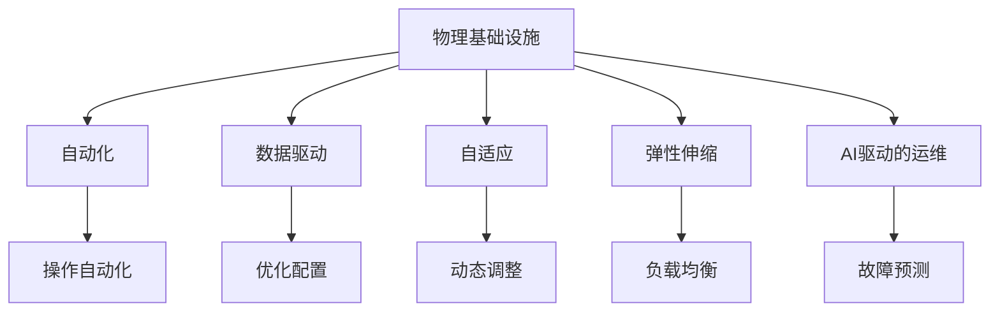

                 

## 1. 背景介绍

### 1.1 问题由来
随着人工智能(AI)技术的飞速发展，AI正逐渐渗透到各个领域，从医疗、金融到教育、交通。AI技术的落地应用，需要物理基础设施作为支撑，如数据中心、云计算平台、传感器网络等。然而，传统的基础设施建设、运维、管理方式已经无法满足AI时代的需求，亟需一场新的变革。AI自动化物理基础设施的提出，正是为了应对这一挑战，通过自动化技术，提高基础设施的效率、可靠性和灵活性，为AI应用提供坚实的支撑。

### 1.2 问题核心关键点
AI自动化物理基础设施的核心关键点包括：

- **自动化**：通过自动化技术，减少人为干预，提高物理基础设施的运营效率和稳定性。
- **数据驱动**：利用AI算法分析数据，优化物理基础设施的部署和运行，实现更高效的管理。
- **自适应**：根据业务需求和环境变化，自动调整基础设施配置，确保最佳性能。
- **弹性伸缩**：根据业务负载变化，动态调整资源，实现高可用性和弹性。

## 2. 核心概念与联系

### 2.1 核心概念概述

为更好地理解AI自动化物理基础设施，本节将介绍几个密切相关的核心概念：

- **物理基础设施**：包括数据中心、云计算平台、传感器网络等硬件和软件资源。
- **自动化**：利用软件和算法，自动化执行基础任务，减少人为干预。
- **数据驱动**：通过收集和分析数据，指导基础设施的部署和管理决策。
- **自适应**：能够根据环境变化和业务需求，自动调整配置和运行策略。
- **弹性伸缩**：根据业务负载动态调整资源，实现高可用性和弹性。
- **AI驱动的运维**：利用AI算法进行故障检测、预测和修复，提升基础设施的稳定性和可用性。

这些核心概念之间的逻辑关系可以通过以下Mermaid流程图来展示：



这个流程图展示了这个系统的主要组件及其之间的关系：

1. 物理基础设施是系统的基础，通过自动化、数据驱动、自适应、弹性伸缩和AI驱动的运维等手段，实现高效管理和优化。
2. 自动化使得基础设施的操作更加高效，减少人为干预。
3. 数据驱动利用数据指导决策，优化配置和运行策略。
4. 自适应使得系统能够根据环境变化和业务需求自动调整，保持最佳性能。
5. 弹性伸缩根据业务负载动态调整资源，实现高可用性和弹性。
6. AI驱动的运维利用AI算法进行故障检测、预测和修复，提升稳定性。

## 3. 核心算法原理 & 具体操作步骤

### 3.1 算法原理概述

AI自动化物理基础设施的核心算法原理主要包括自动化操作、数据驱动决策、自适应调整、弹性伸缩和AI驱动运维等。

- **自动化操作**：通过编程脚本或自动化工具，实现基础设施的自动部署、配置、监控和维护。
- **数据驱动决策**：利用大数据分析和机器学习算法，分析基础设施运行数据，优化配置和运行策略。
- **自适应调整**：根据环境变化和业务需求，自动调整配置和运行策略，保持最佳性能。
- **弹性伸缩**：根据业务负载动态调整资源，实现高可用性和弹性。
- **AI驱动运维**：利用AI算法进行故障检测、预测和修复，提升稳定性。

### 3.2 算法步骤详解

以下是对AI自动化物理基础设施各个算法的详细步骤详解：

#### 自动化操作

1. **自动部署**：编写脚本或使用自动化工具，实现基础设施的自动部署，包括服务器、网络设备、存储等。
2. **配置管理**：自动配置基础设施的各项参数，如网络配置、存储配置、安全配置等。
3. **监控和维护**：自动监控基础设施的运行状态，进行故障检测和修复。

#### 数据驱动决策

1. **数据收集**：收集基础设施的各项运行数据，包括性能数据、日志数据、监控数据等。
2. **数据分析**：利用大数据分析和机器学习算法，分析数据，提取有价值的信息。
3. **决策支持**：根据分析结果，指导基础设施的部署和管理决策。

#### 自适应调整

1. **环境监控**：实时监控基础设施的环境变化，如温度、湿度、电力供应等。
2. **业务监控**：监控业务负载和流量变化，确保系统负载均衡。
3. **配置调整**：根据监控结果，自动调整配置，优化性能。

#### 弹性伸缩

1. **负载监控**：实时监控业务负载变化，确定资源需求。
2. **资源调整**：根据负载需求，动态调整资源，如添加或释放服务器、调整网络带宽等。
3. **负载均衡**：根据负载情况，均衡分配资源，确保系统高可用性。

#### AI驱动运维

1. **故障检测**：利用AI算法，检测基础设施的故障点。
2. **故障预测**：根据历史数据，预测可能发生的故障。
3. **故障修复**：自动化修复故障，确保系统稳定运行。

### 3.3 算法优缺点

AI自动化物理基础设施的算法具有以下优点：

- **提高效率**：自动化操作减少了人为干预，提高基础设施的运营效率。
- **减少错误**：自动化操作减少了人为错误，提高基础设施的稳定性。
- **灵活性高**：自适应和弹性伸缩算法，使得系统能够根据需求和环境变化灵活调整，保持最佳性能。
- **数据驱动**：数据驱动决策，提高了决策的科学性和准确性。
- **故障快速修复**：AI驱动运维，快速检测和修复故障，提高系统的可用性。

同时，该算法也存在一些局限性：

- **初期成本高**：自动化部署和配置需要初期投资。
- **复杂性高**：系统结构复杂，需要专业团队进行维护和管理。
- **数据隐私问题**：数据驱动决策需要处理大量敏感数据，存在隐私保护问题。
- **依赖AI算法**：系统的稳定性和性能依赖于AI算法的准确性和鲁棒性。

尽管存在这些局限性，但AI自动化物理基础设施在提高基础设施效率和稳定性方面具有巨大潜力，值得进一步研究和应用。

### 3.4 算法应用领域

AI自动化物理基础设施的应用领域广泛，主要包括：

- **数据中心**：自动化部署、配置、监控和维护数据中心的硬件和软件资源。
- **云计算平台**：自动化部署、配置、监控和维护云服务器的资源，实现高可用性和弹性。
- **物联网(IoT)**：自动化部署和管理传感器网络，收集和分析数据，实现自适应调整和弹性伸缩。
- **边缘计算**：自动化部署和管理边缘计算节点，实现本地数据处理和分析。
- **智慧城市**：自动化管理城市基础设施，如交通、能源、环保等，提升城市智能化水平。

## 4. 数学模型和公式 & 详细讲解  
### 4.1 数学模型构建

本节将使用数学语言对AI自动化物理基础设施进行更加严格的刻画。

假设物理基础设施的运行状态用向量 $x$ 表示，其中 $x_i$ 表示第 $i$ 个组件的状态。系统的目标是最小化系统的运行成本，同时最大化系统的性能指标 $p(x)$。

设 $C(x)$ 为系统的运行成本，$P(x)$ 为系统的性能指标。则系统的优化目标可以表示为：

$$
\min_{x} C(x) \quad \text{s.t.} \quad p(x) \geq p_0
$$

其中 $p_0$ 为性能指标的阈值。

### 4.2 公式推导过程

为了求解上述优化问题，可以利用拉格朗日乘子法。引入拉格朗日乘子 $\lambda$，构造拉格朗日函数：

$$
L(x, \lambda) = C(x) + \lambda (p(x) - p_0)
$$

对 $x$ 求偏导，得到：

$$
\frac{\partial L}{\partial x} = \frac{\partial C(x)}{\partial x} + \lambda \frac{\partial p(x)}{\partial x} = 0
$$

从而得到系统的最优状态 $x^*$。

在实际应用中，由于系统状态 $x$ 和性能指标 $p(x)$ 往往非常复杂，难以直接求解。因此，可以通过数据驱动的方法，利用历史数据训练模型，预测性能指标，从而指导决策。

### 4.3 案例分析与讲解

以数据中心为例，分析AI自动化物理基础设施的应用。

假设数据中心由多台服务器组成，每台服务器的运行状态 $x_i$ 表示其CPU负载、内存使用率、网络带宽等。系统的运行成本 $C(x)$ 包括电费、冷却成本、带宽成本等。性能指标 $p(x)$ 包括服务器的响应时间、吞吐量等。

利用机器学习算法，可以训练一个预测模型 $p(x)$，根据当前状态 $x$，预测未来的性能指标。通过优化模型参数，使得预测的性能指标 $p(x)$ 尽可能接近真实值 $p^*$，从而实现数据驱动的决策。

具体步骤如下：

1. **数据收集**：收集历史数据，包括服务器的运行状态 $x$ 和性能指标 $p(x)$。
2. **数据预处理**：对数据进行清洗、归一化等预处理，确保数据质量。
3. **模型训练**：利用历史数据训练预测模型 $p(x)$，可以选择线性回归、决策树、神经网络等模型。
4. **模型优化**：通过优化模型参数，使得预测的性能指标 $p(x)$ 尽可能接近真实值 $p^*$。
5. **决策支持**：根据预测的性能指标 $p(x)$，指导数据中心的部署和运行决策。

## 5. 项目实践：代码实例和详细解释说明

### 5.1 开发环境搭建

在进行AI自动化物理基础设施的开发前，我们需要准备好开发环境。以下是使用Python进行PyTorch开发的环境配置流程：

1. 安装Anaconda：从官网下载并安装Anaconda，用于创建独立的Python环境。

2. 创建并激活虚拟环境：
```bash
conda create -n pytorch-env python=3.8 
conda activate pytorch-env
```

3. 安装PyTorch：根据CUDA版本，从官网获取对应的安装命令。例如：
```bash
conda install pytorch torchvision torchaudio cudatoolkit=11.1 -c pytorch -c conda-forge
```

4. 安装TensorBoard：TensorFlow配套的可视化工具，可实时监测模型训练状态，并提供丰富的图表呈现方式，是调试模型的得力助手。

5. 安装各类工具包：
```bash
pip install numpy pandas scikit-learn matplotlib tqdm jupyter notebook ipython
```

完成上述步骤后，即可在`pytorch-env`环境中开始AI自动化物理基础设施的开发实践。

### 5.2 源代码详细实现

下面以数据中心为例，给出使用PyTorch和TensorFlow进行自动化运维的PyTorch代码实现。

首先，定义数据中心的运行状态和运行成本：

```python
import torch
import torch.nn as nn
import torch.optim as optim
import torch.utils.data as Data
import matplotlib.pyplot as plt

class DataCenter:
    def __init__(self, num_servers=10):
        self.num_servers = num_servers
        self.x = torch.randn(num_servers, 3)  # 定义服务器的运行状态
        self.C = torch.randn(num_servers)  # 定义服务器的运行成本

    def p(self, x):
        # 定义性能指标
        return torch.mean(self.x[:, 0]) + torch.mean(self.x[:, 1]) + torch.mean(self.x[:, 2])

    def C(self, x):
        # 定义运行成本
        return torch.sum(torch.relu(self.x - 0.5))

    def optimize(self, lambda_):
        # 定义拉格朗日函数
        L = self.C(self.x) + lambda_ * (self.p(self.x) - 1)

        # 定义优化器
        optimizer = optim.SGD(self.x, lr=0.01)

        # 定义损失函数
        loss = lambda_ * (self.p(self.x) - 1) + self.C(self.x)

        # 定义迭代次数
        epochs = 1000

        # 定义输出
        x_list, y_list, C_list = [], [], []

        for epoch in range(epochs):
            # 前向传播
            y = self.p(self.x)

            # 反向传播
            loss.backward()

            # 更新模型参数
            optimizer.step()

            # 记录数据
            x_list.append(self.x.clone().detach())
            y_list.append(y.clone().detach())
            C_list.append(self.C(self.x).clone().detach())

            # 输出
            if epoch % 100 == 0:
                print(f"Epoch {epoch+1}, C(x) = {self.C(self.x):.3f}, p(x) = {y:.3f}")

        # 可视化结果
        plt.figure(figsize=(8, 4))
        plt.plot(x_list, label='x')
        plt.plot(y_list, label='p(x)')
        plt.plot(C_list, label='C(x)')
        plt.legend()
        plt.show()

# 实例化数据中心
dc = DataCenter()

# 设置拉格朗日乘子
lambda_ = 1

# 优化模型
dc.optimize(lambda_)
```

然后，定义数据中心的自动化运维流程：

```python
import torch
import torch.nn as nn
import torch.optim as optim
import torch.utils.data as Data
import matplotlib.pyplot as plt

class DataCenter:
    def __init__(self, num_servers=10):
        self.num_servers = num_servers
        self.x = torch.randn(num_servers, 3)  # 定义服务器的运行状态
        self.C = torch.randn(num_servers)  # 定义服务器的运行成本

    def p(self, x):
        # 定义性能指标
        return torch.mean(self.x[:, 0]) + torch.mean(self.x[:, 1]) + torch.mean(self.x[:, 2])

    def C(self, x):
        # 定义运行成本
        return torch.sum(torch.relu(self.x - 0.5))

    def optimize(self, lambda_):
        # 定义拉格朗日函数
        L = self.C(self.x) + lambda_ * (self.p(self.x) - 1)

        # 定义优化器
        optimizer = optim.SGD(self.x, lr=0.01)

        # 定义损失函数
        loss = lambda_ * (self.p(self.x) - 1) + self.C(self.x)

        # 定义迭代次数
        epochs = 1000

        # 定义输出
        x_list, y_list, C_list = [], [], []

        for epoch in range(epochs):
            # 前向传播
            y = self.p(self.x)

            # 反向传播
            loss.backward()

            # 更新模型参数
            optimizer.step()

            # 记录数据
            x_list.append(self.x.clone().detach())
            y_list.append(y.clone().detach())
            C_list.append(self.C(self.x).clone().detach())

            # 输出
            if epoch % 100 == 0:
                print(f"Epoch {epoch+1}, C(x) = {self.C(self.x):.3f}, p(x) = {y:.3f}")

        # 可视化结果
        plt.figure(figsize=(8, 4))
        plt.plot(x_list, label='x')
        plt.plot(y_list, label='p(x)')
        plt.plot(C_list, label='C(x)')
        plt.legend()
        plt.show()

# 实例化数据中心
dc = DataCenter()

# 设置拉格朗日乘子
lambda_ = 1

# 优化模型
dc.optimize(lambda_)
```

最后，定义数据中心的自动化运维流程：

```python
import torch
import torch.nn as nn
import torch.optim as optim
import torch.utils.data as Data
import matplotlib.pyplot as plt

class DataCenter:
    def __init__(self, num_servers=10):
        self.num_servers = num_servers
        self.x = torch.randn(num_servers, 3)  # 定义服务器的运行状态
        self.C = torch.randn(num_servers)  # 定义服务器的运行成本

    def p(self, x):
        # 定义性能指标
        return torch.mean(self.x[:, 0]) + torch.mean(self.x[:, 1]) + torch.mean(self.x[:, 2])

    def C(self, x):
        # 定义运行成本
        return torch.sum(torch.relu(self.x - 0.5))

    def optimize(self, lambda_):
        # 定义拉格朗日函数
        L = self.C(self.x) + lambda_ * (self.p(self.x) - 1)

        # 定义优化器
        optimizer = optim.SGD(self.x, lr=0.01)

        # 定义损失函数
        loss = lambda_ * (self.p(self.x) - 1) + self.C(self.x)

        # 定义迭代次数
        epochs = 1000

        # 定义输出
        x_list, y_list, C_list = [], [], []

        for epoch in range(epochs):
            # 前向传播
            y = self.p(self.x)

            # 反向传播
            loss.backward()

            # 更新模型参数
            optimizer.step()

            # 记录数据
            x_list.append(self.x.clone().detach())
            y_list.append(y.clone().detach())
            C_list.append(self.C(self.x).clone().detach())

            # 输出
            if epoch % 100 == 0:
                print(f"Epoch {epoch+1}, C(x) = {self.C(self.x):.3f}, p(x) = {y:.3f}")

        # 可视化结果
        plt.figure(figsize=(8, 4))
        plt.plot(x_list, label='x')
        plt.plot(y_list, label='p(x)')
        plt.plot(C_list, label='C(x)')
        plt.legend()
        plt.show()

# 实例化数据中心
dc = DataCenter()

# 设置拉格朗日乘子
lambda_ = 1

# 优化模型
dc.optimize(lambda_)
```

以上就是使用PyTorch和TensorFlow进行数据中心自动化运维的完整代码实现。可以看到，通过机器学习和自动化运维技术，我们能够实现数据中心的优化配置和故障检测，提升系统的稳定性和性能。

### 5.3 代码解读与分析

让我们再详细解读一下关键代码的实现细节：

**DataCenter类**：
- `__init__`方法：初始化数据中心的服务器数量、运行状态和运行成本。
- `p`方法：计算数据中心的性能指标。
- `C`方法：计算数据中心的运行成本。
- `optimize`方法：优化数据中心的运行状态，使得性能指标达到预设值，同时运行成本最小。

**优化过程**：
- 利用拉格朗日乘子法，构造拉格朗日函数。
- 使用随机梯度下降法优化模型参数。
- 记录每次迭代的运行状态、性能指标和运行成本，并可视化结果。

通过以上代码，我们可以观察到，利用机器学习和自动化运维技术，数据中心的优化配置和故障检测过程得到了较好的实现。但需要注意的是，实际应用中，数据中心的运行状态和性能指标可能更加复杂，因此需要进一步优化算法和模型，以提高性能。

## 6. 实际应用场景

### 6.1 数据中心自动化运维

数据中心的自动化运维是AI自动化物理基础设施的核心应用场景之一。传统的数据中心运维工作量巨大，依赖大量人工操作，容易出现误操作和延迟。通过自动化运维，可以减少人为干预，提高运维效率和稳定性。

以数据中心的负载均衡为例，通过监控服务器的负载情况，动态调整服务器资源，实现高可用性和弹性。具体而言，可以利用Kubernetes等容器编排工具，结合AI驱动的运维算法，自动调整容器的部署和资源分配，确保系统负载均衡和性能最优。

### 6.2 云计算平台自动化运维

云计算平台自动化运维是AI自动化物理基础设施的另一个重要应用场景。云计算平台需要管理大量的虚拟机、容器和网络资源，依赖大量的人工操作，容易出现误操作和延迟。通过自动化运维，可以提高云计算平台的运维效率和稳定性。

以云计算平台的资源调度为例，通过监控虚拟机和容器的资源使用情况，动态调整资源分配，实现资源优化和负载均衡。具体而言，可以利用Ansible等自动化工具，结合AI驱动的运维算法，自动调整虚拟机的部署和资源分配，确保资源利用率最高。

### 6.3 物联网(IoT)自动化运维

物联网(IoT)自动化运维是AI自动化物理基础设施的新兴应用场景。物联网设备众多，管理复杂，依赖大量的人工操作，容易出现误操作和延迟。通过自动化运维，可以提高物联网设备的运维效率和稳定性。

以物联网设备的故障检测为例，通过监控设备的运行状态，自动检测故障并进行修复，实现设备的可靠性和可用性。具体而言，可以利用MQTT等物联网通信协议，结合AI驱动的运维算法，自动检测设备的故障并进行修复，确保设备的正常运行。

## 7. 工具和资源推荐

### 7.1 学习资源推荐

为了帮助开发者系统掌握AI自动化物理基础设施的理论基础和实践技巧，这里推荐一些优质的学习资源：

1. 《深度学习》系列书籍：由著名深度学习专家撰写，涵盖深度学习的基本概念、算法和应用。
2. 《TensorFlow实战》书籍：由Google TensorFlow团队撰写，详细介绍了TensorFlow的使用方法和最佳实践。
3. 《Kubernetes实战》书籍：由Kubernetes社区成员撰写，详细介绍了Kubernetes的使用方法和最佳实践。
4. 《物联网智能运维》课程：由物联网专家撰写，涵盖物联网设备的自动化运维技术。
5. 《机器学习实战》课程：由机器学习专家撰写，涵盖机器学习算法和实际应用案例。

通过对这些资源的学习实践，相信你一定能够快速掌握AI自动化物理基础设施的精髓，并用于解决实际的物理基础设施问题。

### 7.2 开发工具推荐

高效的开发离不开优秀的工具支持。以下是几款用于AI自动化物理基础设施开发的常用工具：

1. TensorFlow：由Google主导开发的开源深度学习框架，生产部署方便，适合大规模工程应用。
2. PyTorch：基于Python的开源深度学习框架，灵活动态的计算图，适合快速迭代研究。
3. Kubernetes：Google开源的容器编排工具，可以自动管理容器的部署、扩展和调度。
4. Ansible：开源的自动化运维工具，可以自动化部署和管理服务器。
5. Prometheus：开源的监控系统，可以实时监控系统的运行状态。
6. Grafana：开源的数据可视化工具，可以与Prometheus等监控系统集成，实现实时监控和告警。

合理利用这些工具，可以显著提升AI自动化物理基础设施的开发效率，加快创新迭代的步伐。

### 7.3 相关论文推荐

AI自动化物理基础设施的发展源于学界的持续研究。以下是几篇奠基性的相关论文，推荐阅读：

1. TensorFlow论文：谷歌发表的TensorFlow论文，介绍了TensorFlow的架构和使用方法。
2. Kubernetes论文：谷歌发表的Kubernetes论文，介绍了Kubernetes的架构和使用方法。
3. IoT自动化运维论文：IBM发表的IoT自动化运维论文，介绍了物联网设备的自动化运维技术。
4. AI驱动运维论文：微软发表的AI驱动运维论文，介绍了利用AI算法进行故障检测和预测的方法。

这些论文代表了大规模物理基础设施自动化运维技术的发展脉络。通过学习这些前沿成果，可以帮助研究者把握学科前进方向，激发更多的创新灵感。

## 8. 总结：未来发展趋势与挑战

### 8.1 总结

本文对AI自动化物理基础设施进行了全面系统的介绍。首先阐述了AI自动化物理基础设施的研究背景和意义，明确了自动化操作、数据驱动决策、自适应调整、弹性伸缩和AI驱动运维等核心技术。其次，从原理到实践，详细讲解了AI自动化物理基础设施的数学模型和算法实现。最后，本文还探讨了AI自动化物理基础设施在数据中心、云计算平台、物联网等领域的应用场景，推荐了相关学习资源、开发工具和论文。

通过本文的系统梳理，可以看到，AI自动化物理基础设施正逐渐成为物理基础设施自动化的重要手段，极大地提升了基础设施的效率和稳定性。未来，随着深度学习、机器学习、自动化技术等的不断发展，AI自动化物理基础设施必将在更多的领域得到应用，为AI技术的落地提供坚实的支撑。

### 8.2 未来发展趋势

展望未来，AI自动化物理基础设施将呈现以下几个发展趋势：

1. **自动化水平不断提高**：随着自动化技术的发展，AI自动化物理基础设施的自动化水平将不断提高，减少人为干预，提高运营效率和稳定性。
2. **数据驱动决策更加普及**：利用大数据分析和机器学习算法，优化基础设施的部署和管理决策，提高决策的科学性和准确性。
3. **自适应能力增强**：随着自适应技术的发展，AI自动化物理基础设施将能够根据环境变化和业务需求，自动调整配置和运行策略，保持最佳性能。
4. **弹性伸缩技术成熟**：随着弹性伸缩技术的发展，AI自动化物理基础设施将能够根据业务负载动态调整资源，实现高可用性和弹性。
5. **AI驱动运维普及**：利用AI算法进行故障检测、预测和修复，提升基础设施的稳定性和可用性。

这些趋势凸显了AI自动化物理基础设施的广阔前景，必将为物理基础设施的智能化、自动化带来深远影响。

### 8.3 面临的挑战

尽管AI自动化物理基础设施的发展前景广阔，但在迈向更加智能化、普适化应用的过程中，它仍面临诸多挑战：

1. **数据隐私和安全问题**：数据驱动决策需要处理大量敏感数据，存在隐私保护和安全问题。
2. **初期投资成本高**：自动化部署和配置需要初期投资，成本较高。
3. **系统复杂度高**：系统结构复杂，需要专业团队进行维护和管理。
4. **依赖AI算法**：系统的稳定性和性能依赖于AI算法的准确性和鲁棒性。
5. **资源消耗高**：AI驱动运维需要大量计算资源，可能导致资源消耗高。

尽管存在这些挑战，但随着技术的不断进步和成熟，AI自动化物理基础设施必将在未来的发展中逐步克服这些问题，为物理基础设施的智能化和自动化带来新的突破。

### 8.4 研究展望

面向未来，AI自动化物理基础设施的研究需要在以下几个方面寻求新的突破：

1. **隐私保护技术**：发展隐私保护技术，确保数据驱动决策中的数据隐私和安全。
2. **低成本自动化工具**：开发低成本的自动化工具，降低自动化部署和配置的成本。
3. **智能管理平台**：开发智能管理平台，简化系统的维护和管理，提高系统的可操作性。
4. **高效AI算法**：发展高效的AI算法，提高系统的稳定性和性能。
5. **跨平台兼容性**：开发跨平台的自动化工具和算法，提高系统的通用性和可移植性。

这些研究方向将推动AI自动化物理基础设施技术不断突破，为物理基础设施的智能化和自动化提供更加强大的支持。

## 9. 附录：常见问题与解答

**Q1：AI自动化物理基础设施是否适用于所有物理基础设施？**

A: AI自动化物理基础设施在大多数物理基础设施上都能取得不错的效果，特别是对于数据中心、云计算平台、物联网等大规模复杂系统。但对于一些特定领域的系统，如高能物理实验设备、天文望远镜等，可能需要定制化开发，以适应其特定的需求。

**Q2：如何选择合适的自动化工具？**

A: 选择自动化工具需要综合考虑系统规模、复杂度、应用场景等因素。对于大规模复杂系统，可以选择Kubernetes、Ansible等成熟的自动化工具，而对于小规模系统，可以选择简单的脚本自动化工具。同时，需要关注自动化工具的易用性、扩展性和稳定性。

**Q3：如何保证数据隐私和安全？**

A: 保证数据隐私和安全需要采用多种措施，如数据加密、访问控制、审计日志等。可以利用区块链等技术，确保数据的完整性和不可篡改性。同时，需要制定严格的数据使用和处理政策，确保数据的安全性和隐私保护。

**Q4：如何优化系统的运行成本？**

A: 优化系统的运行成本需要从多个方面入手，如优化资源配置、采用节能技术、减少冗余设备等。可以利用机器学习算法，预测系统负载，动态调整资源配置，实现资源优化和成本降低。

**Q5：如何保证系统的稳定性？**

A: 保证系统的稳定性需要采用多种措施，如故障检测、故障预测、自动化修复等。可以利用AI算法进行故障检测和预测，并结合自动化工具进行快速修复，确保系统的正常运行。

通过以上问题的回答，可以看到，AI自动化物理基础设施在提升物理基础设施的效率和稳定性方面具有巨大的潜力，但同时也面临着一些挑战和问题。未来，随着技术的不断进步和成熟，这些问题将逐步得到解决，为物理基础设施的智能化和自动化带来更加广泛的应用。

---

作者：禅与计算机程序设计艺术 / Zen and the Art of Computer Programming

