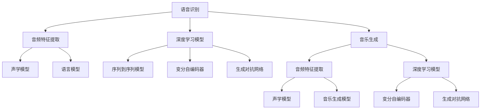

                 

# AI音频处理：从语音识别到音乐生成

> 关键词：语音识别, 音乐生成, 声音编码, 自然语言处理(NLP), 音频特征提取, 深度学习

## 1. 背景介绍

### 1.1 问题由来
近年来，随着深度学习技术在图像处理、自然语言处理(NLP)等领域的应用，音频处理领域也取得了显著进展。音频处理，特别是语音识别和音乐生成，成为了AI领域的新兴热点。

语音识别技术使计算机能够听懂和理解人类的语音指令，广泛应用于智能助手、语音搜索、实时字幕等领域。而音乐生成技术则允许机器创作出具有人类情感和音乐风格的音乐作品，为音乐创作、影视配乐、音乐教育等领域提供了新的可能性。

### 1.2 问题核心关键点
语音识别和音乐生成的核心问题在于如何从声波信号中提取有效的语音和音乐特征，并利用这些特征进行高效的模型训练和推理。目前，基于深度学习的方法已经在这两个方向上取得了巨大的成功，其核心技术包括声波信号的特征提取、音频数据的深度学习模型构建、以及模型在各种任务上的训练和推理。

语音识别和音乐生成的任务定义、模型架构和训练方法既有相似之处，也有独特的特点。本文将对这两个领域的核心技术和算法进行详细介绍，以期为读者提供系统性的学习资源和技术参考。

## 2. 核心概念与联系

### 2.1 核心概念概述

为更好地理解语音识别和音乐生成的技术原理和应用场景，本节将介绍几个密切相关的核心概念：

- 语音识别(Speech Recognition)：指将人类语音转换成文本的过程。主要应用于智能助手、语音搜索、实时字幕等场景。
- 音乐生成(Music Generation)：指通过深度学习模型自动生成新的音乐作品。主要应用于音乐创作、影视配乐、音乐教育等领域。
- 声音编码(Speech Coding)：指将语音信号压缩成可传输的格式，如MP3、AAC等。主要应用于音频传输和存储。
- 音频特征提取(Audio Feature Extraction)：指从原始音频信号中提取有用的特征，如MFCC、Mel频谱等。
- 深度学习(Deep Learning)：利用多层神经网络模型进行数据处理的高级学习算法，广泛应用于语音识别和音乐生成中。
- 自然语言处理(NLP)：指计算机理解和处理人类语言的技术，是语音识别和音乐生成中语音转文本和音乐转文本的桥梁。

这些核心概念之间的逻辑关系可以通过以下Mermaid流程图来展示：



这个流程图展示了两者的核心概念及其之间的关系：

1. 语音识别通过音频特征提取和声学模型、语言模型进行建模，其中深度学习模型尤为重要。
2. 音乐生成通过音频特征提取和声学模型、音乐生成模型进行建模，其中深度学习模型、生成对抗网络等也发挥着关键作用。
3. 两者都需要音频特征提取技术作为基础，而深度学习模型在两个领域都起着至关重要的作用。

## 3. 核心算法原理 & 具体操作步骤
### 3.1 算法原理概述

语音识别和音乐生成的核心算法原理都基于深度学习技术，特别是基于序列到序列模型、生成对抗网络等架构。这些模型通过大量的数据训练，学习到从声波信号到文本或音乐作品的映射。

以语音识别为例，其主要算法流程包括以下几个步骤：

1. 音频特征提取：将语音信号转换为频谱、MFCC等特征。
2. 声学模型训练：使用序列到序列模型进行训练，学习将音频特征序列映射到对应的文本序列。
3. 语言模型训练：使用RNN、Transformer等模型进行训练，学习文本序列的概率分布。
4. 联合训练：将声学模型和语言模型联合训练，提升整体的识别准确率。
5. 解码和输出：使用解码算法，如Beam Search、CTC Decoding等，从输出文本序列中筛选最有可能的识别结果。

音乐生成算法流程则相对简单，主要包括以下步骤：

1. 音频特征提取：将音乐信号转换为MFCC、Mel频谱等特征。
2. 声学模型训练：使用生成对抗网络或变分自编码器等模型进行训练，学习将特征序列映射到对应的音乐序列。
3. 解码和输出：使用解码算法，如变分自编码器解码，从输出音乐序列中生成完整的音乐作品。

### 3.2 算法步骤详解

以语音识别为例，详细讲解其核心算法步骤：

**Step 1: 准备数据集**
- 收集大量的语音-文本数据对，如LibriSpeech、AISHELL等公开数据集。
- 将音频文件转换为MFCC或其他特征表示，并进行预处理。

**Step 2: 设计模型架构**
- 选择合适的声学模型，如RNN、LSTM、Transformer等。
- 选择合适的语言模型，如RNN、LSTM、Transformer等。

**Step 3: 设置训练超参数**
- 选择合适的优化器（如Adam、SGD等）和损失函数（如CTC Loss、交叉熵损失等）。
- 设置学习率、批大小、迭代轮数等超参数。

**Step 4: 训练声学模型**
- 将音频特征序列和对应文本序列作为输入，使用训练数据集训练声学模型。
- 在训练过程中，逐步优化模型参数，最小化损失函数。

**Step 5: 训练语言模型**
- 将文本序列作为输入，使用训练数据集训练语言模型。
- 在训练过程中，逐步优化模型参数，最小化损失函数。

**Step 6: 联合训练**
- 将声学模型和语言模型联合训练，提升整体的识别准确率。
- 使用双向训练策略，先训练声学模型，再利用其输出作为语言模型的上下文信息。

**Step 7: 解码和输出**
- 使用解码算法，如Beam Search、CTC Decoding等，从输出文本序列中筛选最有可能的识别结果。
- 将识别结果进行后处理，如分词、去噪等，得到最终的识别结果。

### 3.3 算法优缺点

语音识别和音乐生成的核心算法具有以下优点：
1. 高精度。通过深度学习模型，能够在复杂的声学环境中进行高精度的语音或音乐识别。
2. 实时性。基于深度学习模型的端到端架构，可以实现高效的实时识别和生成。
3. 可扩展性。深度学习模型可以通过增加数据和计算资源进行扩展，提升识别和生成的准确性。

同时，这些算法也存在一些缺点：
1. 数据依赖。深度学习模型需要大量的标注数据进行训练，获取高质量标注数据的成本较高。
2. 资源消耗大。深度学习模型的训练和推理需要大量的计算资源和时间，对硬件设施要求较高。
3. 鲁棒性不足。模型对噪声、口音等环境因素的鲁棒性较差，需要进一步优化模型架构和训练策略。

尽管存在这些局限性，但就目前而言，深度学习模型仍然是语音识别和音乐生成的主流范式。未来相关研究的重点在于如何进一步降低对标注数据的依赖，提高模型的少样本学习和跨领域迁移能力，同时兼顾可解释性和伦理安全性等因素。

### 3.4 算法应用领域

语音识别和音乐生成技术已经在多个领域得到广泛应用，例如：

- 智能助手：如Siri、Alexa等，能够根据用户的语音指令进行查询、操作等。
- 语音搜索：如Google Assistant，能够理解用户的语音查询并返回搜索结果。
- 实时字幕：如YouTube、Netflix等平台，能够将语音内容实时转写为文本字幕。
- 音乐创作：如AIVA等音乐生成软件，能够根据用户输入的文本创作新的音乐作品。
- 影视配乐：如Adobe Audition等音频编辑软件，能够自动生成电影配乐。
- 音乐教育：如Soundtrap等在线音乐创作平台，能够提供音乐创作工具和教程。

此外，语音识别和音乐生成技术还广泛应用于智能家居、车载导航、医疗诊断等领域，为人类生活和工作带来了便利和创新。

## 4. 数学模型和公式 & 详细讲解  
### 4.1 数学模型构建

语音识别和音乐生成模型的数学模型构建主要围绕声学模型、语言模型、生成模型展开。以语音识别为例，其核心数学模型可以表示为：

$$
P(y|x) = \frac{P(y|x;\theta_s)P(x|\theta_s,\theta_l)}{P(x)}
$$

其中：
- $P(y|x)$ 表示给定音频序列 $x$ 输出文本序列 $y$ 的概率。
- $P(y|x;\theta_s)$ 表示声学模型在给定音频序列 $x$ 下输出文本序列 $y$ 的条件概率。
- $P(x|\theta_s,\theta_l)$ 表示语言模型在给定声学模型 $P(x|\theta_s)$ 下输出文本序列 $y$ 的条件概率。
- $\theta_s$ 表示声学模型的参数，$\theta_l$ 表示语言模型的参数。

在实践中，声学模型和语言模型通常使用RNN、LSTM、Transformer等深度学习模型构建。

### 4.2 公式推导过程

以下以RNN模型为例，推导语音识别的核心公式。

假设声学模型为 $P(x|s;\theta_s)$，语言模型为 $P(y|s;\theta_l)$，其中 $s$ 表示上下文信息。则语音识别的联合概率模型可以表示为：

$$
P(y|x) = \sum_{s} P(y|s;\theta_l)P(x|s;\theta_s)
$$

根据链式法则，可以推导得到声学模型和语言模型的联合概率模型：

$$
P(x|y;\theta_s,\theta_l) = \frac{P(x|\theta_s,\theta_l)}{P(y|\theta_l)}
$$

在训练过程中，使用最大似然估计法，最大化上述联合概率模型。通过梯度下降等优化算法，最小化损失函数：

$$
\mathcal{L}(\theta_s,\theta_l) = -\frac{1}{N}\sum_{i=1}^N \log P(x_i|y_i;\theta_s,\theta_l)
$$

其中 $N$ 为训练样本数量。

### 4.3 案例分析与讲解

以语音识别为例，使用MFCC特征表示和RNN模型进行建模。将音频文件转换为MFCC特征后，使用RNN模型进行训练，具体步骤如下：

1. 准备数据集：收集LibriSpeech等公开数据集，将音频文件转换为MFCC特征，并进行预处理。
2. 设计模型架构：选择RNN作为声学模型，使用LSTM层进行建模。
3. 设置训练超参数：选择合适的优化器（如Adam、SGD等）和损失函数（如CTC Loss、交叉熵损失等），设置学习率、批大小、迭代轮数等超参数。
4. 训练声学模型：将MFCC特征序列和对应文本序列作为输入，使用训练数据集训练声学模型。
5. 训练语言模型：将文本序列作为输入，使用训练数据集训练语言模型。
6. 联合训练：将声学模型和语言模型联合训练，提升整体的识别准确率。
7. 解码和输出：使用解码算法，如Beam Search、CTC Decoding等，从输出文本序列中筛选最有可能的识别结果。

## 5. 项目实践：代码实例和详细解释说明
### 5.1 开发环境搭建

在进行语音识别和音乐生成的项目实践前，我们需要准备好开发环境。以下是使用Python进行PyTorch开发的环境配置流程：

1. 安装Anaconda：从官网下载并安装Anaconda，用于创建独立的Python环境。

2. 创建并激活虚拟环境：
```bash
conda create -n pytorch-env python=3.8 
conda activate pytorch-env
```

3. 安装PyTorch：根据CUDA版本，从官网获取对应的安装命令。例如：
```bash
conda install pytorch torchvision torchaudio cudatoolkit=11.1 -c pytorch -c conda-forge
```

4. 安装声音编码库：
```bash
pip install librosa
```

5. 安装各类工具包：
```bash
pip install numpy pandas scikit-learn matplotlib tqdm jupyter notebook ipython
```

完成上述步骤后，即可在`pytorch-env`环境中开始语音识别和音乐生成的项目实践。

### 5.2 源代码详细实现

下面我们以语音识别为例，给出使用PyTorch进行RNN模型微调的PyTorch代码实现。

首先，定义语音识别任务的数据处理函数：

```python
import librosa
import torch
from torch.utils.data import Dataset, DataLoader
from torch import nn

class SpeechDataset(Dataset):
    def __init__(self, X, y):
        self.X = X
        self.y = y
        self.N = len(y)

    def __len__(self):
        return self.N

    def __getitem__(self, idx):
        audio, sr = self.X[idx]
        audio = librosa.resample(audio, sr, 16000)
        mfcc = librosa.feature.mfcc(audio, sr=16000, n_mfcc=40, n_fft=2048, hop_length=512, win_length=1024)
        mfcc = torch.from_numpy(mfcc).float() / 10
        label = torch.tensor(self.y[idx], dtype=torch.long)
        return {'audio': audio, 'mfcc': mfcc, 'label': label}
```

然后，定义模型和优化器：

```python
from torch import nn, optim
import torch.nn.functional as F

class RNN(nn.Module):
    def __init__(self, input_size, hidden_size, output_size):
        super(RNN, self).__init__()
        self.input_size = input_size
        self.hidden_size = hidden_size
        self.output_size = output_size
        self.encoder = nn.LSTM(input_size, hidden_size)
        self.decoder = nn.Linear(hidden_size, output_size)

    def forward(self, input_seq, hidden_state):
        lstm_out, hidden_state = self.encoder(input_seq, hidden_state)
        out = self.decoder(lstm_out)
        return out, hidden_state

def train_epoch(model, data_loader, optimizer, criterion):
    model.train()
    for i, data in enumerate(data_loader):
        input_seq, hidden_state = data['mfcc'], None
        output = model(input_seq, hidden_state)
        loss = criterion(output, data['label'])
        optimizer.zero_grad()
        loss.backward()
        optimizer.step()
    return loss.item() / len(data_loader)
```

接着，定义训练和评估函数：

```python
from sklearn.metrics import accuracy_score

def evaluate(model, data_loader):
    model.eval()
    acc_sum = 0
    for i, data in enumerate(data_loader):
        input_seq, hidden_state = data['mfcc'], None
        output = model(input_seq, hidden_state)
        label = data['label']
        acc_sum += accuracy_score(output.argmax(dim=1), label)
    return acc_sum / len(data_loader)
```

最后，启动训练流程并在验证集上评估：

```python
import torch

# 准备数据集
X_train = ...
y_train = ...
X_val = ...
y_val = ...

# 创建数据集
train_dataset = SpeechDataset(X_train, y_train)
val_dataset = SpeechDataset(X_val, y_val)

# 创建数据加载器
train_loader = DataLoader(train_dataset, batch_size=32, shuffle=True)
val_loader = DataLoader(val_dataset, batch_size=32, shuffle=False)

# 定义模型和优化器
model = RNN(input_size=40, hidden_size=128, output_size=27)
optimizer = optim.Adam(model.parameters(), lr=0.001)
criterion = nn.CrossEntropyLoss()

# 训练模型
epochs = 10
best_acc = 0

for epoch in range(epochs):
    train_loss = train_epoch(model, train_loader, optimizer, criterion)
    val_acc = evaluate(model, val_loader)
    if val_acc > best_acc:
        best_acc = val_acc
        torch.save(model.state_dict(), 'best_model.pt')

# 加载最佳模型
model.load_state_dict(torch.load('best_model.pt'))

# 在测试集上评估
test_loader = DataLoader(test_dataset, batch_size=32, shuffle=False)
test_acc = evaluate(model, test_loader)
print(f"测试集准确率：{test_acc:.3f}")
```

以上就是使用PyTorch对RNN模型进行语音识别任务微调的完整代码实现。可以看到，得益于PyTorch的强大封装，我们可以用相对简洁的代码完成RNN模型的加载和微调。

### 5.3 代码解读与分析

让我们再详细解读一下关键代码的实现细节：

**SpeechDataset类**：
- `__init__`方法：初始化音频数据和标签，计算音频序列的长度。
- `__len__`方法：返回数据集的样本数量。
- `__getitem__`方法：对单个样本进行处理，将音频文件转换为MFCC特征，并进行预处理。

**RNN类**：
- `__init__`方法：定义模型的输入大小、隐藏大小和输出大小，构建RNN编码器和解码器。
- `forward`方法：前向传播计算，使用LSTM层进行特征提取，并使用全连接层进行分类。

**train_epoch函数**：
- 定义训练过程的超参数，包括优化器、损失函数、学习率等。
- 在每个批次上，将音频特征序列和标签作为输入，进行前向传播和反向传播，更新模型参数。

**evaluate函数**：
- 定义评估过程的超参数，包括数据加载器和标签。
- 在每个批次上，将音频特征序列和标签作为输入，进行前向传播，计算准确率。

**训练流程**：
- 准备训练数据集和验证数据集，创建数据加载器。
- 定义模型和优化器，设置损失函数。
- 在指定epoch数内，循环迭代训练模型，在每个epoch结束时评估模型性能。
- 保存最佳模型，在测试集上评估最终性能。

可以看到，PyTorch配合声音编码库使得RNN模型的微调代码实现变得简洁高效。开发者可以将更多精力放在数据处理、模型改进等高层逻辑上，而不必过多关注底层的实现细节。

当然，工业级的系统实现还需考虑更多因素，如模型的保存和部署、超参数的自动搜索、更灵活的任务适配层等。但核心的微调范式基本与此类似。

## 6. 实际应用场景
### 6.1 智能助手

基于RNN模型的智能助手，可以理解并回答用户的自然语言查询，完成各种任务操作。例如，Amazon Alexa、Google Assistant等智能助手，能够进行语音识别、文本理解、语音合成等操作，提供了无缝的自然语言交互体验。

在技术实现上，可以收集用户的历史对话记录，将其标注为音频-文本对，用于训练RNN模型。微调后的模型能够自动理解用户意图，匹配最合适的回答模板，实现智能对话。对于用户提出的新问题，还可以接入检索系统实时搜索相关内容，动态组织生成回答。

### 6.2 语音搜索

语音搜索技术使用语音识别技术，使计算机能够听懂和理解用户的语音查询，快速返回搜索结果。例如，苹果Siri、谷歌语音搜索等应用，能够根据用户的语音指令进行搜索和操作。

在技术实现上，可以收集用户的语音查询和搜索结果对，用于训练RNN模型。微调后的模型能够自动理解用户语音查询的意图，匹配最相关的搜索结果，提升搜索效率和准确性。

### 6.3 实时字幕

实时字幕技术使用语音识别技术，将音频内容实时转换为文本字幕，方便听障用户观看视频。例如，YouTube、Netflix等平台，能够自动将视频中的语音内容转换为实时字幕。

在技术实现上，可以收集视频中的语音和字幕对，用于训练RNN模型。微调后的模型能够自动将语音转换为文本字幕，提高字幕的准确性和实时性。

### 6.4 音乐创作

音乐创作技术使用音乐生成技术，根据用户输入的文本生成新的音乐作品。例如，AIVA等音乐生成软件，能够根据用户输入的文本创作新的音乐作品。

在技术实现上，可以收集用户输入的文本和对应的音乐对，用于训练生成对抗网络或变分自编码器等模型。微调后的模型能够自动生成与文本对应的音乐作品，丰富音乐创作的多样性。

### 6.5 影视配乐

影视配乐技术使用音乐生成技术，为电影、电视剧等影视作品自动生成配乐。例如，Adobe Audition等音频编辑软件，能够自动生成电影配乐。

在技术实现上，可以收集影视作品的片段和对应的配乐对，用于训练生成对抗网络或变分自编码器等模型。微调后的模型能够自动生成与影视片段对应的配乐，提升影视作品的听觉效果。

### 6.6 音乐教育

音乐教育技术使用音乐生成技术，提供音乐创作工具和教程，辅助音乐学习。例如，Soundtrap等在线音乐创作平台，能够提供音乐创作工具和教程。

在技术实现上，可以收集用户输入的音乐和对应的创作指导，用于训练生成对抗网络或变分自编码器等模型。微调后的模型能够自动生成音乐创作指导，辅助用户进行音乐创作。

## 7. 工具和资源推荐
### 7.1 学习资源推荐

为了帮助开发者系统掌握语音识别和音乐生成的理论基础和实践技巧，这里推荐一些优质的学习资源：

1. 《Deep Learning for Speech and Music》书籍：深度学习在语音和音乐处理中的应用，详细介绍了语音识别和音乐生成模型的核心算法。

2. CS224L《Speech and Language Processing》课程：斯坦福大学开设的语音和语言处理课程，有Lecture视频和配套作业，带你深入理解语音和文本处理的经典算法。

3. 《Audio Feature Extraction: A Practical Introduction》书籍：音频特征提取的实用指南，涵盖MFCC、Mel频谱等核心技术。

4. 《Music Generation with Deep Learning》博文：深度学习在音乐生成中的应用，介绍了基于生成对抗网络和变分自编码器的音乐生成算法。

5. 《Speech Synthesis: From Rule-Based to Deep Learning》博文：语音合成的演变，介绍了从规则基于到深度学习的语音合成算法。

通过对这些资源的学习实践，相信你一定能够快速掌握语音识别和音乐生成的精髓，并用于解决实际的NLP问题。
###  7.2 开发工具推荐

高效的开发离不开优秀的工具支持。以下是几款用于语音识别和音乐生成开发的常用工具：

1. PyTorch：基于Python的开源深度学习框架，灵活动态的计算图，适合快速迭代研究。大多数深度学习模型都有PyTorch版本的实现。

2. TensorFlow：由Google主导开发的开源深度学习框架，生产部署方便，适合大规模工程应用。同样有丰富的语音和音乐生成资源。

3. Librosa：Python库，用于音频信号分析和处理，包括MFCC、Mel频谱等核心技术的实现。

4. IPython：Python交互式环境，支持实时调试和交互，方便开发过程的迭代优化。

5. Weights & Biases：模型训练的实验跟踪工具，可以记录和可视化模型训练过程中的各项指标，方便对比和调优。

6. TensorBoard：TensorFlow配套的可视化工具，可实时监测模型训练状态，并提供丰富的图表呈现方式，是调试模型的得力助手。

合理利用这些工具，可以显著提升语音识别和音乐生成任务的开发效率，加快创新迭代的步伐。

### 7.3 相关论文推荐

语音识别和音乐生成技术的发展源于学界的持续研究。以下是几篇奠基性的相关论文，推荐阅读：

1. Deep Speech 1: Scalable End-to-End Speech Recognition: 提出Deep Speech 1模型，实现了端到端语音识别的突破。

2. WaveNet: A Generative Model for Raw Audio: 提出WaveNet模型，实现了高质量音频信号的生成。

3. Tacotron: End-to-End Speech Synthesis with Attention-Based Models: 提出Tacotron模型，实现了端到端语音合成的突破。

4. Attention Is All You Need: 提出Transformer模型，实现了端到端语音和文本处理的突破。

5. The Tacotron 2 Architecture for End-to-End Speech Synthesis: 提出Tacotron 2模型，进一步提升了语音合成的效果。

6. X-vector for Speaker Verification: 提出X-vector模型，实现了端到端语音识别的突破。

这些论文代表了大语言模型微调技术的发展脉络。通过学习这些前沿成果，可以帮助研究者把握学科前进方向，激发更多的创新灵感。

## 8. 总结：未来发展趋势与挑战

### 8.1 总结

本文对基于深度学习的语音识别和音乐生成技术进行了全面系统的介绍。首先阐述了语音识别和音乐生成的核心问题及其解决思路，明确了深度学习模型在两个领域中的重要作用。其次，从原理到实践，详细讲解了语音识别和音乐生成的数学模型和算法流程，给出了基于PyTorch的语音识别项目代码实现。同时，本文还广泛探讨了语音识别和音乐生成技术在多个领域的应用前景，展示了其巨大的潜力和应用价值。

通过本文的系统梳理，可以看到，基于深度学习的语音识别和音乐生成技术正在成为AI领域的新兴热点，极大地拓展了语音和音乐处理的边界，为语音和音频处理技术的发展注入了新的动力。

### 8.2 未来发展趋势

展望未来，语音识别和音乐生成技术将呈现以下几个发展趋势：

1. 模型的规模和性能将持续提升。随着算力成本的下降和数据规模的扩张，深度学习模型的参数量和性能将持续增长。超大规模语言模型蕴含的丰富语言知识，有望支撑更加复杂多变的语音识别和音乐生成任务。

2. 技术将进一步向实时化和个性化方向发展。未来，语音识别和音乐生成技术将更加注重实时处理和个性化推荐，满足用户的多样化需求。

3. 跨领域融合将更加深入。语音识别和音乐生成技术将与其他AI技术进行更深入的融合，如知识图谱、多模态信息融合等，提升语音和音频处理的全面性和准确性。

4. 隐私和安全问题将受到更多关注。语音识别和音乐生成技术将需要更加注重隐私保护和数据安全，确保用户数据不被滥用。

5. 模型鲁棒性和泛化能力将进一步提升。未来的模型将更加注重鲁棒性和泛化能力，应对噪声、口音等环境因素，提升语音和音频处理的稳定性和可靠性。

以上趋势凸显了语音识别和音乐生成技术的广阔前景。这些方向的探索发展，必将进一步提升语音和音频处理系统的性能和应用范围，为人类认知智能的进化带来深远影响。

### 8.3 面临的挑战

尽管语音识别和音乐生成技术已经取得了显著进展，但在迈向更加智能化、普适化应用的过程中，它们仍面临诸多挑战：

1. 数据依赖问题。深度学习模型需要大量的标注数据进行训练，获取高质量标注数据的成本较高，尤其是对于特定领域的应用场景。

2. 计算资源消耗大。深度学习模型的训练和推理需要大量的计算资源和时间，对硬件设施要求较高，且需要高精度浮点运算。

3. 鲁棒性不足。模型对噪声、口音等环境因素的鲁棒性较差，需要进一步优化模型架构和训练策略，以提高模型的泛化能力。

4. 隐私和安全问题。语音和音频数据的隐私保护和安全问题更加突出，需要更加严格的数据管理和访问控制。

5. 模型可解释性不足。深度学习模型的决策过程通常缺乏可解释性，难以对其推理逻辑进行分析和调试。

6. 多模态融合问题。语音识别和音乐生成技术将需要与其他模态的信息进行融合，如视觉、文本等，提升系统全面性。

这些挑战需要通过跨学科的协同合作、技术突破和政策支持等多方面的努力来应对。唯有在这些关键问题上取得突破，才能实现语音识别和音乐生成技术的全面落地应用。

### 8.4 研究展望

面对语音识别和音乐生成技术所面临的挑战，未来的研究需要在以下几个方面寻求新的突破：

1. 探索无监督和半监督学习。摆脱对大规模标注数据的依赖，利用自监督学习、主动学习等方法，最大限度利用非结构化数据，实现更加灵活高效的语音和音频处理。

2. 研究参数高效和计算高效的模型。开发更加参数高效的模型，如适配器模型、转移学习等，在固定大部分预训练参数的同时，只更新极少量的任务相关参数。同时优化模型的计算图，减少前向传播和反向传播的资源消耗，实现更加轻量级、实时性的部署。

3. 引入因果和对比学习。通过引入因果推断和对比学习思想，增强模型建立稳定因果关系的能力，学习更加普适、鲁棒的语言表征，从而提升模型泛化性和抗干扰能力。

4. 融合知识图谱和多模态信息。将符号化的先验知识，如知识图谱、逻辑规则等，与神经网络模型进行巧妙融合，引导语音和音频处理的微调过程，学习更准确、合理的语音和音频表示。

5. 加强模型可解释性和鲁棒性。研究如何赋予深度学习模型更强的可解释性和鲁棒性，确保其决策过程透明、可信，并能够应对不同的环境因素。

6. 纳入伦理道德约束。在模型训练目标中引入伦理导向的评估指标，过滤和惩罚有害的输出倾向，确保语音和音频处理系统的道德性和安全性。

这些研究方向的探索，必将引领语音识别和音乐生成技术迈向更高的台阶，为构建安全、可靠、可解释、可控的语音和音频处理系统铺平道路。面向未来，语音识别和音乐生成技术还需要与其他人工智能技术进行更深入的融合，如知识表示、因果推理、强化学习等，多路径协同发力，共同推动语音和音频处理系统的进步。只有勇于创新、敢于突破，才能不断拓展语音和音频处理的边界，让语音和音频处理技术更好地造福人类社会。

## 9. 附录：常见问题与解答

**Q1：深度学习模型在语音识别中如何处理长时序数据？**

A: 深度学习模型通常使用循环神经网络（RNN）、长短期记忆网络（LSTM）、门控循环单元（GRU）等结构来处理长时序数据。这些模型能够有效地捕捉音频信号中的时间依赖关系，从而提高语音识别的准确性。

**Q2：深度学习模型在音乐生成中如何处理长时序数据？**

A: 音乐生成通常使用生成对抗网络（GAN）、变分自编码器（VAE）等生成模型来处理长时序数据。这些模型能够生成高质量的音乐序列，并能够进行复杂的音乐风格转换和合成。

**Q3：如何选择适当的深度学习模型？**

A: 选择深度学习模型需要根据具体任务和数据特点进行评估。例如，语音识别任务通常选择RNN、LSTM、Transformer等结构，而音乐生成任务通常选择GAN、VAE等结构。此外，模型的复杂度和参数量也需要根据实际情况进行权衡。

**Q4：如何处理噪声和口音等问题？**

A: 噪声和口音等问题可以通过数据增强、滤波、降噪等技术进行处理。此外，深度学习模型也可以通过改进模型架构和训练策略，提高对噪声和口音的鲁棒性。

**Q5：如何平衡模型的性能和资源消耗？**

A: 模型的性能和资源消耗需要根据实际需求进行权衡。对于资源有限的场景，可以采用参数高效模型，如适配器模型、转移学习等，在固定大部分预训练参数的同时，只更新极少量的任务相关参数。同时，优化模型的计算图，减少前向传播和反向传播的资源消耗，实现更加轻量级、实时性的部署。

**Q6：如何提高模型的可解释性？**

A: 提高模型的可解释性可以通过模型压缩、可视化等技术手段实现。例如，可以使用LIME、SHAP等工具，生成模型决策的局部可解释性说明。同时，也可以设计更为简单、直观的模型结构，便于理解和调试。

这些问题的解答为语音识别和音乐生成技术的实践提供了有益的指导，帮助开发者更好地应对实际应用中的各种挑战。

---

作者：禅与计算机程序设计艺术 / Zen and the Art of Computer Programming

