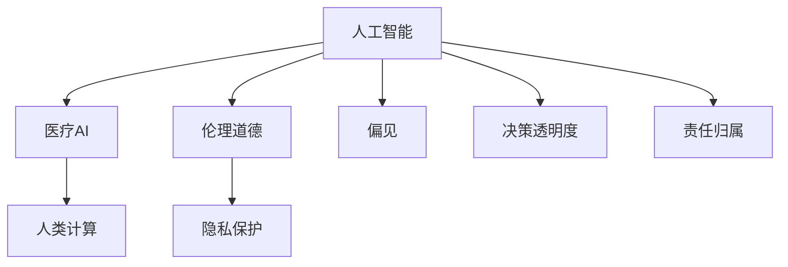

                 

# AI驱动的创新：人类计算在医疗行业的道德考虑

## 1. 背景介绍

### 1.1 问题由来
随着人工智能技术在各个领域的快速应用，医疗行业也逐渐引入了基于人工智能的计算模型。这些模型能够辅助医生进行疾病诊断、治疗方案选择、药物研发等工作，极大地提高了医疗服务的效率和精准度。然而，随着技术应用范围的不断扩大，关于人工智能在医疗行业的伦理道德问题也日益凸显。

人工智能技术的广泛应用，带来了诸如数据隐私保护、算法偏见、决策透明度等问题。这些问题不仅涉及到技术实现细节，更涉及深层次的伦理道德考量。这些问题如果不能妥善解决，将对人类健康和社会福祉造成潜在威胁。

### 1.2 问题核心关键点
人工智能在医疗行业的道德考虑，主要围绕以下几个关键点展开：
1. **数据隐私保护**：如何在收集和使用患者数据时，保护患者的隐私权益，防止数据泄露和滥用。
2. **算法偏见与公平性**：人工智能模型是否存在偏见，是否对所有人群公平，特别是对边缘群体和弱势群体。
3. **决策透明度**：人工智能模型如何提供透明和可解释的决策过程，让患者和医生能够理解和信任其决策。
4. **责任归属**：在发生误诊或误判时，人工智能应承担何种责任，是开发者、医疗机构还是患者。
5. **可解释性和可解释性**：人工智能模型的输出结果应具备可解释性，帮助医生和患者理解其决策依据。

这些问题不仅是对技术实现细节的探讨，更是对医疗伦理、法律和社会责任的深刻反思。本文旨在深入探讨这些问题，并提出一些可能的解决方案。

## 2. 核心概念与联系

### 2.1 核心概念概述

为了更好地理解这些问题，我们先介绍几个关键概念：

- **人工智能(AI)**：使用计算机算法和数据模型来模拟人类智能的技术。
- **医疗AI**：将人工智能技术应用于医疗行业，包括疾病诊断、治疗方案选择、药物研发等。
- **人类计算(Human Computation)**：利用人类的计算能力，辅助和增强人工智能系统的表现。
- **伦理道德(Ethics and Morality)**：在人工智能应用中，涉及到的道德规范和行为准则。
- **隐私保护(Privacy Protection)**：保护个人数据不被未授权访问和使用。
- **偏见(Bias)**：人工智能模型因数据偏差而产生的系统性错误。
- **决策透明度(Decision Transparency)**：人工智能模型应具备的可解释性，让使用者能够理解其决策过程。
- **责任归属(Accountability)**：在发生错误时，确定责任人的原则和机制。

这些概念之间的逻辑关系可以通过以下Mermaid流程图来展示：



这个流程图展示了人工智能在医疗行业的核心概念及其相互联系。

## 3. 核心算法原理 & 具体操作步骤
### 3.1 算法原理概述

人工智能在医疗行业的应用，涉及大量的数据分析、模式识别和预测任务。其中，基于监督学习的机器学习算法是主流的选择。这些算法通过在标注数据上训练模型，使其能够从数据中学习到规律，并应用于新数据的预测和分类。

常见的监督学习算法包括逻辑回归、支持向量机、决策树、随机森林等。这些算法能够处理结构化数据，但面对非结构化数据如文本和图像时，则需要借助深度学习模型。深度学习模型如卷积神经网络(CNN)、循环神经网络(RNN)、变压器(Transformer)等，通过多层神经网络结构，能够自动提取数据的高级特征，提高预测准确度。

在医疗行业中，常用的深度学习模型包括卷积神经网络用于图像识别，循环神经网络用于序列数据处理，变压器用于自然语言处理。这些模型在医疗图像分析、医学影像诊断、病历分析、药物研发等领域得到了广泛应用。

### 3.2 算法步骤详解

人工智能在医疗行业的具体应用步骤包括以下几个方面：

**Step 1: 数据收集与预处理**
- 收集和整理医疗数据，包括电子病历、医学影像、基因数据等。
- 对数据进行清洗、去噪、归一化等预处理，确保数据的质量和一致性。

**Step 2: 模型选择与训练**
- 根据任务需求选择合适的深度学习模型，并进行超参数调优。
- 在标注数据集上训练模型，调整模型结构、损失函数和优化器等，以提高模型性能。

**Step 3: 模型评估与验证**
- 使用验证集评估模型的性能，通过准确率、召回率、F1分数等指标进行衡量。
- 对模型进行验证，确保其在新数据上的泛化能力。

**Step 4: 部署与测试**
- 将训练好的模型部署到生产环境，进行实际应用测试。
- 对新数据进行测试，确保模型在新场景下的稳定性。

**Step 5: 持续学习与优化**
- 在实际应用中，持续收集反馈数据，对模型进行微调和优化。
- 引入新数据和新知识，不断更新和改进模型。

### 3.3 算法优缺点

人工智能在医疗行业的应用，具有以下优点：

1. **提高诊断准确度**：通过机器学习模型对大量数据进行分析，可以提高诊断的准确度和效率。
2. **辅助决策支持**：模型能够提供辅助诊断和治疗方案，帮助医生做出更科学的决策。
3. **降低医疗成本**：自动化处理部分重复性工作，减少医护人员的工作量，降低医疗成本。
4. **支持个性化医疗**：通过分析患者数据，提供个性化的治疗方案，提高治疗效果。

同时，这些算法也存在一些局限性：

1. **依赖高质量数据**：模型的性能很大程度上取决于数据的质量和数量，高质量的数据获取成本较高。
2. **算法偏见**：模型可能因训练数据中的偏见而产生系统性错误，特别是在处理边缘群体和弱势群体时。
3. **黑盒模型**：许多深度学习模型被视为"黑盒"模型，难以解释其决策过程，缺乏透明度。
4. **技术复杂性**：算法实现和模型训练需要较高的技术门槛，对非专业人员的普及性较低。
5. **数据隐私和安全**：数据收集和使用过程中，如何保护患者的隐私和安全，防止数据泄露和滥用，是一个重要的道德问题。

### 3.4 算法应用领域

人工智能在医疗行业的应用，涵盖了多个领域，包括但不限于：

1. **医学影像分析**：使用深度学习模型对医学影像进行自动分析和诊断，如CT、MRI、超声图像等。
2. **自然语言处理(NLP)**：利用自然语言处理技术，从病历、报告、文献等文本数据中提取有用信息，辅助医生诊断和治疗。
3. **药物研发**：通过分析大量的基因数据和化学数据，辅助药物设计和新药筛选。
4. **健康管理**：通过可穿戴设备收集的个人健康数据，提供个性化的健康管理和预警服务。
5. **智能咨询和问答**：基于自然语言处理技术，开发智能咨询和问答系统，提供医疗咨询服务。

## 4. 数学模型和公式 & 详细讲解 & 举例说明

### 4.1 数学模型构建

在人工智能的监督学习任务中，我们通常使用损失函数和优化器来训练模型。以下以一个简单的二分类任务为例，介绍其数学模型构建过程。

设模型 $M_{\theta}(x)$ 在输入 $x$ 上的输出为 $\hat{y}=M_{\theta}(x) \in [0,1]$，表示样本属于正类的概率。真实标签 $y \in \{0,1\}$。则二分类交叉熵损失函数定义为：

$$
\ell(M_{\theta}(x),y) = -[y\log \hat{y} + (1-y)\log (1-\hat{y})]
$$

在此基础上，我们定义经验风险为：

$$
\mathcal{L}(\theta) = \frac{1}{N}\sum_{i=1}^N \ell(M_{\theta}(x_i),y_i)
$$

其中 $N$ 为样本数量。

### 4.2 公式推导过程

通过链式法则，我们可以计算模型参数 $\theta_k$ 的梯度：

$$
\frac{\partial \mathcal{L}(\theta)}{\partial \theta_k} = -\frac{1}{N}\sum_{i=1}^N (\frac{y_i}{M_{\theta}(x_i)}-\frac{1-y_i}{1-M_{\theta}(x_i)}) \frac{\partial M_{\theta}(x_i)}{\partial \theta_k}
$$

其中 $\frac{\partial M_{\theta}(x_i)}{\partial \theta_k}$ 可以通过反向传播算法计算得到。

### 4.3 案例分析与讲解

以一个简单的医学影像分类任务为例，我们假设模型 $M_{\theta}(x)$ 在输入 $x$（医学影像）上的输出为 $\hat{y}=M_{\theta}(x) \in [0,1]$，表示该影像属于疾病的概率。真实标签 $y \in \{0,1\}$。

使用交叉熵损失函数，我们有：

$$
\ell(M_{\theta}(x),y) = -[y\log \hat{y} + (1-y)\log (1-\hat{y})]
$$

定义经验风险为：

$$
\mathcal{L}(\theta) = \frac{1}{N}\sum_{i=1}^N \ell(M_{\theta}(x_i),y_i)
$$

使用梯度下降算法，我们可以更新模型参数 $\theta_k$：

$$
\theta_k \leftarrow \theta_k - \eta \nabla_{\theta_k}\mathcal{L}(\theta)
$$

其中 $\eta$ 为学习率，$\nabla_{\theta_k}\mathcal{L}(\theta)$ 为损失函数对参数 $\theta_k$ 的梯度。

## 5. 项目实践：代码实例和详细解释说明

### 5.1 开发环境搭建

在进行人工智能在医疗行业的项目实践前，我们需要准备好开发环境。以下是使用Python进行PyTorch开发的环境配置流程：

1. 安装Anaconda：从官网下载并安装Anaconda，用于创建独立的Python环境。

2. 创建并激活虚拟环境：
```bash
conda create -n pytorch-env python=3.8 
conda activate pytorch-env
```

3. 安装PyTorch：根据CUDA版本，从官网获取对应的安装命令。例如：
```bash
conda install pytorch torchvision torchaudio cudatoolkit=11.1 -c pytorch -c conda-forge
```

4. 安装Transformers库：
```bash
pip install transformers
```

5. 安装各类工具包：
```bash
pip install numpy pandas scikit-learn matplotlib tqdm jupyter notebook ipython
```

完成上述步骤后，即可在`pytorch-env`环境中开始项目实践。

### 5.2 源代码详细实现

这里我们以医学影像分类任务为例，给出使用Transformers库对BERT模型进行微调的PyTorch代码实现。

首先，定义医学影像分类任务的数据处理函数：

```python
from transformers import BertForImageClassification, BertImageProcessor, AdamW
from torch.utils.data import Dataset, DataLoader
from PIL import Image
import torch
import os

class ImageDataset(Dataset):
    def __init__(self, data_dir, labels, tokenizer, img_size=512, patch_size=64, max_seq_len=2048):
        self.data_dir = data_dir
        self.labels = labels
        self.tokenizer = tokenizer
        self.img_size = img_size
        self.patch_size = patch_size
        self.max_seq_len = max_seq_len
        
    def __len__(self):
        return len(self.labels)
    
    def __getitem__(self, idx):
        img_path = os.path.join(self.data_dir, self.labels[idx])
        img = Image.open(img_path).convert('RGB')
        img = img.resize((self.img_size, self.img_size))
        img = img.crop((self.patch_size, self.patch_size, self.patch_size+self.patch_size, self.patch_size+self.patch_size))
        img = self.tokenizer(img, return_tensors='pt', max_length=self.max_seq_len, padding='max_length', truncation=True)
        input_ids = img['pixel_values'][:, :,-1:]
        labels = torch.tensor(self.labels[idx], dtype=torch.long)
        return {'input_ids': input_ids, 
                'labels': labels}

# 数据集准备
tokenizer = BertTokenizer.from_pretrained('bert-base-uncased')
train_dataset = ImageDataset(train_data_dir, train_labels, tokenizer)
dev_dataset = ImageDataset(dev_data_dir, dev_labels, tokenizer)
test_dataset = ImageDataset(test_data_dir, test_labels, tokenizer)

# 模型和优化器
model = BertForImageClassification.from_pretrained('bert-base-uncased', num_labels=num_labels)
optimizer = AdamW(model.parameters(), lr=2e-5)
```

然后，定义训练和评估函数：

```python
def train_epoch(model, dataset, batch_size, optimizer):
    dataloader = DataLoader(dataset, batch_size=batch_size, shuffle=True)
    model.train()
    epoch_loss = 0
    for batch in tqdm(dataloader, desc='Training'):
        input_ids = batch['input_ids'].to(device)
        labels = batch['labels'].to(device)
        model.zero_grad()
        outputs = model(input_ids, labels=labels)
        loss = outputs.loss
        epoch_loss += loss.item()
        loss.backward()
        optimizer.step()
    return epoch_loss / len(dataloader)

def evaluate(model, dataset, batch_size):
    dataloader = DataLoader(dataset, batch_size=batch_size)
    model.eval()
    preds, labels = [], []
    with torch.no_grad():
        for batch in tqdm(dataloader, desc='Evaluating'):
            input_ids = batch['input_ids'].to(device)
            labels = batch['labels']
            outputs = model(input_ids, labels=labels)
            batch_preds = outputs.logits.argmax(dim=1).to('cpu').tolist()
            batch_labels = batch_labels.to('cpu').tolist()
            for pred, label in zip(batch_preds, batch_labels):
                preds.append(pred)
                labels.append(label)
                
    print(classification_report(labels, preds))
```

最后，启动训练流程并在测试集上评估：

```python
epochs = 5
batch_size = 16

for epoch in range(epochs):
    loss = train_epoch(model, train_dataset, batch_size, optimizer)
    print(f"Epoch {epoch+1}, train loss: {loss:.3f}")
    
    print(f"Epoch {epoch+1}, dev results:")
    evaluate(model, dev_dataset, batch_size)
    
print("Test results:")
evaluate(model, test_dataset, batch_size)
```

以上就是使用PyTorch对BERT进行医学影像分类任务微调的完整代码实现。可以看到，得益于Transformers库的强大封装，我们可以用相对简洁的代码完成BERT模型的加载和微调。

### 5.3 代码解读与分析

让我们再详细解读一下关键代码的实现细节：

**ImageDataset类**：
- `__init__`方法：初始化数据路径、标签、分词器等关键组件。
- `__len__`方法：返回数据集的样本数量。
- `__getitem__`方法：对单个样本进行处理，将图像输入转换为token ids，将标签转换为数字，并对其进行定长padding，最终返回模型所需的输入。

**tokenizer**：
- 定义了图像数据和文本数据的转换器，用于将图像转换为模型可接受的输入。

**训练和评估函数**：
- 使用PyTorch的DataLoader对数据集进行批次化加载，供模型训练和推理使用。
- 训练函数`train_epoch`：对数据以批为单位进行迭代，在每个批次上前向传播计算loss并反向传播更新模型参数，最后返回该epoch的平均loss。
- 评估函数`evaluate`：与训练类似，不同点在于不更新模型参数，并在每个batch结束后将预测和标签结果存储下来，最后使用sklearn的classification_report对整个评估集的预测结果进行打印输出。

**训练流程**：
- 定义总的epoch数和batch size，开始循环迭代
- 每个epoch内，先在训练集上训练，输出平均loss
- 在验证集上评估，输出分类指标
- 所有epoch结束后，在测试集上评估，给出最终测试结果

可以看到，PyTorch配合Transformers库使得BERT微调的代码实现变得简洁高效。开发者可以将更多精力放在数据处理、模型改进等高层逻辑上，而不必过多关注底层的实现细节。

当然，工业级的系统实现还需考虑更多因素，如模型的保存和部署、超参数的自动搜索、更灵活的任务适配层等。但核心的微调范式基本与此类似。

## 6. 实际应用场景
### 6.1 智能诊断系统

基于人工智能的智能诊断系统，能够自动分析医学影像、病历等数据，辅助医生进行诊断和治疗决策。这不仅提高了诊断的准确度和效率，还能降低医疗成本，提高医疗服务的可及性。

在技术实现上，可以收集和整理大量的医学影像和病历数据，通过预训练和微调模型，使其能够自动提取和分析有用的特征，进行疾病诊断和预测。例如，使用卷积神经网络对医学影像进行分析，使用自然语言处理技术对病历进行理解，然后结合这两种结果，综合判断患者的病情。

### 6.2 个性化治疗方案

人工智能可以帮助医生根据患者的具体情况，制定个性化的治疗方案。这包括用药、手术、康复等方面的建议，提高治疗效果，减少副作用。

在实践上，可以收集患者的病历、基因数据、影像数据等，通过预训练和微调模型，分析出患者的病情和可能的治疗方案，然后生成个性化的治疗建议。例如，根据基因数据和影像数据，判断患者的疾病类型和可能的治疗方式，并提供相应的治疗方案。

### 6.3 药物研发

人工智能在药物研发中的应用，可以大大加速新药的发现和开发。传统的药物研发过程周期长、成本高，而人工智能可以通过分析大量的基因数据和化学数据，辅助药物设计和新药筛选。

在实践中，可以使用深度学习模型对化学数据进行分析和预测，筛选出有潜力的候选药物，然后进行进一步的实验验证。例如，使用生成对抗网络(GAN)生成新的化合物，使用卷积神经网络分析其性质，然后筛选出有治疗效果的化合物。

### 6.4 未来应用展望

随着人工智能技术的不断进步，其在医疗行业的应用也将更加广泛和深入。未来，人工智能将在以下几个方面发挥重要作用：

1. **智慧医疗**：通过智能诊断、个性化治疗、远程医疗等方式，提升医疗服务的质量和效率。
2. **医疗数据分析**：通过大数据分析和人工智能模型，挖掘医疗数据中的有用信息，辅助决策。
3. **健康管理**：通过可穿戴设备收集个人健康数据，提供个性化的健康管理和服务。
4. **药物研发**：加速新药的发现和开发，降低药物研发成本，提高药物研发效率。
5. **医疗伦理**：通过人工智能技术，探索新的伦理道德问题，推动医学伦理的发展。

总之，人工智能在医疗行业的应用前景广阔，但同时也带来了新的伦理道德挑战。如何平衡技术进步和伦理道德，确保人工智能技术的安全、可靠和可控，将是未来亟待解决的问题。

## 7. 工具和资源推荐
### 7.1 学习资源推荐

为了帮助开发者系统掌握人工智能在医疗行业的伦理道德问题，这里推荐一些优质的学习资源：

1. 《深度学习》课程：由斯坦福大学开设，介绍了深度学习的基本概念和应用。
2. 《人工智能伦理》课程：介绍人工智能伦理的基本概念和重要问题。
3. 《人工智能与医疗》书籍：介绍了人工智能在医疗行业的应用和伦理道德问题。
4. 《人工智能与医疗伦理》论文集：收集了多篇关于人工智能在医疗行业伦理道德问题的论文，提供了丰富的学术资源。
5. 《人工智能伦理手册》：介绍了人工智能伦理的基本原则和应用指南。

通过对这些资源的学习实践，相信你一定能够深入理解人工智能在医疗行业的伦理道德问题，并用于解决实际的医疗问题。
### 7.2 开发工具推荐

高效的开发离不开优秀的工具支持。以下是几款用于人工智能在医疗行业开发的工具：

1. PyTorch：基于Python的开源深度学习框架，灵活动态的计算图，适合快速迭代研究。大部分预训练语言模型都有PyTorch版本的实现。
2. TensorFlow：由Google主导开发的开源深度学习框架，生产部署方便，适合大规模工程应用。同样有丰富的预训练语言模型资源。
3. Transformers库：HuggingFace开发的NLP工具库，集成了众多SOTA语言模型，支持PyTorch和TensorFlow，是进行人工智能在医疗行业开发的重要工具。
4. Weights & Biases：模型训练的实验跟踪工具，可以记录和可视化模型训练过程中的各项指标，方便对比和调优。
5. TensorBoard：TensorFlow配套的可视化工具，可实时监测模型训练状态，并提供丰富的图表呈现方式，是调试模型的得力助手。
6. Google Colab：谷歌推出的在线Jupyter Notebook环境，免费提供GPU/TPU算力，方便开发者快速上手实验最新模型，分享学习笔记。

合理利用这些工具，可以显著提升人工智能在医疗行业的开发效率，加快创新迭代的步伐。

### 7.3 相关论文推荐

人工智能在医疗行业的伦理道德问题，涉及多个学科的交叉研究。以下是几篇奠基性的相关论文，推荐阅读：

1. 《AI in Healthcare: Ethical, Legal, and Social Implications》：介绍了人工智能在医疗行业的应用和伦理道德问题。
2. 《Deep Learning in Healthcare: A Systematic Review》：对深度学习在医疗行业的应用进行了系统回顾。
3. 《AI Ethics in Medicine》：介绍了人工智能在医疗行业伦理道德问题的研究现状和未来方向。
4. 《The Ethics of AI in Medicine》：讨论了人工智能在医疗行业伦理道德问题的重要性和挑战。
5. 《Machine Learning for Health: Ethical Considerations and Opportunities》：介绍了机器学习在医疗行业伦理道德问题的重要性和未来方向。

这些论文代表了大数据和人工智能在医疗行业应用的发展脉络，提供了丰富的学术资源，值得深入学习。

## 8. 总结：未来发展趋势与挑战
### 8.1 总结

本文对人工智能在医疗行业的伦理道德问题进行了全面系统的探讨。首先，我们介绍了人工智能在医疗行业的应用背景和核心概念，明确了其在提高诊断准确度、辅助决策支持、降低医疗成本等方面的独特价值。其次，我们深入分析了人工智能在医疗行业应用中面临的伦理道德问题，包括数据隐私保护、算法偏见与公平性、决策透明度、责任归属、可解释性等方面。最后，我们提出了一些可能的解决方案，包括数据匿名化、公平性审计、决策可解释、责任分担机制等。

通过本文的系统梳理，可以看到，人工智能在医疗行业的应用不仅带来了技术上的进步，也带来了伦理道德上的挑战。如何在技术进步和伦理道德之间找到平衡点，确保人工智能技术的安全、可靠和可控，将是未来亟待解决的问题。

### 8.2 未来发展趋势

展望未来，人工智能在医疗行业的应用将呈现以下几个趋势：

1. **技术成熟化**：随着技术不断进步，人工智能在医疗行业的应用将更加成熟和稳定，性能和可靠性将不断提高。
2. **伦理规范化**：随着人工智能在医疗行业应用的普及，相关伦理规范将逐步建立和完善，确保技术应用的安全和公正。
3. **多学科融合**：人工智能将与医疗数据科学、医学伦理、法律、社会学等多学科进行深度融合，推动医疗行业的整体进步。
4. **个性化医疗**：基于人工智能技术，个性化医疗将更加普及，提高治疗效果和患者体验。
5. **远程医疗普及**：人工智能将推动远程医疗的发展，提高医疗服务的可及性和便利性。

这些趋势将进一步推动人工智能在医疗行业的广泛应用，为人类健康和社会福祉带来新的突破。

### 8.3 面临的挑战

尽管人工智能在医疗行业的应用前景广阔，但也面临着诸多挑战：

1. **数据隐私和安全**：如何在收集和使用患者数据时，保护患者的隐私权益，防止数据泄露和滥用。
2. **算法偏见**：如何避免算法偏见，确保模型对所有人群公平，特别是对边缘群体和弱势群体。
3. **决策透明度**：如何提供透明和可解释的决策过程，让患者和医生能够理解和信任其决策。
4. **责任归属**：在发生误诊或误判时，如何确定责任人的原则和机制。
5. **可解释性**：如何赋予模型更强的可解释性，提高模型的透明度和可信度。

这些挑战需要我们在技术实现、伦理道德和法律制度等多个层面进行深入探讨和解决。

### 8.4 研究展望

面对人工智能在医疗行业的伦理道德挑战，未来的研究需要在以下几个方面寻求新的突破：

1. **数据隐私保护技术**：开发新的数据隐私保护技术，如差分隐私、联邦学习等，确保数据安全和隐私保护。
2. **公平性和偏见检测**：开发公平性和偏见检测技术，确保模型对所有人群公平，防止算法偏见。
3. **模型透明性和可解释性**：开发模型透明性和可解释性技术，提高模型的透明度和可信度。
4. **责任分担机制**：建立责任分担机制，明确各方的责任和义务，确保医疗服务的公正和安全。
5. **多学科协作**：加强跨学科协作，推动人工智能与医疗数据科学、医学伦理、法律、社会学等多学科的深度融合。

这些研究方向的探索，将进一步推动人工智能在医疗行业的广泛应用，为人类健康和社会福祉带来新的突破。

## 9. 附录：常见问题与解答

**Q1：人工智能在医疗行业应用中存在哪些伦理道德问题？**

A: 人工智能在医疗行业应用中存在以下伦理道德问题：
1. 数据隐私保护：如何在收集和使用患者数据时，保护患者的隐私权益，防止数据泄露和滥用。
2. 算法偏见与公平性：如何避免算法偏见，确保模型对所有人群公平，特别是对边缘群体和弱势群体。
3. 决策透明度：如何提供透明和可解释的决策过程，让患者和医生能够理解和信任其决策。
4. 责任归属：在发生误诊或误判时，如何确定责任人的原则和机制。
5. 可解释性：如何赋予模型更强的可解释性，提高模型的透明度和可信度。

这些问题是人工智能在医疗行业应用中必须面对的重要伦理道德问题，需要通过技术手段、伦理规范和法律制度等多方面的努力来解决。

**Q2：如何保护患者的数据隐私？**

A: 保护患者数据隐私，可以采取以下措施：
1. 数据匿名化：对患者的敏感信息进行去标识化处理，防止数据泄露。
2. 差分隐私：在数据收集和分析过程中，使用差分隐私技术，确保数据隐私保护。
3. 联邦学习：采用联邦学习技术，在本地设备上训练模型，防止数据集中存储和泄露。
4. 数据加密：对患者数据进行加密存储和传输，防止未授权访问和数据泄露。

这些措施可以有效保护患者的数据隐私，确保数据的合法合规使用。

**Q3：如何避免算法偏见？**

A: 避免算法偏见，可以采取以下措施：
1. 数据平衡：确保训练数据的多样性和平衡性，防止数据偏见影响模型。
2. 公平性审计：定期对模型进行公平性审计，检测和修正模型中的偏见。
3. 算法改进：采用公平性改进技术，如重采样、权衡损失函数等，减少模型中的偏见。
4. 多样化训练：引入多样化的训练数据，扩大模型的知识面，减少偏见影响。

这些措施可以有效避免算法偏见，确保模型对所有人群公平。

**Q4：如何提高模型的透明度和可解释性？**

A: 提高模型的透明度和可解释性，可以采取以下措施：
1. 可解释性模型：使用可解释性模型，如决策树、规则模型等，提高模型的透明度。
2. 可视化工具：使用可视化工具，如LIME、SHAP等，对模型的决策过程进行解释和可视化。
3. 公开透明：公开模型训练和使用的数据、算法、过程等信息，提高模型的透明度和可信度。
4. 用户教育：对用户进行教育和培训，提高用户对模型输出结果的理解和接受度。

这些措施可以有效提高模型的透明度和可解释性，增强用户对模型的信任和理解。

**Q5：如何建立责任分担机制？**

A: 建立责任分担机制，可以采取以下措施：
1. 法律规范：制定相关法律法规，明确各方的责任和义务，确保责任分担机制的合法性和公正性。
2. 责任保险：引入责任保险机制，对因人工智能错误导致的损失进行补偿和赔偿。
3. 责任追溯：建立责任追溯机制，对人工智能错误进行追责和处理。
4. 责任预警：建立责任预警机制，对人工智能错误进行预警和预防。

这些措施可以有效建立责任分担机制，确保人工智能技术应用的安全和公正。

总之，人工智能在医疗行业的应用虽然带来了巨大的技术进步，但也带来了诸多伦理道德问题。如何在技术进步和伦理道德之间找到平衡点，确保人工智能技术的安全、可靠和可控，将是未来亟待解决的问题。通过不断探索和改进，相信人工智能在医疗行业的应用将更加广泛和深入，为人类健康和社会福祉带来新的突破。

---

作者：禅与计算机程序设计艺术 / Zen and the Art of Computer Programming

