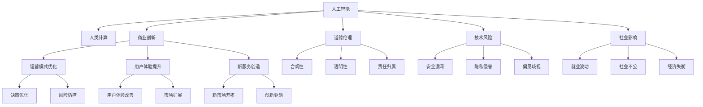

                 

# AI驱动的创新：人类计算在商业中的道德考虑因素总结挑战

> 关键词：人工智能(AI)、人类计算、商业创新、道德伦理、技术风险、社会影响

## 1. 背景介绍

### 1.1 问题由来

在过去的十年中，人工智能(AI)已经从一个边缘技术变成了商业世界的核心驱动力。从自动化办公到智能客服，从精准营销到个性化推荐，AI技术正在以指数级的速度改变企业的运营模式和市场格局。

随着AI技术的深入应用，越来越多的企业开始将其视为提升竞争力和创造新价值的利器。然而，在这一过程中，也伴随着一系列复杂的伦理和社会问题，这些问题在很大程度上制约着AI技术的广泛应用和深入发展。

### 1.2 问题核心关键点

AI技术的应用，不仅涉及技术本身的创新和效率提升，还牵扯到一系列深层次的道德和伦理问题，包括但不限于：

- **数据隐私和安全**：企业利用用户数据进行AI训练时，如何保护用户隐私不被滥用。
- **算法透明度**：AI模型的决策过程是否透明，其结果是否可解释，对用户决策的影响如何。
- **公平性和偏见**：AI系统是否会对特定群体产生歧视，是否会放大现有的社会不公。
- **决策责任**：当AI系统出现失误或偏差时，谁来承担责任，如何确保责任追究的公正性。
- **就业影响**：AI技术的应用是否会导致大规模失业，如何平衡技术进步和就业保障。
- **伦理框架**：AI技术的研发和应用应遵循哪些伦理原则，如何建立完善的监管体系。

这些问题的复杂性和多样性，要求企业在应用AI技术时必须具备高度的道德责任感和风险意识，同时也需要政府和社会各界的共同参与和监督。

## 2. 核心概念与联系

### 2.1 核心概念概述

为更好地理解AI技术在商业中的道德应用问题，本节将介绍几个密切相关的核心概念：

- **人工智能(AI)**：利用计算机模拟人类智能过程的技术，包括但不限于机器学习、深度学习、自然语言处理等。
- **人类计算(Human-in-the-loop, HITL)**：一种将人类与AI系统结合的协作模式，通过人类对AI结果进行校验和反馈，实现机器与人类的协作优化。
- **商业创新**：企业在AI技术驱动下，通过优化运营模式、提升用户体验、创造新服务等方式，实现竞争力和盈利能力的提升。
- **道德伦理**：在AI应用中，遵循的道德规范和伦理原则，旨在保障技术应用的安全性、公正性和社会责任。
- **技术风险**：AI技术的广泛应用可能带来的潜在风险，如安全漏洞、隐私侵害、偏见歧视等。
- **社会影响**：AI技术的应用对社会结构、就业市场、经济运行等多方面可能产生的深远影响。

这些核心概念之间的逻辑关系可以通过以下Mermaid流程图来展示：



这个流程图展示了一些关键概念之间的内在联系：

1. AI技术通过优化运营模式、提升用户体验、创造新服务等形式驱动商业创新。
2. 在AI应用过程中，道德伦理和技术风险是必须考虑的重要因素。
3. AI技术的应用可能对社会结构、就业市场、经济运行等方面产生深远影响。
4. 通过人类计算的协作模式，可以实现AI与人类间的相互监督和优化。

这些概念共同构成了AI技术在商业应用中的复杂生态系统，理解它们之间的关系是解决道德问题的基础。

## 3. 核心算法原理 & 具体操作步骤
### 3.1 算法原理概述

AI驱动的商业创新，本质上是一个多层次、多因素的复杂系统。其核心算法原理主要包括以下几个方面：

- **数据收集与预处理**：通过网络爬虫、API接口等方式，收集相关的数据，并进行数据清洗、标注、特征工程等预处理工作。
- **模型训练与优化**：使用机器学习或深度学习算法，对预处理后的数据进行模型训练，并根据验证集的表现进行超参数调优。
- **模型部署与监控**：将训练好的模型部署到生产环境，并在实际使用中进行监控和调整，确保模型的稳定性和效果。
- **反馈与迭代**：通过人类计算的方式，收集用户的反馈和行为数据，对模型进行持续优化和迭代。

### 3.2 算法步骤详解

AI驱动的商业创新涉及多个环节，具体步骤如下：

**Step 1: 数据收集与预处理**
- 使用数据爬虫、API接口等方式收集相关数据。
- 清洗数据，去除噪声和异常值。
- 进行数据标注，确保数据的准确性和代表性。
- 进行特征工程，提取数据中的关键特征，用于模型训练。

**Step 2: 模型训练与优化**
- 选择合适的机器学习或深度学习算法，如决策树、随机森林、神经网络等。
- 使用交叉验证等方法，进行模型训练和调优，确保模型的泛化能力。
- 使用正则化、Dropout等方法，防止过拟合，提升模型稳定性。

**Step 3: 模型部署与监控**
- 将训练好的模型部署到生产环境，进行实时监控。
- 定期评估模型效果，确保其符合业务需求。
- 根据监控结果，及时调整模型参数，进行迭代优化。

**Step 4: 反馈与迭代**
- 通过用户反馈、行为数据分析等途径，收集模型应用的实际效果。
- 根据反馈结果，调整模型训练策略，进行迭代优化。
- 引入人类计算的协作模式，对AI结果进行校验和反馈，实现持续优化。

### 3.3 算法优缺点

AI驱动的商业创新，具有以下优点：

1. **提升效率和效益**：通过AI技术优化运营模式、提升用户体验、创造新服务等方式，企业可以显著提升运营效率和盈利能力。
2. **降低运营成本**：AI技术可以替代大量繁琐重复的劳动，减少人工成本。
3. **增强决策科学性**：AI技术可以通过数据分析和建模，提供科学决策的依据，减少人为误判。
4. **实现个性化服务**：AI技术可以根据用户行为和偏好，提供个性化推荐和定制化服务，提升用户体验。

同时，AI驱动的商业创新也存在以下缺点：

1. **数据隐私和安全问题**：在收集和处理用户数据时，如何保护用户隐私，防止数据泄露，是一个重大挑战。
2. **算法透明度和可解释性不足**：AI模型的决策过程往往难以解释，用户难以理解和信任模型的结果。
3. **公平性和偏见问题**：AI模型可能存在数据偏见，对特定群体产生歧视，放大现有的社会不公。
4. **决策责任归属问题**：当AI系统出现失误或偏差时，如何确定责任归属，是一个复杂的法律和伦理问题。
5. **就业影响问题**：AI技术的应用可能导致大规模失业，需要考虑如何平衡技术进步和就业保障。
6. **伦理框架缺失问题**：目前缺乏完善的伦理框架，指导AI技术的研发和应用。

### 3.4 算法应用领域

AI驱动的商业创新，已经在多个领域取得了显著成效，包括但不限于：

- **零售业**：通过AI技术优化库存管理、个性化推荐、智能客服等，提升用户体验和运营效率。
- **金融业**：利用AI进行风险评估、欺诈检测、智能投顾等，提升金融服务的智能化水平。
- **医疗健康**：利用AI进行疾病预测、诊断支持、智能监控等，提升医疗服务的精准性和效率。
- **制造业**：通过AI优化生产流程、预测设备故障、质量控制等，提升生产效率和产品质量。
- **物流业**：利用AI进行路线规划、配送调度、库存管理等，提升物流效率和降低成本。

除了上述这些领域，AI技术在更多行业的应用还在持续拓展，为各行各业带来了新的创新和发展机遇。

## 4. 数学模型和公式 & 详细讲解 & 举例说明（备注：数学公式请使用latex格式，latex嵌入文中独立段落使用 $$，段落内使用 $)
### 4.1 数学模型构建

在AI驱动的商业创新中，数学模型是不可或缺的基石。以下我们将以推荐系统为例，介绍其基本的数学模型构建过程。

推荐系统的主要目标是预测用户对某个物品的评分，模型需要训练多个特征(X)与用户评分(y)之间的关系。假设训练数据集为 $D=\{(x_i, y_i)\}_{i=1}^N$，其中 $x_i$ 为特征向量，$y_i$ 为用户评分。

定义线性回归模型为 $y_i = \theta_0 + \theta_1 x_{i1} + \theta_2 x_{i2} + \ldots + \theta_p x_{ip}$，其中 $\theta_0, \theta_1, \ldots, \theta_p$ 为模型参数。

定义损失函数为均方误差（MSE）损失，即 $L(\theta) = \frac{1}{N} \sum_{i=1}^N (y_i - \hat{y}_i)^2$，其中 $\hat{y}_i = \theta_0 + \theta_1 x_{i1} + \theta_2 x_{i2} + \ldots + \theta_p x_{ip}$ 为模型预测值。

### 4.2 公式推导过程

在线性回归模型中，我们使用梯度下降（Gradient Descent）算法进行参数优化。梯度下降的更新公式为：

$$
\theta_j = \theta_j - \eta \frac{1}{N} \sum_{i=1}^N \frac{\partial L(\theta)}{\partial \theta_j}
$$

其中 $\eta$ 为学习率。根据均方误差损失函数的梯度，我们可以得到：

$$
\frac{\partial L(\theta)}{\partial \theta_j} = \frac{2}{N} \sum_{i=1}^N (\hat{y}_i - y_i) x_{ij}
$$

将上式代入梯度下降公式，可以得到完整的线性回归模型参数更新算法：

$$
\theta_j = \theta_j - \eta \frac{2}{N} \sum_{i=1}^N (\hat{y}_i - y_i) x_{ij}
$$

### 4.3 案例分析与讲解

以推荐系统为例，我们以用户ID、物品ID和用户对物品的评分作为输入特征，使用线性回归模型进行训练。假设有100个用户对200个物品的评分数据，我们使用随机梯度下降（Stochastic Gradient Descent）进行模型训练。

具体步骤如下：

1. 将数据划分为训练集和测试集，每个用户-物品对作为一个样本，每个样本包含三个特征。
2. 使用线性回归模型进行模型训练，初始化模型参数。
3. 使用随机梯度下降算法，对每个样本进行一次参数更新。
4. 在测试集上评估模型效果，输出均方误差损失。
5. 根据损失函数，调整学习率和参数更新策略，继续迭代训练。

通过上述步骤，我们得到了一个可以预测用户评分的新模型，利用该模型可以对新用户-物品对进行评分预测，从而实现个性化推荐。

## 5. 项目实践：代码实例和详细解释说明
### 5.1 开发环境搭建

在进行推荐系统项目实践前，我们需要准备好开发环境。以下是使用Python进行TensorFlow和Keras开发的开发环境配置流程：

1. 安装Anaconda：从官网下载并安装Anaconda，用于创建独立的Python环境。

2. 创建并激活虚拟环境：
```bash
conda create -n recsys-env python=3.8 
conda activate recsys-env
```

3. 安装TensorFlow和Keras：
```bash
conda install tensorflow keras
```

4. 安装Pandas、NumPy等常用工具包：
```bash
pip install pandas numpy
```

完成上述步骤后，即可在`recsys-env`环境中开始推荐系统项目的开发。

### 5.2 源代码详细实现

这里我们以TensorFlow和Keras实现一个简单的推荐系统为例，给出完整的代码实现。

首先，定义数据集：

```python
import pandas as pd
import numpy as np

# 读取数据集
data = pd.read_csv('data.csv')

# 将数据集划分为训练集和测试集
train_data = data.sample(frac=0.8, random_state=0)
test_data = data.drop(train_data.index)
```

然后，定义模型：

```python
from tensorflow.keras import Sequential
from tensorflow.keras.layers import Dense

# 定义模型结构
model = Sequential()
model.add(Dense(64, input_shape=(3,), activation='relu'))
model.add(Dense(1, activation='linear'))

# 编译模型
model.compile(optimizer='adam', loss='mse')
```

接着，训练模型：

```python
# 训练模型
model.fit(train_data[['user_id', 'item_id', 'rating']], train_data['rating'], epochs=50, batch_size=32)
```

最后，评估模型：

```python
# 在测试集上评估模型
test_predictions = model.predict(test_data[['user_id', 'item_id']])
mse_loss = np.mean((test_predictions - test_data['rating']) ** 2)
print('MSE Loss:', mse_loss)
```

以上就是使用TensorFlow和Keras实现推荐系统的完整代码实现。可以看到，通过这些简单的代码，我们就能构建一个基本的推荐系统模型，并进行训练和评估。

### 5.3 代码解读与分析

让我们再详细解读一下关键代码的实现细节：

**数据处理**：
- `pd.read_csv('data.csv')`：读取数据集。
- `data.sample(frac=0.8, random_state=0)`：随机采样80%的数据作为训练集，剩余20%作为测试集。

**模型定义**：
- `Sequential()`：定义一个顺序模型。
- `model.add(Dense(64, input_shape=(3,), activation='relu'))`：添加一个具有64个神经元的全连接层，激活函数为ReLU。
- `model.add(Dense(1, activation='linear'))`：添加一个具有1个神经元的线性输出层。
- `model.compile(optimizer='adam', loss='mse')`：编译模型，使用Adam优化器和均方误差损失函数。

**模型训练**：
- `model.fit(train_data[['user_id', 'item_id', 'rating']], train_data['rating'], epochs=50, batch_size=32)`：使用训练集进行模型训练，设置训练轮数为50，批次大小为32。

**模型评估**：
- `model.predict(test_data[['user_id', 'item_id']])`：在测试集上进行预测。
- `np.mean((test_predictions - test_data['rating']) ** 2)`：计算预测结果与真实值之间的均方误差。

可以看到，通过TensorFlow和Keras，我们可以轻松地构建和训练推荐系统模型。然而，在实际应用中，还需要进一步优化模型的结构和训练策略，才能获得更好的性能。

## 6. 实际应用场景
### 6.1 智能客服系统

AI驱动的智能客服系统，可以通过分析用户查询记录和互动历史，提供更加个性化的服务。具体而言，可以利用自然语言处理技术，将用户的自然语言查询转化为结构化的信息，并使用推荐系统模型进行匹配，给出最佳答案。

例如，某电商平台可以根据用户浏览记录和购买历史，推荐用户可能感兴趣的商品，并根据用户的反馈实时调整推荐策略。这样的智能客服系统，能够极大地提升用户体验和满意度。

### 6.2 金融风控系统

金融行业对风险控制有着极高的要求，利用AI技术可以构建智能风控系统，实时监控客户的信用行为，预测其风险水平，并采取相应的风险控制措施。

例如，某银行可以基于用户的交易记录、社交行为等数据，构建用户风险评分模型，并根据评分结果进行贷款审批和信用评估。这样的智能风控系统，能够有效降低金融风险，保障银行资产安全。

### 6.3 医疗健康系统

AI技术在医疗健康领域有着广泛的应用，可以通过数据分析和模型预测，提升诊断和治疗的精准性和效率。

例如，某医院可以利用AI技术分析患者的病历记录和检查结果，预测其患病风险，并给出个性化的治疗建议。这样的智能健康系统，能够提升医疗服务的质量和效率，降低误诊和误治的风险。

### 6.4 未来应用展望

随着AI技术的不断进步，未来AI驱动的商业创新将有更广阔的应用前景。以下是几个可能的方向：

- **跨领域融合**：AI技术可以与其他技术如物联网、区块链等进行深度融合，实现更全面的智能应用。
- **智能化生产**：AI技术可以应用于智能制造、智慧工厂等领域，提升生产效率和产品质量。
- **智能化交通**：AI技术可以应用于智能交通系统，提升交通管理效率，减少交通事故。
- **智慧城市**：AI技术可以应用于智慧城市建设，提升城市管理效率，改善居民生活质量。
- **个性化教育**：AI技术可以应用于个性化教育，根据学生的学习习惯和兴趣，提供个性化的学习资源和辅导。

## 7. 工具和资源推荐
### 7.1 学习资源推荐

为了帮助开发者系统掌握AI驱动的商业创新技术，这里推荐一些优质的学习资源：

1. **《深度学习》课程**：斯坦福大学开设的深度学习课程，详细介绍了深度学习的基本原理和应用场景，适合初学者入门。
2. **TensorFlow官方文档**：TensorFlow的官方文档，提供了详细的API文档和示例代码，适合开发者学习和实践。
3. **Keras官方文档**：Keras的官方文档，提供了丰富的教程和案例，适合初学者快速上手。
4. **Coursera和Udacity**：Coursera和Udacity等在线教育平台，提供大量的AI课程和实战项目，适合提升实战能力。
5. **Kaggle竞赛**：Kaggle是一个数据科学竞赛平台，提供大量的实际数据集和竞赛项目，适合提升数据处理和模型构建能力。

通过对这些资源的学习实践，相信你一定能够快速掌握AI驱动的商业创新技术，并用于解决实际的业务问题。

### 7.2 开发工具推荐

高效的开发离不开优秀的工具支持。以下是几款用于AI驱动的商业创新开发的常用工具：

1. **Jupyter Notebook**：一个强大的交互式开发环境，支持多种编程语言和数据分析工具，适合数据科学家和开发者使用。
2. **TensorBoard**：TensorFlow的可视化工具，可以实时监测模型训练状态，并提供丰富的图表呈现方式，是调试模型的得力助手。
3. **GitLab**：一个集成的软件开发平台，支持版本控制、代码审查、持续集成等功能，适合团队协作开发。
4. **Hadoop和Spark**：分布式计算框架，适合处理大规模数据集，提升数据处理效率。
5. **Apache Kafka**：一个分布式流处理平台，适合实时数据采集和传输，提升数据实时性。

合理利用这些工具，可以显著提升AI驱动的商业创新开发效率，加快创新迭代的步伐。

### 7.3 相关论文推荐

AI驱动的商业创新技术的发展源于学界的持续研究。以下是几篇奠基性的相关论文，推荐阅读：

1. **《深度学习》书籍**：深度学习领域的经典著作，详细介绍了深度学习的基本原理和应用场景。
2. **《神经网络与深度学习》书籍**：深度学习领域的另一本经典著作，适合初学者全面了解深度学习技术。
3. **《强化学习》书籍**：强化学习领域的经典著作，详细介绍了强化学习的基本原理和应用场景。
4. **《人类计算》论文**：探讨了人类计算的概念和应用，适合理解AI与人类协作的模式。
5. **《数据隐私与伦理》论文**：探讨了数据隐私和伦理问题，适合理解AI技术应用的道德考虑。

这些论文代表了大数据驱动的商业创新技术的发展脉络。通过学习这些前沿成果，可以帮助研究者把握学科前进方向，激发更多的创新灵感。

## 8. 总结：未来发展趋势与挑战
### 8.1 总结

本文对AI驱动的商业创新进行了全面系统的介绍。首先阐述了AI技术在商业创新中的重要地位和作用，明确了AI技术应用过程中必须考虑的道德和伦理问题。其次，从原理到实践，详细讲解了AI驱动的商业创新过程，给出了具体的代码实例和详细解释。同时，本文还广泛探讨了AI技术在智能客服、金融风控、医疗健康等多个领域的应用前景，展示了AI驱动的商业创新技术的巨大潜力。此外，本文精选了AI驱动的商业创新技术的各类学习资源，力求为读者提供全方位的技术指引。

通过本文的系统梳理，可以看到，AI驱动的商业创新技术正在成为企业提升竞争力和创造新价值的重要手段。然而，在应用过程中，必须认真考虑数据隐私、算法透明度、公平性和偏见、决策责任归属等伦理和道德问题。只有在技术和伦理双管齐下，才能确保AI技术的健康发展，实现技术与社会的和谐共生。

### 8.2 未来发展趋势

展望未来，AI驱动的商业创新技术将呈现以下几个发展趋势：

1. **跨领域融合**：AI技术将与其他技术如物联网、区块链等进行深度融合，实现更全面的智能应用。
2. **智能化生产**：AI技术将应用于智能制造、智慧工厂等领域，提升生产效率和产品质量。
3. **智能化交通**：AI技术将应用于智能交通系统，提升交通管理效率，减少交通事故。
4. **智慧城市**：AI技术将应用于智慧城市建设，提升城市管理效率，改善居民生活质量。
5. **个性化教育**：AI技术将应用于个性化教育，根据学生的学习习惯和兴趣，提供个性化的学习资源和辅导。

这些趋势展示了AI驱动的商业创新技术的广阔前景，AI技术在各行各业的应用将进一步深化，为社会带来更多的变革和进步。

### 8.3 面临的挑战

尽管AI驱动的商业创新技术已经取得了显著成就，但在迈向更加智能化、普适化应用的过程中，它仍面临着诸多挑战：

1. **数据隐私和安全问题**：AI技术的广泛应用可能涉及大量的用户数据，如何保护用户隐私，防止数据泄露，是一个重大挑战。
2. **算法透明度和可解释性不足**：AI模型的决策过程往往难以解释，用户难以理解和信任模型的结果。
3. **公平性和偏见问题**：AI模型可能存在数据偏见，对特定群体产生歧视，放大现有的社会不公。
4. **决策责任归属问题**：当AI系统出现失误或偏差时，如何确定责任归属，是一个复杂的法律和伦理问题。
5. **就业影响问题**：AI技术的应用可能导致大规模失业，需要考虑如何平衡技术进步和就业保障。
6. **伦理框架缺失问题**：目前缺乏完善的伦理框架，指导AI技术的研发和应用。

这些挑战凸显了AI技术应用过程中必须认真考虑的问题，只有这些问题得到妥善解决，才能确保AI技术的健康发展。

### 8.4 研究展望

面对AI驱动的商业创新技术面临的种种挑战，未来的研究需要在以下几个方面寻求新的突破：

1. **数据隐私保护**：开发更加安全和隐私保护的数据处理和存储技术，确保用户数据的安全。
2. **算法透明和可解释性**：研究如何让AI模型的决策过程更加透明和可解释，提升用户对AI技术的信任。
3. **公平性和偏见消除**：研究如何消除AI模型中的数据偏见，实现公平和公正的决策。
4. **决策责任归属**：研究如何在AI系统出现失误或偏差时，确定责任归属，确保责任追究的公正性。
5. **就业影响平衡**：研究如何在AI技术广泛应用的同时，平衡技术进步和就业保障，实现技术进步与社会发展的双赢。
6. **伦理框架建立**：研究如何建立完善的伦理框架，指导AI技术的研发和应用，确保AI技术的健康发展。

这些研究方向的探索，必将引领AI驱动的商业创新技术迈向更高的台阶，为构建安全、可靠、可解释、可控的智能系统铺平道路。面向未来，AI驱动的商业创新技术还需要与其他人工智能技术进行更深入的融合，如知识表示、因果推理、强化学习等，多路径协同发力，共同推动自然语言理解和智能交互系统的进步。只有勇于创新、敢于突破，才能不断拓展AI技术的边界，让智能技术更好地造福人类社会。

## 9. 附录：常见问题与解答

**Q1：AI驱动的商业创新是否适用于所有企业？**

A: AI驱动的商业创新在技术上适用于大多数企业，但其效果和适用范围取决于企业的行业特性和业务需求。一般来说，对于数据量较大、业务场景复杂的企业，AI技术能够显著提升其运营效率和竞争力。但对于一些数据量较小、业务流程简单的企业，AI技术的适用性可能有限。

**Q2：如何在AI驱动的商业创新过程中确保数据隐私和安全？**

A: 确保数据隐私和安全，可以从以下几个方面入手：
1. 数据脱敏：在数据收集和处理过程中，对敏感数据进行脱敏处理，防止数据泄露。
2. 数据加密：对传输和存储的数据进行加密，确保数据在传输和存储过程中的安全性。
3. 数据匿名化：在数据处理过程中，对用户身份信息进行匿名化处理，防止用户被识别。
4. 访问控制：对数据访问进行严格控制，确保只有授权人员可以访问敏感数据。
5. 合规性审查：定期进行数据隐私和安全合规性审查，确保符合相关法律法规。

**Q3：如何提升AI驱动的商业创新中的算法透明度和可解释性？**

A: 提升算法透明度和可解释性，可以从以下几个方面入手：
1. 可解释性模型：选择或设计可解释性较好的模型，如决策树、规则模型等。
2. 可视化技术：使用可视化工具展示模型的决策过程，帮助用户理解模型的输出。
3. 特征重要性分析：对模型的特征重要性进行分析，帮助用户理解模型决策的关键因素。
4. 解释性工具：开发和使用解释性工具，如SHAP、LIME等，提供详细的模型解释。
5. 人工审核：引入人工审核机制，对模型的输出进行审查，确保模型决策的公正性和合理性。

**Q4：如何在AI驱动的商业创新过程中避免公平性和偏见问题？**

A: 避免公平性和偏见问题，可以从以下几个方面入手：
1. 数据多样性：确保数据集的多样性，避免数据集中的偏见和偏差。
2. 数据标注：对数据进行细致标注，确保标注的准确性和代表性。
3. 模型公平性：选择或设计公平性较好的模型，如公平性约束模型等。
4. 数据平衡：对数据进行平衡处理，确保不同群体的数据量基本一致。
5. 公平性评估：对模型进行公平性评估，检测和消除模型的偏见和歧视。

**Q5：如何确保AI驱动的商业创新中的决策责任归属？**

A: 确保AI驱动的商业创新中的决策责任归属，可以从以下几个方面入手：
1. 责任划分：明确AI系统和人工之间的责任划分，确保在出现失误或偏差时有明确的责任归属。
2. 责任追溯：建立责任追溯机制，对AI系统的决策过程进行记录和审查，确保责任归属明确。
3. 透明度要求：对AI系统的决策过程进行透明度要求，确保决策过程透明、可解释。
4. 法律框架：制定相关法律法规，明确AI系统的责任归属和赔偿机制。

**Q6：如何平衡AI驱动的商业创新中的技术进步和就业保障？**

A: 平衡AI驱动的商业创新中的技术进步和就业保障，可以从以下几个方面入手：
1. 技能培训：对员工进行技能培训，提升其适应新技术的能力，减少失业风险。
2. 职业转换：提供职业转换支持，帮助员工在技术进步中实现职业转型和升级。
3. 灵活就业：引入灵活就业模式，如兼职、外包等，减少失业风险。
4. 社会保障：加强社会保障体系，提供失业保险、再就业培训等支持。

通过以上措施，可以有效平衡AI技术进步与就业保障之间的关系，确保技术进步与社会发展的和谐共生。

---

作者：禅与计算机程序设计艺术 / Zen and the Art of Computer Programming

