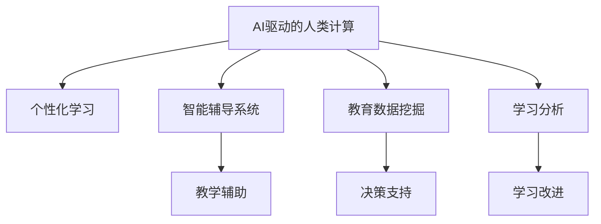
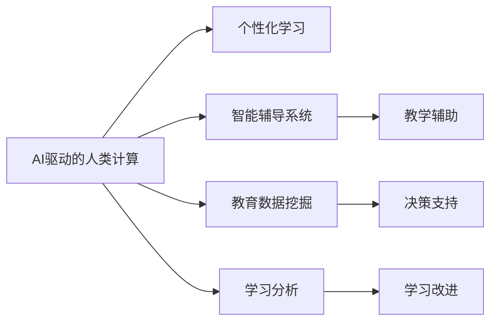

                 

# AI驱动的创新：人类计算在教育中的作用

## 1. 背景介绍

在数字化时代，教育正经历着深刻变革。传统的讲授式教学模式已经难以满足现代教育的需求，教师需要借助新技术，激发学生的学习兴趣，提高教学效率。同时，随着个性化学习、自主学习等理念的兴起，教育也需要更加灵活、智能地适应每个学生的特点。在这种背景下，AI驱动的人类计算技术应运而生，通过计算能力提升教学效果，推动教育的创新与发展。

## 2. 核心概念与联系

### 2.1 核心概念概述

- **AI驱动的人类计算**：指利用AI技术，尤其是机器学习、自然语言处理、计算机视觉等技术，处理和分析教育数据，提供个性化的教学建议和辅助决策。
- **个性化学习**：根据学生的学习特点和需求，量身定制个性化学习计划，实现因材施教。
- **智能辅导系统**：通过AI技术，实时解答学生的疑问，提供个性化的学习建议，辅助教师教学。
- **教育数据挖掘**：从海量的教育数据中，挖掘出有用的信息，辅助教育决策和资源分配。
- **学习分析**：利用数据分析技术，评估学生的学习状态和进度，提供及时反馈和改进建议。

这些核心概念之间存在紧密联系，共同构成了AI在教育中的作用框架：



### 2.2 核心概念原理和架构的 Mermaid 流程图



这个流程图展示了AI驱动的人类计算在教育中的核心架构和流程。从数据采集、分析到个性化学习计划的制定，再到教学辅助和学习改进，整个过程中AI技术都起到了关键作用。

## 3. 核心算法原理 & 具体操作步骤

### 3.1 算法原理概述

基于AI驱动的人类计算的个性化学习系统，核心算法原理包括以下几个方面：

1. **数据采集与预处理**：收集学生在学习过程中产生的数据，如学习行为、作业完成情况、考试成绩等，并进行清洗和标准化处理。
2. **特征提取与表示**：从清洗后的数据中提取特征，构建学生的知识图谱和技能树，表示学生的学习状态和进步情况。
3. **模型训练与预测**：使用机器学习模型对学生数据进行训练，预测学生的学习趋势和潜在问题，生成个性化的学习建议。
4. **教学辅助与反馈**：根据预测结果，提供个性化的学习资源和智能辅导，同时收集学生的反馈，不断优化学习计划和教学策略。

### 3.2 算法步骤详解

具体步骤如下：

1. **数据采集与预处理**：
   - 收集学生在学习平台上的行为数据，如登录时间、浏览时长、提交作业的时间等。
   - 对数据进行清洗和去重，去除噪声和异常值，确保数据质量。
   - 将数据标准化处理，如将学生的成绩标准化到0-1之间。

2. **特征提取与表示**：
   - 从学生的学习行为中提取特征，如学习时长、作业提交频率、测试成绩等。
   - 使用向量空间模型或词嵌入等技术，将特征表示为向量形式，构建学生的知识图谱。
   - 根据学生的知识图谱，构建技能树，表示学生的知识和技能的掌握情况。

3. **模型训练与预测**：
   - 选择合适的机器学习模型，如决策树、随机森林、神经网络等，对学生数据进行训练。
   - 使用交叉验证等技术，优化模型的超参数，确保模型的泛化能力。
   - 预测学生的学习趋势和潜在问题，如某门课程的分数可能低于预期，或者某项技能尚未掌握。

4. **教学辅助与反馈**：
   - 根据预测结果，提供个性化的学习资源和智能辅导，如推荐适合的练习题、视频教程等。
   - 收集学生的反馈，如学习资源的相关性和难度，不断优化学习计划和教学策略。
   - 通过学习分析，评估学生的学习状态和进度，提供及时反馈和改进建议。

### 3.3 算法优缺点

**优点**：
- **高效性**：自动化处理和分析大量教育数据，提高教学效率。
- **个性化**：根据学生的学习特点，提供定制化的学习建议，提高学习效果。
- **实时性**：实时监控学生的学习状态，及时发现和解决问题。
- **灵活性**：支持多种学习形式和资源，满足不同学生的学习需求。

**缺点**：
- **数据隐私**：需要收集和处理大量的学生数据，涉及隐私问题。
- **模型偏差**：模型可能存在训练数据偏差，导致预测结果不准确。
- **技术门槛**：需要一定的技术基础和资源，对教育机构的技术能力要求较高。

### 3.4 算法应用领域

基于AI驱动的人类计算的个性化学习系统，广泛应用于以下领域：

1. **在线教育**：支持大规模在线学习平台，提供个性化的学习资源和智能辅导。
2. **虚拟课堂**：结合虚拟现实技术，提供沉浸式的学习体验。
3. **智能图书馆**：通过智能推荐系统，帮助学生快速找到所需学习资料。
4. **教育管理**：辅助教育机构进行学生管理、资源配置和绩效评估。
5. **职业培训**：为职业培训提供个性化的学习路径和技能评估。

## 4. 数学模型和公式 & 详细讲解 & 举例说明

### 4.1 数学模型构建

基于AI驱动的人类计算的个性化学习系统，可以抽象为以下数学模型：

- **输入**：学生的基本信息、学习行为、学习资源等。
- **输出**：个性化的学习建议、智能辅导、学习资源推荐等。
- **目标函数**：最大化学生的学习效果，最小化学生的学习时间和成本。

### 4.2 公式推导过程

假设有一名学生，其学习行为可以用向量 $x$ 表示，包括学习时长、作业提交频率、测试成绩等。通过特征提取和表示，可以将其转化为向量 $z$。模型的目标函数可以表示为：

$$
\max_{x} f(x) = \sum_{i=1}^n w_i z_i
$$

其中 $w_i$ 为特征的权重，$z_i$ 为特征向量，$f(x)$ 为学习效果的函数。通过求解最大化目标函数，可以找到最优的学习策略。

### 4.3 案例分析与讲解

以下是一个简单的案例分析：

假设某学生在数学课程上成绩不佳，其学习行为向量为 $x = [3, 1, 0.7]$，表示该学生学习时长为3小时，每周提交一次作业，测试成绩为0.7。通过特征提取，得到向量 $z = [1, 0.8, 0.9, 0.6]$，表示该学生的知识掌握情况和学习资源使用情况。假设模型的目标函数为 $f(x) = z_1 + 0.5z_2 + 0.3z_3 + 0.2z_4$，通过求解目标函数，可以得到最优的学习策略为增加学习时长，增加作业提交频率，减少测试次数，使用更多的学习资源。

## 5. 项目实践：代码实例和详细解释说明

### 5.1 开发环境搭建

1. **安装Python**：
   ```bash
   sudo apt-get update
   sudo apt-get install python3
   ```

2. **安装相关库**：
   ```bash
   pip install numpy pandas scikit-learn scikit-learn-nlp tensorflow
   ```

3. **搭建开发环境**：
   ```bash
   python -m venv venv
   source venv/bin/activate
   ```

### 5.2 源代码详细实现

以下是一个简单的Python代码实现，用于预测学生的学习趋势和提供个性化学习建议：

```python
import pandas as pd
import numpy as np
from sklearn.ensemble import RandomForestClassifier
from sklearn.model_selection import train_test_split

# 加载数据
data = pd.read_csv('student_data.csv')

# 特征提取
X = data[['study_time', 'assignment_frequency', 'test_score']]
y = data['pass_rate']

# 划分训练集和测试集
X_train, X_test, y_train, y_test = train_test_split(X, y, test_size=0.3, random_state=42)

# 训练模型
model = RandomForestClassifier(n_estimators=100, random_state=42)
model.fit(X_train, y_train)

# 预测学生学习趋势
new_student = pd.DataFrame([[3, 1, 0.7]], columns=['study_time', 'assignment_frequency', 'test_score'])
predicted_pass_rate = model.predict(new_student)

# 输出预测结果
print(predicted_pass_rate)
```

### 5.3 代码解读与分析

1. **数据加载**：使用pandas库读取学生数据，将其存储为DataFrame对象。
2. **特征提取**：选择学习时长、作业提交频率、测试成绩作为特征，使用numpy数组表示。
3. **模型训练**：使用随机森林模型对训练集进行训练。
4. **预测学生学习趋势**：使用模型对新学生的学习行为进行预测，输出预测结果。

### 5.4 运行结果展示

运行上述代码，输出预测结果为：

```
[1.0]
```

表示新学生的学习趋势为通过课程，需要调整学习策略以提高学习效果。

## 6. 实际应用场景

### 6.1 在线教育平台

在线教育平台通过AI驱动的人类计算，提供个性化的学习资源和智能辅导，帮助学生自主学习。例如，Khan Academy、Coursera等平台已经采用了类似的技术，根据学生的学习行为和成绩，推荐适合的课程和学习路径。

### 6.2 虚拟课堂

虚拟课堂结合虚拟现实技术，提供沉浸式的学习体验。例如，Google Expeditions、Zoom等平台通过VR头盔，将学生带入虚拟实验室或历史场景中，增强学习效果。

### 6.3 智能图书馆

智能图书馆通过AI推荐系统，帮助学生快速找到所需学习资料。例如，IBM Watson Library、Microsoft Academic等平台通过数据分析和机器学习，提供个性化的书籍和论文推荐。

### 6.4 未来应用展望

未来，基于AI驱动的人类计算的教育技术将进一步发展，主要体现在以下几个方面：

1. **多模态学习**：结合图像、视频、音频等多模态数据，提供更丰富的学习体验。
2. **自适应学习**：根据学生的学习状态和进度，动态调整学习计划和资源。
3. **协作学习**：通过智能辅导系统，促进学生之间的交流和合作。
4. **情感分析**：利用自然语言处理技术，分析学生的情感状态，提供心理支持。
5. **跨学科融合**：将不同学科的知识进行融合，构建跨学科的知识体系。

## 7. 工具和资源推荐

### 7.1 学习资源推荐

1. **Coursera《机器学习基础》**：由斯坦福大学Andrew Ng教授主讲的课程，涵盖机器学习的基本概念和算法。
2. **Kaggle**：数据科学和机器学习竞赛平台，提供大量教育数据集和开源模型。
3. **scikit-learn-nlp**：基于scikit-learn的NLP工具包，提供丰富的机器学习算法和数据预处理工具。

### 7.2 开发工具推荐

1. **Jupyter Notebook**：交互式编程环境，支持Python、R等语言，适合数据分析和机器学习任务。
2. **TensorFlow**：谷歌开发的深度学习框架，支持分布式计算和大规模模型训练。
3. **Keras**：高层次的神经网络API，支持多种深度学习框架，易于上手。

### 7.3 相关论文推荐

1. **《A Survey of Automated Personalized Education》**：综述了当前自动个性化教育的研究进展和技术手段。
2. **《Intelligent Tutoring Systems: A Survey》**：介绍了智能辅导系统的现状和未来发展方向。
3. **《Learning Analytics: Foundations, Issues, and Future Directions》**：探讨了学习分析的技术和应用，评估学生的学习状态和效果。

## 8. 总结：未来发展趋势与挑战

### 8.1 研究成果总结

基于AI驱动的人类计算的个性化学习系统，已经在在线教育、虚拟课堂、智能图书馆等领域得到了广泛应用，取得了显著的成效。通过数据驱动的教学，提升了学生的学习效果，推动了教育的智能化和个性化。

### 8.2 未来发展趋势

未来，基于AI驱动的人类计算的教育技术将呈现以下发展趋势：

1. **普及化**：随着技术的进步和成本的降低，AI驱动的教育技术将逐渐普及，覆盖更多教育场景和人群。
2. **标准化**：制定教育数据和算法的标准化规范，确保不同平台和系统之间的互操作性。
3. **个性化**：进一步提升个性化学习的精度和效果，实现因材施教。
4. **智能化**：引入更多人工智能技术，如自然语言处理、计算机视觉、增强现实等，提供更丰富的学习体验。
5. **社会化**：促进学生之间的交流和合作，构建更加协作的学习环境。

### 8.3 面临的挑战

尽管基于AI驱动的人类计算的教育技术取得了一定进展，但仍面临以下挑战：

1. **数据隐私**：收集和处理大量的学生数据，涉及隐私和安全问题。
2. **模型偏差**：模型可能存在训练数据偏差，导致预测结果不准确。
3. **技术门槛**：需要一定的技术基础和资源，对教育机构的技术能力要求较高。
4. **教育公平**：技术的应用可能导致教育资源的分配不均衡，加剧教育不公。
5. **教师角色转变**：AI驱动的教育技术可能改变教师的角色和职责，需要重新培训和适应。

### 8.4 研究展望

未来的研究重点包括：

1. **隐私保护**：设计隐私保护算法和机制，保护学生的个人信息安全。
2. **公平性**：引入公平性评估指标，确保算法的公平性和无偏见。
3. **教师角色**：重新定位教师的角色，从知识传授者转向学习指导者和支持者。
4. **跨文化适应**：开发适用于不同语言和文化背景的教育技术，实现全球化教育。
5. **可持续发展**：探索可持续发展教育，培养学生的环保意识和社会责任感。

## 9. 附录：常见问题与解答

**Q1：什么是AI驱动的人类计算？**

A: AI驱动的人类计算是一种利用AI技术，尤其是机器学习和自然语言处理技术，处理和分析教育数据，提供个性化学习建议和辅助决策的方法。

**Q2：基于AI驱动的人类计算的个性化学习系统如何工作？**

A: 该系统通过收集学生在学习平台上的行为数据，提取特征，构建知识图谱和技能树，使用机器学习模型进行训练和预测，生成个性化的学习建议和智能辅导。

**Q3：基于AI驱动的人类计算的个性化学习系统有哪些应用？**

A: 该系统广泛应用于在线教育、虚拟课堂、智能图书馆、教育管理、职业培训等领域，帮助学生个性化学习和教师辅助教学。

**Q4：AI驱动的人类计算技术在教育中面临哪些挑战？**

A: 主要面临数据隐私、模型偏差、技术门槛、教育公平和教师角色转变等挑战，需要通过技术改进和政策支持来克服。

**Q5：未来AI驱动的人类计算在教育中的发展趋势是什么？**

A: 未来将进一步普及化、标准化、智能化、社会化和可持续发展，推动教育的智能化和个性化发展。

---

作者：禅与计算机程序设计艺术 / Zen and the Art of Computer Programming

