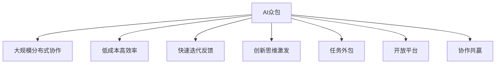

                 

# AI驱动的创新：众包的力量

> 关键词：AI众包,创新,技术驱动,效率提升,人机协同,任务外包,开放平台,协作共赢

## 1. 背景介绍

### 1.1 问题由来

随着人工智能技术的快速发展和应用深入，AI已逐渐成为各行各业数字化转型的重要驱动力。然而，传统的中心化技术开发模式难以快速响应市场变化，且成本高、周期长。如何在保持技术创新和快速迭代的同时，降低企业投入，成为当下亟待解决的问题。

众包（Crowdsourcing）作为一种新型协作模式，通过大规模分布式合作，充分发挥人力资源的潜力和创新能力，为AI技术驱动的创新提供了新的途径。借助众包平台，企业能够以较低的成本，快速获得高效优质的解决方案，加速AI技术落地应用。

### 1.2 问题核心关键点

众包在AI驱动创新中发挥关键作用的核心关键点包括：

1. **大规模分布式协作**：众包平台整合了全球的开发者和专家，形成规模化协作网络，能够快速聚集高质量人才。
2. **低成本高效率**：通过任务外包方式，企业以较低的投入，获得高效的开发成果。
3. **快速迭代反馈**：平台机制鼓励快速迭代和实时反馈，有助于技术不断完善和优化。
4. **创新思维激发**：不同背景和专业领域的人员聚集，有助于激发新的创新思维和方法。

本文将系统探讨基于AI的众包平台，特别是其在推动技术创新和加速应用落地方面的力量。

## 2. 核心概念与联系

### 2.1 核心概念概述

为更好地理解AI众包平台的工作原理和应用，本节将介绍几个关键概念：

- **AI众包（AI Crowdsourcing）**：指利用AI技术对众包任务进行智能匹配、辅助管理和优化评价的系统。其目标是提高众包平台的协作效率，降低任务执行成本，提升任务质量。

- **创新（Innovation）**：指通过创造性地解决问题，实现技术、产品、流程等方面的突破和进步。AI众包能够加速创新，体现在提供新的解决方案、优化现有方法等方面。

- **技术驱动（Technology-Driven）**：指以技术为核心，通过AI算法和大数据分析等手段，提升众包任务执行效率和质量。AI众包平台往往采用先进的AI技术，如自然语言处理（NLP）、计算机视觉（CV）、机器学习（ML）等。

- **任务外包（Task Outsourcing）**：指将特定任务委托给外部开发者或专家执行，以降低企业成本，集中精力在核心业务上。

- **开放平台（Open Platform）**：指以开放共享为原则，允许用户自由接入和使用AI众包平台，形成大规模协作网络。

- **协作共赢（Collaboration and Win-win）**：指平台各方通过合作，实现资源共享、互利共赢，提升整体创新能力。

这些核心概念之间的逻辑关系可以通过以下Mermaid流程图来展示：



这个流程图展示了大规模协作、低成本、快速迭代、创新思维、任务外包、开放平台、协作共赢等多个核心概念之间的联系。

## 3. 核心算法原理 & 具体操作步骤
### 3.1 算法原理概述

基于AI的众包平台通常采用以下算法原理和技术手段：

- **任务智能匹配**：通过AI算法对任务和人员进行智能匹配，确保任务执行效率和质量。
- **实时反馈与优化**：利用NLP技术对任务执行进行实时监控和反馈，通过AI模型不断优化任务执行过程。
- **动态任务分配**：通过预测和调度算法，动态调整任务分配策略，提升平台整体利用率和效率。
- **创新激励机制**：设计合理的创新激励机制，激发用户主动贡献创新解决方案，提高平台创新能力。

### 3.2 算法步骤详解

基于AI的众包平台一般包括以下关键步骤：

**Step 1: 平台搭建与数据准备**
- 设计众包平台框架，包括任务发布、分配、执行、评价等模块。
- 收集并预处理数据，如任务描述、人员技能、历史执行数据等。

**Step 2: 任务智能匹配**
- 利用NLP技术对任务和人员进行文本匹配，通过向量相似度计算，找到最合适的执行人员。
- 引入推荐算法，动态调整任务分配策略，确保任务均衡分配。

**Step 3: 实时监控与反馈**
- 利用计算机视觉（CV）技术，对任务执行过程进行实时监控和分析，识别问题并进行预警。
- 使用自然语言处理（NLP）技术，对用户反馈和任务执行结果进行文本分析，提取有用信息。

**Step 4: 创新激励与评价**
- 设计合理的创新激励机制，如奖金、排名、积分等，鼓励用户贡献创新方案。
- 引入自动化评价算法，对任务执行结果进行量化评价，确保客观公正。

**Step 5: 平台优化与迭代**
- 定期收集用户反馈和执行数据，利用数据分析和AI模型，对平台进行优化和迭代。
- 引入新技术和新方法，持续提升平台的协作效率和创新能力。

### 3.3 算法优缺点

基于AI的众包平台具有以下优点：

1. **高效协作**：利用AI技术实现任务智能匹配和动态调整，确保任务执行效率和质量。
2. **成本低廉**：通过任务外包方式，降低企业技术投入和运营成本。
3. **快速迭代**：实时监控和反馈机制，能够快速识别和解决问题，实现技术快速迭代。
4. **创新激发**：合理的创新激励机制，激发用户贡献创新方案，提高平台创新能力。

同时，该平台也存在一些局限性：

1. **依赖AI技术**：平台性能和效果高度依赖AI算法和模型，对技术要求较高。
2. **数据隐私问题**：平台涉及大量用户和任务数据，数据隐私和安全保护至关重要。
3. **任务匹配准确性**：任务匹配算法需要持续优化，否则可能导致匹配效果不佳。
4. **用户参与度**：用户参与度和贡献度不稳定，需要持续优化激励机制。

尽管存在这些局限性，但总体而言，基于AI的众包平台在提升协作效率、降低成本、激发创新等方面具有显著优势。

### 3.4 算法应用领域

基于AI的众包平台已广泛应用于多个领域，包括但不限于：

1. **软件开发与维护**：利用众包平台，企业可以快速获取高效的软件开发和维护服务，加速产品迭代。
2. **数字内容创作**：平台整合全球创作者，快速生成高质量内容，如文章、视频、音乐等。
3. **数据标注与清洗**：通过众包平台，企业可以快速获取标注和清洗数据，支持模型训练和优化。
4. **智能客服与支持**：平台提供智能客服和支持服务，提升客户体验和问题解决效率。
5. **市场营销与推广**：利用众包平台进行广告创意和内容生成，提升市场推广效果。

## 4. 数学模型和公式 & 详细讲解 & 举例说明（备注：数学公式请使用latex格式，latex嵌入文中独立段落使用 $$，段落内使用 $)
### 4.1 数学模型构建

以任务智能匹配为例，假设任务描述为 $T$，人员技能描述为 $S$，通过NLP技术将它们表示为向量 $\vec{T}$ 和 $\vec{S}$。任务匹配模型 $M$ 通过向量相似度计算，输出任务与人员匹配的概率 $P$：

$$
P = M(\vec{T}, \vec{S}) = \frac{\vec{T} \cdot \vec{S}}{\|\vec{T}\| \|\vec{S}\|}
$$

其中 $\cdot$ 表示向量点积，$\| \cdot \|$ 表示向量范数。

### 4.2 公式推导过程

1. **向量表示**：通过TF-IDF、Word2Vec等方法，将任务和人员描述转换为向量形式。
2. **相似度计算**：使用余弦相似度、欧式距离等方法计算向量之间的相似度。
3. **匹配概率计算**：将相似度转化为匹配概率，通过softmax函数归一化处理。

### 4.3 案例分析与讲解

以一个实际任务匹配案例为例，假设任务 $T$ 为 "编写一个Python库"，人员 $S$ 为 "Python专家"。通过NLP技术，将任务和人员描述转换为向量形式 $\vec{T}$ 和 $\vec{S}$。假设 $\vec{T} = [0.3, 0.2, 0.5]$，$\vec{S} = [0.5, 0.3, 0.2]$。

通过向量相似度计算，得到匹配概率 $P$：

$$
P = \frac{(0.3 \cdot 0.5) + (0.2 \cdot 0.3) + (0.5 \cdot 0.2)}{\sqrt{(0.3^2 + 0.2^2 + 0.5^2) \cdot (\sqrt{(0.5^2 + 0.3^2 + 0.2^2})} \approx 0.69
$$

说明人员 $S$ 与任务 $T$ 匹配概率为0.69，表明匹配效果较好。

## 5. 项目实践：代码实例和详细解释说明
### 5.1 开发环境搭建

在进行众包平台开发前，我们需要准备好开发环境。以下是使用Python进行Flask开发的环境配置流程：

1. 安装Anaconda：从官网下载并安装Anaconda，用于创建独立的Python环境。

2. 创建并激活虚拟环境：
```bash
conda create -n flask-env python=3.8 
conda activate flask-env
```

3. 安装Flask：
```bash
pip install flask
```

4. 安装SQLAlchemy：用于数据管理和数据库操作：
```bash
pip install sqlalchemy
```

5. 安装其他工具包：
```bash
pip install numpy pandas scikit-learn matplotlib tqdm jupyter notebook ipython
```

完成上述步骤后，即可在`flask-env`环境中开始平台开发。

### 5.2 源代码详细实现

下面我们以一个简单的众包平台为例，给出使用Flask进行任务智能匹配的代码实现。

首先，定义模型和视图：

```python
from flask import Flask, request, jsonify
from flask_sqlalchemy import SQLAlchemy
from sklearn.metrics.pairwise import cosine_similarity

app = Flask(__name__)
app.config['SQLALCHEMY_DATABASE_URI'] = 'sqlite:///data.db'
db = SQLAlchemy(app)

# 定义任务和人员数据表
class Task(db.Model):
    id = db.Column(db.Integer, primary_key=True)
    name = db.Column(db.String(50))
    description = db.Column(db.String(500))
    keywords = db.Column(db.String(100))

class Personnel(db.Model):
    id = db.Column(db.Integer, primary_key=True)
    name = db.Column(db.String(50))
    skills = db.Column(db.String(500))
    keywords = db.Column(db.String(100))

# 任务智能匹配函数
def match_task(task, personnel):
    task_vector = get_vector(task.description)
    personnel_vector = get_vector(personnel.skills)
    similarity = cosine_similarity(task_vector, personnel_vector)
    probability = similarity[0][0]
    return probability

# 获取向量函数
def get_vector(text):
    # 使用TF-IDF等NLP技术，将文本转换为向量
    pass

# 任务智能匹配视图
@app.route('/task/match', methods=['POST'])
def match_task_view():
    task_data = request.get_json()
    tasks = Task.query.filter_by(name=task_data['task']).first()
    personnel_data = request.get_json()
    personnel = Personnel.query.filter_by(name=personnel_data['personnel']).first()
    probability = match_task(tasks, personnel)
    return jsonify({'probability': probability})

# 运行应用
if __name__ == '__main__':
    db.create_all()
    app.run(debug=True)
```

然后，实现任务智能匹配函数和获取向量函数：

```python
# 任务智能匹配函数
def match_task(task, personnel):
    task_vector = get_vector(task.description)
    personnel_vector = get_vector(personnel.skills)
    similarity = cosine_similarity(task_vector, personnel_vector)
    probability = similarity[0][0]
    return probability

# 获取向量函数
def get_vector(text):
    # 使用TF-IDF等NLP技术，将文本转换为向量
    pass
```

### 5.3 代码解读与分析

让我们再详细解读一下关键代码的实现细节：

**Task和Personnel模型**：
- 定义了任务和人员数据表，包括id、名称、描述、技能等字段。

**match_task函数**：
- 接收任务和人员数据，使用TF-IDF等NLP技术将其转换为向量。
- 利用余弦相似度计算向量之间的相似度。
- 将相似度转化为匹配概率，返回概率值。

**match_task_view函数**：
- 接收POST请求，从请求中获取任务和人员数据。
- 在数据库中查询对应任务和人员记录。
- 调用match_task函数计算匹配概率。
- 返回JSON格式的结果。

**应用运行**：
- 运行应用后，可以通过访问`http://localhost:5000/task/match`接口，进行任务智能匹配操作。

通过这段代码示例，可以看出如何使用Python和Flask实现一个简单的众包平台，并进行任务智能匹配。开发者可以进一步扩展功能，如实时反馈、任务分配、创新激励等，以构建更加完善的AI众包平台。

## 6. 实际应用场景

### 6.1 软件开发与维护

在软件开发与维护领域，企业常常面临技术复杂、资源紧张的问题。利用AI众包平台，可以快速获取高质量的开发和维护服务。例如，某公司需要进行移动应用开发，可以将任务描述和需求提交到众包平台，平台自动匹配适合的技术人员，并进行项目管理和进度跟踪。技术人员可以利用平台提供的API接口，实时获取项目状态和反馈信息，快速解决问题。

### 6.2 数字内容创作

数字内容创作是众包平台的重要应用领域之一。平台可以整合全球创作者，快速生成高质量的文章、视频、音乐等。例如，某网站需要进行专题文章创作，可以将主题和要求提交到众包平台，平台自动匹配合适的作者，进行文章撰写和校对。作者可以利用平台提供的工具和资源，快速生成文章初稿，并进行优化和迭代。

### 6.3 数据标注与清洗

数据标注和清洗是AI模型训练的重要环节。利用AI众包平台，企业可以快速获取标注数据，提升模型训练效率和质量。例如，某公司需要进行图像标注，可以将标注任务描述和要求提交到众包平台，平台自动匹配合适的标注员，进行数据标注和清洗。标注员可以利用平台提供的工具和资源，快速完成标注任务，并进行审核和反馈。

### 6.4 未来应用展望

随着AI众包平台的发展，未来其在各个领域的创新应用将更加广泛。以下是一些可能的发展方向：

1. **智能客服与支持**：平台提供智能客服和支持服务，提升客户体验和问题解决效率。
2. **市场营销与推广**：利用众包平台进行广告创意和内容生成，提升市场推广效果。
3. **医疗与健康**：平台整合全球医疗专家，提供高质量的医疗咨询和诊断服务。
4. **教育与培训**：平台提供高质量的教育和培训资源，提升学习效果和教育质量。
5. **环境保护**：平台整合全球环保专家，进行环境监测和治理研究。

未来，AI众包平台有望在更多领域实现落地应用，成为推动社会进步和经济发展的强大引擎。

## 7. 工具和资源推荐
### 7.1 学习资源推荐

为了帮助开发者系统掌握AI众包平台的理论基础和实践技巧，这里推荐一些优质的学习资源：

1. **《AI众包：高效协作的新范式》系列博文**：由大模型技术专家撰写，深入浅出地介绍了AI众包平台的工作原理、应用场景和开发技术。

2. **Coursera《人工智能与创新》课程**：斯坦福大学开设的AI课程，涵盖了AI技术驱动创新的多个方面，包括众包平台、数据科学、机器学习等。

3. **《AI众包平台开发指南》书籍**：详细介绍了AI众包平台的开发流程、架构设计、技术实现等，是学习开发众包平台的重要参考。

4. **GitHub众包平台开源项目**：收集了大量开源的AI众包平台项目，包括任务匹配、实时监控、创新激励等模块的实现，是学习开发的宝贵资源。

通过对这些资源的学习实践，相信你一定能够快速掌握AI众包平台的精髓，并用于解决实际的AI开发问题。

### 7.2 开发工具推荐

高效的开发离不开优秀的工具支持。以下是几款用于AI众包平台开发的常用工具：

1. Flask：轻量级的Python Web框架，易于上手和扩展，适合开发API接口和数据管理模块。

2. SQLAlchemy：Python SQL工具包，用于数据库管理和数据查询，支持多种数据库系统。

3. TensorFlow和PyTorch：主流深度学习框架，用于机器学习和模型训练。

4. Weights & Biases：模型训练的实验跟踪工具，可以记录和可视化模型训练过程中的各项指标，方便对比和调优。

5. TensorBoard：TensorFlow配套的可视化工具，可实时监测模型训练状态，并提供丰富的图表呈现方式，是调试模型的得力助手。

合理利用这些工具，可以显著提升AI众包平台的开发效率，加快创新迭代的步伐。

### 7.3 相关论文推荐

AI众包平台的发展源于学界的持续研究。以下是几篇奠基性的相关论文，推荐阅读：

1. **Crowdsourcing for AI: A Survey**：综述了AI众包平台的研究现状和未来趋势，涵盖了任务智能匹配、实时反馈、创新激励等多个方面。

2. **Deep Learning in Crowdsourcing**：探讨了深度学习技术在众包平台中的应用，如任务智能匹配、任务执行监控、创新激励等。

3. **Designing Incentive Mechanisms for Crowdsourcing**：分析了不同激励机制对众包平台用户行为的影响，提供了激励机制设计的方法和策略。

4. **Optimizing Crowdsourcing in AI**：研究了AI技术在众包平台优化中的应用，如任务智能匹配、动态调度、实时反馈等。

这些论文代表了大模型众包平台的研究方向和发展脉络。通过学习这些前沿成果，可以帮助研究者把握学科前进方向，激发更多的创新灵感。

## 8. 总结：未来发展趋势与挑战
### 8.1 研究成果总结

本文对AI驱动的众包平台进行了系统介绍。首先阐述了AI众包在推动技术创新和加速应用落地方面的力量，明确了其大规模分布式协作、低成本高效率、快速迭代反馈、创新思维激发等核心优势。其次，从原理到实践，详细讲解了任务智能匹配、实时监控与反馈、创新激励与评价等关键步骤，给出了平台开发的完整代码实例。同时，本文还广泛探讨了AI众包在软件开发、数字内容创作、数据标注等多个领域的应用前景，展示了其广阔的应用潜力。

通过本文的系统梳理，可以看到，AI众包平台通过结合AI技术和众包协作，显著提高了技术创新的效率和效果，加速了AI技术在各个行业的落地应用。未来，伴随AI技术的不断进步，众包平台将迎来更多的创新和发展机遇。

### 8.2 未来发展趋势

展望未来，AI驱动的众包平台将呈现以下几个发展趋势：

1. **跨领域协作**：随着AI技术的不断普及，跨领域协作将成为众包平台的重要特点。平台将整合更多领域的专家和资源，提升整体协作能力。

2. **AI辅助设计**：平台将引入AI辅助设计工具，帮助用户快速生成和优化方案，提升创意和效率。

3. **实时协同编辑**：利用AI技术，平台可以实现实时协同编辑和协作，提高任务执行效率。

4. **多模态融合**：平台将支持多模态数据融合，如文本、图像、视频等，提升任务理解和执行能力。

5. **智能推荐系统**：平台将引入智能推荐系统，根据用户行为和偏好，推荐合适的任务和资源。

6. **伦理和隐私保护**：平台将引入伦理和隐私保护机制，确保数据安全和用户隐私。

这些趋势将推动AI众包平台向更加智能化、普适化和安全化的方向发展，为技术创新和应用落地提供更强大的支撑。

### 8.3 面临的挑战

尽管AI众包平台在推动技术创新和应用落地方面取得了显著成效，但在迈向更加智能化、普适化应用的过程中，仍面临诸多挑战：

1. **数据隐私和安全**：平台涉及大量用户和任务数据，数据隐私和安全保护至关重要。如何确保数据安全、防止数据泄露，将是重要的研究方向。

2. **任务匹配准确性**：任务匹配算法需要持续优化，否则可能导致匹配效果不佳。如何提高任务匹配的准确性和效率，将是亟待解决的问题。

3. **用户参与度和贡献度**：用户参与度和贡献度不稳定，需要持续优化激励机制。如何设计合理的激励机制，激发用户贡献创新方案，提高平台创新能力，将是重要的研究方向。

4. **AI技术依赖**：平台性能和效果高度依赖AI算法和模型，对技术要求较高。如何提高AI算法的稳定性和鲁棒性，将是重要的研究方向。

5. **跨领域协作难度**：跨领域协作需要协调多个领域的专业知识和资源，难度较大。如何降低跨领域协作难度，提升协作效率，将是重要的研究方向。

尽管存在这些挑战，但总体而言，AI众包平台在提升协作效率、降低成本、激发创新等方面具有显著优势。相信随着技术的不断进步和优化，这些挑战终将得到解决，AI众包平台必将在更多领域实现落地应用。

### 8.4 研究展望

面向未来，AI众包平台的研究方向和发展重点应包括以下几个方面：

1. **跨领域协作机制**：研究跨领域协作机制，提升平台协作效率和效果。

2. **AI辅助设计工具**：开发AI辅助设计工具，提升创意和效率。

3. **实时协同编辑技术**：研究实时协同编辑技术，提升任务执行效率。

4. **多模态融合方法**：研究多模态融合方法，提升任务理解和执行能力。

5. **智能推荐系统**：开发智能推荐系统，提升资源匹配效率。

6. **伦理和隐私保护机制**：研究伦理和隐私保护机制，确保数据安全和用户隐私。

这些研究方向将推动AI众包平台向更加智能化、普适化和安全化的方向发展，为技术创新和应用落地提供更强大的支撑。

## 9. 附录：常见问题与解答

**Q1：AI众包平台如何实现任务智能匹配？**

A: AI众包平台通过NLP技术将任务和人员描述转换为向量形式，利用余弦相似度等方法计算向量之间的相似度，转化为任务与人员匹配的概率。

**Q2：AI众包平台有哪些创新激励机制？**

A: AI众包平台可以设计多种创新激励机制，如奖金、排名、积分等。通过合理的激励机制，可以激发用户贡献创新方案，提高平台创新能力。

**Q3：AI众包平台存在哪些资源瓶颈？**

A: AI众包平台存在资源瓶颈，如任务匹配准确性、用户参与度和贡献度不稳定、AI技术依赖等问题。需要通过持续优化和改进，提升平台性能和效果。

**Q4：AI众包平台在落地应用中需要注意哪些问题？**

A: AI众包平台在落地应用中需要注意数据隐私和安全问题、任务匹配准确性、用户参与度和贡献度不稳定、AI技术依赖等挑战。

这些挑战需要通过持续优化和改进，确保平台稳定运行和高效协作。

---

作者：禅与计算机程序设计艺术 / Zen and the Art of Computer Programming

