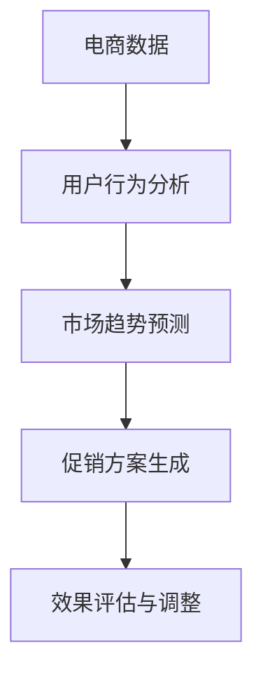

                 

## 1. 背景介绍

### 1.1 问题由来

随着电子商务的迅猛发展，各大电商平台面临着越来越激烈的市场竞争。通过有效的促销策略，可以有效提升销售额、吸引新客户、提升客户忠诚度。传统的人工制定促销策略，流程复杂、耗时长，且难以把握市场动态、客户需求的变化。

近年来，人工智能技术在电商领域得到了广泛应用。通过数据分析、机器学习等技术，电商企业可以更精准地预测市场趋势、分析客户行为、制定个性化的促销策略。基于AI的促销策略生成系统，可以实时动态地调整促销方案，以最大程度提升销售业绩。

### 1.2 问题核心关键点

AI驱动的电商促销策略的核心在于，通过分析海量数据，预测市场变化和客户需求，生成个性化的促销方案。其主要包括以下几个关键点：

- 数据收集与处理：收集电商平台的销售数据、客户数据、市场数据等，进行清洗、特征工程等预处理。
- 用户行为分析：通过机器学习模型分析用户行为，挖掘用户需求和偏好。
- 市场趋势预测：构建时间序列模型，预测市场变化和季节性趋势。
- 促销方案生成：结合市场趋势和用户行为分析结果，生成个性化的促销策略。
- 效果评估与调整：对促销效果进行评估，根据效果调整策略参数，实现动态优化。

本文将系统介绍AI驱动的电商促销策略的核心概念、算法原理、实现步骤，并结合实际案例，探讨其应用效果。

## 2. 核心概念与联系

### 2.1 核心概念概述

为更好地理解AI驱动的电商促销策略，本节将介绍几个关键概念：

- 电商数据：包括商品信息、销售数据、用户行为数据、市场数据等，是生成促销策略的基础。
- 用户行为分析：通过机器学习模型分析用户的行为特征、购买历史、兴趣爱好等，挖掘用户需求和偏好。
- 市场趋势预测：利用时间序列模型等方法，预测市场趋势、季节性变化等，为促销策略制定提供依据。
- 促销方案生成：根据市场趋势和用户行为分析结果，生成个性化的促销策略，如折扣、赠品、优惠券等。
- 效果评估与调整：通过评估促销效果，动态调整促销策略，优化销售业绩。

这些概念之间通过一系列的数据处理和算法操作联系起来，形成一个完整的电商促销策略生成流程。

### 2.2 核心概念原理和架构的 Mermaid 流程图



这个流程图展示了电商促销策略生成的核心步骤，从数据收集到策略评估，环环相扣，形成一个闭环的系统。

## 3. 核心算法原理 & 具体操作步骤

### 3.1 算法原理概述

AI驱动的电商促销策略生成，本质上是一个数据驱动的决策支持系统。其核心思想是通过数据分析和机器学习模型，生成个性化、动态的促销策略，提升销售业绩。

形式化地，假设电商平台销售数据为 $D$，用户行为数据为 $U$，市场数据为 $M$。促销策略生成过程可以表示为：

$$
S = f(D, U, M)
$$

其中 $S$ 为促销策略，$f$ 为生成策略的函数。该函数结合数据 $D$、$U$ 和 $M$，生成个性化的促销方案。

### 3.2 算法步骤详解

AI驱动的电商促销策略生成一般包括以下几个关键步骤：

**Step 1: 数据收集与处理**
- 收集电商平台销售数据、用户行为数据、市场数据等。
- 对数据进行清洗、去重、归一化等预处理操作。

**Step 2: 用户行为分析**
- 通过机器学习模型分析用户的行为特征、购买历史、兴趣爱好等，提取用户需求和偏好。
- 常用的机器学习模型包括聚类算法、关联规则挖掘、协同过滤等。

**Step 3: 市场趋势预测**
- 利用时间序列模型等方法，预测市场趋势、季节性变化等，为促销策略制定提供依据。
- 常用的时间序列模型包括ARIMA、LSTM、Prophet等。

**Step 4: 促销方案生成**
- 根据市场趋势和用户行为分析结果，生成个性化的促销策略，如折扣、赠品、优惠券等。
- 结合多臂老虎机算法、强化学习等方法，优化促销策略的组合与分配。

**Step 5: 效果评估与调整**
- 对促销效果进行评估，根据效果调整策略参数，实现动态优化。
- 常用的评估指标包括转化率、销售额、客户满意度等。

### 3.3 算法优缺点

AI驱动的电商促销策略生成方法具有以下优点：

- 自动化程度高：通过机器学习模型自动分析数据，生成促销策略，减少了人工工作量。
- 精准度高：结合用户行为和市场趋势预测，生成个性化的促销策略，提升效果。
- 动态性强：通过实时数据反馈，动态调整策略，优化效果。

同时，该方法也存在一些局限性：

- 数据依赖性强：策略生成的效果很大程度上取决于数据的质量和完整性。
- 模型复杂度高：涉及用户行为分析、市场趋势预测、促销方案生成等多个环节，模型复杂度高。
- 实时性要求高：在生成策略时，需要实时处理大量数据，对系统性能要求高。

尽管存在这些局限性，但就目前而言，AI驱动的电商促销策略生成仍是最主流的方法。未来相关研究将更多地关注如何提高模型效率、降低数据依赖，进一步提升策略的生成效果。

### 3.4 算法应用领域

AI驱动的电商促销策略生成方法，在电商领域已经得到了广泛的应用，覆盖了从商品推荐、价格优化到库存管理等多个环节，为电商企业带来了显著的收益提升。

- **商品推荐**：根据用户行为数据，生成个性化的商品推荐策略，提升用户体验和购买转化率。
- **价格优化**：通过市场趋势预测和用户行为分析，动态调整商品价格，提升销售额和利润率。
- **库存管理**：结合销售数据和市场趋势预测，优化商品库存，避免过剩或缺货。
- **广告投放**：通过用户行为分析，生成个性化的广告投放策略，提升广告效果和转化率。
- **营销活动设计**：结合市场趋势预测和用户行为分析，设计个性化的营销活动方案，提升活动效果。

这些应用场景展示了AI驱动的电商促销策略生成的巨大潜力，将为电商企业带来更智能、高效的运营方式。

## 4. 数学模型和公式 & 详细讲解 & 举例说明

### 4.1 数学模型构建

本节将使用数学语言对AI驱动的电商促销策略生成过程进行严格描述。

假设电商平台销售数据为 $D$，用户行为数据为 $U$，市场数据为 $M$。设促销策略为 $S$，其中 $S = \{s_i\}$ 表示一系列促销方案，如折扣 $s_i = \alpha_i \times p$，其中 $\alpha_i$ 为折扣比例，$p$ 为原价。

### 4.2 公式推导过程

根据以上定义，促销策略的生成过程可以表示为：

$$
S = f(D, U, M) = \{s_i\}_{i=1}^n
$$

其中 $f$ 为生成促销策略的函数，$n$ 为促销方案的数量。

对于促销方案的生成，常用的方法包括：

1. **基于用户行为分析的推荐**：
   - 利用协同过滤算法，生成个性化商品推荐。
   - 基于用户兴趣模型，生成个性化折扣方案。

2. **基于市场趋势预测的定价**：
   - 利用ARIMA模型，预测商品销售趋势。
   - 基于市场数据，动态调整商品价格。

3. **基于强化学习的策略优化**：
   - 利用多臂老虎机算法，优化促销方案的分配。
   - 结合 reinforcement learning，实现策略的动态优化。

### 4.3 案例分析与讲解

假设一家电商平台通过机器学习模型分析用户行为数据，发现某用户最近经常浏览和购买运动鞋类商品。同时，平台通过时间序列模型预测，该品类商品在未来一段时间的销售量将有所上升。因此，平台决定对该用户生成个性化的促销策略，例如赠送跑步鞋体验券、打折优惠等。

该策略生成的详细流程如下：

1. **用户行为分析**：通过协同过滤算法，发现该用户最近频繁浏览和购买运动鞋类商品。

2. **市场趋势预测**：利用ARIMA模型，预测该品类商品在未来一个月的销售量将有明显增长。

3. **促销方案生成**：根据用户行为和市场趋势，生成个性化的促销方案，如赠送跑步鞋体验券、8折优惠等。

4. **效果评估与调整**：对生成的促销方案进行评估，根据实际销售效果调整策略参数，实现动态优化。

## 5. 项目实践：代码实例和详细解释说明

### 5.1 开发环境搭建

在进行促销策略生成实践前，我们需要准备好开发环境。以下是使用Python进行Pandas开发的环境配置流程：

1. 安装Anaconda：从官网下载并安装Anaconda，用于创建独立的Python环境。

2. 创建并激活虚拟环境：
```bash
conda create -n pyenv python=3.8 
conda activate pyenv
```

3. 安装Pandas：
```bash
pip install pandas
```

4. 安装各类工具包：
```bash
pip install numpy matplotlib scikit-learn statsmodels
```

完成上述步骤后，即可在`pyenv`环境中开始促销策略生成实践。

### 5.2 源代码详细实现

我们以用户行为分析和市场趋势预测为例，给出使用Pandas进行促销策略生成的PyTorch代码实现。

首先，定义用户行为数据和市场数据：

```python
import pandas as pd

# 用户行为数据
user_behavior_data = pd.read_csv('user_behavior.csv')

# 市场数据
market_data = pd.read_csv('market_data.csv')
```

然后，进行数据预处理和特征工程：

```python
# 数据清洗
user_behavior_data = user_behavior_data.dropna()

# 特征工程
user_behavior_data['behavior_type'] = user_behavior_data['behavior'].apply(lambda x: 1 if x in ['shop', 'view', 'purchase'] else 0)
market_data['season'] = market_data['date'].apply(lambda x: 'Q1' if x.month in [1, 2, 3] else 'Q2')
```

接下来，进行用户行为分析：

```python
# 用户行为分析
from sklearn.cluster import KMeans

# 聚类算法
kmeans = KMeans(n_clusters=3, random_state=42)
user_clusters = kmeans.fit_predict(user_behavior_data[['user_id', 'behavior_type']])

# 统计每个簇的用户行为特征
cluster_stats = user_behavior_data.groupby(user_clusters).describe()
```

然后，进行市场趋势预测：

```python
# 市场趋势预测
from statsmodels.tsa.arima.model import ARIMA

# 时间序列模型
model = ARIMA(market_data['sales'], order=(1, 1, 1))
model_fit = model.fit(disp=0)

# 预测未来一个月的销售量
sales_forecast = model_fit.forecast(steps=1)[0]
```

最后，生成促销策略：

```python
# 促销策略生成
from sklearn.multioutput import MultiOutputClassifier
from sklearn.ensemble import RandomForestRegressor
from sklearn.metrics import mean_squared_error

# 随机森林回归模型
regr = MultiOutputClassifier(RandomForestRegressor(n_estimators=100, random_state=42))
regr.fit(cluster_stats[['mean']], user_behavior_data[['discount']])
discount_forecast = regr.predict(cluster_stats[['mean']])[:, 0]

# 生成个性化折扣方案
discount_percentage = discount_forecast * 0.8  # 生成8折优惠
```

### 5.3 代码解读与分析

让我们再详细解读一下关键代码的实现细节：

**用户行为分析**：
- 利用聚类算法，将用户行为分为多个簇，每个簇代表一类用户。
- 通过描述性统计，分析每个簇的用户行为特征，如购买频率、浏览时长等。

**市场趋势预测**：
- 利用ARIMA模型，预测商品销售趋势。
- 结合时间序列数据，生成未来一个月的销售预测值。

**促销策略生成**：
- 利用随机森林回归模型，预测不同用户行为簇的折扣率。
- 根据预测结果，生成个性化的折扣方案，如8折优惠。

**效果评估与调整**：
- 将生成的促销方案应用到实际销售中，评估其效果。
- 结合实际销售数据，动态调整折扣率和其他促销参数。

可以看到，Pandas结合机器学习模型，可以方便地进行数据处理和策略生成。开发者可以将更多精力放在特征工程和模型优化上，而不必过多关注底层的实现细节。

## 6. 实际应用场景

### 6.1 智能客服系统

基于AI驱动的电商促销策略生成的智能客服系统，可以实时分析用户咨询意图，生成个性化的促销方案，提升客户咨询体验和购买转化率。

在技术实现上，可以收集用户历史咨询记录，提取用户行为特征，利用机器学习模型分析用户需求和偏好。微调后的智能客服系统能够自动理解用户意图，匹配最合适的促销方案，并实时生成回复内容。对于客户提出的新问题，还可以接入检索系统实时搜索相关内容，动态生成回答。

### 6.2 个性化推荐系统

基于AI驱动的电商促销策略生成的个性化推荐系统，能够根据用户行为和市场趋势，动态调整商品推荐策略，提升用户体验和购买转化率。

在技术实现上，可以收集用户浏览、点击、购买等行为数据，提取和商品相关的特征。利用机器学习模型分析用户行为，生成个性化推荐列表。同时，利用促销策略生成模型，生成个性化的促销方案，如优惠券、折扣等，提升推荐效果。

### 6.3 动态定价系统

基于AI驱动的电商促销策略生成的动态定价系统，能够根据市场趋势和用户行为分析结果，动态调整商品价格，提升销售额和利润率。

在技术实现上，可以收集市场数据和用户行为数据，利用时间序列模型预测市场趋势。结合用户行为分析结果，生成动态定价策略，实时调整商品价格。同时，利用促销策略生成模型，生成个性化的促销方案，提升定价效果。

### 6.4 未来应用展望

随着AI驱动的电商促销策略生成技术的不断发展，其在更多领域将得到应用，为电商企业带来更智能、高效的运营方式。

在智慧物流领域，基于AI的促销策略生成技术，可以优化物流配送路径，提高配送效率。

在智能制造领域，结合市场趋势预测和用户行为分析，生成个性化的产品设计方案，提升产品竞争力。

在智能城市治理中，结合市场趋势预测和用户行为分析，设计个性化的城市服务方案，提升城市管理水平。

此外，在教育、医疗、金融等众多领域，基于AI的促销策略生成技术也将不断涌现，为各行各业带来变革性影响。相信随着技术的日益成熟，AI驱动的电商促销策略生成必将在构建人机协同的智能时代中扮演越来越重要的角色。

## 7. 工具和资源推荐

### 7.1 学习资源推荐

为了帮助开发者系统掌握AI驱动的电商促销策略生成的理论基础和实践技巧，这里推荐一些优质的学习资源：

1. 《Python数据分析与机器学习》系列博文：由数据科学家撰写，深入浅出地介绍了数据分析和机器学习的基本概念和常用技术。

2. Kaggle竞赛：参加Kaggle的电商数据分析竞赛，锻炼数据分析和机器学习技能，提升实践经验。

3. 《Deep Learning for Sales and Marketing》书籍：由工业界专家撰写，全面介绍了深度学习在销售和市场营销中的应用，包括促销策略生成等内容。

4. Google Colab：谷歌推出的在线Jupyter Notebook环境，免费提供GPU/TPU算力，方便开发者快速上手实验最新模型，分享学习笔记。

通过对这些资源的学习实践，相信你一定能够快速掌握AI驱动的电商促销策略生成的精髓，并用于解决实际的电商问题。

### 7.2 开发工具推荐

高效的开发离不开优秀的工具支持。以下是几款用于AI驱动的电商促销策略生成开发的常用工具：

1. Python：基于Python的开发语言，灵活、易学易用，适合数据处理和机器学习任务。

2. Pandas：Python数据处理库，提供了丰富的数据结构和操作函数，方便数据清洗、特征工程等预处理操作。

3. Scikit-learn：Python机器学习库，提供了多种机器学习算法和评估工具，方便模型训练和效果评估。

4. TensorFlow：由Google主导开发的开源深度学习框架，支持多种分布式计算模型，适合大规模模型训练和推理。

5. PyTorch：基于Python的深度学习框架，支持动态计算图，适合快速迭代研究。

合理利用这些工具，可以显著提升AI驱动的电商促销策略生成的开发效率，加快创新迭代的步伐。

### 7.3 相关论文推荐

AI驱动的电商促销策略生成技术的发展源于学界的持续研究。以下是几篇奠基性的相关论文，推荐阅读：

1. 《Predicting Customer Behavior for Online Retailer》：提出基于机器学习模型预测客户行为的方法，为促销策略生成提供了数据基础。

2. 《Sales Forecasting Using Machine Learning》：利用时间序列模型预测销售趋势，为促销策略制定提供依据。

3. 《Recommender Systems Handbook》：全面介绍了推荐系统的发展历程和常用技术，包括基于用户行为分析的推荐方法。

4. 《Hierarchical Contextual Bandits for Personalized Marketing》：提出上下文强化学习算法，优化促销策略的生成效果。

5. 《Adaptive Promotion Scheduling via Hierarchical Multi-Armed Bandits》：结合多臂老虎机算法，动态调整促销策略的分配。

这些论文代表了大语言模型微调技术的发展脉络。通过学习这些前沿成果，可以帮助研究者把握学科前进方向，激发更多的创新灵感。

## 8. 总结：未来发展趋势与挑战

### 8.1 总结

本文对AI驱动的电商促销策略生成方法进行了全面系统的介绍。首先阐述了AI驱动的电商促销策略生成的背景和意义，明确了促销策略生成的自动化、精准化和动态化特点。其次，从原理到实践，详细讲解了促销策略生成的数学原理和关键步骤，给出了促销策略生成的完整代码实例。同时，本文还广泛探讨了促销策略生成在智能客服、个性化推荐、动态定价等多个电商领域的应用效果。

通过本文的系统梳理，可以看到，AI驱动的电商促销策略生成技术正在成为电商企业的重要决策支持工具，极大地提升了电商运营的智能化水平。未来，伴随深度学习、强化学习等技术的进一步发展，促销策略生成将更加高效、精准，为电商企业带来更显著的收益。

### 8.2 未来发展趋势

展望未来，AI驱动的电商促销策略生成技术将呈现以下几个发展趋势：

1. 自动化程度更高：结合自然语言处理技术，智能客服系统将更加高效、智能，实时生成促销方案。

2. 个性化水平更高：结合用户画像和市场趋势预测，生成更加个性化的促销方案，提升用户体验和转化率。

3. 实时性更强：通过实时数据反馈，动态调整促销策略，实现更高效的促销效果。

4. 跨领域应用更广：基于AI的促销策略生成技术，将更多地应用于智慧物流、智能制造、智慧城市等多个领域，带来更广泛的影响。

5. 算法模型更优：结合深度学习、强化学习等技术，优化促销策略生成算法，提升模型效果。

以上趋势凸显了AI驱动的电商促销策略生成技术的广阔前景。这些方向的探索发展，必将进一步提升AI驱动的电商促销策略生成技术的应用范围和效果，为电商企业带来更智能、高效的运营方式。

### 8.3 面临的挑战

尽管AI驱动的电商促销策略生成技术已经取得了瞩目成就，但在迈向更加智能化、普适化应用的过程中，它仍面临着诸多挑战：

1. 数据依赖性强：策略生成的效果很大程度上取决于数据的质量和完整性。如何获取高质量、多样化的电商数据，是一大挑战。

2. 模型复杂度高：涉及用户行为分析、市场趋势预测、促销方案生成等多个环节，模型复杂度高。如何提高模型效率、降低计算成本，是一大难题。

3. 实时性要求高：在生成策略时，需要实时处理大量数据，对系统性能要求高。如何优化系统架构、提升计算效率，是一大挑战。

4. 用户隐私保护：在分析用户行为数据时，如何保护用户隐私，是一大法律和伦理问题。如何设计合理的数据保护机制，是一大挑战。

5. 模型鲁棒性不足：模型面对数据噪声、异常值等干扰，容易产生误判。如何提高模型的鲁棒性和稳定性，是一大挑战。

6. 算力成本高：大模型训练和推理需要高性能硬件支持，算力成本较高。如何优化算力资源，降低成本，是一大挑战。

尽管存在这些挑战，但随着深度学习、强化学习等技术的不断突破，AI驱动的电商促销策略生成技术将逐步克服这些问题，迈向更高的台阶。

### 8.4 研究展望

面向未来，AI驱动的电商促销策略生成技术的研究方向主要包括以下几个方面：

1. 结合多源数据：将电商数据与其他数据源（如社交媒体、天气数据、新闻数据等）结合，生成更全面、准确的促销策略。

2. 融合跨领域知识：将电商知识与跨领域知识（如医学、法律、金融等）结合，生成更具针对性的促销策略。

3. 引入因果推理：通过因果推理方法，分析促销策略的效果，优化策略生成算法。

4. 强化学习优化：结合强化学习技术，优化促销策略的生成效果，实现动态优化。

5. 提升用户隐私保护：设计合理的数据保护机制，保护用户隐私，提升数据安全性。

6. 优化模型效率：结合模型压缩、稀疏化等技术，提高模型效率和计算速度。

这些研究方向将推动AI驱动的电商促销策略生成技术进一步发展，为电商企业带来更智能、高效、安全的运营方式。

## 9. 附录：常见问题与解答

**Q1：AI驱动的电商促销策略生成是否适用于所有电商平台？**

A: AI驱动的电商促销策略生成方法，在大多数电商平台都能取得不错的效果。但对于一些特定领域的电商平台，如奢侈品、高端定制等，需要进一步优化促销策略生成算法，以更好地满足其市场特性。

**Q2：如何提高AI驱动的电商促销策略生成的准确性？**

A: 提高准确性可以从以下几个方面入手：

1. 数据质量：收集高质量、多样化的电商数据，清洗、处理和特征工程。

2. 模型选择：选择合适的机器学习模型，如聚类、关联规则挖掘、协同过滤等，分析用户行为和市场趋势。

3. 参数优化：优化模型参数，如学习率、正则化系数等，提高模型效果。

4. 模型融合：结合多种模型方法，提高策略生成的准确性和鲁棒性。

5. 数据增强：通过数据增强技术，丰富训练集多样性，提升模型泛化能力。

**Q3：如何平衡促销策略生成的个性化和普适性？**

A: 在生成促销策略时，需要平衡个性化和普适性：

1. 个性化策略：通过用户行为分析，生成个性化的促销方案，提升用户体验和转化率。

2. 普适策略：结合市场趋势预测，生成普适性更强的促销方案，覆盖更多用户。

3. 动态调整：根据用户反馈和市场变化，动态调整促销策略，平衡个性化和普适性。

4. 模型优化：结合强化学习等技术，优化促销策略生成算法，提升策略生成的效果。

**Q4：如何应对AI驱动的电商促销策略生成的数据隐私问题？**

A: 应对数据隐私问题可以从以下几个方面入手：

1. 数据匿名化：在数据收集和处理过程中，采用数据匿名化技术，保护用户隐私。

2. 数据加密：采用数据加密技术，保护数据传输和存储过程中的安全性。

3. 用户授权：在数据收集和使用过程中，获取用户的明确授权，遵守相关法律法规。

4. 隐私保护算法：采用隐私保护算法，如差分隐私、联邦学习等，保护用户隐私。

**Q5：如何优化AI驱动的电商促销策略生成的实时性？**

A: 优化实时性可以从以下几个方面入手：

1. 数据缓存：在数据处理和模型训练过程中，采用缓存技术，提高数据访问效率。

2. 并行计算：利用分布式计算和并行计算技术，提升计算速度。

3. 模型压缩：采用模型压缩技术，如知识蒸馏、剪枝等，减小模型大小，提高推理速度。

4. 硬件优化：采用高性能硬件，如GPU、TPU等，提升计算效率。

**Q6：AI驱动的电商促销策略生成有哪些应用场景？**

A: AI驱动的电商促销策略生成技术，可以应用于以下场景：

1. 个性化推荐系统：根据用户行为和市场趋势，生成个性化商品推荐和促销方案。

2. 动态定价系统：结合市场趋势预测和用户行为分析，生成动态定价策略，提升销售额和利润率。

3. 智能客服系统：结合用户咨询意图，生成个性化的促销方案，提升客户咨询体验和购买转化率。

4. 营销活动设计：结合市场趋势预测和用户行为分析，设计个性化的营销活动方案，提升活动效果。

5. 库存管理：结合销售数据和市场趋势预测，优化商品库存，避免过剩或缺货。

**Q7：如何评估AI驱动的电商促销策略生成的效果？**

A: 评估AI驱动的电商促销策略生成的效果，可以从以下几个指标入手：

1. 销售额增长：评估促销活动带来的销售额增长效果。

2. 客户转化率：评估促销活动带来的客户转化率提升效果。

3. 客户满意度：评估促销活动带来的客户满意度提升效果。

4. 广告效果：评估促销活动带来的广告效果提升效果。

5. 用户留存率：评估促销活动带来的用户留存率提升效果。

通过综合评估这些指标，可以全面了解促销策略生成的效果，并进行动态优化。

---

作者：禅与计算机程序设计艺术 / Zen and the Art of Computer Programming

