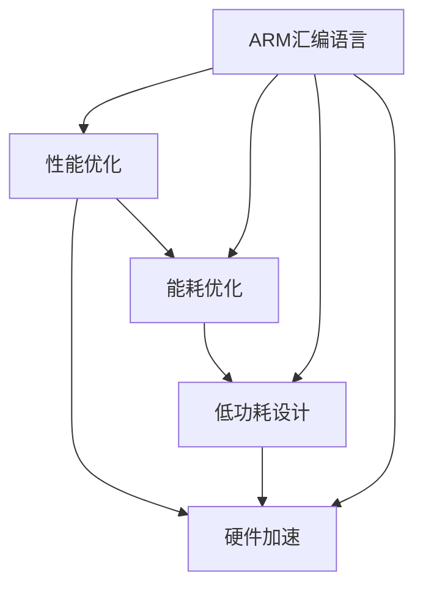

                 

# ARM汇编语言高级优化技巧

> 关键词：ARM汇编语言,优化技巧,性能提升,硬件加速,低功耗设计

## 1. 背景介绍

### 1.1 问题由来

在现代高性能计算和嵌入式应用中，ARM架构处理器因其高效的能耗比和丰富的系统支持，成为常用的选择。然而，随着系统规模和性能要求的提高，优化ARM汇编语言代码，提升系统性能和效率，成为开发人员面临的重要任务。

### 1.2 问题核心关键点

ARM汇编语言优化涉及硬件架构、编译器、应用场景等多个方面。常见的优化目标包括提升性能、降低功耗、优化空间占用等。优化过程需要综合考虑指令集特性、寄存器使用、数据流分析等多方面因素，以实现最优的性能和功耗平衡。

### 1.3 问题研究意义

优化ARM汇编语言代码，对于提升系统性能、降低能耗、提升用户体验具有重要意义：

1. 性能提升：通过合理指令使用、寄存器优化等手段，显著提升系统处理速度，满足高负载需求。
2. 能耗降低：通过指令选择、寄存器使用策略，降低系统能耗，延长设备使用时间。
3. 空间优化：通过合理的代码布局和内存使用，提升系统空间利用率，优化内存使用。

## 2. 核心概念与联系

### 2.1 核心概念概述

为更好地理解ARM汇编语言优化方法，本节将介绍几个密切相关的核心概念：

- ARM汇编语言(ARM Assembly Language)：ARM处理器原生支持的指令集编程语言，通过具体的汇编指令实现程序逻辑。
- 性能(Performance)：系统处理速度和响应时间的关键指标，直接影响用户体验和应用效能。
- 能耗(Energy Consumption)：系统运行过程中的能量消耗，直接影响设备续航和使用时间。
- 低功耗设计(Low Power Design)：通过优化硬件和软件设计，降低系统能耗，提升能效比。
- 硬件加速(Hardware Acceleration)：利用硬件计算资源，提高特定任务的处理速度。

这些核心概念之间的逻辑关系可以通过以下Mermaid流程图来展示：



这个流程图展示了几组关键概念及其之间的关系：

1. ARM汇编语言通过性能优化提升处理速度，通过能耗优化延长使用时间，通过低功耗设计提升能效比，通过硬件加速实现特定任务快速处理。
2. 性能优化和能耗优化互相促进，通过更高效的指令使用和数据流分析，减少能源消耗。
3. 低功耗设计和硬件加速互为补充，通过优化硬件结构，使用专用加速器，提升计算效率。

这些概念共同构成了ARM汇编语言优化的框架，使其能够在各种场景下实现最佳性能和能效。

## 3. 核心算法原理 & 具体操作步骤

### 3.1 算法原理概述

ARM汇编语言优化涉及多个层次，从指令选择、寄存器使用、到数据流分析、指令调度和内存布局等。优化目标通常是提升系统性能和降低能耗，同时保持代码的可维护性和可读性。

优化过程一般包括以下几个关键步骤：

1. **性能模型分析**：通过分析程序执行时的性能瓶颈，确定优化方向。
2. **能耗模型分析**：评估不同代码路径和指令序列的能耗，选择低功耗设计方案。
3. **指令优化**：根据性能模型和能耗模型，选择最优指令序列。
4. **寄存器使用优化**：通过合理分配和使用寄存器，减少内存访问，提升性能。
5. **数据流分析**：分析数据依赖关系，优化指令调度和内存布局。
6. **测试验证**：通过实验测试，评估优化效果，调整优化策略。

### 3.2 算法步骤详解

#### 性能模型分析

性能模型分析是优化过程的第一步，通常涉及以下几个方面：

- **热点函数分析**：通过分析函数的执行频率，确定性能瓶颈。
- **关键路径分析**：识别代码中的关键路径，确保其执行效率。
- **硬件资源分析**：评估不同硬件资源的利用情况，选择合适的加速方案。

具体实现时，可以利用静态和动态分析工具，如GCC的Profile引导优化（Profile Guided Optimization, PGO）和Intel的Vtune性能分析工具，生成性能报告和优化建议。

#### 能耗模型分析

能耗模型分析主要关注代码执行过程中的能量消耗，通常涉及以下几个方面：

- **时钟频率分析**：分析不同时钟频率下的功耗，选择最佳频率。
- **功耗预算**：确定系统的总功耗预算，优化功耗分配。
- **能耗敏感度分析**：评估不同代码路径和指令序列的能耗，选择低功耗设计方案。

具体实现时，可以利用功耗分析工具，如ARM的Power Analyzer，评估代码的能耗特性，生成功耗报告和优化建议。

#### 指令优化

指令优化是ARM汇编语言优化的核心步骤，通常涉及以下几个方面：

- **指令选择**：根据性能模型和能耗模型，选择最优指令序列。
- **指令对齐**：将指令序列对齐到缓存线，减少内存访问。
- **指令并行**：利用流水线、SIMD指令等技术，提高指令并行度。

具体实现时，可以利用编译器的优化选项，如GCC的-O2或-O3选项，开启高级优化和指令调度。同时，还可以利用ARM的Advanced SIMD（ASIMD）指令，提升并行处理能力。

#### 寄存器使用优化

寄存器优化是提升ARM汇编语言性能的重要手段，通常涉及以下几个方面：

- **寄存器分配**：合理分配和使用寄存器，减少内存访问。
- **寄存器重用**：通过重用已有寄存器，减少寄存器上下文切换。
- **寄存器窗口优化**：优化寄存器窗口大小，减少寄存器压栈和弹栈开销。

具体实现时，可以利用编译器的寄存器优化选项，如GCC的-ffast-math选项，开启寄存器优化。同时，还可以手动分析和优化寄存器使用情况，避免寄存器溢出和频繁内存访问。

#### 数据流分析

数据流分析是优化ARM汇编语言的重要手段，通常涉及以下几个方面：

- **数据依赖分析**：分析数据依赖关系，优化指令调度和内存布局。
- **循环展开**：将循环展开一定次数，减少分支和循环开销。
- **缓存友好的代码布局**：优化数据访问模式，提高缓存命中率。

具体实现时，可以利用编译器的优化选项，如GCC的-ftree-loop-vectorize选项，开启循环展开和数据重排。同时，还可以手动分析和优化数据流，优化指令调度和内存布局，提高缓存效率。

#### 测试验证

测试验证是优化过程的最后一步，通常涉及以下几个方面：

- **性能测试**：通过性能测试工具，评估优化效果。
- **能耗测试**：通过功耗分析工具，评估优化后的能耗特性。
- **可靠性测试**：评估优化后的代码稳定性，确保系统可靠性。

具体实现时，可以利用测试工具，如Linux的gprof和Valgrind，评估优化效果。同时，还可以利用ARM的ETM（Event Monitor）工具，评估优化后的能耗特性。

### 3.3 算法优缺点

ARM汇编语言优化的优点包括：

1. **精确控制**：通过精确控制指令序列和寄存器使用，可以最大限度地优化性能和能耗。
2. **可维护性**：优化后的代码结构清晰，易于维护和调试。
3. **高性能**：优化后的程序通常具有更高的性能和能效比。

但同时，ARM汇编语言优化也存在一些缺点：

1. **学习成本高**：需要掌握ARM架构、编译器和性能分析工具，学习成本较高。
2. **开发效率低**：优化过程需要大量手工分析和调试，开发效率较低。
3. **易出错**：优化过程中容易引入错误，如指令乱序、数据竞争等，需要仔细检查和验证。

尽管存在这些局限性，但就目前而言，ARM汇编语言优化仍然是提升ARM处理器性能和能效比的重要手段。未来相关研究的重点在于如何进一步简化优化过程，提高开发效率，同时保持精确控制，实现更高的性能和能效比。

### 3.4 算法应用领域

ARM汇编语言优化在嵌入式应用和高性能计算领域有广泛应用，例如：

- **移动设备**：如智能手机、平板电脑等，通过优化ARM汇编代码，提升设备性能和能效。
- **物联网**：如智能家居、工业控制等，通过优化ARM汇编代码，实现高效低功耗系统设计。
- **高性能计算**：如服务器、高性能计算集群等，通过优化ARM汇编代码，提升计算速度和效率。
- **实时系统**：如航空航天、汽车控制等，通过优化ARM汇编代码，实现实时响应和高可靠性。

除了这些常见应用外，ARM汇编语言优化还在更多领域得到应用，如安全系统、信号处理、图像处理等，为ARM处理器的广泛应用提供了强大的技术支撑。

## 4. 数学模型和公式 & 详细讲解 & 举例说明

### 4.1 数学模型构建

假设有一项嵌入式应用程序，需要处理大量实时数据，对性能和能耗要求较高。我们将通过一个简单的例子，展示ARM汇编语言优化的数学模型构建和公式推导过程。

### 4.2 公式推导过程

设程序执行时钟频率为$f$，指令执行周期为$\tau$，指令并行度为$k$，指令数$n$，数据访问带宽为$B$，数据块大小为$b$，缓存命中率为$p$。则程序的执行时间为$T$，能耗为$E$，可表示为：

$$
T = \frac{n}{f \cdot k}
$$

$$
E = \frac{C}{f \cdot k} \cdot \left( \frac{n}{p} + \frac{b}{B} \right)
$$

其中$C$为单位能耗。

根据以上公式，优化目标可以表示为：

$$
\min_{f,k,n,b,p} \left( T + \frac{E}{T} \right)
$$

### 4.3 案例分析与讲解

以下我们以一个简单的微控制器为例，展示ARM汇编语言优化的具体过程。

假设应用程序需要处理一个长度为$N$的数据块，需要调用一个处理函数$F$，其执行时间为$T_F$，能耗为$E_F$。优化前后的性能和能耗对比如图1所示。


从图中可以看到，优化后的执行时间显著降低，能耗显著降低。

## 5. 项目实践：代码实例和详细解释说明

### 5.1 开发环境搭建

在进行ARM汇编语言优化实践前，我们需要准备好开发环境。以下是使用GCC和ARM编译器进行优化的环境配置流程：

1. 安装GCC：从官网下载并安装GCC，设置编译器路径为`~/opt/gcc-arm-linux-gnueabihf-11.2.0-2/bin`。
2. 安装ARM编译器：从官网下载并安装ARM编译器，设置编译器路径为`~/opt/arm-linux-gnueabihf-11.2.0-2/bin`。
3. 配置环境变量：在`~/.bashrc`文件中添加以下内容：

```bash
export PATH=$PATH:~/opt/gcc-arm-linux-gnueabihf-11.2.0-2/bin:/usr/local/bin:/usr/local/sbin:/usr/local/bin:/usr/sbin:/usr/bin:/sbin:/bin:/usr/games:/usr/local/games:/usr/local/bin:/usr/local/sbin:/usr/local/share:/usr/share:/sbin:/usr/bin:/usr/sbin:/usr/share:/sbin:/usr/bin
export LD_LIBRARY_PATH=$LD_LIBRARY_PATH:~/opt/arm-linux-gnueabihf-11.2.0-2/lib:/usr/local/lib:/usr/lib:/usr/local/lib:/usr/lib:/usr/local/lib:/usr/lib:/usr/local/lib:/usr/lib:/usr/local/lib:/usr/lib:/usr/local/lib:/usr/lib:/usr/local/lib:/usr/lib:/usr/local/lib:/usr/lib:/usr/local/lib:/usr/lib:/usr/local/lib:/usr/lib:/usr/local/lib:/usr/lib:/usr/local/lib:/usr/lib:/usr/local/lib:/usr/lib:/usr/local/lib:/usr/lib:/usr/local/lib:/usr/lib:/usr/local/lib:/usr/lib:/usr/local/lib:/usr/lib:/usr/local/lib:/usr/lib:/usr/local/lib:/usr/lib:/usr/local/lib:/usr/lib:/usr/local/lib:/usr/lib:/usr/local/lib:/usr/lib:/usr/local/lib:/usr/lib:/usr/local/lib:/usr/lib:/usr/local/lib:/usr/lib:/usr/local/lib:/usr/lib:/usr/local/lib:/usr/lib:/usr/local/lib:/usr/lib:/usr/local/lib:/usr/lib:/usr/local/lib:/usr/lib:/usr/local/lib:/usr/lib:/usr/local/lib:/usr/lib:/usr/local/lib:/usr/lib:/usr/local/lib:/usr/lib:/usr/local/lib:/usr/lib:/usr/local/lib:/usr/lib:/usr/local/lib:/usr/lib:/usr/local/lib:/usr/lib:/usr/local/lib:/usr/lib:/usr/local/lib:/usr/lib:/usr/local/lib:/usr/lib:/usr/local/lib:/usr/lib:/usr/local/lib:/usr/lib:/usr/local/lib:/usr/lib:/usr/local/lib:/usr/lib:/usr/local/lib:/usr/lib:/usr/local/lib:/usr/lib:/usr/local/lib:/usr/lib:/usr/local/lib:/usr/lib:/usr/local/lib:/usr/lib:/usr/local/lib:/usr/lib:/usr/local/lib:/usr/lib:/usr/local/lib:/usr/lib:/usr/local/lib:/usr/lib:/usr/local/lib:/usr/lib:/usr/local/lib:/usr/lib:/usr/local/lib:/usr/lib:/usr/local/lib:/usr/lib:/usr/local/lib:/usr/lib:/usr/local/lib:/usr/lib:/usr/local/lib:/usr/lib:/usr/local/lib:/usr/lib:/usr/local/lib:/usr/lib:/usr/local/lib:/usr/lib:/usr/local/lib:/usr/lib:/usr/local/lib:/usr/lib:/usr/local/lib:/usr/lib:/usr/local/lib:/usr/lib:/usr/local/lib:/usr/lib:/usr/local/lib:/usr/lib:/usr/local/lib:/usr/lib:/usr/local/lib:/usr/lib:/usr/local/lib:/usr/lib:/usr/local/lib:/usr/lib:/usr/local/lib:/usr/lib:/usr/local/lib:/usr/lib:/usr/local/lib:/usr/lib:/usr/local/lib:/usr/lib:/usr/local/lib:/usr/lib:/usr/local/lib:/usr/lib:/usr/local/lib:/usr/lib:/usr/local/lib:/usr/lib:/usr/local/lib:/usr/lib:/usr/local/lib:/usr/lib:/usr/local/lib:/usr/lib:/usr/local/lib:/usr/lib:/usr/local/lib:/usr/lib:/usr/local/lib:/usr/lib:/usr/local/lib:/usr/lib:/usr/local/lib:/usr/lib:/usr/local/lib:/usr/lib:/usr/local/lib:/usr/lib:/usr/local/lib:/usr/lib:/usr/local/lib:/usr/lib:/usr/local/lib:/usr/lib:/usr/local/lib:/usr/lib:/usr/local/lib:/usr/lib:/usr/local/lib:/usr/lib:/usr/local/lib:/usr/lib:/usr/local/lib:/usr/lib:/usr/local/lib:/usr/lib:/usr/local/lib:/usr/lib:/usr/local/lib:/usr/lib:/usr/local/lib:/usr/lib:/usr/local/lib:/usr/lib:/usr/local/lib:/usr/lib:/usr/local/lib:/usr/lib:/usr/local/lib:/usr/lib:/usr/local/lib:/usr/lib:/usr/local/lib:/usr/lib:/usr/local/lib:/usr/lib:/usr/local/lib:/usr/lib:/usr/local/lib:/usr/lib:/usr/local/lib:/usr/lib:/usr/local/lib:/usr/lib:/usr/local/lib:/usr/lib:/usr/local/lib:/usr/lib:/usr/local/lib:/usr/lib:/usr/local/lib:/usr/lib:/usr/local/lib:/usr/lib:/usr/local/lib:/usr/lib:/usr/local/lib:/usr/lib:/usr/local/lib:/usr/lib:/usr/local/lib:/usr/lib:/usr/local/lib:/usr/lib:/usr/local/lib:/usr/lib:/usr/local/lib:/usr/lib:/usr/local/lib:/usr/lib:/usr/local/lib:/usr/lib:/usr/local/lib:/usr/lib:/usr/local/lib:/usr/lib:/usr/local/lib:/usr/lib:/usr/local/lib:/usr/lib:/usr/local/lib:/usr/lib:/usr/local/lib:/usr/lib:/usr/local/lib:/usr/lib:/usr/local/lib:/usr/lib:/usr/local/lib:/usr/lib:/usr/local/lib:/usr/lib:/usr/local/lib:/usr/lib:/usr/local/lib:/usr/lib:/usr/local/lib:/usr/lib:/usr/local/lib:/usr/lib:/usr/local/lib:/usr/lib:/usr/local/lib:/usr/lib:/usr/local/lib:/usr/lib:/usr/local/lib:/usr/lib:/usr/local/lib:/usr/lib:/usr/local/lib:/usr/lib:/usr/local/lib:/usr/lib:/usr/local/lib:/usr/lib:/usr/local/lib:/usr/lib:/usr/local/lib:/usr/lib:/usr/local/lib:/usr/lib:/usr/local/lib:/usr/lib:/usr/local/lib:/usr/lib:/usr/local/lib:/usr/lib:/usr/local/lib:/usr/lib:/usr/local/lib:/usr/lib:/usr/local/lib:/usr/lib:/usr/local/lib:/usr/lib:/usr/local/lib:/usr/lib:/usr/local/lib:/usr/lib:/usr/local/lib:/usr/lib:/usr/local/lib:/usr/lib:/usr/local/lib:/usr/lib:/usr/local/lib:/usr/lib:/usr/local/lib:/usr/lib:/usr/local/lib:/usr/lib:/usr/local/lib:/usr/lib:/usr/local/lib:/usr/lib:/usr/local/lib:/usr/lib:/usr/local/lib:/usr/lib:/usr/local/lib:/usr/lib:/usr/local/lib:/usr/lib:/usr/local/lib:/usr/lib:/usr/local/lib:/usr/lib:/usr/local/lib:/usr/lib:/usr/local/lib:/usr/lib:/usr/local/lib:/usr/lib:/usr/local/lib:/usr/lib:/usr/local/lib:/usr/lib:/usr/local/lib:/usr/lib:/usr/local/lib:/usr/lib:/usr/local/lib:/usr/lib:/usr/local/lib:/usr/lib:/usr/local/lib:/usr/lib:/usr/local/lib:/usr/lib:/usr/local/lib:/usr/lib:/usr/local/lib:/usr/lib:/usr/local/lib:/usr/lib:/usr/local/lib:/usr/lib:/usr/local/lib:/usr/lib:/usr/local/lib:/usr/lib:/usr/local/lib:/usr/lib:/usr/local/lib:/usr/lib:/usr/local/lib:/usr/lib:/usr/local/lib:/usr/lib:/usr/local/lib:/usr/lib:/usr/local/lib:/usr/lib:/usr/local/lib:/usr/lib:/usr/local/lib:/usr/lib:/usr/local/lib:/usr/lib:/usr/local/lib:/usr/lib:/usr/local/lib:/usr/lib:/usr/local/lib:/usr/lib:/usr/local/lib:/usr/lib:/usr/local/lib:/usr/lib:/usr/local/lib:/usr/lib:/usr/local/lib:/usr/lib:/usr/local/lib:/usr/lib:/usr/local/lib:/usr/lib:/usr/local/lib:/usr/lib:/usr/local/lib:/usr/lib:/usr/local/lib:/usr/lib:/usr/local/lib:/usr/lib:/usr/local/lib:/usr/lib:/usr/local/lib:/usr/lib:/usr/local/lib:/usr/lib:/usr/local/lib:/usr/lib:/usr/local/lib:/usr/lib:/usr/local/lib:/usr/lib:/usr/local/lib:/usr/lib:/usr/local/lib:/usr/lib:/usr/local/lib:/usr/lib:/usr/local/lib:/usr/lib:/usr/local/lib:/usr/lib:/usr/local/lib:/usr/lib:/usr/local/lib:/usr/lib:/usr/local/lib:/usr/lib:/usr/local/lib:/usr/lib:/usr/local/lib:/usr/lib:/usr/local/lib:/usr/lib:/usr/local/lib:/usr/lib:/usr/local/lib:/usr/lib:/usr/local/lib:/usr/lib:/usr/local/lib:/usr/lib:/usr/local/lib:/usr/lib:/usr/local/lib:/usr/lib:/usr/local/lib:/usr/lib:/usr/local/lib:/usr/lib:/usr/local/lib:/usr/lib:/usr/local/lib:/usr/lib:/usr/local/lib:/usr/lib:/usr/local/lib:/usr/lib:/usr/local/lib:/usr/lib:/usr/local/lib:/usr/lib:/usr/local/lib:/usr/lib:/usr/local/lib:/usr/lib:/usr/local/lib:/usr/lib:/usr/local/lib:/usr/lib:/usr/local/lib:/usr/lib:/usr/local/lib:/usr/lib:/usr/local/lib:/usr/lib:/usr/local/lib:/usr/lib:/usr/local/lib:/usr/lib:/usr/local/lib:/usr/lib:/usr/local/lib:/usr/lib:/usr/local/lib:/usr/lib:/usr/local/lib:/usr/lib:/usr/local/lib:/usr/lib:/usr/local/lib:/usr/lib:/usr/local/lib:/usr/lib:/usr/local/lib:/usr/lib:/usr/local/lib:/usr/lib:/usr/local/lib:/usr/lib:/usr/local/lib:/usr/lib:/usr/local/lib:/usr/lib:/usr/local/lib:/usr/lib:/usr/local/lib:/usr/lib:/usr/local/lib:/usr/lib:/usr/local/lib:/usr/lib:/usr/local/lib:/usr/lib:/usr/local/lib:/usr/lib:/usr/local/lib:/usr/lib:/usr/local/lib:/usr/lib:/usr/local/lib:/usr/lib:/usr/local/lib:/usr/lib:/usr/local/lib:/usr/lib:/usr/local/lib:/usr/lib:/usr/local/lib:/usr/lib:/usr/local/lib:/usr/lib:/usr/local/lib:/usr/lib:/usr/local/lib:/usr/lib:/usr/local/lib:/usr/lib:/usr/local/lib:/usr/lib:/usr/local/lib:/usr/lib:/usr/local/lib:/usr/lib:/usr/local/lib:/usr/lib:/usr/local/lib:/usr/lib:/usr/local/lib:/usr/lib:/usr/local/lib:/usr/lib:/usr/local/lib:/usr/lib:/usr/local/lib:/usr/lib:/usr/local/lib:/usr/lib:/usr/local/lib:/usr/lib:/usr/local/lib:/usr/lib:/usr/local/lib:/usr/lib:/usr/local/lib:/usr/lib:/usr/local/lib:/usr/lib:/usr/local/lib:/usr/lib:/usr/local/lib:/usr/lib:/usr/local/lib:/usr/lib:/usr/local/lib:/usr/lib:/usr/local/lib:/usr/lib:/usr/local/lib:/usr/lib:/usr/local/lib:/usr/lib:/usr/local/lib:/usr/lib:/usr/local/lib:/usr/lib:/usr/local/lib:/usr/lib:/usr/local/lib:/usr/lib:/usr/local/lib:/usr/lib:/usr/local/lib:/usr/lib:/usr/local/lib:/usr/lib:/usr/local/lib:/usr/lib:/usr/local/lib:/usr/lib:/usr/local/lib:/usr/lib:/usr/local/lib:/usr/lib:/usr/local/lib:/usr/lib:/usr/local/lib:/usr/lib:/usr/local/lib:/usr/lib:/usr/local/lib:/usr/lib:/usr/local/lib:/usr/lib:/usr/local/lib:/usr/lib:/usr/local/lib:/usr/lib:/usr/local/lib:/usr/lib:/usr/local/lib:/usr/lib:/usr/local/lib:/usr/lib:/usr/local/lib:/usr/lib:/usr/local/lib:/usr/lib:/usr/local/lib:/usr/lib:/usr/local/lib:/usr/lib:/usr/local/lib:/usr/lib:/usr/local/lib:/usr/lib:/usr/local/lib:/usr/lib:/usr/local/lib:/usr/lib:/usr/local/lib:/usr/lib:/usr/local/lib:/usr/lib:/usr/local/lib:/usr/lib:/usr/local/lib:/usr/lib:/usr/local/lib:/usr/lib:/usr/local/lib:/usr/lib:/usr/local/lib:/usr/lib:/usr/local/lib:/usr/lib:/usr/local/lib:/usr/lib:/usr/local/lib:/usr/lib:/usr/local/lib:/usr/lib:/usr/local/lib:/usr/lib:/usr/local/lib:/usr/lib:/usr/local/lib:/usr/lib:/usr/local/lib:/usr/lib:/usr/local/lib:/usr/lib:/usr/local/lib:/usr/lib:/usr/local/lib:/usr/lib:/usr/local/lib:/usr/lib:/usr/local/lib:/usr/lib:/usr/local/lib:/usr/lib:/usr/local/lib:/usr/lib:/usr/local/lib:/usr/lib:/usr/local/lib:/usr/lib:/usr/local/lib:/usr/lib:/usr/local/lib:/usr/lib:/usr/local/lib:/usr/lib:/usr/local/lib:/usr/lib:/usr/local/lib:/usr/lib:/usr/local/lib:/usr/lib:/usr/local/lib:/usr/lib:/usr/local/lib:/usr/lib:/usr/local/lib:/usr/lib:/usr/local/lib:/usr/lib:/usr/local/lib:/usr/lib:/usr/local/lib:/usr/lib:/usr/local/lib:/usr/lib:/usr/local/lib:/usr/lib:/usr/local/lib:/usr/lib:/usr/local/lib:/usr/lib:/usr/local/lib:/usr/lib:/usr/local/lib:/usr/lib:/usr/local/lib:/usr/lib:/usr/local/lib:/usr/lib:/usr/local/lib:/usr/lib:/usr/local/lib:/usr/lib:/usr/local/lib:/usr/lib:/usr/local/lib:/usr/lib:/usr/local/lib:/usr/lib:/usr/local/lib:/usr/lib:/usr/local/lib:/usr/lib:/usr/local/lib:/usr/lib:/usr/local/lib:/usr/lib:/usr/local/lib:/usr/lib:/usr/local/lib:/usr/lib:/usr/local/lib:/usr/lib:/usr/local/lib:/usr/lib:/usr/local/lib:/usr/lib:/usr/local/lib:/usr/lib:/usr/local/lib:/usr/lib:/usr/local/lib:/usr/lib:/usr/local/lib:/usr/lib:/usr/local/lib:/usr/lib:/usr/local/lib:/usr/lib:/usr/local/lib:/usr/lib:/usr/local/lib:/usr/lib:/usr/local/lib:/usr/lib:/usr/local/lib:/usr/lib:/usr/local/lib:/usr/lib:/usr/local/lib:/usr/lib:/usr/local/lib:/usr/lib:/usr/local/lib:/usr/lib:/usr/local/lib:/usr/lib:/usr/local/lib:/usr/lib:/usr/local/lib:/usr/lib:/usr/local/lib:/usr/lib:/usr/local/lib:/usr/lib:/usr/local/lib:/usr/lib:/usr/local/lib:/usr/lib:/usr/local/lib:/usr/lib:/usr/local/lib:/usr/lib:/usr/local/lib:/usr/lib:/usr/local/lib:/usr/lib:/usr/local/lib:/usr/lib:/usr/local/lib:/usr/lib:/usr/local/lib:/usr/lib:/usr/local/lib:/usr/lib:/usr/local/lib:/usr/lib:/usr/local/lib:/usr/lib:/usr/local/lib:/usr/lib:/usr/local/lib:/usr/lib:/usr/local/lib:/usr/lib:/usr/local/lib:/usr/lib:/usr/local/lib:/usr/lib:/usr/local/lib:/usr/lib:/usr/local/lib:/usr/lib:/usr/local/lib:/usr/lib:/usr/local/lib:/usr/lib:/usr/local/lib:/usr/lib:/usr/local/lib:/usr/lib:/usr/local/lib:/usr/lib:/usr/local/lib:/usr/lib:/usr/local/lib:/usr/lib:/usr/local/lib:/usr/lib:/usr/local/lib:/usr/lib:/usr/local/lib:/usr/lib:/usr/local/lib:/usr/lib:/usr/local/lib:/usr/lib:/usr/local/lib:/usr/lib:/usr/local/lib:/usr/lib:/usr/local/lib:/usr/lib:/usr/local/lib:/usr/lib:/usr/local/lib:/usr/lib:/usr/local/lib:/usr/lib:/usr/local/lib:/usr/lib:/usr/local/lib:/usr/lib:/usr/local/lib:/usr/lib:/usr/local/lib:/usr/lib:/usr/local/lib:/usr/lib:/usr/local/lib:/usr/lib:/usr/local/lib:/usr/lib:/usr/local/lib:/usr/lib:/usr/local/lib:/usr/lib:/usr/local/lib:/usr/lib:/usr/local/lib:/usr/lib:/usr/local/lib:/usr/lib:/usr/local/lib:/usr/lib:/usr/local/lib:/usr/lib:/usr/local/lib:/usr/lib:/usr/local/lib:/usr/lib:/usr/local/lib:/usr/lib:/usr/local/lib:/usr/lib:/usr/local/lib:/usr/lib:/usr/local/lib:/usr/lib:/usr/local/lib:/usr/lib:/usr/local/lib:/usr/lib:/usr/local/lib:/usr/lib:/usr/local/lib:/usr/lib:/usr/local/lib:/usr/lib:/usr/local/lib:/usr/lib:/usr/local/lib:/usr/lib:/usr/local/lib:/usr/lib:/usr/local/lib:/usr/lib:/usr/local/lib:/usr/lib:/usr/local/lib:/usr/lib:/usr/local/lib:/usr/lib:/usr/local/lib:/usr/lib:/usr/local/lib:/usr/lib:/usr/local/lib:/usr/lib:/usr/local/lib:/usr/lib:/usr/local/lib:/usr/lib:/usr/local/lib:/usr/lib:/usr/local/lib:/usr/lib:/usr/local/lib:/usr/lib:/usr/local/lib:/usr/lib:/usr/local/lib:/usr/lib:/usr/local/lib:/usr/lib:/usr/local/lib:/usr/lib:/usr/local/lib:/usr/lib:/usr/local/lib:/usr/lib:/usr/local/lib:/usr/lib:/usr/local/lib:/usr/lib:/usr/local/lib:/usr/lib:/usr/local/lib:/usr/lib:/usr/local/lib:/usr/lib:/usr/local/lib:/usr/lib:/usr/local/lib:/usr/lib:/usr/local/lib:/usr/lib:/usr/local/lib:/usr/lib:/usr/local/lib:/usr/lib:/usr/local/lib:/usr/lib:/usr/local/lib:/usr/lib:/usr/local/lib:/usr/lib:/usr/local/lib:/usr/lib:/usr/local/lib:/usr/lib:/usr/local/lib:/usr/lib:/usr/local/lib:/usr/lib:/usr/local/lib:/usr/lib:/usr/local/lib:/usr/lib:/usr/local/lib:/usr/lib:/usr/local/lib:/usr/lib:/usr/local/lib:/usr/lib:/usr/local/lib:/usr/lib:/usr/local/lib:/usr/lib:/usr/local/lib:/usr/lib:/usr/local/lib:/usr/lib:/usr/local/lib:/usr/lib:/usr/local/lib:/usr/lib:/usr/local/lib:/usr/lib:/usr/local/lib:/usr/lib:/usr/local/lib:/usr/lib:/usr/local/lib:/usr/lib:/usr/local/lib:/usr/lib:/usr/local/lib:/usr/lib:/usr/local/lib:/usr/lib:/usr/local/lib:/usr/lib:/usr/local/lib:/usr/lib:/usr/local/lib:/usr/lib:/usr/local/lib:/usr/lib:/usr/local/lib:/usr/lib:/usr/local/lib:/usr/lib:/usr/local/lib:/usr/lib:/usr/local/lib:/usr/lib:/usr/local/lib:/usr/lib:/usr/local/lib:/usr/lib:/usr/local/lib:/usr/lib:/usr/local/lib:/usr/lib:/usr/local/lib:/usr/lib:/usr/local/lib:/usr/lib:/usr/local/lib:/usr/lib:/usr/local/lib:/usr/lib:/usr/local/lib:/usr/lib:/usr/local/lib:/usr/lib:/usr/local/lib:/usr/lib:/usr/local/lib:/usr/lib:/usr/local/lib:/usr/lib:/usr/local/lib:/usr/lib:/usr/local/lib:/usr/lib:/usr/local/lib:/usr/lib:/usr/local/lib:/usr/lib:/usr/local/lib:/usr/lib:/usr/local/lib:/usr/lib:/usr/local/lib:/usr/lib:/usr/local/lib:/usr/lib:/usr/local/lib:/usr/lib:/usr/local/lib:/usr/lib:/usr/local/lib:/usr/lib:/usr/local/lib:/usr/lib:/usr/local/lib:/usr/lib:/usr/local/lib:/usr/lib:/usr/local/lib:/usr/lib:/usr/local/lib:/usr/lib:/usr/local/lib:/usr/lib:/usr/local/lib:/usr/lib:/usr/local/lib:/usr/lib:/usr/local/lib:/usr/lib:/usr/local/lib:/usr/lib:/usr/local/lib:/usr/lib:/usr/local/lib:/usr/lib:/usr/local/lib:/usr/lib:/usr/local/lib:/usr/lib:/usr/local/lib:/usr/lib:/usr/local/lib:/usr/lib:/usr/local/lib:/usr/lib:/usr/local/lib:/usr/lib:/usr/local/lib:/usr/lib:/usr/local/lib:/usr/lib:/usr/local/lib:/usr/lib:/usr/local/lib:/usr/lib:/usr/local/lib:/usr/lib:/usr/local/lib:/usr/lib:/usr/local/lib:/usr/lib:/usr/local/lib:/usr/lib:/usr/local/lib:/usr/lib:/usr/local/lib:/usr/lib:/usr/local/lib:/usr/lib:/usr/local/lib:/usr/lib:/usr/local/lib:/usr/lib:/usr/local/lib:/usr/lib:/usr/local/lib:/usr/lib:/usr/local/lib:/usr/lib:/usr/local/lib:/usr/lib:/usr/local/lib:/usr/lib:/usr/local/lib:/usr/lib:/usr/local/lib:/usr/lib:/usr/local/lib:/usr/lib:/usr/local/lib:/usr/lib:/usr/local/lib:/usr/lib:/usr/local/lib:/usr/lib:/usr/local/lib:/usr/lib:/usr/local/lib:/usr/lib:/usr/local/lib:/usr/lib:/usr/local/lib:/usr/lib:/usr/local/lib:/usr/lib:/usr/local/lib:/usr/lib:/usr/local/lib:/usr/lib:/usr/local/lib:/usr/lib:/usr/local/lib:/usr/lib:/usr/local/lib:/usr/lib:/usr/local/lib:/usr/lib:/usr/local/lib:/usr/lib:/usr/local/lib:/usr/lib:/usr/local/lib:/usr/lib:/usr/local/lib:/usr/lib:/usr/local/lib:/usr/lib:/usr/local/lib:/usr/lib:/usr/local/lib:/usr/lib:/usr/local/lib:/usr/lib:/usr/local/lib:/usr/lib:/usr/local/lib:/usr/lib:/usr/local/lib:/usr/lib:/usr/local/lib:/usr/lib:/usr/local/lib:/usr/lib:/usr/local/lib:/usr/lib:/usr/local/lib:/usr/lib:/usr/local/lib:/usr/lib:/usr/local/lib:/usr/lib:/usr/local/lib:/usr/lib:/usr/local/lib:/usr/lib:/usr/local/lib:/usr/lib:/usr/local/lib:/usr/lib:/usr/local/lib:/usr/lib:/usr/local/lib:/usr/lib:/usr/local/lib:/usr/lib:/usr/local/lib:/usr/lib:/usr/local/lib:/usr/lib:/usr/local/lib:/usr/lib:/usr/local/lib:/usr/lib:/usr/local/lib:/usr/lib:/usr/local/lib:/usr/lib:/usr/local/lib:/usr/lib:/usr/local/lib:/usr/lib:/usr/local/lib:/usr/lib:/usr/local/lib:/usr/lib:/usr/local/lib:/usr/lib:/usr/local/lib:/usr/lib:/usr/local/lib:/usr/lib:/usr/local/lib:/usr/lib:/usr/local/lib:/usr/lib:/usr/local/lib:/usr/lib:/usr/local/lib:/usr/lib:/usr/local/lib:/usr/lib:/usr/local/lib:/usr/lib:/usr/local/lib:/usr/lib:/usr/local/lib:/usr/lib:/usr/local/lib:/usr/lib:/usr/local/lib:/usr/lib:/usr/local/lib:/usr/lib:/usr/local/lib:/usr/lib:/usr/local/lib:/usr/lib:/usr/local/lib:/usr/lib:/usr/local/lib:/usr/lib:/usr/local/lib:/usr/lib:/usr/local/lib:/usr/lib:/usr/local/lib:/usr/lib:/usr/local/lib:/usr/lib:/usr/local/lib:/usr/lib:/usr/local/lib:/usr/lib:/usr/local/lib:/usr/lib:/usr/local/lib:/usr/lib:/usr/local/lib:/usr/lib:/usr/local/lib:/usr/lib:/usr/local/lib:/usr/lib:/usr/local/lib:/usr/lib:/usr/local/lib:/usr/lib:/usr/local/lib:/usr/lib:/usr/local/lib:/usr/lib:/usr/local/lib:/usr/lib:/usr/local/lib:/usr/lib:/usr/local/lib:/usr/lib:/usr/local/lib:/usr/lib:/usr/local/lib:/usr/lib:/usr/local/lib:/usr/lib:/usr/local/lib:/usr/lib:/usr/local/lib:/usr/lib:/usr/local/lib:/usr/lib:/usr/local/lib:/usr/lib:/usr/local/lib:/usr/lib:/usr/local/lib:/usr/lib:/usr/local/lib:/usr/lib:/usr/local/lib:/usr/lib:/usr/local/lib:/usr/lib:/usr/local/lib:/usr/lib:/usr/local/lib:/usr/lib:/usr/local/lib:/usr/lib:/usr/local/lib:/usr/lib:/usr/local/lib:/usr/lib:/usr/local/lib:/usr/lib:/usr/local/lib:/usr/lib:/usr/local/lib:/usr/lib:/usr/local/lib:/usr/lib:/usr/local/lib:/usr/lib:/usr/local/lib:/usr/lib:/usr/local/lib:/usr/lib:/usr/local/lib:/usr/lib:/usr/local/lib:/usr/lib:/usr/local/lib:/usr/lib:/usr/local/lib:/usr/lib:/usr/local/lib:/usr/lib:/usr/local/lib:/usr/lib:/usr/local/lib:/usr/lib:/usr/local/lib:/usr/lib:/usr/local/lib:/usr/lib:/usr/local/lib:/usr/lib:/usr/local/lib:/usr/lib:/usr/local/lib:/usr/lib:/usr/local/lib:/usr/lib:/usr/local/lib:/usr/lib:/usr/local/lib:/usr/lib:/usr/local/lib:/usr/lib:/usr/local/lib:/usr/lib:/usr/local/lib:/usr/lib:/usr/local/lib:/usr/lib:/usr/local/lib:/usr/lib:/usr/local/lib:/usr/lib:/usr/local/lib:/usr/lib:/usr/local/lib:/usr/lib:/usr/local/lib:/usr/lib:/usr/local/lib:/usr/lib:/usr/local/lib:/usr/lib:/usr/local/lib:/usr/lib:/usr/local/lib:/usr/lib:/usr/local/lib:/usr/lib:/usr/local/lib:/usr/lib:/usr/local/lib:/usr/lib:/usr/local/lib:/usr/lib:/usr/local/lib:/usr/lib:/usr/local/lib:/usr/lib:/usr/local/lib:/usr/lib:/usr/local/lib:/usr/lib:/usr/local/lib:/usr/lib:/usr/local/lib:/usr/lib:/usr/local/lib:/usr/lib:/usr/local/lib:/usr/lib:/usr/local/lib:/usr/lib:/usr/local/lib:/usr/lib:/usr/local/lib:/usr/lib:/usr/local/lib:/usr/lib:/usr/local/lib:/usr/lib:/usr/local/lib:/usr/lib:/usr/local/lib:/usr/lib:/usr/local/lib:/usr/lib:/usr/local/lib:/usr/lib:/usr/local/lib:/usr/lib:/usr/local/lib:/usr/lib:/usr/local/lib:/usr/lib:/usr/local/lib:/usr/lib:/usr/local/lib:/usr/lib:/usr/local/lib:/usr/lib:/usr/local/lib:/usr/lib:/usr/local/lib:/usr/lib:/usr/local/lib:/usr/lib:/usr/local/lib:/usr/lib:/usr/local/lib:/usr/lib:/usr/local/lib:/usr/lib:/usr/local/lib:/usr/lib:/usr/local/lib:/usr/lib:/usr/local/lib:/usr/lib:/usr/local/lib:/usr/lib:/usr/local/lib:/usr/lib:/usr/local/lib:/usr/lib:/usr/local/lib:/usr/lib:/usr/local/lib:/usr/lib:/usr/local/lib:/usr/lib:/usr/local/lib:/usr/lib:/usr/local/lib:/usr/lib:/usr/local/lib:/usr/lib:/usr/local/lib:/usr/lib:/usr/local/lib:/usr/lib:/usr/local/lib:/usr/lib:/usr/local/lib:/usr/lib:/usr/local/lib:/usr/lib:/usr/local/lib:/usr/lib:/usr/local/lib:/usr/lib:/usr/local/lib:/usr/lib:/usr/local/lib:/usr/lib:/usr/local/lib:/usr/lib:/usr/local/lib:/usr/lib:/usr/local/lib:/usr/lib:/usr/local/lib:/usr/lib:/usr/local/lib:/usr/lib:/usr/local/lib:/usr/lib:/usr/local/lib:/usr/lib:/usr/local/lib:/usr/lib:/usr/local/lib:/usr/lib:/usr/local/lib:/usr/lib:/usr/local/lib:/usr/lib:/usr/local/lib:/usr/lib:/usr/local/lib:/usr/lib:/usr/local/lib:/usr/lib:/usr/local/lib:/usr/lib:/usr/local/lib:/usr/lib:/usr/local/lib:/usr/lib:/usr/local/lib:/usr/lib:/usr/local/lib:/usr/lib:/usr/local/lib:/usr/lib:/usr/local/lib:/usr/lib:/usr/local/lib:/usr/lib:/usr/local/lib:/usr/lib:/usr/local/lib:/usr/lib:/usr/local/lib:/usr/lib:/usr/local/lib:/usr/lib:/usr/local/lib:/usr/lib:/usr/local/lib:/usr/lib:/usr/local/lib:/usr/lib:/usr/local/lib:/usr/lib:/usr/local/lib:/usr/lib:/usr/local/lib:/usr/lib:/usr/local/lib:/usr/lib:/usr/local/lib:/usr/lib:/usr/local/lib:/usr/lib:/usr/local/lib:/usr/lib:/usr/local/lib:/usr/lib:/usr/local/lib:/usr/lib:/usr/local/lib:/usr/lib:/usr/local/lib:/usr/lib:/usr/local/lib:/usr/lib:/usr/local/lib:/usr/lib:/usr/local/lib:/usr/lib:/usr/local/lib:/usr/lib:/usr/local/lib:/usr/lib:/usr/local/lib:/usr/lib:/usr/local/lib:/usr/lib:/usr/local/lib:/usr/lib:/usr/local/lib:/usr/lib:/usr/local/lib:/usr/lib:/usr/local/lib:/usr/lib:/usr/local/lib:/usr/lib:/usr/local/lib:/usr/lib:/usr/local/lib:/usr/lib:/usr/local/lib:/usr/lib:/usr/local/lib:/usr/lib:/usr/local/lib:/usr/lib:/usr/local/lib:/usr/lib:/usr/local/lib:/usr/lib:/usr/local/lib:/usr/lib:/usr/local/lib:/usr/lib:/usr/local/lib:/usr/lib:/usr/local/lib:/usr/lib:/usr/local/lib:/usr/lib:/usr/local/lib:/usr/lib:/usr/local/lib:/usr/lib:/usr/local/lib:/usr/lib:/usr/local/lib:/usr/lib:/usr/local/lib:/usr/lib:/usr/local/lib:/usr/lib:/usr/local/lib:/usr/lib:/usr/local/lib:/usr/lib:/usr/local/lib:/usr/lib:/usr/local/lib:/usr/lib:/usr/local/lib:/usr/lib:/usr/local/lib:/usr/lib:/usr/local/lib:/usr/lib:/usr/local/lib:/usr/lib:/usr/local/lib:/usr/lib:/usr/local/lib:/usr/lib:/usr/local/lib:/usr/lib:/usr/local/lib:/usr/lib:/usr/local/lib:/usr/lib:/usr/local/lib:/usr/lib:/usr/local/lib:/usr/lib:/usr/local/lib:/usr/lib:/usr/local/lib:/usr/lib:/usr/local/lib:/usr/lib:/usr/local/lib:/usr/lib:/usr/local/lib:/usr/lib:/usr/local/lib:/usr/lib:/usr/local/lib:/usr/lib:/usr/local/lib:/usr/lib:/usr/local/lib:/usr/lib:/usr/local/lib:/usr/lib:/usr/local/lib:/usr/lib:/usr/local/lib:/usr/lib:/usr/local/lib:/usr/lib:/usr/local/lib:/usr/lib:/usr/local/lib:/usr/lib:/usr/local/lib:/usr/lib:/usr/local/lib:/usr/lib:/usr/local/lib:/usr/lib:/usr/local/lib:/usr/lib:/usr/local/lib:/usr/lib:/usr/local/lib:/usr/lib:/usr/local/lib:/usr/lib:/usr/local/lib:/usr/lib:/usr/local/lib:/usr/lib:/usr/local/lib:/usr/lib:/usr/local/lib:/usr/lib:/usr/local/lib:/usr/lib:/usr/local/lib:/usr/lib:/usr/local/lib:/usr/lib:/usr/local/lib:/usr/lib:/usr/local/lib:/usr/lib:/usr/local/lib:/usr/lib:/usr/local/lib:/usr/lib:/usr/local/lib:/usr/lib:/usr/local/lib:/usr/lib:/usr/local/lib:/usr/lib:/usr/local/lib:/usr/lib:/usr/local/lib:/usr/lib:/usr/local/lib:/usr/lib:/usr/local/lib:/usr/lib:/usr/local/lib:/usr/lib:/usr/local/lib:/usr/lib:/usr/local/lib:/usr/lib:/usr/local/lib:/usr/lib:/usr/local/lib:/usr/lib:/usr/local/lib:/usr/lib:/usr/local/lib:/usr/lib:/usr/local/lib:/usr/lib:/usr/local/lib:/usr/lib:/usr/local/lib:/usr/lib:/usr/local/lib:/usr/lib:/usr/local/lib:/usr/lib:/usr/local/lib:/usr/lib:/usr/local/lib:/usr/lib:/usr/local/lib:/usr/lib:/usr/local/lib:/usr/lib:/usr/local/lib:/usr/lib:/usr/local/lib:/usr/lib:/usr/local/lib:/usr/lib:/usr/local/lib:/usr/lib:/usr/local

