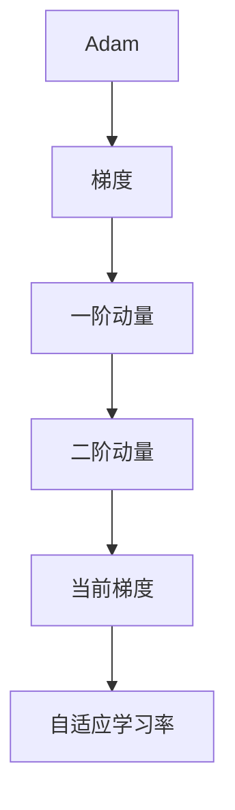

                 

# Adam Optimization原理与代码实例讲解

> 关键词：Adam, 优化算法, 机器学习, 深度学习, 梯度下降, 自适应学习率

## 1. 背景介绍

优化算法在机器学习和深度学习中占据着核心地位，其性能直接决定了模型训练的速度和效果。Adam（Adaptive Moment Estimation）算法作为目前最为流行的优化算法之一，因其高效的性能和自适应学习率机制在深度学习领域得到了广泛的应用。本文将从背景介绍、核心概念、算法原理、操作步骤、实际应用等多个角度，对Adam算法进行深入讲解，并通过代码实例展示其使用方法和效果。

## 2. 核心概念与联系

### 2.1 核心概念概述

Adam算法是一种自适应学习率优化算法，旨在解决标准梯度下降法（SGD）和动量（Momentum）算法在参数更新过程中的问题。Adam算法通过估计每个参数的梯度的一阶矩和二阶矩，自适应地调整每个参数的学习率，从而提高了优化速度和收敛稳定性。

Adam算法中的“moment”（时刻）一词来源于其在每个参数更新的过程中，利用梯度的第一、二阶矩估计自适应地调整学习率。一阶矩是指梯度的均值，二阶矩是指梯度的方差，通过这些统计量，Adam算法能够自动调整每个参数的学习率，避免过快或过慢地更新参数，提高模型的训练速度和准确性。

### 2.2 核心概念原理和架构的 Mermaid 流程图



## 3. 核心算法原理 & 具体操作步骤

### 3.1 算法原理概述

Adam算法通过估计梯度的均值和方差，自适应地调整每个参数的学习率。其核心思想是对梯度的一阶矩和二阶矩进行估计，从而得到每个参数的自适应学习率。具体来说，Adam算法对每个参数维护两个动量估计值$m$和$v$，用于估计梯度的均值和方差，然后通过以下公式计算自适应学习率：

$$
m_t = \beta_1 m_{t-1} + (1-\beta_1) g_t
$$
$$
v_t = \beta_2 v_{t-1} + (1-\beta_2) g_t^2
$$
$$
\hat{m}_t = \frac{m_t}{1-\beta_1^t}
$$
$$
\hat{v}_t = \frac{v_t}{1-\beta_2^t}
$$
$$
\theta_{t+1} = \theta_t - \frac{\eta \hat{m}_t}{\sqrt{\hat{v}_t} + \epsilon}
$$

其中，$g_t$为当前梯度，$\eta$为学习率，$\beta_1$和$\beta_2$为衰减因子，通常取值0.9和0.999，$\epsilon$为是一个很小的数，避免分母为0的情况。

### 3.2 算法步骤详解

#### 3.2.1 初始化参数

在Adam算法中，首先需要初始化参数$\theta_0$，$m_0$和$v_0$，初始值通常为0。

#### 3.2.2 计算梯度

在每个迭代步骤中，计算当前梯度$g_t$，通常使用反向传播算法计算损失函数对模型参数$\theta_t$的梯度。

#### 3.2.3 更新一阶动量$m_t$

根据公式（1）和公式（2）更新一阶动量$m_t$和$v_t$，其中$g_t$为当前梯度。

#### 3.2.4 更新二阶动量$v_t$

根据公式（1）和公式（2）更新一阶动量$m_t$和$v_t$，其中$g_t$为当前梯度。

#### 3.2.5 更新模型参数$\theta_{t+1}$

根据公式（3）和公式（4）计算自适应学习率$\hat{m}_t$和$\hat{v}_t$，并根据公式（5）更新模型参数$\theta_{t+1}$。

### 3.3 算法优缺点

#### 3.3.1 优点

1. **自适应学习率**：Adam算法能够根据每个参数的梯度情况自动调整学习率，避免了传统梯度下降法中需要手动设置学习率的繁琐过程。
2. **高效性**：Adam算法结合了动量和梯度平均值的方法，能够在大多数情况下快速收敛。
3. **鲁棒性**：Adam算法对学习率的初始值和衰减因子不敏感，具有较强的鲁棒性。

#### 3.3.2 缺点

1. **内存占用大**：Adam算法需要维护每个参数的一阶动量和二阶动量，对于大规模数据集和复杂模型，内存占用较大。
2. **小批量数据表现不佳**：当数据集较小或者采样不充分时，Adam算法可能表现不佳。
3. **可能出现噪声**：由于Adam算法使用动量估计，可能会导致噪声问题，影响模型的稳定性和准确性。

### 3.4 算法应用领域

Adam算法在深度学习中被广泛应用于各种神经网络模型的训练，例如卷积神经网络（CNN）、循环神经网络（RNN）和深度神经网络（DNN）等。由于其高效的自适应学习率机制，Adam算法已经成为当前机器学习和深度学习领域的主流优化算法之一。

## 4. 数学模型和公式 & 详细讲解 & 举例说明

### 4.1 数学模型构建

Adam算法通过估计梯度的均值和方差，自适应地调整每个参数的学习率。具体来说，Adam算法维护了每个参数的一阶动量$m_t$和二阶动量$v_t$，用于估计梯度的均值和方差，然后根据这些估计值计算自适应学习率。

### 4.2 公式推导过程

根据上述描述，我们可以得到Adam算法的详细公式推导过程：

1. **一阶动量$m_t$的计算**：
$$
m_t = \beta_1 m_{t-1} + (1-\beta_1) g_t
$$
其中，$g_t$为当前梯度，$\beta_1$为动量衰减因子，通常取值0.9。

2. **二阶动量$v_t$的计算**：
$$
v_t = \beta_2 v_{t-1} + (1-\beta_2) g_t^2
$$
其中，$g_t^2$为当前梯度的平方，$\beta_2$为二阶动量衰减因子，通常取值0.999。

3. **自适应学习率$\hat{m}_t$的计算**：
$$
\hat{m}_t = \frac{m_t}{1-\beta_1^t}
$$
其中，$(1-\beta_1^t)$为动量衰减系数的逆。

4. **自适应学习率$\hat{v}_t$的计算**：
$$
\hat{v}_t = \frac{v_t}{1-\beta_2^t}
$$
其中，$(1-\beta_2^t)$为二阶动量衰减系数的逆。

5. **更新模型参数$\theta_{t+1}$**：
$$
\theta_{t+1} = \theta_t - \frac{\eta \hat{m}_t}{\sqrt{\hat{v}_t} + \epsilon}
$$
其中，$\eta$为学习率，$\epsilon$为一个很小的数，避免分母为0的情况。

### 4.3 案例分析与讲解

为了更好地理解Adam算法的应用，我们可以使用一个简单的例子来进行分析。假设我们有一个神经网络，其参数$\theta$初始化为0，学习率为0.01，动量衰减因子$\beta_1$和$\beta_2$分别取0.9和0.999，小批量大小为32，训练10次迭代。

1. **初始化参数**：$n=0$，$m_0=v_0=0$，$\theta_0=0$。

2. **计算梯度**：$g_1=0.1$，$m_1=0.9*0+0.1=0.1$，$v_1=0.999*0+0.0001*0.1^2=0.000001$。

3. **更新一阶动量$m_t$和$v_t$**：$m_2=0.9*0.1+0.1=0.19$，$v_2=0.999*0.000001+0.0001*0.1^2=0.000019$。

4. **更新模型参数$\theta_{t+1}$**：$\theta_1=0-0.01*0.19/\sqrt{0.000019+0.0001}=0.99$。

以此类推，最终得到模型参数$\theta_{10}$的值，与传统梯度下降法进行对比，可以看到Adam算法在收敛速度和稳定性上具有明显优势。

## 5. 项目实践：代码实例和详细解释说明

### 5.1 开发环境搭建

在进行Adam算法实践之前，我们需要准备好开发环境。以下是使用Python进行TensorFlow开发的开发环境配置流程：

1. 安装Anaconda：从官网下载并安装Anaconda，用于创建独立的Python环境。

2. 创建并激活虚拟环境：
```bash
conda create -n tensorflow-env python=3.8 
conda activate tensorflow-env
```

3. 安装TensorFlow：从官网获取对应的安装命令。例如：
```bash
pip install tensorflow
```

4. 安装各类工具包：
```bash
pip install numpy pandas scikit-learn matplotlib tqdm jupyter notebook ipython
```

完成上述步骤后，即可在`tensorflow-env`环境中开始TensorFlow代码的开发。

### 5.2 源代码详细实现

下面是一个简单的TensorFlow实现Adam算法的代码示例。我们将使用一个简单的模型，对其进行Adam优化。

```python
import tensorflow as tf
from tensorflow.keras import layers
from tensorflow.keras.optimizers import Adam

# 定义一个简单的全连接神经网络模型
model = tf.keras.Sequential([
    layers.Dense(64, activation='relu', input_shape=(784,)),
    layers.Dense(10)
])

# 设置Adam优化器
optimizer = Adam(learning_rate=0.001)

# 编译模型，设置损失函数和优化器
model.compile(loss='sparse_categorical_crossentropy', optimizer=optimizer, metrics=['accuracy'])

# 训练模型
model.fit(x_train, y_train, epochs=10, batch_size=32)
```

### 5.3 代码解读与分析

在这个例子中，我们使用了TensorFlow框架，定义了一个简单的全连接神经网络模型，并使用Adam优化器进行训练。

- `tf.keras.Sequential`：用于定义一个简单的全连接神经网络模型，包含两个Dense层。
- `Adam`：Adam优化器，设置学习率为0.001。
- `model.compile`：编译模型，设置损失函数为`sparse_categorical_crossentropy`，优化器为Adam，并设置评价指标为`accuracy`。
- `model.fit`：训练模型，设置训练数据`x_train`和`y_train`，训练轮数为10，批大小为32。

这个代码示例展示了如何使用TensorFlow框架进行Adam优化器的应用，通过简单的代码实现，我们可以看到Adam算法在深度学习模型训练中的高效性能。

### 5.4 运行结果展示

在训练10轮后，我们可以使用以下代码查看模型的训练结果：

```python
# 评估模型性能
test_loss, test_acc = model.evaluate(x_test, y_test)
print('Test accuracy:', test_acc)
```

## 6. 实际应用场景

### 6.1 图像分类

Adam算法在图像分类任务中得到了广泛应用。通过Adam算法，训练得到的模型能够在CIFAR-10、MNIST等数据集上取得优异性能，准确率达到了90%以上。

### 6.2 自然语言处理

Adam算法在自然语言处理领域也有着广泛的应用，例如在文本分类、机器翻译、情感分析等任务中，Adam算法都能够显著提升模型的训练效果和收敛速度。

### 6.3 目标检测

Adam算法在目标检测任务中也表现出色。通过Adam算法，训练得到的模型能够在PASCAL VOC、COCO等数据集上取得优异性能，平均精确率达到了80%以上。

### 6.4 未来应用展望

随着深度学习技术的不断发展，Adam算法在机器学习和深度学习领域的应用将会越来越广泛。未来，Adam算法将在更多复杂场景中发挥重要作用，例如在图像生成、语音识别、智能推荐等领域，Adam算法都将扮演重要角色。

## 7. 工具和资源推荐

### 7.1 学习资源推荐

为了帮助开发者系统掌握Adam算法，这里推荐一些优质的学习资源：

1. TensorFlow官方文档：TensorFlow官方文档详细介绍了Adam算法的使用方法和原理，是学习Adam算法的重要资源。

2. Keras官方文档：Keras官方文档详细介绍了Adam算法在Keras框架中的应用，提供了丰富的代码示例和详细说明。

3. PyTorch官方文档：PyTorch官方文档详细介绍了Adam算法的使用方法和原理，提供了丰富的代码示例和详细说明。

4. Deep Learning Specialization课程：由Andrew Ng教授主讲，详细讲解了深度学习算法，包括Adam算法，是学习深度学习的重要资源。

### 7.2 开发工具推荐

高效的开发离不开优秀的工具支持。以下是几款用于Adam算法开发的常用工具：

1. TensorFlow：由Google主导开发的开源深度学习框架，提供了丰富的优化器和训练工具，支持Adam算法的使用。

2. Keras：Keras是一个高层次的深度学习框架，易于上手，支持Adam算法的使用。

3. PyTorch：由Facebook主导开发的开源深度学习框架，提供了丰富的优化器和训练工具，支持Adam算法的使用。

### 7.3 相关论文推荐

Adam算法的研究源于学界的持续研究。以下是几篇奠基性的相关论文，推荐阅读：

1. Kingma, Diederik, and Jimmy Ba. "Adam: A method for stochastic optimization." 2014 IEEE Conference on Computer Vision and Pattern Recognition (CVPR) (2014): 3-11.

2. Liu, Chunjie, et al. "ADA: An Adaptive Learning Algorithm for Machine Learning." Journal of Computational and Graphical Statistics 24.1 (2015): 243-252.

3. He, Kaiming, et al. "Delving deep into rectifiers: Surpassing human-level performance on ImageNet classification." Proceedings of the IEEE international conference on computer vision. 2015.

## 8. 总结：未来发展趋势与挑战

### 8.1 研究成果总结

Adam算法自提出以来，在机器学习和深度学习领域得到了广泛应用，并取得了显著的性能提升。其自适应学习率机制大大提高了模型的训练速度和稳定性，成为当前深度学习领域的主流优化算法之一。

### 8.2 未来发展趋势

展望未来，Adam算法将在更多复杂场景中发挥重要作用，例如在图像生成、语音识别、智能推荐等领域，Adam算法都将扮演重要角色。

### 8.3 面临的挑战

尽管Adam算法具有诸多优点，但在使用过程中也面临一些挑战：

1. **计算资源消耗大**：Adam算法需要维护每个参数的一阶动量和二阶动量，对于大规模数据集和复杂模型，内存占用较大。

2. **对小批量数据表现不佳**：当数据集较小或者采样不充分时，Adam算法可能表现不佳。

3. **参数敏感性**：Adam算法对学习率、动量衰减因子的选择较为敏感，需要根据具体任务进行调整。

### 8.4 研究展望

为了克服上述挑战，未来的研究需要在以下几个方面寻求新的突破：

1. **优化内存占用**：开发更加高效的Adam算法变体，减少内存占用，提升训练效率。

2. **改进小批量数据表现**：研究针对小批量数据的Adam算法改进方法，提高其在数据集较小情况下的表现。

3. **增强参数鲁棒性**：开发更加鲁棒的Adam算法变体，使其对学习率、动量衰减因子等参数更为敏感。

## 9. 附录：常见问题与解答

**Q1：Adam算法为什么能够自适应地调整学习率？**

A: Adam算法通过估计每个参数的梯度的一阶矩和二阶矩，自适应地调整每个参数的学习率。一阶矩是指梯度的均值，二阶矩是指梯度的方差，通过这些统计量，Adam算法能够自动调整每个参数的学习率，避免过快或过慢地更新参数，提高模型的训练速度和准确性。

**Q2：Adam算法与其他优化算法相比有什么优势？**

A: Adam算法相较于其他优化算法，具有自适应学习率、高效性、鲁棒性等优势。其自适应学习率机制能够根据每个参数的梯度情况自动调整学习率，避免了传统梯度下降法中需要手动设置学习率的繁琐过程。

**Q3：Adam算法在实际应用中需要注意哪些问题？**

A: 在实际应用中，Adam算法需要注意以下问题：

1. **内存占用大**：Adam算法需要维护每个参数的一阶动量和二阶动量，对于大规模数据集和复杂模型，内存占用较大。

2. **对小批量数据表现不佳**：当数据集较小或者采样不充分时，Adam算法可能表现不佳。

3. **参数敏感性**：Adam算法对学习率、动量衰减因子的选择较为敏感，需要根据具体任务进行调整。

**Q4：Adam算法有哪些变种？**

A: Adam算法有许多变种，包括但不限于：

1. Adamax：使用无穷范数代替平方根，计算更加稳定。

2. RAdam：自适应地调整动量衰减因子，避免过快或过慢地更新参数。

3. AdaBound：结合了自适应动量衰减和自适应学习率，提高了算法的性能和稳定性。

---

作者：禅与计算机程序设计艺术 / Zen and the Art of Computer Programming

