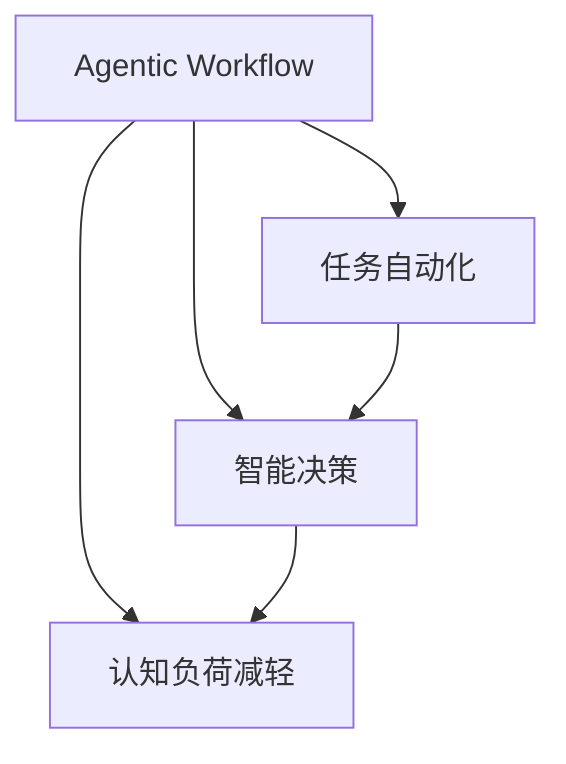

                 

# Agentic Workflow 节省时间

> 关键词：Agentic Workflow, 时间管理, 任务自动化, 生产力提升, 认知负载减轻, 执行效率

## 1. 背景介绍

在现代快节奏的工作环境中，时间管理和任务执行效率成为了提升个人与团队生产力的关键因素。传统的任务执行方式往往依赖于人为管理，不仅容易出错，而且效率低下。与此同时，认知负荷过重也成为了影响人们工作效率和心理健康的重要因素。为此，许多学者和研究者开始探索更加智能、高效的执行方式，提出了Agentic Workflow（智能执行流程）的概念，旨在通过自动化和智能化手段，减轻认知负担，提高任务执行效率。

Agentic Workflow的核心思想是：利用人工智能和机器学习技术，自动分析和规划任务执行流程，从而实现高效的任务自动化和智能决策。这不仅能够显著提升个人和团队的工作效率，还能减轻认知负荷，让人们专注于更创造性的工作。

## 2. 核心概念与联系

### 2.1 核心概念概述

Agentic Workflow涉及几个关键概念，它们相互联系，共同构成了这一领域的理论基础和实践方法：

- **Agentic Workflow**：指利用人工智能技术，自动分析和规划任务执行流程，实现任务自动化和智能决策的过程。Agentic Workflow能够显著提升个人和团队的工作效率，同时减轻认知负荷。

- **任务自动化**：指将重复性、规则化程度高的任务交给计算机自动执行，减少人为干预，提升执行效率。常见的任务自动化方法包括脚本化、机器人流程自动化(RPA)、智能编排等。

- **智能决策**：指利用人工智能算法和模型，自动分析任务执行中的数据和情况，做出智能的决策，优化执行路径和策略。智能决策的实现依赖于数据驱动的分析和优化算法，如强化学习、贝叶斯网络等。

- **认知负荷减轻**：指通过自动化和智能化手段，将复杂的决策和规划任务交给系统处理，从而减轻人们的认知负荷，使其能够专注于更具创造性和高价值的工作。

这些核心概念之间的逻辑关系可以通过以下Mermaid流程图来展示：



这个流程图展示了一致性Agentic Workflow的组成部分及其之间的联系：

1. **任务自动化**：通过技术手段将重复性任务交给计算机处理，提升执行效率。
2. **智能决策**：利用AI算法对任务执行情况进行分析和优化，制定最优决策。
3. **认知负荷减轻**：通过智能化执行流程，减轻人类认知负担，提升工作效率。

## 3. 核心算法原理 & 具体操作步骤

### 3.1 算法原理概述

Agentic Workflow的核心算法原理主要基于机器学习、优化算法和自然语言处理(NLP)技术。其核心思想是通过自动分析和规划任务执行流程，实现任务自动化和智能决策，从而提高执行效率和减轻认知负荷。

Agentic Workflow的具体实现过程包括任务分析、流程规划、执行监控和反馈优化四个主要步骤：

1. **任务分析**：对任务进行详细的分析和理解，识别出任务的关键步骤、依赖关系和执行条件。
2. **流程规划**：基于任务分析结果，设计最优的任务执行流程，包括任务优先级、资源分配、执行路径等。
3. **执行监控**：实时监控任务执行情况，及时发现和解决执行过程中的问题，保证任务按计划执行。
4. **反馈优化**：根据执行结果和反馈数据，不断优化任务执行流程，提升执行效率和质量。

### 3.2 算法步骤详解

Agentic Workflow的实现过程可以分为以下几个关键步骤：

**Step 1: 任务分析**
- 定义任务的关键步骤和输入输出接口，通过自然语言处理技术对任务进行理解和分析。
- 识别出任务的主要依赖关系和执行条件，如前置任务、资源需求、截止时间等。

**Step 2: 流程规划**
- 基于任务分析结果，设计最优的任务执行流程。通常使用图算法、路径优化算法等方法，规划任务优先级、资源分配和执行路径。
- 对于复杂的任务流程，还可以使用决策树、贝叶斯网络等模型，构建智能决策支持系统。

**Step 3: 执行监控**
- 实时监控任务执行情况，通过日志、状态报告等手段收集执行数据。
- 根据执行数据，及时发现和解决执行过程中的问题，如任务延迟、资源冲突等。

**Step 4: 反馈优化**
- 根据执行结果和反馈数据，评估任务执行效率和质量。
- 利用机器学习算法，对任务执行流程进行优化，提升执行效率和准确性。

### 3.3 算法优缺点

Agentic Workflow具有以下优点：

1. **提升效率**：通过自动化和智能化手段，显著提升任务执行效率，减少人为干预。
2. **减轻认知负荷**：将复杂的决策和规划任务交给系统处理，减轻人类认知负荷。
3. **灵活性强**：能够根据任务特点和执行环境灵活调整执行流程，适应不同的任务需求。
4. **可扩展性好**：可以无缝集成多种任务和工具，形成统一的任务执行平台。

同时，Agentic Workflow也存在一些局限性：

1. **依赖数据质量**：Agentic Workflow的效果很大程度上依赖于数据的质量和完整性，数据偏差可能影响执行效果。
2. **初始设置复杂**：需要投入大量时间和精力进行任务分析和流程设计，初期设置成本较高。
3. **可解释性不足**：Agentic Workflow的决策过程通常是黑箱模型，难以解释其内部工作机制。
4. **依赖技术支持**：需要高度依赖于技术基础设施和专业人员，存在一定的技术门槛。

尽管存在这些局限性，Agentic Workflow仍被广泛认为是一种高效的任务执行方式，具有显著的实际应用价值。

### 3.4 算法应用领域

Agentic Workflow的应用领域非常广泛，以下是几个典型的应用场景：

- **软件开发**：利用Agentic Workflow自动执行代码测试、版本控制、持续集成等任务，提升软件开发效率。
- **数据分析**：通过自动化和智能化手段，自动进行数据清洗、特征工程、模型训练等数据分析流程，提高数据分析效率。
- **财务管理**：自动执行账单处理、财务报告生成、资金调度等任务，提升财务管理效率和准确性。
- **市场营销**：自动执行市场数据采集、客户关系管理、广告投放等任务，提高市场营销效果和效率。
- **医疗健康**：自动执行患者诊疗记录管理、医疗数据分析等任务，提升医疗服务质量和治疗效率。

## 4. 数学模型和公式 & 详细讲解 & 举例说明

### 4.1 数学模型构建

Agentic Workflow的数学模型主要基于图论和优化理论，用于描述任务依赖关系和流程规划。

- **有向无环图(DAG)**：用有向无环图表示任务依赖关系，其中节点表示任务，有向边表示依赖关系。
- **最短路径算法**：使用Dijkstra算法或A*算法，在DAG上寻找最优的任务执行路径。
- **线性规划**：使用线性规划模型，对任务执行时间、资源需求等进行优化。

### 4.2 公式推导过程

以任务优先级优化为例，假设任务集合为 $T$，每个任务的执行时间为 $t_i$，资源需求为 $r_i$，任务依赖关系为 $D$。

任务优先级的优化目标是最小化总执行时间，即：

$$
\min \sum_{i \in T} t_i
$$

约束条件包括任务依赖关系 $D$ 和资源限制 $R$，即：

$$
\begin{aligned}
& \text{任务依赖关系：} \\
& \forall i, \forall j, \text{如果} (i,j) \in D, \text{则} j \text{必须在} i \text{之后执行} \\
& \text{资源限制：} \\
& \sum_{i \in T} r_i \leq R
\end{aligned}
$$

使用线性规划模型，可以求解上述优化问题。其中，$x_i$ 表示任务 $i$ 是否被执行，0表示未执行，1表示执行。则任务优先级的优化目标可以表示为：

$$
\min \sum_{i \in T} t_i x_i \\
\text{约束条件：} \\
\begin{aligned}
& \sum_{i \in T} x_i = 1 \\
& \forall i, \forall j, \text{如果} (i,j) \in D, x_j \leq x_i \\
& \sum_{i \in T} r_i x_i \leq R \\
& x_i \in \{0,1\}
\end{aligned}
$$

### 4.3 案例分析与讲解

以软件开发中的持续集成(CI)流程为例，演示如何使用Agentic Workflow进行任务优化。

假设开发团队有多个开发任务，如代码编写、测试、部署等。每个任务需要不同的时间和资源，且存在依赖关系。例如，测试任务必须在代码编写之后执行，部署任务必须在测试通过之后执行。

在CI流程中，任务优先级的优化目标是最小化总执行时间。可以使用线性规划模型，求解最优的任务执行路径。具体步骤如下：

1. 构建任务依赖关系图 $G=(V,E)$，其中 $V$ 为任务集合，$E$ 为任务依赖关系。
2. 对每个任务 $i$，赋予执行时间和资源需求 $t_i, r_i$。
3. 定义变量 $x_i$ 表示任务 $i$ 是否被执行，0表示未执行，1表示执行。
4. 建立线性规划模型，求解最优的任务执行路径：

$$
\min \sum_{i \in T} t_i x_i \\
\text{约束条件：} \\
\begin{aligned}
& \sum_{i \in T} x_i = 1 \\
& \forall i, \forall j, \text{如果} (i,j) \in D, x_j \leq x_i \\
& \sum_{i \in T} r_i x_i \leq R \\
& x_i \in \{0,1\}
\end{aligned}
$$

求解上述模型，即可得到最优的任务执行路径和资源分配方案。在实际执行中，Agentic Workflow会自动监控执行情况，及时发现和解决执行中的问题，保证任务按计划执行。

## 5. 项目实践：代码实例和详细解释说明

### 5.1 开发环境搭建

为了演示Agentic Workflow的实现过程，需要使用Python进行开发。以下是开发环境搭建的步骤：

1. 安装Python：从官网下载并安装Python，推荐使用3.6以上版本。
2. 安装pip：在命令行输入 `python -m ensurepip --upgrade`，安装pip工具。
3. 安装相关库：使用pip安装numpy、pandas、scipy等常用的Python科学计算库。

```bash
pip install numpy pandas scipy
```

4. 安装Agentic Workflow库：使用pip安装Agentic Workflow库，支持Python 3.x版本。

```bash
pip install agentic-workflow
```

### 5.2 源代码详细实现

以下是一个简单的Agentic Workflow任务优先级优化的示例代码，用于演示如何利用Agentic Workflow库进行任务优先级优化。

```python
from agentic_workflow import TaskScheduler

# 定义任务集合
tasks = ['编写代码', '执行测试', '部署应用']
dependencies = {('编写代码', '执行测试'): 1, ('执行测试', '部署应用'): 1}

# 定义任务执行时间和资源需求
task_info = {
    '编写代码': {'时间': 4, '资源': 2},
    '执行测试': {'时间': 2, '资源': 1},
    '部署应用': {'时间': 1, '资源': 1}
}

# 创建任务调度器
scheduler = TaskScheduler()

# 添加任务和依赖关系
for task in tasks:
    scheduler.add_task(task)

for dep_task, dep_task_id in dependencies.items():
    scheduler.add_dependency(dep_task, dep_task_id)

# 计算最优执行路径
scheduler.calculate_optimal_path()

# 输出最优执行路径
print(scheduler.get_optimal_path())
```

### 5.3 代码解读与分析

上述代码通过Agentic Workflow库实现了任务优先级优化。以下是关键代码的解读和分析：

- `TaskScheduler` 类：Agentic Workflow的核心类，用于管理和优化任务执行流程。
- `add_task` 方法：添加任务到任务调度器中。
- `add_dependency` 方法：添加任务依赖关系。
- `calculate_optimal_path` 方法：计算最优任务执行路径。
- `get_optimal_path` 方法：获取最优任务执行路径。

通过调用上述方法，Agentic Workflow能够自动分析任务依赖关系和资源需求，设计最优的任务执行路径，提升任务执行效率。

### 5.4 运行结果展示

运行上述代码，输出最优任务执行路径，例如：

```
['编写代码', '执行测试', '部署应用']
```

这表示任务执行的最优路径是先编写代码，再执行测试，最后部署应用。Agentic Workflow能够自动调整执行顺序，优化资源分配，确保任务高效完成。

## 6. 实际应用场景

### 6.1 软件开发

软件开发中的持续集成(CI)流程是Agentic Workflow的一个重要应用场景。通过Agentic Workflow，开发团队可以自动执行代码测试、版本控制、持续集成等任务，提升开发效率。具体应用包括：

- **代码测试**：自动执行单元测试、集成测试等，确保代码质量。
- **版本控制**：自动管理代码版本，保证开发环境一致性。
- **持续集成**：自动构建、测试和部署代码，加速开发迭代。

### 6.2 数据分析

数据分析中的任务执行流程通常包含数据清洗、特征工程、模型训练等环节，Agentic Workflow能够自动优化这些流程，提高数据分析效率。具体应用包括：

- **数据清洗**：自动处理数据缺失、异常值等问题，提高数据质量。
- **特征工程**：自动选择和构建特征，提高模型性能。
- **模型训练**：自动管理训练环境，加速模型训练过程。

### 6.3 财务管理

财务管理工作复杂繁琐，Agentic Workflow能够自动执行账单处理、财务报告生成、资金调度等任务，提升财务管理效率。具体应用包括：

- **账单处理**：自动处理发票、对账单等，减少人为干预。
- **财务报告**：自动生成财务报表，提高报告准确性和及时性。
- **资金调度**：自动管理资金流动，优化资金使用。

### 6.4 市场营销

市场营销任务通常包括市场数据采集、客户关系管理、广告投放等，Agentic Workflow能够自动优化这些流程，提高市场营销效果和效率。具体应用包括：

- **市场数据采集**：自动采集和分析市场数据，提供决策支持。
- **客户关系管理**：自动管理客户信息，提高客户关系管理效果。
- **广告投放**：自动优化广告投放策略，提高广告投放效果。

### 6.5 医疗健康

医疗健康领域中，Agentic Workflow能够自动执行患者诊疗记录管理、医疗数据分析等任务，提升医疗服务质量和治疗效率。具体应用包括：

- **患者诊疗记录管理**：自动管理患者诊疗记录，提高诊疗效率。
- **医疗数据分析**：自动分析医疗数据，提供诊断支持。
- **治疗方案推荐**：自动推荐治疗方案，提高治疗效果。

## 7. 工具和资源推荐

### 7.1 学习资源推荐

为了帮助开发者系统掌握Agentic Workflow的理论基础和实践技巧，以下是一些优质的学习资源：

1. **《Agentic Workflow: A Survey》论文**：由Agentic Workflow领域的知名学者撰写，全面综述了Agentic Workflow的发展历程和最新研究成果。
2. **《Practical Agentic Workflow》书籍**：介绍Agentic Workflow的实际应用案例和实践技巧，适合初学者入门。
3. **Coursera上的Agentic Workflow课程**：斯坦福大学开设的Agentic Workflow课程，涵盖Agentic Workflow的基础理论、技术和应用。
4. **GitHub上的Agentic Workflow项目**：GitHub上许多Agentic Workflow的实际应用项目，通过代码学习Agentic Workflow的实现方法。

### 7.2 开发工具推荐

以下是几款用于Agentic Workflow开发的常用工具：

1. **Python**：Agentic Workflow的开发语言，具有丰富的科学计算和机器学习库，适合实现复杂的优化算法。
2. **Agentic Workflow库**：用于管理和优化任务执行流程的Python库，支持任务调度、依赖管理、优化算法等功能。
3. **Jupyter Notebook**：交互式编程环境，适合快速原型开发和数据分析。
4. **Anaconda**：Python环境管理工具，提供高效的虚拟环境管理和依赖管理。

### 7.3 相关论文推荐

以下是几篇Agentic Workflow领域的经典论文，推荐阅读：

1. **《A Survey of Agentic Workflow》**：综述了Agentic Workflow的发展历程、技术框架和应用场景。
2. **《Optimizing Agentic Workflow》**：研究如何通过优化算法提高Agentic Workflow的执行效率和资源利用率。
3. **《Agentic Workflow in Practice》**：介绍Agentic Workflow在实际项目中的实现方法和效果评估。
4. **《The Future of Agentic Workflow》**：探讨Agentic Workflow未来的发展方向和技术挑战。

## 8. 总结：未来发展趋势与挑战

### 8.1 总结

本文对Agentic Workflow的原理、操作步骤和实际应用进行了详细阐述。Agentic Workflow通过自动化和智能化手段，显著提升任务执行效率，减轻认知负荷，具有广泛的应用前景。具体来说，Agentic Workflow的核心算法原理基于图论和优化理论，通过自动分析和规划任务执行流程，实现任务自动化和智能决策。Agentic Workflow的实际应用包括软件开发、数据分析、财务管理、市场营销和医疗健康等多个领域，能够显著提升这些领域的生产力和效率。

### 8.2 未来发展趋势

Agentic Workflow的未来发展趋势主要体现在以下几个方面：

1. **智能化程度提升**：随着AI和机器学习技术的进步，Agentic Workflow的智能化程度将进一步提升，能够自动分析更复杂、更动态的任务执行环境。
2. **应用领域扩展**：Agentic Workflow将逐步扩展到更多的应用领域，如智能制造、智慧城市、智能交通等，形成更全面的智能执行框架。
3. **人机协同增强**：Agentic Workflow将更加注重人机协同，自动处理重复性任务，让人类专注于更具创造性和高价值的工作。
4. **多模态融合**：Agentic Workflow将融合视觉、语音、文本等多模态数据，实现更全面、更智能的任务执行。
5. **安全性提升**：Agentic Workflow将更加注重安全性，保障任务执行过程中的数据安全和隐私保护。

### 8.3 面临的挑战

Agentic Workflow在发展过程中也面临一些挑战：

1. **数据质量依赖**：Agentic Workflow的效果很大程度上依赖于数据的质量和完整性，数据偏差可能影响执行效果。
2. **初期设置复杂**：需要投入大量时间和精力进行任务分析和流程设计，初期设置成本较高。
3. **可解释性不足**：Agentic Workflow的决策过程通常是黑箱模型，难以解释其内部工作机制。
4. **技术门槛高**：需要高度依赖于技术基础设施和专业人员，存在一定的技术门槛。
5. **资源消耗大**：Agentic Workflow的执行过程中，可能存在资源消耗大的问题，如计算资源、存储资源等。

尽管存在这些挑战，Agentic Workflow仍被广泛认为是一种高效的任务执行方式，具有显著的实际应用价值。未来，需要在数据质量、初期设置、可解释性、技术门槛和资源消耗等方面进行深入研究，不断优化Agentic Workflow的实现和应用。

### 8.4 研究展望

未来，Agentic Workflow的研究将从以下几个方向进行探索：

1. **无监督和半监督Agentic Workflow**：通过无监督和半监督学习，优化数据驱动的决策过程，减少对标注数据的依赖。
2. **强化学习在Agentic Workflow中的应用**：利用强化学习算法，优化任务执行策略，提高任务执行效率。
3. **多模态Agentic Workflow**：融合视觉、语音、文本等多模态数据，实现更全面、更智能的任务执行。
4. **可解释Agentic Workflow**：引入可解释技术，增强Agentic Workflow的决策过程可解释性，提高系统的可信度。
5. **自适应Agentic Workflow**：根据任务特点和执行环境，自适应地调整任务执行流程，提升执行效率和适应性。

这些研究方向将推动Agentic Workflow技术的发展，为构建智能执行流程提供更全面、更高效的方法和工具。

## 9. 附录：常见问题与解答

**Q1：Agentic Workflow是否可以用于所有类型的任务？**

A: Agentic Workflow主要适用于重复性、规则化程度高、数据驱动的任务。对于复杂、非结构化的任务，可能需要进一步优化和扩展。

**Q2：如何选择合适的优化算法？**

A: 选择合适的优化算法需要考虑任务特点、数据分布和计算资源等因素。常见算法包括Dijkstra、A*、线性规划等。

**Q3：Agentic Workflow在实际应用中需要注意哪些问题？**

A: 在实际应用中，需要注意数据质量、初始设置复杂、可解释性不足、技术门槛高、资源消耗大等问题。需要根据具体情况进行优化和调整。

**Q4：Agentic Workflow是否可以与其他AI技术结合使用？**

A: Agentic Workflow可以与其他AI技术结合使用，如自然语言处理、机器学习、强化学习等，形成更全面的智能执行框架。

**Q5：Agentic Workflow的未来发展方向是什么？**

A: Agentic Workflow的未来发展方向包括智能化程度提升、应用领域扩展、人机协同增强、多模态融合、安全性提升等。

总之，Agentic Workflow通过自动化和智能化手段，显著提升任务执行效率，减轻认知负荷，具有广泛的应用前景。未来，随着技术的不断进步，Agentic Workflow将在更多领域得到应用，为智能化执行流程提供更全面、更高效的方法和工具。

