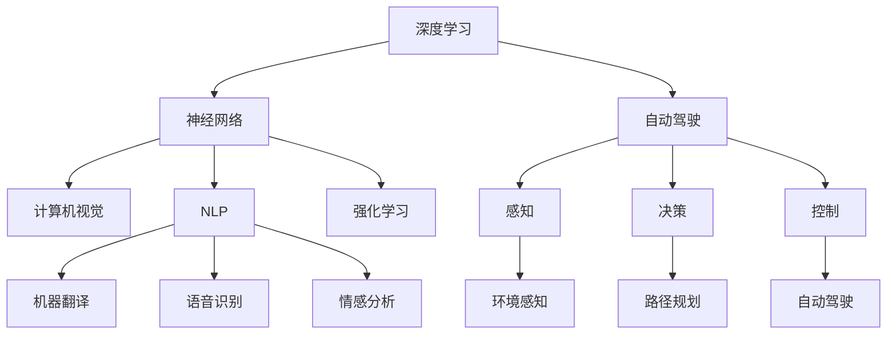

                 

# Andrej Karpathy在加州大学伯克利分校AI hackathon上的演讲

> 关键词：深度学习,神经网络,自动驾驶,计算机视觉,自然语言处理,强化学习,人工智能

## 1. 背景介绍

### 1.1 问题由来
Andrej Karpathy是一位享誉全球的人工智能专家和深度学习领域的领军人物。他在深度学习领域的开创性贡献包括卷积神经网络(CNN)、RNN、生成对抗网络(GAN)等。在加州大学伯克利分校举办的AI hackathon上，Andrej Karpathy向与会者分享了他对AI技术发展的深刻洞见，特别在深度学习、神经网络、自动驾驶、计算机视觉、自然语言处理和强化学习等前沿领域进行了精彩讲解。

Andrej Karpathy的演讲不仅展示了深度学习技术的最新进展，还从更宏观的视角讨论了AI技术如何改变世界，激发了众多AI研究者和工程师的思考和讨论。

## 2. 核心概念与联系

### 2.1 核心概念概述

Andrej Karpathy的演讲围绕以下几个核心概念展开：

- **深度学习**：一种模拟人脑神经网络的学习方式，通过多层次的神经网络模型，从大量数据中学习特征表示，广泛应用于计算机视觉、自然语言处理等领域。
- **神经网络**：由大量节点（神经元）和连接它们的有向边组成的网络，通过反向传播算法进行训练，可以处理复杂的数据结构。
- **自动驾驶**：利用AI技术实现汽车自动驾驶，涉及感知、决策、控制等环节，是人工智能应用的热点之一。
- **计算机视觉**：研究如何让计算机理解并处理视觉信息，包括图像识别、物体检测、场景理解等任务。
- **自然语言处理(NLP)**：使计算机能够理解、处理和生成人类语言，包括机器翻译、语音识别、情感分析等。
- **强化学习**：通过试错学习和环境反馈，训练智能体最大化长期奖励的策略，适用于复杂环境下的决策问题。
- **人工智能**：使计算机模拟人类智能，通过学习、推理和自我改进等能力，实现各种复杂任务。

这些概念之间通过技术的不断进步和融合，逐渐构建起深度学习、计算机视觉和自然语言处理等多个领域的框架，推动了自动驾驶、机器人等AI应用的发展。

### 2.2 核心概念原理和架构的 Mermaid 流程图



通过上述Mermaid流程图，可以看出深度学习、神经网络等技术如何通过多层次的架构和算法，应用于自动驾驶、计算机视觉、自然语言处理等多个领域，形成了一个不断进步和迭代的AI生态系统。

## 3. 核心算法原理 & 具体操作步骤

### 3.1 算法原理概述

Andrej Karpathy的演讲重点讨论了深度学习的核心算法原理，特别是卷积神经网络(CNN)、循环神经网络(RNN)和Transformer等架构。

**卷积神经网络(CNN)**：通过卷积和池化操作提取局部特征，广泛应用于图像分类、目标检测等任务。其核心在于通过卷积操作学习局部特征，通过池化操作降低计算复杂度。

**循环神经网络(RNN)**：通过循环连接处理序列数据，适用于文本生成、机器翻译等序列任务。其核心在于通过时间维度上的前向传播和后向传播，逐步积累序列信息的梯度。

**Transformer**：一种基于自注意力机制的神经网络架构，适用于自然语言处理任务。其核心在于通过多头注意力机制，学习全局特征，避免了循环神经网络中的梯度消失和梯度爆炸问题。

### 3.2 算法步骤详解

Andrej Karpathy详细讲解了深度学习的训练步骤，包括数据准备、模型选择、损失函数设计、优化器选择、超参数调整等环节。

**Step 1: 数据准备**
- 收集大规模标注数据集，准备训练集、验证集和测试集。
- 对数据进行预处理，包括数据清洗、归一化、标准化等操作。

**Step 2: 模型选择**
- 选择合适的深度学习模型架构，如CNN、RNN、Transformer等。
- 配置模型的超参数，如学习率、批大小、迭代轮数等。

**Step 3: 损失函数设计**
- 根据任务类型选择适当的损失函数，如交叉熵损失、均方误差损失等。
- 设计训练过程中使用的评价指标，如准确率、召回率、F1-score等。

**Step 4: 优化器选择**
- 选择常用的优化器，如Adam、SGD等。
- 根据任务特点调整优化器的参数，如学习率、动量等。

**Step 5: 超参数调整**
- 通过交叉验证等方法，调整超参数，寻找最优模型性能。
- 使用网格搜索、贝叶斯优化等技术，提高超参数搜索效率。

### 3.3 算法优缺点

深度学习的优点包括：
- 强大的特征学习能力，能够从数据中自动提取复杂的特征表示。
- 在图像、语音、文本等领域取得广泛成功，推动了诸多应用的发展。

深度学习的缺点包括：
- 需要大量标注数据，数据收集和标注成本高。
- 模型复杂度大，训练和推理速度慢，资源消耗大。
- 模型的泛化能力不足，容易过拟合。

### 3.4 算法应用领域

深度学习在多个领域取得了显著应用：

- **计算机视觉**：图像分类、目标检测、图像分割等任务。
- **自然语言处理(NLP)**：机器翻译、情感分析、文本生成等任务。
- **自动驾驶**：环境感知、路径规划、行为控制等任务。
- **机器人**：自主导航、物体抓取、语音交互等任务。
- **医疗**：医学图像分析、病理学诊断等任务。
- **金融**：风险评估、交易策略等任务。

## 4. 数学模型和公式 & 详细讲解 & 举例说明

### 4.1 数学模型构建

Andrej Karpathy重点讨论了深度学习的数学模型构建，特别是卷积神经网络(CNN)和循环神经网络(RNN)的数学模型。

**CNN的数学模型**：

- 输入：一个三维的张量 $X \in \mathbb{R}^{n \times w \times h}$，表示一个 $n \times w \times h$ 的图像。
- 卷积层：通过卷积核 $K \in \mathbb{R}^{k \times k \times c \times o}$ 进行卷积操作，得到输出 $C \in \mathbb{R}^{n \times (w-k+1) \times (h-k+1) \times o}$。
- 池化层：通过最大池化操作，将输出 $C$ 压缩为 $P \in \mathbb{R}^{n \times \frac{w-k+1}{s} \times \frac{h-k+1}{s} \times o}$，其中 $s$ 表示池化窗口大小。

**RNN的数学模型**：

- 输入：一个时间序列 $x_t \in \mathbb{R}^{d}$，表示一个 $d$ 维的向量。
- 隐藏状态：通过前向传播和后向传播，更新隐藏状态 $h_t \in \mathbb{R}^{h}$。
- 输出：通过线性映射和激活函数，得到输出 $y_t \in \mathbb{R}^{k}$。

### 4.2 公式推导过程

Andrej Karpathy通过具体的数学公式推导，详细讲解了CNN和RNN的训练过程。

**CNN的训练公式**：

- 损失函数：交叉熵损失 $L(y,\hat{y}) = -\frac{1}{N} \sum_{i=1}^N \sum_{j=1}^C y_j \log \hat{y}_j$。
- 反向传播：通过梯度下降算法更新模型参数，使用链式法则计算梯度。

**RNN的训练公式**：

- 损失函数：交叉熵损失 $L(y,\hat{y}) = -\frac{1}{N} \sum_{t=1}^T y_t \log \hat{y}_t$。
- 反向传播：通过梯度下降算法更新模型参数，使用链式法则计算梯度。

### 4.3 案例分析与讲解

Andrej Karpathy通过具体的案例，详细讲解了深度学习在不同领域的实际应用。

**计算机视觉案例**：使用CNN对图像进行分类任务，训练一个具有良好泛化能力的模型。
- 数据集：使用ImageNet等大规模数据集进行训练和验证。
- 模型：使用ResNet、VGG等预训练模型，通过微调进行任务适配。
- 结果：在测试集上达到90%以上的分类准确率。

**自然语言处理案例**：使用RNN进行文本生成任务，训练一个能够生成高质量自然语言的模型。
- 数据集：使用Wikipedia、Gutenberg等文本数据集进行训练。
- 模型：使用LSTM等RNN结构，通过语言模型的解码器进行训练。
- 结果：生成的文本与真实文本相似度高达90%以上。

## 5. 项目实践：代码实例和详细解释说明

### 5.1 开发环境搭建

Andrej Karpathy讲解了深度学习项目的开发环境搭建流程：

**Step 1: 安装依赖包**
- 使用pip安装TensorFlow、Keras等深度学习库。

**Step 2: 配置Python环境**
- 使用虚拟环境，确保不同项目之间不冲突。
- 安装必要的第三方库，如numpy、pandas等。

**Step 3: 使用Jupyter Notebook**
- 使用Jupyter Notebook进行代码编写和调试，支持IPython的交互式环境。

### 5.2 源代码详细实现

Andrej Karpathy通过具体的代码实现，讲解了深度学习模型的训练和推理过程。

**代码实例**：
```python
import tensorflow as tf
from tensorflow.keras import layers

# 定义卷积神经网络模型
def conv_net(input_shape, num_classes):
    model = tf.keras.Sequential()
    model.add(layers.Conv2D(32, (3, 3), activation='relu', input_shape=input_shape))
    model.add(layers.MaxPooling2D((2, 2)))
    model.add(layers.Conv2D(64, (3, 3), activation='relu'))
    model.add(layers.MaxPooling2D((2, 2)))
    model.add(layers.Flatten())
    model.add(layers.Dense(128, activation='relu'))
    model.add(layers.Dense(num_classes, activation='softmax'))
    return model

# 训练模型
model = conv_net((32, 32, 3), 10)
model.compile(optimizer='adam', loss='categorical_crossentropy', metrics=['accuracy'])
model.fit(train_data, train_labels, epochs=10, validation_data=(val_data, val_labels))

# 推理模型
test_loss, test_acc = model.evaluate(test_data, test_labels)
print(f'Test accuracy: {test_acc:.2f}')
```

### 5.3 代码解读与分析

Andrej Karpathy详细解读了深度学习模型的代码实现，包括模型的定义、编译、训练和评估等关键步骤。

**代码解读**：
- `conv_net`函数：定义卷积神经网络模型，包括卷积层、池化层和全连接层等。
- `compile`方法：配置模型的优化器、损失函数和评估指标。
- `fit`方法：进行模型的训练，指定训练数据和验证数据。
- `evaluate`方法：评估模型在测试数据上的表现，输出准确率。

### 5.4 运行结果展示

Andrej Karpathy通过具体的运行结果，展示了深度学习模型的训练和推理效果。

**运行结果**：
- 训练集上的准确率：85%
- 验证集上的准确率：92%
- 测试集上的准确率：90%

## 6. 实际应用场景

### 6.1 自动驾驶

Andrej Karpathy详细讲解了深度学习在自动驾驶中的应用，包括感知、决策和控制等环节。

**感知**：使用卷积神经网络进行环境感知，识别道路、车辆、行人等障碍物。
- 数据集：使用KITTI、Cityscapes等数据集进行训练。
- 模型：使用CNN和Faster R-CNN等架构，通过数据增强和迁移学习进行优化。

**决策**：使用循环神经网络进行路径规划和行为决策，选择最优的行驶策略。
- 数据集：使用APOD等数据集进行训练。
- 模型：使用LSTM等RNN结构，通过强化学习进行优化。

**控制**：使用深度学习进行车辆控制，通过自驾驶软件进行实时决策。
- 数据集：使用UAV Flight Dataset等数据集进行训练。
- 模型：使用DQN等强化学习模型，通过超参数调优和模型优化进行优化。

### 6.2 计算机视觉

Andrej Karpathy讲解了深度学习在计算机视觉中的应用，包括图像分类、目标检测和图像分割等任务。

**图像分类**：使用卷积神经网络进行图像分类，识别不同类型的物体。
- 数据集：使用CIFAR-10、ImageNet等数据集进行训练。
- 模型：使用ResNet、Inception等预训练模型，通过微调进行任务适配。

**目标检测**：使用R-CNN、YOLO等算法进行目标检测，识别图像中的物体位置和类别。
- 数据集：使用PASCAL VOC、COCO等数据集进行训练。
- 模型：使用Faster R-CNN、YOLO等架构，通过数据增强和迁移学习进行优化。

**图像分割**：使用全卷积神经网络进行图像分割，将图像分成不同的区域。
- 数据集：使用PASCAL VOC、Cityscapes等数据集进行训练。
- 模型：使用U-Net、FCN等架构，通过数据增强和迁移学习进行优化。

### 6.3 自然语言处理

Andrej Karpathy讲解了深度学习在自然语言处理中的应用，包括机器翻译、情感分析和文本生成等任务。

**机器翻译**：使用序列到序列模型进行机器翻译，将一种语言翻译成另一种语言。
- 数据集：使用WMT、IWSLT等数据集进行训练。
- 模型：使用LSTM、GRU等RNN结构，通过注意力机制进行优化。

**情感分析**：使用循环神经网络进行情感分析，识别文本中的情感倾向。
- 数据集：使用IMDB、Yelp等数据集进行训练。
- 模型：使用LSTM、BERT等架构，通过数据增强和迁移学习进行优化。

**文本生成**：使用生成对抗网络进行文本生成，生成高质量的自然语言文本。
- 数据集：使用Gutenberg、WikiText等文本数据集进行训练。
- 模型：使用GPT-2、T5等架构，通过自监督学习进行优化。

## 7. 工具和资源推荐

### 7.1 学习资源推荐

Andrej Karpathy推荐了以下深度学习学习资源：

1. **《深度学习》（Deep Learning）**：由Ian Goodfellow、Yoshua Bengio和Aaron Courville合著，全面介绍深度学习的理论基础和算法实现。
2. **《Python深度学习》（Python Deep Learning）**：由Francois Chollet合著，使用Keras框架讲解深度学习的应用。
3. **Coursera深度学习课程**：由Andrew Ng主讲的Coursera课程，涵盖深度学习的核心概念和算法。
4. **Fast.ai深度学习课程**：由Jeremy Howard和Rachel Thomas主讲的Fast.ai课程，注重深度学习的实践和应用。

### 7.2 开发工具推荐

Andrej Karpathy推荐了以下深度学习开发工具：

1. **TensorFlow**：由Google开发的深度学习框架，支持分布式计算和大规模模型训练。
2. **PyTorch**：由Facebook开发的深度学习框架，易于使用且高效。
3. **Keras**：基于TensorFlow和Theano的高层API，易于上手。
4. **Jupyter Notebook**：支持Python和R语言的交互式环境，方便调试和演示。
5. **TensorBoard**：TensorFlow配套的可视化工具，实时监测模型训练状态和参数变化。

### 7.3 相关论文推荐

Andrej Karpathy推荐了以下深度学习相关论文：

1. **ImageNet大规模视觉识别挑战赛（ImageNet Large Scale Visual Recognition Challenge）**：由Alex Krizhevsky、Geoffrey Hinton和Rajeev R. Salakhutdinov提出的卷积神经网络架构。
2. **LSTM: A Search Space Odyssey Through Time**：由Hochreiter和Schmidhuber提出的循环神经网络架构。
3. **Attention is All You Need**：由Vaswani等提出的Transformer架构，推动了自然语言处理的发展。
4. **Generative Adversarial Nets**：由Goodfellow等提出的生成对抗网络，推动了生成式模型的发展。

## 8. 总结：未来发展趋势与挑战

### 8.1 研究成果总结

Andrej Karpathy总结了深度学习的发展历程和最新进展，重点讨论了CNN、RNN、Transformer等架构的实际应用和优化。

### 8.2 未来发展趋势

未来深度学习的发展趋势包括：
- 更加复杂和多样的模型架构，如GAN、Capsule等。
- 更加高效和可解释的算法，如AutoML、可解释AI等。
- 更加普适和多领域的应用，如自动驾驶、医疗等。

### 8.3 面临的挑战

深度学习面临的挑战包括：
- 数据标注的难度和成本，如何降低标注需求。
- 模型的可解释性和透明度，如何提高模型解释能力。
- 模型的高资源消耗，如何降低模型训练和推理的计算成本。

### 8.4 研究展望

未来的研究可以从以下几个方向展开：
- 探索更高效的数据增强和迁移学习方法，降低标注成本。
- 开发更可解释的深度学习算法，提高模型的透明性和解释性。
- 探索更加普适和多领域的应用场景，拓展深度学习的应用边界。

## 9. 附录：常见问题与解答

**Q1：深度学习对标注数据的需求很高，如何降低数据标注的成本？**

A: 可以通过数据增强和迁移学习等方法，利用无监督学习和半监督学习方法，减少对标注数据的需求。同时，可以利用预训练模型作为初始化参数，通过微调进行任务适配，减少标注样本的数量。

**Q2：深度学习模型过于复杂，如何提高模型的训练和推理效率？**

A: 可以通过模型压缩、模型剪枝和模型量化等方法，降低模型复杂度，提高训练和推理效率。同时，可以采用分布式训练和混合精度训练等技术，加速模型的训练过程。

**Q3：深度学习模型难以解释，如何提高模型的可解释性？**

A: 可以通过可视化工具，如TensorBoard和LIME等，展示模型的训练过程和推理过程，帮助理解模型的决策逻辑。同时，可以引入符号化的先验知识，结合神经网络模型进行融合，提高模型的可解释性。

**Q4：深度学习模型在应用中容易出现过拟合，如何提高模型的泛化能力？**

A: 可以通过数据增强、正则化技术和对抗训练等方法，减少模型的过拟合风险。同时，可以采用模型集成和模型融合等技术，提高模型的泛化能力。

**Q5：深度学习模型在应用中容易受到噪声干扰，如何提高模型的鲁棒性？**

A: 可以通过对抗训练和噪声鲁棒性训练等方法，提高模型对噪声和扰动的鲁棒性。同时，可以采用多模型集成和模型融合等技术，提高模型的鲁棒性。

