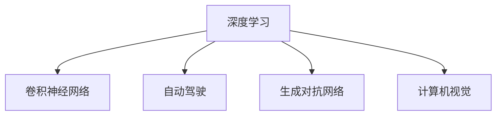

                 

# Andrej Karpathy谈AI的历史与未来

> 关键词：人工智能(AI),深度学习(Deep Learning),自动驾驶(Autonomous Driving),计算机视觉(Computer Vision),医疗影像(Medical Imaging)

## 1. 背景介绍

在AI领域，Andrej Karpathy无疑是一位颇有影响力的翘楚。作为一名深度学习专家和计算机视觉研究者，Karpathy曾在Google、OpenAI和特斯拉等顶级科技公司担任要职，并贡献了众多创新性的研究，如卷积神经网络(ConvNet)、自动驾驶等。本文将基于Andrej Karpathy的讲座、博客、论文等内容，深入探讨AI的历史与未来。

### 1.1 主要研究领域

Karpathy的研究跨越了多个领域，其核心专长在于计算机视觉、自动驾驶和深度学习。他提出的ConvNet架构，以其强大的图像识别和处理能力，成为现代计算机视觉技术的基石。而在自动驾驶领域，Karpathy领导的Tesla AI团队，成功开发了世界领先的自动驾驶系统，为AI在现实世界中的应用树立了新的标杆。此外，Karpathy还在医学影像分析、机器翻译、生成对抗网络(GANs)等领域做出了显著贡献，推动了AI技术的广泛应用和深入研究。

### 1.2 主要成就

Karpathy的学术成就丰硕，他作为共同作者或主要作者发表了数百篇高影响因子的论文，并多次获得计算机视觉领域最高级别的奖项，如IEEE的PAMI奖、ICCV的杰出论文奖等。他的讲座和博客文章，如《深度学习入门指南》、《机器学习讲座笔记》等，在学术界和工业界广泛流传，成为众多研究者和工程师的必读书目。此外，Karpathy还是《Deep Learning》一书的合著者，这本书被广泛认为是深度学习领域的经典教材。

## 2. 核心概念与联系

### 2.1 核心概念概述

在探讨AI的历史与未来之前，首先要理解几个核心概念：

- **深度学习(Deep Learning)**：一种基于神经网络结构的机器学习方法，通过多层次的非线性变换，实现对复杂数据的高级抽象和处理。
- **卷积神经网络(Convolutional Neural Networks, ConvNets)**：一种特殊的神经网络架构，用于处理图像、视频等高维数据的特征提取和分类。
- **自动驾驶(Autonomous Driving)**：利用AI技术，使车辆能够在无需人类干预的情况下自动行驶和导航，是AI技术在现实世界中的重要应用。
- **生成对抗网络(GANs)**：一种用于生成新样本的深度学习架构，通过训练一个生成器网络和一个判别器网络，在噪声驱动下生成逼真的图像、音频等内容。
- **计算机视觉(Computer Vision)**：研究如何让计算机理解图像和视频内容，包括图像分类、目标检测、图像分割等任务。

这些概念之间的联系通过以下Mermaid流程图展示：



这个流程图展示了深度学习在不同领域的广泛应用和其核心组件。

## 3. 核心算法原理 & 具体操作步骤

### 3.1 算法原理概述

AI技术的发展，主要基于以下几个关键原理：

- **神经网络结构**：通过构建多层次的神经网络，实现对数据的高阶抽象和特征提取。
- **反向传播算法**：一种通过梯度下降优化损失函数，自动更新网络参数的算法，是深度学习训练的核心。
- **卷积操作**：在图像、视频等高维数据上，通过卷积操作提取局部特征，提高模型性能。
- **优化算法**：如Adam、SGD等，通过调整学习率、动量等参数，优化模型训练过程。
- **数据增强**：通过旋转、缩放、翻转等操作，扩充训练集，提高模型泛化能力。
- **模型融合**：将多个模型的预测结果进行融合，提升最终性能。

这些原理共同构成了AI技术的核心框架，推动了深度学习算法的发展和应用。

### 3.2 算法步骤详解

AI算法的实现通常包括以下几个步骤：

**Step 1: 数据准备**
- 收集和预处理数据集，确保数据的多样性和完备性。
- 对图像、文本等数据进行清洗、归一化、标注等操作，为模型训练做准备。

**Step 2: 模型选择与初始化**
- 选择适合的模型架构，如ConvNet、LSTM等，并初始化模型参数。
- 设置模型的超参数，如学习率、批大小、迭代次数等。

**Step 3: 模型训练**
- 将数据集分为训练集、验证集和测试集，划分比例一般为7:1.5:1。
- 在训练集上使用反向传播算法进行模型训练，优化损失函数。
- 在验证集上监测模型性能，避免过拟合，调整超参数。
- 在测试集上评估模型性能，给出最终结果。

**Step 4: 模型优化与部署**
- 通过模型融合、数据增强等方法，提升模型性能。
- 对模型进行优化，如剪枝、量化、蒸馏等，提高模型推理速度。
- 将模型部署到实际应用中，进行实时推理和调用。

### 3.3 算法优缺点

AI算法的主要优点包括：

- 强大的特征提取能力：能够自动从原始数据中学习到高阶特征，适用于复杂问题的解决。
- 高泛化能力：通过大量数据训练，模型能够适应不同的数据分布，具备较好的泛化性能。
- 灵活性：算法可以适应多种数据类型和任务，广泛应用在图像、语音、自然语言处理等领域。

同时，也存在一些缺点：

- 模型复杂度高：神经网络参数量巨大，训练和推理速度较慢。
- 依赖大量数据：需要大量标注数据才能训练出高性能模型，数据获取成本高。
- 可解释性差：神经网络的结构和决策过程难以解释，缺乏透明性。
- 计算资源消耗大：深度学习训练和推理需要高性能计算设备，成本较高。

### 3.4 算法应用领域

AI算法在多个领域中得到广泛应用，以下是几个典型应用场景：

**计算机视觉**：
- 图像分类：如CNN用于识别图片中的物体。
- 目标检测：如RCNN、YOLO用于检测图片中的物体并标注位置。
- 图像分割：如U-Net用于对医学图像进行分割。

**自然语言处理(NLP)**：
- 机器翻译：如Transformer用于自动翻译文本。
- 文本分类：如BERT用于情感分析、主题分类等任务。
- 语音识别：如CTC用于自动识别语音内容。

**自动驾驶**：
- 感知融合：如CNN用于检测车辆、行人等道路障碍物。
- 路径规划：如强化学习用于优化驾驶路径。
- 自动导航：如LSTM用于预测车辆行驶轨迹。

## 4. 数学模型和公式 & 详细讲解 & 举例说明

### 4.1 数学模型构建

在AI领域，数学模型通常以神经网络为基础，通过损失函数、优化算法等进行训练和评估。以下以图像分类为例，介绍基本的数学模型构建。

**神经网络模型**：
$$
y=\sigma(Wx+b)
$$
其中 $x$ 为输入数据，$y$ 为输出标签，$W$ 和 $b$ 为模型参数，$\sigma$ 为激活函数。

**损失函数**：
$$
L(y, \hat{y})=\frac{1}{2}(y-\hat{y})^2
$$
其中 $y$ 为真实标签，$\hat{y}$ 为模型预测。

**优化算法**：
$$
W_{n+1}=W_n - \eta\nabla_L(W_n)
$$
其中 $W_n$ 为第 $n$ 次迭代后的模型参数，$\eta$ 为学习率，$\nabla_L$ 为损失函数对参数的梯度。

### 4.2 公式推导过程

以CNN为例，介绍其核心公式的推导过程：

**卷积操作**：
$$
f(x;w) = \sum_{i=1}^mf_i(x)*w_i
$$
其中 $f_i(x)$ 为卷积核，$w_i$ 为卷积核权重，$*$ 为卷积操作。

**池化操作**：
$$
f(x;w) = \max_i \{f_i(x) * w_i\}
$$
其中 $f_i(x)$ 为池化核，$w_i$ 为池化核权重，$\max$ 为池化操作。

**前向传播**：
$$
z^{(l)}=f(z^{(l-1)};w^{(l)})+b^{(l)}
$$
其中 $z^{(l)}$ 为第 $l$ 层的输出，$f(z^{(l-1)};w^{(l)})$ 为前向传播公式，$w^{(l)}$ 为第 $l$ 层权重，$b^{(l)}$ 为第 $l$ 层偏置。

**后向传播**：
$$
\frac{\partial L}{\partial z^{(l)}}=\sum_{i}\frac{\partial L}{\partial z^{(l+1)}}\frac{\partial z^{(l+1)}}{\partial z^{(l)}}=\frac{\partial L}{\partial z^{(l+1)}}*g^{(l)}
$$
其中 $g^{(l)}$ 为激活函数的梯度。

### 4.3 案例分析与讲解

以Karpathy在2016年发表的论文《A Fast R-CNN》为例，介绍其在计算机视觉领域的重要贡献：

**论文背景**：
Karpathy的团队在PASCAL VOC 2007数据集上进行了实验，展示了其在目标检测领域的突破性成果。

**关键技术**：
- 多尺度卷积特征提取：通过在多个尺度上进行特征提取，提高模型的鲁棒性。
- 快速区域特征提取：使用Fast R-CNN架构，将ROI池化层和分类层整合，显著提高推理速度。
- 区域提议算法：通过滑窗和尺度空间变换，生成候选区域，提高目标检测的准确率。

通过这些技术，Karpathy的团队在PASCAL VOC 2007数据集上取得了最优性能，并成为计算机视觉领域的重要里程碑。

## 5. 项目实践：代码实例和详细解释说明

### 5.1 开发环境搭建

在AI项目开发中，首先需要搭建开发环境。以下是使用Python和PyTorch搭建开发环境的详细步骤：

1. 安装Anaconda：从官网下载并安装Anaconda，用于创建独立的Python环境。

2. 创建并激活虚拟环境：
```bash
conda create -n ai-env python=3.8 
conda activate ai-env
```

3. 安装PyTorch：根据CUDA版本，从官网获取对应的安装命令。例如：
```bash
conda install pytorch torchvision torchaudio cudatoolkit=11.1 -c pytorch -c conda-forge
```

4. 安装TensorFlow：如果需要，从官网下载并安装TensorFlow。

5. 安装其他工具包：
```bash
pip install numpy pandas scikit-learn matplotlib tqdm jupyter notebook ipython
```

### 5.2 源代码详细实现

以下是一个简单的AI项目实现，以图像分类为例：

```python
import torch
import torch.nn as nn
import torchvision.transforms as transforms
from torchvision.datasets import CIFAR10
from torch.utils.data import DataLoader

# 定义模型结构
class ConvNet(nn.Module):
    def __init__(self):
        super(ConvNet, self).__init__()
        self.conv1 = nn.Conv2d(3, 32, 3, 1)
        self.pool = nn.MaxPool2d(2, 2)
        self.conv2 = nn.Conv2d(32, 64, 3, 1)
        self.fc1 = nn.Linear(64*64*64, 128)
        self.fc2 = nn.Linear(128, 10)

    def forward(self, x):
        x = self.pool(torch.relu(self.conv1(x)))
        x = self.pool(torch.relu(self.conv2(x)))
        x = x.view(-1, 64*64*64)
        x = torch.relu(self.fc1(x))
        x = self.fc2(x)
        return x

# 定义数据预处理
transform = transforms.Compose([
    transforms.ToTensor(),
    transforms.Normalize((0.5, 0.5, 0.5), (0.5, 0.5, 0.5))
])

# 加载数据集
train_dataset = CIFAR10(root='./data', train=True, transform=transform, download=True)
test_dataset = CIFAR10(root='./data', train=False, transform=transform, download=True)

# 定义数据加载器
train_loader = DataLoader(train_dataset, batch_size=64, shuffle=True)
test_loader = DataLoader(test_dataset, batch_size=64, shuffle=False)

# 定义模型和优化器
model = ConvNet()
criterion = nn.CrossEntropyLoss()
optimizer = torch.optim.SGD(model.parameters(), lr=0.001, momentum=0.9)

# 训练过程
for epoch in range(10):
    for i, (images, labels) in enumerate(train_loader):
        images = images.to(device)
        labels = labels.to(device)
        optimizer.zero_grad()
        outputs = model(images)
        loss = criterion(outputs, labels)
        loss.backward()
        optimizer.step()
        print('Epoch [{}/{}], Step [{}/{}], Loss: {:.4f}'
              .format(epoch+1, 10, i+1, len(train_loader), loss.item()))

# 评估模型
correct = 0
total = 0
with torch.no_grad():
    for images, labels in test_loader:
        images = images.to(device)
        labels = labels.to(device)
        outputs = model(images)
        _, predicted = torch.max(outputs.data, 1)
        total += labels.size(0)
        correct += (predicted == labels).sum().item()
print('Accuracy of the model on the 10000 test images: {} %'.format(100 * correct / total))
```

### 5.3 代码解读与分析

**数据预处理**：
- 使用 `transforms` 库对图像进行归一化处理，确保输入数据符合模型要求。
- `CIFAR10` 数据集自动下载和处理，无需手动干预。

**模型定义**：
- `ConvNet` 类定义了模型结构，包括卷积层、池化层和全连接层。
- 在 `forward` 方法中，通过多个卷积和池化操作提取特征，再通过全连接层进行分类。

**训练过程**：
- 定义交叉熵损失函数和优化器，使用 `SGD` 进行模型训练。
- 在每个epoch中，对训练集数据进行迭代，计算损失并更新模型参数。
- 在测试集中评估模型性能，输出准确率。

## 6. 实际应用场景

### 6.1 计算机视觉

在计算机视觉领域，AI技术已经广泛应用于图像识别、目标检测、图像分割等任务。例如，无人驾驶汽车中的计算机视觉系统，利用AI技术实现环境感知、障碍物检测和路径规划，保障行车安全。

### 6.2 自然语言处理(NLP)

在NLP领域，AI技术已经能够自动进行文本分类、情感分析、机器翻译等任务。例如，智能客服系统中，AI技术能够自动理解客户问题，并提供相应的解决方案，提升客户服务效率和体验。

### 6.3 自动驾驶

自动驾驶技术是AI在现实世界中的重要应用。通过AI技术，车辆能够自主感知道路环境，进行路径规划和驾驶决策，实现自动行驶和导航。特斯拉的Autopilot系统就是一个典型例子。

### 6.4 医疗影像

AI技术在医疗影像分析中应用广泛，如肺部CT图像分析、脑部MRI图像识别等。通过AI技术，医生可以更快地识别出病变区域，提高诊断准确率。

## 7. 工具和资源推荐

### 7.1 学习资源推荐

为了帮助开发者系统掌握AI技术，以下是几本经典的AI书籍和在线课程：

1. 《深度学习》（Ian Goodfellow等著）：全面介绍了深度学习的基本概念和应用，是AI领域的经典教材。

2. 《Python深度学习》（Francois Chollet著）：介绍了使用Keras框架进行深度学习开发的实践方法。

3. Coursera的《深度学习专项课程》：由斯坦福大学的Andrew Ng教授主讲，涵盖深度学习的多个重要主题。

4. Udacity的《自动驾驶纳米学位》：介绍了自动驾驶技术在AI中的应用，涵盖感知、控制等多个领域。

5. 《计算机视觉：算法与应用》（Richard Szeliski著）：详细介绍了计算机视觉的基础知识和应用场景。

### 7.2 开发工具推荐

以下是一些常用的AI开发工具和库：

1. PyTorch：深度学习框架，提供了动态计算图和丰富的GPU支持。

2. TensorFlow：由Google开发的深度学习框架，支持分布式计算和高效的模型部署。

3. OpenCV：计算机视觉库，提供了丰富的图像处理和分析工具。

4. NLTK：自然语言处理库，提供了文本处理、分词、词性标注等功能。

5. Keras：高级深度学习框架，提供了简单易用的API，支持多种深度学习模型。

### 7.3 相关论文推荐

以下是几篇AI领域的经典论文，推荐阅读：

1. AlexNet（2012）：ImageNet图像分类竞赛的冠军模型，标志着深度学习在计算机视觉领域的突破。

2. VGGNet（2014）：展示了通过增加卷积层数提升模型性能的方法，提出了VGGNet架构。

3. ResNet（2015）：提出了残差连接机制，解决了深度神经网络训练中的梯度消失问题。

4. Transformer（2017）：提出了一种基于自注意力机制的神经网络架构，显著提高了机器翻译任务的性能。

5. GANs（2014）：提出了生成对抗网络，实现了高逼真的图像生成。

## 8. 总结：未来发展趋势与挑战

### 8.1 研究成果总结

AI技术在过去几十年中取得了巨大进步，广泛应用于各个领域。以下是一些主要的研究成果：

- **计算机视觉**：图像分类、目标检测、图像分割等技术取得了显著进展。
- **自然语言处理**：机器翻译、情感分析、文本生成等任务取得了重要突破。
- **自动驾驶**：无人驾驶技术日趋成熟，特斯拉、Waymo等公司展示了实际应用。
- **医疗影像**：AI技术在医学影像分析中应用广泛，提高了诊断准确率。

### 8.2 未来发展趋势

未来AI技术的发展将呈现以下几个趋势：

1. **深度学习模型更大规模化**：随着算力提升和数据积累，深度学习模型的参数规模将进一步扩大，提升模型的泛化能力和性能。
2. **多模态学习**：AI技术将更加注重跨模态数据的融合，如视觉、语音、文本等多种数据类型的协同建模。
3. **自动化与可解释性**：AI系统将更加注重自动化和可解释性，使模型输出具备更高的透明性和可靠性。
4. **联邦学习**：在分布式环境中，通过联邦学习技术，实现模型参数的联合训练和优化，提升隐私保护和安全性。
5. **元学习与自适应学习**：研究如何使模型具备更好的学习和适应能力，提高模型在实际应用中的表现。

### 8.3 面临的挑战

尽管AI技术取得了巨大进展，但仍面临诸多挑战：

1. **数据隐私和安全**：大规模数据集的获取和使用带来了隐私和安全问题，需要通过联邦学习等技术解决。
2. **模型复杂性与可解释性**：深度学习模型复杂度高，难以解释其内部工作机制，需要通过可解释性技术提升模型的透明度。
3. **计算资源消耗**：深度学习训练和推理需要高性能计算设备，成本较高，需要通过模型压缩和优化技术降低资源消耗。
4. **跨领域迁移能力**：AI模型在不同领域之间的迁移能力有限，需要通过多任务学习和自监督学习技术提升模型的泛化能力。
5. **伦理与公平性**：AI模型在训练和使用过程中可能存在偏见和歧视，需要通过公平性技术提升模型的公正性。

### 8.4 研究展望

未来AI研究的方向包括：

1. **自动化与可解释性**：研究如何使AI系统具备更高的自动化和可解释性，提升模型的可靠性和透明性。
2. **跨领域迁移学习**：研究如何使AI模型在不同领域之间进行迁移，提升模型的泛化能力和适应性。
3. **联邦学习与分布式优化**：研究如何在分布式环境中进行模型训练和优化，提升模型的隐私保护和安全性。
4. **元学习和自适应学习**：研究如何使AI模型具备更好的学习和适应能力，提高模型在实际应用中的表现。
5. **多模态数据融合**：研究如何将视觉、语音、文本等多种数据类型进行融合，提升模型的综合能力。

## 9. 附录：常见问题与解答

**Q1：AI技术为何发展如此迅速？**

A: AI技术的发展迅速主要得益于以下几个因素：
1. **数据积累**：大规模数据集的积累为深度学习模型的训练提供了充足的训练样本。
2. **计算能力提升**：高性能计算设备（如GPU、TPU）使得深度学习模型的训练和推理速度大幅提升。
3. **算法创新**：深度学习算法的不断创新和改进，使得模型性能不断提高。
4. **跨学科融合**：计算机科学、数学、生物学等多学科的交叉融合，推动了AI技术的快速发展。

**Q2：AI技术有哪些潜在的风险和挑战？**

A: AI技术在发展过程中也面临诸多风险和挑战：
1. **数据隐私和安全**：大规模数据集的获取和使用带来了隐私和安全问题，需要通过联邦学习等技术解决。
2. **模型复杂性与可解释性**：深度学习模型复杂度高，难以解释其内部工作机制，需要通过可解释性技术提升模型的透明度。
3. **计算资源消耗**：深度学习训练和推理需要高性能计算设备，成本较高，需要通过模型压缩和优化技术降低资源消耗。
4. **跨领域迁移能力**：AI模型在不同领域之间的迁移能力有限，需要通过多任务学习和自监督学习技术提升模型的泛化能力。
5. **伦理与公平性**：AI模型在训练和使用过程中可能存在偏见和歧视，需要通过公平性技术提升模型的公正性。

**Q3：未来AI技术的发展方向有哪些？**

A: 未来AI技术的发展方向包括：
1. **深度学习模型更大规模化**：随着算力提升和数据积累，深度学习模型的参数规模将进一步扩大，提升模型的泛化能力和性能。
2. **多模态学习**：AI技术将更加注重跨模态数据的融合，如视觉、语音、文本等多种数据类型的协同建模。
3. **自动化与可解释性**：AI系统将更加注重自动化和可解释性，使模型输出具备更高的透明性和可靠性。
4. **联邦学习**：在分布式环境中，通过联邦学习技术，实现模型参数的联合训练和优化，提升隐私保护和安全性。
5. **元学习与自适应学习**：研究如何使模型具备更好的学习和适应能力，提高模型在实际应用中的表现。

总之，未来AI技术将更加智能化、自动化和可解释，在各个领域中发挥更大的作用，推动人类社会的进步和发展。

---

作者：禅与计算机程序设计艺术 / Zen and the Art of Computer Programming

