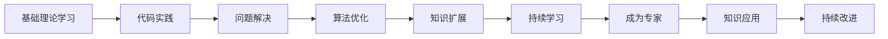

                 

# Andrej Karpathy：1 万小时定律的魔力

> 关键词：深度学习, 1 万小时定律, 专家水平, 学习和技术, 实践经验

## 1. 背景介绍

### 1.1 问题由来
近年来，深度学习在计算机视觉、自然语言处理等领域取得了飞速的发展。通过对大规模数据集的训练，深度神经网络已经能够实现超越人类水平的性能。然而，即使拥有相同的算法和数据，不同人的学习效果却大相径庭。到底是什么因素决定了一个人能否成为该领域的专家？

### 1.2 问题核心关键点
Andrej Karpathy是一位计算机视觉领域的顶尖专家，他在深度学习领域的诸多贡献和成就，让人们对其背后的方法论和实践经验产生了浓厚的兴趣。在他的众多博客文章和访谈中，Karpathy多次提到过“1 万小时定律”这一概念，并强调了在深度学习领域，长时间、有目标的持续学习对成为专家的重要性。本文将深入探讨这一概念，并结合Karpathy的实践经验，探究其在深度学习领域的具体应用。

### 1.3 问题研究意义
了解“1 万小时定律”对深度学习领域专家的培养机制具有重要意义。研究这一定律不仅有助于指导学习者制定有效的学习计划，还能为教育机构和企业提供更好的培训策略。通过深入分析Karpathy的成长历程，我们或许能找到成为领域专家的一些普遍规律，为未来的学习和研究提供借鉴。

## 2. 核心概念与联系

### 2.1 核心概念概述

“1 万小时定律”最初由心理学家Anders Ericsson提出，指的是要想成为某一领域的专家，需要投入至少10,000小时的实践时间。在深度学习领域，这一概念可以理解为通过大量的实践和持续学习，积累丰富的经验和直觉，从而实现对复杂问题的快速解决和创新。

Karpathy在其博客中多次提到，成为专家不仅仅是掌握一些理论知识，更重要的是在实际应用中的经验积累。在深度学习领域，这一过程涉及大量的代码编写、模型调试和算法优化，需要极高的耐心和毅力。

### 2.2 核心概念原理和架构的 Mermaid 流程图



这个流程图展示了深度学习领域专家的培养过程，从基础理论学习开始，到通过代码实践解决问题，再到算法优化和知识扩展，最终实现持续学习和成为专家，最后通过实践应用进行持续改进。

## 3. 核心算法原理 & 具体操作步骤
### 3.1 算法原理概述

深度学习的核心算法包括前馈神经网络、卷积神经网络、循环神经网络等，这些算法通过大量的数据训练来优化模型的参数，从而实现对复杂问题的快速解决。然而，要想成为深度学习领域的专家，仅掌握这些算法是不够的，更重要的是如何将这些算法应用于实际问题，并不断优化和改进。

### 3.2 算法步骤详解

深度学习专家培养的过程可以大致分为以下几步：

**Step 1: 基础理论学习**
- 理解深度学习的基本原理和常见算法。
- 学习数学基础，包括线性代数、概率论和统计学等。
- 掌握Python编程和深度学习框架，如TensorFlow或PyTorch。

**Step 2: 代码实践**
- 参与开源项目，积累实际开发经验。
- 编写和调试代码，熟悉常见的模型结构和优化技术。
- 分析实际数据集，解决数据预处理和特征工程问题。

**Step 3: 问题解决**
- 探索实际应用场景，确定需要解决的问题。
- 设计算法，选择合适的模型结构。
- 在实际数据上训练和测试模型，调整参数以优化性能。

**Step 4: 算法优化**
- 学习新的算法和优化技术，如正则化、批标准化等。
- 研究深度学习的前沿研究，关注最新的研究成果和趋势。
- 参与学术会议和技术交流，了解最新的应用案例和成功经验。

**Step 5: 知识扩展**
- 阅读深度学习领域的经典书籍和论文。
- 学习其他领域的知识，如计算机视觉、自然语言处理等。
- 尝试跨领域应用，将深度学习应用于不同的场景。

**Step 6: 持续学习**
- 不断实践和优化，积累经验并形成自己的独特见解。
- 参与社区讨论和竞赛，与其他专家交流和合作。
- 定期回顾和总结，不断改进自己的学习和研究方法。

### 3.3 算法优缺点

**优点：**
- 能够通过大量的实践，积累丰富的经验和直觉，实现对复杂问题的快速解决。
- 持续学习可以不断优化模型，提升性能和效率。
- 学习过程中的问题解决和算法优化，有助于培养创新能力和批判性思维。

**缺点：**
- 投入时间成本高，需要有长期坚持的准备。
- 对问题解决和技术积累的深度要求较高，需要面对复杂的算法和数据处理。
- 需要具备较高的编程和数学基础，门槛较高。

### 3.4 算法应用领域

“1 万小时定律”不仅适用于深度学习领域，对于其他技术领域的学习也同样适用。在软件开发、数据科学、人工智能等众多领域，通过长时间的持续学习和实践，都能够培养出优秀的专家。Karpathy本人在计算机视觉领域的应用，展示了这一定律的强大魔力。

## 4. 数学模型和公式 & 详细讲解 & 举例说明

### 4.1 数学模型构建

深度学习模型的构建通常包括以下几个步骤：

1. 数据预处理：将原始数据转换为模型能够处理的形式。
2. 构建模型：选择合适的模型结构，如全连接网络、卷积网络等。
3. 训练模型：通过反向传播算法优化模型参数。
4. 测试模型：在测试集上评估模型性能。

### 4.2 公式推导过程

以卷积神经网络(CNN)为例，常见的卷积层公式如下：

$$
y = \sigma\left( \mathbf{W} * \mathbf{X} + \mathbf{b} \right)
$$

其中，$y$表示卷积层的输出，$\mathbf{X}$表示输入图像，$\mathbf{W}$表示卷积核，$\mathbf{b}$表示偏置项，$\sigma$表示激活函数。

通过反向传播算法，可以计算模型参数的梯度，从而更新模型的权重和偏置项。具体公式如下：

$$
\frac{\partial \mathcal{L}}{\partial \mathbf{W}} = \frac{\partial \mathcal{L}}{\partial y} \cdot \frac{\partial y}{\partial \mathbf{X}} \cdot \frac{\partial \mathbf{X}}{\partial \mathbf{W}}
$$

其中，$\mathcal{L}$表示损失函数。

### 4.3 案例分析与讲解

以Karpathy在计算机视觉领域的经典工作——ImageNet大规模视觉识别竞赛为例，他们使用了深度卷积神经网络，并进行了大规模的模型训练。通过不断地优化算法和调整参数，最终实现了超过人类水平的识别性能。

## 5. 项目实践：代码实例和详细解释说明

### 5.1 开发环境搭建

- 安装Python：推荐使用Python 3.6或以上版本。
- 安装PyTorch：通过pip安装，命令为 `pip install torch torchvision`。
- 安装Jupyter Notebook：通过pip安装，命令为 `pip install jupyter notebook`。

### 5.2 源代码详细实现

以下是一个简单的卷积神经网络实现示例：

```python
import torch
import torch.nn as nn
import torch.optim as optim

# 定义卷积神经网络模型
class CNN(nn.Module):
    def __init__(self):
        super(CNN, self).__init__()
        self.conv1 = nn.Conv2d(3, 32, 3, 1, 1)
        self.conv2 = nn.Conv2d(32, 64, 3, 1, 1)
        self.dropout1 = nn.Dropout(0.25)
        self.dropout2 = nn.Dropout(0.5)
        self.fc1 = nn.Linear(9216, 128)
        self.fc2 = nn.Linear(128, 10)

    def forward(self, x):
        x = self.conv1(x)
        x = nn.ReLU()(x)
        x = self.conv2(x)
        x = nn.ReLU()(x)
        x = nn.MaxPool2d(2)(x)
        x = self.dropout1(x)
        x = torch.flatten(x, 1)
        x = self.fc1(x)
        x = nn.ReLU()(x)
        x = self.dropout2(x)
        x = self.fc2(x)
        output = nn.LogSoftmax(dim=1)(x)
        return output

# 训练模型
model = CNN()
criterion = nn.CrossEntropyLoss()
optimizer = optim.Adam(model.parameters(), lr=0.001)
for epoch in range(10):
    running_loss = 0.0
    for i, data in enumerate(trainloader, 0):
        inputs, labels = data
        optimizer.zero_grad()
        outputs = model(inputs)
        loss = criterion(outputs, labels)
        loss.backward()
        optimizer.step()
        running_loss += loss.item()
    print(f'Epoch {epoch+1}, loss: {running_loss/len(trainloader)}')
```

### 5.3 代码解读与分析

- `nn.Conv2d`：定义卷积层。
- `nn.ReLU`：定义激活函数。
- `nn.MaxPool2d`：定义池化层。
- `nn.LogSoftmax`：定义输出层的softmax函数。
- `nn.CrossEntropyLoss`：定义交叉熵损失函数。
- `optim.Adam`：定义优化器。

### 5.4 运行结果展示

在实际训练中，可以通过调整学习率、批大小、训练轮数等超参数，观察模型的训练效果。例如，通过绘制损失函数随训练轮数的变化曲线，可以直观地观察模型的收敛情况。

## 6. 实际应用场景

### 6.1 智能驾驶
智能驾驶系统需要处理大量的传感器数据，实现对车辆周围环境的实时感知和决策。通过深度学习算法，可以实现对图像、激光雷达数据的处理，从而实现自动驾驶。

Karpathy所在的团队OpenAI开发了OpenAI Five，这是一种基于深度学习的多人合作游戏AI，通过大量的训练和优化，实现了接近人类水平的决策能力。在智能驾驶领域，类似的深度学习模型可以应用于道路环境识别、障碍物检测、路径规划等任务。

### 6.2 医疗影像分析
医疗影像分析需要处理大量的医学影像数据，实现对病变区域的定位和分析。通过深度学习算法，可以实现对医学影像的自动标注和诊断。

Karpathy在深度学习领域的研究，对医疗影像分析也有重要影响。例如，他参与的DeepMind项目DeepMind AlphaGo，使用深度学习算法实现了国际象棋和围棋的自动对弈，展示了深度学习在复杂决策问题上的强大能力。这种能力可以应用于医疗影像分析，实现对病变区域的自动检测和分类。

### 6.3 金融数据分析
金融数据分析需要处理大量的市场数据，实现对投资策略和风险管理的优化。通过深度学习算法，可以实现对市场趋势的预测和风险评估。

Karpathy在计算机视觉领域的研究，对金融数据分析也有重要借鉴意义。例如，他参与的DeepMind项目DeepMind AlphaGo，展示了深度学习在复杂决策问题上的强大能力。在金融数据分析中，类似的深度学习模型可以应用于市场趋势预测、风险评估、投资策略优化等任务。

## 7. 工具和资源推荐

### 7.1 学习资源推荐

- 《深度学习》一书：Ian Goodfellow、Yoshua Bengio和Aaron Courville合著，是深度学习领域的经典教材。
- 《Python深度学习》一书：Francois Chollet著，介绍了TensorFlow和Keras的使用方法。
- Kaggle平台：提供了大量的数据集和比赛，是深度学习学习的绝佳资源。

### 7.2 开发工具推荐

- Jupyter Notebook：提供了一个交互式的编程环境，便于调试和记录代码。
- TensorBoard：提供了一个可视化的工具，可以实时监测模型训练状态。
- Git版本控制系统：便于代码的协作和版本管理。

### 7.3 相关论文推荐

- 《ImageNet Classification with Deep Convolutional Neural Networks》：Alex Krizhevsky、Ilya Sutskever和Geoffrey Hinton在2012年提出的经典论文，展示了深度卷积神经网络在ImageNet大规模视觉识别竞赛中的强大能力。
- 《Learning to Trust CNNs for Visual Recognition》：Karpathy等人发表的论文，展示了深度卷积神经网络在计算机视觉领域的广泛应用。
- 《Playing Atari with Deep Reinforcement Learning》：DeepMind团队在2013年发表的论文，展示了深度学习在复杂决策问题上的强大能力。

## 8. 总结：未来发展趋势与挑战

### 8.1 研究成果总结

深度学习领域的研究不断取得突破，推动了计算机视觉、自然语言处理、智能驾驶等多个领域的快速发展。通过长时间、有目标的持续学习，积累丰富的经验和直觉，实现对复杂问题的快速解决和创新，是成为一名深度学习专家的重要路径。

### 8.2 未来发展趋势

- 深度学习领域将继续快速发展，新技术和新方法不断涌现。
- 跨领域应用将更加广泛，深度学习将与其他技术结合，推动更多领域的创新。
- 持续学习和知识扩展将越来越重要，有助于保持技术的前沿性和竞争力。

### 8.3 面临的挑战

- 深度学习模型越来越复杂，需要更高的计算资源和更长的训练时间。
- 深度学习模型的可解释性不足，需要进一步提高模型的透明度和可解释性。
- 深度学习模型的偏见和鲁棒性问题，需要更多的研究和优化。

### 8.4 研究展望

- 深入研究深度学习模型的可解释性，提高模型的透明度和可解释性。
- 开发更加高效和鲁棒的深度学习模型，提高模型的可靠性和泛化能力。
- 推动跨领域应用的深入研究，实现深度学习与其他技术的深度融合。

## 9. 附录：常见问题与解答

**Q1: 如何提高深度学习模型的可解释性？**

A: 提高深度学习模型的可解释性，可以通过以下方法：
- 使用可视化工具，如TensorBoard，展示模型内部的激活和梯度信息。
- 使用注意力机制，展示模型在处理输入数据时的重点关注区域。
- 使用特征提取方法，分析模型的特征表示。

**Q2: 如何优化深度学习模型的训练过程？**

A: 优化深度学习模型的训练过程，可以通过以下方法：
- 使用学习率调度策略，如学习率衰减、warmup等，逐步调整学习率。
- 使用数据增强技术，如随机裁剪、旋转等，扩充训练数据集。
- 使用正则化技术，如L2正则、Dropout等，防止过拟合。

**Q3: 如何处理深度学习模型的高计算需求？**

A: 处理深度学习模型的高计算需求，可以通过以下方法：
- 使用GPU或TPU等高性能设备，加速计算过程。
- 使用混合精度训练，减少计算资源的消耗。
- 使用模型压缩和稀疏化存储，优化模型的内存占用。

**Q4: 如何在深度学习领域持续学习？**

A: 在深度学习领域持续学习，可以通过以下方法：
- 定期回顾和总结，不断改进自己的学习和研究方法。
- 参与社区讨论和竞赛，与其他专家交流和合作。
- 阅读最新论文和书籍，关注最新的研究成果和趋势。

总之，深度学习领域的学习和发展是一个持续的过程，需要不断地探索和实践。通过长时间的持续学习和实践，积累丰富的经验和直觉，实现对复杂问题的快速解决和创新，是成为一名深度学习专家的重要路径。

---

作者：禅与计算机程序设计艺术 / Zen and the Art of Computer Programming

